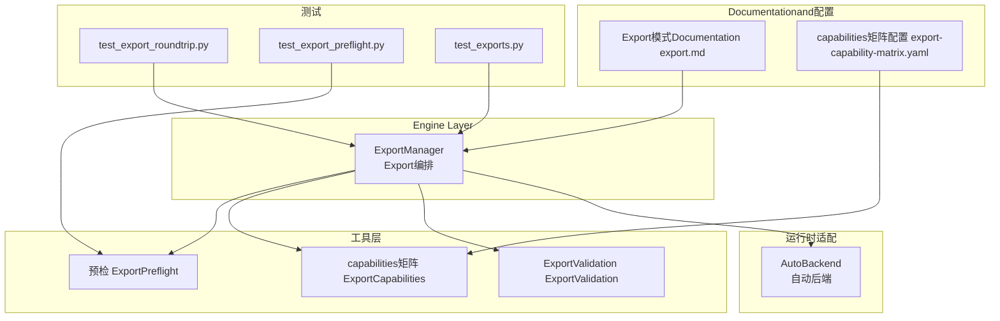
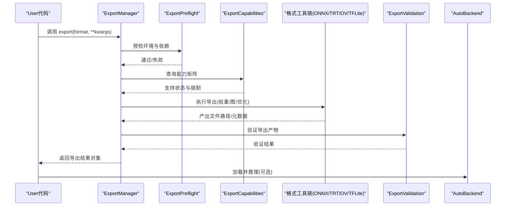
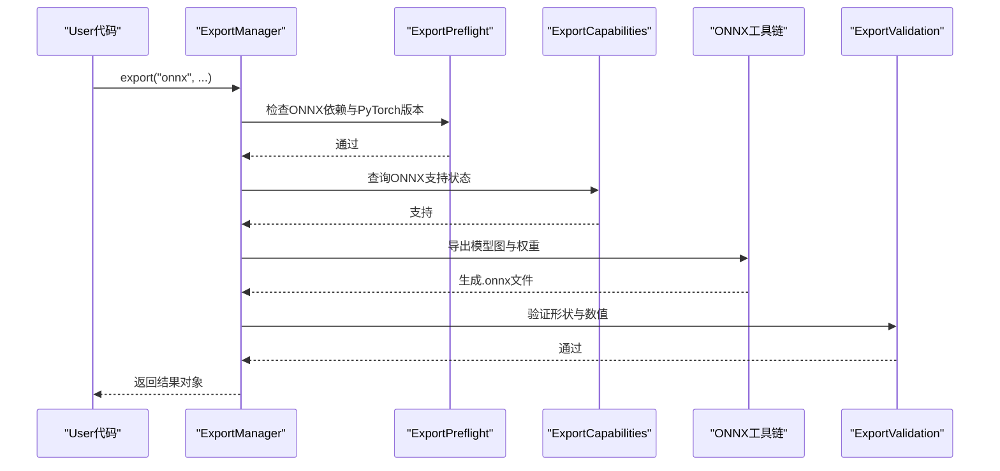
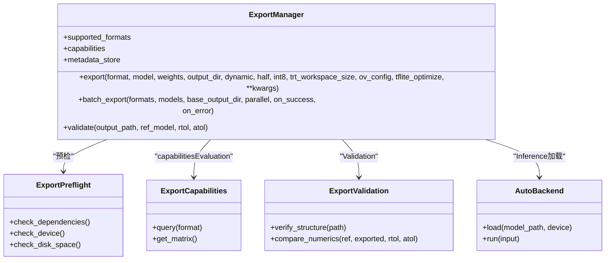

# ExportUtilities API

<cite>
**Files Referenced in This Document**
- [exporter.py](file://ultralytics/engine/exporter.py)
- [export_validation.py](file://ultralytics/utils/export_validation.py)
- [export_preflight.py](file://ultralytics/utils/export_preflight.py)
- [export_capabilities.py](file://ultralytics/utils/export_capabilities.py)
- [autobackend.py](file://ultralytics/nn/autobackend.py)
- [export.md](file://docs/en/modes/export.md)
- [export-capability-matrix.yaml](file://ultralytics/cfg/export-capability-matrix.yaml)
- [test_export_roundtrip.py](file://tests/test_export_roundtrip.py)
- [test_export_preflight.py](file://tests/test_export_preflight.py)
- [test_exports.py](file://tests/test_exports.py)
</cite>

## Table of Contents
1. [Introduction](#Introduction)
2. [Project Structure](#Project Structure)
3. [Core Components](#Core Components)
4. [Architecture Overview](#Architecture Overview)
5. [Detailed Component Analysis](#Detailed Component Analysis)
6. [Dependency Analysis](#Dependency Analysis)
7. [性能andOptimization建议](#性能andOptimization建议)
8. [Troubleshooting Guide](#Troubleshooting Guide)
9. [Conclusion](#Conclusion)
10. [Appendix](#Appendix)

## Introduction
本文件targetingYOLO-Master的ExportUtilities API，聚焦于ExportManager类and其相关capabilities，系统化说明Supporting的Export格式（ONNX、TensorRT、OpenVINO、TFLiteetc.）、配置选项、export()方法的参数规范、返回值and错误处理机制；并给出批量Exportand自定义Export流程Examples、ExportValidationand兼容性检查、内存OptimizationandGPU加速配置指南，Centered onandExport文件的结构and元数据管理说明。Documentation同时providesVisualization图表帮助理解系统架构and关键Calls链。

## Project Structure
Export功能主要分布whileCentered on下Modules：
- Engine Layer：Export编排and流程控制
- 工具层：预检、capabilities矩阵、Validation
- 运行时适配：自动后端选择andInference加载
- Documentationand配置：Export模式Documentationandcapabilities矩阵配置
- 测试：端to端Exportand往返一致性校验

Figure Source
- [exporter.py:1-200](file://ultralytics/engine/exporter.py#L1-L200)
- [export_preflight.py:1-200](file://ultralytics/utils/export_preflight.py#L1-L200)
- [export_capabilities.py:1-200](file://ultralytics/utils/export_capabilities.py#L1-L200)
- [export_validation.py:1-200](file://ultralytics/utils/export_validation.py#L1-L200)
- [autobackend.py:1-200](file://ultralytics/nn/autobackend.py#L1-L200)
- [export.md:1-200](file://docs/en/modes/export.md#L1-L200)
- [export-capability-matrix.yaml:1-200](file://ultralytics/cfg/export-capability-matrix.yaml#L1-L200)
- [test_export_roundtrip.py:1-200](file://tests/test_export_roundtrip.py#L1-L200)
- [test_export_preflight.py:1-200](file://tests/test_export_preflight.py#L1-L200)
- [test_exports.py:1-200](file://tests/test_exports.py#L1-L200)

Section Source
- [exporter.py:1-200](file://ultralytics/engine/exporter.py#L1-L200)
- [export.md:1-200](file://docs/en/modes/export.md#L1-L200)
- [export-capability-matrix.yaml:1-200](file://ultralytics/cfg/export-capability-matrix.yaml#L1-L200)

## Core Components
- ExportManager：Export流程的Unified entry point，负责参数解析、格式路由、工具链Calls、结果组织and返回。
- ExportPreflight：Export前环境、依赖and模型兼容性检查，避免运行期失败。
- ExportCapabilities：基于配置的capabilities矩阵，判断各格式while当前平台/设备上的Supporting情况。
- ExportValidation：Export产物Validation（such as形状、数值范围、关键算子存while性）and回归对比。
- AutoBackend：根据目标格式and设备自动选择Inference后端，统一加载and执行接口。

Section Source
- [exporter.py:1-200](file://ultralytics/engine/exporter.py#L1-L200)
- [export_preflight.py:1-200](file://ultralytics/utils/export_preflight.py#L1-L200)
- [export_capabilities.py:1-200](file://ultralytics/utils/export_capabilities.py#L1-L200)
- [export_validation.py:1-200](file://ultralytics/utils/export_validation.py#L1-L200)
- [autobackend.py:1-200](file://ultralytics/nn/autobackend.py#L1-L200)

## Architecture Overview
Export流程从ExportManager发起，经预检andcapabilitiesEvaluation后，按目标格式进入对应工具链（ONNX Runtime、TensorRT、OpenVINO、TFLiteetc.），完成后进行Validationand元数据写入，最终由AutoBackendwhileInference阶段按需加载。

Figure Source
- [exporter.py:1-200](file://ultralytics/engine/exporter.py#L1-L200)
- [export_preflight.py:1-200](file://ultralytics/utils/export_preflight.py#L1-L200)
- [export_capabilities.py:1-200](file://ultralytics/utils/export_capabilities.py#L1-L200)
- [export_validation.py:1-200](file://ultralytics/utils/export_validation.py#L1-L200)
- [autobackend.py:1-200](file://ultralytics/nn/autobackend.py#L1-L200)

## Detailed Component Analysis

### ExportManager 类and方法
- 职责
  - 统一接收Export请求，解析并规范化参数
  - drivers are installed预检、capabilitiesEvaluation、格式化工具链Calls
  - 组织Export产物and元数据，返回标准化结果
  - provides批量Exportand回调扩展点
- 关键方法
  - export(format, model, weights, output_dir, dynamic, half, int8, trt_workspace_size, ov_config, tflite_optimize, **kwargs)
    - format：目标格式（onnx、tensorrt、openvino、tfliteetc.）
    - model：已加载的模型实例或可被Export的对象
    - weights：权重路径或模型权重对象
    - output_dir：Export输出Table of Contents
    - dynamic：是否启用动态输入维度
    - half/int8：半精度/整型量化开关
    - trt_workspace_size：TensorRT工作空间大小（MB）
    - ov_config：OpenVINO运行时配置字典
    - tflite_optimize：TFLiteOptimization策略（such asoptimize、target_spec）
    - kwargs：其他格式特定参数
  - batch_export(formats, models, base_output_dir, parallel=False, on_success=None, on_error=None)
    - formats：格式列表
    - models：模型列表或映射
    - parallel：是否并行Export
    - on_success/on_error：成功/失败回调
  - validate(output_path, ref_model=None, rtol=1e-3, atol=1e-4)
    - 对Export产物进行基本Validationand数值对比
- 属性
  - supported_formats：当前平台Supporting的目标格式集合
  - capabilities：capabilities矩阵快照（来自ExportCapabilities）
  - metadata_store：Export元数据存储句柄
- 返回值
  - 标准ExportResults Object，包含：
    - status：成功/失败
    - paths：各格式产物的文件路径
    - metadata：版本、输入形状、设备、Optimization信息etc.
    - errors：错误信息（such as有）
- 错误处理
  - 预检失败：抛出明确的环境/依赖缺失异常
  - capabilities不Supporting：Tips不可用并给出替代方案
  - 工具链异常：捕获并包装for统一错误类型，附带上下文
  - Validation失败：返回Validation报告and差异摘要

Section Source
- [exporter.py:1-200](file://ultralytics/engine/exporter.py#L1-L200)
- [export_validation.py:1-200](file://ultralytics/utils/export_validation.py#L1-L200)
- [export_preflight.py:1-200](file://ultralytics/utils/export_preflight.py#L1-L200)
- [export_capabilities.py:1-200](file://ultralytics/utils/export_capabilities.py#L1-L200)

#### Export流程时序（Centered onONNXfor例）

Figure Source
- [exporter.py:1-200](file://ultralytics/engine/exporter.py#L1-L200)
- [export_preflight.py:1-200](file://ultralytics/utils/export_preflight.py#L1-L200)
- [export_capabilities.py:1-200](file://ultralytics/utils/export_capabilities.py#L1-L200)
- [export_validation.py:1-200](file://ultralytics/utils/export_validation.py#L1-L200)

### Export格式andOptimization工具链
- ONNX
  - 特点：跨框架通用中间表示，生态完善，便于后续转换
  - Optimization：动态形状、算子融合、常量折叠
  - 适用：多后端部署、二次转换（TRT/OV/TFLite）
- TensorRT
  - 特点：NVIDIA GPU高性能Inference，低延迟高吞吐
  - Optimization：层融合、内核自动调优、FP16/INT8量化、工作空间Optimization
  - 适用：NVIDIA GPU服务器/边缘设备
- OpenVINO
  - 特点：Intel CPU/GPU/VPUOptimization，广泛硬件Supporting
  - Optimization：IR模型、图级Optimization、量化、异步Inference
  - 适用：Intel平台and多种加速器
- TFLite
  - 特点：移动端/嵌入式友好，轻量运行时
  - Optimization：量化、算子定制、CPU/GPU/NPU加速
  - 适用：Android/iOS/微控制器

Section Source
- [export.md:1-200](file://docs/en/modes/export.md#L1-L200)
- [export-capability-matrix.yaml:1-200](file://ultralytics/cfg/export-capability-matrix.yaml#L1-L200)

### 批量Exportand自定义Export流程
- 批量Export
  - Usesbatch_export一次性Export多个模型to多个格式
  - Supporting并行执行and回调钩子，便于进度上报and错误收集
- 自定义Export
  - Viaon_success/on_error回调implementingLogging、Metrics记录
  - Combiningvalidate进行自动化质量门禁
  - 组合不同Optimization参数形成流水线化ExportTasks

Section Source
- [exporter.py:1-200](file://ultralytics/engine/exporter.py#L1-L200)
- [test_export_roundtrip.py:1-200](file://tests/test_export_roundtrip.py#L1-L200)

### ExportValidationand兼容性检查
- 预检（ExportPreflight）
  - 检查Python/PyTorch版本、第三方库可用性、磁盘空间、设备capabilities
  - 针对目标格式进行依赖and特性检测
- capabilities矩阵（ExportCapabilities）
  - 基于配置文件判定当前环境的Exportcapabilities
  - provides“Supporting/部分Supporting/不Supporting”的状态and限制说明
- Validation（ExportValidation）
  - 结构Validation：文件完整性、元数据字段齐全
  - 数值Validation：andRefer to模型进行近似对比（相对/绝对容差）
  - 回归测试：whileTest Suite中保证Export稳定性

Section Source
- [export_preflight.py:1-200](file://ultralytics/utils/export_preflight.py#L1-L200)
- [export_capabilities.py:1-200](file://ultralytics/utils/export_capabilities.py#L1-L200)
- [export_validation.py:1-200](file://ultralytics/utils/export_validation.py#L1-L200)
- [test_export_preflight.py:1-200](file://tests/test_export_preflight.py#L1-L200)
- [test_export_roundtrip.py:1-200](file://tests/test_export_roundtrip.py#L1-L200)

### 内存OptimizationandGPU加速配置指南
- 内存Optimization
  - 关闭不必要的调试andLogging
  - Set appropriatelybatchand动态维度，避免过大张量分配
  - Uses半精度/整型量化减少显存占用
- GPU加速
  - TensorRT：调整workspace大小、启用FP16/INT8、固定输入形状Centered on提升编译效率
  - OpenVINO：选择合适的执行设备（CPU/GPU/VPU），开启异步Inference
  - TFLite：启用GPU/NPU插件，选择合适Optimization策略
- 资源监控
  - whileExport前后采集内存andGPU利用率，定位bottlenecks
  - CombiningValidation结果and性能基准进行迭代Optimization

Section Source
- [export.md:1-200](file://docs/en/modes/export.md#L1-L200)
- [export-capability-matrix.yaml:1-200](file://ultralytics/cfg/export-capability-matrix.yaml#L1-L200)

### Export文件结构and元数据管理
- 文件结构
  - 每个格式产物独立存放，命名包含模型名、格式、Optimization标记
  - 辅助文件：配置文件、校准表（量化）、运行时脚本（Optional）
- 元数据
  - 版本信息：模型版本、Export工具版本、依赖版本
  - 输入规格：形状、数据类型、归一化方式
  - 设备andOptimization：目标设备、量化策略、工作空间大小
  - 校验信息：哈希值、Validation结果、时间戳
- 管理建议
  - Uses统一的元数据存储句柄集中管理
  - Export成功后立即写入元数据，确保一致性
  - provides读取接口供Inferenceand评测工具消费

Section Source
- [exporter.py:1-200](file://ultralytics/engine/exporter.py#L1-L200)
- [export_validation.py:1-200](file://ultralytics/utils/export_validation.py#L1-L200)

## Dependency Analysis
- 组件耦合
  - ExportManager强依赖预检、capabilities矩阵andValidationModules
  - 各格式工具链Via抽象接口接入，降低耦合度
  - AutoBackendwhileInference阶段解耦具体后端implementing
- External Dependencies
  - PyTorch、ONNX、TensorRT、OpenVINO、TFLiteetc.运行时and工具包
  - 平台capabilities（CUDA、Intel MKL、ARM NNetc.）
- 循环依赖
  - ExportandInference分离，避免循环引用
- 接口契约
  - ExportResults Objectand元数据字段稳定，便于上下游集成

Figure Source
- [exporter.py:1-200](file://ultralytics/engine/exporter.py#L1-L200)
- [export_preflight.py:1-200](file://ultralytics/utils/export_preflight.py#L1-L200)
- [export_capabilities.py:1-200](file://ultralytics/utils/export_capabilities.py#L1-L200)
- [export_validation.py:1-200](file://ultralytics/utils/export_validation.py#L1-L200)
- [autobackend.py:1-200](file://ultralytics/nn/autobackend.py#L1-L200)

Section Source
- [exporter.py:1-200](file://ultralytics/engine/exporter.py#L1-L200)
- [autobackend.py:1-200](file://ultralytics/nn/autobackend.py#L1-L200)

## 性能andOptimization建议
- Export阶段
  - Prefer静态形状Centered on获得更好的编译器Optimization效果
  - Set appropriately量化and半精度，平衡精度and速度
  - 利用capabilities矩阵选择最优后端and参数
- Inference阶段
  - UsesAutoBackend自动选择最佳后端
  - 预热模型，减少首次Inference开销
  - 批处理and异步Inference提升吞吐

[This section provides general guidance and does not directly analyze specific files]

## Troubleshooting Guide
- 常见错误
  - 依赖缺失：安装对应运行时and工具包
  - 设备不匹配：确认CUDA/OpenVINO/TFLite插件可用
  - 动态形状不Supporting：改for静态形状或降级to兼容模式
  - 量化失败：检查校准数据集and算子Supporting
- 诊断步骤
  - 启用预检Logging，查看具体失败原因
  - UsesValidationModules输出差异报告
  - 回退to基础Export（无Optimization）逐步定位问题
- 回归测试
  - UsesTest Suite中的往返一致性用例复现问题
  - 对比历史Export产物，识别变更影响

Section Source
- [test_export_preflight.py:1-200](file://tests/test_export_preflight.py#L1-L200)
- [test_export_roundtrip.py:1-200](file://tests/test_export_roundtrip.py#L1-L200)
- [test_exports.py:1-200](file://tests/test_exports.py#L1-L200)

## Conclusion
ExportManagerforYOLO-MasterExportcapabilities的Unified entry point，Combining预检、capabilities矩阵andValidationModules，provides稳定、可扩展的Export体验。Via合理的Optimization配置and批量流程，可while多平台and多设备上高效完成模型部署准备。建议while生产环境中Combining自动化Validationand回归测试，确保Export质量and一致性。

[This section is summary content and does not directly analyze specific files]

## Appendix
- 术语
  - Export：将Training好的模型转换for可部署的中间或目标格式
  - 预检：whileExport前检查环境and依赖
  - capabilities矩阵：描述平台/设备对不同格式的Supporting情况
  - Validation：对Export产物进行结构and数值校验
- Refer to
  - Export模式Documentationandcapabilities矩阵配置用于了解各格式的详细参数and限制

[本节for补充信息，不直接分析具体文件]