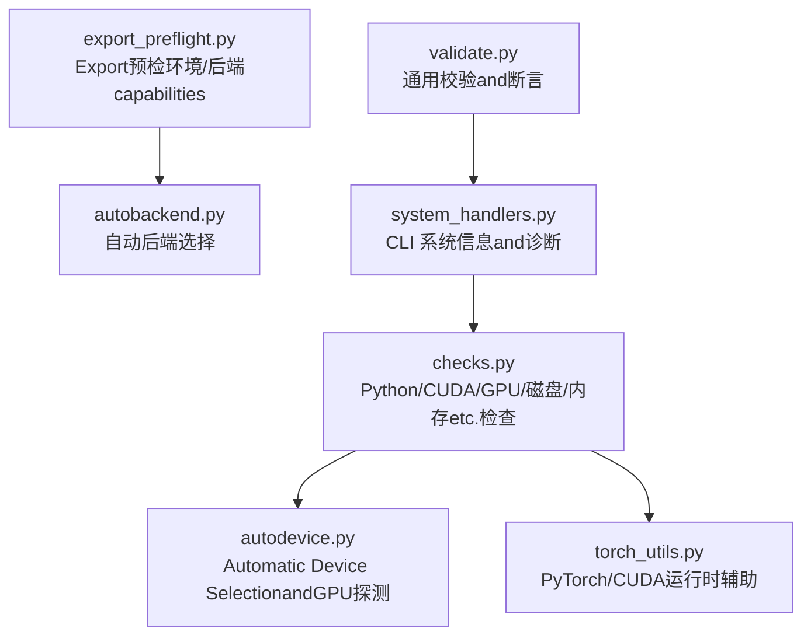
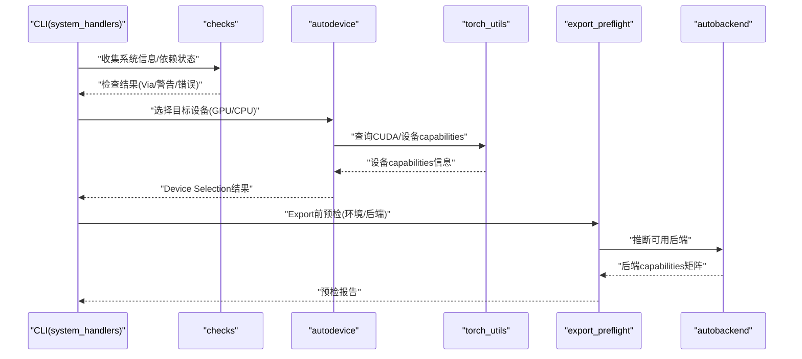
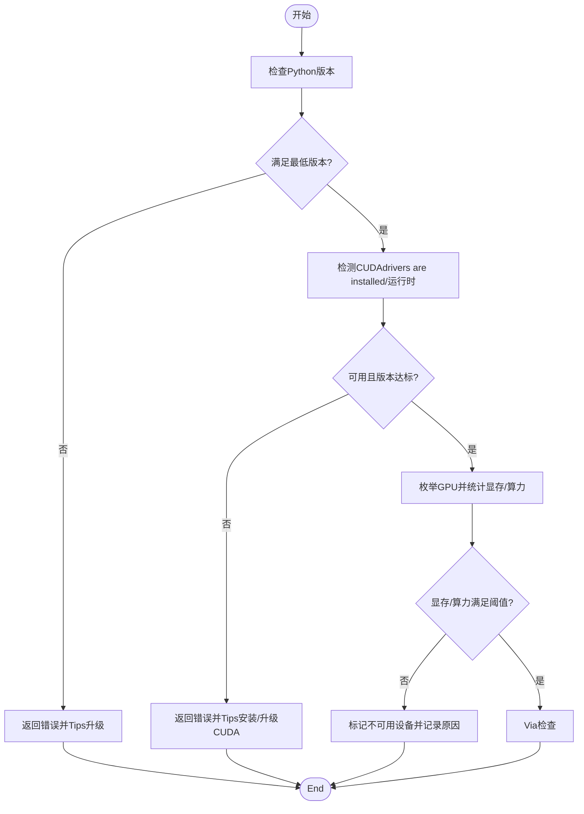
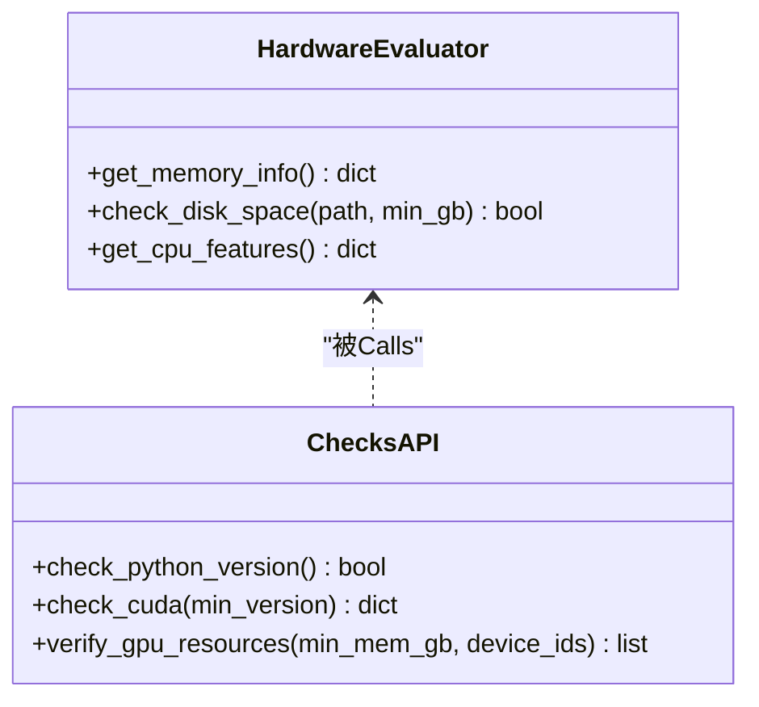
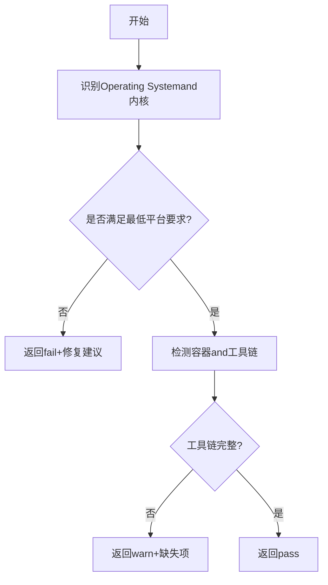
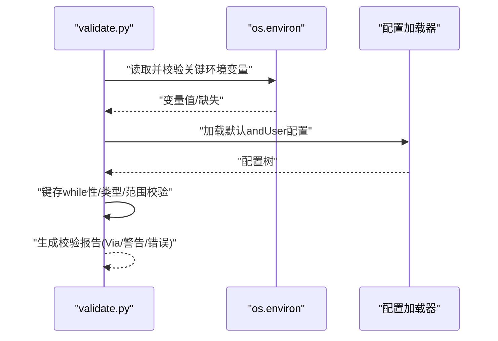
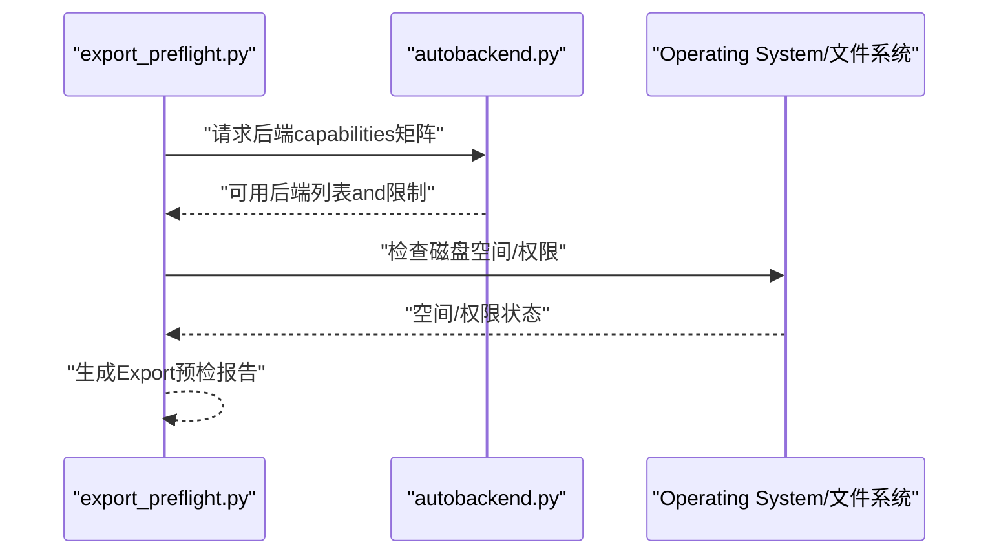
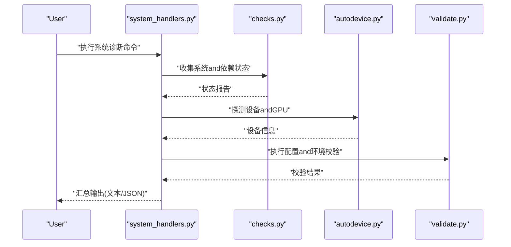
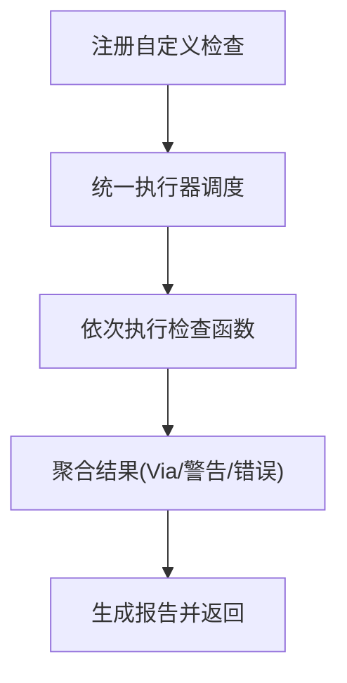
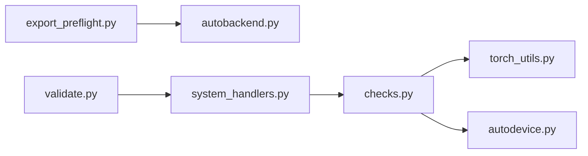

# 环境检查工具

<cite>
**Files Referenced in This Document**
- [checks.py](file://ultralytics/utils/checks.py)
- [autodevice.py](file://ultralytics/utils/autodevice.py)
- [torch_utils.py](file://ultralytics/utils/torch_utils.py)
- [export_preflight.py](file://ultralytics/utils/export_preflight.py)
- [autobackend.py](file://ultralytics/nn/autobackend.py)
- [system_handlers.py](file://agent/runtime/cli/system_handlers.py)
- [validate.py](file://agent/runtime/cli/validate.py)
</cite>

## Table of Contents
1. [Introduction](#Introduction)
2. [Project Structure](#Project Structure)
3. [Core Components](#Core Components)
4. [Architecture Overview](#Architecture Overview)
5. [Detailed Component Analysis](#Detailed Component Analysis)
6. [Dependency Analysis](#Dependency Analysis)
7. [Performance Considerations](#Performance Considerations)
8. [故障排除指南](#故障排除指南)
9. [Conclusion](#Conclusion)
10. [Appendix](#Appendix)

## Introduction
本文件for YOLO-Master 环境检查工具的权威Documentation，聚焦于系统依赖Validation、硬件capabilitiesEvaluation、平台兼容性检查、环境变量and配置文件完整性校验，Centered onand自定义检查规则的开发and集成方法。内容覆盖 Python 版本检查、CUDA 可用性检测、GPU 资源Validation、内存/磁盘/CPU 特性检测、Export预检流程and环境诊断工具函数UsesExamples，帮助开发者快速定位环境问题并保障Training、InferenceandExport流程的稳定性。

## Project Structure
环境检查相关代码主要分布whileCentered on下Modules：
- 通用检查and系统信息：ultralytics/utils/checks.py
- Automatic Device Selectionand GPU 探测：ultralytics/utils/autodedevice.py
- PyTorch and CUDA 运行时辅助：ultralytics/utils/torch_utils.py
- Export前预检（含环境/后端capabilities）：ultralytics/utils/export_preflight.py
- 自动后端选择（包含设备and后端capabilities判定）：ultralytics/nn/autobackend.py
- CLI 系统信息and诊断入口：agent/runtime/cli/system_handlers.py
- 通用校验and断言工具：agent/runtime/cli/validate.py

Figure Source
- [checks.py](file://ultralytics/utils/checks.py)
- [autodevice.py](file://ultralytics/utils/autodevice.py)
- [torch_utils.py](file://ultralytics/utils/torch_utils.py)
- [export_preflight.py](file://ultralytics/utils/export_preflight.py)
- [autobackend.py](file://ultralytics/nn/autobackend.py)
- [system_handlers.py](file://agent/runtime/cli/system_handlers.py)
- [validate.py](file://agent/runtime/cli/validate.py)

Section Source
- [checks.py](file://ultralytics/utils/checks.py)
- [autodevice.py](file://ultralytics/utils/autodevice.py)
- [torch_utils.py](file://ultralytics/utils/torch_utils.py)
- [export_preflight.py](file://ultralytics/utils/export_preflight.py)
- [autobackend.py](file://ultralytics/nn/autobackend.py)
- [system_handlers.py](file://agent/runtime/cli/system_handlers.py)
- [validate.py](file://agent/runtime/cli/validate.py)

## Core Components
- 系统依赖Validation接口
  - Python 版本检查：确保运行环境and框架要求一致。
  - CUDA 可用性检测：判断是否安装 CUDA drivers are installedand运行时，并获取可用 GPU 数量。
  - GPU 资源Validation：显存大小、计算capabilities、多卡枚举and亲和性设置。
- 硬件capabilitiesEvaluation工具
  - 内存大小：系统总内存and可用内存。
  - 磁盘空间：工作Table of Contentsand模型权重下载路径的剩余空间。
  - 处理器特性：CPU 指令集、线程数、NUMA 拓扑etc.。
- 平台兼容性检查
  - Operating Systemand内核版本、容器化环境、编译器/构建工具链。
  - 返回结构化结果，便于上层决策and告警。
- 环境变量and配置文件完整性
  - 关键环境变量存while性and有效性（such as代理、Logging、缓存路径）。
  - 默认配置andUser配置的键存while性、类型and取值范围校验。
- 自定义检查规则
  - provides注册机制and统一执行器，Supporting按优先级and严重级别分类。
  - Supporting失败时阻断或仅告警的策略。

Section Source
- [checks.py](file://ultralytics/utils/checks.py)
- [autodevice.py](file://ultralytics/utils/autodevice.py)
- [torch_utils.py](file://ultralytics/utils/torch_utils.py)
- [export_preflight.py](file://ultralytics/utils/export_preflight.py)
- [autobackend.py](file://ultralytics/nn/autobackend.py)
- [system_handlers.py](file://agent/runtime/cli/system_handlers.py)
- [validate.py](file://agent/runtime/cli/validate.py)

## Architecture Overview
下图展示了环境检查while整体系统中的位置and交互关系：CLI 层Calls系统信息and诊断入口，后者组合 checks and autodevice 完成基础环境探测；Export预检whileModel Export前再次确认后端and设备capabilities；自动后端根据检测结果选择合适的执行后端。

Figure Source
- [system_handlers.py](file://agent/runtime/cli/system_handlers.py)
- [checks.py](file://ultralytics/utils/checks.py)
- [autodevice.py](file://ultralytics/utils/autodevice.py)
- [torch_utils.py](file://ultralytics/utils/torch_utils.py)
- [export_preflight.py](file://ultralytics/utils/export_preflight.py)
- [autobackend.py](file://ultralytics/nn/autobackend.py)

## Detailed Component Analysis

### 系统依赖Validation接口（Python/CUDA/GPU）
- Python 版本检查
  - 输入：无（内部读取Explainer版本）
  - 输出：布尔值或结构化状态（Via/不满足）
  - 行for：若低于最低要求则抛出明确异常或返回错误码，供上层中断流程。
- CUDA 可用性检测
  - 输入：Optional的最小 CUDA 版本阈值
  - 输出：布尔值 + 可用 GPU 计数 + drivers are installed/运行时版本信息
  - 行for：当未检测to CUDA 或版本过低时给出可操作的修复建议。
- GPU 资源Validation
  - 输入：最小显存阈值、期望设备索引列表
  - 输出：设备清单、显存大小、计算capabilities、是否满足阈值
  - 行for：对不满足阈值的设备标记for不可用，并记录原因。

Figure Source
- [checks.py](file://ultralytics/utils/checks.py)
- [autodevice.py](file://ultralytics/utils/autodevice.py)
- [torch_utils.py](file://ultralytics/utils/torch_utils.py)

Section Source
- [checks.py](file://ultralytics/utils/checks.py)
- [autodevice.py](file://ultralytics/utils/autodevice.py)
- [torch_utils.py](file://ultralytics/utils/torch_utils.py)

### 硬件capabilitiesEvaluation工具（内存/磁盘/CPU）
- 内存大小
  - 功能：读取系统总内存and当前可用内存，用于估算批大小and并发度。
  - 返回值：字典或对象，包含 total、available、unit etc.字段。
- 磁盘空间
  - 功能：检查指定路径的剩余空间，常用于权重下载and中间产物Table of Contents。
  - 返回值：布尔值 + 剩余空间数值 + 单位。
- 处理器特性
  - 功能：获取 CPU 型号、核心/线程数、SIMD 指令集、NUMA 节点etc.。
  - 返回值：结构化信息，便于上层进行策略选择（such as线程池大小）。

Figure Source
- [checks.py](file://ultralytics/utils/checks.py)
- [autodevice.py](file://ultralytics/utils/autodevice.py)

Section Source
- [checks.py](file://ultralytics/utils/checks.py)
- [autodevice.py](file://ultralytics/utils/autodevice.py)

### 平台兼容性检查函数（配置选项and返回值）
- 配置选项
  - 目标平台：Linux/Windows/macOS and发行版/内核版本。
  - 容器环境：是否运行while Docker/Kubernetes 中。
  - 构建工具链：编译器、链接器、CMake etc.必要工具是否存while。
- 返回值含义
  - 状态：pass/warn/fail
  - 详情：具体不满足项and修复建议
  - 影响范围：仅影响Export/Training/Inference中的某类Tasks

Figure Source
- [checks.py](file://ultralytics/utils/checks.py)

Section Source
- [checks.py](file://ultralytics/utils/checks.py)

### 环境变量Validationand配置文件完整性检查
- 环境变量Validation
  - 常见变量：代理、LoggingTable of Contents、缓存Table of Contents、分布式通信端口范围etc.。
  - 行for：检查存while性、格式合法性and可达性（such as网络代理连通性）。
- 配置文件完整性
  - 默认配置andUser配置合并后，校验关键字段存while性and取值范围。
  - 对缺失或非法字段给出修正建议，避免运行时崩溃。

Figure Source
- [validate.py](file://agent/runtime/cli/validate.py)

Section Source
- [validate.py](file://agent/runtime/cli/validate.py)

### Export预检and自动后端选择
- Export预检
  - 目的：whileExport前确认环境、后端and设备capabilities是否满足目标格式要求。
  - 内容：检查后端库可用性、算子Supporting、量化/编译工具链、磁盘空间etc.。
- 自动后端选择
  - 依据：设备capabilities、后端库、Export目标格式，选择最优后端（such as ONNX/TensorRT/OpenVINO etc.）。
  - 输出：推荐后端and降级策略。

Figure Source
- [export_preflight.py](file://ultralytics/utils/export_preflight.py)
- [autobackend.py](file://ultralytics/nn/autobackend.py)

Section Source
- [export_preflight.py](file://ultralytics/utils/export_preflight.py)
- [autobackend.py](file://ultralytics/nn/autobackend.py)

### CLI 系统信息and诊断入口
- system_handlers
  - provides命令行入口，汇总系统信息、设备状态、环境健康度。
  - SupportingCentered on JSON/表格形式输出，便于自动化处理。
- validate
  - provides通用断言and校验逻辑，被 system_handlers 复用。

Figure Source
- [system_handlers.py](file://agent/runtime/cli/system_handlers.py)
- [checks.py](file://ultralytics/utils/checks.py)
- [autodevice.py](file://ultralytics/utils/autodevice.py)
- [validate.py](file://agent/runtime/cli/validate.py)

Section Source
- [system_handlers.py](file://agent/runtime/cli/system_handlers.py)
- [validate.py](file://agent/runtime/cli/validate.py)

### 自定义检查规则开发and集成
- 开发步骤
  - 定义检查函数：输入参数、返回值（Via/警告/错误）、描述and建议。
  - 注册检查：将检查函数加入全局Registry，指定优先级and严重级别。
  - 编排执行：由统一执行器按顺序Calls，聚合结果并生成报告。
- 集成方式
  - while启动阶段或Export预检前注入自定义检查。
  - Supporting条件启用（such as仅while特定平台或后端启用）。
- 最佳实践
  - 保持幂etc.and轻量，避免阻塞主流程。
  - provides清晰的错误信息and修复指引。
  - 对可能失败的检查采用“软失败”策略，允许继续但告警。

[本节for概念性说明，无需源码引用]

## Dependency Analysis
- 低耦合高内聚
  - checks 专注于系统and环境信息收集，不直接依赖具体后端implementing。
  - autodevice and torch_utils 负责设备and运行时细节，向 checks 暴露稳定接口。
  - export_preflight and autobackend 协同完成Export前的capabilitiesEvaluationand后端选择。
- External Dependencies
  - PyTorch/CUDA 运行时、系统 API（内存/磁盘/CPU 信息）、第三方后端库（ONNX/TensorRT/OpenVINO etc.）。

Figure Source
- [checks.py](file://ultralytics/utils/checks.py)
- [autodevice.py](file://ultralytics/utils/autodevice.py)
- [torch_utils.py](file://ultralytics/utils/torch_utils.py)
- [export_preflight.py](file://ultralytics/utils/export_preflight.py)
- [autobackend.py](file://ultralytics/nn/autobackend.py)
- [system_handlers.py](file://agent/runtime/cli/system_handlers.py)
- [validate.py](file://agent/runtime/cli/validate.py)

Section Source
- [checks.py](file://ultralytics/utils/checks.py)
- [autodevice.py](file://ultralytics/utils/autodevice.py)
- [torch_utils.py](file://ultralytics/utils/torch_utils.py)
- [export_preflight.py](file://ultralytics/utils/export_preflight.py)
- [autobackend.py](file://ultralytics/nn/autobackend.py)
- [system_handlers.py](file://agent/runtime/cli/system_handlers.py)
- [validate.py](file://agent/runtime/cli/validate.py)

## Performance Considerations
- 检查函数的开销应尽量小，避免while高频路径中重复执行。
- 对 GPU 枚举and显存查询应缓存结果，减少多次Calls带来的额外开销。
- 磁盘空间检查可限定扫描深度and路径范围，避免全量遍历。
- 对于大型数据集或模型，建议whileExport预检阶段提前发现潜whilebottlenecks（such as显存不足、磁盘空间不够）。

[本节for一般性指导，无需源码引用]

## 故障排除指南
- Python 版本不满足
  - 现象：导入失败或早期报错。
  - 处理：升级至Supporting的最低版本，或Uses虚拟环境隔离。
- CUDA 不可用或版本过低
  - 现象：无法Uses GPU，或Export时报算子不Supporting。
  - 处理：安装匹配的 CUDA drivers are installedand运行时，重启进程使环境变量生效。
- GPU 显存不足
  - 现象：OOM 或Export Failure。
  - 处理：降低批大小、关闭不必要的服务、释放其他进程占用显存。
- 磁盘空间不足
  - 现象：权重下载失败或Export中途报错。
  - 处理：清理缓存and临时文件，扩展磁盘容量。
- 环境变量配置错误
  - 现象：代理不可达、Logging写入失败、分布式通信端口冲突。
  - 处理：修正环境变量，确保网络and端口可用。
- 配置文件缺失或非法
  - 现象：启动即崩溃或行for异常。
  - 处理：对照默认配置补齐缺失键，修正取值范围。

Section Source
- [checks.py](file://ultralytics/utils/checks.py)
- [autodevice.py](file://ultralytics/utils/autodevice.py)
- [export_preflight.py](file://ultralytics/utils/export_preflight.py)
- [validate.py](file://agent/runtime/cli/validate.py)

## Conclusion
YOLO-Master 的环境检查工具provides了从系统依赖to硬件capabilities、从平台兼容toExport预检的全链路保障。through a unified检查接口and可扩展的自定义规则，能够while不同平台上稳定地识别问题并给出修复建议，显著提升Training、InferenceandExport的成功率and可维护性。

## Appendix
- 常用命令and用法
  - 系统信息诊断：Via CLI 入口输出系统、设备and环境健康度。
  - Export预检：while执行Export前运行预检，获取后端and设备capabilities报告。
  - 自定义检查：注册新检查并while启动或预检阶段自动执行。

[本节for概览性说明，无需源码引用]