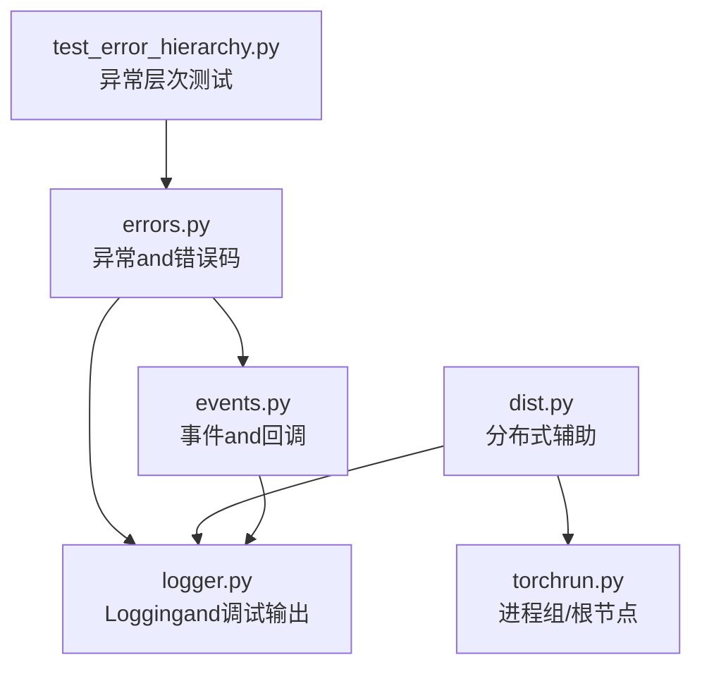
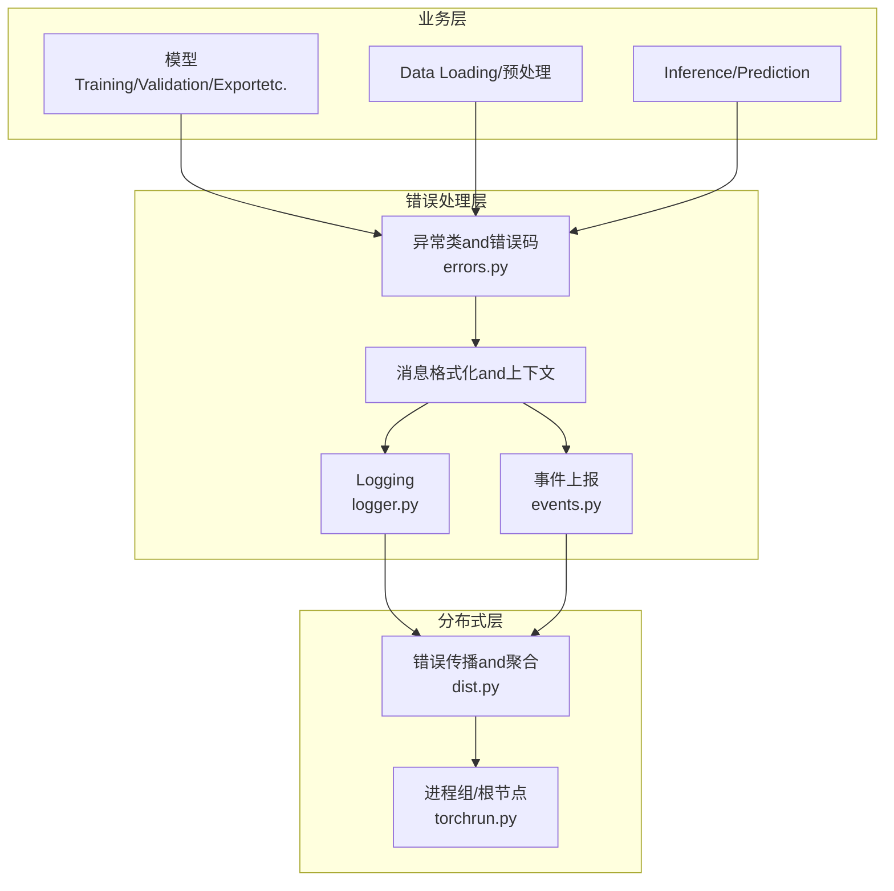
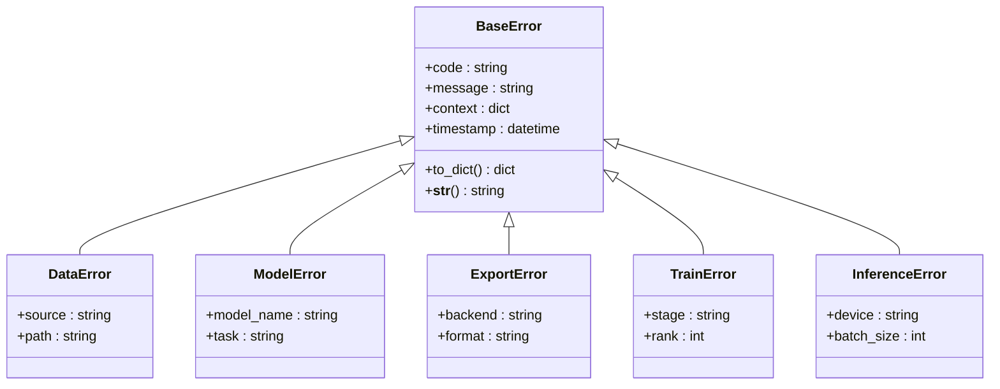
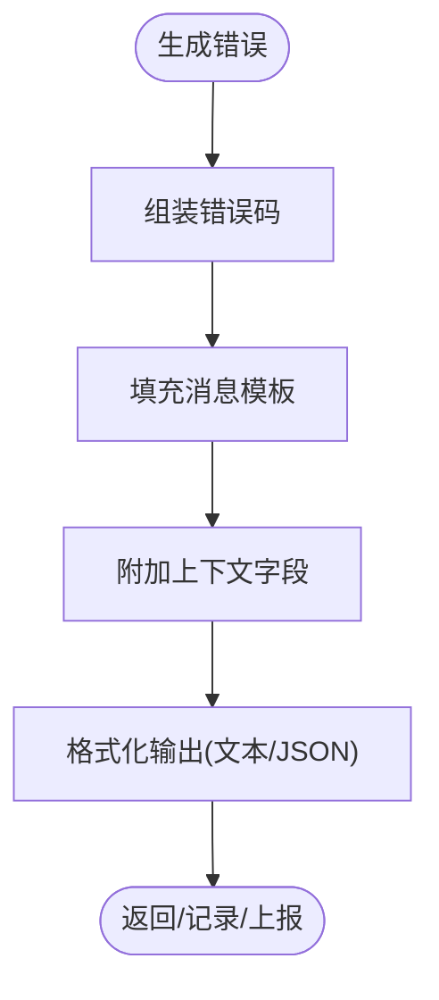
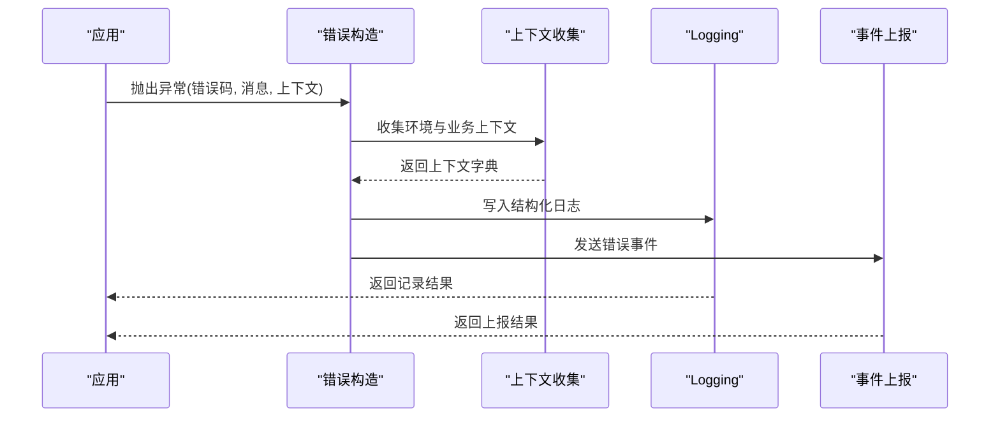
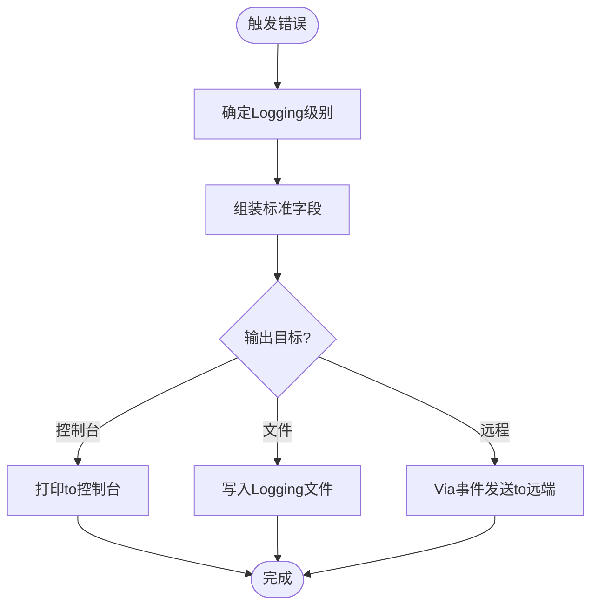
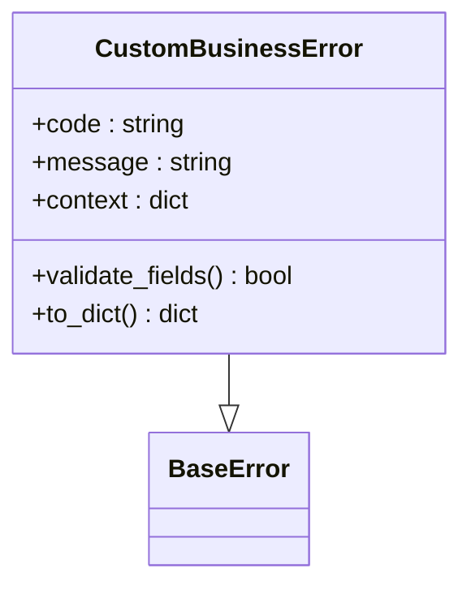
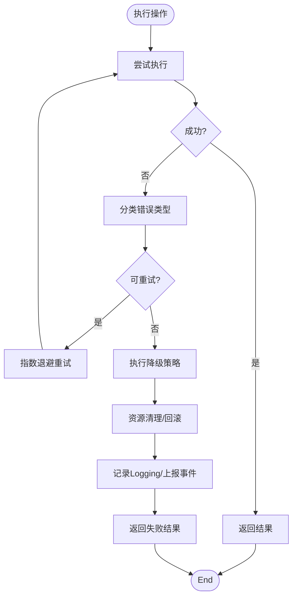
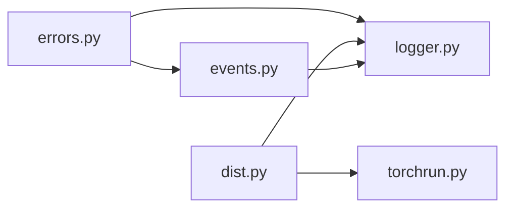

# 错误处理工具

<cite>
**Files Referenced in This Document**
- [errors.py](file://ultralytics/utils/errors.py)
- [test_error_hierarchy.py](file://tests/test_error_hierarchy.py)
- [logger.py](file://ultralytics/utils/logger.py)
- [events.py](file://ultralytics/utils/events.py)
- [dist.py](file://ultralytics/utils/dist.py)
- [torchrun.py](file://ultralytics/utils/torchrun.py)
</cite>

## Table of Contents
1. [Introduction](#Introduction)
2. [Project Structure](#Project Structure)
3. [Core Components](#Core Components)
4. [Architecture Overview](#Architecture Overview)
5. [Detailed Component Analysis](#Detailed Component Analysis)
6. [Dependency Analysis](#Dependency Analysis)
7. [Performance Considerations](#Performance Considerations)
8. [Troubleshooting Guide](#Troubleshooting Guide)
9. [Conclusion](#Conclusion)
10. [Appendix](#Appendix)

## Introduction
本文件for YOLO-Master 的错误处理工具provides系统化Documentation，聚焦Centered on下目标：
- 异常类的层次结构and继承关系（基础异常and业务异常）
- 错误码定义and错误消息格式规范
- 上下文信息收集and堆栈Tracking配置
- 错误Loggingand调试输出格式
- 自定义异常类的开发指南and最佳实践
- 错误恢复and容错处理的implementingExamples
- 分布式环境下的错误传播and处理策略

## Project Structure
错误处理相关代码主要位于 utils Modules中，关键文件such as下：
- ultralytics/utils/errors.py：异常类、错误码and消息格式化
- ultralytics/utils/logger.py：结构化Loggingand调试输出
- ultralytics/utils/events.py：事件总线/回调机制（用于错误上报and追踪）
- ultralytics/utils/dist.py：分布式通信and错误传播辅助
- ultralytics/utils/torchrun.py：进程组初始化and根节点判定（影响错误聚合）
- tests/test_error_hierarchy.py：异常层次and行for测试用例

Figure Source
- [errors.py](file://ultralytics/utils/errors.py)
- [logger.py](file://ultralytics/utils/logger.py)
- [events.py](file://ultralytics/utils/events.py)
- [dist.py](file://ultralytics/utils/dist.py)
- [torchrun.py](file://ultralytics/utils/torchrun.py)
- [test_error_hierarchy.py](file://tests/test_error_hierarchy.py)

Section Source
- [errors.py](file://ultralytics/utils/errors.py)
- [logger.py](file://ultralytics/utils/logger.py)
- [events.py](file://ultralytics/utils/events.py)
- [dist.py](file://ultralytics/utils/dist.py)
- [torchrun.py](file://ultralytics/utils/torchrun.py)
- [test_error_hierarchy.py](file://tests/test_error_hierarchy.py)

## Core Components
- 异常基类and业务异常族：统一继承自基础异常，便于捕获and分类；业务异常按领域细分，携带结构化上下文。
- 错误码体系：集中定义错误码常量，保证跨Modules一致性and可观测性。
- 消息格式化：统一的错误消息模板and字段填充，确保可读性and机器可解析性。
- Loggingand调试：Via logger 输出结构化Logging，Supporting不同级别and字段扩展。
- 事件上报：Via events 将错误事件广播to监听器（such as监控、告警）。
- 分布式Supporting：while dist and torchrun 基础上，implementing根节点聚合and跨进程错误传播。

Section Source
- [errors.py](file://ultralytics/utils/errors.py)
- [logger.py](file://ultralytics/utils/logger.py)
- [events.py](file://ultralytics/utils/events.py)
- [dist.py](file://ultralytics/utils/dist.py)
- [torchrun.py](file://ultralytics/utils/torchrun.py)

## Architecture Overview
下图展示了错误处理while系统中的位置and交互：业务层抛出异常，错误处理层进行格式化、Loggingand事件上报，并while分布式环境下由根节点汇总and转发。

Figure Source
- [errors.py](file://ultralytics/utils/errors.py)
- [logger.py](file://ultralytics/utils/logger.py)
- [events.py](file://ultralytics/utils/events.py)
- [dist.py](file://ultralytics/utils/dist.py)
- [torchrun.py](file://ultralytics/utils/torchrun.py)

## Detailed Component Analysis

### 异常类层次and继承关系
- 基础异常类：作for所有异常的根，provides统一的属性（such as错误码、消息、上下文字典、时间戳etc.），并Supporting字符串化输出。
- 业务异常子类：按功能域划分（例such as数据、模型、Export、Training、Inferenceetc.），每个子类可附加特定字段and校验逻辑。
- 异常链and包装：允许while捕获后包装for更高层异常，保留原始堆栈and上下文，便于根因定位。

Figure Source
- [errors.py](file://ultralytics/utils/errors.py)

Section Source
- [errors.py](file://ultralytics/utils/errors.py)
- [test_error_hierarchy.py](file://tests/test_error_hierarchy.py)

### 错误码定义and消息格式规范
- 错误码命名：采用“Modules_子域_具体错误”的分段式命名，保证唯一性and可读性。
- 错误码范围：建议按Modules划分区间，避免冲突。
- 消息模板：包含固定字段（错误码、时间、进程ID、设备信息etc.）and可变字段（User输入、路径、参数etc.）。
- 结构化输出：推荐 JSON 或键值对形式，便于下游系统解析and检索。

Figure Source
- [errors.py](file://ultralytics/utils/errors.py)
- [logger.py](file://ultralytics/utils/logger.py)

Section Source
- [errors.py](file://ultralytics/utils/errors.py)
- [logger.py](file://ultralytics/utils/logger.py)

### 上下文信息收集and堆栈Tracking配置
- 上下文收集：自动采集运行环境信息（进程ID、线程ID、GPU/CPU、版本、工作Table of Contentsetc.），并可追加业务上下文（输入路径、Tasks名、Batch Sizeetc.）。
- 堆栈Tracking：默认启用完整堆栈；可按需裁剪Centered on控制Logging体积。
- 配置项：可Via全局配置开关控制是否收集敏感信息、是否压缩堆栈、是否附带环境变量白名单etc.。

Figure Source
- [errors.py](file://ultralytics/utils/errors.py)
- [logger.py](file://ultralytics/utils/logger.py)
- [events.py](file://ultralytics/utils/events.py)

Section Source
- [errors.py](file://ultralytics/utils/errors.py)
- [logger.py](file://ultralytics/utils/logger.py)
- [events.py](file://ultralytics/utils/events.py)

### 错误Loggingand调试输出格式
- Logging级别：ERROR、WARN、INFO、DEBUG 分级输出，便于过滤and降噪。
- 字段规范：至少包含 timestamp、level、error_code、message、process_id、thread_id、device、stack_trace。
- 输出目标：控制台、文件、远程收集器（Via事件订阅接入）。
- 调试模式：开启后可输出额外诊断信息（such as张量形状、内存占用、设备状态摘要）。

Figure Source
- [logger.py](file://ultralytics/utils/logger.py)
- [events.py](file://ultralytics/utils/events.py)

Section Source
- [logger.py](file://ultralytics/utils/logger.py)
- [events.py](file://ultralytics/utils/events.py)

### 自定义异常类的开发指南and最佳实践
- 继承基础异常：新建业务异常时继承基础异常类，确保兼容现有捕获and处理逻辑。
- 明确错误码：for新异常分配唯一错误码，避免and已有码冲突。
- 结构化上下文：仅添加必要且非敏感的上下文字段，保持Logging体积可控。
- 异常包装：while高层捕获底层异常时，Uses包装方式保留原始堆栈and上下文。
- 测试覆盖：for自定义异常编写单元测试，Validation消息格式、上下文完整性and序列化行for。

Figure Source
- [errors.py](file://ultralytics/utils/errors.py)
- [test_error_hierarchy.py](file://tests/test_error_hierarchy.py)

Section Source
- [errors.py](file://ultralytics/utils/errors.py)
- [test_error_hierarchy.py](file://tests/test_error_hierarchy.py)

### 错误恢复and容错处理Examples
- 重试策略：针对瞬时错误（such as网络抖动、I/O 锁竞争）实施指数退避重试。
- 降级策略：当关键服务不可用时，切换to备用路径或返回保守结果。
- 资源清理：while异常分支中确保临时文件、句柄、锁etc.资源被正确释放。
- 事务回滚：whileTraining或Export流程中，失败时回滚中间状态，保证一致性。

[This section provides general guidance and does not directly analyze specific files]

### 分布式环境下的错误传播and处理策略
- 根节点聚合：由主进程（根节点）收集各 worker 的错误信息，合并后统一上报and记录。
- 错误广播：while需要时向所有进程广播致命错误，Centered on便快速终止and清理。
- 进程隔离：确保单个 worker 的异常不会导致整个集群崩溃，必要时隔离重启。
- 诊断增强：while分布式场景下附加 rank、world_size、node_id etc.信息，便于定位问题。

```mermaid
sequenceDiagram
participant Root as "根节点"
participant W1 as "Worker 1"
participant W2 as "Worker 2"
participant Dist as "分布式辅助(dist.py)"
participant TR as "进程组(torchrun.py)"
W1->>Dist : 报告错误(含上下文)
W2->>Dist : 报告错误(含上下文)
Dist->>Root : 聚合错误并通知
Root->>TR : 获取进程组信息
Root->>Root : 统一记录与上报
Root-->>W1 : 广播终止信号(可选)
Root-->>W2 : 广播终止信号(可选)
```

Figure Source
- [dist.py](file://ultralytics/utils/dist.py)
- [torchrun.py](file://ultralytics/utils/torchrun.py)

Section Source
- [dist.py](file://ultralytics/utils/dist.py)
- [torchrun.py](file://ultralytics/utils/torchrun.py)

## Dependency Analysis
- errors.py for其他Modulesprovides异常and错误码基础capabilities，被 logger.py、events.py 广泛Uses。
- logger.py and events.py 共同构成错误输出的两条通道：本地持久化and远端上报。
- dist.py and torchrun.py provides分布式上下文and进程组管理，支撑错误聚合and广播。

Figure Source
- [errors.py](file://ultralytics/utils/errors.py)
- [logger.py](file://ultralytics/utils/logger.py)
- [events.py](file://ultralytics/utils/events.py)
- [dist.py](file://ultralytics/utils/dist.py)
- [torchrun.py](file://ultralytics/utils/torchrun.py)

Section Source
- [errors.py](file://ultralytics/utils/errors.py)
- [logger.py](file://ultralytics/utils/logger.py)
- [events.py](file://ultralytics/utils/events.py)
- [dist.py](file://ultralytics/utils/dist.py)
- [torchrun.py](file://ultralytics/utils/torchrun.py)

## Performance Considerations
- Logging开销：while高吞吐场景下，避免while热路径频繁创建大型上下文对象；按需采样或降采样Logging。
- 堆栈裁剪：生产环境建议裁剪深层堆栈，减少 I/O and序列化成本。
- 事件去重：对重复错误进行去重and限流，防止告警风暴。
- 异步上报：将远端上报改for异步队列，降低主流程延迟。

[This section provides general guidance and does not directly analyze specific files]

## Troubleshooting Guide
- 快速定位：根据错误码and消息模板中的关键字段（such as source、path、model_name、task）缩小范围。
- 上下文核对：检查附加的上下文字段是否完整，确认输入路径、设备、版本etc.是否符合预期。
- Logging分析：Combining时间戳and进程/线程 ID，关联上下游Logging，还原Calls链。
- 分布式问题：关注 rank、world_size、node_id etc.字段，判断是否for单点或全局限制。
- 复现步骤：利用最小化上下文and固定随机种子，尽量稳定复现问题。

Section Source
- [errors.py](file://ultralytics/utils/errors.py)
- [logger.py](file://ultralytics/utils/logger.py)
- [events.py](file://ultralytics/utils/events.py)
- [dist.py](file://ultralytics/utils/dist.py)
- [torchrun.py](file://ultralytics/utils/torchrun.py)

## Conclusion
YOLO-Master 的错误处理工具through a unified异常层次、错误码and消息格式，Combined with结构化Loggingand事件上报，implementing了从单机to分布式的端to端错误可观测性。遵循本文的开发指南and最佳实践，可while保障性能提升排障效率and系统韧性。

[This section is summary content and does not directly analyze specific files]

## Appendix
- 术语表
  - 错误码：用于标识错误类型的唯一编码
  - 上下文：and错误相关的运行时and业务信息集合
  - 根节点：分布式环境中负责聚合and协调的主进程
- Refer to文件
  - 异常and错误码定义：[errors.py](file://ultralytics/utils/errors.py)
  - Loggingand调试输出：[logger.py](file://ultralytics/utils/logger.py)
  - 事件上报机制：[events.py](file://ultralytics/utils/events.py)
  - 分布式辅助：[dist.py](file://ultralytics/utils/dist.py)、[torchrun.py](file://ultralytics/utils/torchrun.py)
  - 异常层次测试：[test_error_hierarchy.py](file://tests/test_error_hierarchy.py)