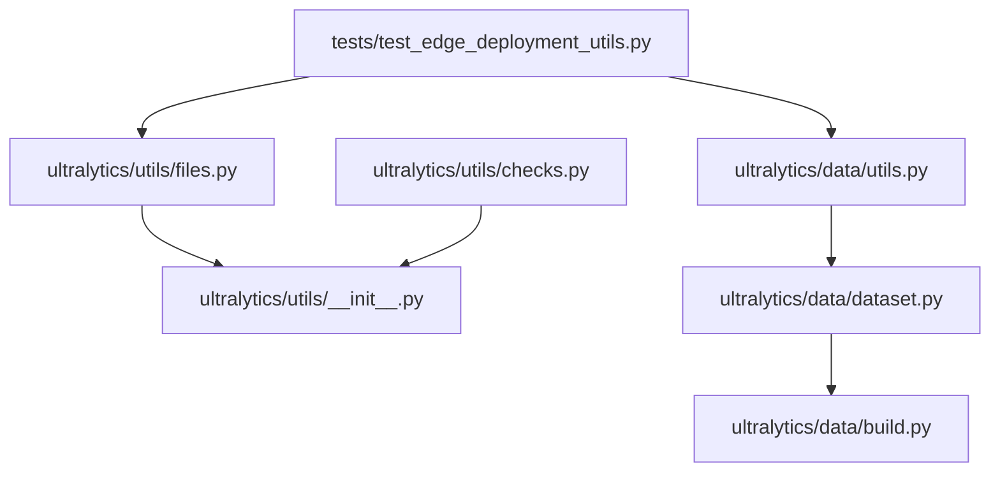
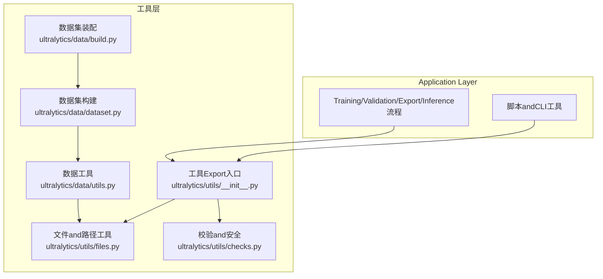
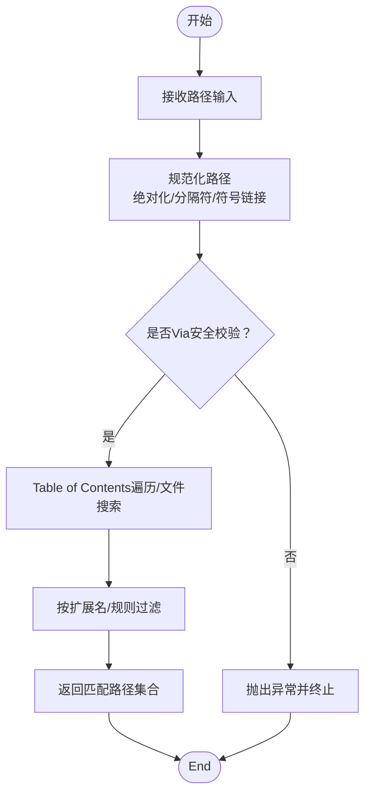
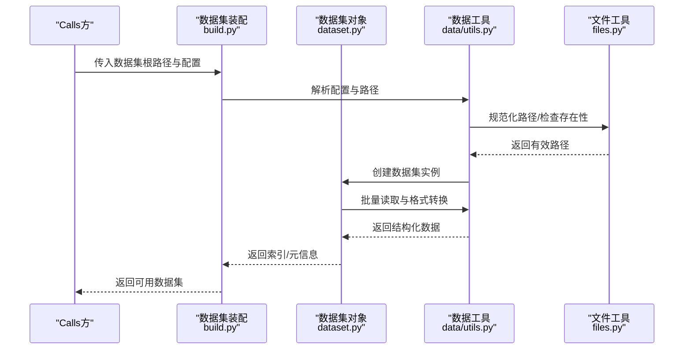
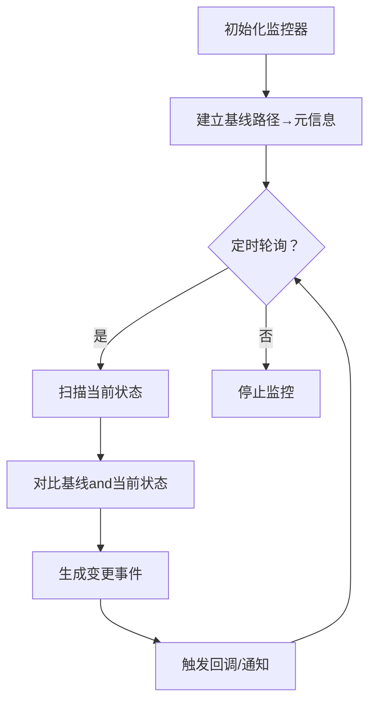
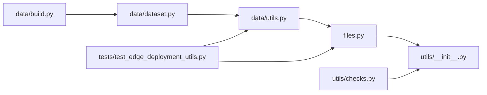

# 文件操作工具

<cite>
**Files Referenced in This Document**
- [ultralytics/utils/files.py](file://ultralytics/utils/files.py)
- [ultralytics/data/utils.py](file://ultralytics/data/utils.py)
- [ultralytics/data/dataset.py](file://ultralytics/data/dataset.py)
- [ultralytics/data/build.py](file://ultralytics/data/build.py)
- [ultralytics/utils/checks.py](file://ultralytics/utils/checks.py)
- [ultralytics/utils/__init__.py](file://ultralytics/utils/__init__.py)
- [tests/test_edge_deployment_utils.py](file://tests/test_edge_deployment_utils.py)
</cite>

## Table of Contents
1. [Introduction](#Introduction)
2. [Project Structure](#Project Structure)
3. [Core Components](#Core Components)
4. [Architecture Overview](#Architecture Overview)
5. [Detailed Component Analysis](#Detailed Component Analysis)
6. [Dependency Analysis](#Dependency Analysis)
7. [Performance Considerations](#Performance Considerations)
8. [Troubleshooting Guide](#Troubleshooting Guide)
9. [Conclusion](#Conclusion)
10. [Appendix](#Appendix)

## Introduction
本文件for YOLO-Master 中的“文件操作工具”provides系统化Documentation，聚焦Centered on下capabilities：
- 路径管理and文件系统操作接口规范（路径解析、Table of Contents遍历、文件搜索）
- 文件格式转换and读写（YAML、JSON、CSV）
- 批量文件处理工具的Uses方法and性能Optimization技巧
- 文件权限检查and安全Validation函数说明
- 跨平台文件路径处理的兼容性指南
- 文件监控and变更检测的工具函数UsesExamples

上述capabilities主要分布while ultralytics/utils/files.py、ultralytics/data/utils.py、ultralytics/data/dataset.py、ultralytics/data/build.py etc.Modules中，并while测试用例中覆盖关键行for。

## Project Structure
围绕“文件操作工具”的相关代码组织such as下：
- 通用文件and路径工具：位于 ultralytics/utils/files.py
- 数据侧路径/格式工具：位于 ultralytics/data/utils.py、ultralytics/data/dataset.py、ultralytics/data/build.py
- 校验and安全检查：位于 ultralytics/utils/checks.py
- 工具Export入口：位于 ultralytics/utils/__init__.py
- 相关测试：位于 tests/test_edge_deployment_utils.py

Figure Source
- [ultralytics/utils/files.py](file://ultralytics/utils/files.py)
- [ultralytics/utils/__init__.py](file://ultralytics/utils/__init__.py)
- [ultralytics/data/utils.py](file://ultralytics/data/utils.py)
- [ultralytics/data/dataset.py](file://ultralytics/data/dataset.py)
- [ultralytics/data/build.py](file://ultralytics/data/build.py)
- [ultralytics/utils/checks.py](file://ultralytics/utils/checks.py)
- [tests/test_edge_deployment_utils.py](file://tests/test_edge_deployment_utils.py)

Section Source
- [ultralytics/utils/files.py](file://ultralytics/utils/files.py)
- [ultralytics/data/utils.py](file://ultralytics/data/utils.py)
- [ultralytics/data/dataset.py](file://ultralytics/data/dataset.py)
- [ultralytics/data/build.py](file://ultralytics/data/build.py)
- [ultralytics/utils/checks.py](file://ultralytics/utils/checks.py)
- [ultralytics/utils/__init__.py](file://ultralytics/utils/__init__.py)
- [tests/test_edge_deployment_utils.py](file://tests/test_edge_deployment_utils.py)

## Core Components
- 路径and文件系统工具（files.py）
  - 职责：统一路径解析、规范化、存while性判断、扩展名提取、相对/绝对路径转换、Table of Contents扫描and过滤、安全路径校验etc.。
  - Typical Usage：while数据集构建、模型权重加载/保存、Logging输出etc.场景中被广泛Calls。
- 数据侧工具（data/utils.py, data/dataset.py, data/build.py）
  - 职责：数据集路径解析、标签and图像路径对齐、批量读取and缓存、格式推断and转换（such as YAML/JSON/CSV）。
  - Typical Usage：Training/Validation前对数据集Table of Contents进行一致性检查、自动发现子集、生成索引。
- 校验and安全（utils/checks.py）
  - 职责：环境/配置/路径合法性校验、权限and可写性检查、输入参数约束。
  - Typical Usage：while启动Training/Export/Inference前进行前置检查，避免运行时错误。
- 工具Export（utils/__init__.py）
  - 职责：对外暴露常用文件and路径工具函数，供上层Modules便捷导入。
- 测试覆盖（tests/test_edge_deployment_utils.py）
  - 职责：ValidationEdge Deployment相关的文件and路径工具行for，确保跨平台兼容性and健壮性。

Section Source
- [ultralytics/utils/files.py](file://ultralytics/utils/files.py)
- [ultralytics/data/utils.py](file://ultralytics/data/utils.py)
- [ultralytics/data/dataset.py](file://ultralytics/data/dataset.py)
- [ultralytics/data/build.py](file://ultralytics/data/build.py)
- [ultralytics/utils/checks.py](file://ultralytics/utils/checks.py)
- [ultralytics/utils/__init__.py](file://ultralytics/utils/__init__.py)
- [tests/test_edge_deployment_utils.py](file://tests/test_edge_deployment_utils.py)

## Architecture Overview
下图展示了“文件操作工具”while整体系统中的位置and交互关系：上层ModulesVia utils 的Export入口访问文件and路径工具；数据侧Moduleswhile构建数据集时依赖这些工具完成路径解析、格式转换and批量处理；校验Moduleswhile关键路径上provides前置检查。

Figure Source
- [ultralytics/utils/files.py](file://ultralytics/utils/files.py)
- [ultralytics/data/utils.py](file://ultralytics/data/utils.py)
- [ultralytics/data/dataset.py](file://ultralytics/data/dataset.py)
- [ultralytics/data/build.py](file://ultralytics/data/build.py)
- [ultralytics/utils/checks.py](file://ultralytics/utils/checks.py)
- [ultralytics/utils/__init__.py](file://ultralytics/utils/__init__.py)

## Detailed Component Analysis

### 路径管理and文件系统操作（files.py）
- 路径解析and规范化
  - Supporting将User输入的路径转换for系统一致表示（绝对路径、分隔符标准化、符号链接unfoldetc.）。
  - provides路径片段拼接、父Table of Contents获取、文件名and扩展名分离etc.基础操作。
- Table of Contents遍历and文件搜索
  - provides递归/非递归遍历Table of Contents的capabilities，Supporting按扩展名或正则表达式过滤。
  - 返回结果通常Centered on列表形式呈现，便于后续批量处理。
- 安全路径校验
  - 防止路径穿越（例such as .. 滥用）、非法字符注入、指向敏感Table of Contentsetc.风险。
  - Combining checks Modules进行权限and可写性检查。
- 跨平台兼容性
  - 基于标准库implementing，自动适配 Windows/macOS/Linux 的路径分隔符and大小写敏感性差异。
  - 建议始终Uses工具provides的路径函数，避免直接Uses字符串拼接。

Figure Source
- [ultralytics/utils/files.py](file://ultralytics/utils/files.py)
- [ultralytics/utils/checks.py](file://ultralytics/utils/checks.py)

Section Source
- [ultralytics/utils/files.py](file://ultralytics/utils/files.py)
- [ultralytics/utils/checks.py](file://ultralytics/utils/checks.py)

### 数据侧路径and格式转换（data/utils.py, data/dataset.py, data/build.py）
- 路径and格式推断
  - 根据文件扩展名自动推断数据类型（图像、标注、配置文件etc.），并进行必要转换。
  - Supporting YAML/JSON/CSV etc.常见格式的读写and校验。
- 数据集构建流程
  - 从Root Directory出发，递归发现子集（train/val/test），对齐图像and标签路径，生成索引。
  - while构建过程中执行一致性检查（缺失文件、重复项、格式不匹配etc.）。
- 批量处理
  - 采用惰性迭代and缓存策略，减少内存占用，提升大规模数据集的处理效率。
  - Supporting分块读取and并行预处理（视具体implementing而定）。

Figure Source
- [ultralytics/data/build.py](file://ultralytics/data/build.py)
- [ultralytics/data/dataset.py](file://ultralytics/data/dataset.py)
- [ultralytics/data/utils.py](file://ultralytics/data/utils.py)
- [ultralytics/utils/files.py](file://ultralytics/utils/files.py)

Section Source
- [ultralytics/data/utils.py](file://ultralytics/data/utils.py)
- [ultralytics/data/dataset.py](file://ultralytics/data/dataset.py)
- [ultralytics/data/build.py](file://ultralytics/data/build.py)

### 文件格式转换and读写（YAML、JSON、CSV）
- YAML
  - 用于模型and数据集配置，Supporting嵌套结构and注释。
  - 读写时需保证键名and default configurations一致，避免运行时解析失败。
- JSON
  - 常用于标注and中间结果交换，需遵循严格语法。
  - 大文件写入Recommended to use流式或分块写入Centered on降低内存峰值。
- CSV
  - 适合表格型数据，注意编码and分隔符设置。
  - 对于数值列，建议while读取后进行类型转换and缺失值处理。

Section Source
- [ultralytics/data/utils.py](file://ultralytics/data/utils.py)
- [ultralytics/data/dataset.py](file://ultralytics/data/dataset.py)

### 批量文件处理工具and性能Optimization
- 推荐实践
  - Prefer惰性迭代器and生成器，避免一次性加载全部路径to内存。
  - 对重复计算的结果进行缓存（例such as路径规范化、扩展名提取）。
  - Set appropriately并发度，避免 IO bottlenecksand上下文切换开销过大。
- Optimization技巧
  - Uses预分配缓冲区and批处理 IO，减少系统Calls次数。
  - 对大型数据集采用分片处理and断点续传机制。
  - 利用磁盘顺序读写and SSD 特性，降低随机 IO 带来的延迟。

Section Source
- [ultralytics/data/utils.py](file://ultralytics/data/utils.py)
- [ultralytics/data/dataset.py](file://ultralytics/data/dataset.py)

### 文件权限检查and安全Validation
- 权限检查
  - 检查目标路径是否存while、是否forTable of Contents/文件、是否可读/可写。
  - while写入前进行可写性校验，避免中途失败导致数据不一致。
- 安全Validation
  - 防止路径穿越and注入攻击，限制允许的文件扩展名andTable of Contents白名单。
  - 对User上传或外部输入的路径进行严格校验后再参and业务逻辑。

Section Source
- [ultralytics/utils/checks.py](file://ultralytics/utils/checks.py)
- [ultralytics/utils/files.py](file://ultralytics/utils/files.py)

### 跨平台文件路径处理兼容性指南
- 分隔符and大小写
  - Windows Uses反斜杠且大小写不敏感；macOS/Linux Uses正斜杠且大小写敏感。
  - 统一Uses工具provides的路径函数，避免手动拼接字符串。
- 符号链接and相对路径
  - while不同平台上符号链接解析行for可能不同，建议显式unfold符号链接Centered on获得稳定路径。
  - 相对路径应相对于工作Table of Contents或固定基准Table of Contents解析，避免歧义。
- 测试覆盖
  - Via测试用例Validation跨平台行for，确保while不同Operating System下表现一致。

Section Source
- [tests/test_edge_deployment_utils.py](file://tests/test_edge_deployment_utils.py)
- [ultralytics/utils/files.py](file://ultralytics/utils/files.py)

### 文件监控and变更检测工具函数UsesExamples
- 基本思路
  - 记录文件或Table of Contents的元信息（大小、修改时间、哈希etc.），定期比对Centered on检测变更。
  - 针对大量文件可采用增量扫描and指纹缓存策略。
- UsesExamples（概念流程）
  - 初始化监控器，指定监控路径and采样间隔。
  - 首次扫描建立基线（路径→元信息映射）。
  - 周期性对比当前状态and基线，输出新增/删除/修改的文件列表。
  - 触发回调或事件通知上层Modules进行处理。

[此图for概念流程图，无需Figure Source]

## Dependency Analysis
- 内部依赖
  - files.py 被 data 侧工具and测试用例引用，作for底层路径and IO capabilities的provides者。
  - data/utils.py and dataset.py/build.py 形成数据装配链路，依赖 files.py 完成路径and格式处理。
  - checks.py for各Modulesprovides前置校验，增强鲁棒性。
  - utils/__init__.py 作for统一Export入口，简化上层导入。
- External Dependencies
  - 主要依赖 Python 标准库（os、pathlib、json、yaml、csv etc.），无重型第三方依赖。

Figure Source
- [ultralytics/utils/files.py](file://ultralytics/utils/files.py)
- [ultralytics/utils/__init__.py](file://ultralytics/utils/__init__.py)
- [ultralytics/data/utils.py](file://ultralytics/data/utils.py)
- [ultralytics/data/dataset.py](file://ultralytics/data/dataset.py)
- [ultralytics/data/build.py](file://ultralytics/data/build.py)
- [ultralytics/utils/checks.py](file://ultralytics/utils/checks.py)
- [tests/test_edge_deployment_utils.py](file://tests/test_edge_deployment_utils.py)

Section Source
- [ultralytics/utils/files.py](file://ultralytics/utils/files.py)
- [ultralytics/utils/__init__.py](file://ultralytics/utils/__init__.py)
- [ultralytics/data/utils.py](file://ultralytics/data/utils.py)
- [ultralytics/data/dataset.py](file://ultralytics/data/dataset.py)
- [ultralytics/data/build.py](file://ultralytics/data/build.py)
- [ultralytics/utils/checks.py](file://ultralytics/utils/checks.py)
- [tests/test_edge_deployment_utils.py](file://tests/test_edge_deployment_utils.py)

## Performance Considerations
- IO 密集型Tasks应避免阻塞主线程，必要时Uses异步或进程池。
- 对频繁Calls的路径函数进行轻量级缓存，减少重复计算。
- 大批量Data processing时，Prefer流式读取and分块写入，控制内存峰值。
- while SSD 环境下尽量顺序读写，减少随机 IO。
- Set appropriately并发度，平衡 CPU and IO 资源利用率。

[本节for通用指导，无需Section Source]

## Troubleshooting Guide
- 常见问题
  - 路径不存while或不可访问：检查路径是否正确、权限是否足够、符号链接是否有效。
  - 格式解析失败：确认 YAML/JSON/CSV 语法正确、编码一致、字段完整。
  - 跨平台差异：注意大小写敏感性and分隔符差异，统一Uses工具函数。
- 定位方法
  - 启用详细Logging，记录关键路径and异常堆栈。
  - Uses最小复现用例隔离问题，逐步缩小范围。
  - 借助测试用例Validation预期行for，快速回归修复。

Section Source
- [ultralytics/utils/checks.py](file://ultralytics/utils/checks.py)
- [tests/test_edge_deployment_utils.py](file://tests/test_edge_deployment_utils.py)

## Conclusion
YOLO-Master 的文件操作工具Centered on files.py for核心，Combined with data 侧工具and checks Modules，provides了稳健的路径管理、格式转换and批量处理capabilities。through a unifiedExport入口and完善的测试覆盖，确保了跨平台兼容性and工程可用性。while实际Uses中，遵循本文的最佳实践and性能建议，可显著提升系统的稳定性and吞吐capabilities。

[本节for总结，无需Section Source]

## Appendix
- Refer to路径
  - 路径and文件系统工具：[ultralytics/utils/files.py](file://ultralytics/utils/files.py)
  - 数据侧工具and构建：[ultralytics/data/utils.py](file://ultralytics/data/utils.py)、[ultralytics/data/dataset.py](file://ultralytics/data/dataset.py)、[ultralytics/data/build.py](file://ultralytics/data/build.py)
  - 校验and安全：[ultralytics/utils/checks.py](file://ultralytics/utils/checks.py)
  - 工具Export入口：[ultralytics/utils/__init__.py](file://ultralytics/utils/__init__.py)
  - 测试覆盖：[tests/test_edge_deployment_utils.py](file://tests/test_edge_deployment_utils.py)