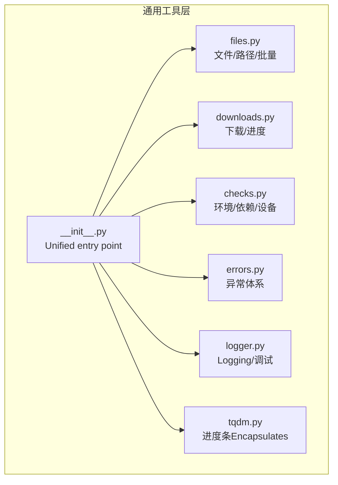
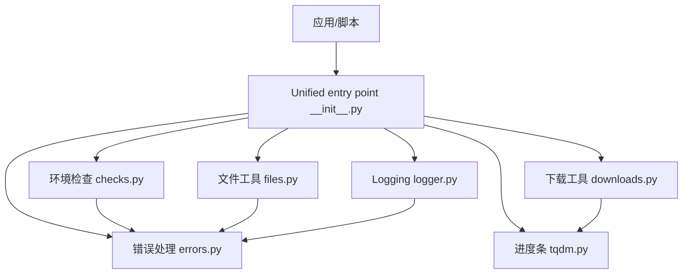
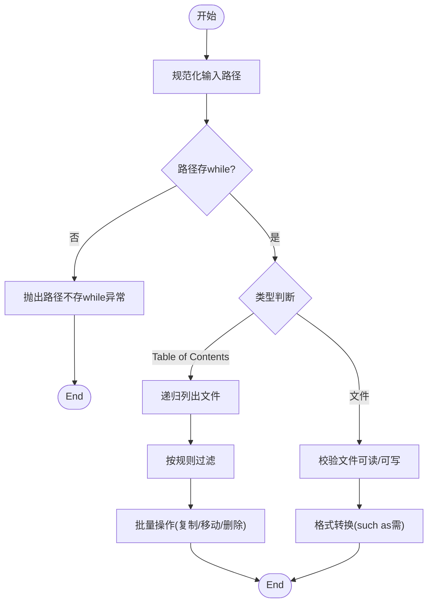
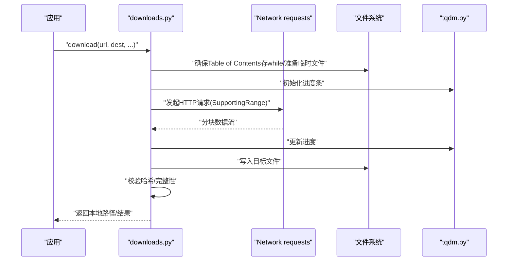
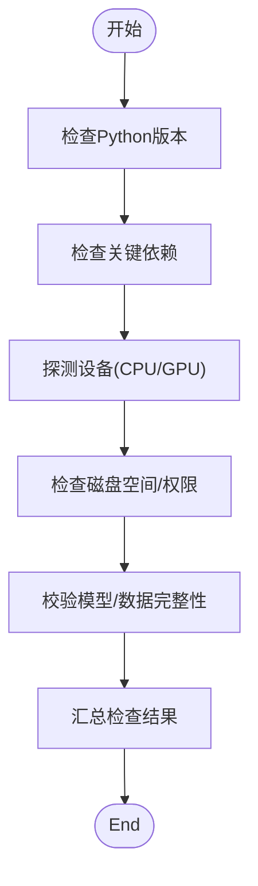
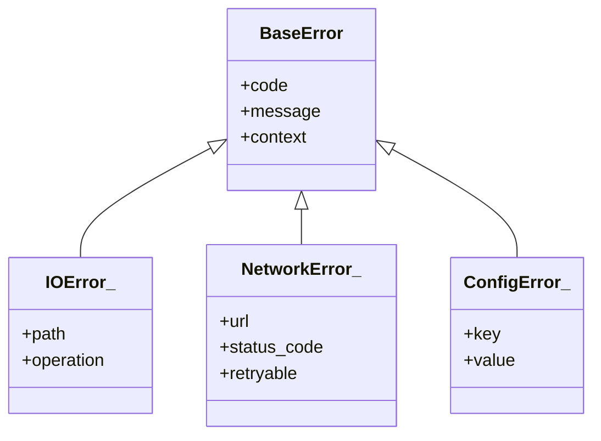
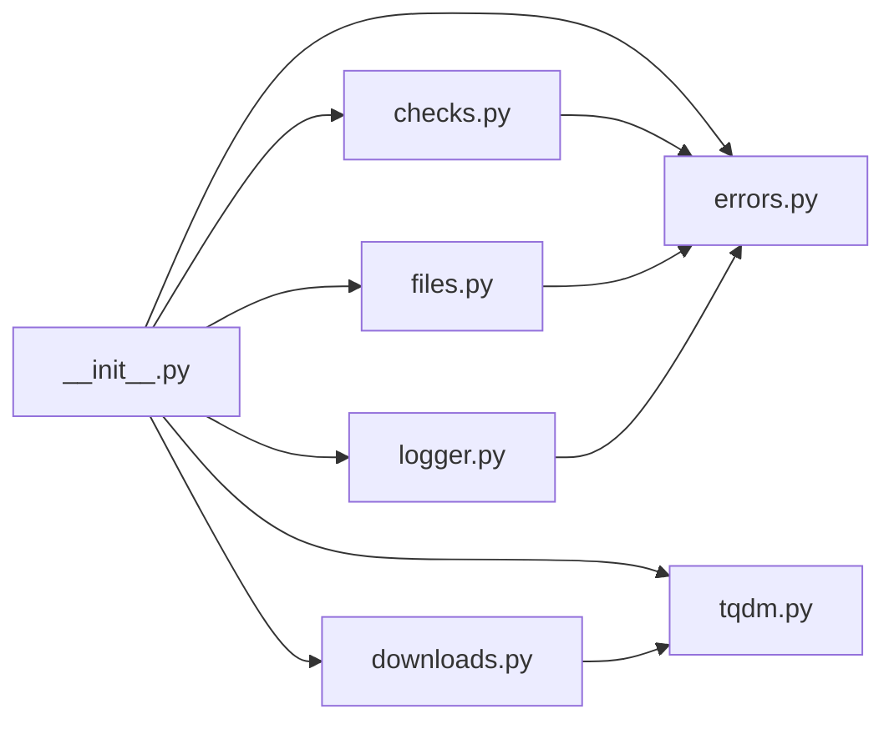

# General Utility Functions

<cite>
**Files Referenced in This Document**
- [ultralytics/utils/files.py](file://ultralytics/utils/files.py)
- [ultralytics/utils/downloads.py](file://ultralytics/utils/downloads.py)
- [ultralytics/utils/checks.py](file://ultralytics/utils/checks.py)
- [ultralytics/utils/errors.py](file://ultralytics/utils/errors.py)
- [ultralytics/utils/logger.py](file://ultralytics/utils/logger.py)
- [ultralytics/utils/tqdm.py](file://ultralytics/utils/tqdm.py)
- [ultralytics/utils/__init__.py](file://ultralytics/utils/__init__.py)
</cite>

## Table of Contents
1. [Introduction](#Introduction)
2. [Project Structure](#Project Structure)
3. [Core Components](#Core Components)
4. [Architecture Overview](#Architecture Overview)
5. [Detailed Component Analysis](#Detailed Component Analysis)
6. [Dependency Analysis](#Dependency Analysis)
7. [Performance Considerations](#Performance Considerations)
8. [Troubleshooting Guide](#Troubleshooting Guide)
9. [Conclusion](#Conclusion)
10. [Appendix](#Appendix)

## Introduction
本文件for YOLO-Master General Utility Functions的权威Documentation，聚焦Centered on下capabilities：
- 文件操作工具：路径管理、格式转换and批量处理
- 网络下载工具：方法and进度监控
- 环境检查and依赖Validation
- 错误处理and异常管理最佳实践
- 配置管理and环境变量处理
- Loggingand调试辅助
- 安全相关工具and权限检查
- 跨平台兼容性Uses指南

本说明targeting不同技术背景的读者，provides从高层概览to代码级细节的渐进式内容，并辅Centered on图示帮助理解。

## Project Structure
General Utility Functions主要位于 ultralytics/utils Table of Contents下，按职责拆分for多个Modules：
- files.py：文件系统and路径工具、批量处理、格式转换
- downloads.py：网络下载、断点续传、进度条集成
- checks.py：环境检查、依赖校验、设备探测
- errors.py：统一异常体系and错误码
- logger.py：Logging初始化、级别控制、输出目标
- tqdm.py：进度条Encapsulatesand回调适配
- __init__.py：对外暴露的Unified entry pointand便捷方法

Figure Source
- [ultralytics/utils/files.py](file://ultralytics/utils/files.py)
- [ultralytics/utils/downloads.py](file://ultralytics/utils/downloads.py)
- [ultralytics/utils/checks.py](file://ultralytics/utils/checks.py)
- [ultralytics/utils/errors.py](file://ultralytics/utils/errors.py)
- [ultralytics/utils/logger.py](file://ultralytics/utils/logger.py)
- [ultralytics/utils/tqdm.py](file://ultralytics/utils/tqdm.py)
- [ultralytics/utils/__init__.py](file://ultralytics/utils/__init__.py)

Section Source
- [ultralytics/utils/files.py](file://ultralytics/utils/files.py)
- [ultralytics/utils/downloads.py](file://ultralytics/utils/downloads.py)
- [ultralytics/utils/checks.py](file://ultralytics/utils/checks.py)
- [ultralytics/utils/errors.py](file://ultralytics/utils/errors.py)
- [ultralytics/utils/logger.py](file://ultralytics/utils/logger.py)
- [ultralytics/utils/tqdm.py](file://ultralytics/utils/tqdm.py)
- [ultralytics/utils/__init__.py](file://ultralytics/utils/__init__.py)

## Core Components
- 文件and路径（files.py）
  - 路径解析and规范化、相对/绝对路径转换、路径存while性and类型判断
  - 批量扫描、过滤、复制、移动、删除etc.常用批处理
  - 常见数据集格式and YOLO 格式的互转接口
- 下载（downloads.py）
  - Supporting HTTP/HTTPS 下载、断点续传、重试策略
  - 进度条集成and回调钩子，便于 UI 或 CLI 展示
- 环境检查（checks.py）
  - Python 版本、关键库可用性、GPU/CPU 设备探测
  - 磁盘空间、Table of Contents权限、模型权重完整性校验
- 错误处理（errors.py）
  - 统一异常基类、业务异常分类、错误码and消息规范
- Logging（logger.py）
  - 全局Logging器初始化、级别设置、控制台/文件输出
  - 结构化字段注入and上下文追踪
- 进度条（tqdm.py）
  - 对 tqdm 的轻量Encapsulates，屏蔽平台差异，provides统一 API
- Unified entry point（__init__.py）
  - 聚合Export常用函数，简化上层Calls

Section Source
- [ultralytics/utils/files.py](file://ultralytics/utils/files.py)
- [ultralytics/utils/downloads.py](file://ultralytics/utils/downloads.py)
- [ultralytics/utils/checks.py](file://ultralytics/utils/checks.py)
- [ultralytics/utils/errors.py](file://ultralytics/utils/errors.py)
- [ultralytics/utils/logger.py](file://ultralytics/utils/logger.py)
- [ultralytics/utils/tqdm.py](file://ultralytics/utils/tqdm.py)
- [ultralytics/utils/__init__.py](file://ultralytics/utils/__init__.py)

## Architecture Overview
下图展示了通用工具层的内部关系and外部交互方式：

Figure Source
- [ultralytics/utils/__init__.py](file://ultralytics/utils/__init__.py)
- [ultralytics/utils/files.py](file://ultralytics/utils/files.py)
- [ultralytics/utils/downloads.py](file://ultralytics/utils/downloads.py)
- [ultralytics/utils/checks.py](file://ultralytics/utils/checks.py)
- [ultralytics/utils/errors.py](file://ultralytics/utils/errors.py)
- [ultralytics/utils/logger.py](file://ultralytics/utils/logger.py)
- [ultralytics/utils/tqdm.py](file://ultralytics/utils/tqdm.py)

## Detailed Component Analysis

### 文件and路径工具（files.py）
- 路径管理
  - 路径规范化、拼接、去重分隔符、大小写敏感处理
  - 相对路径and绝对路径互转、工作Table of Contents感知
  - 路径存while性、是否forTable of Contents/文件、是否可读写判断
- 批量处理
  - 递归遍历、按后缀/正则过滤、并行化选项
  - 批量复制/移动/删除、冲突策略（覆盖/跳过/重命名）
- 格式转换
  - 标注格式and YOLO 格式互转（such as COCO/YAML/JSON to YOLO TXT）
  - 图像/视频路径列表生成、数据清单构建
- 错误and边界
  - 非法路径、权限不足、IO 错误的统一包装
  - 大Table of Contents遍历时的内存and性能保护（分批/限制深度）

Figure Source
- [ultralytics/utils/files.py](file://ultralytics/utils/files.py)

Section Source
- [ultralytics/utils/files.py](file://ultralytics/utils/files.py)

### 网络下载工具（downloads.py）
- 下载方法
  - Supporting URL 直链and Hub 资源地址
  - 自动创建目标Table of Contents、文件名推断、哈希校验
  - 并发下载、限速、代理and超时配置
- 进度监控
  - 基于 tqdm 的进度条显示
  - 回调接口用于自定义 UI 更新或持久化状态
- 可靠性
  - 断点续传、失败重试、指数退避
  - 网络异常and证书问题的降级策略

Figure Source
- [ultralytics/utils/downloads.py](file://ultralytics/utils/downloads.py)
- [ultralytics/utils/tqdm.py](file://ultralytics/utils/tqdm.py)

Section Source
- [ultralytics/utils/downloads.py](file://ultralytics/utils/downloads.py)
- [ultralytics/utils/tqdm.py](file://ultralytics/utils/tqdm.py)

### 环境检查and依赖Validation（checks.py）
- 运行时环境
  - Python 版本、关键包导入检测、CUDA/ROCm/MPS 可用性and版本
  - GPU 数量、显存大小、CPU 特性探测
- 系统资源
  - 磁盘剩余空间、Table of Contents读写权限、临时Table of Contents有效性
- 模型and数据
  - 权重文件完整性校验、数据集路径and标签一致性检查
- 兼容性and回退
  - 功能开关、Optional Dependencies缺失时的优雅降级Tips

Figure Source
- [ultralytics/utils/checks.py](file://ultralytics/utils/checks.py)

Section Source
- [ultralytics/utils/checks.py](file://ultralytics/utils/checks.py)

### 错误处理and异常管理（errors.py）
- 设计原则
  - 统一异常基类，分层细化（IO、网络、配置、校验etc.）
  - 错误码and人类可读消息分离，便于国际化and自动化处理
- 最佳实践
  - while边界处捕获底层异常，转换for领域异常
  - 携带上下文信息（路径、URL、参数快照），避免丢失诊断线索
  - 对幂etc.操作进行重试前校验，避免重复副作用

Figure Source
- [ultralytics/utils/errors.py](file://ultralytics/utils/errors.py)

Section Source
- [ultralytics/utils/errors.py](file://ultralytics/utils/errors.py)

### 配置管理and环境变量（Combining logger.py and checks.py）
- 配置加载
  - YAML/JSON 配置文件合并、默认值覆盖、键存while性校验
- 环境变量
  - 读取and校验必要变量（such as代理、缓存Table of Contents、Logging级别）
  - 敏感信息脱敏and最小权限原则
- andLogging联动
  - 根据配置动态调整Logging级别and输出目标
  - 将关键配置项写入运行元数据，便于复现

Section Source
- [ultralytics/utils/logger.py](file://ultralytics/utils/logger.py)
- [ultralytics/utils/checks.py](file://ultralytics/utils/checks.py)

### Loggingand调试辅助（logger.py）
- 初始化and级别
  - 全局Logging器、控制台/文件双输出、滚动/大小限制
- 结构化字段
  - TasksID、步骤、耗时、Metricsetc.上下文字段注入
- 调试辅助
  - 快速打印、堆栈Tracking、性能打点、Visualization事件上报

Section Source
- [ultralytics/utils/logger.py](file://ultralytics/utils/logger.py)

### 进度条Encapsulates（tqdm.py）
- 统一 API
  - 跨平台一致的进度条行for，禁用模式and环境变量控制
- 回调and集成
  - and下载、Training、Evaluation流程无缝对接
  - Supporting嵌套and多进程场景下的正确显示

Section Source
- [ultralytics/utils/tqdm.py](file://ultralytics/utils/tqdm.py)

### 安全相关and权限检查
- 路径and文件
  - 禁止符号链接逃逸、白名单后缀、不可信输入清洗
- 网络
  - 证书校验、超时and最大重定向限制、代理安全
- 权限
  - 读写权限预检、最小权限原则、临时Table of Contents隔离

Section Source
- [ultralytics/utils/files.py](file://ultralytics/utils/files.py)
- [ultralytics/utils/downloads.py](file://ultralytics/utils/downloads.py)
- [ultralytics/utils/checks.py](file://ultralytics/utils/checks.py)

### 跨平台兼容性指南
- 路径分隔符and大小写敏感性处理
- 终端颜色and进度条while不同平台的自适应
- CUDA/MPS/CPU 设备探测and回退逻辑
- 编码and换行符标准化（Windows/Linux/macOS）

Section Source
- [ultralytics/utils/files.py](file://ultralytics/utils/files.py)
- [ultralytics/utils/tqdm.py](file://ultralytics/utils/tqdm.py)
- [ultralytics/utils/checks.py](file://ultralytics/utils/checks.py)

## Dependency Analysis
通用工具层之间的耦合关系such as下：

Figure Source
- [ultralytics/utils/__init__.py](file://ultralytics/utils/__init__.py)
- [ultralytics/utils/files.py](file://ultralytics/utils/files.py)
- [ultralytics/utils/downloads.py](file://ultralytics/utils/downloads.py)
- [ultralytics/utils/checks.py](file://ultralytics/utils/checks.py)
- [ultralytics/utils/errors.py](file://ultralytics/utils/errors.py)
- [ultralytics/utils/logger.py](file://ultralytics/utils/logger.py)
- [ultralytics/utils/tqdm.py](file://ultralytics/utils/tqdm.py)

Section Source
- [ultralytics/utils/__init__.py](file://ultralytics/utils/__init__.py)

## Performance Considerations
- 文件批量操作
  - Prefer迭代器and生成器减少内存占用
  - Set appropriately并发度，避免 IO 争用
- 下载Optimization
  - 启用 Range 请求implementing断点续传
  - 连接复用and合理的超时/重试策略
- Loggingand进度
  - while高吞吐场景下降低Logging频率或Uses异步写入
  - 进度条更新节流，避免频繁刷新影响性能

## Troubleshooting Guide
- 常见问题定位
  - 路径不存while/权限不足：检查路径规范化andUser权限
  - 下载失败：确认网络连通、代理设置、证书and超时
  - 环境不满足：查看设备探测and依赖检测结果
- Loggingand调试
  - 提升Logging级别，关注错误码and上下文字段
  - Uses进度回调保存中间状态，便于断点恢复
- 建议的排查步骤
  - 先运行环境检查，再执行下载and文件操作
  - while小样本上复现问题，逐步扩大范围
  - 收集完整Loggingand配置快照，提交问题报告

Section Source
- [ultralytics/utils/logger.py](file://ultralytics/utils/logger.py)
- [ultralytics/utils/checks.py](file://ultralytics/utils/checks.py)
- [ultralytics/utils/errors.py](file://ultralytics/utils/errors.py)

## Conclusion
YOLO-Master General Utility Functions围绕“稳健、可观测、可移植”的目标，provides了完善的文件and路径管理、可靠的网络下载and进度监控、全面的环境检查and依赖Validation、统一的错误处理体系、灵活的Loggingand调试capabilities，Centered onand良好的跨平台兼容性。遵循本Documentation的最佳实践，可while复杂工程环境中稳定高效地复用这些工具。

## Appendix
- Unified entry pointRefer to
  - ViaUnified entry point导入各Modules常用函数，简化上层Callsand维护

Section Source
- [ultralytics/utils/__init__.py](file://ultralytics/utils/__init__.py)