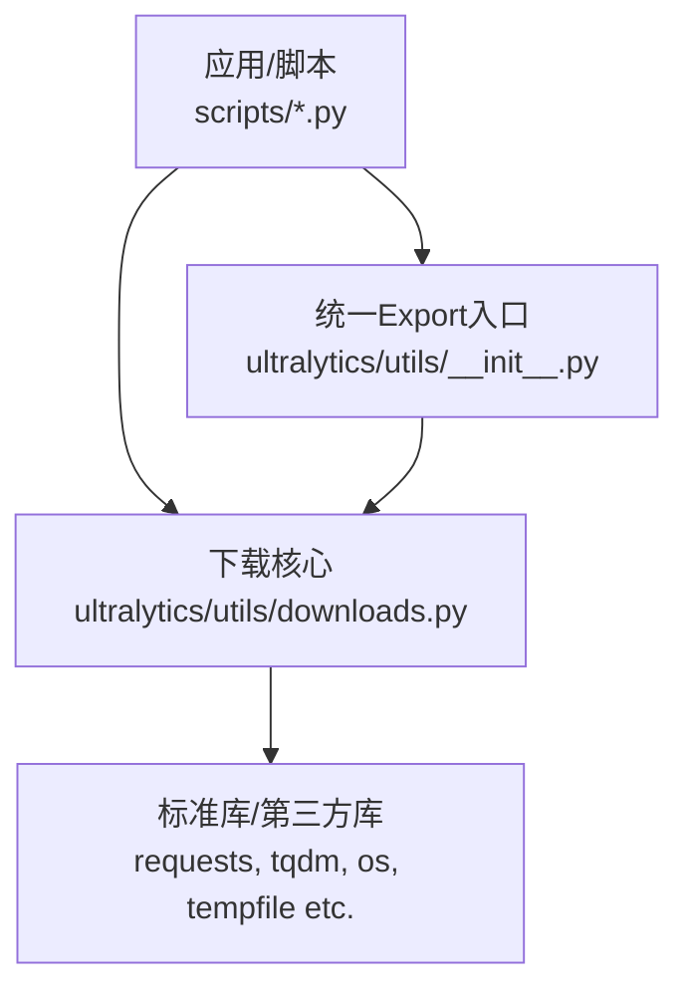
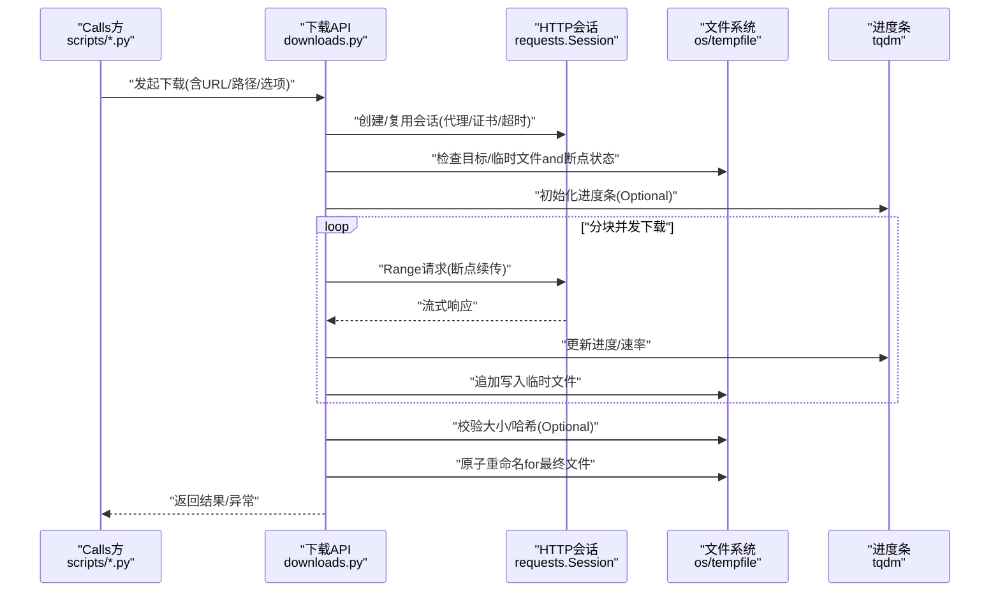
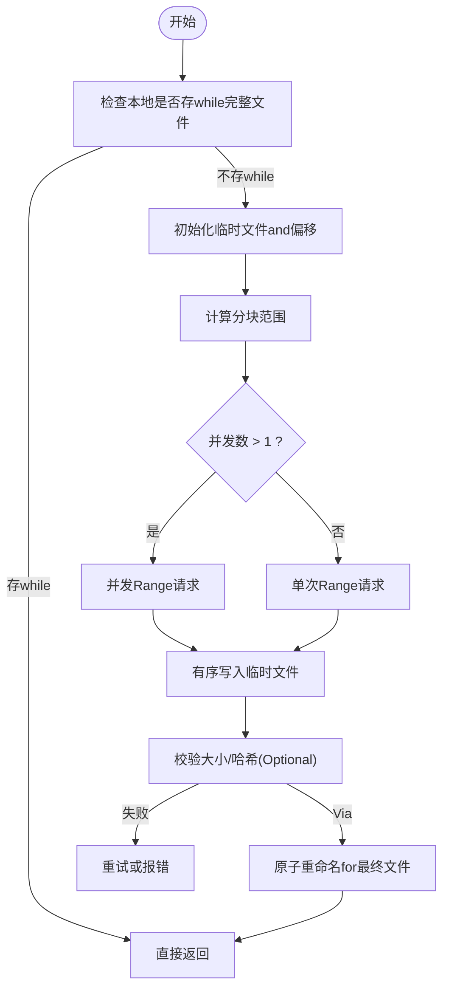
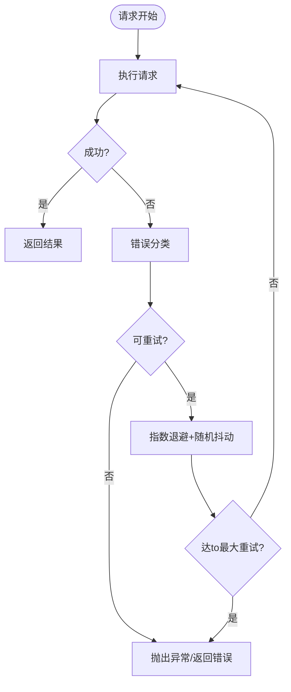
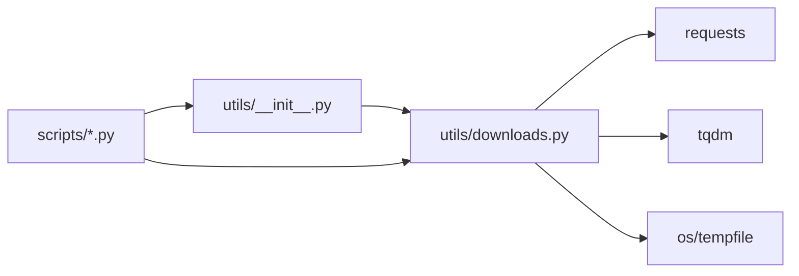

# 网络下载工具

<cite>
**Files Referenced in This Document**
- [ultralytics/utils/downloads.py](file://ultralytics/utils/downloads.py)
- [ultralytics/utils/__init__.py](file://ultralytics/utils/__init__.py)
- [scripts/download_visdrone.py](file://scripts/download_visdrone.py)
- [scripts/download_hf_dataset.py](file://scripts/download_hf_dataset.py)
</cite>

## Table of Contents
1. [Introduction](#Introduction)
2. [Project Structure](#Project Structure)
3. [Core Components](#Core Components)
4. [Architecture Overview](#Architecture Overview)
5. [Detailed Component Analysis](#Detailed Component Analysis)
6. [Dependency Analysis](#Dependency Analysis)
7. [Performance Considerations](#Performance Considerations)
8. [Troubleshooting Guide](#Troubleshooting Guide)
9. [Conclusion](#Conclusion)
10. [Appendix](#Appendix)

## Introduction
本文件for YOLO-Master 网络下载工具provides系统化Documentation，聚焦 HTTP 下载capabilitiesand工程化特性。内容涵盖：
- HTTP 下载接口Uses方法（断点续传、并发下载、重试机制）
- 进度监控and速度控制配置项
- 代理服务器Supportingand SSL 证书Validation设置
- 下载缓存策略and存储管理
- 大文件下载的内存Optimization技巧and错误处理方案
- 异步下载and多线程下载最佳实践Examples

该工具位于 ultralytics.utils.downloads Modules中，被脚本层and上层功能复用，用于从远端资源稳定高效地获取模型and数据集etc.文件。

## Project Structure
围绕下载capabilities的代码组织such as下：
- 下载核心implementing：ultralytics/utils/downloads.py
- 对外Export入口：ultralytics/utils/__init__.py
- UsesExamples脚本：scripts/download_visdrone.py、scripts/download_hf_dataset.py

Figure Source
- [ultralytics/utils/downloads.py](file://ultralytics/utils/downloads.py)
- [ultralytics/utils/__init__.py](file://ultralytics/utils/__init__.py)
- [scripts/download_visdrone.py](file://scripts/download_visdrone.py)
- [scripts/download_hf_dataset.py](file://scripts/download_hf_dataset.py)

Section Source
- [ultralytics/utils/downloads.py](file://ultralytics/utils/downloads.py)
- [ultralytics/utils/__init__.py](file://ultralytics/utils/__init__.py)
- [scripts/download_visdrone.py](file://scripts/download_visdrone.py)
- [scripts/download_hf_dataset.py](file://scripts/download_hf_dataset.py)

## Core Components
- 下载函数族：provides统一的 URL to本地文件的下载capabilities，Supporting断点续传、并发分块、重试、进度条、限速、代理and证书校验etc.。
- 进度and速率：基于 tqdm 的进度条Encapsulates，Supporting实时速率显示and可插拔回调。
- 缓存and存储：按目标路径and校验信息组织缓存，避免重复下载并保证一致性。
- 错误and恢复：对网络异常、IO 异常进行捕获and重试，Supporting指数退避and最大重试次数。
- 并发and线程安全：Via分块并发and锁机制保障多Tasks并发时的数据一致性and完整性。

Section Source
- [ultralytics/utils/downloads.py](file://ultralytics/utils/downloads.py)
- [ultralytics/utils/__init__.py](file://ultralytics/utils/__init__.py)

## Architecture Overview
下图展示了从Calls方to下载核心的关键交互流程，包括参数解析、会话初始化、分块并发、进度上报、重试and落盘。

Figure Source
- [ultralytics/utils/downloads.py](file://ultralytics/utils/downloads.py)
- [scripts/download_visdrone.py](file://scripts/download_visdrone.py)
- [scripts/download_hf_dataset.py](file://scripts/download_hf_dataset.py)

## Detailed Component Analysis

### 下载接口and参数说明
- 基本用法
  - 输入：远程 URL、本地保存路径、Optional的并发数、是否启用进度条、是否限速、代理and证书配置etc.。
  - 输出：成功时返回目标文件路径；失败时抛出异常或返回错误码（取决于具体implementing）。
- 关键参数
  - 并发and分块：max_workers、chunk_size etc.，控制并发度and单块大小。
  - 重试and退避：max_retries、backoff_factor、retry_on_codes etc.。
  - 进度and速率：progress_bar、rate_limit、callback etc.。
  - 代理and证书：proxy、verify、cert_path etc.。
  - 缓存and校验：cache_dir、checksum、force_download etc.。
- 典型Calls路径
  - Refer to脚本中的Calls方式Centered on了解参数组合and错误处理模式。

Section Source
- [ultralytics/utils/downloads.py](file://ultralytics/utils/downloads.py)
- [scripts/download_visdrone.py](file://scripts/download_visdrone.py)
- [scripts/download_hf_dataset.py](file://scripts/download_hf_dataset.py)

### 断点续传and并发下载
- 断点续传
  - Via Range 头and本地临时文件偏移量implementing，自动检测已下载部分并继续。
  - 临时文件命名and原子替换确保中断后不产生损坏文件。
- 并发下载
  - 将文件划分for多个块，由工作线程池并行拉取，合并写入。
  - 并发度受 max_workers 限制，避免过多连接导致服务端限流。
- 并发安全性
  - 写入采用顺序追加and锁保护，保证块间顺序and一致性。

Figure Source
- [ultralytics/utils/downloads.py](file://ultralytics/utils/downloads.py)

Section Source
- [ultralytics/utils/downloads.py](file://ultralytics/utils/downloads.py)

### 重试机制and错误处理
- 触发条件
  - 网络异常、超时、服务端 5xx、429 etc.。
- 策略
  - 指数退避 + 抖动，避免雪崩。
  - 最大重试次数上限，防止无限重试。
- 错误分类
  - 可重试错误：网络抖动、限流、临时性服务不可用。
  - 不可重试错误：认证失败、权限不足、目标不存whileetc.。
- Loggingand诊断
  - 记录每次重试的上下文（URL、状态码、延迟），便于定位问题。

Figure Source
- [ultralytics/utils/downloads.py](file://ultralytics/utils/downloads.py)

Section Source
- [ultralytics/utils/downloads.py](file://ultralytics/utils/downloads.py)

### 进度监控and速度控制
- 进度条
  - 基于 tqdm 的流式更新，显示百分比、剩余时间、当前速率。
  - Supporting自定义回调，用于外部系统采集Metrics。
- 速度控制
  - Via rate_limit 限制每秒字节数，避免占用带宽影响其他Tasks。
  - 内部采用令牌桶或滑动窗口算法平滑速率。
- Visualization集成
  - 可andTraining/Inference管线集成，while UI 中展示下载进度。

Section Source
- [ultralytics/utils/downloads.py](file://ultralytics/utils/downloads.py)

### 代理服务器and SSL 证书Validation
- 代理
  - Supporting http/https 代理，可Via环境变量或显式参数传入。
  - Supporting带认证的代理（User名/密码）。
- SSL 证书
  - verify=True 时Uses系统信任根；verify=False 仅用于调试环境。
  - Supporting指定自定义 CA 包或客户端证书，满足企业内网场景。
- 注意事项
  - 生产环境务必开启证书校验，避免中间人攻击风险。

Section Source
- [ultralytics/utils/downloads.py](file://ultralytics/utils/downloads.py)

### 下载缓存策略and存储管理
- 缓存Table of Contents
  - 默认缓存Table of Contents可由环境变量或参数覆盖，便于集中管理and清理。
- 去重策略
  - 基于 URL 指纹或目标文件名生成缓存键，避免重复下载。
- 一致性校验
  - Optional MD5/SHA256 校验，确保文件完整性。
- 清理策略
  - Supporting过期时间and容量阈值，定期清理旧缓存。
- 跨进程共享
  - Via只读挂载或软链接方式while多进程/容器间共享缓存。

Section Source
- [ultralytics/utils/downloads.py](file://ultralytics/utils/downloads.py)

### 大文件下载的内存Optimization
- 流式写入
  - Uses迭代器逐块读取响应体，避免一次性加载to内存。
- 合理分块
  - chunk_size 建议根据磁盘 I/O and网络吞吐调优，常见for 1~8MB。
- 并发and内存平衡
  - 提高并发需同步增大内存预算，注意工作线程池大小。
- 临时文件and原子替换
  - 先写临时文件再原子重命名，降低中断导致的碎片and损坏。

Section Source
- [ultralytics/utils/downloads.py](file://ultralytics/utils/downloads.py)

### 异步下载and多线程下载最佳实践
- 多线程
  - 适合 I/O 密集型批量下载，Combining线程池and队列调度。
  - 注意全局 GIL 对 CPU 密集Tasks的限制，下载场景通常无碍。
- 异步
  - 若上层框架Supporting asyncio，can use aiohttp etc.异步客户端提升吞吐。
  - and现有同步 API 混用时，Recommended to use线程包装器隔离阻塞 IO。
- 背压and限流
  - Via信号量或队列控制并发度，避免打满网络或磁盘。
- ExamplesRefer to
  - Refer to scripts 下脚本的Calls方式，理解参数组合and错误处理模式。

Section Source
- [ultralytics/utils/downloads.py](file://ultralytics/utils/downloads.py)
- [scripts/download_visdrone.py](file://scripts/download_visdrone.py)
- [scripts/download_hf_dataset.py](file://scripts/download_hf_dataset.py)

## Dependency Analysis
- 内部依赖
  - downloads.py 作for核心implementing，被 utils.__init__ 暴露给上层。
- External Dependencies
  - requests：HTTP 客户端，负责连接、会话、代理and证书。
  - tqdm：进度条and速率显示。
  - os/tempfile：文件操作and临时文件管理。
- 耦合关系
  - 下载核心and文件系统松耦合，便于替换存储后端。
  - 进度条可插拔，便于替换for自定义Visualization。

Figure Source
- [ultralytics/utils/__init__.py](file://ultralytics/utils/__init__.py)
- [ultralytics/utils/downloads.py](file://ultralytics/utils/downloads.py)
- [scripts/download_visdrone.py](file://scripts/download_visdrone.py)
- [scripts/download_hf_dataset.py](file://scripts/download_hf_dataset.py)

Section Source
- [ultralytics/utils/__init__.py](file://ultralytics/utils/__init__.py)
- [ultralytics/utils/downloads.py](file://ultralytics/utils/downloads.py)
- [scripts/download_visdrone.py](file://scripts/download_visdrone.py)
- [scripts/download_hf_dataset.py](file://scripts/download_hf_dataset.py)

## Performance Considerations
- 并发度选择
  - 根据网络带宽and磁盘 I/O 调整 max_workers，避免过度并发导致拥塞。
- 分块大小
  - 较大分块减少握手开销，但会增大内存占用；较小分块更灵活但增加调度成本。
- 速率限制
  - while共享环境中启用 rate_limit，避免影响其他服务。
- 缓存命中
  - Set appropriately cache_dir and校验策略，最大化缓存命中率。
- 连接复用
  - Uses持久会话and Keep-Alive，减少 TCP 握手开销。

[本节for通用指导，无需特定文件引用]

## Troubleshooting Guide
- 常见问题
  - 证书错误：检查 verify and CA 包路径，确认代理未劫持 HTTPS。
  - 超时/限流：增大超时、启用重试and退避，降低并发度。
  - 磁盘空间不足：清理缓存Table of Contents或扩容磁盘。
  - 权限问题：确保目标Table of Contents可写。
- 诊断步骤
  - 开启详细Logging，记录 URL、状态码、重试次数and耗时。
  - Uses curl/wget 复现问题，对比行for差异。
  - 切换直连and代理，定位代理链路问题。
- 恢复策略
  - 启用断点续传，避免从头开始。
  - Uses幂etc.下载逻辑，Supporting多次运行安全恢复。

Section Source
- [ultralytics/utils/downloads.py](file://ultralytics/utils/downloads.py)

## Conclusion
YOLO-Master 的网络下载工具provides了企业级可用的下载capabilities：断点续传、并发分块、重试退避、进度and限速、代理and证书校验、缓存and一致性校验etc.。Via合理的参数配置and工程实践，可while复杂网络环境下稳定高效地完成大文件下载Tasks。建议while部署中启用缓存and校验，并根据实际环境调优并发and速率限制，Centered on获得最佳稳定性and吞吐。

[本节for总结性内容，无需特定文件引用]

## Appendix
- 快速上手
  - Refer to scripts 下的Examples脚本，了解常用参数组合and错误处理模式。
- 扩展建议
  - such as需异步下载，可while上层Encapsulates asyncio Adapter，复用现有核心逻辑。
  - such as需自定义存储后端，可抽象出写入接口，替换临时文件and原子重命名逻辑。

Section Source
- [scripts/download_visdrone.py](file://scripts/download_visdrone.py)
- [scripts/download_hf_dataset.py](file://scripts/download_hf_dataset.py)