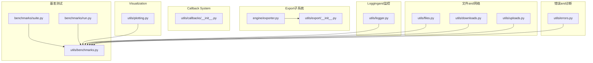
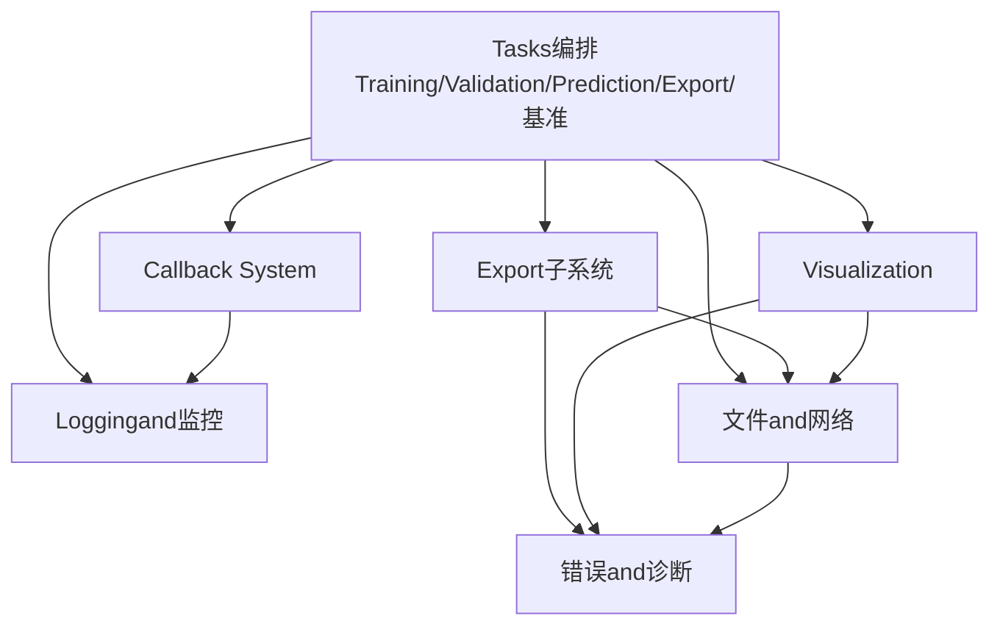
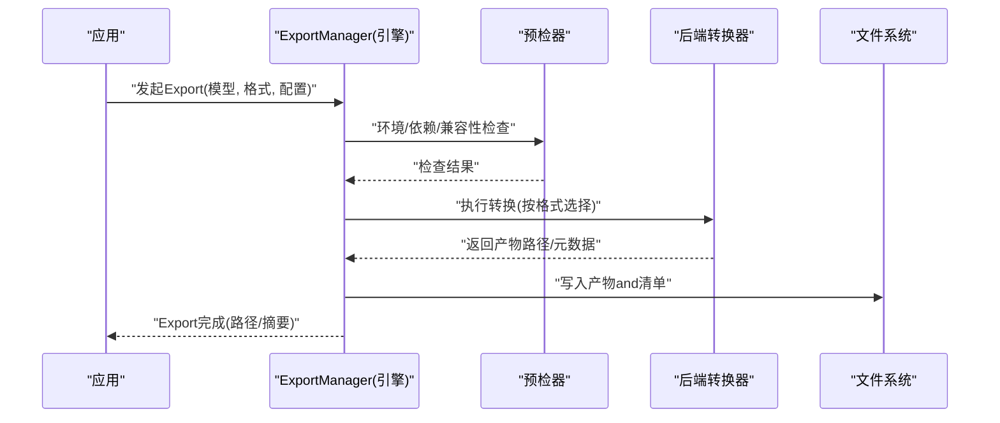
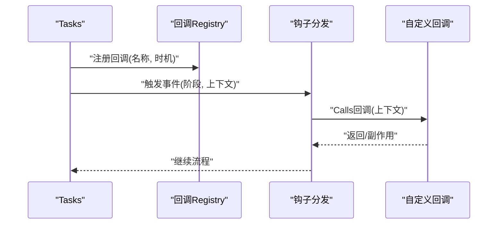
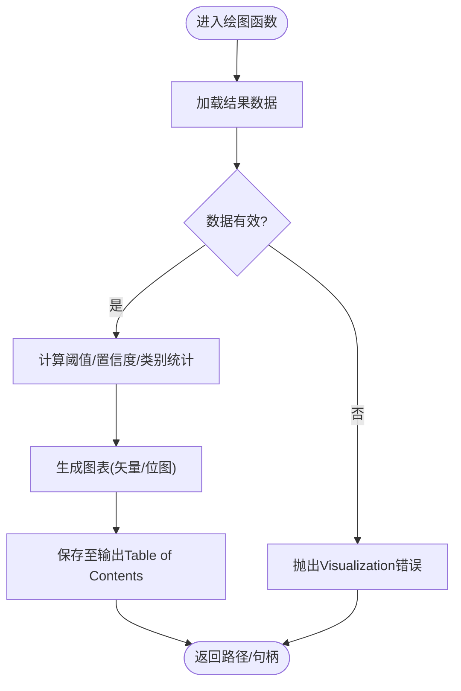
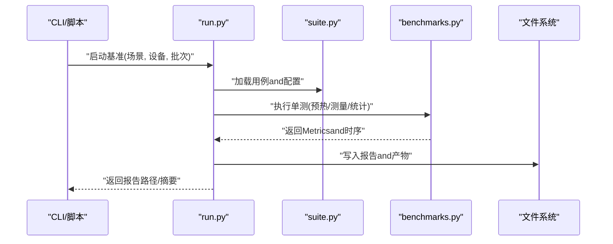
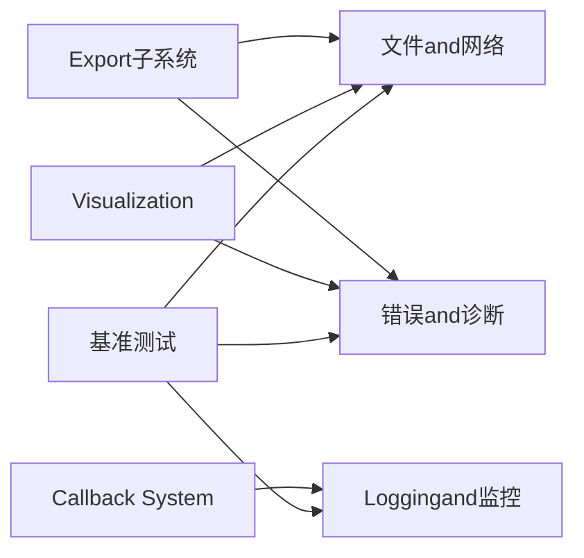

# Utilities API

<cite>
**Files Referenced in This Document**
- [ultralytics/utils/callbacks/__init__.py](file://ultralytics/utils/callbacks/__init__.py)
- [ultralytics/utils/export/__init__.py](file://ultralytics/utils/export/__init__.py)
- [ultralytics/engine/exporter.py](file://ultralytics/engine/exporter.py)
- [ultralytics/utils/benchmarks.py](file://ultralytics/utils/benchmarks.py)
- [ultralytics/utils/plotting.py](file://ultralytics/utils/plotting.py)
- [ultralytics/utils/logger.py](file://ultralytics/utils/logger.py)
- [ultralytics/utils/files.py](file://ultralytics/utils/files.py)
- [ultralytics/utils/downloads.py](file://ultralytics/utils/downloads.py)
- [ultralytics/utils/uploads.py](file://ultralytics/utils/uploads.py)
- [ultralytics/utils/errors.py](file://ultralytics/utils/errors.py)
- [benchmarks/suite.py](file://benchmarks/suite.py)
- [benchmarks/run.py](file://benchmarks/run.py)
</cite>

## Table of Contents
1. [Introduction](#Introduction)
2. [Project Structure](#Project Structure)
3. [Core Components](#Core Components)
4. [Architecture Overview](#Architecture Overview)
5. [Detailed Component Analysis](#Detailed Component Analysis)
6. [Dependency Analysis](#Dependency Analysis)
7. [性能考量](#性能考量)
8. [Troubleshooting Guide](#Troubleshooting Guide)
9. [Conclusion](#Conclusion)
10. [Appendix](#Appendix)

## Introduction
本文件for YOLO-Master 工具 API 的权威Refer to，聚焦实用工具and辅助函数，覆盖Centered on下主题：
- Export工具and ExportManager 的Export Format Supportand配置选项
- Callback 系统的注册机制and自定义回调implementing方法
- Visualization API Uses指南（结果图表生成、交互式Visualization）
- 基准测试工具的接口and报告生成方法
- Loggingand监控的配置选项
- 文件操作andNetwork requests的工具函数
- 错误诊断and调试工具的Uses指南

目标读者包括希望扩展 YOLO-Master 工作流、集成第三方系统或构建自动化流水线的Engineers。

## Project Structure
工具 API 主要分布whileCentered on下Modules：
- Export子系统：engine.exporter and utils.export
- Callback System：utils.callbacks
- Visualization：utils.plotting
- 基准测试：utils.benchmarks and benchmarks.suite/run
- Loggingand监控：utils.logger
- 文件and网络：utils.files, utils.downloads, utils.uploads
- 错误and诊断：utils.errors

Figure Source
- [ultralytics/engine/exporter.py](file://ultralytics/engine/exporter.py)
- [ultralytics/utils/export/__init__.py](file://ultralytics/utils/export/__init__.py)
- [ultralytics/utils/callbacks/__init__.py](file://ultralytics/utils/callbacks/__init__.py)
- [ultralytics/utils/plotting.py](file://ultralytics/utils/plotting.py)
- [ultralytics/utils/benchmarks.py](file://ultralytics/utils/benchmarks.py)
- [benchmarks/suite.py](file://benchmarks/suite.py)
- [benchmarks/run.py](file://benchmarks/run.py)
- [ultralytics/utils/logger.py](file://ultralytics/utils/logger.py)
- [ultralytics/utils/files.py](file://ultralytics/utils/files.py)
- [ultralytics/utils/downloads.py](file://ultralytics/utils/downloads.py)
- [ultralytics/utils/uploads.py](file://ultralytics/utils/uploads.py)
- [ultralytics/utils/errors.py](file://ultralytics/utils/errors.py)

Section Source
- [ultralytics/engine/exporter.py](file://ultralytics/engine/exporter.py)
- [ultralytics/utils/export/__init__.py](file://ultralytics/utils/export/__init__.py)
- [ultralytics/utils/callbacks/__init__.py](file://ultralytics/utils/callbacks/__init__.py)
- [ultralytics/utils/plotting.py](file://ultralytics/utils/plotting.py)
- [ultralytics/utils/benchmarks.py](file://ultralytics/utils/benchmarks.py)
- [benchmarks/suite.py](file://benchmarks/suite.py)
- [benchmarks/run.py](file://benchmarks/run.py)
- [ultralytics/utils/logger.py](file://ultralytics/utils/logger.py)
- [ultralytics/utils/files.py](file://ultralytics/utils/files.py)
- [ultralytics/utils/downloads.py](file://ultralytics/utils/downloads.py)
- [ultralytics/utils/uploads.py](file://ultralytics/utils/uploads.py)
- [ultralytics/utils/errors.py](file://ultralytics/utils/errors.py)

## Core Components
本节概述各工具子系统的职责and对外暴露的关键capabilities，便于快速定位Documentation位置andUses方法。

- Export子系统
  - provides统一的Model Export入口and格式Supporting矩阵，Encapsulates ONNX/TensorRT/OpenVINO/CoreML/TFLite etc.后端转换流程，并输出标准化产物and元数据。
  - 关键入口位于 engine.exporter and utils.export。

- Callback System
  - whileTraining、Validation、Prediction、Exportetc.阶段触发事件钩子，允许User注入自定义逻辑（such asMetrics上报、中间快照、告警）。
  - Via统一Registry管理回调生命周期。

- Visualization
  - provides PR/AUC/混淆矩阵/热力图/轨迹图etc.常用图表绘制capabilities，Supporting批量and交互式输出。

- 基准测试
  - provides端to端Benchmark Suiteand微基准接口，Supporting多设备、多精度、多批次的吞吐/延迟统计and报告生成。

- Loggingand监控
  - 结构化Logging、分级控制、可插拔处理器，便于对接外部监控系统。

- 文件and网络
  - 路径解析、临时Table of Contents、下载/上传、断点续传、重试and校验etc.通用工具。

- 错误and诊断
  - 统一异常层次、诊断信息收集、上下文增强and可观测性字段。

Section Source
- [ultralytics/engine/exporter.py](file://ultralytics/engine/exporter.py)
- [ultralytics/utils/export/__init__.py](file://ultralytics/utils/export/__init__.py)
- [ultralytics/utils/callbacks/__init__.py](file://ultralytics/utils/callbacks/__init__.py)
- [ultralytics/utils/plotting.py](file://ultralytics/utils/plotting.py)
- [ultralytics/utils/benchmarks.py](file://ultralytics/utils/benchmarks.py)
- [benchmarks/suite.py](file://benchmarks/suite.py)
- [benchmarks/run.py](file://benchmarks/run.py)
- [ultralytics/utils/logger.py](file://ultralytics/utils/logger.py)
- [ultralytics/utils/files.py](file://ultralytics/utils/files.py)
- [ultralytics/utils/downloads.py](file://ultralytics/utils/downloads.py)
- [ultralytics/utils/uploads.py](file://ultralytics/utils/uploads.py)
- [ultralytics/utils/errors.py](file://ultralytics/utils/errors.py)

## Architecture Overview
下图展示工具 API 的整体交互关系：上层Tasks（Training/Validation/Prediction/Export/基准）ViaCallback SystemandExport子系统协作；VisualizationandLogging贯穿全链路；文件and网络支撑资源获取and产物落地；错误and诊断保障稳定性and可观测性。

Figure Source
- [ultralytics/utils/callbacks/__init__.py](file://ultralytics/utils/callbacks/__init__.py)
- [ultralytics/engine/exporter.py](file://ultralytics/engine/exporter.py)
- [ultralytics/utils/plotting.py](file://ultralytics/utils/plotting.py)
- [ultralytics/utils/logger.py](file://ultralytics/utils/logger.py)
- [ultralytics/utils/files.py](file://ultralytics/utils/files.py)
- [ultralytics/utils/downloads.py](file://ultralytics/utils/downloads.py)
- [ultralytics/utils/uploads.py](file://ultralytics/utils/uploads.py)
- [ultralytics/utils/errors.py](file://ultralytics/utils/errors.py)

## Detailed Component Analysis

### Export子系统and ExportManager
- 职责
  - 统一管理Model Export流程，屏蔽不同后端的差异，provides一致的参数and产物规范。
  - 维护Exportcapabilities矩阵，动态发现可用后端and约束条件。
- 关键capabilities
  - Export格式：ONNX、TensorRT、OpenVINO、CoreML、TFLite、TorchScript、PaddlePaddle、MNN、NCNN、RKNN、QNN、Litert、DeepX、Axelera、Hailo etc.（Centered on实际implementingfor准）。
  - 配置项：输入形状、动态轴、Optimization级别、量化策略、算子白名单、运行时目标平台、产物命名andTable of Contents布局。
  - 预检and校验：环境探测、依赖检查、兼容性Validation、Export前自检。
  - 产物and元数据：Export模型、配置文件、版本信息and运行说明。
- 典型Calls序列

Figure Source
- [ultralytics/engine/exporter.py](file://ultralytics/engine/exporter.py)
- [ultralytics/utils/export/__init__.py](file://ultralytics/utils/export/__init__.py)

Section Source
- [ultralytics/engine/exporter.py](file://ultralytics/engine/exporter.py)
- [ultralytics/utils/export/__init__.py](file://ultralytics/utils/export/__init__.py)

### Callback System（注册and自定义）
- 设计要点
  - 事件drivers are installed：while关键阶段（开始/End、每步、每轮、异常）触发回调。
  - Registry：集中管理回调名称toimplementing的映射，Supporting优先级and过滤。
  - 上下文：回调可访问当前Tasks状态、配置、Metricsand产物路径。
- 自定义回调步骤
  - 定义回调类或函数，遵循回调签名约定。
  - whileRegistry中登记回调名and触发时机。
  - whileTasks启动时加载并执行。
- 典型Calls序列

Figure Source
- [ultralytics/utils/callbacks/__init__.py](file://ultralytics/utils/callbacks/__init__.py)

Section Source
- [ultralytics/utils/callbacks/__init__.py](file://ultralytics/utils/callbacks/__init__.py)

### Visualization API（结果图表and交互式Visualization）
- capabilities概览
  - 标准图表：PR 曲线、AUC、混淆矩阵、损失/Metrics曲线、热力图、轨迹图、掩码/关键点叠加。
  - Batching and Parallelism：Supporting数据集级汇总and对比视图。
  - 交互模式：Jupyter/Notebook 内联渲染、HTML Export、Web 预览。
- Uses建议
  - 将Export/Inference/EvaluationResults Object传入绘图函数，指定输出Table of Contentsand样式。
  - 对大规模结果采用分块渲染and缓存，避免内存峰值。
- 流程图（生成 PR 曲线Examples）

Figure Source
- [ultralytics/utils/plotting.py](file://ultralytics/utils/plotting.py)

Section Source
- [ultralytics/utils/plotting.py](file://ultralytics/utils/plotting.py)

### 基准测试工具（接口and报告）
- 套件and运行器
  - suite：定义基准用例、场景、Metricsand聚合规则。
  - run：调度执行、并发控制、结果收集and报告生成。
- Metricsand报告
  - 吞吐（FPS）、延迟（p50/p95/p99）、内存占用、能耗（Optional）、复现实验哈希。
  - 输出 JSON/CSV/HTML 报告，包含实验元数据and原始时序。
- 执行序列

Figure Source
- [benchmarks/run.py](file://benchmarks/run.py)
- [benchmarks/suite.py](file://benchmarks/suite.py)
- [ultralytics/utils/benchmarks.py](file://ultralytics/utils/benchmarks.py)

Section Source
- [benchmarks/run.py](file://benchmarks/run.py)
- [benchmarks/suite.py](file://benchmarks/suite.py)
- [ultralytics/utils/benchmarks.py](file://ultralytics/utils/benchmarks.py)

### Loggingand监控
- 功能特性
  - 分级Logging（DEBUG/INFO/WARNING/ERROR），结构化字段（TasksID、阶段、Metrics、路径）。
  - 可插拔处理器（控制台、文件、远程上报），Supporting异步写入and缓冲。
  - andCallback System集成，自动附加上下文。
- 配置要点
  - Logging级别、输出路径、滚动策略、采样率、敏感信息脱敏。
  - and监控系统对接（Metrics上报、追踪 ID 透传）。

Section Source
- [ultralytics/utils/logger.py](file://ultralytics/utils/logger.py)

### 文件操作andNetwork requests
- 文件工具
  - 路径规范化、临时Table of Contents管理、Table of Contents/文件存while性检查、递归遍历、大小and哈希计算。
- 下载工具
  - URL 下载、断点续传、重试and退避、完整性校验、代理and超时设置。
- 上传工具
  - 分片上传、进度回调、失败重试、存储后端抽象。
- Uses建议
  - 所有 I/O 操作应带超时and重试，避免阻塞主流程。
  - 大文件处理优先流式读写，减少内存占用。

Section Source
- [ultralytics/utils/files.py](file://ultralytics/utils/files.py)
- [ultralytics/utils/downloads.py](file://ultralytics/utils/downloads.py)
- [ultralytics/utils/uploads.py](file://ultralytics/utils/uploads.py)

### 错误诊断and调试工具
- 异常层次
  - 统一基类and领域异常，携带上下文（Tasks、阶段、配置片段、堆栈摘要）。
- 诊断capabilities
  - 自动收集环境信息、依赖版本、GPU/CPU 状态、磁盘空间、网络连通性。
  - Export/Inference/Training阶段的断点and回溯增强。
- Uses建议
  - while关键路径捕获并包装异常，附带必要上下文Centered on便定位根因。
  - CombiningLoggingand回调上报，形成闭环诊断。

Section Source
- [ultralytics/utils/errors.py](file://ultralytics/utils/errors.py)

## Dependency Analysis
- 耦合and内聚
  - Export子系统and后端转换器高内聚，Via预检器and环境探测降低外部耦合。
  - Callback System作for横切关注点，低耦合接入各子系统。
  - Visualizationand基准测试共享Loggingand文件工具，复用性强。
- External Dependencies
  - 网络and文件系统for基础设施层，被多数Modules间接依赖。
  - 错误and诊断贯穿全链路，提升可观测性。

Figure Source
- [ultralytics/engine/exporter.py](file://ultralytics/engine/exporter.py)
- [ultralytics/utils/export/__init__.py](file://ultralytics/utils/export/__init__.py)
- [ultralytics/utils/callbacks/__init__.py](file://ultralytics/utils/callbacks/__init__.py)
- [ultralytics/utils/plotting.py](file://ultralytics/utils/plotting.py)
- [ultralytics/utils/benchmarks.py](file://ultralytics/utils/benchmarks.py)
- [ultralytics/utils/logger.py](file://ultralytics/utils/logger.py)
- [ultralytics/utils/files.py](file://ultralytics/utils/files.py)
- [ultralytics/utils/downloads.py](file://ultralytics/utils/downloads.py)
- [ultralytics/utils/uploads.py](file://ultralytics/utils/uploads.py)
- [ultralytics/utils/errors.py](file://ultralytics/utils/errors.py)

Section Source
- [ultralytics/engine/exporter.py](file://ultralytics/engine/exporter.py)
- [ultralytics/utils/export/__init__.py](file://ultralytics/utils/export/__init__.py)
- [ultralytics/utils/callbacks/__init__.py](file://ultralytics/utils/callbacks/__init__.py)
- [ultralytics/utils/plotting.py](file://ultralytics/utils/plotting.py)
- [ultralytics/utils/benchmarks.py](file://ultralytics/utils/benchmarks.py)
- [ultralytics/utils/logger.py](file://ultralytics/utils/logger.py)
- [ultralytics/utils/files.py](file://ultralytics/utils/files.py)
- [ultralytics/utils/downloads.py](file://ultralytics/utils/downloads.py)
- [ultralytics/utils/uploads.py](file://ultralytics/utils/uploads.py)
- [ultralytics/utils/errors.py](file://ultralytics/utils/errors.py)

## 性能考量
- Export
  - Set appropriately输入形状and动态轴，避免不必要的维度膨胀。
  - 启用后端Optimization开关（such as TensorRT 精度、OpenVINO 压缩），权衡体积and速度。
- Visualization
  - 大数据集分批渲染，Uses矢量格式减少重复计算。
- 基准测试
  - 预热阶段充分，避免冷启动偏差；多次采样取稳健统计量。
  - 控制并发度，避免资源争用导致Metrics失真。
- Loggingand监控
  - 调整采样率and缓冲大小，降低 I/O 开销。
- 文件and网络
  - Uses连接池and并发下载，Combined with校验保证一致性。

[This section provides general guidance and does not directly analyze specific files]

## Troubleshooting Guide
- Export Failure
  - 检查预检结果and依赖版本；确认目标平台and后端可用性；查看产物路径权限。
- 回调未触发
  - 核对回调注册时机and名称；确认上下文是否满足触发条件。
- Visualization无输出
  - Validation输入数据结构and字段；检查输出Table of Contentsand磁盘空间。
- 基准结果不稳定
  - 增加预热and采样次数；固定随机种子；隔离系统负载。
- Logging缺失
  - 确认Logging级别and处理器配置；检查异步写入队列是否积压。
- 下载/上传失败
  - 检查网络连通性and代理设置；启用重试and断点续传；校验完整性。

Section Source
- [ultralytics/utils/errors.py](file://ultralytics/utils/errors.py)
- [ultralytics/utils/logger.py](file://ultralytics/utils/logger.py)
- [ultralytics/utils/downloads.py](file://ultralytics/utils/downloads.py)
- [ultralytics/utils/uploads.py](file://ultralytics/utils/uploads.py)
- [ultralytics/utils/files.py](file://ultralytics/utils/files.py)
- [ultralytics/utils/callbacks/__init__.py](file://ultralytics/utils/callbacks/__init__.py)
- [ultralytics/utils/plotting.py](file://ultralytics/utils/plotting.py)
- [ultralytics/utils/benchmarks.py](file://ultralytics/utils/benchmarks.py)
- [ultralytics/engine/exporter.py](file://ultralytics/engine/exporter.py)

## Conclusion
YOLO-Master 工具 API 围绕“Export—回调—Visualization—基准—Logging—文件/网络—错误诊断”构建了完整的基础设施层。Via统一注册andModules化设计，开发者可Centered on灵活扩展工作流、提升可观测性and稳定性，并while多平台and多后端环境下获得一致体验。建议while生产环境中启用结构化Loggingand回调上报，CombiningBenchmark Suite持续Evaluation性能回归。

[This section is summary content and does not directly analyze specific files]

## Appendix
- 术语
  - Export：将Training好的模型转换for部署友好的格式and产物集合。
  - 回调：while特定事件发生时触发users自定义逻辑。
  - 基准：用于衡量吞吐、延迟and资源占用的系统性测试。
- 相关Documentation
  - Exportcapabilities矩阵and宏定义参见 docs/macros 下的Export相关Documentation。
  - Refer to手册and用法Examples见 docs/reference and examples。

[本节for补充信息，不直接分析具体文件]