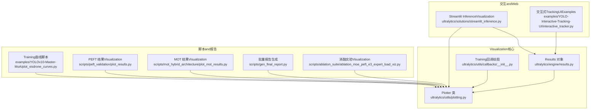
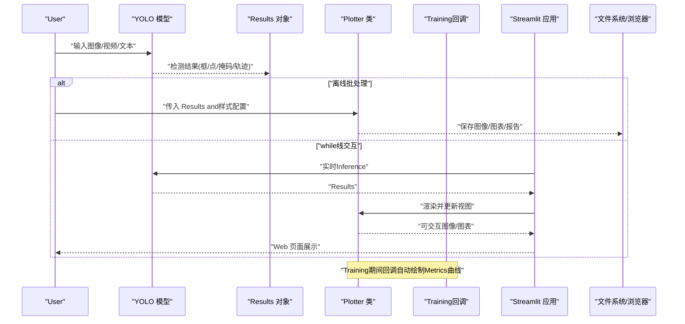
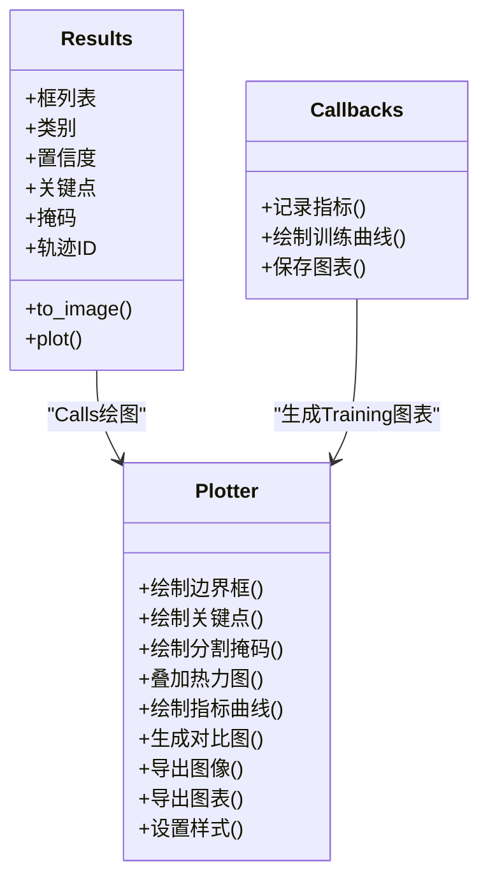
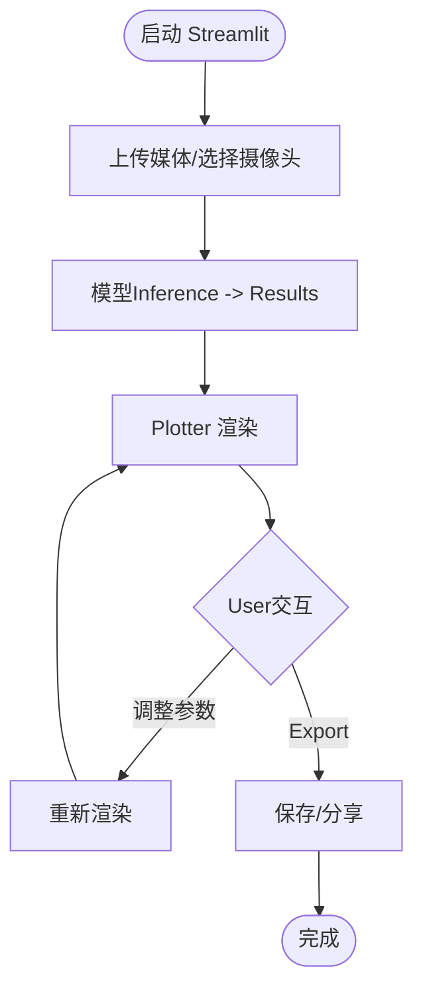
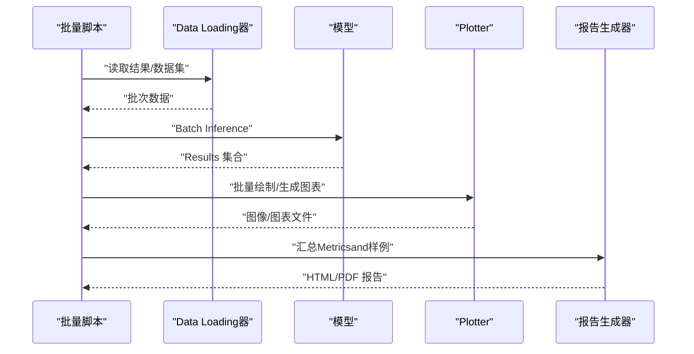
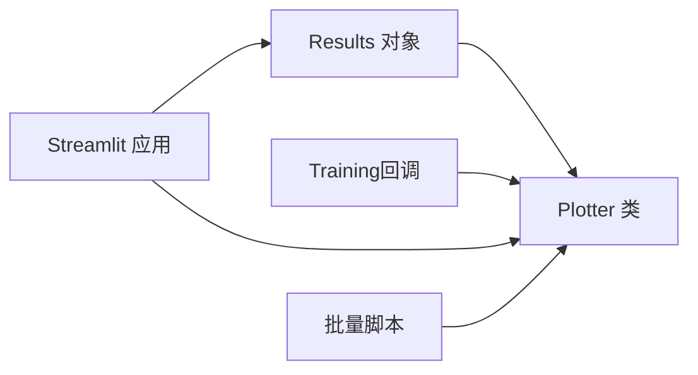

# VisualizationUtilities API

<cite>
**Files Referenced in This Document**
- [ultralytics/utils/plotting.py](file://ultralytics/utils/plotting.py)
- [ultralytics/solutions/streamlit_inference.py](file://ultralytics/solutions/streamlit_inference.py)
- [examples/YOLO-Interactive-Tracking-UI/interactive_tracker.py](file://examples/YOLO-Interactive-Tracking-UI/interactive_tracker.py)
- [examples/YOLOv10-Master-MoA/plot_visdrone_curves.py](file://examples/YOLOv10-Master-MoA/plot_visdrone_curves.py)
- [scripts/ablation_suite/ablation_moe_peft_e3_expert_load_viz.py](file://scripts/ablation_suite/ablation_moe_peft_e3_expert_load_viz.py)
- [scripts/gen_final_report.py](file://scripts/gen_final_report.py)
- [scripts/peft_validation/plot_results.py](file://scripts/peft_validation/plot_results.py)
- [scripts/mot_hybrid_architecture/plot_mot_results.py](file://scripts/mot_hybrid_architecture/plot_mot_results.py)
- [ultralytics/engine/results.py](file://ultralytics/engine/results.py)
- [ultralytics/utils/callbacks/__init__.py](file://ultralytics/utils/callbacks/__init__.py)
</cite>

## Table of Contents
1. [Introduction](#Introduction)
2. [Project Structure](#Project Structure)
3. [Core Components](#Core Components)
4. [Architecture Overview](#Architecture Overview)
5. [Detailed Component Analysis](#Detailed Component Analysis)
6. [Dependency Analysis](#Dependency Analysis)
7. [Performance Considerations](#Performance Considerations)
8. [Troubleshooting Guide](#Troubleshooting Guide)
9. [Conclusion](#Conclusion)
10. [Appendix](#Appendix)

## Introduction
本文件for YOLO-Master Visualization工具 API 的权威Documentation，聚焦Centered on下目标：
- 结果Visualization函数接口规范：检测结果绘制、Training曲线生成and性能图表创建。
- Plotter 类绘图方法and样式配置说明。
- 交互式Visualizationimplementing方式and Web 集成方法（Streamlit）。
- 自定义Visualization组件开发指南。
- 批量结果Visualizationand报告生成功能。
- 3D VisualizationandMultimodal数据展示方法。
- Visualization结果Export格式and分享功能。
- 渲染性能Optimization技巧。

## Project Structure
andVisualization相关的代码主要分布whileCentered on下位置：
- 通用绘图工具and Plotter 类：ultralytics/utils/plotting.py
- Training回调中的自动绘图：ultralytics/utils/callbacks/__init__.py
- InferenceResults Objectand绘制入口：ultralytics/engine/results.py
- Streamlit 实时InferenceandVisualizationExamples：ultralytics/solutions/streamlit_inference.py
- 交互式Tracking UI Examples：examples/YOLO-Interactive-Tracking-UI/interactive_tracker.py
- Training曲线and对比图脚本：examples/YOLOv10-Master-MoA/plot_visdrone_curves.py、scripts/peft_validation/plot_results.py、scripts/mot_hybrid_architecture/plot_mot_results.py
- 批量分析and报告生成：scripts/gen_final_report.py、scripts/ablation_suite/ablation_moe_peft_e3_expert_load_viz.py

Figure Source
- [ultralytics/utils/plotting.py](file://ultralytics/utils/plotting.py)
- [ultralytics/engine/results.py](file://ultralytics/engine/results.py)
- [ultralytics/utils/callbacks/__init__.py](file://ultralytics/utils/callbacks/__init__.py)
- [ultralytics/solutions/streamlit_inference.py](file://ultralytics/solutions/streamlit_inference.py)
- [examples/YOLO-Interactive-Tracking-UI/interactive_tracker.py](file://examples/YOLO-Interactive-Tracking-UI/interactive_tracker.py)
- [examples/YOLOv10-Master-MoA/plot_visdrone_curves.py](file://examples/YOLOv10-Master-MoA/plot_visdrone_curves.py)
- [scripts/peft_validation/plot_results.py](file://scripts/peft_validation/plot_results.py)
- [scripts/mot_hybrid_architecture/plot_mot_results.py](file://scripts/mot_hybrid_architecture/plot_mot_results.py)
- [scripts/gen_final_report.py](file://scripts/gen_final_report.py)
- [scripts/ablation_suite/ablation_moe_peft_e3_expert_load_viz.py](file://scripts/ablation_suite/ablation_moe_peft_e3_expert_load_viz.py)

Section Source
- [ultralytics/utils/plotting.py](file://ultralytics/utils/plotting.py)
- [ultralytics/engine/results.py](file://ultralytics/engine/results.py)
- [ultralytics/utils/callbacks/__init__.py](file://ultralytics/utils/callbacks/__init__.py)
- [ultralytics/solutions/streamlit_inference.py](file://ultralytics/solutions/streamlit_inference.py)
- [examples/YOLO-Interactive-Tracking-UI/interactive_tracker.py](file://examples/YOLO-Interactive-Tracking-UI/interactive_tracker.py)
- [examples/YOLOv10-Master-MoA/plot_visdrone_curves.py](file://examples/YOLOv10-Master-MoA/plot_visdrone_curves.py)
- [scripts/peft_validation/plot_results.py](file://scripts/peft_validation/plot_results.py)
- [scripts/mot_hybrid_architecture/plot_mot_results.py](file://scripts/mot_hybrid_architecture/plot_mot_results.py)
- [scripts/gen_final_report.py](file://scripts/gen_final_report.py)
- [scripts/ablation_suite/ablation_moe_peft_e3_expert_load_viz.py](file://scripts/ablation_suite/ablation_moe_peft_e3_expert_load_viz.py)

## Core Components
- Plotter 类（绘图引擎）
  - 职责：Encapsulates检测框、关键点、分割掩码、热力图etc.绘制逻辑；provides统一的样式配置andExportcapabilities。
  - 典型方法：绘制边界框、类别标签、置信度、关键点连线、分割轮廓、热力图叠加、TrainingMetrics曲线etc.。
  - 样式配置：颜色映射、线宽、透明度、字体大小、标注布局、背景处理etc.。
  - 输出：返回图像数组或保存至文件，Supporting PNG/JPG/PDF/SVG etc.格式。
- Results 对象（Inference结果载体）
  - 职责：承载模型输出（框、类别、置信度、关键点、掩码、轨迹IDetc.），并provides便捷绘图接口。
  - and Plotter 的关系：Results 通常Calls Plotter 进行渲染，或将自身作for输入传递给外部绘图脚本。
- Training回调（自动绘图）
  - 职责：whileTraining过程中按阶段记录并绘制损失、精度、mAP etc.Metrics曲线，便于while线监控。
  - 触发时机：每个 epoch/step End或Validation Set Evaluation后。
- Streamlit 集成（Web Visualization）
  - 职责：将Inference结果Centered on交互式界面呈现，Supporting上传媒体、切换阈值、查看历史结果、Export图片etc.。
- Examplesand脚本（批量and报告）
  - 作用：演示such as何对批量结果进行Visualization、生成对比图、汇总报告and分享链接。

Section Source
- [ultralytics/utils/plotting.py](file://ultralytics/utils/plotting.py)
- [ultralytics/engine/results.py](file://ultralytics/engine/results.py)
- [ultralytics/utils/callbacks/__init__.py](file://ultralytics/utils/callbacks/__init__.py)
- [ultralytics/solutions/streamlit_inference.py](file://ultralytics/solutions/streamlit_inference.py)

## Architecture Overview
下图展示了从模型InferencetoVisualization的端to端流程，包括离线脚本andwhile线 Web 两种路径。

Figure Source
- [ultralytics/engine/results.py](file://ultralytics/engine/results.py)
- [ultralytics/utils/plotting.py](file://ultralytics/utils/plotting.py)
- [ultralytics/utils/callbacks/__init__.py](file://ultralytics/utils/callbacks/__init__.py)
- [ultralytics/solutions/streamlit_inference.py](file://ultralytics/solutions/streamlit_inference.py)

## Detailed Component Analysis

### Plotter 类and绘图方法
- 检测结果绘制
  - 绘制边界框：Supporting多类别颜色、边框宽度、半透明填充、标签显示（类别+置信度）。
  - 关键点绘制：骨架连线、节点标记、可见性指示。
  - 分割掩码：轮廓描边、区域填充、透明度控制。
  - 热力图叠加：将注意力或显著性热力图and原图融合，Supporting色带and归一化选项。
- Training曲线and性能图表
  - Metrics曲线：损失、精度、召回率、mAP@0.5、mAP@0.5:0.95 etc.随 epoch 变化曲线。
  - 对比图：多模型或多配置while同一图中的对比，Supporting分组and图例。
  - 统计图：混淆矩阵、PR 曲线、ROC 曲线、类别分布直方图etc.。
- 样式配置
  - 全局样式：主题、字体、字号、颜色表、线条样式、网格and坐标轴刻度。
  - 局部覆盖：针对特定Tasks或数据集的默认样式覆盖。
- Exportand分享
  - Export格式：PNG/JPG（位图）、PDF/SVG（矢量）、HTML（含交互图表）、JSON（元数据）。
  - 分享方式：本地下载、生成分享链接（Combining平台存储）、嵌入 Notebook/网页。

Figure Source
- [ultralytics/utils/plotting.py](file://ultralytics/utils/plotting.py)
- [ultralytics/engine/results.py](file://ultralytics/engine/results.py)
- [ultralytics/utils/callbacks/__init__.py](file://ultralytics/utils/callbacks/__init__.py)

Section Source
- [ultralytics/utils/plotting.py](file://ultralytics/utils/plotting.py)
- [ultralytics/engine/results.py](file://ultralytics/engine/results.py)
- [ultralytics/utils/callbacks/__init__.py](file://ultralytics/utils/callbacks/__init__.py)

### 交互式Visualizationand Web 集成（Streamlit）
- 实时InferenceandVisualization
  - Via Streamlit 接收User上传的图像/视频流，Calls模型Inference得to Results，再Uses Plotter 渲染并即时更新界面。
  - Supporting动态调整阈值、选择类别、切换Visualization模式（仅框/关键点/掩码/热力图）。
- 交互控件
  - 滑块/下拉菜单：阈值、类别过滤、样式切换。
  - 按钮：Export当前帧、批量Export、生成报告。
  - 历史记录：缓存最近 N 次Inference结果，Supporting回放and对比。
- 部署and分享
  - 本地运行：streamlit run streamlit_inference.py。
  - 云端部署：Containerized Deployment，Combined with对象存储生成分享链接。

Figure Source
- [ultralytics/solutions/streamlit_inference.py](file://ultralytics/solutions/streamlit_inference.py)
- [ultralytics/engine/results.py](file://ultralytics/engine/results.py)
- [ultralytics/utils/plotting.py](file://ultralytics/utils/plotting.py)

Section Source
- [ultralytics/solutions/streamlit_inference.py](file://ultralytics/solutions/streamlit_inference.py)
- [examples/YOLO-Interactive-Tracking-UI/interactive_tracker.py](file://examples/YOLO-Interactive-Tracking-UI/interactive_tracker.py)

### 批量结果Visualizationand报告生成
- 批量Visualization
  - 遍历数据集或Inference结果Table of Contents，统一Calls Plotter 生成Visualization图集，Supporting分页and缩略图预览。
  - 脚本Examples：Training曲线对比、PEFT 结果Visualization、MOT 轨迹Visualization。
- 报告生成
  - 汇总关键Metrics、代表性样本、失败案例、趋势分析，输出 HTML/PDF 报告。
  - 自动化流水线：Data Loading -> Inference -> Visualization -> 报告组装 -> Export。

Figure Source
- [examples/YOLOv10-Master-MoA/plot_visdrone_curves.py](file://examples/YOLOv10-Master-MoA/plot_visdrone_curves.py)
- [scripts/peft_validation/plot_results.py](file://scripts/peft_validation/plot_results.py)
- [scripts/mot_hybrid_architecture/plot_mot_results.py](file://scripts/mot_hybrid_architecture/plot_mot_results.py)
- [scripts/gen_final_report.py](file://scripts/gen_final_report.py)
- [scripts/ablation_suite/ablation_moe_peft_e3_expert_load_viz.py](file://scripts/ablation_suite/ablation_moe_peft_e3_expert_load_viz.py)

Section Source
- [examples/YOLOv10-Master-MoA/plot_visdrone_curves.py](file://examples/YOLOv10-Master-MoA/plot_visdrone_curves.py)
- [scripts/peft_validation/plot_results.py](file://scripts/peft_validation/plot_results.py)
- [scripts/mot_hybrid_architecture/plot_mot_results.py](file://scripts/mot_hybrid_architecture/plot_mot_results.py)
- [scripts/gen_final_report.py](file://scripts/gen_final_report.py)
- [scripts/ablation_suite/ablation_moe_peft_e3_expert_load_viz.py](file://scripts/ablation_suite/ablation_moe_peft_e3_expert_load_viz.py)

### 3D VisualizationandMultimodal数据展示
- 3D Visualization
  - 场景：3D 点云、深度图、相机标定、轨迹空间投影。
  - 方法：将检测结果投影至 3D 坐标系，Uses 3D 图形库渲染（such as Matplotlib 3D、Plotly 3D、Open3D）。
  - 注意：尺度一致性、坐标变换、遮挡处理and交互旋转缩放。
- Multimodal数据
  - 文本-图像联合Visualization：将文本描述and检测结果对齐展示，Supporting高亮关键词and对应区域。
  - 时序-空间联合：视频帧序列中叠加轨迹and事件时间轴，便于理解动态行for。

[本节for概念性内容，不直接分析具体文件]

### 自定义Visualization组件开发指南
- 设计原则
  - 单一职责：每个组件负责一种Visualization类型（such as热力图、轨迹、统计图）。
  - 可配置：Via样式字典或配置对象注入主题and参数。
  - 可扩展：Supporting插件式注册，便于第三方扩展。
- 开发步骤
  - 定义输入契约：明确接受的 Results 字段and数据结构。
  - implementing渲染逻辑：基于 Plotter 或独立绘图库implementing。
  - providesExport接口：统一Exporting to图像/图表/HTML。
  - 编写测试用例：覆盖边界条件and异常输入。
- 集成方式
  - while Streamlit 中注册新组件，provides交互控件。
  - while批量脚本中Calls新组件，纳入报告模板。

[本节for概念性内容，不直接分析具体文件]

## Dependency Analysis
- 内部依赖
  - Plotter 依赖图像处理and数学运算基础库（such as NumPy、OpenCV、Matplotlib）。
  - Results provides标准化输出，供 Plotter and外部脚本消费。
  - Training回调whileTraining生命周期内drivers are installed Plotter 生成Metrics曲线。
- External Dependencies
  - Streamlit 用于 Web 交互and部署。
  - Optional 3D/Multimodal库用于高级Visualization。
- 耦合and内聚
  - Plotter and Results 解耦良好，便于替换渲染后端。
  - 回调and Plotter Via约定接口通信，降低耦合度。

Figure Source
- [ultralytics/engine/results.py](file://ultralytics/engine/results.py)
- [ultralytics/utils/plotting.py](file://ultralytics/utils/plotting.py)
- [ultralytics/utils/callbacks/__init__.py](file://ultralytics/utils/callbacks/__init__.py)
- [ultralytics/solutions/streamlit_inference.py](file://ultralytics/solutions/streamlit_inference.py)

Section Source
- [ultralytics/engine/results.py](file://ultralytics/engine/results.py)
- [ultralytics/utils/plotting.py](file://ultralytics/utils/plotting.py)
- [ultralytics/utils/callbacks/__init__.py](file://ultralytics/utils/callbacks/__init__.py)
- [ultralytics/solutions/streamlit_inference.py](file://ultralytics/solutions/streamlit_inference.py)

## Performance Considerations
- 渲染Optimization
  - 批量渲染：合并多次绘制Calls，减少 I/O 开销。
  - 分辨率控制：按需降采样大图，先预览后高清Export。
  - 缓存策略：对重复样式and静态元素进行缓存。
- 内存管理
  - and时释放中间图像and临时数组，避免峰值内存过高。
  - Uses生成器或分块处理大规模数据集。
- 并行and异步
  - 多线程/多进程并行渲染，注意线程安全and资源竞争。
  - while Streamlit 中Uses异步 IO 提升响应速度。
- 网络and分享
  - 压缩Export文件，Uses CDN 加速分享链接访问。
  - 增量更新：仅重绘变更部分，减少带宽消耗。

[本节provides一般性指导，不直接分析具体文件]

## Troubleshooting Guide
- 常见问题
  - 样式未生效：检查样式configuration-first级and覆盖规则。
  - Export Failure：确认目标路径权限and格式Supporting。
  - 内存溢出：降低分辨率或启用分块处理。
  - 交互卡顿：减少每帧绘制复杂度，启用缓存。
- 调试建议
  - 打印中间结果尺寸and数据类型，确保and绘图接口契约一致。
  - 逐步关闭Visualization层（such as热力图、掩码）定位bottlenecks。
  - Uses最小复现脚本隔离问题。

[This section provides general guidance and does not directly analyze specific files]

## Conclusion
YOLO-Master 的Visualization工具 API 围绕 Plotter 类构建，provides从检测结果绘制toTraining曲线and性能图表的Integrated Capabilities。Via Streamlit 可implementing交互式 Web Visualization，Combining批量脚本and报告生成，形成完整的Visualizationand分析闭环。遵循本Documentation的接口规范and最佳实践，可高效扩展自定义组件，满足 3D andMultimodal数据的展示需求，并while性能and可维护性之间取得平衡。

[This section is summary content and does not directly analyze specific files]

## Appendix
- 快速上手
  - Uses Results.plot() 快速生成Visualization图像。
  - Via Plotter 设置样式并Export PNG/PDF/SVG。
  - while Streamlit 中集成实时InferenceandVisualization。
- Refer toExamples
  - Training曲线对比：examples/YOLOv10-Master-MoA/plot_visdrone_curves.py
  - PEFT 结果Visualization：scripts/peft_validation/plot_results.py
  - MOT 轨迹Visualization：scripts/mot_hybrid_architecture/plot_mot_results.py
  - 批量报告生成：scripts/gen_final_report.py
  - 消融实验Visualization：scripts/ablation_suite/ablation_moe_peft_e3_expert_load_viz.py

[本节for补充信息，不直接分析具体文件]