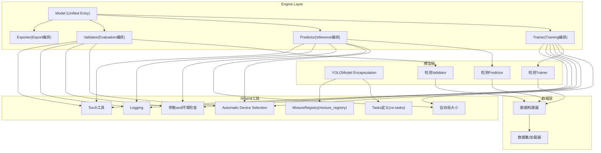
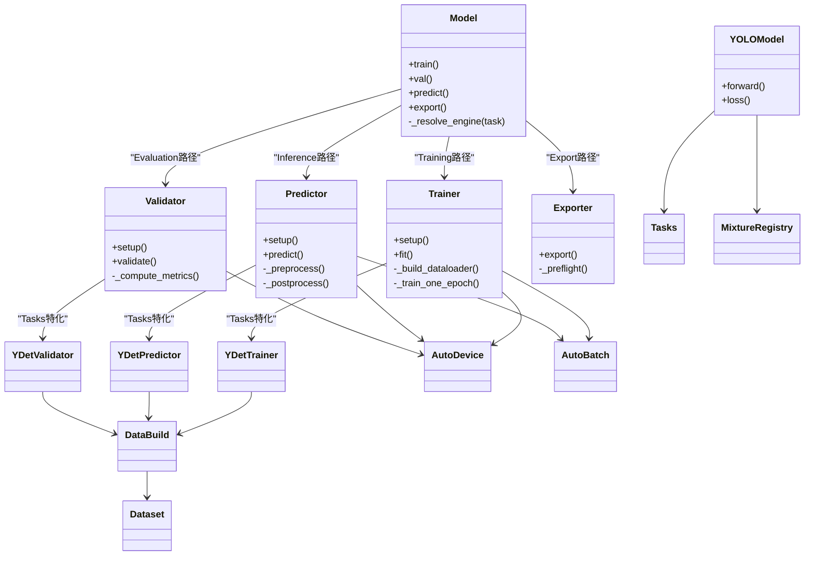
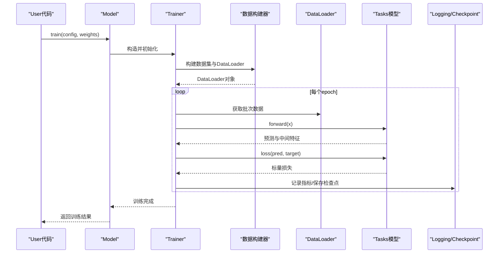
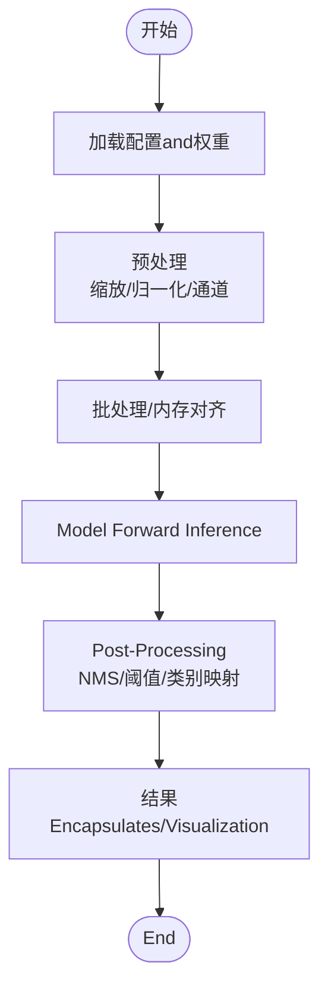
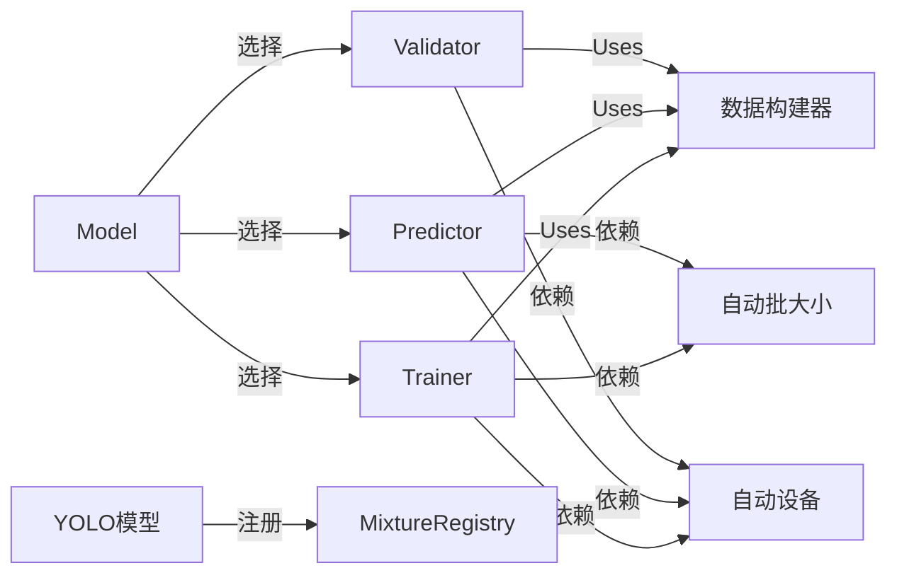

# Core Architecture

<cite>
**Files Referenced in This Document**
- [ultralytics/engine/model.py](file://ultralytics/engine/model.py)
- [ultralytics/engine/trainer.py](file://ultralytics/engine/trainer.py)
- [ultralytics/engine/predictor.py](file://ultralytics/engine/predictor.py)
- [ultralytics/engine/validator.py](file://ultralytics/engine/validator.py)
- [ultralytics/engine/exporter.py](file://ultralytics/engine/exporter.py)
- [ultralytics/models/yolo/model.py](file://ultralytics/models/yolo/model.py)
- [ultralytics/models/yolo/detect/trainer.py](file://ultralytics/models/yolo/detect/trainer.py)
- [ultralytics/models/yolo/detect/predictor.py](file://ultralytics/models/yolo/detect/predictor.py)
- [ultralytics/models/yolo/detect/validator.py](file://ultralytics/models/yolo/detect/validator.py)
- [ultralytics/data/build.py](file://ultralytics/data/build.py)
- [ultralytics/data/dataset.py](file://ultralytics/data/dataset.py)
- [ultralytics/utils/autodevice.py](file://ultralytics/utils/autodevice.py)
- [ultralytics/utils/autobatch.py](file://ultralytics/utils/autobatch.py)
- [ultralytics/utils/checks.py](file://ultralytics/utils/checks.py)
- [ultralytics/utils/logger.py](file://ultralytics/utils/logger.py)
- [ultralytics/utils/torch_utils.py](file://ultralytics/utils/torch_utils.py)
- [ultralytics/nn/tasks.py](file://ultralytics/nn/tasks.py)
- [ultralytics/nn/mixture_registry.py](file://ultralytics/nn/mixture_registry.py)
- [ultralytics/cfg/default.yaml](file://ultralytics/cfg/default.yaml)
</cite>

## Table of Contents
1. [Introduction](#Introduction)
2. [Project Structure](#Project Structure)
3. [Core Components](#Core Components)
4. [Architecture Overview](#Architecture Overview)
5. [Detailed Component Analysis](#Detailed Component Analysis)
6. [Dependency Analysis](#Dependency Analysis)
7. [Performance Considerations](#Performance Considerations)
8. [Troubleshooting Guide](#Troubleshooting Guide)
9. [Conclusion](#Conclusion)
10. [Appendix](#Appendix)

## Introduction
本文件targetingYOLO-Master框架的核心Engine Layerand系统边界，系统性阐述高层设计模式、组件职责分离and协作机制，covering from输入处理to结果输出的完整数据流and控制流。Documentation重点解释Model、Trainer、Predictor、Validatoretc.关键组件的职责边界and交互方式，说明Modules化架构中的插件系统、工厂模式and策略模式的应用，并给出配置管理系统的层次结构and解析机制。同时provides系统架构图and组件关系图，讨论技术决策、权衡and约束条件，Centered onand可Extensibility、性能Optimizationand内存管理机制。

## Project Structure
YOLO-Master采用分层and按功能域组织相Combining的结构：
- Engine Layer（engine）：统一编排Training、Validation、PredictionandExport流程，定义抽象基类and通用控制流。
- 模型层（models）：Tasks级implementing（such as检测），继承引擎抽象并provides具体策略。
- 数据层（data）：数据集构建、加载and增强管线。
- 神经网络Modules（nn）：网络Tasks定义、Mixture专家Registry、后端适配etc.。
- 工具层（utils）：Device Selection、批大小自适应、Logging、检查、Exportcapabilities矩阵etc.。
- 配置（cfg）：默认配置andTasks相关配置。

Figure Source
- [ultralytics/engine/model.py](file://ultralytics/engine/model.py)
- [ultralytics/engine/trainer.py](file://ultralytics/engine/trainer.py)
- [ultralytics/engine/predictor.py](file://ultralytics/engine/predictor.py)
- [ultralytics/engine/validator.py](file://ultralytics/engine/validator.py)
- [ultralytics/engine/exporter.py](file://ultralytics/engine/exporter.py)
- [ultralytics/models/yolo/model.py](file://ultralytics/models/yolo/model.py)
- [ultralytics/models/yolo/detect/trainer.py](file://ultralytics/models/yolo/detect/trainer.py)
- [ultralytics/models/yolo/detect/predictor.py](file://ultralytics/models/yolo/detect/predictor.py)
- [ultralytics/models/yolo/detect/validator.py](file://ultralytics/models/yolo/detect/validator.py)
- [ultralytics/data/build.py](file://ultralytics/data/build.py)
- [ultralytics/data/dataset.py](file://ultralytics/data/dataset.py)
- [ultralytics/utils/autodevice.py](file://ultralytics/utils/autodevice.py)
- [ultralytics/utils/autobatch.py](file://ultralytics/utils/autobatch.py)
- [ultralytics/utils/checks.py](file://ultralytics/utils/checks.py)
- [ultralytics/utils/logger.py](file://ultralytics/utils/logger.py)
- [ultralytics/utils/torch_utils.py](file://ultralytics/utils/torch_utils.py)
- [ultralytics/nn/tasks.py](file://ultralytics/nn/tasks.py)
- [ultralytics/nn/mixture_registry.py](file://ultralytics/nn/mixture_registry.py)

Section Source
- [ultralytics/engine/model.py](file://ultralytics/engine/model.py)
- [ultralytics/engine/trainer.py](file://ultralytics/engine/trainer.py)
- [ultralytics/engine/predictor.py](file://ultralytics/engine/predictor.py)
- [ultralytics/engine/validator.py](file://ultralytics/engine/validator.py)
- [ultralytics/engine/exporter.py](file://ultralytics/engine/exporter.py)
- [ultralytics/models/yolo/model.py](file://ultralytics/models/yolo/model.py)
- [ultralytics/models/yolo/detect/trainer.py](file://ultralytics/models/yolo/detect/trainer.py)
- [ultralytics/models/yolo/detect/predictor.py](file://ultralytics/models/yolo/detect/predictor.py)
- [ultralytics/models/yolo/detect/validator.py](file://ultralytics/models/yolo/detect/validator.py)
- [ultralytics/data/build.py](file://ultralytics/data/build.py)
- [ultralytics/data/dataset.py](file://ultralytics/data/dataset.py)
- [ultralytics/utils/autodevice.py](file://ultralytics/utils/autodevice.py)
- [ultralytics/utils/autobatch.py](file://ultralytics/utils/autobatch.py)
- [ultralytics/utils/checks.py](file://ultralytics/utils/checks.py)
- [ultralytics/utils/logger.py](file://ultralytics/utils/logger.py)
- [ultralytics/utils/torch_utils.py](file://ultralytics/utils/torch_utils.py)
- [ultralytics/nn/tasks.py](file://ultralytics/nn/tasks.py)
- [ultralytics/nn/mixture_registry.py](file://ultralytics/nn/mixture_registry.py)

## Core Components
- Model（Unified entry point）
  - 职责：对外暴露train/val/predict/exportetc.高层API；负责加载权重、初始化Tasks模型、分发to对应Engine实例；维护生命周期and状态。
  - 关键点：Via工厂或Registry根据Tasks类型创建具体Trainer/Predictor/Validator；对设备and批大小进行统一调度。
- Trainer（Training编排）
  - 职责：Training循环、损失计算、Optimizerand调度器装配、EMA、Loggingand回调、分布式协调、Checkpoint保存。
  - 关键点：and数据构建器协作生成DataLoader；Uses自动设备and自动批大小；CallsTasks模型的forwardandloss。
- Predictor（Inference编排）
  - 职责：预处理、Batch Inference、Post-Processing（NMS/阈值过滤）、Visualizationand结果Encapsulates。
  - 关键点：Supporting多源输入（图像/视频/摄像头）；缓存模型and设备上下文；可插拔的Post-Processing策略。
- Validator（Evaluation编排）
  - 职责：whileValidation集上执行前向andMetrics统计；Supporting类别映射、混淆矩阵、PR曲线etc.。
  - 关键点：复用Training时的模型andData Pipeline；andTrainer共享部分逻辑Centered on减少重复。
- Exporter（Export编排）
  - 职责：将PyTorchModel ExportforONNX/TensorRT/OpenVINOetc.格式；进行Export预检andcapabilities矩阵校验。
  - 关键点：andautobackend集成；输出元数据and兼容性信息。

Section Source
- [ultralytics/engine/model.py](file://ultralytics/engine/model.py)
- [ultralytics/engine/trainer.py](file://ultralytics/engine/trainer.py)
- [ultralytics/engine/predictor.py](file://ultralytics/engine/predictor.py)
- [ultralytics/engine/validator.py](file://ultralytics/engine/validator.py)
- [ultralytics/engine/exporter.py](file://ultralytics/engine/exporter.py)

## Architecture Overview
整体采用“Unified entry point + Tasks特定implementing”的分层架构：
- Unified entry point（Model）shielding task differences，内部Via工厂/Registry选择具体implementing。
- Tasks层（such asYOLO检测）继承引擎抽象，注入Tasks特定的数据、损失andPost-Processing策略。
- 数据层Centered on构建器，统一组装DatasetandDataLoader，Supporting增强and多源输入。
- 工具层provides设备、批大小、Logging、检查etc.横切关注点。

Figure Source
- [ultralytics/engine/model.py](file://ultralytics/engine/model.py)
- [ultralytics/engine/trainer.py](file://ultralytics/engine/trainer.py)
- [ultralytics/engine/predictor.py](file://ultralytics/engine/predictor.py)
- [ultralytics/engine/validator.py](file://ultralytics/engine/validator.py)
- [ultralytics/engine/exporter.py](file://ultralytics/engine/exporter.py)
- [ultralytics/models/yolo/model.py](file://ultralytics/models/yolo/model.py)
- [ultralytics/models/yolo/detect/trainer.py](file://ultralytics/models/yolo/detect/trainer.py)
- [ultralytics/models/yolo/detect/predictor.py](file://ultralytics/models/yolo/detect/predictor.py)
- [ultralytics/models/yolo/detect/validator.py](file://ultralytics/models/yolo/detect/validator.py)
- [ultralytics/data/build.py](file://ultralytics/data/build.py)
- [ultralytics/data/dataset.py](file://ultralytics/data/dataset.py)
- [ultralytics/utils/autodevice.py](file://ultralytics/utils/autodevice.py)
- [ultralytics/utils/autobatch.py](file://ultralytics/utils/autobatch.py)
- [ultralytics/nn/tasks.py](file://ultralytics/nn/tasks.py)
- [ultralytics/nn/mixture_registry.py](file://ultralytics/nn/mixture_registry.py)

## Detailed Component Analysis

### Unified entry point Model
- 设计要点
  - 作forUser可见的单一入口，隐藏Tasks差异and底层细节。
  - ViaTasks标识或配置解析，选择对应的Engine子类（Trainer/Predictor/Validator）。
  - 统一管理模型权重加载、设备Migration、批大小and精度设置。
- 控制流
  - Callstrain/val/predict/export时，先完成环境自检and配置合并，再构造相应Engine实例并委派执行。
- 扩展点
  - 新增Tasks可ViaRegistry或工厂函数接入，无需修改Model主流程。

Section Source
- [ultralytics/engine/model.py](file://ultralytics/engine/model.py)

### Training编排 Trainer
- 设计要点
  - EncapsulatesTraining生命周期：准备阶段（构建数据、Optimizer、调度器、EMA）、Training循环、Logging、Checkpoint保存and恢复。
  - andTasks模型解耦，仅约定forward/loss接口。
- 数据流
  - Via数据构建器生成DataLoader，逐批送入模型，计算损失并Updating Parameters。
- 错误处理
  - 捕获异常并上报，确保分布式场景下的错误传播and诊断信息。
- 性能
  - Combining自动批大小andAutomatic Device Selection，最大化硬件利用率。

Figure Source
- [ultralytics/engine/trainer.py](file://ultralytics/engine/trainer.py)
- [ultralytics/data/build.py](file://ultralytics/data/build.py)
- [ultralytics/models/yolo/detect/trainer.py](file://ultralytics/models/yolo/detect/trainer.py)
- [ultralytics/models/yolo/model.py](file://ultralytics/models/yolo/model.py)

Section Source
- [ultralytics/engine/trainer.py](file://ultralytics/engine/trainer.py)
- [ultralytics/models/yolo/detect/trainer.py](file://ultralytics/models/yolo/detect/trainer.py)

### Inference编排 Predictor
- 设计要点
  - 标准化预处理（缩放、归一化、通道转换）、Batch Inference、Post-Processing（NMS、Confidence Threshold、类别映射）。
  - Supporting多种输入源（单图、文件夹、视频、摄像头流）。
- 控制流
  - 初始化模型and设备上下文，预热缓存，循环读取输入并产出检测结果。
- 策略模式
  - Post-Processing策略可替换（such as不同NMSimplementing或阈值策略），便于实验对比and部署Optimization。

Figure Source
- [ultralytics/engine/predictor.py](file://ultralytics/engine/predictor.py)
- [ultralytics/models/yolo/detect/predictor.py](file://ultralytics/models/yolo/detect/predictor.py)

Section Source
- [ultralytics/engine/predictor.py](file://ultralytics/engine/predictor.py)
- [ultralytics/models/yolo/detect/predictor.py](file://ultralytics/models/yolo/detect/predictor.py)

### Evaluation编排 Validator
- 设计要点
  - 复用Training的Data Pipelineand模型，专注于Metrics统计and报告生成。
  - Supporting类别一致性校验、混淆矩阵、PR/AUC曲线etc.。
- 数据流
  - 遍历Validation集，累积Predictionand真实标签，计算mAPetc.Metrics。
- andTrainer的关系
  - 共享基础逻辑，避免重复implementing；差异集中whileMetrics计算and输出格式。

Section Source
- [ultralytics/engine/validator.py](file://ultralytics/engine/validator.py)
- [ultralytics/models/yolo/detect/validator.py](file://ultralytics/models/yolo/detect/validator.py)

### Export编排 Exporter
- 设计要点
  - 统一Export入口，Supporting多种后端格式；Export前进行capabilities矩阵and预检。
  - 输出元数据（模型版本、输入形状、精度、设备信息etc.）。
- 控制流
  - 解析目标格式 -> 预检 -> Export -> ValidationExport产物 -> 保存。

Section Source
- [ultralytics/engine/exporter.py](file://ultralytics/engine/exporter.py)

### Tasks模型andNNModules
- Tasks模型（YOLO）
  - Encapsulates前向and损失计算，SupportingMixture专家（MoE/MoA）andPEFTAdapter。
  - ViaTasks定义（tasks）andMixtureRegistry（mixture_registry）动态组合子Modules。
- MixtureRegistry
  - provides运行时选择and切换Mixture策略的capabilities，便于实验and生产部署。

Section Source
- [ultralytics/models/yolo/model.py](file://ultralytics/models/yolo/model.py)
- [ultralytics/nn/tasks.py](file://ultralytics/nn/tasks.py)
- [ultralytics/nn/mixture_registry.py](file://ultralytics/nn/mixture_registry.py)

### 数据层
- 数据构建器
  - 根据配置解析数据集路径、类别、增强策略，构建DataLoader。
- 数据集and加载器
  - Supporting多格式标注and多源输入；provides迭代式读取and并行加载。

Section Source
- [ultralytics/data/build.py](file://ultralytics/data/build.py)
- [ultralytics/data/dataset.py](file://ultralytics/data/dataset.py)

### 工具层
- Automatic Device Selection
  - 基于可用GPU/CPU资源选择最优设备，处理多卡and回退策略。
- 自动批大小
  - 根据显存and硬件特性动态调整批大小，提升吞吐and稳定性。
- 检查andLogging
  - 参数合法性检查、环境依赖校验；结构化Logging输出便于追踪。
- Torch工具
  - 张量操作、精度转换、Gradientand内存管理辅助。

Section Source
- [ultralytics/utils/autodevice.py](file://ultralytics/utils/autodevice.py)
- [ultralytics/utils/autobatch.py](file://ultralytics/utils/autobatch.py)
- [ultralytics/utils/checks.py](file://ultralytics/utils/checks.py)
- [ultralytics/utils/logger.py](file://ultralytics/utils/logger.py)
- [ultralytics/utils/torch_utils.py](file://ultralytics/utils/torch_utils.py)

## Dependency Analysis
- 耦合and内聚
  - ModelandEngine之间松耦合，Via接口andRegistry降低直接依赖。
  - Tasks层andEngine LayerVia约定好的forward/loss接口解耦，提高可替换性。
- External Dependencies
  - PyTorch生态（张量、Optimizer、分布式）；第三方Export Backends（ONNX/TensorRT/OpenVINO）。
- Potential Cycles依赖
  - ViaRegistryand工厂模式避免循环导入；Tasks层不反向依赖Model。
- 接口契约
  - Engine抽象定义统一的setup/execute生命周期；Tasksimplementing遵循该契约。

Figure Source
- [ultralytics/engine/model.py](file://ultralytics/engine/model.py)
- [ultralytics/engine/trainer.py](file://ultralytics/engine/trainer.py)
- [ultralytics/engine/predictor.py](file://ultralytics/engine/predictor.py)
- [ultralytics/engine/validator.py](file://ultralytics/engine/validator.py)
- [ultralytics/data/build.py](file://ultralytics/data/build.py)
- [ultralytics/utils/autodevice.py](file://ultralytics/utils/autodevice.py)
- [ultralytics/utils/autobatch.py](file://ultralytics/utils/autobatch.py)
- [ultralytics/models/yolo/model.py](file://ultralytics/models/yolo/model.py)
- [ultralytics/nn/mixture_registry.py](file://ultralytics/nn/mixture_registry.py)

Section Source
- [ultralytics/engine/model.py](file://ultralytics/engine/model.py)
- [ultralytics/engine/trainer.py](file://ultralytics/engine/trainer.py)
- [ultralytics/engine/predictor.py](file://ultralytics/engine/predictor.py)
- [ultralytics/engine/validator.py](file://ultralytics/engine/validator.py)
- [ultralytics/data/build.py](file://ultralytics/data/build.py)
- [ultralytics/utils/autodevice.py](file://ultralytics/utils/autodevice.py)
- [ultralytics/utils/autobatch.py](file://ultralytics/utils/autobatch.py)
- [ultralytics/models/yolo/model.py](file://ultralytics/models/yolo/model.py)
- [ultralytics/nn/mixture_registry.py](file://ultralytics/nn/mixture_registry.py)

## Performance Considerations
- 自动批大小andDevice Selection
  - 依据显存and硬件特性动态调整批大小，减少OOM风险并提升吞吐。
- Data PipelineOptimization
  - 并行加载、内存映射、预取and缓存，降低I/Obottlenecks。
- InferenceOptimization
  - 批处理、半精度Inference、算子融合and后端加速（TensorRT/OpenVINO）。
- Training稳定性
  - EMA平滑、Gradient裁剪、数值稳定技巧and监控Logging。
- 内存管理
  - and时释放中间张量、避免不必要的副本、合理分配设备内存。

[本节for通用指导，不涉and具体文件分析]

## Troubleshooting Guide
- 常见问题定位
  - 设备anddrivers are installed问题：检查Automatic Device SelectionandCUDA可用性。
  - 批大小过大导致OOM：启用自动批大小或手动调小。
  - 数据路径或标注格式错误：Uses检查工具Validation数据集and配置文件。
  - Export Failure：查看Exportcapabilities矩阵and预检Logging，确认后端Supporting。
- Loggingand诊断
  - 开启结构化Logging，记录关键步骤and异常堆栈。
  - 利用Checkpointand中间Metrics回溯Training过程。

Section Source
- [ultralytics/utils/checks.py](file://ultralytics/utils/checks.py)
- [ultralytics/utils/logger.py](file://ultralytics/utils/logger.py)
- [ultralytics/utils/autodevice.py](file://ultralytics/utils/autodevice.py)
- [ultralytics/utils/autobatch.py](file://ultralytics/utils/autobatch.py)

## Conclusion
YOLO-MasterViaUnified entry pointandTasks特化implementing的清晰分层，Combining工厂/Registryand策略模式，implementing了高内聚、低耦合的可扩展架构。数据流and控制流while各组件间明确传递，工具层provides稳定的横切capabilities。系统while性能、稳定性and可移植性方面具备良好平衡，适合多Tasks、多后端and大规模实验and生产部署。

[本节for总结，不涉and具体文件分析]

## Appendix

### 配置管理系统
- 层次结构
  - 默认配置（default.yaml）provides全局默认值。
  - Tasks配置（such as检测）覆盖默认值，指定数据、模型and超参。
  - 运行时参数进一步覆盖Tasks配置，形成最终生效配置。
- 解析机制
  - 递归合并字典，保留未覆盖字段；类型校验and缺省值填充。
  - Supporting环境变量and命令行参数注入，便于容器化and自动化。

Section Source
- [ultralytics/cfg/default.yaml](file://ultralytics/cfg/default.yaml)

### 设计原则and模式
- 插件系统
  - ViaRegistryand工厂函数注册新Tasks/策略，零侵入扩展。
- 工厂模式
  - Model内部根据Tasks标识创建具体Engine实例，屏蔽创建细节。
- 策略模式
  - Post-Processing、损失计算、routing strategiesetc.可替换，便于实验andOptimization。

Section Source
- [ultralytics/engine/model.py](file://ultralytics/engine/model.py)
- [ultralytics/nn/mixture_registry.py](file://ultralytics/nn/mixture_registry.py)