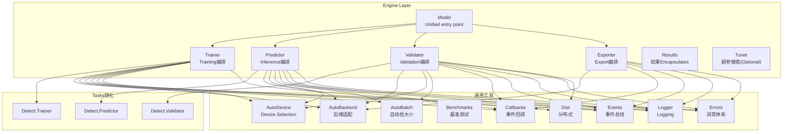
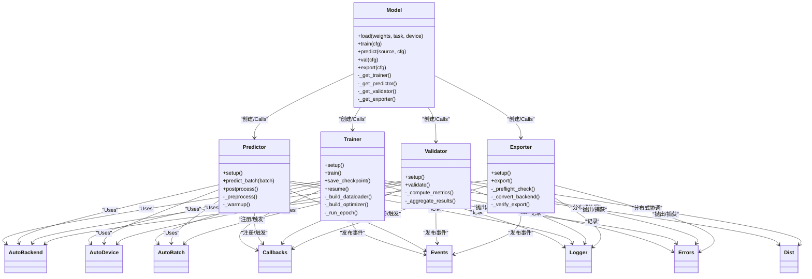
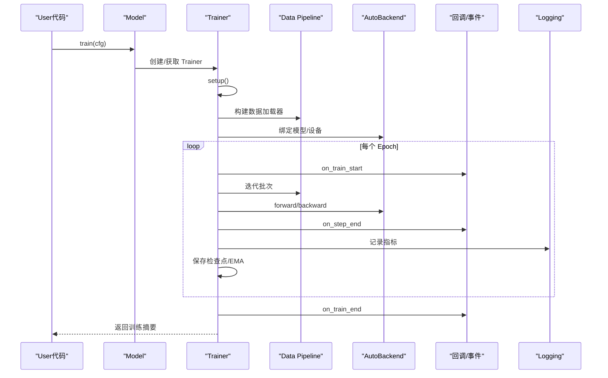
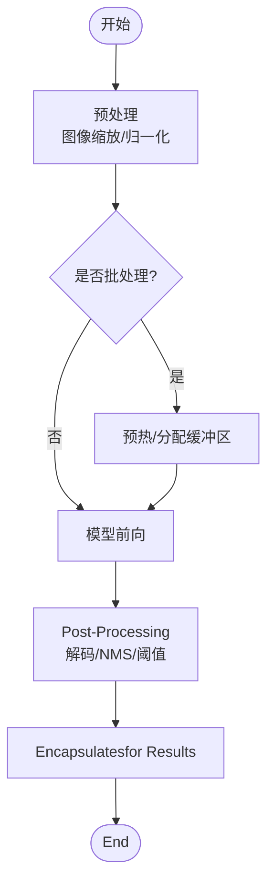
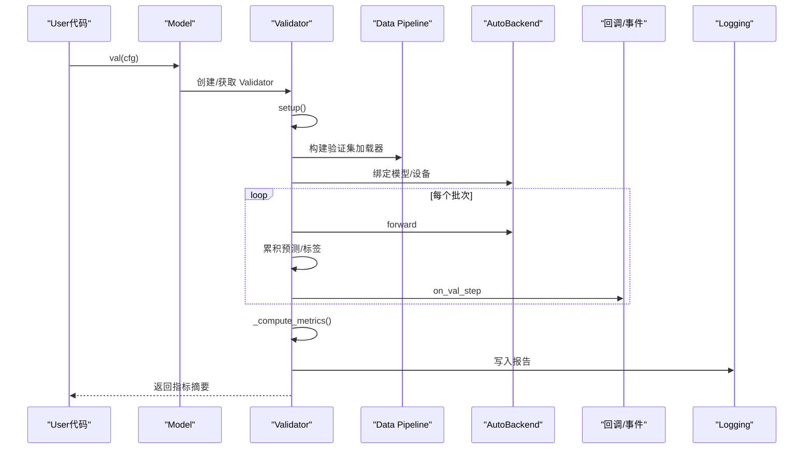
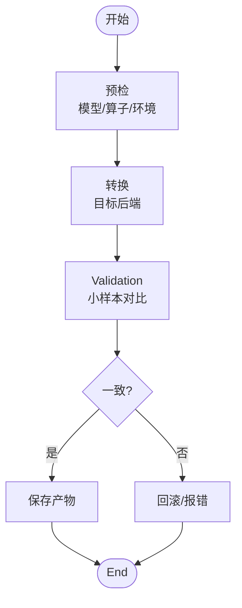
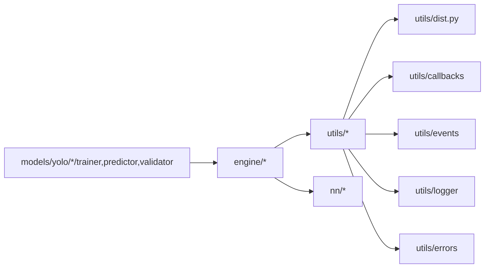

# Engine Layer设计

<cite>
**Files Referenced in This Document**
- [engine/__init__.py](file://ultralytics/engine/__init__.py)
- [engine/model.py](file://ultralytics/engine/model.py)
- [engine/trainer.py](file://ultralytics/engine/trainer.py)
- [engine/predictor.py](file://ultralytics/engine/predictor.py)
- [engine/validator.py](file://ultralytics/engine/validator.py)
- [engine/exporter.py](file://ultralytics/engine/exporter.py)
- [engine/results.py](file://ultralytics/engine/results.py)
- [engine/tuner.py](file://ultralytics/engine/tuner.py)
- [utils/autobackend.py](file://ultralytics/utils/autobackend.py)
- [utils/autodevice.py](file://ultralytics/utils/autodevice.py)
- [utils/autobatch.py](file://ultralytics/utils/autobatch.py)
- [utils/benchmarks.py](file://ultralytics/utils/benchmarks.py)
- [utils/callbacks/__init__.py](file://ultralytics/utils/callbacks/__init__.py)
- [utils/events.py](file://ultralytics/utils/events.py)
- [utils/logger.py](file://ultralytics/utils/logger.py)
- [utils/errors.py](file://ultralytics/utils/errors.py)
- [utils/dist.py](file://ultralytics/utils/dist.py)
- [models/yolo/detect/trainer.py](file://ultralytics/models/yolo/detect/trainer.py)
- [models/yolo/detect/predictor.py](file://ultralytics/models/yolo/detect/predictor.py)
- [models/yolo/detect/validator.py](file://ultralytics/models/yolo/detect/validator.py)
- [nn/autobackend.py](file://ultralytics/nn/autobackend.py)
</cite>

## Table of Contents
1. [Introduction](#Introduction)
2. [Project Structure](#Project Structure)
3. [Core Components](#Core Components)
4. [Architecture Overview](#Architecture Overview)
5. [Detailed Component Analysis](#Detailed Component Analysis)
6. [Dependency Analysis](#Dependency Analysis)
7. [性能考量](#性能考量)
8. [Troubleshooting Guide](#Troubleshooting Guide)
9. [Conclusion](#Conclusion)
10. [Appendix：UsesExamplesand最佳实践](#AppendixUsesExamplesand最佳实践)

## Introduction
本文件聚焦于 YOLO-Master 框架的“Engine Layer”设计andimplementing，围绕 Model、Trainer、Predictor、Validator、Exporter etc.Core Components的职责边界、协作机制、生命周期管理、状态维护and错误处理策略unfold。Documentation同时给出Training、Inference、Validation、Export四大流程的控制流说明，并补充内存管理、GPU 资源调度and并发处理的implementing要点，Centered onand性能Optimization建议and最佳实践。

## Project Structure
Engine Layer位于 ultralytics/engine Table of Contents下，provides统一的Model EncapsulationandTasks编排capabilities；具体Tasks的 Trainer/Predictor/Validator while models/yolo/<task>/ 下Centered onTasks特化形式存while；通用工具（设备、后端、批大小、基准、回调、Logging、分布式）位于 utils/ and nn/ 子包中。

Figure Source
- [engine/model.py:1-200](file://ultralytics/engine/model.py#L1-L200)
- [engine/trainer.py:1-200](file://ultralytics/engine/trainer.py#L1-L200)
- [engine/predictor.py:1-200](file://ultralytics/engine/predictor.py#L1-L200)
- [engine/validator.py:1-200](file://ultralytics/engine/validator.py#L1-L200)
- [engine/exporter.py:1-200](file://ultralytics/engine/exporter.py#L1-L200)
- [engine/results.py:1-200](file://ultralytics/engine/results.py#L1-L200)
- [engine/tuner.py:1-200](file://ultralytics/engine/tuner.py#L1-L200)
- [utils/autobackend.py:1-200](file://ultralytics/utils/autobackend.py#L1-L200)
- [utils/autodevice.py:1-200](file://ultralytics/utils/autodevice.py#L1-L200)
- [utils/autobatch.py:1-200](file://ultralytics/utils/autobatch.py#L1-L200)
- [utils/benchmarks.py:1-200](file://ultralytics/utils/benchmarks.py#L1-L200)
- [utils/callbacks/__init__.py:1-200](file://ultralytics/utils/callbacks/__init__.py#L1-L200)
- [utils/events.py:1-200](file://ultralytics/utils/events.py#L1-L200)
- [utils/logger.py:1-200](file://ultralytics/utils/logger.py#L1-L200)
- [utils/errors.py:1-200](file://ultralytics/utils/errors.py#L1-L200)
- [utils/dist.py:1-200](file://ultralytics/utils/dist.py#L1-L200)
- [models/yolo/detect/trainer.py:1-200](file://ultralytics/models/yolo/detect/trainer.py#L1-L200)
- [models/yolo/detect/predictor.py:1-200](file://ultralytics/models/yolo/detect/predictor.py#L1-L200)
- [models/yolo/detect/validator.py:1-200](file://ultralytics/models/yolo/detect/validator.py#L1-L200)
- [nn/autobackend.py:1-200](file://ultralytics/nn/autobackend.py#L1-L200)

Section Source
- [engine/__init__.py:1-200](file://ultralytics/engine/__init__.py#L1-L200)
- [engine/model.py:1-200](file://ultralytics/engine/model.py#L1-L200)

## Core Components
- Model：Unified entry point，负责加载权重、构建或装载模型、分发to不同模式（train/predict/val/export），并provides高层 API。内部持有对应模式的实例（Trainer/Predictor/Validator/Exporter）。
- Trainer：Training编排器，负责Data Loading、Optimizer/Learning Rate调度、损失计算、EMA、Checkpoint、Loggingand回调、分布式协调etc.。
- Predictor：Inference编排器，负责预处理、Batch Inference、Post-Processing（NMS/解码）、Visualizationand结果Encapsulates。
- Validator：Validation编排器，负责数据集遍历、Metrics统计、混淆矩阵/AP 计算、结果汇总and报告生成。
- Exporter：Export编排器，负责将 PyTorch 模型转换for ONNX/TensorRT/OpenVINO/CoreML etc.目标格式，并进行Export前校验andExport后Validation。
- Results：Inference/Validation结果的统一数据结构，便于序列化、Visualizationand下游消费。
- Tuner（Optional）：基于回调and事件系统的超参数搜索and实验管理。

职责分离原则
- 输入/输出契约清晰：各组件Via配置对象andResults Object交互，避免直接耦合。
- 关注点分离：Model 只做路由and装配；Trainer/Predictor/Validator/Exporter 各自专注单一Tasks的生命周期。
- 可Extensibility：Via继承and组合扩展Tasks特化逻辑，并Via回调/事件系统注入横切关注点（Logging、监控、断点续训etc.）。

Section Source
- [engine/model.py:1-200](file://ultralytics/engine/model.py#L1-L200)
- [engine/trainer.py:1-200](file://ultralytics/engine/trainer.py#L1-L200)
- [engine/predictor.py:1-200](file://ultralytics/engine/predictor.py#L1-L200)
- [engine/validator.py:1-200](file://ultralytics/engine/validator.py#L1-L200)
- [engine/exporter.py:1-200](file://ultralytics/engine/exporter.py#L1-L200)
- [engine/results.py:1-200](file://ultralytics/engine/results.py#L1-L200)
- [engine/tuner.py:1-200](file://ultralytics/engine/tuner.py#L1-L200)

## Architecture Overview
下图展示Engine LayerandTasks特化、通用工具之间的交互关系，体现“Unified entry point + 多模式编排 + 工具复用”的设计。

Figure Source
- [engine/model.py:1-200](file://ultralytics/engine/model.py#L1-L200)
- [engine/trainer.py:1-200](file://ultralytics/engine/trainer.py#L1-L200)
- [engine/predictor.py:1-200](file://ultralytics/engine/predictor.py#L1-L200)
- [engine/validator.py:1-200](file://ultralytics/engine/validator.py#L1-L200)
- [engine/exporter.py:1-200](file://ultralytics/engine/exporter.py#L1-L200)
- [utils/autobackend.py:1-200](file://ultralytics/utils/autobackend.py#L1-L200)
- [utils/autodevice.py:1-200](file://ultralytics/utils/autodevice.py#L1-L200)
- [utils/autobatch.py:1-200](file://ultralytics/utils/autobatch.py#L1-L200)
- [utils/callbacks/__init__.py:1-200](file://ultralytics/utils/callbacks/__init__.py#L1-L200)
- [utils/events.py:1-200](file://ultralytics/utils/events.py#L1-L200)
- [utils/logger.py:1-200](file://ultralytics/utils/logger.py#L1-L200)
- [utils/errors.py:1-200](file://ultralytics/utils/errors.py#L1-L200)
- [utils/dist.py:1-200](file://ultralytics/utils/dist.py#L1-L200)

## Detailed Component Analysis

### Model 组件
- 设计理念：作forUser可见的Unified entry point，屏蔽底层差异（Tasks类型、设备、后端），根据方法名动态选择并初始化相应编排器。
- 关键职责：
  - 加载权重and配置，解析Tasks类型。
  - 按需创建 Trainer/Predictor/Validator/Exporter 实例。
  - 转发高层 API Calls至对应编排器。
- 生命周期：
  - 构造时完成基础配置and设备探测。
  - 首次Calls某模式时懒加载对应编排器，减少启动开销。
  - Supporting显式释放资源（such as关闭缓存、清理临时文件）。
- 错误处理：
  - 对权重路径、Tasks不匹配、设备不可用etc.情况进行前置校验，抛出结构化异常。
  - while分发Calls前后记录上下文信息，便于定位问题。

Section Source
- [engine/model.py:1-200](file://ultralytics/engine/model.py#L1-L200)

### Trainer 组件
- 设计理念：将Training过程抽象for可插拔的阶段（准备、循环、Evaluation、保存、恢复），Via回调and事件贯穿横切逻辑。
- 关键职责：
  - 构建Data Pipeline、模型、Optimizer、Learning Rate调度器、Loss Function。
  - 执行 epoch/step 循环，更新 EMA、记录Metrics、保存Checkpoint。
  - Supporting断点续训andDistributed Training协调。
- 状态维护：
  - 保存/恢复Training状态（epoch、步数、Optimizer状态、随机种子etc.）。
  - 维护运行期MetricsandLogging。
- 错误处理：
  - 针对Data Loading失败、Gradient爆炸/NaN、OOM etc.场景进行捕获and上报。
  - while分布式环境下聚合错误并终止所有进程。

Figure Source
- [engine/trainer.py:1-200](file://ultralytics/engine/trainer.py#L1-L200)
- [utils/autobackend.py:1-200](file://ultralytics/utils/autobackend.py#L1-L200)
- [utils/callbacks/__init__.py:1-200](file://ultralytics/utils/callbacks/__init__.py#L1-L200)
- [utils/events.py:1-200](file://ultralytics/utils/events.py#L1-L200)
- [utils/logger.py:1-200](file://ultralytics/utils/logger.py#L1-L200)

Section Source
- [engine/trainer.py:1-200](file://ultralytics/engine/trainer.py#L1-L200)
- [models/yolo/detect/trainer.py:1-200](file://ultralytics/models/yolo/detect/trainer.py#L1-L200)

### Predictor 组件
- 设计理念：将Inference过程标准化for预处理、模型前向、Post-Processingand结果Encapsulates四阶段，Supporting批处理and热启动。
- 关键职责：
  - 预处理（缩放、归一化、通道转换）。
  - 模型前向（Supporting多后端）。
  - Post-Processing（解码、Confidence Threshold、NMS）。
  - 结果Encapsulates（Results）andVisualization辅助。
- 并发and资源：
  - Supporting多线程/多进程并行Inference（按平台and后端capabilities）。
  - 自动批大小and GPU 内存自适应。
- 错误处理：
  - 输入尺寸/格式校验、后端不可用降级、Inference超时保护。

Figure Source
- [engine/predictor.py:1-200](file://ultralytics/engine/predictor.py#L1-L200)
- [utils/autobackend.py:1-200](file://ultralytics/utils/autobackend.py#L1-L200)
- [utils/autobatch.py:1-200](file://ultralytics/utils/autobatch.py#L1-L200)

Section Source
- [engine/predictor.py:1-200](file://ultralytics/engine/predictor.py#L1-L200)
- [models/yolo/detect/predictor.py:1-200](file://ultralytics/models/yolo/detect/predictor.py#L1-L200)

### Validator 组件
- 设计理念：Centered on数据集for单位进行遍历andMetrics聚合，确保跨设备/分布式的一致性。
- 关键职责：
  - 构建Validation集加载器。
  - 执行前向andPost-Processing，累积Predictionand标签。
  - 计算 AP/mAP、混淆矩阵、PR 曲线etc.Metrics。
  - 生成报告andVisualization。
- 分布式：
  - 同步各进程的中间结果，保证全局一致性。
- 错误处理：
  - 标签缺失/格式错误、类别不一致、空Predictionetc.异常路径处理。

Figure Source
- [engine/validator.py:1-200](file://ultralytics/engine/validator.py#L1-L200)
- [utils/autobackend.py:1-200](file://ultralytics/utils/autobackend.py#L1-L200)
- [utils/callbacks/__init__.py:1-200](file://ultralytics/utils/callbacks/__init__.py#L1-L200)
- [utils/logger.py:1-200](file://ultralytics/utils/logger.py#L1-L200)

Section Source
- [engine/validator.py:1-200](file://ultralytics/engine/validator.py#L1-L200)
- [models/yolo/detect/validator.py:1-200](file://ultralytics/models/yolo/detect/validator.py#L1-L200)

### Exporter 组件
- 设计理念：将Export流程标准化for预检、转换、Validation三阶段，Supporting多种后端and目标格式。
- 关键职责：
  - 预检：图结构、算子兼容性、输入形状、精度要求。
  - 转换：Calls对应后端转换器（ONNX/TensorRT/OpenVINO/CoreML etc.）。
  - Validation：Export后小样本Inference对比，确保数值一致性。
- 错误处理：
  - 算子不Supporting、版本不兼容、磁盘空间不足etc.异常路径处理and回滚。

Figure Source
- [engine/exporter.py:1-200](file://ultralytics/engine/exporter.py#L1-L200)
- [utils/autobackend.py:1-200](file://ultralytics/utils/autobackend.py#L1-L200)

Section Source
- [engine/exporter.py:1-200](file://ultralytics/engine/exporter.py#L1-L200)

### Results 组件
- 设计理念：统一EncapsulatesInference/Validation结果，provides便捷访问接口and序列化capabilities。
- 关键职责：
  - 存储检测框、掩码、关键点、分类概率etc.。
  - provides过滤、排序、Visualization辅助方法。
  - andLogging/Callback System集成，用于Exportand展示。

Section Source
- [engine/results.py:1-200](file://ultralytics/engine/results.py#L1-L200)

## Dependency Analysis
- 组件Cohesion and Coupling：
  - Model 仅负责装配and分发，低耦合高内聚。
  - Trainer/Predictor/Validator/Exporter 均依赖 AutoBackend/AutoDevice/AutoBatch，形成稳定的工具依赖面。
- External Dependenciesand集成点：
  - 分布式通信（utils/dist.py）whileTrainingandValidation中Uses。
  - 回调and事件系统（utils/callbacks、utils/events）贯穿全链路。
  - Loggingand错误体系（utils/logger、utils/errors）provides一致的观测and诊断capabilities。
- Potential Cycles依赖：
  - Via分层and接口隔离避免循环导入；若新增Modules，应优先置于 utils/ 或 nn/ 层。

Figure Source
- [engine/model.py:1-200](file://ultralytics/engine/model.py#L1-L200)
- [engine/trainer.py:1-200](file://ultralytics/engine/trainer.py#L1-L200)
- [engine/predictor.py:1-200](file://ultralytics/engine/predictor.py#L1-L200)
- [engine/validator.py:1-200](file://ultralytics/engine/validator.py#L1-L200)
- [engine/exporter.py:1-200](file://ultralytics/engine/exporter.py#L1-L200)
- [utils/dist.py:1-200](file://ultralytics/utils/dist.py#L1-L200)
- [utils/callbacks/__init__.py:1-200](file://ultralytics/utils/callbacks/__init__.py#L1-L200)
- [utils/events.py:1-200](file://ultralytics/utils/events.py#L1-L200)
- [utils/logger.py:1-200](file://ultralytics/utils/logger.py#L1-L200)
- [utils/errors.py:1-200](file://ultralytics/utils/errors.py#L1-L200)

Section Source
- [engine/__init__.py:1-200](file://ultralytics/engine/__init__.py#L1-L200)
- [utils/autobackend.py:1-200](file://ultralytics/utils/autobackend.py#L1-L200)
- [utils/autodevice.py:1-200](file://ultralytics/utils/autodevice.py#L1-L200)
- [utils/autobatch.py:1-200](file://ultralytics/utils/autobatch.py#L1-L200)
- [utils/benchmarks.py:1-200](file://ultralytics/utils/benchmarks.py#L1-L200)

## 性能考量
- 内存管理
  - Uses AutoBatch 动态调整批大小，避免 OOM。
  - while Predictor 中启用缓冲复用and预热，降低频繁分配开销。
  - and时释放中间张量and缓存，Combining垃圾回收策略。
- GPU 资源调度
  - AutoDevice 自动选择最优设备，Supporting多卡切换and显存感知。
  - Training时Set appropriatelyGradient累积andMixture精度，提升吞吐。
- 并发处理
  - Inference侧采用线程池/进程池并行预处理andPost-Processing，注意 GIL and I/O bottlenecks。
  - Distributed TrainingUses utils/dist 进行Gradient同步and集合通信。
- 基准and回归
  - Uses utils/benchmarks 进行端to端延迟/吞吐测量，建立性能门禁。

[本节for通用指导，无需特定文件引用]

## Troubleshooting Guide
- 常见问题定位
  - 设备/后端不可用：检查 AutoDevice/AutoBackend 初始化Loggingand错误信息。
  - Data Loading失败：确认路径、权限、格式and类别映射一致性。
  - Export Failure：查看预检阶段的算子兼容性报告and版本约束。
- Loggingand事件
  - Via Logger and Events 订阅关键节点，定位慢点and异常。
  - 利用回调钩子打印中间状态（such as每步 loss、显存占用）。
- 分布式问题
  - Uses Dist provides的诊断工具检查进程存活、通信超时and死锁。
  - while根进程集中收集错误堆栈and上下文。

Section Source
- [utils/logger.py:1-200](file://ultralytics/utils/logger.py#L1-L200)
- [utils/events.py:1-200](file://ultralytics/utils/events.py#L1-L200)
- [utils/errors.py:1-200](file://ultralytics/utils/errors.py#L1-L200)
- [utils/dist.py:1-200](file://ultralytics/utils/dist.py#L1-L200)

## Conclusion
YOLO-Master Engine LayerVia Model Unified entry pointand Trainer/Predictor/Validator/Exporter 的Tasks编排，implementing了清晰的职责分离and良好的可Extensibility。借助 AutoBackend/AutoDevice/AutoBatch etc.通用工具，Centered onand回调/事件/Logging/错误体系，系统while易用性、稳定性and性能之间取得平衡。遵循本Documentation的最佳实践，可while不同Tasksand部署场景中高效复用and扩展。

[本节for总结，无需特定文件引用]

## Appendix：UsesExamplesand最佳实践
- Training流程
  - Uses Model.train(cfg) 启动Training，配置数据路径、模型、Optimizer、回调andLogging。
  - 推荐开启 EMA、Checkpointand早停策略，Combined with回调记录Metrics。
- Inference流程
  - Uses Model.predict(source, cfg) 进行单图/视频/Batch Inference，设置阈值、NMS andVisualization选项。
  - 生产环境建议预热模型、固定输入尺寸、开启自动批大小。
- Validation流程
  - Uses Model.val(cfg) 计算 mAP etc.Metrics，输出报告andVisualization。
  - 分布式Validation需确保类别顺序and标签格式一致。
- Export流程
  - Uses Model.export(cfg) 指定目标格式andOptimization级别，完成后进行小样本Validation。
  - 遇to算子不Supporting时，Refer to预检报告调整模型或后端版本。

Section Source
- [engine/model.py:1-200](file://ultralytics/engine/model.py#L1-L200)
- [engine/trainer.py:1-200](file://ultralytics/engine/trainer.py#L1-L200)
- [engine/predictor.py:1-200](file://ultralytics/engine/predictor.py#L1-L200)
- [engine/validator.py:1-200](file://ultralytics/engine/validator.py#L1-L200)
- [engine/exporter.py:1-200](file://ultralytics/engine/exporter.py#L1-L200)