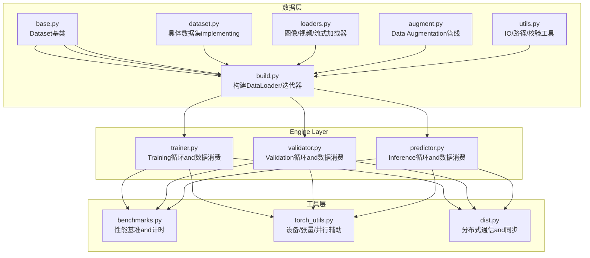
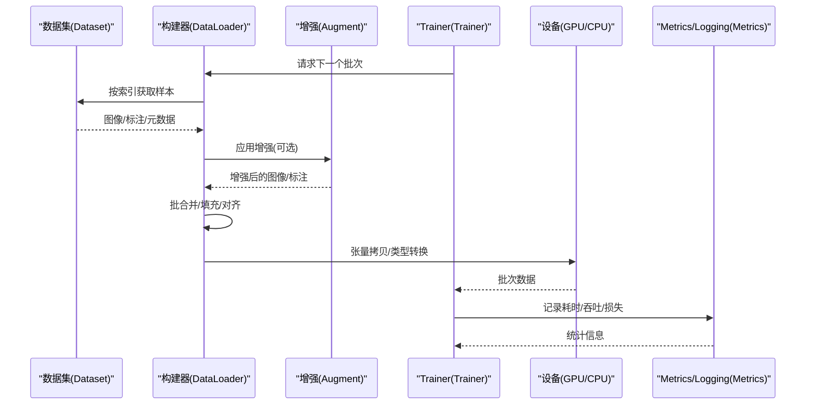
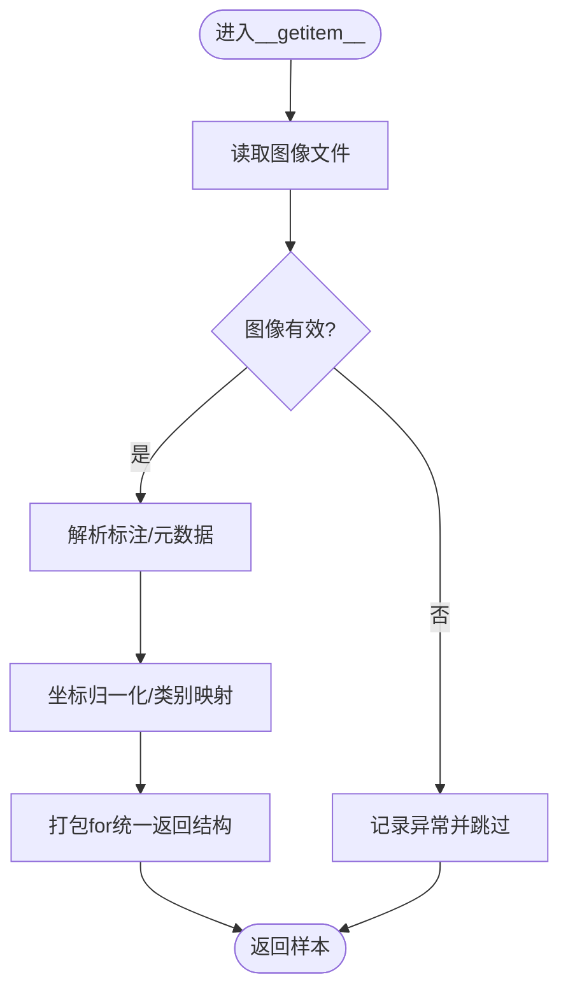
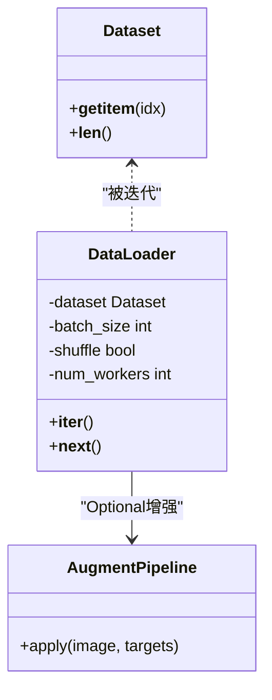
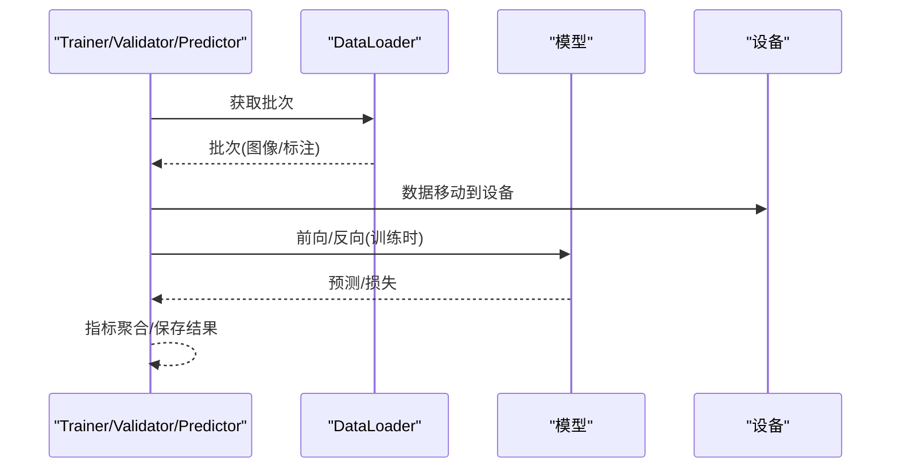
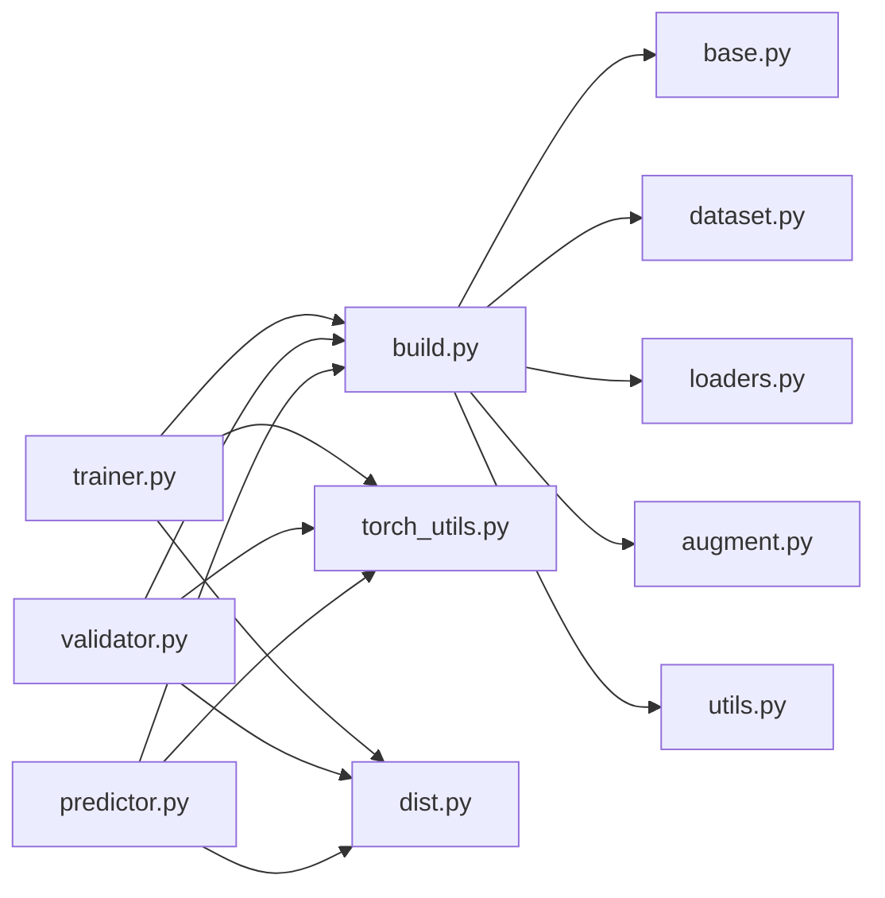

# 数据流控制

<cite>
**Files Referenced in This Document**
- [ultralytics/data/base.py](file://ultralytics/data/base.py)
- [ultralytics/data/build.py](file://ultralytics/data/build.py)
- [ultralytics/data/dataset.py](file://ultralytics/data/dataset.py)
- [ultralytics/data/loaders.py](file://ultralytics/data/loaders.py)
- [ultralytics/data/augment.py](file://ultralytics/data/augment.py)
- [ultralytics/data/utils.py](file://ultralytics/data/utils.py)
- [ultralytics/engine/trainer.py](file://ultralytics/engine/trainer.py)
- [ultralytics/engine/validator.py](file://ultralytics/engine/validator.py)
- [ultralytics/engine/predictor.py](file://ultralytics/engine/predictor.py)
- [ultralytics/utils/benchmarks.py](file://ultralytics/utils/benchmarks.py)
- [ultralytics/utils/torch_utils.py](file://ultralytics/utils/torch_utils.py)
- [ultralytics/utils/dist.py](file://ultralytics/utils/dist.py)
</cite>

## Table of Contents
1. [Introduction](#Introduction)
2. [Project Structure](#Project Structure)
3. [Core Components](#Core Components)
4. [Architecture Overview](#Architecture Overview)
5. [Detailed Component Analysis](#Detailed Component Analysis)
6. [Dependency Analysis](#Dependency Analysis)
7. [Performance Considerations](#Performance Considerations)
8. [Troubleshooting Guide](#Troubleshooting Guide)
9. [Conclusion](#Conclusion)
10. [Appendix](#Appendix)

## Introduction
本技术Documentation聚焦于YOLO-Master框架的数据流控制系统，系统性地阐述从数据输入to结果输出的完整流转过程，覆盖数据预处理、增强、批处理andPost-Processingetc.关键环节。Documentation同时解释Data Pipeline的设计模式（生成器、流水线、并行）、多类型数据（图像、标注、元数据）的处理流程and格式转换、缓存and内存管理、I/OOptimization策略、数据Validationand容错机制、分布式Data processingandLoad Balancing、性能监控andbottlenecks分析方法，Centered onand数据安全and隐私保护要点。读者可据此构建自定义Data processing管道并implementing高效稳定的Training、ValidationandInference数据流。

## Project Structure
数据流相关代码主要位于Centered on下Modules：
- Data Loadingand数据集抽象：ultralytics/data/*
- Training/Validation/Inference引擎入口：ultralytics/engine/*
- 工具and性能：ultralytics/utils/*

Figure Source
- [ultralytics/data/base.py](file://ultralytics/data/base.py)
- [ultralytics/data/build.py](file://ultralytics/data/build.py)
- [ultralytics/data/dataset.py](file://ultralytics/data/dataset.py)
- [ultralytics/data/loaders.py](file://ultralytics/data/loaders.py)
- [ultralytics/data/augment.py](file://ultralytics/data/augment.py)
- [ultralytics/data/utils.py](file://ultralytics/data/utils.py)
- [ultralytics/engine/trainer.py](file://ultralytics/engine/trainer.py)
- [ultralytics/engine/validator.py](file://ultralytics/engine/validator.py)
- [ultralytics/engine/predictor.py](file://ultralytics/engine/predictor.py)
- [ultralytics/utils/benchmarks.py](file://ultralytics/utils/benchmarks.py)
- [ultralytics/utils/torch_utils.py](file://ultralytics/utils/torch_utils.py)
- [ultralytics/utils/dist.py](file://ultralytics/utils/dist.py)

Section Source
- [ultralytics/data/base.py](file://ultralytics/data/base.py)
- [ultralytics/data/build.py](file://ultralytics/data/build.py)
- [ultralytics/data/dataset.py](file://ultralytics/data/dataset.py)
- [ultralytics/data/loaders.py](file://ultralytics/data/loaders.py)
- [ultralytics/data/augment.py](file://ultralytics/data/augment.py)
- [ultralytics/data/utils.py](file://ultralytics/data/utils.py)
- [ultralytics/engine/trainer.py](file://ultralytics/engine/trainer.py)
- [ultralytics/engine/validator.py](file://ultralytics/engine/validator.py)
- [ultralytics/engine/predictor.py](file://ultralytics/engine/predictor.py)
- [ultralytics/utils/benchmarks.py](file://ultralytics/utils/benchmarks.py)
- [ultralytics/utils/torch_utils.py](file://ultralytics/utils/torch_utils.py)
- [ultralytics/utils/dist.py](file://ultralytics/utils/dist.py)

## Core Components
- 数据集抽象and索引访问
  - provides统一的__getitem__/__len__接口，Encapsulates图像读取、标注解析、元数据组装and返回格式标准化。
  - Supporting多种Tasks类型的标签结构and坐标归一化约定。
- 数据构建and批处理
  - 将数据集包装for可迭代的DataLoader，负责采样、打乱、批合并、填充对齐、多线程预取andGPU传输。
- Data Augmentation管线
  - 组合式增强算子（几何变换、色彩扰动、马赛克、MixUp/CutMixetc.），whileCPU侧执行，Supporting随机概率and参数范围。
- 加载器
  - targeting图像、视频、摄像头and网络流的统一加载接口，包含解码、缩放、格式转换and错误恢复。
- 工具and校验
  - 路径解析、文件存while性检查、标注格式校验、异常捕获and降级策略。
- 引擎集成
  - Training/Validation/Inference循环through a unified迭代协议消费批次数据，并while不同模式下调整数据行for（such as是否增强、是否打乱）。

Section Source
- [ultralytics/data/base.py](file://ultralytics/data/base.py)
- [ultralytics/data/build.py](file://ultralytics/data/build.py)
- [ultralytics/data/dataset.py](file://ultralytics/data/dataset.py)
- [ultralytics/data/loaders.py](file://ultralytics/data/loaders.py)
- [ultralytics/data/augment.py](file://ultralytics/data/augment.py)
- [ultralytics/data/utils.py](file://ultralytics/data/utils.py)
- [ultralytics/engine/trainer.py](file://ultralytics/engine/trainer.py)
- [ultralytics/engine/validator.py](file://ultralytics/engine/validator.py)
- [ultralytics/engine/predictor.py](file://ultralytics/engine/predictor.py)

## Architecture Overview
下图展示从磁盘/流to模型Training的端to端数据流，包括预处理、增强、批处理、设备MigrationandPost-Processing阶段。

Figure Source
- [ultralytics/data/base.py](file://ultralytics/data/base.py)
- [ultralytics/data/build.py](file://ultralytics/data/build.py)
- [ultralytics/data/augment.py](file://ultralytics/data/augment.py)
- [ultralytics/engine/trainer.py](file://ultralytics/engine/trainer.py)
- [ultralytics/utils/benchmarks.py](file://ultralytics/utils/benchmarks.py)

## Detailed Component Analysis

### 数据集and索引访问（生成器模式）
- 设计要点
  - __getitem__作for“生成器”节点，按需读取单一样本，完成图像解码、标注解析、坐标归一化、类别映射and元数据拼装。
  - __len__暴露数据集规模，供外部调度Uses。
  - Supporting懒加载and缓存键（such as路径哈希），减少重复I/O。
- 数据结构and复杂度
  - 单次样本访问的时间复杂度受图像尺寸and标注数量影响；空间复杂度随图像and标注的内存占用线性增长。
- Optimization机会
  - 引入LRU或对象池缓存高频样本；对大图像采用分块或延迟解码；对标注进行索引加速（such asR-tree）。
- 错误处理
  - 针对损坏图像/缺失标注进行异常捕获and跳过，记录失败样本IDCentered on便审计。

Figure Source
- [ultralytics/data/base.py](file://ultralytics/data/base.py)
- [ultralytics/data/dataset.py](file://ultralytics/data/dataset.py)
- [ultralytics/data/utils.py](file://ultralytics/data/utils.py)

Section Source
- [ultralytics/data/base.py](file://ultralytics/data/base.py)
- [ultralytics/data/dataset.py](file://ultralytics/data/dataset.py)
- [ultralytics/data/utils.py](file://ultralytics/data/utils.py)

### 数据构建and批处理（流水线模式）
- 设计要点
  - DataLoader负责将多个样本组织for批次，执行打乱、排序、填充and形状对齐，确保模型输入维度一致。
  - Supporting多线程预取and异步I/O，隐藏磁盘/网络延迟。
  - while批次级别进行裁剪/缩放/归一化，提升吞吐。
- 并行and并发
  - Uses多进程/线程进行数据预取；注意GILandCPU密集型增强的权衡。
- 内存管理
  - 控制队列长度andworker数量，避免内存峰值过高；and时释放中间张量。
- 性能特征
  - 吞吐= min{I/O带宽, CPU增强算力, GPU计算capabilities}；需根据硬件调优prefetchandbatch_size。

Figure Source
- [ultralytics/data/build.py](file://ultralytics/data/build.py)
- [ultralytics/data/base.py](file://ultralytics/data/base.py)
- [ultralytics/data/augment.py](file://ultralytics/data/augment.py)

Section Source
- [ultralytics/data/build.py](file://ultralytics/data/build.py)
- [ultralytics/data/base.py](file://ultralytics/data/base.py)
- [ultralytics/data/augment.py](file://ultratypes/data/augment.py)

### Data Augmentation管线（组合模式）
- 设计要点
  - 每个增强算子implementingUnified Interface，Supporting随机概率and参数分布；Via组合方式串联形成复杂增强序列。
  - 保持标注and图像的几何一致性（仿射、透视、缩放etc.）。
- 常见算子
  - 几何：旋转、翻转、仿射、Mosaic、CutMix、MixUp。
  - 色彩：亮度、对比度、饱和度、色调、噪声。
- 性能建议
  - 将CPU密集型增强放while独立worker中；对大图先缩放再增强Centered on减少计算量。

Figure Source
- [ultralytics/data/augment.py](file://ultralytics/data/augment.py)

Section Source
- [ultralytics/data/augment.py](file://ultralytics/data/augment.py)

### 加载器（图像/视频/流）
- 职责
  - 统一读取图像、视频帧、摄像头and网络流；进行解码、颜色空间转换、尺寸调整and格式标准化。
- 容错
  - 对损坏帧/丢包进行重试或跳过；记录不可用样本位置。
- 适配
  - and数据集接口对接，使上层无需关心底层介质差异。

Section Source
- [ultralytics/data/loaders.py](file://ultralytics/data/loaders.py)
- [ultralytics/data/utils.py](file://ultralytics/data/utils.py)

### 引擎集成（Training/Validation/Inference）
- Training循环
  - 从DataLoader拉取批次，送入模型Forward/Backward Propagation，Updating Parameters，记录损失andMetrics。
- Validation循环
  - 禁用增强andGradient，EvaluationmAPetc.Metrics，汇总结果。
- Inference循环
  - Supporting单图/批量/视频流；输出检测结果并进行NMS、阈值过滤andVisualization。
- 设备and并行
  - 自动Selecting Device，跨卡复制and同步；while分布式场景下广播/规约Gradientand状态。

Figure Source
- [ultralytics/engine/trainer.py](file://ultralytics/engine/trainer.py)
- [ultralytics/engine/validator.py](file://ultralytics/engine/validator.py)
- [ultralytics/engine/predictor.py](file://ultralytics/engine/predictor.py)
- [ultralytics/utils/torch_utils.py](file://ultralytics/utils/torch_utils.py)

Section Source
- [ultralytics/engine/trainer.py](file://ultralytics/engine/trainer.py)
- [ultralytics/engine/validator.py](file://ultralytics/engine/validator.py)
- [ultralytics/engine/predictor.py](file://ultralytics/engine/predictor.py)
- [ultralytics/utils/torch_utils.py](file://ultralytics/utils/torch_utils.py)

### 数据Validationand质量检查
- 路径and权限
  - 校验文件存while性and可读性，避免启动期崩溃。
- 标注完整性
  - 检查类别ID范围、坐标合法性、边界框面积and重叠率异常。
- 图像健康度
  - 检测空图像、全黑/全白、分辨率过低、通道数异常。
- 容错策略
  - 记录坏样本清单，Supporting跳过/修复/替换；provides统计报告用于数据治理。

Section Source
- [ultralytics/data/utils.py](file://ultralytics/data/utils.py)
- [ultralytics/data/base.py](file://ultralytics/data/base.py)

### 缓存、内存管理andI/OOptimization
- 缓存
  - 图像解码缓存、增强结果缓存、频繁访问样本的LRU缓存。
- 内存
  - 控制worker队列长度，限制最大批大小；and时释放中间变量；Uses共享内存减少拷贝。
- I/O
  - 启用异步I/O、预读、顺序读取；对SSD/NVMe进行分区andNUMA亲和设置；对网络存储UsesCDN/边缘缓存。

Section Source
- [ultralytics/data/build.py](file://ultralytics/data/build.py)
- [ultralytics/data/utils.py](file://ultralytics/data/utils.py)
- [ultralytics/utils/torch_utils.py](file://ultralytics/utils/torch_utils.py)

### 分布式Data processingandLoad Balancing
- 数据并行
  - 多进程/多卡环境下，每个rank持有独立DataLoader副本，按全局索引划分数据，避免重复。
- 同步and规约
  - Uses分布式通信库进行Gradient规约and状态同步；保证epoch级数据划分的一致性。
- Load Balancing
  - 动态调整worker数量andbatch sizeCentered on匹配各节点资源；监控长尾样本导致的负载不均。

Section Source
- [ultralytics/utils/dist.py](file://ultralytics/utils/dist.py)
- [ultralytics/utils/torch_utils.py](file://ultralytics/utils/torch_utils.py)
- [ultralytics/engine/trainer.py](file://ultralytics/engine/trainer.py)

### 性能监控andbottlenecks分析
- Metrics采集
  - 记录I/O耗时、增强耗时、批构建耗时、设备传输耗时、模型计算耗时and吞吐。
- 工具and方法
  - Uses基准Modules进行端to端计时；Combining系统工具（such asnvprof、perf、iostat）定位热点。
- Optimization闭环
  - 基于监控结果调整prefetch、workers、batch size、增强强度and数据布局。

Section Source
- [ultralytics/utils/benchmarks.py](file://ultralytics/utils/benchmarks.py)
- [ultralytics/utils/torch_utils.py](file://ultralytics/utils/torch_utils.py)

### 数据安全and隐私保护
- 数据脱敏
  - 对人脸、车牌、文本etc.敏感信息进行模糊化或遮挡。
- 访问控制
  - 最小权限原则，加密存储and传输；审计Logging访问轨迹。
- 合规and留存
  - 遵循数据保留策略，定期清理临时文件and缓存；provides数据删除接口。

[This section provides general guidance and does not directly analyze specific files]

## Dependency Analysis
- 低耦合高内聚
  - 数据集and加载器解耦，增强管线可插拔，引擎仅依赖迭代协议。
- 关键依赖链
  - trainer/validator/predictor → build → dataset/augment/loaders → utils
  - 分布式通信由distandtorch_utils支撑。

Figure Source
- [ultralytics/engine/trainer.py](file://ultralytics/engine/trainer.py)
- [ultralytics/engine/validator.py](file://ultralytics/engine/validator.py)
- [ultralytics/engine/predictor.py](file://ultralytics/engine/predictor.py)
- [ultralytics/data/build.py](file://ultralytics/data/build.py)
- [ultralytics/data/base.py](file://ultralytics/data/base.py)
- [ultralytics/data/dataset.py](file://ultralytics/data/dataset.py)
- [ultralytics/data/loaders.py](file://ultralytics/data/loaders.py)
- [ultralytics/data/augment.py](file://ultralytics/data/augment.py)
- [ultralytics/data/utils.py](file://ultralytics/data/utils.py)
- [ultralytics/utils/torch_utils.py](file://ultralytics/utils/torch_utils.py)
- [ultralytics/utils/dist.py](file://ultralytics/utils/dist.py)

Section Source
- [ultralytics/engine/trainer.py](file://ultralytics/engine/trainer.py)
- [ultralytics/engine/validator.py](file://ultralytics/engine/validator.py)
- [ultralytics/engine/predictor.py](file://ultralytics/engine/predictor.py)
- [ultralytics/data/build.py](file://ultralytics/data/build.py)
- [ultralytics/data/base.py](file://ultralytics/data/base.py)
- [ultralytics/data/dataset.py](file://ultralytics/data/dataset.py)
- [ultralytics/data/loaders.py](file://ultralytics/data/loaders.py)
- [ultralytics/data/augment.py](file://ultralytics/data/augment.py)
- [ultralytics/data/utils.py](file://ultralytics/data/utils.py)
- [ultralytics/utils/torch_utils.py](file://ultralytics/utils/torch_utils.py)
- [ultralytics/utils/dist.py](file://ultralytics/utils/dist.py)

## Performance Considerations
- 吞吐bottlenecks识别
  - I/O受限：增大prefetch、开启异步I/O、Uses高速存储。
  - CPU增强受限：降低增强强度、增加workers、UsesSIMD/并行库。
  - GPU计算受限：增大batch size、Mixture精度、编译Optimization。
- 内存峰值控制
  - 限制队列长度、and时释放中间张量、避免不必要的深拷贝。
- 设备Migration成本
  - 尽量whileCPU侧完成形状对齐and类型转换，减少GPU侧开销。
- 分布式扩展
  - 合理划分数据，避免重复and倾斜；监控各rank的I/Oand计算均衡。

[This section provides general guidance and does not directly analyze specific files]

## Troubleshooting Guide
- 常见问题
  - 图像损坏/缺失：检查路径and权限，启用跳过and异常记录。
  - 标注越界/类别非法：校验类别ID范围and坐标有效性，必要时裁剪或丢弃。
  - 内存溢出：降低batch size、workersand队列长度；启用共享内存。
  - 分布式死锁：确认数据划分无重复，检查通信屏障and同步点。
- 诊断步骤
  - Uses基准Modules记录各阶段耗时；Export Failure样本清单；逐步关闭增强and预取定位问题。
- 恢复策略
  - 断点续训、增量重建索引、回滚to上一版本配置。

Section Source
- [ultralytics/data/utils.py](file://ultralytics/data/utils.py)
- [ultralytics/utils/benchmarks.py](file://ultralytics/utils/benchmarks.py)
- [ultralytics/utils/dist.py](file://ultralytics/utils/dist.py)

## Conclusion
YOLO-Master的数据流控制系统Centered on清晰的分层andModules化设计implementing了高效、可扩展且健壮的Data Pipeline。Via生成器and流水线的组合、灵活的增强管线、完善的校验and容错机制，Centered onand分布式and性能监控Supporting，系统能够while多种硬件and数据规模下稳定运行。建议while生产环境中Combining监控Metrics持续调优I/O、增强and批处理参数，并落实数据安全and隐私保护措施。

## Appendix
- 构建自定义Data processing管道的实践要点
  - 定义数据集类：implementing__getitem__/__len__，统一返回结构，加入校验and异常处理。
  - 组装增强管线：选择必要算子，设置随机概率，确保标注一致性。
  - 配置DataLoader：根据硬件调整batch size、workers、prefetchandpin_memory。
  - 接入引擎：whileTraining/Validation/Inference循环中消费批次，记录MetricsandLogging。
  - 监控andOptimization：Uses基准Modulesand系统工具定位bottlenecks，迭代Optimization。

[This section provides general guidance and does not directly analyze specific files]