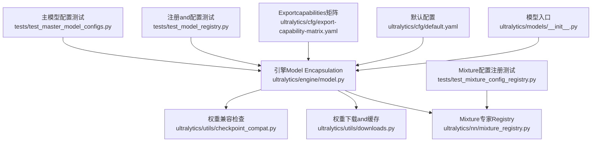
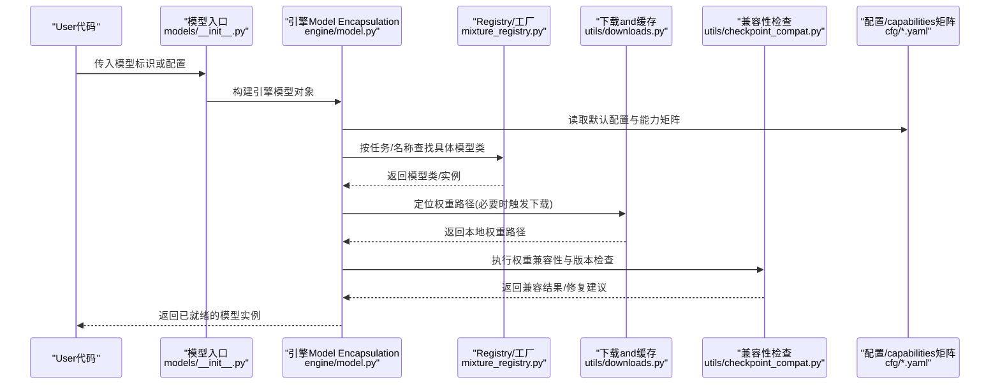
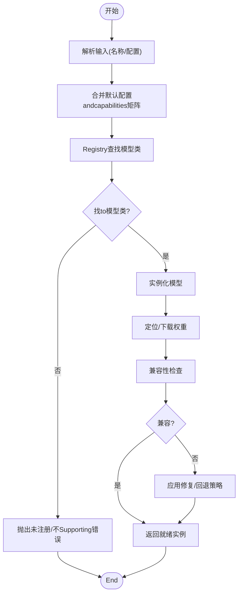
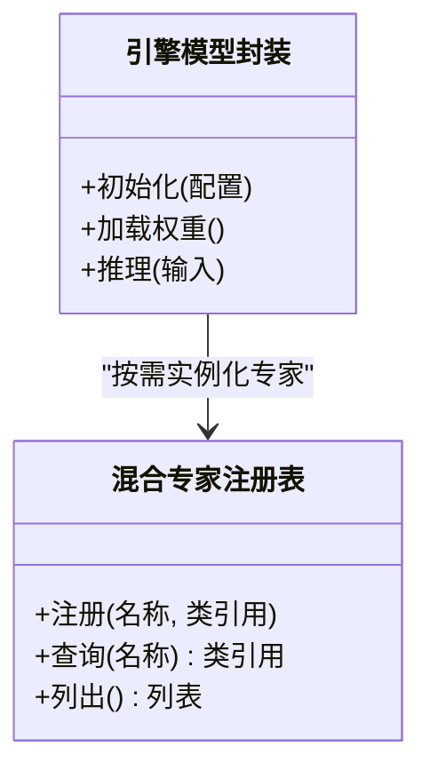
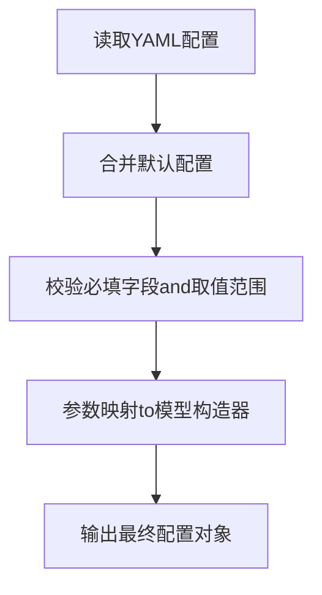
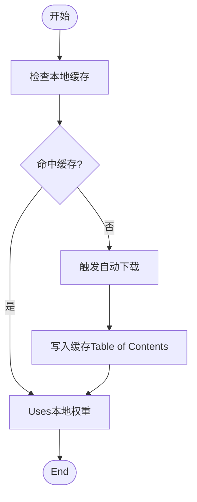
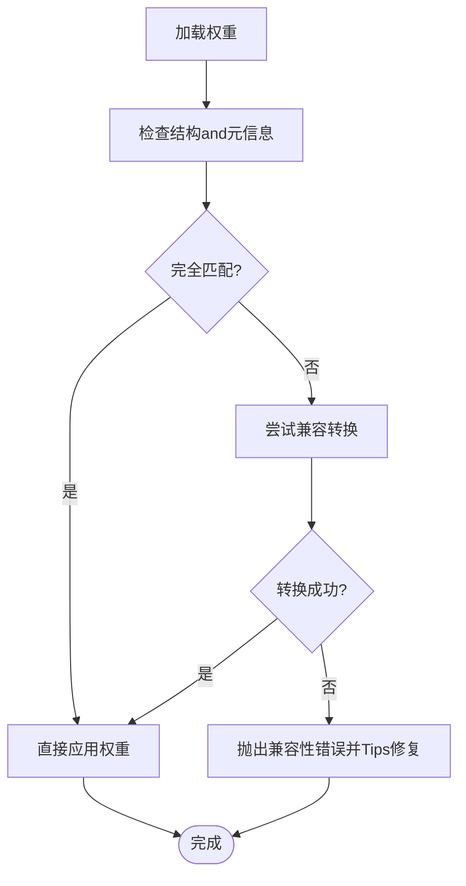
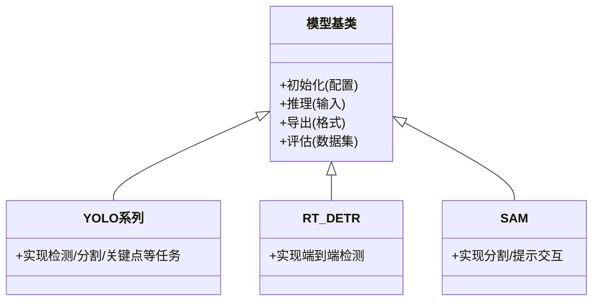
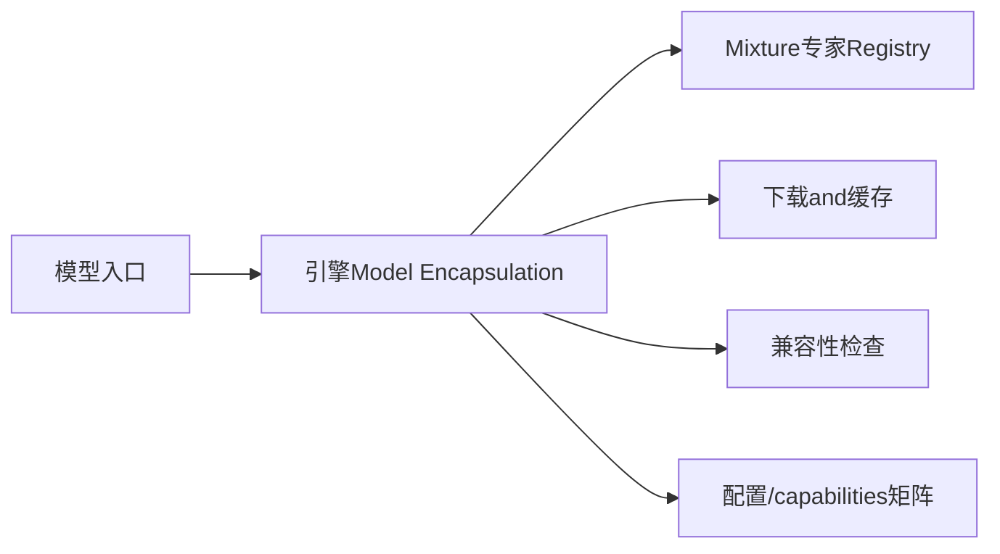

# 模型注册系统

<cite>
**Files Referenced in This Document**
- [ultralytics/models/__init__.py](file://ultralytics/models/__init__.py)
- [ultralytics/engine/model.py](file://ultralytics/engine/model.py)
- [ultralytics/nn/mixture_registry.py](file://ultralytics/nn/mixture_registry.py)
- [ultralytics/utils/checkpoint_compat.py](file://ultralytics/utils/checkpoint_compat.py)
- [ultralytics/utils/downloads.py](file://ultralytics/utils/downloads.py)
- [tests/test_model_registry.py](file://tests/test_model_registry.py)
- [tests/test_mixture_config_registry.py](file://tests/test_mixture_config_registry.py)
- [tests/test_master_model_configs.py](file://tests/test_master_model_configs.py)
- [ultralytics/cfg/default.yaml](file://ultralytics/cfg/default.yaml)
- [ultralytics/cfg/export-capability-matrix.yaml](file://ultralytics/cfg/export-capability-matrix.yaml)
</cite>

## Table of Contents
1. [Introduction](#Introduction)
2. [Project Structure](#Project Structure)
3. [Core Components](#Core Components)
4. [Architecture Overview](#Architecture Overview)
5. [Detailed Component Analysis](#Detailed Component Analysis)
6. [Dependency Analysis](#Dependency Analysis)
7. [性能考量](#性能考量)
8. [Troubleshooting Guide](#Troubleshooting Guide)
9. [Conclusion](#Conclusion)
10. [Appendix](#Appendix)

## Introduction
本文件targetingYOLO-Master框架的“模型注册系统”，系统性阐述其动态加载、工厂模式and配置drivers are installed的implementing原理，覆盖YOLO系列、RT-DETR、SAMetc.模型的注册方式and继承层次；说明YAML配置的解析and校验、参数映射机制；给出自定义模型集成步骤and接口要求；解释版本管理and兼容性检查；并补充缓存andPre-trained Weights自动下载逻辑、扩unfold发最佳实践and常见问题解决方案。DocumentationCentered on代码级事实for依据，辅Centered onVisualization图示，帮助读者快速理解并安全扩展模型生态。

## Project Structure
围绕模型注册and实例化，关键路径集中whileCentered on下Modules：
- 模型入口and工厂：负责按名称或配置创建具体模型实例
- Mixture专家Registry：集中管理可组合的专家/子Modules注册and解析
- 配置andcapabilities矩阵：provides默认配置andExportcapabilities约束
- 兼容性and下载：处理权重加载、版本兼容and自动下载
- 测试用例：Validation注册、配置解析and兼容性行for

Figure Source
- [ultralytics/models/__init__.py](file://ultralytics/models/__init__.py)
- [ultralytics/engine/model.py](file://ultralytics/engine/model.py)
- [ultralytics/nn/mixture_registry.py](file://ultralytics/nn/mixture_registry.py)
- [ultralytics/utils/downloads.py](file://ultralytics/utils/downloads.py)
- [ultralytics/utils/checkpoint_compat.py](file://ultralytics/utils/checkpoint_compat.py)
- [ultralytics/cfg/default.yaml](file://ultralytics/cfg/default.yaml)
- [ultralytics/cfg/export-capability-matrix.yaml](file://ultralytics/cfg/export-capability-matrix.yaml)
- [tests/test_model_registry.py](file://tests/test_model_registry.py)
- [tests/test_mixture_config_registry.py](file://tests/test_mixture_config_registry.py)
- [tests/test_master_model_configs.py](file://tests/test_master_model_configs.py)

Section Source
- [ultralytics/models/__init__.py](file://ultralytics/models/__init__.py)
- [ultralytics/engine/model.py](file://ultralytics/engine/model.py)
- [ultralytics/nn/mixture_registry.py](file://ultralytics/nn/mixture_registry.py)
- [ultralytics/utils/downloads.py](file://ultralytics/utils/downloads.py)
- [ultralytics/utils/checkpoint_compat.py](file://ultralytics/utils/checkpoint_compat.py)
- [ultralytics/cfg/default.yaml](file://ultralytics/cfg/default.yaml)
- [ultralytics/cfg/export-capability-matrix.yaml](file://ultralytics/cfg/export-capability-matrix.yaml)
- [tests/test_model_registry.py](file://tests/test_model_registry.py)
- [tests/test_mixture_config_registry.py](file://tests/test_mixture_config_registry.py)
- [tests/test_master_model_configs.py](file://tests/test_master_model_configs.py)

## Core Components
- 模型工厂and动态加载
  - ViaUnified entry point根据模型标识（such as名称、Tasks类型）选择并实例化具体模型类，Supporting从配置或字符串名构造。
  - CombiningTasks路由andcapabilities矩阵，确保不同模型（检测、分割、关键点、Tracking、Semantic Segmentationetc.）while相同API下可用。
- Mixture专家Registry
  - 维护可插拔的专家/子Modules集合，Supporting运行时选择and组合，便于implementingMoE/MoAetc.高级特性。
- 配置andcapabilities矩阵
  - 默认配置provides通用超参and数据路径；Exportcapabilities矩阵约束各模型while不同后端下的Export选项。
- 兼容性and下载
  - 权重加载前进行版本and结构校验，失败时触发回退策略；Supporting自动下载and本地缓存。
- 测试保障
  - 针对注册、配置解析、兼容性etc.关键路径provides单测，保证扩展稳定性。

Section Source
- [ultralytics/engine/model.py](file://ultralytics/engine/model.py)
- [ultralytics/nn/mixture_registry.py](file://ultralytics/nn/mixture_registry.py)
- [ultralytics/cfg/default.yaml](file://ultralytics/cfg/default.yaml)
- [ultralytics/cfg/export-capability-matrix.yaml](file://ultralytics/cfg/export-capability-matrix.yaml)
- [ultralytics/utils/checkpoint_compat.py](file://ultralytics/utils/checkpoint_compat.py)
- [ultralytics/utils/downloads.py](file://ultralytics/utils/downloads.py)
- [tests/test_model_registry.py](file://tests/test_model_registry.py)
- [tests/test_mixture_config_registry.py](file://tests/test_mixture_config_registry.py)
- [tests/test_master_model_configs.py](file://tests/test_master_model_configs.py)

## Architecture Overview
下图展示从UserCallsto模型实例化的端to端流程，包括配置解析、Registry查找、权重加载and兼容性检查。

Figure Source
- [ultralytics/models/__init__.py](file://ultralytics/models/__init__.py)
- [ultralytics/engine/model.py](file://ultralytics/engine/model.py)
- [ultralytics/nn/mixture_registry.py](file://ultralytics/nn/mixture_registry.py)
- [ultralytics/utils/downloads.py](file://ultralytics/utils/downloads.py)
- [ultralytics/utils/checkpoint_compat.py](file://ultralytics/utils/checkpoint_compat.py)
- [ultralytics/cfg/default.yaml](file://ultralytics/cfg/default.yaml)
- [ultralytics/cfg/export-capability-matrix.yaml](file://ultralytics/cfg/export-capability-matrix.yaml)

## Detailed Component Analysis

### 模型工厂and动态加载（模型入口and引擎Encapsulates）
- 设计要点
  - Unified entry point接收字符串名或配置字典，内部委托引擎Model Encapsulation完成实例化。
  - 基于Tasks类型andcapabilities矩阵决定可用的模型族andExport选项。
  - 对缺失的权重文件，Prefer本地缓存，否则触发自动下载。
- 关键流程
  - 解析输入（名称/配置）→ 合并默认配置 → 查询Registry获取模型类 → 初始化模型 → 加载权重 → 兼容性校验 → 返回实例。
- 错误处理
  - 当Registry中无匹配项或capabilities矩阵不Supporting当前Tasks时，抛出明确错误并Tips可用列表。
  - 权重不兼容时，给出修复建议或回退策略。

Figure Source
- [ultralytics/models/__init__.py](file://ultralytics/models/__init__.py)
- [ultralytics/engine/model.py](file://ultralytics/engine/model.py)
- [ultralytics/cfg/export-capability-matrix.yaml](file://ultralytics/cfg/export-capability-matrix.yaml)

Section Source
- [ultralytics/models/__init__.py](file://ultralytics/models/__init__.py)
- [ultralytics/engine/model.py](file://ultralytics/engine/model.py)
- [ultralytics/cfg/export-capability-matrix.yaml](file://ultralytics/cfg/export-capability-matrix.yaml)

### Mixture专家Registry（可插拔子Modulesand组合）
- 设计要点
  - provides统一的注册/查询接口，Supporting按名称或标签检索专家/子Modules。
  - and引擎模型协作，implementing按需加载and组合，降低耦合度。
- 数据结构and复杂度
  - 通常采用哈希映射存储键值对，插入/查询时间复杂度forO(1)。
- Typical Usage
  - 新增专家：whileRegistry中登记名称and类引用；while配置中指定专家ID；运行时由Registry解析并实例化。

Figure Source
- [ultralytics/nn/mixture_registry.py](file://ultralytics/nn/mixture_registry.py)
- [ultralytics/engine/model.py](file://ultralytics/engine/model.py)

Section Source
- [ultralytics/nn/mixture_registry.py](file://ultralytics/nn/mixture_registry.py)
- [tests/test_mixture_config_registry.py](file://tests/test_mixture_config_registry.py)

### 配置解析andValidation（YAML结构and参数映射）
- 配置文件
  - 默认配置provides通用超参and数据路径；Exportcapabilities矩阵定义各模型while不同后端的Export选项。
- 解析流程
  - 读取YAML → 合并默认配置 → 校验必填字段and取值范围 → 生成最终配置对象供模型Uses。
- 参数映射
  - 将高层配置键映射to模型构造函数参数，确保一致性and可读性。

Figure Source
- [ultralytics/cfg/default.yaml](file://ultralytics/cfg/default.yaml)
- [ultralytics/cfg/export-capability-matrix.yaml](file://ultralytics/cfg/export-capability-matrix.yaml)

Section Source
- [ultralytics/cfg/default.yaml](file://ultralytics/cfg/default.yaml)
- [ultralytics/cfg/export-capability-matrix.yaml](file://ultralytics/cfg/export-capability-matrix.yaml)
- [tests/test_master_model_configs.py](file://tests/test_master_model_configs.py)

### 权重加载、缓存and自动下载
- 缓存策略
  - Prefer本地缓存路径；若不存while且允许网络访问，则触发自动下载并写入缓存。
- 下载逻辑
  - 根据模型标识计算目标URLand本地路径；断点续传and完整性校验（such as有）。
- 异常处理
  - 网络不可用或权限不足时，给出清晰错误信息并provides离线方案。

Figure Source
- [ultralytics/utils/downloads.py](file://ultralytics/utils/downloads.py)

Section Source
- [ultralytics/utils/downloads.py](file://ultralytics/utils/downloads.py)

### 版本管理and兼容性检查
- 检查内容
  - 权重结构、键名、张量形状anddtype、Tasks头是否匹配当前模型定义。
- 修复策略
  - provides向后兼容的映射and转换函数；while不兼容时给出明确的升级指引。
- 测试保障
  - Via单测覆盖常见Migration场景and边界条件。

Figure Source
- [ultralytics/utils/checkpoint_compat.py](file://ultralytics/utils/checkpoint_compat.py)

Section Source
- [ultralytics/utils/checkpoint_compat.py](file://ultralytics/utils/checkpoint_compat.py)
- [tests/test_checkpoint_compat.py](file://tests/test_checkpoint_compat.py)

### 不同模型类型的注册方式and继承层次
- 模型族
  - YOLO系列、RT-DETR、SAMetc.均ViaUnified entry point注册，遵循相同的实例化契约。
- 继承层次
  - 基类provides通用capabilities（such asTasks路由、Export、Evaluation），具体模型族while派生类中implementing差异逻辑。
- 注册方式
  - whileRegistry中登记模型名and类引用；或while配置中声明Tasksand模型族，由工厂自动解析。

Figure Source
- [ultralytics/engine/model.py](file://ultralytics/engine/model.py)
- [ultralytics/models/__init__.py](file://ultralytics/models/__init__.py)

Section Source
- [ultralytics/engine/model.py](file://ultralytics/engine/model.py)
- [ultralytics/models/__init__.py](file://ultralytics/models/__init__.py)
- [tests/test_model_registry.py](file://tests/test_model_registry.py)

### 自定义模型集成方法（注册步骤and接口要求）
- 步骤概览
  - implementing模型类并继承基类，满足Inference/Export/Evaluation接口契约。
  - whileRegistry中登记新模型名称and类引用。
  - while配置中声明Tasksand模型族，或Via工厂直接按名称实例化。
  - 编写单测Validation注册、配置解析and兼容性。
- 接口要求
  - 统一的初始化签名、Inference输入输出规范、Export Format SupportandEvaluationMetrics对接。
- Examples路径
  - Refer to现有测试and注册用例，了解最小可行implementingand约定。

Section Source
- [tests/test_model_registry.py](file://tests/test_model_registry.py)
- [ultralytics/engine/model.py](file://ultralytics/engine/model.py)
- [ultralytics/nn/mixture_registry.py](file://ultralytics/nn/mixture_registry.py)

## Dependency Analysis
- 组件耦合
  - 模型入口and引擎Model Encapsulation强耦合；Registryand引擎弱耦合（Via名称/Tasks键）。
  - 下载and兼容性检查被引擎Model Encapsulation间接依赖，避免侵入业务逻辑。
- External Dependencies
  - YAML解析库、Network requestsand文件系统I/O。
- 循环依赖
  - ViaRegistry解耦，避免直接相互导入导致的循环依赖。

Figure Source
- [ultralytics/models/__init__.py](file://ultralytics/models/__init__.py)
- [ultralytics/engine/model.py](file://ultralytics/engine/model.py)
- [ultralytics/nn/mixture_registry.py](file://ultralytics/nn/mixture_registry.py)
- [ultralytics/utils/downloads.py](file://ultralytics/utils/downloads.py)
- [ultralytics/utils/checkpoint_compat.py](file://ultralytics/utils/checkpoint_compat.py)
- [ultralytics/cfg/default.yaml](file://ultralytics/cfg/default.yaml)
- [ultralytics/cfg/export-capability-matrix.yaml](file://ultralytics/cfg/export-capability-matrix.yaml)

Section Source
- [ultralytics/models/__init__.py](file://ultralytics/models/__init__.py)
- [ultralytics/engine/model.py](file://ultralytics/engine/model.py)
- [ultralytics/nn/mixture_registry.py](file://ultralytics/nn/mixture_registry.py)
- [ultralytics/utils/downloads.py](file://ultralytics/utils/downloads.py)
- [ultralytics/utils/checkpoint_compat.py](file://ultralytics/utils/checkpoint_compat.py)
- [ultralytics/cfg/default.yaml](file://ultralytics/cfg/default.yaml)
- [ultralytics/cfg/export-capability-matrix.yaml](file://ultralytics/cfg/export-capability-matrix.yaml)

## 性能考量
- Registry查询应forO(1)，避免while热路径中进行线性扫描。
- 权重加载and兼容性检查应尽可能缓存中间结果，减少重复计算。
- 自动下载需Supporting并发and断点续传，提升大权重获取效率。
- 配置解析应while启动阶段完成，避免whileInference路径中重复解析。

[本节for通用指导，无需特定文件来源]

## Troubleshooting Guide
- 无法找to模型
  - 确认模型名称已whileRegistry中登记；检查Tasksandcapabilities矩阵是否Supporting该模型。
- 权重不兼容
  - 查看兼容性检查Logging，依据Tips进行权重转换或升级模型定义。
- 下载失败
  - 检查网络连通性and磁盘权限；必要时手动放置权重至缓存Table of Contents。
- 配置错误
  - 核对YAML必填字段and取值范围；Refer to默认配置andcapabilities矩阵修正。

Section Source
- [ultralytics/utils/checkpoint_compat.py](file://ultralytics/utils/checkpoint_compat.py)
- [ultralytics/utils/downloads.py](file://ultralytics/utils/downloads.py)
- [ultralytics/cfg/default.yaml](file://ultralytics/cfg/default.yaml)
- [ultralytics/cfg/export-capability-matrix.yaml](file://ultralytics/cfg/export-capability-matrix.yaml)
- [tests/test_model_registry.py](file://tests/test_model_registry.py)

## Conclusion
YOLO-Master的模型注册系统Via工厂模式andRegistryimplementing了高内聚、低耦合的动态加载机制；Combined with配置drivers are installedandcapabilities矩阵，使多模型族while同一API下无缝切换；借助兼容性检查and自动下载，提升了易用性and鲁棒性。遵循本文的最佳实践and接口约定，开发者可Centered on高效地扩展新的模型类型并保持生态一致性。

[本节for总结性内容，无需特定文件来源]

## Appendix
- 常用命令andExamples路径
  - 注册andUses自定义模型：Reference Test Cases中的最小implementingandCalls方式。
  - 配置andcapabilities矩阵：Refer to默认配置andExportcapabilities矩阵文件。
- 相关测试
  - 注册and配置解析：见测试文件清单。

Section Source
- [tests/test_model_registry.py](file://tests/test_model_registry.py)
- [tests/test_mixture_config_registry.py](file://tests/test_mixture_config_registry.py)
- [tests/test_master_model_configs.py](file://tests/test_master_model_configs.py)
- [ultralytics/cfg/default.yaml](file://ultralytics/cfg/default.yaml)
- [ultralytics/cfg/export-capability-matrix.yaml](file://ultralytics/cfg/export-capability-matrix.yaml)