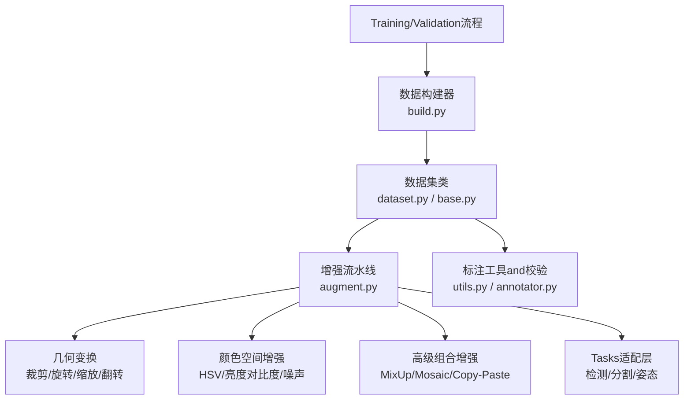
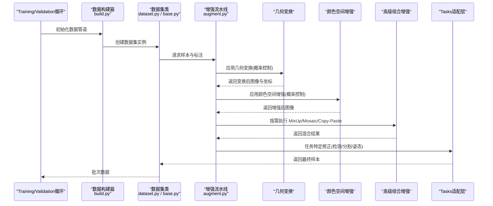
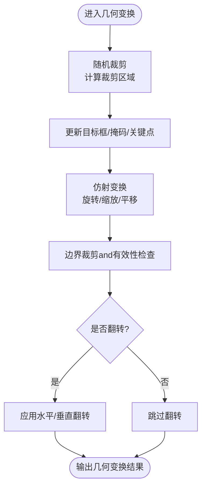
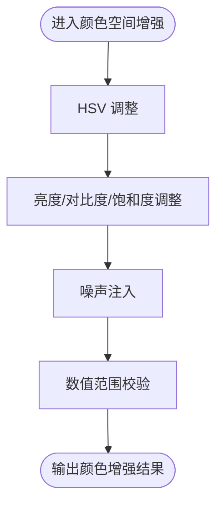
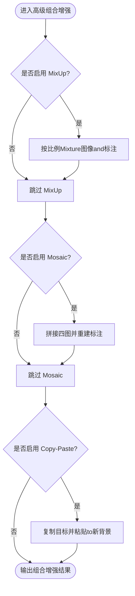
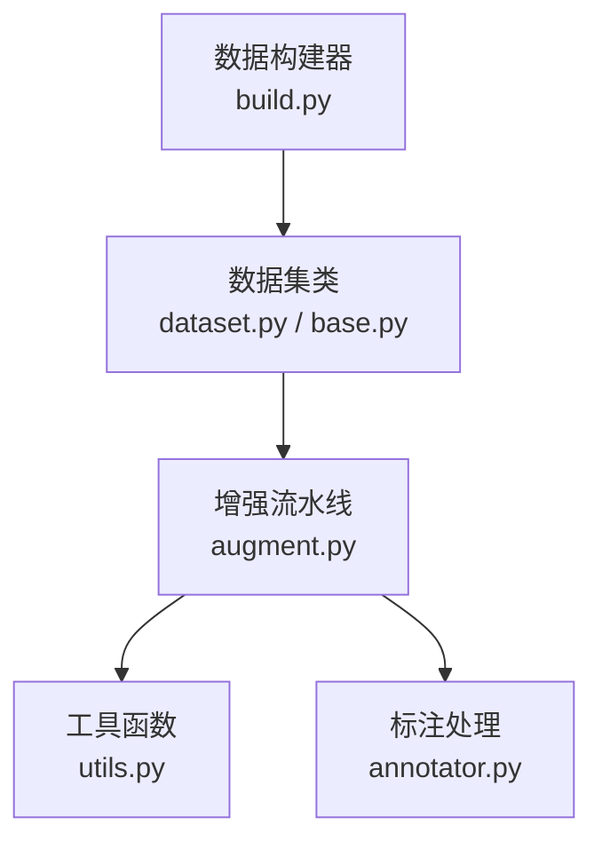

# Data Augmentation

<cite>
**Files Referenced in This Document**
- [ultralytics/data/augment.py](file://ultralytics/data/augment.py)
- [ultralytics/data/dataset.py](file://ultralytics/data/dataset.py)
- [ultralytics/data/build.py](file://ultralytics/data/build.py)
- [ultralytics/data/base.py](file://ultralytics/data/base.py)
- [ultralytics/data/utils.py](file://ultralytics/data/utils.py)
- [ultralytics/data/annotator.py](file://ultralytics/data/annotator.py)
- [docs/en/guides/yolo-data-augmentation.md](file://docs/en/guides/yolo-data-augmentation.md)
- [docs/macros/augmentation-args.md](file://docs/macros/augmentation-args.md)
</cite>

## Table of Contents
1. [Introduction](#Introduction)
2. [Project Structure](#Project Structure)
3. [Core Components](#Core Components)
4. [Architecture Overview](#Architecture Overview)
5. [Detailed Component Analysis](#Detailed Component Analysis)
6. [Dependency Analysis](#Dependency Analysis)
7. [性能考量](#性能考量)
8. [Troubleshooting Guide](#Troubleshooting Guide)
9. [Conclusion](#Conclusion)
10. [Appendix](#Appendix)

## Introduction
本技术Documentation聚焦于 YOLO-Master 的Data Augmentation系统，系统性阐述几何变换、颜色空间增强and高级组合增强（such as MixUp、Mosaic、Copy-Paste）的implementing思路andUses方式；解释增强的组合策略and概率控制机制；provides自定义增强算子的开发方法and集成路径；并针对检测、分割、Pose Estimationand other tasks给出专用增强策略、参数调优指南、效果Evaluation方法Centered onand最佳实践建议。

## Project Structure
YOLO-Master 的Data Augmentation相关代码主要位于 ultralytics/data Table of Contents下，其中：
- augment.py：集中implementing各类图像and标注的增强算子and流水线编排逻辑
- dataset.py / base.py / build.py：数据集加载、批构建and增强流水线的装配入口
- utils.py / annotator.py：辅助工具and标注处理Supporting
- docs and macros：官方增强Documentationand宏定义，覆盖参数说明andUsesExamples

Figure Source
- [ultralytics/data/build.py](file://ultralytics/data/build.py)
- [ultralytics/data/dataset.py](file://ultralytics/data/dataset.py)
- [ultralytics/data/base.py](file://ultralytics/data/base.py)
- [ultralytics/data/augment.py](file://ultralytics/data/augment.py)
- [ultralytics/data/utils.py](file://ultralytics/data/utils.py)
- [ultralytics/data/annotator.py](file://ultralytics/data/annotator.py)

Section Source
- [ultralytics/data/augment.py](file://ultralytics/data/augment.py)
- [ultralytics/data/dataset.py](file://ultralytics/data/dataset.py)
- [ultralytics/data/build.py](file://ultralytics/data/build.py)
- [ultralytics/data/base.py](file://ultralytics/data/base.py)
- [ultralytics/data/utils.py](file://ultralytics/data/utils.py)
- [ultralytics/data/annotator.py](file://ultralytics/data/annotator.py)
- [docs/en/guides/yolo-data-augmentation.md](file://docs/en/guides/yolo-data-augmentation.md)
- [docs/macros/augmentation-args.md](file://docs/macros/augmentation-args.md)

## Core Components
- 增强流水线编排：负责按序Calls几何、颜色、高级组合etc.增强Modules，并对不同Tasks类型进行适配and边界条件处理
- 几何变换Modules：随机裁剪、仿射变换（旋转/缩放/平移）、水平/垂直翻转etc.，配套坐标and掩码更新
- 颜色空间增强Modules：HSV 调整、亮度/对比度/饱和度修改、噪声注入etc.
- 高级组合增强Modules：MixUp、Mosaic、Copy-Paste etc.，用于提升模型鲁棒性and泛化capabilities
- Tasks适配层：根据检测、分割、Pose Estimationetc.不同Tasks的标注格式，对增强后的坐标、多边形、关键点etc.进行一致性维护
- 配置and宏：Via配置文件and宏定义暴露可调参数，便于统一管理and实验复现

Section Source
- [ultralytics/data/augment.py](file://ultralytics/data/augment.py)
- [docs/macros/augmentation-args.md](file://docs/macros/augmentation-args.md)

## Architecture Overview
下图展示了从数据构建to增强执行的整体流程，包括增强Modules的选择、概率控制andTasks适配。

Figure Source
- [ultralytics/data/build.py](file://ultralytics/data/build.py)
- [ultralytics/data/dataset.py](file://ultralytics/data/dataset.py)
- [ultralytics/data/base.py](file://ultralytics/data/base.py)
- [ultralytics/data/augment.py](file://ultralytics/data/augment.py)

## Detailed Component Analysis

### 几何变换增强
- 随机裁剪：while图像内随机选择区域进行裁剪，需同步更新目标框、掩码或关键点坐标
- 仿射变换：包含旋转、缩放、平移的组合，保持标注几何一致性
- 翻转：水平/垂直翻转，适用于对称场景and类别不变性假设
- 关键要点：所有几何操作必须严格维护标注坐标系的一致性，避免越界and退化

Figure Source
- [ultralytics/data/augment.py](file://ultralytics/data/augment.py)

Section Source
- [ultralytics/data/augment.py](file://ultralytics/data/augment.py)

### 颜色空间增强
- HSV 调整：调节色调、饱和度、明度，模拟光照and色彩变化
- 亮度/对比度/饱和度：独立或联合调整，增强对不同曝光条件的鲁棒性
- 噪声添加：高斯噪声、椒盐噪声etc.，提升抗噪capabilities
- 注意事项：颜色增强通常不改变标注位置，但需注意数值范围and溢出处理

Figure Source
- [ultralytics/data/augment.py](file://ultralytics/data/augment.py)

Section Source
- [ultralytics/data/augment.py](file://ultralytics/data/augment.py)

### 高级组合增强
- MixUp：将两张图像and其标注按比例线性Mixture，常用于分类and检测Tasks
- Mosaic：拼接四张图像for一张大图，丰富上下文and小目标分布
- Copy-Paste：将目标对象复制粘贴至新背景，增强小目标and遮挡鲁棒性
- 概率控制：Via配置参数控制各增强是否启用and强度，避免破坏标注质量

Figure Source
- [ultralytics/data/augment.py](file://ultralytics/data/augment.py)

Section Source
- [ultralytics/data/augment.py](file://ultralytics/data/augment.py)

### Tasks专用增强策略
- 检测Tasks：重点维护目标框完整性，避免过小或退化的框；Mosaic 对小目标有益
- 分割Tasks：掩码需and几何变换严格对齐，注意边界像素and空洞填充
- Pose Estimation：关键点需随仿射变换一致更新，确保关节相对位置合理
- 通用原则：任何增强不得破坏标注语义一致性；必要时引入Post-Processing修复

Section Source
- [ultralytics/data/augment.py](file://ultralytics/data/augment.py)
- [ultralytics/data/utils.py](file://ultralytics/data/utils.py)
- [ultralytics/data/annotator.py](file://ultralytics/data/annotator.py)

### 组合策略and概率控制
- 概率开关：每个增强可配置启用概率，避免过度增强导致标注失真
- 强度范围：Via上下限参数控制增强幅度，CombiningTasks特性进行约束
- 顺序编排：几何→颜色→组合的顺序有助于保持标注一致性
- 可观测性：记录增强Loggingand统计信息，便于分析and回溯

Section Source
- [docs/macros/augmentation-args.md](file://docs/macros/augmentation-args.md)
- [docs/en/guides/yolo-data-augmentation.md](file://docs/en/guides/yolo-data-augmentation.md)

### 自定义增强算子开发and集成
- 接口约定：遵循统一的输入输出契约（图像and标注），保证and现有流水线兼容
- 注册机制：while增强工厂或配置中注册自定义算子，Supporting动态加载
- 测试Validation：编写单元测试覆盖边界情况and数值稳定性
- 集成步骤：while增强流水线中插入自定义算子，并Via配置控制其概率and强度

Section Source
- [ultralytics/data/augment.py](file://ultralytics/data/augment.py)
- [docs/en/guides/yolo-data-augmentation.md](file://docs/en/guides/yolo-data-augmentation.md)

## Dependency Analysis
增强Modulesand数据集、工具库之间的依赖关系such as下：

Figure Source
- [ultralytics/data/augment.py](file://ultralytics/data/augment.py)
- [ultralytics/data/dataset.py](file://ultralytics/data/dataset.py)
- [ultralytics/data/base.py](file://ultralytics/data/base.py)
- [ultralytics/data/build.py](file://ultralytics/data/build.py)
- [ultralytics/data/utils.py](file://ultralytics/data/utils.py)
- [ultralytics/data/annotator.py](file://ultralytics/data/annotator.py)

Section Source
- [ultralytics/data/augment.py](file://ultralytics/data/augment.py)
- [ultralytics/data/dataset.py](file://ultralytics/data/dataset.py)
- [ultralytics/data/build.py](file://ultralytics/data/build.py)
- [ultralytics/data/base.py](file://ultralytics/data/base.py)
- [ultralytics/data/utils.py](file://ultralytics/data/utils.py)
- [ultralytics/data/annotator.py](file://ultralytics/data/annotator.py)

## 性能考量
- 并行and缓存：利用Data Loading并行and磁盘缓存减少 IO bottlenecks
- 向量化and内存：尽量Uses向量化操作and内存复用，降低拷贝开销
- 增强复杂度：高级组合增强（such as Mosaic）计算成本较高，应Combining硬件资源andTraining时长权衡
- 精度and稳定性：颜色and噪声增强可能影响数值稳定性，需关注Gradient异常and NaN 传播

[本节for通用指导，无需具体文件引用]

## Troubleshooting Guide
- 标注不一致：检查几何变换后的坐标更新逻辑and边界裁剪是否正确
- 掩码断裂：分割Tasks中掩码边缘可能出现伪影，需检查插值and填充策略
- 关键点错位：Pose Estimation的关键点需严格跟随仿射变换，避免关节拓扑错误
- 增强过强：若出现性能下降，逐步关闭高级组合增强Centered on定位问题
- LoggingandVisualization：开启增强LoggingandVisualization输出，快速定位异常样本

Section Source
- [ultralytics/data/augment.py](file://ultralytics/data/augment.py)
- [ultralytics/data/utils.py](file://ultralytics/data/utils.py)
- [ultralytics/data/annotator.py](file://ultralytics/data/annotator.py)

## Conclusion
YOLO-Master 的Data Augmentation系统ViaModules化设计andTasks适配层，provides了灵活且强大的增强capabilities。合理Uses几何变换、颜色空间增强and高级组合增强，并Combining概率控制and参数调优，可显著提升模型的鲁棒性and泛化capabilities。建议while实验中系统化地Evaluation不同增强策略的效果，并依据Tasks特性制定最佳实践。

[本节for总结性内容，无需具体文件引用]

## Appendix
- 官方增强Documentation：Refer to yolo-data-augmentation.md 获取Uses指南andExamples
- 增强参数宏：Refer to augmentation-args.md 了解可调参数and默认值

Section Source
- [docs/en/guides/yolo-data-augmentation.md](file://docs/en/guides/yolo-data-augmentation.md)
- [docs/macros/augmentation-args.md](file://docs/macros/augmentation-args.md)