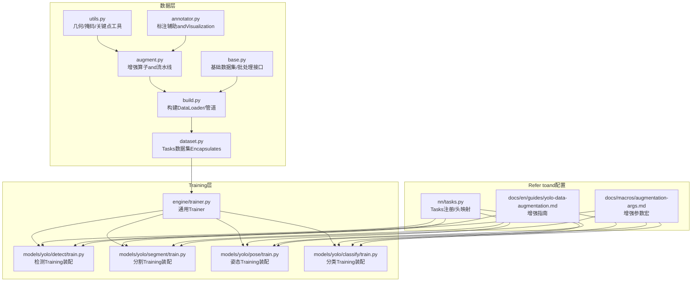
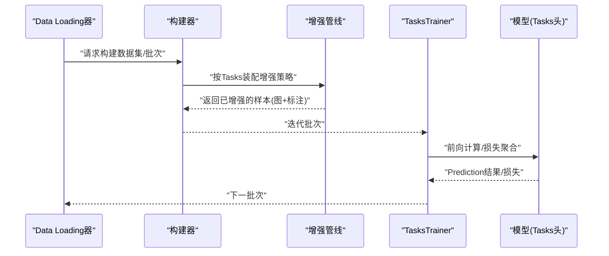
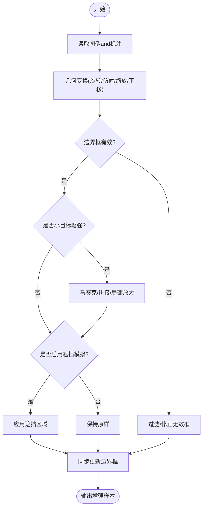
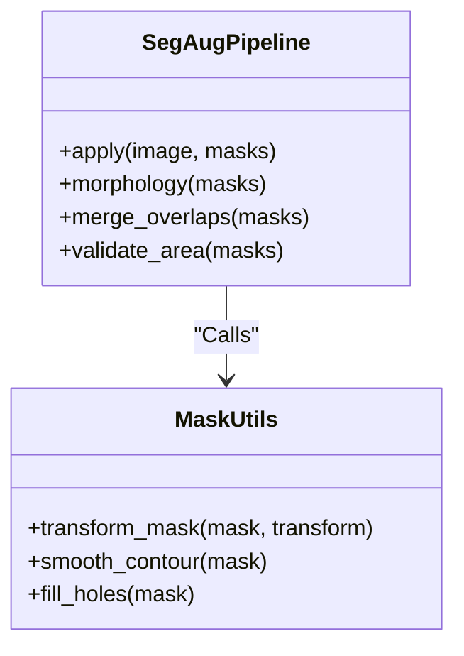
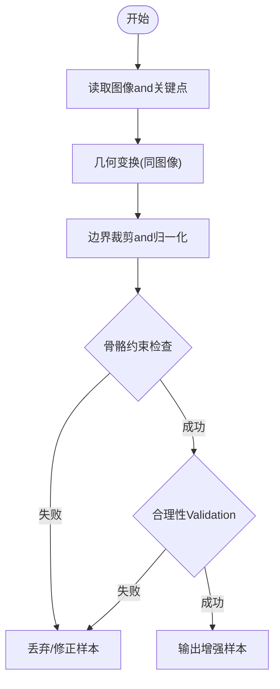
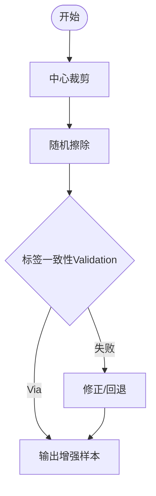
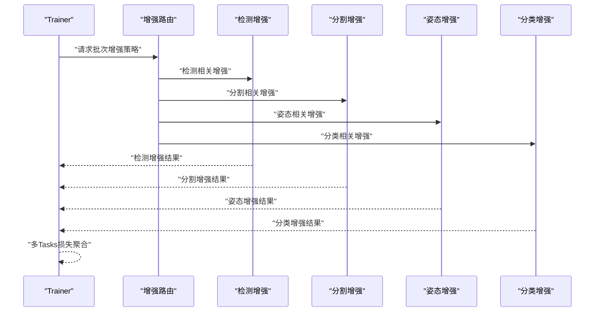
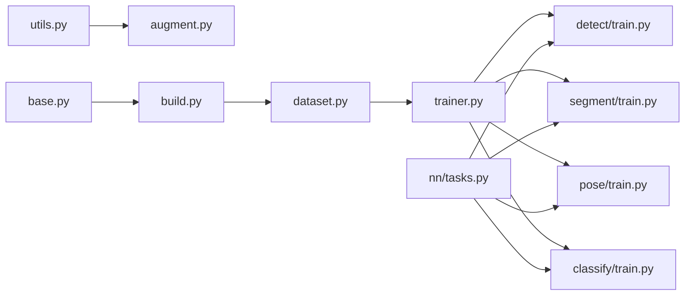

# Tasks专用增强

<cite>
**Files Referenced in This Document**
- [ultralytics/data/augment.py](file://ultralytics/data/augment.py)
- [ultralytics/data/base.py](file://ultralytics/data/base.py)
- [ultralytics/data/build.py](file://ultralytics/data/build.py)
- [ultralytics/data/dataset.py](file://ultralytics/data/dataset.py)
- [ultralytics/data/annotator.py](file://ultralytics/data/annotator.py)
- [ultralytics/data/utils.py](file://ultralytics/data/utils.py)
- [ultralytics/models/yolo/detect/train.py](file://ultralytics/models/yolo/detect/train.py)
- [ultralytics/models/yolo/segment/train.py](file://ultralytics/models/yolo/segment/train.py)
- [ultralytics/models/yolo/pose/train.py](file://ultralytics/models/yolo/pose/train.py)
- [ultralytics/models/yolo/classify/train.py](file://ultralytics/models/yolo/classify/train.py)
- [ultralytics/engine/trainer.py](file://ultralytics/engine/trainer.py)
- [ultralytics/nn/tasks.py](file://ultralytics/nn/tasks.py)
- [docs/en/guides/yolo-data-augmentation.md](file://docs/en/guides/yolo-data-augmentation.md)
- [docs/macros/augmentation-args.md](file://docs/macros/augmentation-args.md)
</cite>

## Table of Contents
1. [Introduction](#Introduction)
2. [Project Structure](#Project Structure)
3. [Core Components](#Core Components)
4. [Architecture Overview](#Architecture Overview)
5. [Detailed Component Analysis](#Detailed Component Analysis)
6. [Dependency Analysis](#Dependency Analysis)
7. [性能考量](#性能考量)
8. [Troubleshooting Guide](#Troubleshooting Guide)
9. [Conclusion](#Conclusion)
10. [Appendix](#Appendix)

## Introduction
本技术Documentation聚焦于YOLO-Master中targeting不同Tasks的“专用Data Augmentation”capabilities，覆盖Object Detection、Instance Segmentation、Pose Estimationand分类四大Tasks。Documentation从系统架构、关键implementing路径、数据流and控制流出发，解释：
- Object Detection的边界框约束几何变换、小目标增强、遮挡模拟etc.策略；
- Instance Segmentation的掩码同步变换、轮廓保持操作and像素级标注一致性保证；
- Pose Estimation的关键点坐标变换、骨骼结构约束and人体姿态合理性Validation；
- 分类Tasks的中心裁剪、随机擦除and标签一致性；
- 多Tasks学习中的增强协调机制and冲突解决策略；
- 典型场景（Medical Imaging、卫星图像、工业检测）的定制化增强方案建议；
- 实验设计and基准测试方法，帮助读者复现并对比不同增强组合的效果。

## Project Structure
本项目将Data Loadingand增强集中while data Modules，Trainerwhile各Tasks模型Table of Contents下进行装配and调度，Documentationand宏定义provides参数说明andUses指引。

Figure Source
- [ultralytics/data/augment.py](file://ultralytics/data/augment.py)
- [ultralytics/data/base.py](file://ultralytics/data/base.py)
- [ultralytics/data/build.py](file://ultralytics/data/build.py)
- [ultralytics/data/dataset.py](file://ultralytics/data/dataset.py)
- [ultralytics/data/utils.py](file://ultralytics/data/utils.py)
- [ultralytics/data/annotator.py](file://ultralytics/data/annotator.py)
- [ultralytics/engine/trainer.py](file://ultralytics/engine/trainer.py)
- [ultralytics/models/yolo/detect/train.py](file://ultralytics/models/yolo/detect/train.py)
- [ultralytics/models/yolo/segment/train.py](file://ultralytics/models/yolo/segment/train.py)
- [ultralytics/models/yolo/pose/train.py](file://ultralytics/models/yolo/pose/train.py)
- [ultralytics/models/yolo/classify/train.py](file://ultralytics/models/yolo/classify/train.py)
- [ultralytics/nn/tasks.py](file://ultralytics/nn/tasks.py)
- [docs/en/guides/yolo-data-augmentation.md](file://docs/en/guides/yolo-data-augmentation.md)
- [docs/macros/augmentation-args.md](file://docs/macros/augmentation-args.md)

Section Source
- [ultralytics/data/augment.py](file://ultralytics/data/augment.py)
- [ultralytics/data/build.py](file://ultralytics/data/build.py)
- [ultralytics/engine/trainer.py](file://ultralytics/engine/trainer.py)
- [docs/en/guides/yolo-data-augmentation.md](file://docs/en/guides/yolo-data-augmentation.md)
- [docs/macros/augmentation-args.md](file://docs/macros/augmentation-args.md)

## Core Components
- 增强管线and算子
  - 统一while增强Modules中定义各类几何、颜色、合成类算子，并provides按Tasks筛选and组合的capabilities。
  - Supporting对图像、边界框、掩码、关键点etc.Multimodal标注进行同步变换，确保标注一致性。
- 数据集and构建器
  - 基础数据集接口负责样本读取、元信息解析and批组装；构建器根据Tasks类型装配相应增强流水线。
- TrainerandTasks装配
  - 通用Trainerdrivers are installedTraining循环；各TasksTraining脚本while初始化阶段注入Tasks特定的增强策略andPost-Processing逻辑。
- 工具and标注辅助
  - 几何and掩码工具用于坐标/掩码/关键点变换and有效性校验；标注辅助用于Visualizationand调试。

Section Source
- [ultralytics/data/augment.py](file://ultralytics/data/augment.py)
- [ultralytics/data/base.py](file://ultralytics/data/base.py)
- [ultralytics/data/build.py](file://ultralytics/data/build.py)
- [ultralytics/data/dataset.py](file://ultralytics/data/dataset.py)
- [ultralytics/data/utils.py](file://ultralytics/data/utils.py)
- [ultralytics/data/annotator.py](file://ultralytics/data/annotator.py)
- [ultralytics/engine/trainer.py](file://ultralytics/engine/trainer.py)

## Architecture Overview
下图展示从Data LoadingtoTasksTraining的端to端流程，强调增强管线while不同Tasks中的差异化装配and执行顺序。

Figure Source
- [ultralytics/data/build.py](file://ultralytics/data/build.py)
- [ultralytics/data/augment.py](file://ultralytics/data/augment.py)
- [ultralytics/engine/trainer.py](file://ultralytics/engine/trainer.py)
- [ultralytics/models/yolo/detect/train.py](file://ultralytics/models/yolo/detect/train.py)
- [ultralytics/models/yolo/segment/train.py](file://ultralytics/models/yolo/segment/train.py)
- [ultralytics/models/yolo/pose/train.py](file://ultralytics/models/yolo/pose/train.py)
- [ultralytics/models/yolo/classify/train.py](file://ultralytics/models/yolo/classify/train.py)

## Detailed Component Analysis

### Object Detection：边界框约束几何变换、小目标增强、遮挡模拟
- 边界框约束的几何变换
  - 旋转、仿射、缩放、平移etc.操作需严格限制边界框范围，避免越界或退化；对极小/极大比例变化进行阈值控制。
  - 对长宽比异常、面积过小或过大的框进行过滤或重采样，保证Training稳定性。
- 小目标增强
  - Via马赛克/拼接、尺度抖动、局部放大etc.方式提升小目标可见性；Combining自适应裁剪and重叠区域保留策略。
- 遮挡模拟
  - 引入随机遮挡块、模糊区域或背景纹理替换，提高模型对部分遮挡的鲁棒性。
- 标注一致性
  - 所有几何变换必须同步更新边界框坐标and类别标签，确保输入and标注严格对齐。

Figure Source
- [ultralytics/data/augment.py](file://ultralytics/data/augment.py)
- [ultralytics/data/utils.py](file://ultralytics/data/utils.py)
- [ultralytics/models/yolo/detect/train.py](file://ultralytics/models/yolo/detect/train.py)

Section Source
- [ultralytics/data/augment.py](file://ultralytics/data/augment.py)
- [ultralytics/data/utils.py](file://ultralytics/data/utils.py)
- [ultralytics/models/yolo/detect/train.py](file://ultralytics/models/yolo/detect/train.py)

### Instance Segmentation：掩码同步变换、轮廓保持、像素级标注一致性
- 掩码同步变换
  - 对掩码执行and图像相同的几何变换，确保像素级标注and图像空间一致。
- 轮廓保持的几何操作
  - 对掩码进行形态学平滑、孔洞填充and边缘细化，减少离散化误差导致的轮廓失真。
- 像素级标注一致性保证
  - 对重叠掩码进行优先级或权重融合，避免同一像素被重复分配；对超小掩码进行面积阈值过滤。
- Training适配
  - while分割头前对掩码进行归一化and通道扩展，Combined withLoss Function进行像素级Optimization。

Figure Source
- [ultralytics/data/augment.py](file://ultralytics/data/augment.py)
- [ultralytics/data/utils.py](file://ultralytics/data/utils.py)
- [ultralytics/models/yolo/segment/train.py](file://ultralytics/models/yolo/segment/train.py)

Section Source
- [ultralytics/data/augment.py](file://ultralytics/data/augment.py)
- [ultralytics/data/utils.py](file://ultralytics/data/utils.py)
- [ultralytics/models/yolo/segment/train.py](file://ultralytics/models/yolo/segment/train.py)

### Pose Estimation：关键点坐标变换、骨骼结构约束、人体姿态合理性Validation
- 关键点坐标变换
  - 对关键点执行and图像一致的几何变换，并进行边界裁剪and坐标归一化。
- 骨骼结构约束
  - 依据预定义骨骼连接关系检查关节相对位置，剔除不合理姿态（such as关节反转、跨度过大）。
- 人体姿态合理性Validation
  - 基于人体先验（such as对称性、常见角度范围）进行二次校验，必要时回退或修正关键点。
- Training适配
  - 关键点热力图或向量表示and图像同步生成，Combined with姿态损失进行Optimization。

Figure Source
- [ultralytics/data/augment.py](file://ultralytics/data/augment.py)
- [ultralytics/data/utils.py](file://ultralytics/data/utils.py)
- [ultralytics/models/yolo/pose/train.py](file://ultralytics/models/yolo/pose/train.py)

Section Source
- [ultralytics/data/augment.py](file://ultralytics/data/augment.py)
- [ultralytics/data/utils.py](file://ultralytics/data/utils.py)
- [ultralytics/models/yolo/pose/train.py](file://ultralytics/models/yolo/pose/train.py)

### 分类：中心裁剪、随机擦除、标签一致性
- 中心裁剪
  - Centered on图像中心for基准进行固定比例裁剪，保持主体完整性，适用于主体居中分布的数据集。
- 随机擦除
  - while图像内随机选择区域进行擦除或噪声注入，提升模型对缺失信息的鲁棒性。
- 标签一致性
  - 确保裁剪and擦除不改变类别语义；对多标签或多Tasks场景，保持标签集合不变。
- Training适配
  - 分类头直接接收增强后的图像特征，Combined with交叉熵或加权损失进行Optimization。

Figure Source
- [ultralytics/data/augment.py](file://ultralytics/data/augment.py)
- [ultralytics/models/yolo/classify/train.py](file://ultralytics/models/yolo/classify/train.py)

Section Source
- [ultralytics/data/augment.py](file://ultralytics/data/augment.py)
- [ultralytics/models/yolo/classify/train.py](file://ultralytics/models/yolo/classify/train.py)

### 多Tasks学习：增强协调机制and冲突解决策略
- 增强协调
  - while多Tasks共享数据流中，按Tasks需求动态选择增强算子；对共享增强（such as颜色抖动）andTasks专属增强（such as掩码同步）进行分层管理。
- 冲突解决
  - 当不同Tasks的增强策略产生冲突（例such as某增强破坏掩码连续性），采用Tasks优先级或条件开关进行仲裁；必要时引入可学习的增强路由。
- Training编排
  - Trainerwhile批次级别协调多Tasks增强，确保每个Tasks获得and其头匹配的输入and标注。

Figure Source
- [ultralytics/engine/trainer.py](file://ultralytics/engine/trainer.py)
- [ultralytics/data/augment.py](file://ultralytics/data/augment.py)
- [ultralytics/models/yolo/detect/train.py](file://ultralytics/models/yolo/detect/train.py)
- [ultralytics/models/yolo/segment/train.py](file://ultralytics/models/yolo/segment/train.py)
- [ultralytics/models/yolo/pose/train.py](file://ultralytics/models/yolo/pose/train.py)
- [ultralytics/models/yolo/classify/train.py](file://ultralytics/models/yolo/classify/train.py)

Section Source
- [ultralytics/engine/trainer.py](file://ultralytics/engine/trainer.py)
- [ultralytics/data/augment.py](file://ultralytics/data/augment.py)
- [ultralytics/models/yolo/detect/train.py](file://ultralytics/models/yolo/detect/train.py)
- [ultralytics/models/yolo/segment/train.py](file://ultralytics/models/yolo/segment/train.py)
- [ultralytics/models/yolo/pose/train.py](file://ultralytics/models/yolo/pose/train.py)
- [ultralytics/models/yolo/classify/train.py](file://ultralytics/models/yolo/classify/train.py)

## Dependency Analysis
- 组件耦合
  - 增强Modules依赖几何and掩码工具；数据集构建器依赖增强Modules；Trainer依赖数据集andTasksTraining脚本。
- External Dependencies
  - 图像处理库（such asOpenCV）、数值计算库（such asNumPy/Torch）用于高效implementing几何变换and掩码操作。
- Potential Cycles依赖
  - Via分层设计（data→engine→models）避免循环；Tasks头注册whilenn.tasks中，供Training装配引用。

Figure Source
- [ultralytics/data/utils.py](file://ultralytics/data/utils.py)
- [ultralytics/data/augment.py](file://ultralytics/data/augment.py)
- [ultralytics/data/base.py](file://ultralytics/data/base.py)
- [ultralytics/data/build.py](file://ultralytics/data/build.py)
- [ultralytics/data/dataset.py](file://ultralytics/data/dataset.py)
- [ultralytics/engine/trainer.py](file://ultralytics/engine/trainer.py)
- [ultralytics/models/yolo/detect/train.py](file://ultralytics/models/yolo/detect/train.py)
- [ultralytics/models/yolo/segment/train.py](file://ultralytics/models/yolo/segment/train.py)
- [ultralytics/models/yolo/pose/train.py](file://ultralytics/models/yolo/pose/train.py)
- [ultralytics/models/yolo/classify/train.py](file://ultralytics/models/yolo/classify/train.py)
- [ultralytics/nn/tasks.py](file://ultralytics/nn/tasks.py)

Section Source
- [ultralytics/data/augment.py](file://ultralytics/data/augment.py)
- [ultralytics/data/build.py](file://ultralytics/data/build.py)
- [ultralytics/engine/trainer.py](file://ultralytics/engine/trainer.py)
- [ultralytics/nn/tasks.py](file://ultralytics/nn/tasks.py)

## 性能考量
- 并行andI/O
  - Uses多线程/多进程Data Loadingand缓存策略，降低磁盘I/Obottlenecks；对大规模数据集采用分片and懒加载。
- 内存and显存
  - 掩码and关键点数据占用较大，应进行按需加载and压缩存储；批大小and分辨率需平衡显存占用。
- 算子效率
  - Prefer向量化andGPU加速的几何变换；对形态学操作进行批处理and内核复用。
- Training稳定性
  - 对小目标and遮挡增强进行强度控制，避免过度扰动导致Gradient不稳定；引入早停andLearning Rate调度。

[本节for通用指导，无需特定文件来源]

## Troubleshooting Guide
- 标注不一致
  - 现象：Training时损失震荡或Metrics异常。
  - 排查：检查增强管线对边界框/掩码/关键点的同步更新逻辑；确认几何变换参数and坐标变换矩阵一致。
- 掩码失真
  - 现象：分割IoU下降。
  - 排查：Validation掩码形态学操作and重叠合并策略；调整面积阈值and平滑强度。
- 关键点不合理
  - 现象：姿态损失发散。
  - 排查：检查骨骼约束and合理性Validation规则；必要时放宽阈值或增加正则项。
- 多Tasks冲突
  - 现象：某一TasksMetrics显著下降。
  - 排查：审查增强路由andTasks优先级；尝试关闭冲突增强或引入可学习路由。

Section Source
- [ultralytics/data/augment.py](file://ultralytics/data/augment.py)
- [ultralytics/data/utils.py](file://ultralytics/data/utils.py)
- [ultralytics/engine/trainer.py](file://ultralytics/engine/trainer.py)

## Conclusion
YOLO-Master的Tasks专用增强体系through a unified增强管线andTasks适配的Training装配，implementing了检测、分割、姿态and分类四类Tasks的精细化Data Augmentation。其核心while于：
- 严格的标注一致性保障；
- 针对Tasks特性的增强策略and约束；
- 多Tasks下的增强协调and冲突解决；
- 可扩展的工具and配置体系，便于场景定制and实验对比。

[本节for总结，无需特定文件来源]

## Appendix

### 实验设计and基准测试方法
- 基线设置
  - Uses默认增强作for基线；记录mAP、mIoU、PCKh、Top-1准确率etc.Metrics。
- 消融实验
  - 逐项启用/禁用增强（such as小目标增强、遮挡模拟、掩码同步、关键点约束），观察Metrics变化。
- 场景定制
  - Medical Imaging：低对比度增强、组织先验约束；
  - 卫星图像：多尺度and方向增强、地物先验；
  - 工业检测：缺陷模拟、纹理替换、高精度掩码保持。
- 报告and复现
  - Uses统一配置文件and随机种子；记录增强参数andTrainingLogging，便于复现实验。

Section Source
- [docs/en/guides/yolo-data-augmentation.md](file://docs/en/guides/yolo-data-augmentation.md)
- [docs/macros/augmentation-args.md](file://docs/macros/augmentation-args.md)