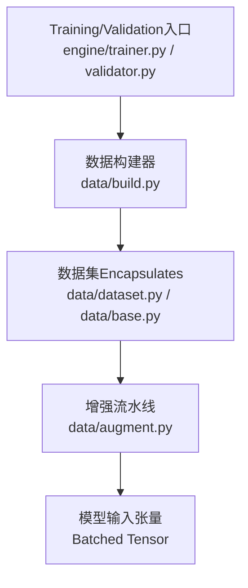
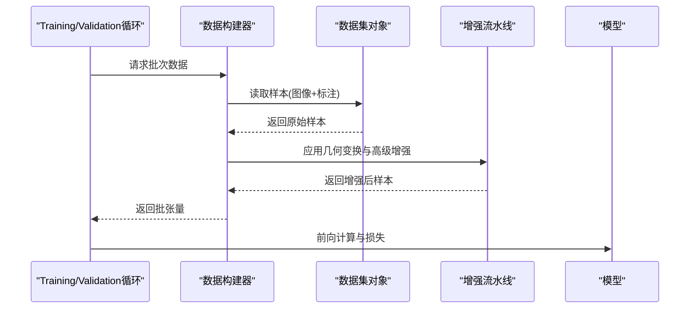
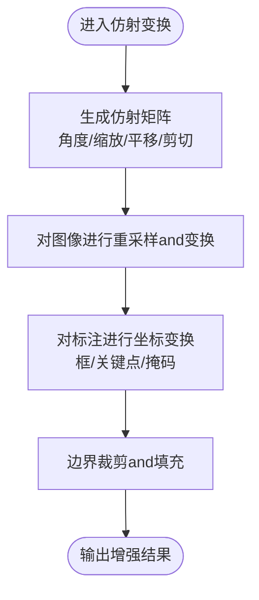
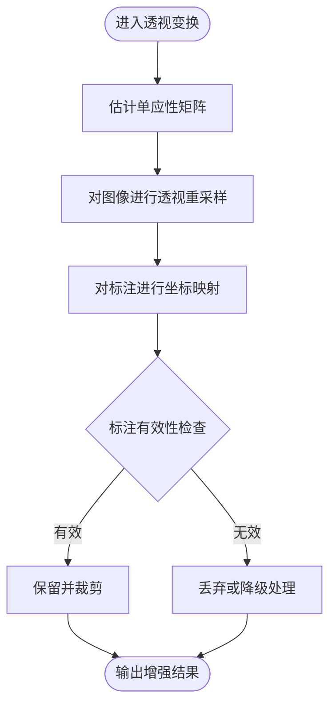
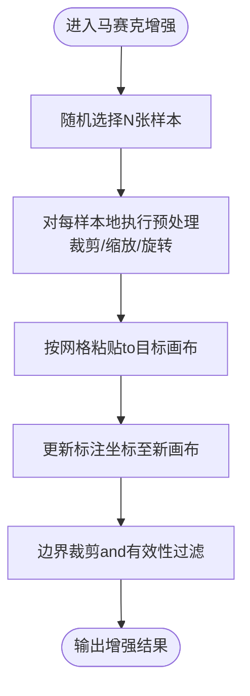
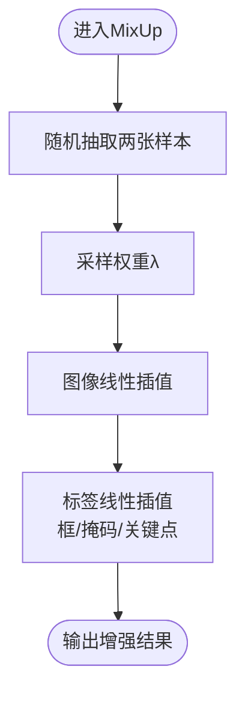
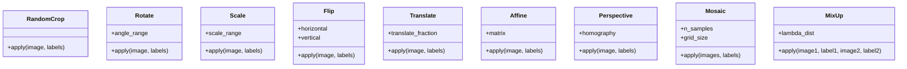
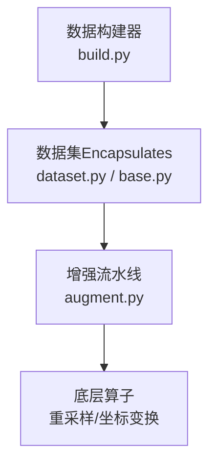

# 几何变换增强

<cite>
**Files Referenced in This Document**
- [augment.py](file://ultralytics/data/augment.py)
- [base.py](file://ultralytics/data/base.py)
- [dataset.py](file://ultralytics/data/dataset.py)
- [build.py](file://ultralytics/data/build.py)
- [yolo-data-augmentation.md](file://docs/en/guides/yolo-data-augmentation.md)
</cite>

## Table of Contents
1. [Introduction](#Introduction)
2. [Project Structure](#Project Structure)
3. [Core Components](#Core Components)
4. [Architecture Overview](#Architecture Overview)
5. [Detailed Component Analysis](#Detailed Component Analysis)
6. [Dependency Analysis](#Dependency Analysis)
7. [性能考量](#性能考量)
8. [Troubleshooting Guide](#Troubleshooting Guide)
9. [Conclusion](#Conclusion)
10. [Appendix](#Appendix)

## Introduction
本技术Documentation聚焦于YOLO-Master的几何变换增强capabilities，系统梳理随机裁剪、旋转、缩放、翻转、平移etc.基础几何变换，深入解析仿射变换（Affine）的参数控制andimplementing原理，阐述透视变换（Perspective）whileObject Detection中的Applicable Scenarios，解释马赛克增强（Mosaic）的算法流程and数据融合机制，并说明Mixture增强（MixUp）的数学原理and其对Gradient传播的影响。Documentation同时provides参数配置Examples、效果对比思路、性能影响分析and针对不同Tasks（检测、分割、Pose Estimation）的策略建议，帮助读者while实际工程中高效Usesand调优。

## Project Structure
几何变换增强主要位于Data processing管线中，关键位置such as下：
- 增强算子定义and组合：ultralytics/data/augment.py
- 数据集基类and加载流程：ultralytics/data/base.py、ultralytics/data/dataset.py
- 构建器and流水线装配：ultralytics/data/build.py
- 官方增强Documentationand用法Refer to：docs/en/guides/yolo-data-augmentation.md

Figure Source
- [build.py](file://ultralytics/data/build.py)
- [dataset.py](file://ultralytics/data/dataset.py)
- [base.py](file://ultralytics/data/base.py)
- [augment.py](file://ultralytics/data/augment.py)

Section Source
- [augment.py](file://ultralytics/data/augment.py)
- [base.py](file://ultralytics/data/base.py)
- [dataset.py](file://ultralytics/data/dataset.py)
- [build.py](file://ultralytics/data/build.py)

## Core Components
- 基础几何变换
  - 随机裁剪（RandomCrop）：while图像内随机选择子区域进行裁剪，常用于提升小目标鲁棒性and定位精度。
  - 旋转（Rotate）：围绕中心或指定点旋转图像，Combined with边界处理策略保持标注一致性。
  - 缩放（Scale）：按比例放大或缩小图像，改变目标尺度分布，有助于多尺度学习。
  - 翻转（Flip）：水平/垂直翻转，增加对称性不变性，提高泛化capabilities。
  - 平移（Translate）：沿X/Y方向平移图像，模拟相机位移，增强位置鲁棒性。
- 复合几何变换
  - 仿射变换（Affine）：由旋转、缩放、平移、剪切etc.线性变换组合而成，Via矩阵形式统一描述，便于批量计算and可微Optimization。
  - 透视变换（Perspective）：引入非线性的投影变化，用于模拟相机视角变化and平面外运动，适用于复杂场景下的检测and分割。
- 高级增强
  - 马赛克增强（Mosaic）：将多张样本拼接成一张大图，融合上下文信息，显著提升小目标召回and检测稳定性。
  - Mixture增强（MixUp）：按权重线性插值两张样本的图像and标签，平滑决策边界，改善泛化and校准。

Section Source
- [augment.py](file://ultralytics/data/augment.py)
- [yolo-data-augmentation.md](file://docs/en/guides/yolo-data-augmentation.md)

## Architecture Overview
下图展示了从Data Loadingto增强的端to端流程，Centered onand各组件之间的Calls关系。

Figure Source
- [build.py](file://ultralytics/data/build.py)
- [dataset.py](file://ultralytics/data/dataset.py)
- [augment.py](file://ultralytics/data/augment.py)

## Detailed Component Analysis

### 仿射变换（Affine）
- implementing原理
  - 仿射变换由一个2x3或3x3齐次矩阵表示，包含旋转、缩放、平移and剪切etc.线性操作。
  - while批量处理中，通常Centered on张量形式对整批图像and标注同时进行坐标映射，保证效率and一致性。
  - 对于标注框、关键点、掩码etc.，需分别进行坐标变换and边界裁剪，确保and图像空间一致。
- 参数控制
  - 角度范围：控制旋转幅度，避免过度旋转导致目标不可见。
  - 缩放范围：控制缩放比例，兼顾多尺度覆盖and分辨率限制。
  - 平移范围：控制相对图像的偏移比例，防止目标移出画面。
  - 剪切强度：控制形变程度，适度引入非线性外观变化。
  - 填充策略：对超出边界的像素采用常数、镜像或边缘填充，减少伪影。
- 复杂度and性能
  - 时间复杂度and图像尺寸和批大小线性相关；GPU并行下吞吐较高。
  - 内存占用受输出分辨率and批大小影响，建议Combining动态形状and缓存策略。
- Applicable Scenarios
  - 通用Object Detection、分割、Pose Estimation的强鲁棒性增强。
  - 需要严格保持几何一致性的Tasks（such as关键点、实例掩码）。

Figure Source
- [augment.py](file://ultralytics/data/augment.py)

Section Source
- [augment.py](file://ultralytics/data/augment.py)

### 透视变换（Perspective）
- 应用场景
  - 模拟相机倾斜、俯仰and平面外运动，增强对视角变化的鲁棒性。
  - 适用于复杂背景、道路场景、航拍etc.具有明显透视效应的Tasks。
- implementing要点
  - Via四个角点的映射建立单应性矩阵，对图像and标注进行重采样and坐标变换。
  - 注意标注的可见性判断and裁剪，避免产生无效或越界标注。
- 风险and权衡
  - 过度透视可能导致目标严重变形，降低检测and分割质量。
  - 建议and仿射变换组合Uses，控制整体形变幅度。

Figure Source
- [augment.py](file://ultralytics/data/augment.py)

Section Source
- [augment.py](file://ultralytics/data/augment.py)

### 马赛克增强（Mosaic）
- 算法流程
  - 随机选取多张样本（通常for4张），按网格布局拼接for一张大图。
  - 对每张子图进行随机裁剪、缩放、旋转etc.预处理，再拼接to目标画布。
  - 更新所有标注的坐标至新画布空间，并进行边界裁剪and去重。
- 数据融合机制
  - Via拼接引入跨样本上下文，丰富背景多样性and小目标密度。
  - 标注合并时需考虑重叠and重复检测，避免误报。
- 适用Tasks
  - Object Detection：显著提升小目标召回and整体mAP。
  - Instance Segmentation：需注意掩码拼接and边界对齐。
  - Pose Estimation：关键点坐标需同步变换and裁剪。

Figure Source
- [augment.py](file://ultralytics/data/augment.py)

Section Source
- [augment.py](file://ultralytics/data/augment.py)

### Mixture增强（MixUp）
- 数学原理
  - 对两张样本的图像and标签按权重λ进行线性插值：I_mix = λ·I1 + (1-λ)·I2，Y_mix = λ·Y1 + (1-λ)·Y2。
  - 标签插值方式因Tasks而异：检测常用框and类别概率加权，分割用掩码加权，Pose Estimation用关键点坐标加权。
- Gradient传播特性
  - 由于标签连续化，Loss Function对Prediction的Gradient更平滑，有助于缓解过拟合and数值不稳定。
  - 可能降低分类置信度峰值，但提升校准and泛化capabilities。
- 实践建议
  - 设置合理的λ分布（such asBeta分布），避免极端权重。
  - and几何变换组合Uses时，先进行几何变换再进行MixUp，保证空间一致性。

Figure Source
- [augment.py](file://ultralytics/data/augment.py)

Section Source
- [augment.py](file://ultralytics/data/augment.py)

### 基础几何变换（RandomCrop/Rotate/Scale/Flip/Translate）
- 随机裁剪（RandomCrop）
  - 随机选择子区域，调整标注坐标并裁剪，适合提升小目标定位capabilities。
- 旋转（Rotate）
  - 围绕中心或指定点旋转，Combined with填充策略保持边界完整性。
- 缩放（Scale）
  - 按比例缩放图像and标注，增强多尺度鲁棒性。
- 翻转（Flip）
  - 水平/垂直翻转，简单而有效的数据扩充手段。
- 平移（Translate）
  - 沿X/Y方向平移，模拟相机位移，提升位置鲁棒性。

Figure Source
- [augment.py](file://ultralytics/data/augment.py)

Section Source
- [augment.py](file://ultralytics/data/augment.py)

## Dependency Analysis
- 组件耦合
  - 增强流水线（augment.py）依赖数据集对象（dataset.py/base.py）provides的图像and标注格式。
  - 构建器（build.py）负责组装Data Pipelineand增强策略，协调批处理and设备放置。
- External Dependencies
  - 图像处理库（such asOpenCV、PIL）and张量运算库（PyTorch）用于重采样and坐标变换。
- Potential Cycles依赖
  - 增强Modules应避免反向引用数据集构建逻辑，保持单向依赖。

Figure Source
- [build.py](file://ultralytics/data/build.py)
- [dataset.py](file://ultralytics/data/dataset.py)
- [base.py](file://ultralytics/data/base.py)
- [augment.py](file://ultralytics/data/augment.py)

Section Source
- [build.py](file://ultralytics/data/build.py)
- [dataset.py](file://ultralytics/data/dataset.py)
- [base.py](file://ultralytics/data/base.py)
- [augment.py](file://ultralytics/data/augment.py)

## 性能考量
- 计算开销
  - 仿射and透视变换涉and重采样，GPU并行下吞吐较高，但高分辨率and大批次会显著增加显存占用。
  - 马赛克增强拼接多张样本，内存andIO压力较大，建议Set appropriatelybatch sizeand线程数。
- I/Obottlenecks
  - 大量随机读取and拼接会增加磁盘I/O，Recommended to use缓存and预取策略。
- 数值稳定性
  - 坐标变换and边界裁剪需保证数值稳定，避免NaN/Inf传播。
- 调优建议
  - 根据Tasksand硬件资源调整增强强度and频率，优先启用收益高且开销低的变换（such as翻转、随机裁剪）。
  - 对MosaicandMixUp进行消融实验，Evaluation其对mAPandTraining时长的影响。

[This section provides general guidance and does not directly analyze specific files]

## Troubleshooting Guide
- 标注越界或缺失
  - 检查仿射/透视变换后的边界裁剪逻辑，确保标注有效性过滤正确。
- 掩码错位或不完整
  - 确认掩码and图像同空间变换，边界处填充策略一致。
- 关键点漂移
  - Pose Estimation的关键点需and图像同步变换，注意人体遮挡and可见性标记。
- Training不稳定
  - 调整MixUp权重分布and增强强度，避免过度平滑导致收敛缓慢。
- 性能退化
  - 降低高分辨率增强频率，或Uses渐进式分辨率Training。

Section Source
- [augment.py](file://ultralytics/data/augment.py)

## Conclusion
YOLO-Master的几何变换增强体系覆盖了从基础几何to高级融合的全谱系capabilities。仿射and透视变换provides强大的几何建模，马赛克andMixUp则while数据层面引入丰富的上下文and平滑性。实际应用中，应根据Tasks特性and资源约束选择合适的增强组合，并Via消融实验andVisualization对比持续Optimization。

[This section is summary content and does not directly analyze specific files]

## Appendix

### 参数配置Examples（路径指引）
- 仿射变换参数
  - 角度范围、缩放范围、平移比例、剪切强度、填充策略
  - Refer to路径：[augment.py](file://ultralytics/data/augment.py)
- 透视变换参数
  - 单应性矩阵估计方法、角点扰动范围、有效性阈值
  - Refer to路径：[augment.py](file://ultralytics/data/augment.py)
- 马赛克增强参数
  - 样本数量、网格尺寸、子图预处理强度
  - Refer to路径：[augment.py](file://ultralytics/data/augment.py)
- Mixture增强参数
  - 权重分布（such asBeta分布参数）、插值顺序
  - Refer to路径：[augment.py](file://ultralytics/data/augment.py)

Section Source
- [augment.py](file://ultralytics/data/augment.py)

### 效果对比图（制作建议）
- 对比维度
  - 原图 vs 仿射变换 vs 透视变换 vs 马赛克 vs MixUp
- Metrics建议
  - 检测：mAP@0.5、小目标mAP
  - 分割：mIoU、边界F1
  - Pose Estimation：AP、关节点误差
- Visualization要点
  - 标注框/掩码/关键点叠加显示，突出变换前后差异

[本节for概念性指导，不直接分析具体文件]

### 不同Tasks的几何变换策略建议
- Object Detection
  - 推荐：随机裁剪、仿射变换、马赛克增强
  - 谨慎：透视变换（避免过度形变）
- Instance Segmentation
  - 推荐：仿射变换、马赛克增强（注意掩码对齐）
  - 谨慎：透视变换（掩码边界易失真）
- Pose Estimation
  - 推荐：仿射变换、随机裁剪、轻微透视
  - 谨慎：大角度旋转and强透视（关键点可见性受影响）

[本节for概念性指导，不直接分析具体文件]