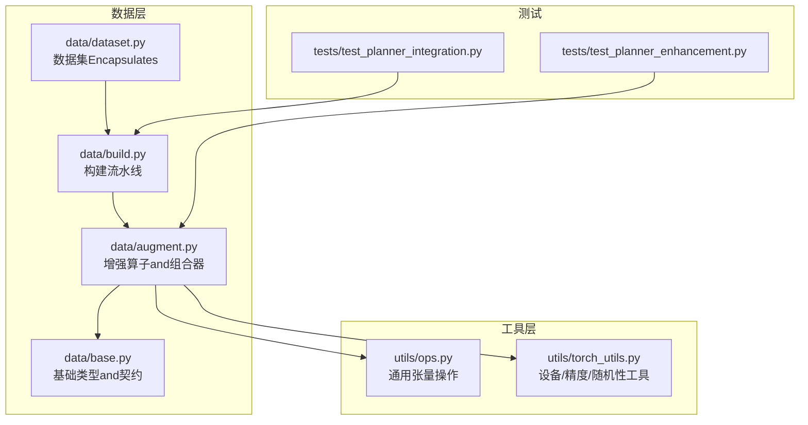
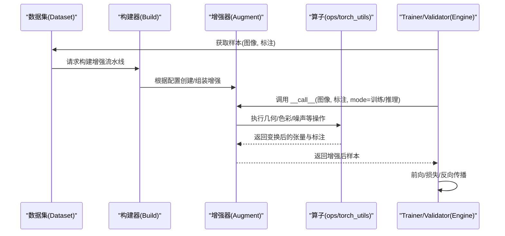
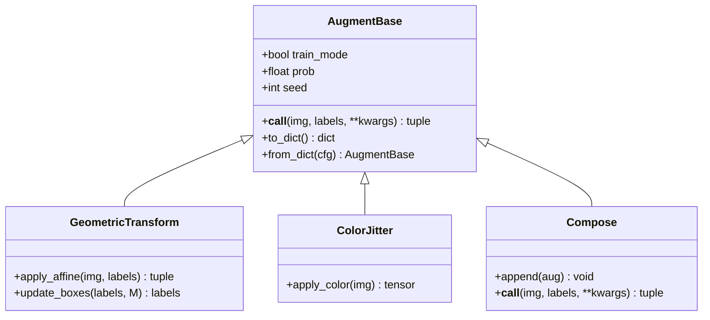
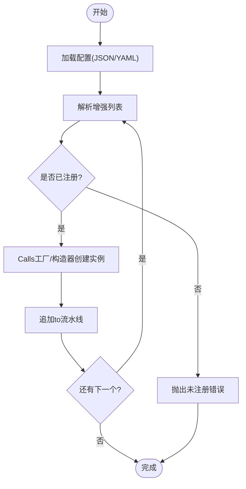
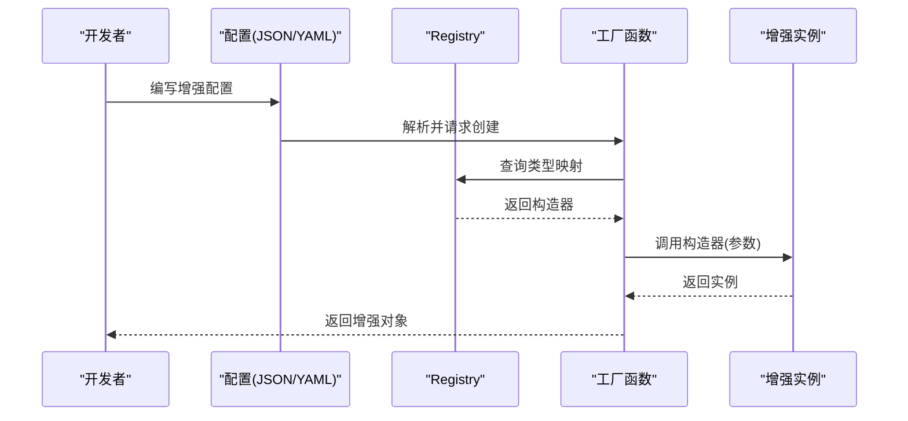
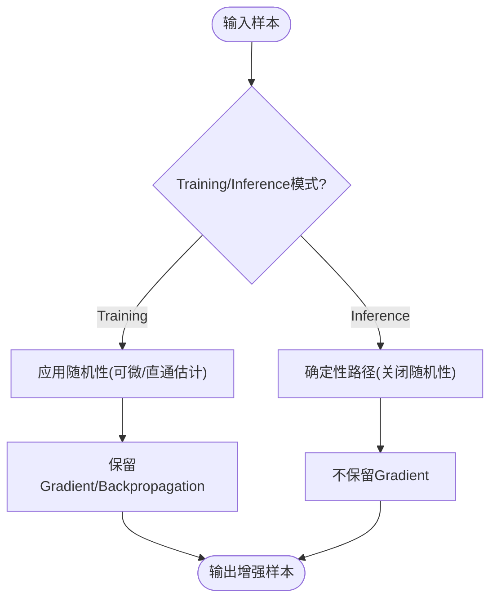
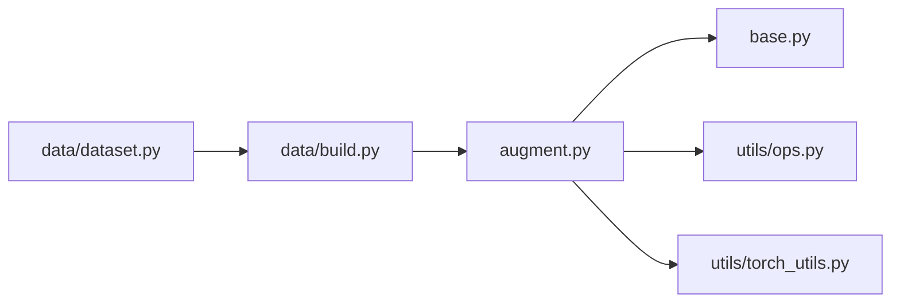

# 自定义增强开发

<cite>
**Files Referenced in This Document**
- [ultralytics/data/augment.py](file://ultralytics/data/augment.py)
- [ultralytics/data/base.py](file://ultralytics/data/base.py)
- [ultralytics/data/build.py](file://ultralytics/data/build.py)
- [ultralytics/data/dataset.py](file://ultralytics/data/dataset.py)
- [ultralytics/data/__init__.py](file://ultralytics/data/__init__.py)
- [ultralytics/utils/ops.py](file://ultralytics/utils/ops.py)
- [ultralytics/utils/torch_utils.py](file://ultralytics/utils/torch_utils.py)
- [tests/test_planner_enhancement.py](file://tests/test_planner_enhancement.py)
- [tests/test_planner_integration.py](file://tests/test_planner_integration.py)
</cite>

## Table of Contents
1. [Introduction](#Introduction)
2. [Project Structure](#Project Structure)
3. [Core Components](#Core Components)
4. [Architecture Overview](#Architecture Overview)
5. [Detailed Component Analysis](#Detailed Component Analysis)
6. [Dependency Analysis](#Dependency Analysis)
7. [Performance Considerations](#Performance Considerations)
8. [Troubleshooting Guide](#Troubleshooting Guide)
9. [Conclusion](#Conclusion)
10. [Appendix](#Appendix)

## Introduction
本指南targeting希望while YOLO-Master 中扩展Data Augmentation的开发者，围绕“自定义增强”的接口规范、基类设计、注册and发现机制、参数序列化、可微分性andGradient传播、单元测试and质量Evaluation、调试工具and常见问题进行系统化说明。DocumentationCentered on代码仓库中的增强implementingfor依据，provides从简单几何变换to复杂Multimodal增强的完整开发路径and最佳实践。

## Project Structure
YOLO-Master 的Data Augmentation相关代码集中while data 子包中，核心包括：
- 增强算子and组合器定义（augment.py）
- Data Loadingand构建流程（build.py、dataset.py）
- 基础类型and契约（base.py）
- 公共算子and张量操作（utils/ops.py）
- Training/Validation管线集成点（engine/trainer.py、engine/validator.py etc.）

Figure Source
- [ultralytics/data/augment.py](file://ultralytics/data/augment.py)
- [ultralytics/data/base.py](file://ultralytics/data/base.py)
- [ultralytics/data/build.py](file://ultralytics/data/build.py)
- [ultralytics/data/dataset.py](file://ultralytics/data/dataset.py)
- [ultralytics/utils/ops.py](file://ultralytics/utils/ops.py)
- [ultralytics/utils/torch_utils.py](file://ultralytics/utils/torch_utils.py)
- [tests/test_planner_enhancement.py](file://tests/test_planner_enhancement.py)
- [tests/test_planner_integration.py](file://tests/test_planner_integration.py)

Section Source
- [ultralytics/data/augment.py](file://ultralytics/data/augment.py)
- [ultralytics/data/base.py](file://ultralytics/data/base.py)
- [ultralytics/data/build.py](file://ultralytics/data/build.py)
- [ultralytics/data/dataset.py](file://ultralytics/data/dataset.py)
- [ultralytics/utils/ops.py](file://ultralytics/utils/ops.py)
- [ultralytics/utils/torch_utils.py](file://ultralytics/utils/torch_utils.py)
- [tests/test_planner_enhancement.py](file://tests/test_planner_enhancement.py)
- [tests/test_planner_integration.py](file://tests/test_planner_integration.py)

## Core Components
- 增强算子基类and契约
  - 所有增强应遵循统一的输入输出契约：输入for图像and标注元组的批次，输出for同构结构的变换结果；SupportingwhileTraining模式下启用随机性，whileInference模式下保持确定性。
  - __call__ 方法需保证：
    - 输入校验and形状广播
    - 标注一致性更新（框、关键点、掩码、类别etc.）
    - 可微分支保留Gradient（若需要）
    - 状态管理（such as随机种子、概率开关、内部缓存）
- 组合器and流水线
  - 组合器负责将多个增强按顺序或条件执行，并维护整体随机状态and批内一致性。
- 构建and注册
  - Via工厂函数或装饰器将自定义增强注册to全局映射表，供配置解析时动态实例化。
- 参数序列化
  - 增强类需provides to_dict/from_dict 或etc.价接口，确保 JSON/YAML 配置可被正确反序列化for增强实例。
- 可微分性
  - 对需要Gradient的增强（such as可微仿射、颜色抖动），Uses torch 原生算子并保持计算图连通；对不可微部分（such as离散采样）应whileTraining/Inference模式间切换或Uses直通估计器。

Section Source
- [ultralytics/data/augment.py](file://ultralytics/data/augment.py)
- [ultralytics/data/base.py](file://ultralytics/data/base.py)
- [ultralytics/data/build.py](file://ultralytics/data/build.py)
- [ultralytics/data/dataset.py](file://ultralytics/data/dataset.py)
- [ultralytics/utils/ops.py](file://ultralytics/utils/ops.py)
- [ultralytics/utils/torch_utils.py](file://ultralytics/utils/torch_utils.py)

## Architecture Overview
下图展示了增强whileData LoadingandTraining/Validation管线中的位置and交互关系。

Figure Source
- [ultralytics/data/dataset.py](file://ultralytics/data/dataset.py)
- [ultralytics/data/build.py](file://ultralytics/data/build.py)
- [ultralytics/data/augment.py](file://ultralytics/data/augment.py)
- [ultralytics/utils/ops.py](file://ultralytics/utils/ops.py)
- [ultralytics/utils/torch_utils.py](file://ultralytics/utils/torch_utils.py)

## Detailed Component Analysis

### 增强基类and __call__ 契约
- 输入约定
  - 图像：通常for NCHW 或 NHWC 的浮点张量，范围归一化至 [0,1] 或 [-1,1]（由具体增强决定）。
  - 标注：包含边界框、类别、关键点、掩码etc.字段，维度and图像批次对齐。
- 输出约定
  - and输入同构的 (图像, 标注) 元组；批维保持一致；标注字段需随几何变换同步更新。
- 状态管理
  - 随机种子、概率阈值、内部缓存（such as中间矩阵）需while __init__ 初始化并while __call__ 中安全读取/写入。
- 可微分支
  - 若增强参andBackpropagation，必须Uses可微算子并保持Gradient流；否则whileTraining模式下禁用Gradient或采用直通估计。

Figure Source
- [ultralytics/data/augment.py](file://ultralytics/data/augment.py)
- [ultralytics/data/base.py](file://ultralytics/data/base.py)

Section Source
- [ultralytics/data/augment.py](file://ultralytics/data/augment.py)
- [ultralytics/data/base.py](file://ultralytics/data/base.py)

### 注册and发现机制
- 装饰器注册
  - Via装饰器将自定义增强类名映射to构造器，便于配置drivers are installed实例化。
- 工厂函数
  - Unified entry point根据配置字典查找已注册的增强类型并创建实例。
- 配置文件集成
  - YAML/JSON 中声明增强名称and参数，构建器解析后自动装配流水线。

Figure Source
- [ultralytics/data/build.py](file://ultralytics/data/build.py)
- [ultralytics/data/augment.py](file://ultralytics/data/augment.py)

Section Source
- [ultralytics/data/build.py](file://ultralytics/data/build.py)
- [ultralytics/data/augment.py](file://ultralytics/data/augment.py)

### 参数序列化and反序列化
- 序列化
  - 将增强类的超参数字典化，确保键名and默认值一致，避免运行时歧义。
- 反序列化
  - 工厂函数依据类型名查找Registry，传入参数字典构造实例。
- 兼容性
  - 新增字段需设置默认值；废弃字段需兼容旧配置。

Figure Source
- [ultralytics/data/build.py](file://ultralytics/data/build.py)
- [ultralytics/data/augment.py](file://ultralytics/data/augment.py)

Section Source
- [ultralytics/data/build.py](file://ultralytics/data/build.py)
- [ultralytics/data/augment.py](file://ultralytics/data/augment.py)

### 可微分性andGradient传播
- 可微增强
  - Uses torch 原生算子（such as仿射变换、插值、颜色空间转换）Centered on保持Gradient。
- 不可微增强
  - 离散选择（such as随机裁剪索引）whileTraining模式下可Via直通估计或停止Gradient策略处理。
- 模式切换
  - Training模式允许随机性andGradient；Inference模式关闭随机性并Optimization路径。

Figure Source
- [ultralytics/data/augment.py](file://ultralytics/data/augment.py)
- [ultralytics/utils/torch_utils.py](file://ultralytics/utils/torch_utils.py)

Section Source
- [ultralytics/data/augment.py](file://ultralytics/data/augment.py)
- [ultralytics/utils/torch_utils.py](file://ultralytics/utils/torch_utils.py)

### 自定义增强开发Examples

#### Examples一：简单几何变换（仿射+旋转）
- 步骤
  - 继承增强基类，implementing __call__ and标注更新逻辑。
  - Uses utils/ops provides的仿射矩阵and坐标变换工具。
  - while to_dict/from_dict 中暴露角度、缩放、平移etc.参数。
- 关键要点
  - 批维一致性；标注框and关键点同步更新；随机种子可控。

Section Source
- [ultralytics/data/augment.py](file://ultralytics/data/augment.py)
- [ultralytics/utils/ops.py](file://ultralytics/utils/ops.py)

#### Examples二：复杂Multimodal增强（图像+文本Tips）
- 步骤
  - while __call__ 中同时处理图像and文本Tips（such as随机替换同义词、扰动描述）。
  - 保持文本and图像的对应关系；必要时引入可微文本嵌入扰动。
- 关键要点
  - Multimodal一致性；文本扰动不影响图像标注；可微嵌入需稳定Gradient。

Section Source
- [ultralytics/data/augment.py](file://ultralytics/data/augment.py)

#### Examples三：组合增强流水线
- 步骤
  - Uses组合器串联多个增强；按概率或条件分支执行。
  - while组合器中维护整体随机状态，确保批内一致性。
- 关键要点
  - 顺序敏感；概率控制；可配置化。

Section Source
- [ultralytics/data/augment.py](file://ultralytics/data/augment.py)

### 单元测试编写方法and质量Evaluation标准
- 单元覆盖
  - 形状and类型断言；标注一致性检查；随机性可复现性Validation。
- 回归测试
  - 固定种子下对比前后版本输出差异；数值稳定性检验。
- 性能基准
  - 单步耗时、内存占用、GPU利用率；批量规模变化下的吞吐。
- Refer to用例
  - Refer to现有增强测试文件组织方式and断言风格。

Section Source
- [tests/test_planner_enhancement.py](file://tests/test_planner_enhancement.py)
- [tests/test_planner_integration.py](file://tests/test_planner_integration.py)

### 调试工具and常见问题
- 调试建议
  - 打印中间张量形状and统计量；Visualization变换前后图像and标注；记录随机种子。
- 常见问题
  - 标注越界：检查仿射矩阵and坐标变换公式；边界裁剪策略。
  - Gradient消失：确认可微路径未被 stop_gradient 阻断；检查数据类型and范围。
  - 配置解析失败：核对Registry键名and参数默认值；确保 JSON/YAML 格式正确。

Section Source
- [ultralytics/data/augment.py](file://ultralytics/data/augment.py)
- [ultralytics/data/build.py](file://ultralytics/data/build.py)

## Dependency Analysis
增强Modules依赖关系such as下：

Figure Source
- [ultralytics/data/augment.py](file://ultralytics/data/augment.py)
- [ultralytics/data/base.py](file://ultralytics/data/base.py)
- [ultralytics/data/build.py](file://ultralytics/data/build.py)
- [ultralytics/data/dataset.py](file://ultralytics/data/dataset.py)
- [ultralytics/utils/ops.py](file://ultralytics/utils/ops.py)
- [ultralytics/utils/torch_utils.py](file://ultralytics/utils/torch_utils.py)

Section Source
- [ultralytics/data/augment.py](file://ultralytics/data/augment.py)
- [ultralytics/data/base.py](file://ultralytics/data/base.py)
- [ultralytics/data/build.py](file://ultralytics/data/build.py)
- [ultralytics/data/dataset.py](file://ultralytics/data/dataset.py)
- [ultralytics/utils/ops.py](file://ultralytics/utils/ops.py)
- [ultralytics/utils/torch_utils.py](file://ultralytics/utils/torch_utils.py)

## Performance Considerations
- 向量化计算
  - Prefer batched 张量操作，避免 Python 循环；利用 ops provides的批量仿射and插值。
- 内存管理
  - 复用中间缓冲区；and时释放临时张量；注意 dtype and device 一致性。
- 并行处理
  - Combining DataLoader 的多进程预取；while GPU 上执行增强Centered on减少拷贝开销。
- 随机性控制
  - Set appropriately种子and概率，避免不必要的重计算；whileInference模式关闭随机性Centered on提升吞吐。

[本节for通用指导，无需特定文件引用]

## Troubleshooting Guide
- 常见错误定位
  - Registry缺失：检查装饰器是否正确注册；工厂函数是否能找to类型映射。
  - 标注不一致：Validation几何变换对框、关键点、掩码的更新逻辑；边界处理策略。
  - Gradient异常：检查可微分支是否被中断；dtype and范围是否符合模型期望。
- 诊断手段
  - 启用LoggingandVisualization；固定种子复现实例；逐步注释增强块定位问题。

Section Source
- [ultralytics/data/build.py](file://ultralytics/data/build.py)
- [ultralytics/data/augment.py](file://ultralytics/data/augment.py)

## Conclusion
Via遵循统一的增强基类契约、完善的注册and序列化机制、严谨的可微分设计and测试体系，开发者可Centered on高效地while YOLO-Master 中扩展自定义增强。Combining向量化、内存and并行Optimization，可while保证质量显著提升TrainingandInference效率。

[本节for总结性内容，无需特定文件引用]

## Appendix
- 快速上手清单
  - 定义增强类并implementing __call__/to_dict/from_dict
  - Uses装饰器注册to全局映射
  - while YAML/JSON 中声明增强and参数
  - 编写单元测试and性能基准
  - whileTraining/Validation管线中集成并Validation

[本节for补充信息，无需特定文件引用]