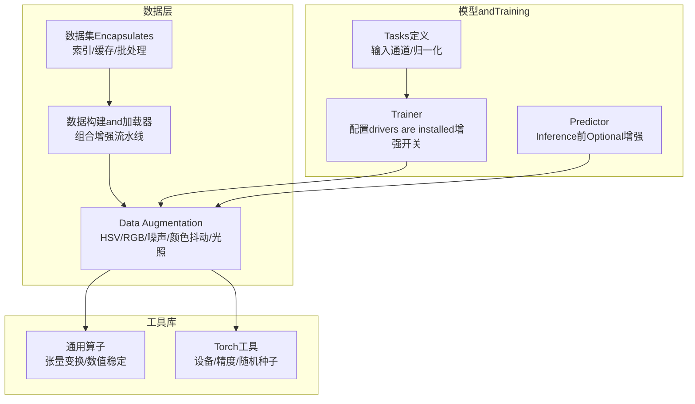
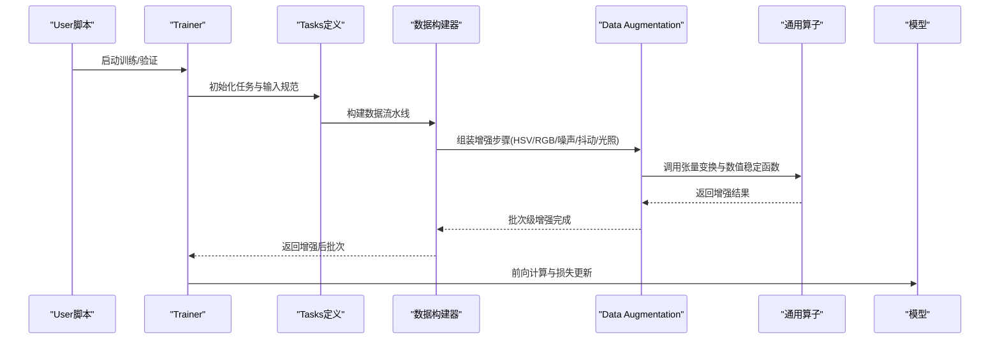
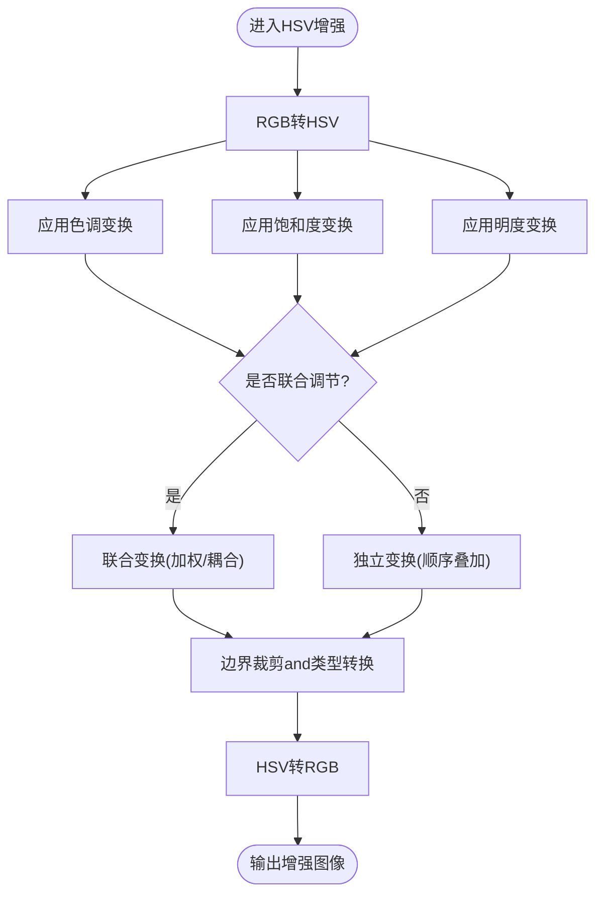
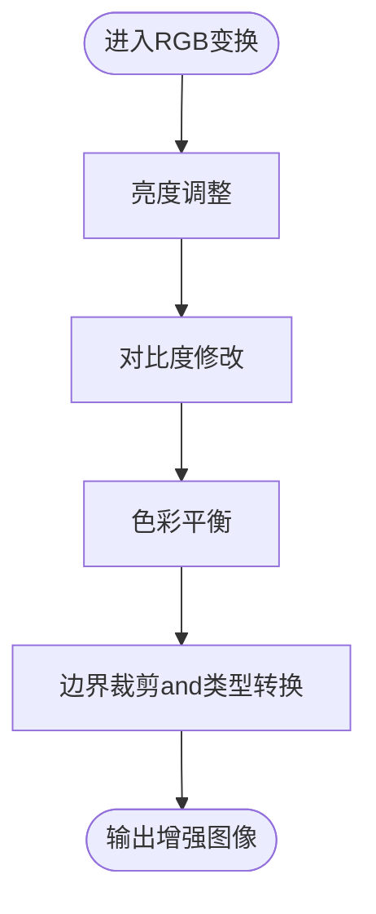
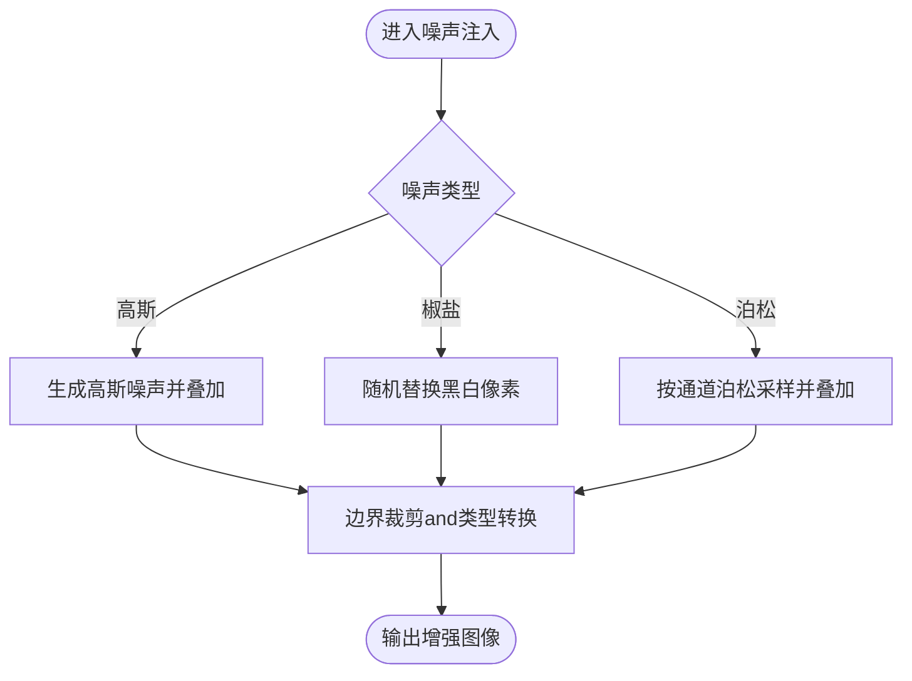
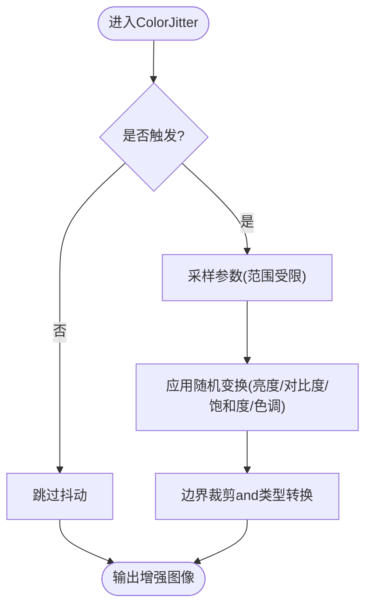
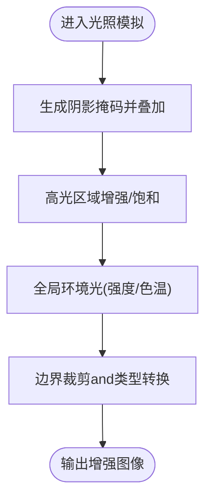
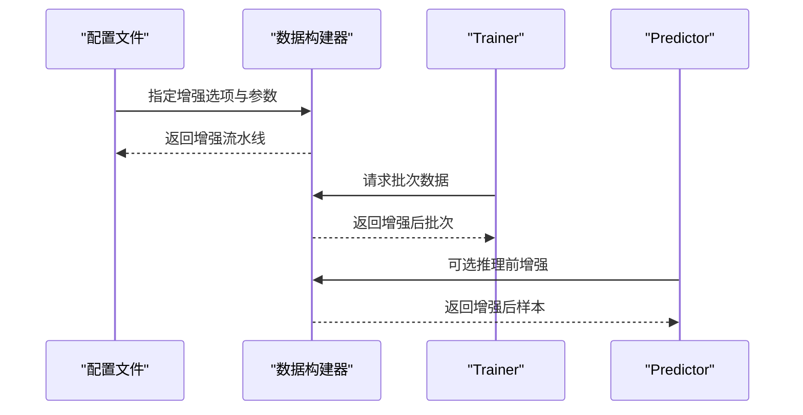
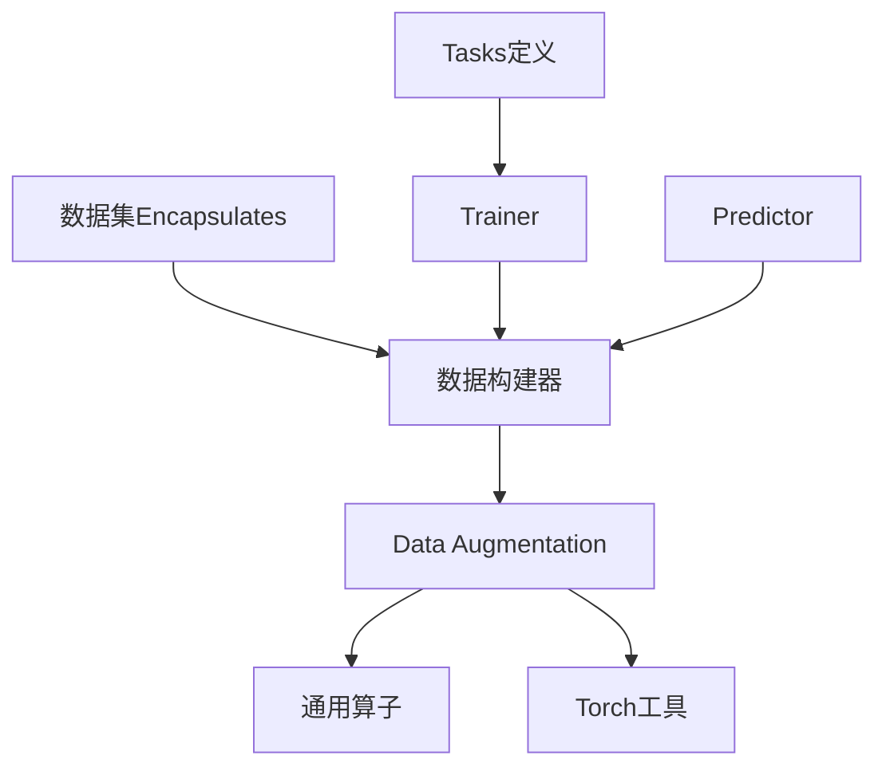

# 颜色空间增强

<cite>
**Files Referenced in This Document**
- [ultralytics/data/augment.py](file://ultralytics/data/augment.py)
- [ultralytics/data/base.py](file://ultralytics/data/base.py)
- [ultralytics/data/build.py](file://ultralytics/data/build.py)
- [ultralytics/data/dataset.py](file://ultralytics/data/dataset.py)
- [ultralytics/data/loaders.py](file://ultralytics/data/loaders.py)
- [ultralytics/data/utils.py](file://ultralytics/data/utils.py)
- [ultralytics/nn/tasks.py](file://ultralytics/nn/tasks.py)
- [ultralytics/engine/trainer.py](file://ultralytics/engine/trainer.py)
- [ultralytics/engine/predictor.py](file://ultralytics/engine/predictor.py)
- [ultralytics/utils/__init__.py](file://ultralytics/utils/__init__.py)
- [ultralytics/utils/ops.py](file://ultralytics/utils/ops.py)
- [ultralytics/utils/torch_utils.py](file://ultralytics/utils/torch_utils.py)
- [docs/en/guides/yolo-data-augmentation.md](file://docs/en/guides/yolo-data-augmentation.md)
</cite>

## Table of Contents
1. [Introduction](#Introduction)
2. [Project Structure](#Project Structure)
3. [Core Components](#Core Components)
4. [Architecture Overview](#Architecture Overview)
5. [Detailed Component Analysis](#Detailed Component Analysis)
6. [Dependency Analysis](#Dependency Analysis)
7. [性能考量](#性能考量)
8. [Troubleshooting Guide](#Troubleshooting Guide)
9. [Conclusion](#Conclusion)
10. [Appendix](#Appendix)

## Introduction
本技术Documentation聚焦于YOLO-Master的颜色空间增强capabilities，系统阐述HSVandRGB空间的变换方法、噪声注入策略、颜色抖动（ColorJitter）的随机化机制、光照变化模拟（阴影、高光、环境光），Centered onandwhile不同数据集上的效果对比and调优建议。同时provides对模型鲁棒性的量化分析and最佳实践，帮助读者whileTrainingandInference阶段稳定地提升模型对颜色and光照变化的泛化capabilities。

## Project Structure
颜色增强相关代码主要位于Data Loadingand预处理管线中，贯穿从数据构建、图像增强toTraining/Inference流程：
- Data Augmentationimplementing集中while数据Modules，负责HSV/RGB变换、噪声、颜色抖动、光照模拟etc.。
- 数据构建and加载器负责将增强算子组合for可复现的流水线。
- TasksandTrainerwhile配置drivers are installed下启用或调整增强策略。
- 工具库provides通用张量操作and数值稳定性保障。

Figure Source
- [ultralytics/data/augment.py](file://ultralytics/data/augment.py)
- [ultralytics/data/build.py](file://ultralytics/data/build.py)
- [ultralytics/data/dataset.py](file://ultralytics/data/dataset.py)
- [ultralytics/nn/tasks.py](file://ultralytics/nn/tasks.py)
- [ultralytics/engine/trainer.py](file://ultralytics/engine/trainer.py)
- [ultralytics/utils/ops.py](file://ultralytics/utils/ops.py)
- [ultralytics/utils/torch_utils.py](file://ultralytics/utils/torch_utils.py)

Section Source
- [ultralytics/data/augment.py](file://ultralytics/data/augment.py)
- [ultralytics/data/build.py](file://ultralytics/data/build.py)
- [ultralytics/data/dataset.py](file://ultralytics/data/dataset.py)
- [ultralytics/nn/tasks.py](file://ultralytics/nn/tasks.py)
- [ultralytics/engine/trainer.py](file://ultralytics/engine/trainer.py)
- [ultralytics/utils/ops.py](file://ultralytics/utils/ops.py)
- [ultralytics/utils/torch_utils.py](file://ultralytics/utils/torch_utils.py)

## Core Components
- HSV颜色空间增强：Supporting色调（Hue）、饱和度（Saturation）、明度（Value）的独立控制and联合调节，用于模拟色偏、褪色、曝光变化etc.场景。
- RGB颜色空间变换：包括亮度、对比度、色彩平衡etc.，直接作用于三通道Centered on改变整体视觉特征。
- 噪声添加：高斯噪声、椒盐噪声、泊松噪声etc.，用于模拟传感器噪声and低照度条件。
- 颜色抖动（ColorJitter）：随机化策略and参数范围控制，提高模型对颜色分布漂移的鲁棒性。
- 光照变化模拟：阴影生成、高光处理、环境光模拟，覆盖复杂户外and室内光照条件。
- 数据构建andTraining集成：Via配置drivers are installed将上述增强组合for可复现实验的数据流水线。

Section Source
- [ultralytics/data/augment.py](file://ultralytics/data/augment.py)
- [ultralytics/data/build.py](file://ultralytics/data/build.py)
- [ultralytics/data/dataset.py](file://ultralytics/data/dataset.py)
- [ultralytics/nn/tasks.py](file://ultralytics/nn/tasks.py)
- [ultralytics/engine/trainer.py](file://ultralytics/engine/trainer.py)

## Architecture Overview
颜色增强的Calls链从Training/Prediction入口进入，经由Tasksand数据构建器选择并执行增强流水线，最终输出增强后的图像供模型消费。

Figure Source
- [ultralytics/engine/trainer.py](file://ultralytics/engine/trainer.py)
- [ultralytics/nn/tasks.py](file://ultralytics/nn/tasks.py)
- [ultralytics/data/build.py](file://ultralytics/data/build.py)
- [ultralytics/data/augment.py](file://ultralytics/data/augment.py)
- [ultralytics/utils/ops.py](file://ultralytics/utils/ops.py)

## Detailed Component Analysis

### HSV颜色空间增强
- 独立控制：分别对Hue、Saturation、Value施加线性或非线性变换，便于精细调节色相偏移、色彩鲜艳度and曝光强度。
- 联合调节：多通道协同变换，模拟真实世界中的复合光照and白平衡漂移。
- 数值稳定性：while转换前后进行边界裁剪and类型转换，避免溢出andNaN。

Figure Source
- [ultralytics/data/augment.py](file://ultralytics/data/augment.py)
- [ultralytics/utils/ops.py](file://ultralytics/utils/ops.py)

Section Source
- [ultralytics/data/augment.py](file://ultralytics/data/augment.py)
- [ultralytics/utils/ops.py](file://ultralytics/utils/ops.py)

### RGB颜色空间变换
- 亮度调整：对R/G/B通道统一缩放或偏移，模拟曝光变化。
- 对比度修改：基于均值and方差进行线性拉伸，增强细节可见性。
- 色彩平衡：按通道比例调整，校正白平衡偏差。

Figure Source
- [ultralytics/data/augment.py](file://ultralytics/data/augment.py)
- [ultralytics/utils/ops.py](file://ultralytics/utils/ops.py)

Section Source
- [ultralytics/data/augment.py](file://ultralytics/data/augment.py)
- [ultralytics/utils/ops.py](file://ultralytics/utils/ops.py)

### 噪声添加技术
- 高斯噪声：模拟连续传感器噪声，适用于一般成像条件。
- 椒盐噪声：模拟突发像素异常，适用于极端退化场景。
- 泊松噪声：模拟光子计数噪声，适用于低照度and科学成像。

Figure Source
- [ultralytics/data/augment.py](file://ultralytics/data/augment.py)
- [ultralytics/utils/ops.py](file://ultralytics/utils/ops.py)

Section Source
- [ultralytics/data/augment.py](file://ultralytics/data/augment.py)
- [ultralytics/utils/ops.py](file://ultralytics/utils/ops.py)

### 颜色抖动（ColorJitter）
- 随机化策略：whileTraining阶段Centered on概率方式随机应用，参数范围受配置约束，确保多样性and可控性。
- 参数范围控制：各通道扰动幅度、联合权重and随机种子管理，保证实验可复现。
- andHSV/RGB联动：可andHSV/RGB变换组合，形成更丰富的颜色分布。

Figure Source
- [ultralytics/data/augment.py](file://ultralytics/data/augment.py)
- [ultralytics/data/build.py](file://ultralytics/data/build.py)

Section Source
- [ultralytics/data/augment.py](file://ultralytics/data/augment.py)
- [ultralytics/data/build.py](file://ultralytics/data/build.py)

### 光照变化模拟
- 阴影生成：while局部区域降低亮度或引入遮挡掩码，模拟树荫、建筑投影etc.。
- 高光处理：while亮区增加反射或过曝效应，模拟金属反光、水面高光。
- 环境光模拟：全局光照强度and色温调整，模拟日出日落、室内暖光etc.。

Figure Source
- [ultralytics/data/augment.py](file://ultralytics/data/augment.py)
- [ultralytics/utils/ops.py](file://ultralytics/utils/ops.py)

Section Source
- [ultralytics/data/augment.py](file://ultralytics/data/augment.py)
- [ultralytics/utils/ops.py](file://ultralytics/utils/ops.py)

### 数据构建andTraining集成
- 数据构建器根据配置组装增强步骤，形成可复现的流水线。
- Trainerwhile配置drivers are installed下启用/禁用特定增强，Supporting不同Tasks的差异化策略。
- Predictor可whileInference前选择性应用轻量增强Centered on提升鲁棒性。

Figure Source
- [ultralytics/data/build.py](file://ultralytics/data/build.py)
- [ultralytics/engine/trainer.py](file://ultralytics/engine/trainer.py)
- [ultralytics/engine/predictor.py](file://ultralytics/engine/predictor.py)

Section Source
- [ultralytics/data/build.py](file://ultralytics/data/build.py)
- [ultralytics/engine/trainer.py](file://ultralytics/engine/trainer.py)
- [ultralytics/engine/predictor.py](file://ultralytics/engine/predictor.py)

## Dependency Analysis
- Data AugmentationModules依赖通用算子andTorch工具，确保跨设备and精度的数值稳定性。
- 数据构建器and数据集Encapsulates紧密耦合，负责将增强步骤组合for高效流水线。
- Tasks定义andTrainerVia配置drivers are installed增强开关，避免不必要的计算开销。

Figure Source
- [ultralytics/data/augment.py](file://ultralytics/data/augment.py)
- [ultralytics/utils/ops.py](file://ultralytics/utils/ops.py)
- [ultralytics/utils/torch_utils.py](file://ultralytics/utils/torch_utils.py)
- [ultralytics/data/build.py](file://ultralytics/data/build.py)
- [ultralytics/data/dataset.py](file://ultralytics/data/dataset.py)
- [ultralytics/nn/tasks.py](file://ultralytics/nn/tasks.py)
- [ultralytics/engine/trainer.py](file://ultralytics/engine/trainer.py)
- [ultralytics/engine/predictor.py](file://ultralytics/engine/predictor.py)

Section Source
- [ultralytics/data/augment.py](file://ultralytics/data/augment.py)
- [ultralytics/utils/ops.py](file://ultralytics/utils/ops.py)
- [ultralytics/utils/torch_utils.py](file://ultralytics/utils/torch_utils.py)
- [ultralytics/data/build.py](file://ultralytics/data/build.py)
- [ultralytics/data/dataset.py](file://ultralytics/data/dataset.py)
- [ultralytics/nn/tasks.py](file://ultralytics/nn/tasks.py)
- [ultralytics/engine/trainer.py](file://ultralytics/engine/trainer.py)
- [ultralytics/engine/predictor.py](file://ultralytics/engine/predictor.py)

## 性能考量
- 批量并行：whileGPU上执行HSV/RGB变换and噪声注入，利用张量并行减少CPU-GPU传输开销。
- 数值稳定：while关键变换后进行边界裁剪and类型转换，避免溢出andNaN导致的Training不稳定。
- 随机种子：固定随机种子Centered on保证实验可复现，同时while大规模Training中适度打乱顺序Centered on避免模式记忆。
- 流水线Optimization：将多个增强步骤合并Centered on减少中间内存分配，提升吞吐。

[This section provides general guidance and does not directly analyze specific files]

## Troubleshooting Guide
- 颜色异常或过曝：检查HSV/RGB变换的边界裁剪and类型转换是否正确；确认参数范围未超出合理区间。
- Training发散或NaN：检查噪声强度and数据类型，确保while低精度模式下仍保持数值稳定。
- 增强不可复现：确认随机种子设置andData Loading器的确定性选项。
- 性能bottlenecks：Evaluation增强步骤数量and复杂度，考虑whileCPU侧预增强或Uses更高效算子。

Section Source
- [ultralytics/data/augment.py](file://ultralytics/data/augment.py)
- [ultralytics/utils/ops.py](file://ultralytics/utils/ops.py)
- [ultralytics/utils/torch_utils.py](file://ultralytics/utils/torch_utils.py)

## Conclusion
Via系统化的HSV/RGB变换、噪声注入、颜色抖动and光照模拟，YOLO-Master能够whileTrainingandInference阶段显著提升模型对颜色and光照变化的鲁棒性。Combining配置drivers are installed的增强流水线and数值稳定性保障，可while不同数据集上implementing稳定的性能提升and良好的泛化表现。

[This section is summary content and does not directly analyze specific files]

## Appendix
- Uses建议：
  - while户外场景优先启用HSV色调and明度扰动，Combined with阴影and环境光模拟。
  - while低照度场景加入泊松噪声and适度高斯噪声，提升暗态鲁棒性。
  - 对工业检测Tasks谨慎Uses强对比度and色彩平衡，避免破坏关键纹理。
- Refer toDocumentation：
  - Data Augmentation指南andExamples见官方Documentation。

Section Source
- [docs/en/guides/yolo-data-augmentation.md](file://docs/en/guides/yolo-data-augmentation.md)