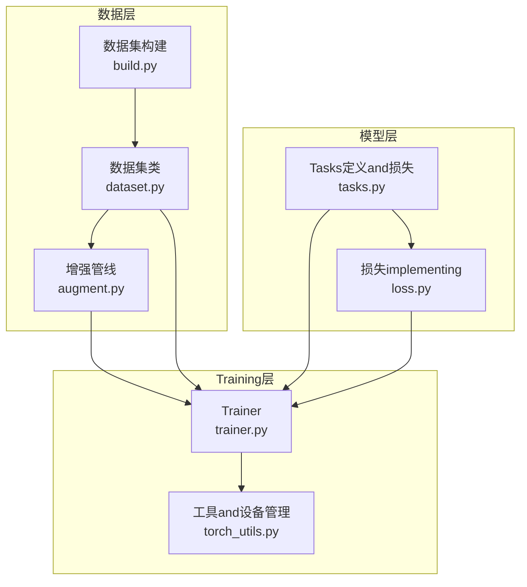
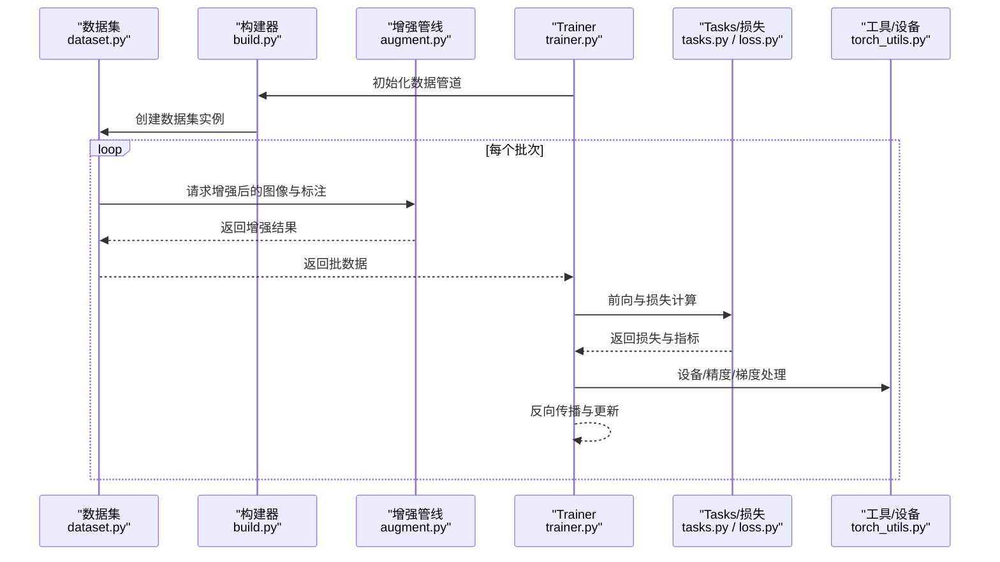
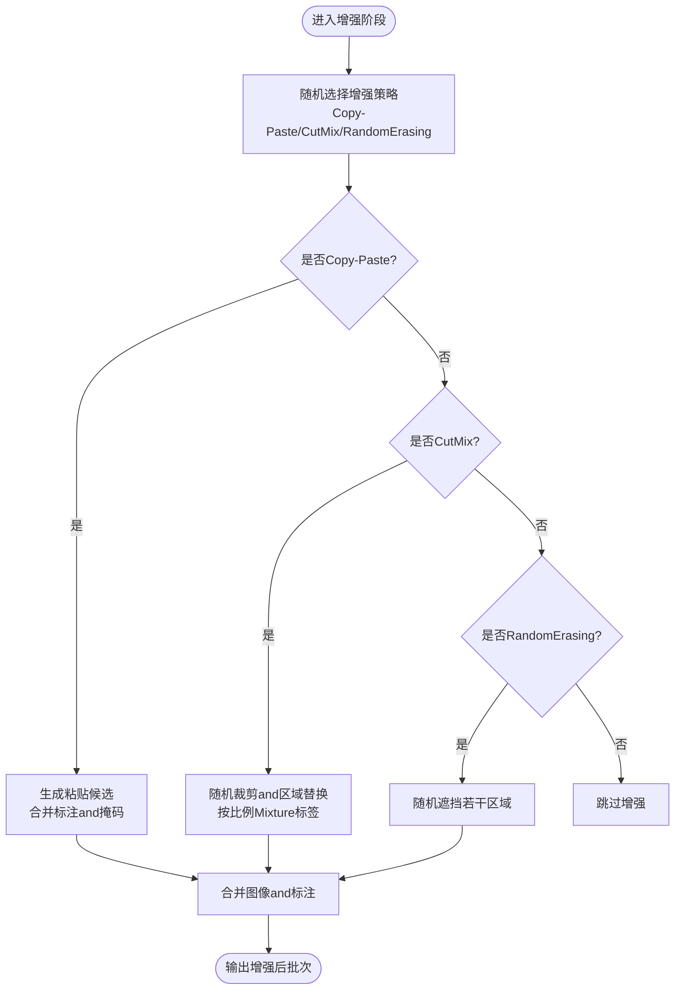
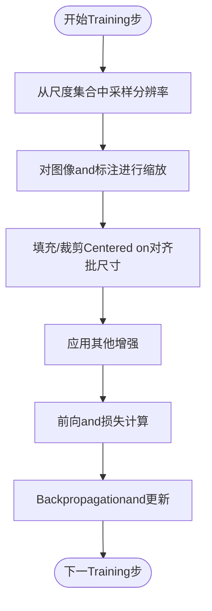
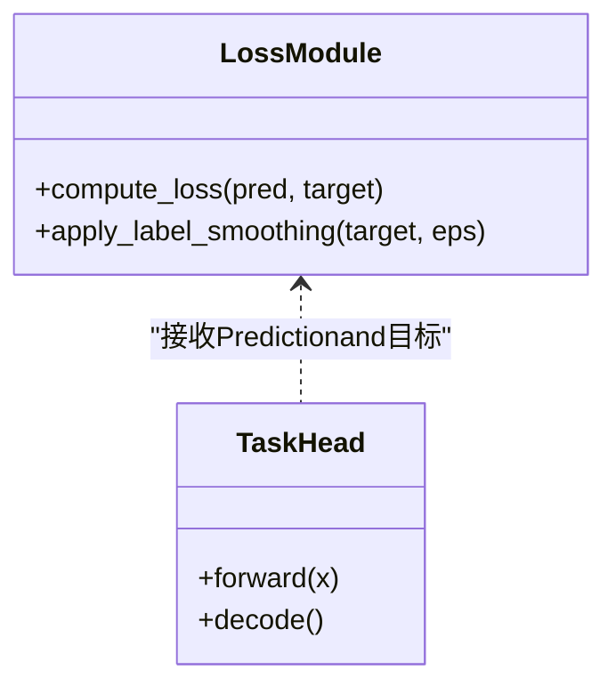
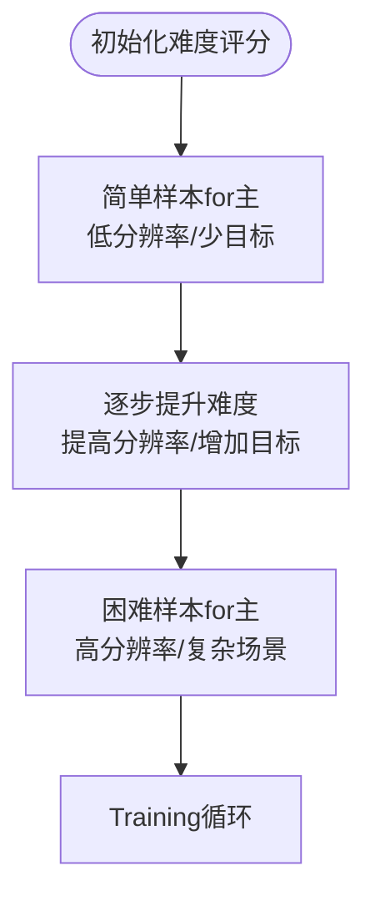
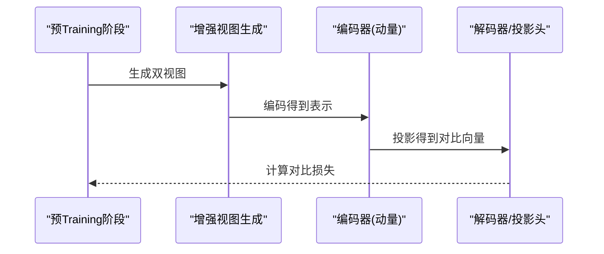
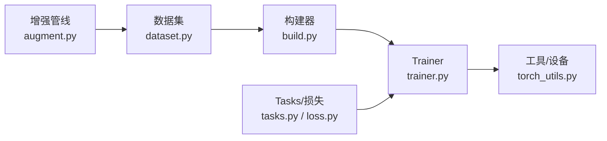

# 高级增强算法

<cite>
**Files Referenced in This Document**
- [ultralytics/data/augment.py](file://ultralytics/data/augment.py)
- [ultralytics/data/dataset.py](file://ultralytics/data/dataset.py)
- [ultralytics/data/build.py](file://ultralytics/data/build.py)
- [ultralytics/nn/tasks.py](file://ultralytics/nn/tasks.py)
- [ultralytics/engine/trainer.py](file://ultralytics/engine/trainer.py)
- [ultralytics/utils/loss.py](file://ultralytics/utils/loss.py)
- [ultralytics/utils/torch_utils.py](file://ultralytics/utils/torch_utils.py)
- [scripts/full_ablation_multiscale.py](file://scripts/full_ablation_multiscale.py)
- [docs/en/guides/yolo-data-augmentation.md](file://docs/en/guides/yolo-data-augmentation.md)
</cite>

## Table of Contents
1. [Introduction](#Introduction)
2. [Project Structure](#Project Structure)
3. [Core Components](#Core Components)
4. [Architecture Overview](#Architecture Overview)
5. [Detailed Component Analysis](#Detailed Component Analysis)
6. [Dependency Analysis](#Dependency Analysis)
7. [性能考量](#性能考量)
8. [Troubleshooting Guide](#Troubleshooting Guide)
9. [Conclusion](#Conclusion)
10. [Appendix](#Appendix)

## Introduction
本技术Documentation聚焦于YOLO-Master的高级Data AugmentationandTraining策略，系统阐述Centered on下主题：
- 现代深度学习中的先进增强技术：Copy-Paste、CutMix、RandomErasingetc.
- 多尺度Training（Multi-scale Training）的implementing原理and动态分辨率调整策略
- 标签平滑（Label Smoothing）的正则化效果and超参数调优方法
- 课程学习（Curriculum Learning）的数据难度排序and渐进式Training策略
- 自监督预Training中的对比学习增强（SimCLR、MoCo）while检测Tasks中的适配思路
- 高级增强的组合Uses策略and性能Optimization技巧
- 不同算法的计算复杂度分析and内存占用Evaluation

## Project Structure
本项目将Data AugmentationandTraining流程解耦for“Data Loadingand增强管线”和“模型Trainingand损失计算”两大Modules。关键路径such as下：
- 数据层：负责图像and标注的读取、增强、批构建and多尺度采样
- 模型层：EncapsulatesTasks头andLoss Function，Supporting标签平滑etc.正则化
- Training层：组织Training循环、回调、Loggingand配置解析

Figure Source
- [ultralytics/data/build.py](file://ultralytics/data/build.py)
- [ultralytics/data/dataset.py](file://ultralytics/data/dataset.py)
- [ultralytics/data/augment.py](file://ultralytics/data/augment.py)
- [ultralytics/nn/tasks.py](file://ultralytics/nn/tasks.py)
- [ultralytics/utils/loss.py](file://ultralytics/utils/loss.py)
- [ultralytics/engine/trainer.py](file://ultralytics/engine/trainer.py)
- [ultralytics/utils/torch_utils.py](file://ultralytics/utils/torch_utils.py)

Section Source
- [ultralytics/data/build.py](file://ultralytics/data/build.py)
- [ultralytics/data/dataset.py](file://ultralytics/data/dataset.py)
- [ultralytics/data/augment.py](file://ultralytics/data/augment.py)
- [ultralytics/nn/tasks.py](file://ultralytics/nn/tasks.py)
- [ultralytics/utils/loss.py](file://ultralytics/utils/loss.py)
- [ultralytics/engine/trainer.py](file://ultralytics/engine/trainer.py)
- [ultralytics/utils/torch_utils.py](file://ultralytics/utils/torch_utils.py)

## Core Components
- Data Augmentation管线（augment.py）
  - provides几何变换、色彩扰动、遮挡替换、区域Mixtureetc.增强算子
  - Supporting按概率and强度随机应用，便于and多尺度Training协同
- 数据集and批构建（dataset.py, build.py）
  - 负责样本索引、标注解析、批量打包and多尺度采样调度
  - and增强管线对接，形成端to端的数据流
- Tasksand损失（tasks.py, loss.py）
  - Encapsulates检测Tasks输出and损失计算，Supporting标签平滑etc.正则化选项
- Trainer（trainer.py）
  - 编排Training循环、Optimizer、调度器、Loggingand回调
  - 集成多尺度Training、课程学习策略and增强开关

Section Source
- [ultralytics/data/augment.py](file://ultralytics/data/augment.py)
- [ultralytics/data/dataset.py](file://ultralytics/data/dataset.py)
- [ultralytics/data/build.py](file://ultralytics/data/build.py)
- [ultralytics/nn/tasks.py](file://ultralytics/nn/tasks.py)
- [ultralytics/utils/loss.py](file://ultralytics/utils/loss.py)
- [ultralytics/engine/trainer.py](file://ultralytics/engine/trainer.py)

## Architecture Overview
下图展示从数据toTraining的完整Calls链，Centered onand增强、多尺度and损失之间的交互关系。

Figure Source
- [ultralytics/data/dataset.py](file://ultralytics/data/dataset.py)
- [ultralytics/data/build.py](file://ultralytics/data/build.py)
- [ultralytics/data/augment.py](file://ultralytics/data/augment.py)
- [ultralytics/engine/trainer.py](file://ultralytics/engine/trainer.py)
- [ultralytics/nn/tasks.py](file://ultralytics/nn/tasks.py)
- [ultralytics/utils/loss.py](file://ultralytics/utils/loss.py)
- [ultralytics/utils/torch_utils.py](file://ultralytics/utils/torch_utils.py)

## Detailed Component Analysis

### 组件一：高级增强技术（Copy-Paste、CutMix、RandomErasing）
- Copy-Paste增强
  - 机制：从同一类别或跨类别样本中复制目标对象掩码and边界框，粘贴至当前图像背景，并融合标注
  - Applicable Scenarios：小目标、长尾类别、遮挡鲁棒性提升
  - 复杂度and内存：时间复杂度近似O(N_obj + N_paste)，空间复杂度受粘贴数量and图像尺寸影响；建议控制粘贴密度and尺寸上限
- CutMix增强
  - 机制：随机裁剪一块矩形区域，用另一张图像的对应区域替换，同时按比例Mixture标签
  - Applicable Scenarios：提升模型对局部特征的泛化capabilities，缓解过拟合
  - 复杂度and内存：时间复杂度O(HW)，空间复杂度取决于批大小and图像尺寸；注意比例采样分布
- RandomErasing增强
  - 机制：while图像上随机选择若干矩形区域进行遮挡（填充均值/噪声），模拟遮挡and缺失
  - Applicable Scenarios：提高鲁棒性and域外泛化
  - 复杂度and内存：时间复杂度O(k·HW)，kfor遮挡块数；建议限制最大面积占比Centered on避免破坏语义

Figure Source
- [ultralytics/data/augment.py](file://ultralytics/data/augment.py)

Section Source
- [ultralytics/data/augment.py](file://ultralytics/data/augment.py)

### 组件二：多尺度Training（Multi-scale Training）
- implementing原理
  - whileTraining过程中动态调整输入分辨率，Centered on增强模型对不同尺度的鲁棒性
  - 通常Via随机缩放and自适应填充implementing，并while批内对齐尺寸
- 动态分辨率调整策略
  - 每步或每轮从预设尺度集合中采样，CombiningData Augmentation顺序（先缩放后裁剪/填充）
  - and批构建器协作，确保批内一致性
- 复杂度and内存
  - 时间复杂度随分辨率平方增长；高分辨率批次会显著增加显存占用
  - 建议采用阶梯式尺度and早停策略，平衡收敛速度and资源消耗

Figure Source
- [ultralytics/data/build.py](file://ultralytics/data/build.py)
- [ultralytics/data/dataset.py](file://ultralytics/data/dataset.py)
- [scripts/full_ablation_multiscale.py](file://scripts/full_ablation_multiscale.py)

Section Source
- [ultralytics/data/build.py](file://ultralytics/data/build.py)
- [ultralytics/data/dataset.py](file://ultralytics/data/dataset.py)
- [scripts/full_ablation_multiscale.py](file://scripts/full_ablation_multiscale.py)

### 组件三：标签平滑（Label Smoothing）
- 正则化效果
  - Via将硬标签软化for更均匀的分布，降低置信度峰值，缓解过拟合
  - while检测Tasks中常用于分类分支and辅助头
- 超参数调优
  - 平滑系数ε是关键超参，典型范围[0.01, 0.2]
  - andLearning Rate、权重衰减、增强强度联合调优，避免过度平滑导致判别力下降
- implementing位置
  - 损失计算Modules中引入平滑项，或whileTasks定义处注入标签转换逻辑

Figure Source
- [ultralytics/nn/tasks.py](file://ultralytics/nn/tasks.py)
- [ultralytics/utils/loss.py](file://ultralytics/utils/loss.py)

Section Source
- [ultralytics/nn/tasks.py](file://ultralytics/nn/tasks.py)
- [ultralytics/utils/loss.py](file://ultralytics/utils/loss.py)

### 组件四：课程学习（Curriculum Learning）
- 数据难度排序
  - 基于目标密度、遮挡程度、尺度分布、类别频率etc.Metrics构造难度分数
  - Training初期优先简单样本，逐步引入困难样本
- 渐进式Training策略
  - 可Combining多尺度Training，先while低分辨率and少目标场景下预热，再过渡to高分辨率and复杂场景
  - 可ViaTrainer回调动态调整采样权重或切换数据子集
- 复杂度and内存
  - 难度评分可while预处理阶段离线计算，while线阶段仅做加权采样，开销可控

Figure Source
- [ultralytics/engine/trainer.py](file://ultralytics/engine/trainer.py)
- [ultralytics/data/dataset.py](file://ultralytics/data/dataset.py)

Section Source
- [ultralytics/engine/trainer.py](file://ultralytics/engine/trainer.py)
- [ultralytics/data/dataset.py](file://ultralytics/data/dataset.py)

### 组件五：自监督预Training中的增强（SimCLR、MoCo）
- SimCLR风格增强
  - 强增强（颜色抖动、随机裁剪、模糊、对比度/亮度变化）用于同一图像的两份视图，最大化互信息
  - while检测Tasks中可将增强应用于Feature Extraction主干，再进行下游微调
- MoCo风格增强
  - Uses队列and动量编码器，保持正负样本对的稳定性；增强策略andSimCLR类似但强调时序一致性
- 适配建议
  - whileYOLO检测Tasks中，可采用两阶段策略：先用自监督预Training主干，再用标准检测损失微调
  - 增强强度需and下游Tasks匹配，避免破坏定位信号

Figure Source
- [ultralytics/nn/tasks.py](file://ultralytics/nn/tasks.py)
- [ultralytics/utils/loss.py](file://ultralytics/utils/loss.py)

Section Source
- [ultralytics/nn/tasks.py](file://ultralytics/nn/tasks.py)
- [ultralytics/utils/loss.py](file://ultralytics/utils/loss.py)

### 组件六：高级增强的组合Uses策略
- 组合原则
  - 互补性：几何+色彩+遮挡的组合能覆盖更多不变性
  - 强度控制：避免过度增强破坏定位and分割信号
  - Tasks相关：检测Tasks需保留边界and相对位置信息
- 推荐策略
  - 基础增强（翻转、旋转、缩放）+ 随机遮挡（RandomErasing）+ 区域Mixture（CutMix）
  - 针对小目标and长尾类别加入Copy-Paste
  - while多尺度Training中穿插上述增强，提升鲁棒性
- Validationand回退
  - Via消融实验Evaluation各增强贡献，必要时关闭某项Centered on稳定Training

Section Source
- [ultralytics/data/augment.py](file://ultralytics/data/augment.py)
- [docs/en/guides/yolo-data-augmentation.md](file://docs/en/guides/yolo-data-augmentation.md)

## Dependency Analysis
- 耦合and内聚
  - 增强管线and数据集高内聚，TrainerVia构建器间接依赖增强
  - Tasksand损失Modules独立，便于替换and扩展
- External Dependencies
  - 设备and精度管理由工具Modulesprovides，Trainer统一调度
- Potential Cycles依赖
  - 数据层andTraining层单向依赖，未见循环导入迹象

Figure Source
- [ultralytics/data/augment.py](file://ultralytics/data/augment.py)
- [ultralytics/data/dataset.py](file://ultralytics/data/dataset.py)
- [ultralytics/data/build.py](file://ultralytics/data/build.py)
- [ultralytics/nn/tasks.py](file://ultralytics/nn/tasks.py)
- [ultralytics/utils/loss.py](file://ultralytics/utils/loss.py)
- [ultralytics/engine/trainer.py](file://ultralytics/engine/trainer.py)
- [ultralytics/utils/torch_utils.py](file://ultralytics/utils/torch_utils.py)

Section Source
- [ultralytics/data/augment.py](file://ultralytics/data/augment.py)
- [ultralytics/data/dataset.py](file://ultralytics/data/dataset.py)
- [ultralytics/data/build.py](file://ultralytics/data/build.py)
- [ultralytics/nn/tasks.py](file://ultralytics/nn/tasks.py)
- [ultralytics/utils/loss.py](file://ultralytics/utils/loss.py)
- [ultralytics/engine/trainer.py](file://ultralytics/engine/trainer.py)
- [ultralytics/utils/torch_utils.py](file://ultralytics/utils/torch_utils.py)

## 性能考量
- 计算复杂度
  - 增强操作多for像素级或区域级，时间复杂度and图像尺寸和目标数量相关
  - 多尺度Training使每步计算量波动，需监控平均FLOPsand吞吐
- 内存占用
  - 高分辨率and大批次显著提升显存占用；建议根据GPU容量调整batch sizeand尺度集合
  - Copy-PasteandCutMix会增加中间张量and标注结构的临时内存
- Optimization技巧
  - Uses异步Data Loadingand缓存
  - Set appropriately增强概率and强度，避免无意义计算
  - 利用半精度andGradient累积提升吞吐

## Troubleshooting Guide
- 常见问题
  - 增强后标注越界或重叠异常：检查坐标归一化and边界裁剪逻辑
  - 多尺度Training不稳定：确认批内尺寸对齐and填充策略
  - 标签平滑导致收敛缓慢：降低ε或Combined with更大的Learning Rate
  - 课程学习难Centered on收敛：调整难度阈值and过渡速率
- 诊断步骤
  - Visualization增强前后图像and标注
  - 记录每步的平均分辨率and目标密度
  - 分阶段关闭增强Centered on定位问题源

Section Source
- [ultralytics/data/augment.py](file://ultralytics/data/augment.py)
- [ultralytics/data/dataset.py](file://ultralytics/data/dataset.py)
- [ultralytics/engine/trainer.py](file://ultralytics/engine/trainer.py)

## Conclusion
YOLO-Master的Data AugmentationandTraining体系provides了灵活且可扩展的高级增强capabilities。Via合理组合Copy-Paste、CutMixandRandomErasing，并Combining多尺度Training、标签平滑and课程学习，可Centered onwhile保证效率显著提升模型的鲁棒性and泛化capabilities。建议while具体Tasks中进行系统化消融and调参，Centered on获得最佳性能and资源平衡。

## Appendix
- Refer toDocumentation
  - YOLOData Augmentation指南：[yolo-data-augmentation.md](file://docs/en/guides/yolo-data-augmentation.md)
  - 多尺度Training脚本Examples：[full_ablation_multiscale.py](file://scripts/full_ablation_multiscale.py)