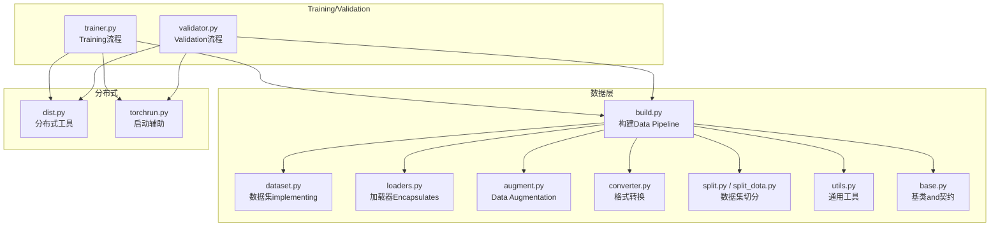
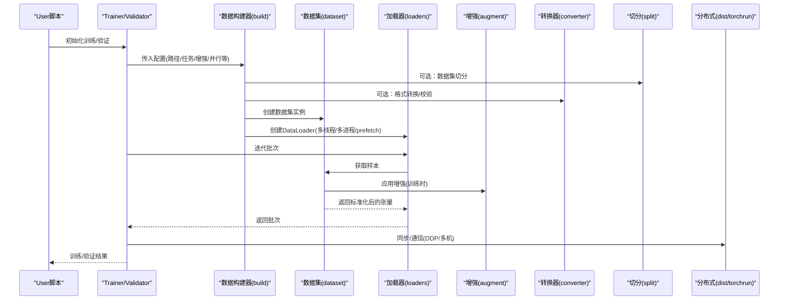
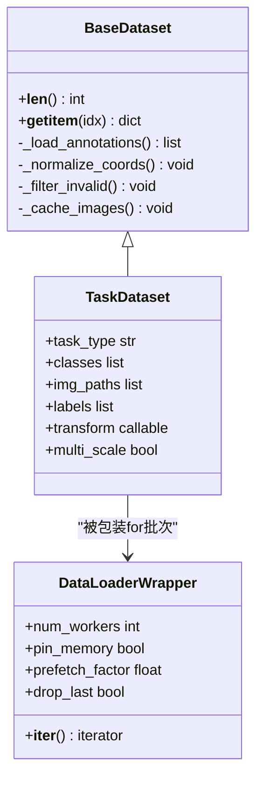
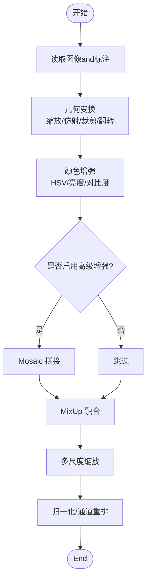
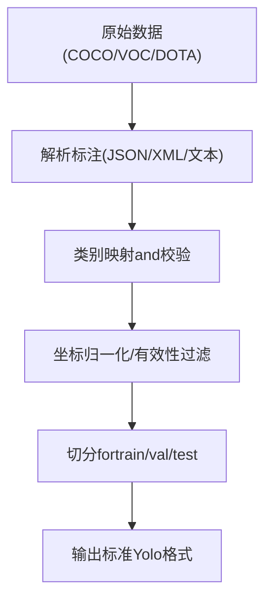
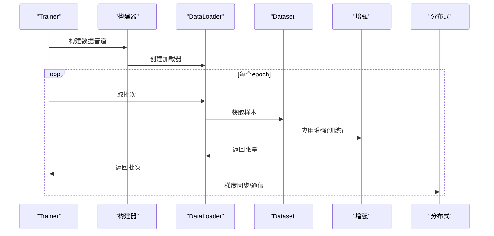
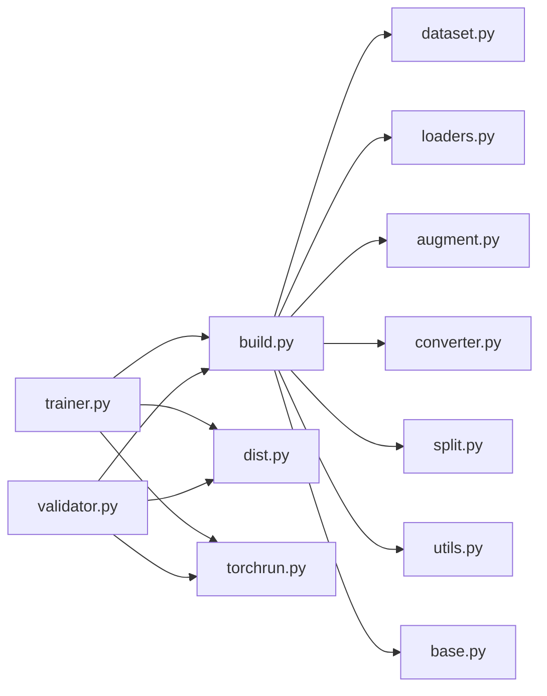

# Data Processing System

<cite>
**Files Referenced in This Document**
- [ultralytics/data/__init__.py](file://ultralytics/data/__init__.py)
- [ultralytics/data/base.py](file://ultralytics/data/base.py)
- [ultralytics/data/build.py](file://ultralytics/data/build.py)
- [ultralytics/data/dataset.py](file://ultralytics/data/dataset.py)
- [ultralytics/data/loaders.py](file://ultralytics/data/loaders.py)
- [ultralytics/data/augment.py](file://ultralytics/data/augment.py)
- [ultralytics/data/converter.py](file://ultralytics/data/converter.py)
- [ultralytics/data/utils.py](file://ultralytics/data/utils.py)
- [ultralytics/data/split.py](file://ultralytics/data/split.py)
- [ultralytics/data/split_dota.py](file://ultralytics/data/split_dota.py)
- [ultralytics/engine/trainer.py](file://ultralytics/engine/trainer.py)
- [ultralytics/engine/validator.py](file://ultralytics/engine/validator.py)
- [ultralytics/utils/dist.py](file://ultralytics/utils/dist.py)
- [ultralytics/utils/torchrun.py](file://ultralytics/utils/torchrun.py)
- [ultralytics/utils/checks.py](file://ultralytics/utils/checks.py)
- [scripts/coco2017.yaml](file://scripts/coco2017.yaml)
- [scripts/VOC_sub.yaml](file://scripts/VOC_sub.yaml)
</cite>

## Table of Contents
1. [Introduction](#Introduction)
2. [Project Structure](#Project Structure)
3. [Core Components](#Core Components)
4. [Architecture Overview](#Architecture Overview)
5. [Detailed Component Analysis](#Detailed Component Analysis)
6. [Dependency Analysis](#Dependency Analysis)
7. [Performance Considerations](#Performance Considerations)
8. [Troubleshooting Guide](#Troubleshooting Guide)
9. [Conclusion](#Conclusion)
10. [Appendix](#Appendix)

## Introduction
本技术Documentation聚焦于 YOLO-Master 的Data Processing System，围绕Data Loading管道、缓存and内存管理、多格式数据集Supporting（YOLO/COCO/VOC etc.）、Data Augmentation体系（几何变换、颜色增强、MixUp、Mosaic etc.）、自定义Data Loading器开发、数据Validationand质量检查、多尺度Trainingand采样策略、数据并行and分布式加载、大数据集Optimizationand内存管理、预处理/Post-Processing工具链、数据版本管理and实验复现、Centered onand常见问题诊断and解决方案进行系统化阐述。目标是帮助读者从架构toimplementing细节全面理解并高效Uses该系统。

## Project Structure
Data processing子系统位于 ultralytics/data Table of Contents下，按职责划分for：
- 构建and装配：负责根据配置构建 Dataset、DataLoader、Transform 流水线
- 数据集抽象andimplementing：Unified Interface、索引、标签解析、图像读取
- Data Augmentation：几何、颜色、高级组合增强（Mosaic/MixUp etc.）
- 格式转换and分割：COCO/YOLO/VOC/DOTA etc.格式互转and切分
- 工具函数：路径、IO、校验、统计etc.通用capabilities
- Training/Validation集成：while Trainer/Validator 中装配Data Pipeline

Figure Source
- [ultralytics/data/build.py](file://ultralytics/data/build.py)
- [ultralytics/data/dataset.py](file://ultralytics/data/dataset.py)
- [ultralytics/data/loaders.py](file://ultralytics/data/loaders.py)
- [ultralytics/data/augment.py](file://ultralytics/data/augment.py)
- [ultralytics/data/converter.py](file://ultralytics/data/converter.py)
- [ultralytics/data/split.py](file://ultralytics/data/split.py)
- [ultralytics/data/split_dota.py](file://ultralytics/data/split_dota.py)
- [ultralytics/data/utils.py](file://ultralytics/data/utils.py)
- [ultralytics/data/base.py](file://ultralytics/data/base.py)
- [ultralytics/engine/trainer.py](file://ultralytics/engine/trainer.py)
- [ultralytics/engine/validator.py](file://ultralytics/engine/validator.py)
- [ultralytics/utils/dist.py](file://ultralytics/utils/dist.py)
- [ultralytics/utils/torchrun.py](file://ultralytics/utils/torchrun.py)

Section Source
- [ultralytics/data/build.py](file://ultralytics/data/build.py)
- [ultralytics/data/dataset.py](file://ultralytics/data/dataset.py)
- [ultralytics/data/augment.py](file://ultralytics/data/augment.py)
- [ultralytics/data/converter.py](file://ultralytics/data/converter.py)
- [ultralytics/data/split.py](file://ultralytics/data/split.py)
- [ultralytics/data/split_dota.py](file://ultralytics/data/split_dota.py)
- [ultralytics/data/utils.py](file://ultralytics/data/utils.py)
- [ultralytics/data/base.py](file://ultralytics/data/base.py)
- [ultralytics/engine/trainer.py](file://ultralytics/engine/trainer.py)
- [ultralytics/engine/validator.py](file://ultralytics/engine/validator.py)
- [ultralytics/utils/dist.py](file://ultralytics/utils/dist.py)
- [ultralytics/utils/torchrun.py](file://ultralytics/utils/torchrun.py)

## Core Components
- 数据构建器（build）：根据 YAML/字典配置解析Tasks类型、根路径、类别映射、增强参数、批大小、工作进程数、多尺度策略etc.，组装 Dataset and DataLoader。
- 数据集抽象（base/dataset）：定义统一的 __getitem__/__len__ 契约，Encapsulates图像读取、标注解析、坐标归一化、类别映射、缓存and索引。
- 加载器Encapsulates（loaders）：对 PyTorch DataLoader 的Encapsulates，provides线程/进程并行、prefetch、pin_memory、drop_last etc.选项，适配Training/Validation不同需求。
- Data Augmentation（augment）：几何变换（缩放、仿射、翻转、裁剪）、颜色空间增强（HSV、亮度、对比度、饱和度）、高级组合（Mosaic、MixUp、Copy-Paste etc.）。
- 格式转换（converter）：COCO/YOLO/VOC/DOTA etc.格式的相互转换and规范化，确保标注一致性。
- 切分工具（split/split_dota）：将原始数据切分for train/val/test，Supporting随机/分层/时间序列切分，DOTA Supporting瓦片切分。
- 工具函数（utils）：路径解析、文件扫描、JSON/YAML 读写、统计信息、校验andLogging。
- Training/Validation集成（trainer/validator）：whileTraining/Validation循环中Calls数据构建器，注入多尺度、Mixture精度、Gradient累积etc.上下文。

Section Source
- [ultralytics/data/build.py](file://ultralytics/data/build.py)
- [ultralytics/data/base.py](file://ultralytics/data/base.py)
- [ultralytics/data/dataset.py](file://ultralytics/data/dataset.py)
- [ultralytics/data/loaders.py](file://ultralytics/data/loaders.py)
- [ultralytics/data/augment.py](file://ultralytics/data/augment.py)
- [ultralytics/data/converter.py](file://ultralytics/data/converter.py)
- [ultralytics/data/split.py](file://ultralytics/data/split.py)
- [ultralytics/data/split_dota.py](file://ultralytics/data/split_dota.py)
- [ultralytics/data/utils.py](file://ultralytics/data/utils.py)
- [ultralytics/engine/trainer.py](file://ultralytics/engine/trainer.py)
- [ultralytics/engine/validator.py](file://ultralytics/engine/validator.py)

## Architecture Overview
数据流从配置to模型Training/Validation的整体时序such as下：

Figure Source
- [ultralytics/engine/trainer.py](file://ultralytics/engine/trainer.py)
- [ultralytics/engine/validator.py](file://ultralytics/engine/validator.py)
- [ultralytics/data/build.py](file://ultralytics/data/build.py)
- [ultralytics/data/dataset.py](file://ultralytics/data/dataset.py)
- [ultralytics/data/loaders.py](file://ultralytics/data/loaders.py)
- [ultralytics/data/augment.py](file://ultralytics/data/augment.py)
- [ultralytics/data/converter.py](file://ultralytics/data/converter.py)
- [ultralytics/data/split.py](file://ultralytics/data/split.py)
- [ultralytics/utils/dist.py](file://ultralytics/utils/dist.py)
- [ultralytics/utils/torchrun.py](file://ultralytics/utils/torchrun.py)

## Detailed Component Analysis

### 数据构建器and装配（build）
- 功能要点
  - 解析Tasks类型（检测/分割/姿态/Trackingetc.），选择对应数据集implementing
  - 合并默认配置andUser配置，生成最终超参（batch_size、workers、multi_scale、mosaic_mixup etc.）
  - 构造 DataLoader，设置 num_workers、pin_memory、persistent_workers、prefetch_factor etc.
  - while多卡环境下，依据 rank/world_size 划分数据子集
- 关键交互
  - and trainer/validator 协作，按需启用/禁用增强and多尺度
  - and dist/torchrun 协作，完成分布式采样and广播

Section Source
- [ultralytics/data/build.py](file://ultralytics/data/build.py)
- [ultralytics/engine/trainer.py](file://ultralytics/engine/trainer.py)
- [ultralytics/engine/validator.py](file://ultralytics/engine/validator.py)
- [ultralytics/utils/dist.py](file://ultralytics/utils/dist.py)
- [ultralytics/utils/torchrun.py](file://ultralytics/utils/torchrun.py)

### 数据集抽象andimplementing（base/dataset）
- 设计模式
  - 基于基类契约（__getitem__/__len__），统一输入输出规范
  - 内部维护索引表、类别映射、路径缓存、标注缓存
- 数据读取and解析
  - Supporting YOLO 文本标注、COCO JSON、VOC XML、DOTA etc.
  - 坐标归一化、边界框过滤、无效样本剔除
- 缓存机制
  - 图像/标注缓存（内存或磁盘），减少重复 IO
  - 可配置缓存大小and过期策略
- 多尺度and采样
  - Training时动态分辨率、随机尺度；Validation时固定尺度或滑动窗口
  - 分层采样、类别权重采样、难例优先（Optional）

Figure Source
- [ultralytics/data/base.py](file://ultralytics/data/base.py)
- [ultralytics/data/dataset.py](file://ultralytics/data/dataset.py)
- [ultralytics/data/loaders.py](file://ultralytics/data/loaders.py)

Section Source
- [ultralytics/data/base.py](file://ultralytics/data/base.py)
- [ultralytics/data/dataset.py](file://ultralytics/data/dataset.py)
- [ultralytics/data/loaders.py](file://ultralytics/data/loaders.py)

### Data Augmentation体系（augment）
- 几何变换
  - 缩放、仿射、旋转、平移、裁剪、翻转、随机擦除
- 颜色增强
  - HSV 空间扰动、亮度/对比度/饱和度调整、随机模糊
- 高级组合
  - Mosaic：四图拼接，提升小目标and上下文感知
  - MixUp：线性插值融合两张图and标签
  - Copy-Paste：复制粘贴目标to新背景
- 增强管线
  - 顺序/概率控制、条件增强（such as仅Training阶段启用）
  - and多尺度联动，先增强再缩放或反之的策略

Figure Source
- [ultralytics/data/augment.py](file://ultralytics/data/augment.py)

Section Source
- [ultralytics/data/augment.py](file://ultralytics/data/augment.py)

### 格式转换and切分（converter/split）
- 格式转换
  - COCO JSON → YOLO TXT：类别映射、坐标归一化、文件组织
  - VOC XML → YOLO TXT：XML 解析、边界框提取、归一化
  - DOTA → YOLO/OBB：旋转框处理、瓦片切分
- 数据集切分
  - 随机/分层/时间序列切分，保证类别分布均衡
  - Supporting预定义比例and种子控制，便于复现实验

Figure Source
- [ultralytics/data/converter.py](file://ultralytics/data/converter.py)
- [ultralytics/data/split.py](file://ultralytics/data/split.py)
- [ultralytics/data/split_dota.py](file://ultralytics/data/split_dota.py)

Section Source
- [ultralytics/data/converter.py](file://ultralytics/data/converter.py)
- [ultralytics/data/split.py](file://ultralytics/data/split.py)
- [ultralytics/data/split_dota.py](file://ultralytics/data/split_dota.py)

### Training/Validation集成（trainer/validator）
- Training阶段
  - 启用增强、多尺度、Mixture精度、Gradient累积
  - 根据 batch_size and workers 调节吞吐
- Validation阶段
  - 关闭增强，固定尺度，必要时开启滑动窗口/SAHI
  - Metrics计算andVisualization
- 分布式
  - 基于 torchrun 启动，利用 dist 工具进行 rank/world_size 管理、数据子集划分、AllReduce 同步

Figure Source
- [ultralytics/engine/trainer.py](file://ultralytics/engine/trainer.py)
- [ultralytics/engine/validator.py](file://ultralytics/engine/validator.py)
- [ultralytics/data/build.py](file://ultralytics/data/build.py)
- [ultralytics/data/dataset.py](file://ultralytics/data/dataset.py)
- [ultralytics/data/augment.py](file://ultralytics/data/augment.py)
- [ultralytics/utils/dist.py](file://ultralytics/utils/dist.py)

Section Source
- [ultralytics/engine/trainer.py](file://ultralytics/engine/trainer.py)
- [ultralytics/engine/validator.py](file://ultralytics/engine/validator.py)
- [ultralytics/data/build.py](file://ultralytics/data/build.py)
- [ultralytics/data/dataset.py](file://ultralytics/data/dataset.py)
- [ultralytics/data/augment.py](file://ultralytics/data/augment.py)
- [ultralytics/utils/dist.py](file://ultralytics/utils/dist.py)

### 自定义Data Loading器开发方法and最佳实践
- 步骤建议
  - 继承基类，implementing __getitem__/__len__，遵循统一输入输出契约
  - implementing标注解析and坐标归一化，加入无效样本过滤
  - 引入缓存（内存/磁盘），避免重复 IO
  - while build 中注册新数据集类型，或while配置中指定
- 最佳实践
  - 保持 transform 无副作用，易于调试and替换
  - Set appropriately num_workers and prefetch_factor，避免 CPU/GPU bottlenecks
  - Uses pin_memory 加速 GPU 传输
  - 针对大对象（分割掩码/关键点）采用懒加载and按需解码

Section Source
- [ultralytics/data/base.py](file://ultralytics/data/base.py)
- [ultralytics/data/dataset.py](file://ultralytics/data/dataset.py)
- [ultralytics/data/build.py](file://ultralytics/data/build.py)
- [ultralytics/data/loaders.py](file://ultralytics/data/loaders.py)

### 数据Validationand质量检查机制
- 路径and文件完整性校验
- 标注格式and范围校验（类别越界、坐标越界、空框）
- 统计信息收集（类别分布、尺寸分布、缺失率）
- 断言and异常上报，失败即中止Centered on避免污染Training

Section Source
- [ultralytics/data/utils.py](file://ultralytics/data/utils.py)
- [ultralytics/data/dataset.py](file://ultralytics/data/dataset.py)
- [ultralytics/utils/checks.py](file://ultralytics/utils/checks.py)

### 多尺度Trainingand数据采样策略
- 多尺度
  - Training时随机尺度，提高模型鲁棒性；Validation时固定尺度或滑动窗口
  - and增强管线协同，先增强后缩放或先缩放后增强
- 采样策略
  - 均匀采样、类别权重采样、难例优先（Optional）
  - 分层抽样保证Validation集类别分布一致

Section Source
- [ultralytics/data/dataset.py](file://ultralytics/data/dataset.py)
- [ultralytics/data/augment.py](file://ultralytics/data/augment.py)
- [ultralytics/data/build.py](file://ultralytics/data/build.py)

### 数据并行and分布式Data Loading
- 基于 torchrun 启动，自动设置环境变量and端口
- Uses dist 工具进行 rank/world_size 管理、数据子集划分
- DataLoader while每个进程中独立运行，避免共享状态冲突
- Gradient AllReduce and同步屏障保障一致性

Section Source
- [ultralytics/utils/torchrun.py](file://ultralytics/utils/torchrun.py)
- [ultralytics/utils/dist.py](file://ultralytics/utils/dist.py)
- [ultralytics/data/loaders.py](file://ultralytics/data/loaders.py)

### 大数据集处理Optimizationand内存管理
- 缓存策略
  - 图像/标注缓存，限制最大缓存条目，LRU 淘汰
  - 磁盘缓存用于超大图像或高分辨率掩码
- I/O Optimization
  - 多进程读取、异步队列、prefetch_factor 调优
  - Uses pin_memory and持久化 worker
- 内存控制
  - 延迟解码、按需加载、释放中间变量
  - 监控峰值内存，动态降低 batch_size 或 workers

Section Source
- [ultralytics/data/dataset.py](file://ultralytics/data/dataset.py)
- [ultralytics/data/loaders.py](file://ultralytics/data/loaders.py)
- [ultralytics/data/utils.py](file://ultralytics/data/utils.py)

### 数据预处理andPost-Processing工具链
- 预处理
  - 格式转换、切分、去重、清洗、统计报告
- Post-Processing
  - Prediction结果回写、Visualization、EvaluationMetrics汇总
- 工具脚本
  - 批量转换、批量切分、质量检查、Export标准 YAML

Section Source
- [ultralytics/data/converter.py](file://ultralytics/data/converter.py)
- [ultralytics/data/split.py](file://ultralytics/data/split.py)
- [ultralytics/data/utils.py](file://ultralytics/data/utils.py)

### 数据版本管理and实验复现
- 版本化
  - 记录数据集哈希、类别映射、切分方案、增强参数
  - Uses配置文件锁定版本（YAML）
- 复现
  - 固定随机种子、记录环境依赖、保存中间产物
  - Via脚本一键复现实验

Section Source
- [scripts/coco2017.yaml](file://scripts/coco2017.yaml)
- [scripts/VOC_sub.yaml](file://scripts/VOC_sub.yaml)
- [ultralytics/data/utils.py](file://ultralytics/data/utils.py)

## Dependency Analysis
- Modules耦合
  - build 依赖 dataset/loaders/augment/converter/split/utils/base
  - trainer/validator 依赖 build and dist/torchrun
- External Dependencies
  - PyTorch DataLoader、NumPy、OpenCV/PIL、JSON/XML 解析库
- Potential Cycles依赖
  - Via抽象基类and工厂模式解耦，避免直接循环导入

Figure Source
- [ultralytics/data/build.py](file://ultralytics/data/build.py)
- [ultralytics/data/dataset.py](file://ultralytics/data/dataset.py)
- [ultralytics/data/loaders.py](file://ultralytics/data/loaders.py)
- [ultralytics/data/augment.py](file://ultralytics/data/augment.py)
- [ultralytics/data/converter.py](file://ultralytics/data/converter.py)
- [ultralytics/data/split.py](file://ultralytics/data/split.py)
- [ultralytics/data/utils.py](file://ultralytics/data/utils.py)
- [ultralytics/data/base.py](file://ultralytics/data/base.py)
- [ultralytics/engine/trainer.py](file://ultralytics/engine/trainer.py)
- [ultralytics/engine/validator.py](file://ultralytics/engine/validator.py)
- [ultralytics/utils/dist.py](file://ultralytics/utils/dist.py)
- [ultralytics/utils/torchrun.py](file://ultralytics/utils/torchrun.py)

Section Source
- [ultralytics/data/build.py](file://ultralytics/data/build.py)
- [ultralytics/data/dataset.py](file://ultralytics/data/dataset.py)
- [ultralytics/data/loaders.py](file://ultralytics/data/loaders.py)
- [ultralytics/data/augment.py](file://ultralytics/data/augment.py)
- [ultralytics/data/converter.py](file://ultralytics/data/converter.py)
- [ultralytics/data/split.py](file://ultralytics/data/split.py)
- [ultralytics/data/utils.py](file://ultralytics/data/utils.py)
- [ultralytics/data/base.py](file://ultralytics/data/base.py)
- [ultralytics/engine/trainer.py](file://ultralytics/engine/trainer.py)
- [ultralytics/engine/validator.py](file://ultralytics/engine/validator.py)
- [ultralytics/utils/dist.py](file://ultralytics/utils/dist.py)
- [ultralytics/utils/torchrun.py](file://ultralytics/utils/torchrun.py)

## Performance Considerations
- I/O 吞吐
  - Set appropriately num_workers、prefetch_factor、pin_memory
  - Uses持久化 worker 减少进程重建开销
- 内存占用
  - 控制缓存上限，避免 OOM
  - 对大图/掩码采用懒加载and分块处理
- GPU 利用率
  - 平衡 batch_size and workers，避免 GPU etc.待
  - Mixture精度andGradient累积提升吞吐
- 多尺度and增强
  - 仅whileTraining阶段启用，Validation阶段关闭
  - 根据硬件capabilities调整增强强度and数量

[This section provides general guidance and does not directly analyze specific files]

## Troubleshooting Guide
- 常见错误
  - 路径不存while/权限不足：检查根路径and文件扫描逻辑
  - 标注格式错误：类别越界、坐标越界、空框
  - 内存溢出：增大缓存上限或降低 batch_size/workers
  - 分布式通信失败：检查端口、防火墙、rank/world_size 设置
- 诊断方法
  - 启用详细Loggingand断言，定位失败样本
  - 打印统计信息（类别分布、尺寸分布）
  - 逐步禁用增强/多尺度，隔离问题

Section Source
- [ultralytics/data/utils.py](file://ultralytics/data/utils.py)
- [ultralytics/data/dataset.py](file://ultralytics/data/dataset.py)
- [ultralytics/utils/checks.py](file://ultralytics/utils/checks.py)
- [ultralytics/utils/dist.py](file://ultralytics/utils/dist.py)

## Conclusion
YOLO-Master 的Data Processing SystemCentered onModules化and可扩展for核心，through a unified抽象契约、灵活的增强管线、完善的格式Supportingand分布式适配，implementing了高吞吐、低延迟、易扩展的Data Pipeline。Combining缓存and内存管理策略、多尺度and采样技巧，可while大规模数据集上稳定高效地TrainingandValidation模型。建议while生产环境中严格进行数据质量检查and版本化管理，确保实验可复现and结果可追溯。

[This section is summary content and does not directly analyze specific files]

## Appendix
- Examples配置
  - COCO2017 配置Refer to：[scripts/coco2017.yaml](file://scripts/coco2017.yaml)
  - VOC 子集配置Refer to：[scripts/VOC_sub.yaml](file://scripts/VOC_sub.yaml)
- 快速上手
  - UsesBuilt-in脚本进行格式转换and切分
  - Via YAML 配置drivers are installedTraining/Validation流程

Section Source
- [scripts/coco2017.yaml](file://scripts/coco2017.yaml)
- [scripts/VOC_sub.yaml](file://scripts/VOC_sub.yaml)