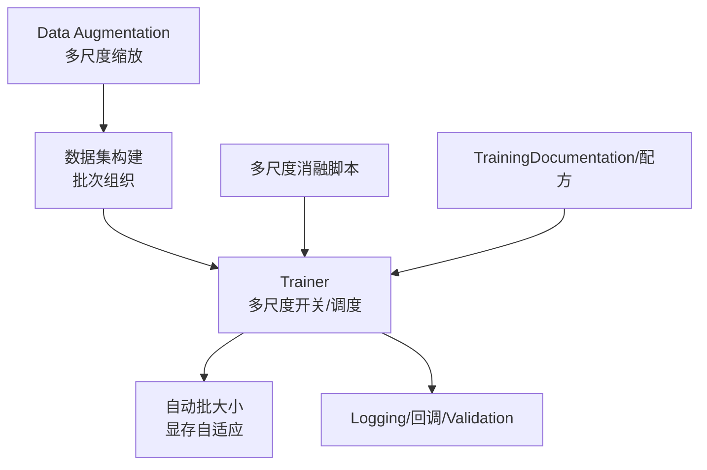
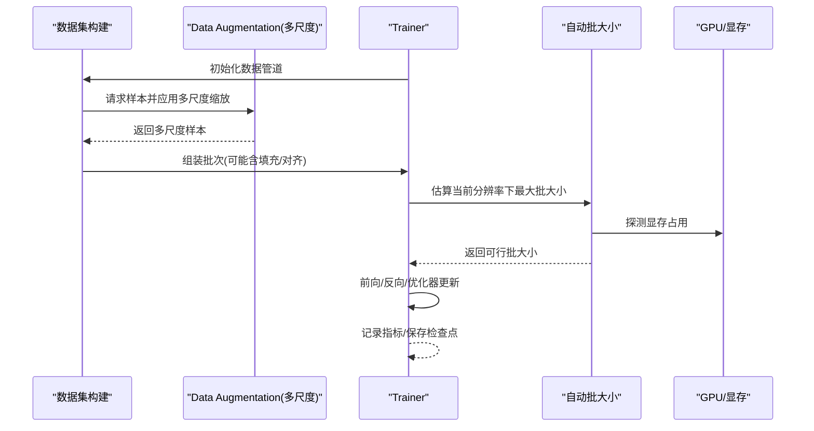
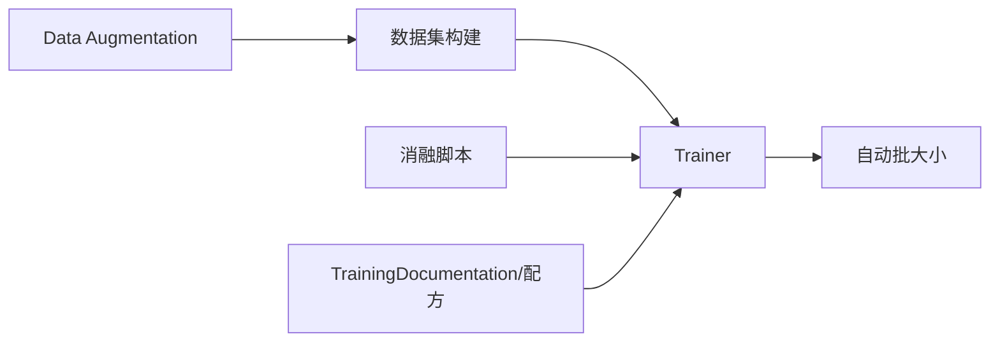

# 多尺度Training

<cite>
**Files Referenced in This Document**
- [ultralytics/data/augment.py](file://ultralytics/data/augment.py)
- [ultralytics/data/build.py](file://ultralytics/data/build.py)
- [ultralytics/engine/trainer.py](file://ultralytics/engine/trainer.py)
- [ultralytics/utils/autobatch.py](file://ultralytics/utils/autobatch.py)
- [scripts/ablation_suite/full_ablation_multiscale.py](file://scripts/ablation_suite/full_ablation_multiscale.py)
- [docs/en/guides/yolo26-training-recipe.md](file://docs/en/guides/yolo26-training-recipe.md)
- [docs/en/modes/train.md](file://docs/en/modes/train.md)
</cite>

## Table of Contents
1. [Introduction](#Introduction)
2. [Project Structure](#Project Structure)
3. [Core Components](#Core Components)
4. [Architecture Overview](#Architecture Overview)
5. [Detailed Component Analysis](#Detailed Component Analysis)
6. [Dependency Analysis](#Dependency Analysis)
7. [性能考量](#性能考量)
8. [Troubleshooting Guide](#Troubleshooting Guide)
9. [Conclusion](#Conclusion)
10. [Appendix](#Appendix)

## Introduction
本技术Documentation聚焦于YOLO-Master的多尺度Training System，系统性阐述其原理、优势andimplementing细节。内容涵盖：
- 多尺度Training的原理and收益：提升模型对不同目标尺度的鲁棒性and泛化capabilities
- 尺度采样算法and动态尺度调整机制
- 内存管理and计算Optimization策略（自动批大小、Data Loading流水线）
- 不同Tasks（检测、分割、Pose Estimation）while多尺度下的差异and适配
- 配置参数and调优方法
- 基准测试思路and对比分析方法
- 最佳实践and常见问题解决方案
- and其他Training技术（such asMixture精度、Distributed Training、Data Augmentationetc.）的CombiningUses

## Project Structure
多尺度TrainingwhileYOLO-Master中由Data Augmentation、数据构建、Trainerand自动批大小管理etc.Modules协同完成。关键位置such as下：
- Data Augmentationand多尺度缩放：位于Data AugmentationModules
- 数据集构建and批次组织：位于数据构建Modules
- Training主循环and多尺度开关：位于Trainer
- 自动批大小and显存自适应：位于自动批大小工具
- 多尺度消融脚本andExamples：位于脚本Table of Contents
- 官方DocumentationandTraining配方：位于DocumentationTable of Contents

Figure Source
- [ultralytics/data/augment.py](file://ultralytics/data/augment.py)
- [ultralytics/data/build.py](file://ultralytics/data/build.py)
- [ultralytics/engine/trainer.py](file://ultralytics/engine/trainer.py)
- [ultralytics/utils/autobatch.py](file://ultralytics/utils/autobatch.py)
- [scripts/ablation_suite/full_ablation_multiscale.py](file://scripts/ablation_suite/full_ablation_multiscale.py)
- [docs/en/guides/yolo26-training-recipe.md](file://docs/en/guides/yolo26-training-recipe.md)
- [docs/en/modes/train.md](file://docs/en/modes/train.md)

Section Source
- [ultralytics/data/augment.py](file://ultralytics/data/augment.py)
- [ultralytics/data/build.py](file://ultralytics/data/build.py)
- [ultralytics/engine/trainer.py](file://ultralytics/engine/trainer.py)
- [ultralytics/utils/autobatch.py](file://ultralytics/utils/autobatch.py)
- [scripts/ablation_suite/full_ablation_multiscale.py](file://scripts/ablation_suite/full_ablation_multiscale.py)
- [docs/en/guides/yolo26-training-recipe.md](file://docs/en/guides/yolo26-training-recipe.md)
- [docs/en/modes/train.md](file://docs/en/modes/train.md)

## Core Components
- Data Augmentationand多尺度缩放
  - 负责whileTraining阶段对输入图像进行随机分辨率的缩放and裁剪，Centered on覆盖更丰富的尺度分布
  - 通常andMosaic、MixUp、随机翻转、色彩抖动etc.增强组合Uses
- 数据集构建and批次组织
  - 将多尺度样本按批次打包，必要时进行填充或对齐Centered on满足模型输入要求
  - 控制每步采样的目标分辨率集合and权重
- Trainerand多尺度调度
  - 管理多尺度开关、Learning Rate预热、Gradient累积、EMAetc.
  - 根据Training进度动态调整尺度范围或采样概率
- 自动批大小and显存自适应
  - 依据可用显存and硬件特性自动选择最大可行批大小，避免OOM
  - and多尺度Combining时，需考虑不同分辨率带来的显存波动

Section Source
- [ultralytics/data/augment.py](file://ultralytics/data/augment.py)
- [ultralytics/data/build.py](file://ultralytics/data/build.py)
- [ultralytics/engine/trainer.py](file://ultralytics/engine/trainer.py)
- [ultralytics/utils/autobatch.py](file://ultralytics/utils/autobatch.py)

## Architecture Overview
下图展示了多尺度Trainingwhile主流程中的Calls关系and数据流向：从Data Augmentationto数据构建，再toTrainer的多尺度调度and自动批大小管理。

Figure Source
- [ultralytics/data/build.py](file://ultralytics/data/build.py)
- [ultralytics/data/augment.py](file://ultralytics/data/augment.py)
- [ultralytics/engine/trainer.py](file://ultralytics/engine/trainer.py)
- [ultralytics/utils/autobatch.py](file://ultralytics/utils/autobatch.py)

## Detailed Component Analysis

### Data Augmentationand多尺度缩放
- 功能要点
  - whileTraining阶段随机选择目标分辨率，对图像进行缩放and裁剪，使模型while不同尺度上获得充分Training
  - and多种几何and颜色增强组合，提高小目标and复杂场景的鲁棒性
- 复杂度and性能
  - 多尺度缩放引入额外的插值and重排开销，但可Via异步Data Loadingand缓存缓解
- 可配置项
  - 目标分辨率集合、缩放比例范围、是否启用特定增强、随机种子etc.

Section Source
- [ultralytics/data/augment.py](file://ultralytics/data/augment.py)

### 数据集构建and批次组织
- 功能要点
  - 将多尺度样本按批次聚合，处理不同分辨率导致的形状不一致问题（such as填充、对齐）
  - Supporting按Tasks类型（检测、分割、姿态）生成对应的标签格式
- 性能Optimization
  - 预取、并行I/O、批内最小化填充Centered on降低无效计算
- 可配置项
  - 批大小、填充策略、标签格式、数据预处理流水线顺序

Section Source
- [ultralytics/data/build.py](file://ultralytics/data/build.py)

### Trainerand多尺度调度
- 功能要点
  - 控制多尺度Training的开启and关闭，管理Training轮次、Learning Rate策略、EMA、Gradient累积etc.
  - 可whileTraining过程中动态调整尺度范围或采样权重，Centered onimplementing“渐进式”多尺度Training
- and自动批大小协作
  - 根据当前分辨率估算显存占用，动态调整批大小Centered on避免溢出
- 可配置项
  - 多尺度开关、初始/最终分辨率、动态调整策略、Learning RateandOptimizer参数

Section Source
- [ultralytics/engine/trainer.py](file://ultralytics/engine/trainer.py)

### 自动批大小and显存自适应
- 功能要点
  - 基于硬件显存容量and当前输入分辨率，估算最大可行批大小
  - while多尺度Training中，随分辨率变化动态调整批大小，保持吞吐and稳定性
- 性能影响
  - Set appropriately可显著提升Training效率；过小导致吞吐下降，过大引发OOM
- 可配置项
  - 显存阈值、批大小上下限、安全余量、设备类型

Section Source
- [ultralytics/utils/autobatch.py](file://ultralytics/utils/autobatch.py)

### 多尺度消融and实验脚本
- 功能要点
  - provides多尺度Training的可复现实验脚本，便于进行消融研究and参数扫描
  - Supporting批量运行不同配置，输出结果汇总andVisualization
- Uses建议
  - 固定随机种子、统一数据版本、记录超参and环境信息，确保可复现

Section Source
- [scripts/ablation_suite/full_ablation_multiscale.py](file://scripts/ablation_suite/full_ablation_multiscale.py)

### DocumentationandTraining配方
- 功能要点
  - provides多尺度Training的配置说明、推荐参数and最佳实践
  - 包含端to端Training流程、ValidationandExport步骤
- Refer to路径
  - Training模式Documentation、YOLO26Training配方etc.

Section Source
- [docs/en/modes/train.md](file://docs/en/modes/train.md)
- [docs/en/guides/yolo26-training-recipe.md](file://docs/en/guides/yolo26-training-recipe.md)

## Dependency Analysis
多尺度Training的关键依赖关系such as下：
- Data Augmentationfor数据构建provides多尺度样本
- 数据构建forTrainerprovides批次化的多尺度数据
- Trainer协调自动批大小，确保while不同分辨率下的稳定Training
- 消融脚本drivers are installedTrainer执行不同配置，产出对比结果

Figure Source
- [ultralytics/data/augment.py](file://ultralytics/data/augment.py)
- [ultralytics/data/build.py](file://ultralytics/data/build.py)
- [ultralytics/engine/trainer.py](file://ultralytics/engine/trainer.py)
- [ultralytics/utils/autobatch.py](file://ultralytics/utils/autobatch.py)
- [scripts/ablation_suite/full_ablation_multiscale.py](file://scripts/ablation_suite/full_ablation_multiscale.py)
- [docs/en/guides/yolo26-training-recipe.md](file://docs/en/guides/yolo26-training-recipe.md)
- [docs/en/modes/train.md](file://docs/en/modes/train.md)

Section Source
- [ultralytics/data/augment.py](file://ultralytics/data/augment.py)
- [ultralytics/data/build.py](file://ultralytics/data/build.py)
- [ultralytics/engine/trainer.py](file://ultralytics/engine/trainer.py)
- [ultralytics/utils/autobatch.py](file://ultralytics/utils/autobatch.py)
- [scripts/ablation_suite/full_ablation_multiscale.py](file://scripts/ablation_suite/full_ablation_multiscale.py)
- [docs/en/guides/yolo26-training-recipe.md](file://docs/en/guides/yolo26-training-recipe.md)
- [docs/en/modes/train.md](file://docs/en/modes/train.md)

## 性能考量
- 吞吐and延迟平衡
  - 多尺度会引入额外计算and内存波动，需Via自动批大小and数据预取Optimization吞吐
- 显存管理
  - 大分辨率and小分辨率交替出现时，建议设置合理的显存安全余量，避免频繁扩容/缩容
- I/Obottlenecks
  - 高并发读取and压缩解码是常见bottlenecks，Recommended to use并行I/Oand缓存策略
- 数值稳定性
  - 多尺度可能导致Gradient尺度差异，Combined withLearning Rate预热andEMA可提升稳定性

[This section provides general guidance and does not directly analyze specific files]

## Troubleshooting Guide
- 常见问题
  - OOM：降低批大小或分辨率上限，增加安全余量
  - Training不稳定：启用Learning Rate预热、EMA，检查Gradient裁剪and数值范围
  - 吞吐低：检查Data Loading并行度、磁盘I/Oand网络存储
- 定位方法
  - 记录每个阶段的耗时and显存占用，定位bottlenecks
  - Uses消融脚本逐步关闭多尺度或其他增强，观察性能变化

Section Source
- [ultralytics/utils/autobatch.py](file://ultralytics/utils/autobatch.py)
- [scripts/ablation_suite/full_ablation_multiscale.py](file://scripts/ablation_suite/full_ablation_multiscale.py)

## Conclusion
多尺度TrainingwhileYOLO-Master中ViaData Augmentation、数据构建、Trainerand自动批大小的协同工作，有效提升了模型对不同目标尺度的鲁棒性and泛化capabilities。合理配置and调优可显著改善Training稳定性and吞吐表现。建议Combining消融实验and基准评测，持续Optimization多尺度策略and相关超参。

[This section is summary content and does not directly analyze specific files]

## Appendix

### 多尺度Training的原理and优势
- 原理
  - whileTraining阶段随机选择目标分辨率，使模型学习to跨尺度的特征表示
- 优势
  - 提升小Object Detectionand复杂场景的鲁棒性
  - 增强模型的尺度不变性and泛化capabilities

[本节for概念性内容，不直接分析具体文件]

### 尺度采样算法and动态尺度调整
- 尺度采样
  - 从预设的分辨率集合中按概率采样，可均匀或加权
- 动态调整
  - 随Training进度扩大或缩小分辨率范围，implementing渐进式Training
- implementing位置
  - Data AugmentationandTrainer共同协作完成采样and调度

Section Source
- [ultralytics/data/augment.py](file://ultralytics/data/augment.py)
- [ultralytics/engine/trainer.py](file://ultralytics/engine/trainer.py)

### 内存管理and计算Optimization策略
- 自动批大小
  - 根据显存and分辨率动态调整批大小
- 数据预取and并行I/O
  - 减少CPU-GPUetc.待时间，提升吞吐
- 填充and对齐
  - 最小化无效计算，提高矩阵运算效率

Section Source
- [ultralytics/utils/autobatch.py](file://ultralytics/utils/autobatch.py)
- [ultralytics/data/build.py](file://ultralytics/data/build.py)

### 不同Tasks的多尺度implementing差异
- 检测
  - 关注边界框while不同尺度的回归稳定性
- 分割
  - 需要高分辨率Centered on保持掩码细节，注意显存压力
- Pose Estimation
  - 关键点坐标需随分辨率同步缩放，保证标注一致性

Section Source
- [ultralytics/data/build.py](file://ultralytics/data/build.py)

### 配置参数and调优方法
- 关键参数
  - 多尺度开关、分辨率集合、采样权重、动态调整策略
  - 批大小、Learning Rate、预热步数、EMA系数
- 调优建议
  - 从小范围分辨率开始，逐步扩展
  - Combining消融实验确定最优配置

Section Source
- [docs/en/guides/yolo26-training-recipe.md](file://docs/en/guides/yolo26-training-recipe.md)
- [docs/en/modes/train.md](file://docs/en/modes/train.md)

### 基准测试and对比分析
- 测试维度
  - mAP、Inference延迟、Training吞吐、显存占用
- 对比方法
  - 固定随机种子and数据版本，仅改变多尺度配置
  - Uses消融脚本批量运行，汇总结果

Section Source
- [scripts/ablation_suite/full_ablation_multiscale.py](file://scripts/ablation_suite/full_ablation_multiscale.py)

### 最佳实践and常见问题
- 最佳实践
  - 启用Learning Rate预热andEMA
  - Set appropriately自动批大小and安全余量
  - Uses并行I/Oand数据缓存
- 常见问题
  - OOM、Training不稳定、吞吐低etc.问题的定位and解决

Section Source
- [ultralytics/utils/autobatch.py](file://ultralytics/utils/autobatch.py)
- [ultralytics/engine/trainer.py](file://ultralytics/engine/trainer.py)

### and其他Training技术的Combining
- Mixture精度
  - 降低显存占用，提升吞吐
- Distributed Training
  - 多卡或多机并行，加速Training
- Data Augmentation
  - andMosaic、MixUpetc.组合，进一步提升鲁棒性

Section Source
- [docs/en/guides/yolo26-training-recipe.md](file://docs/en/guides/yolo26-training-recipe.md)
- [docs/en/modes/train.md](file://docs/en/modes/train.md)