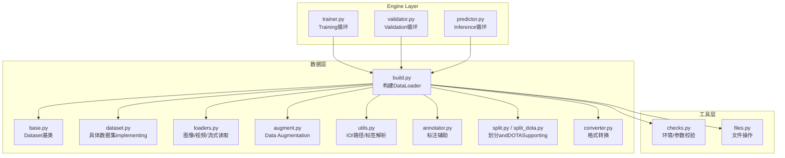
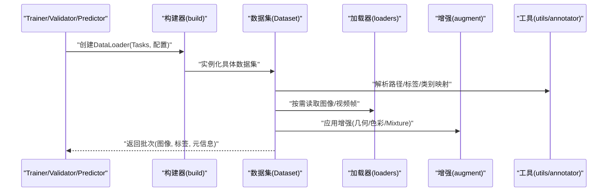
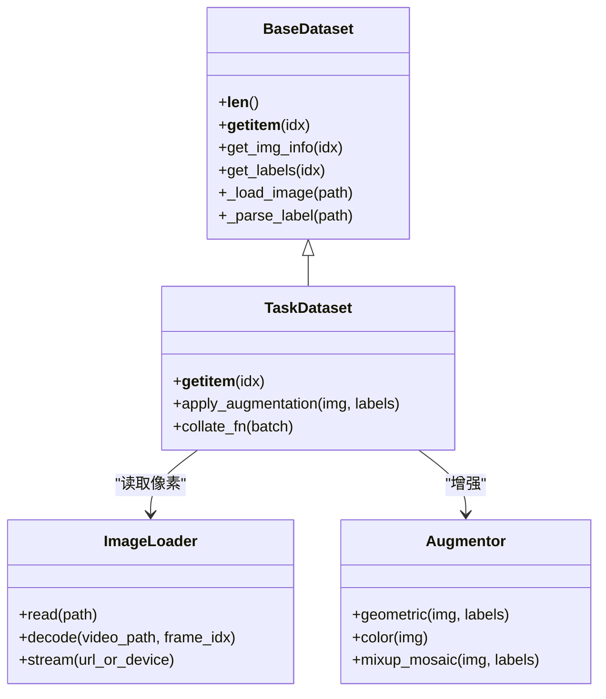
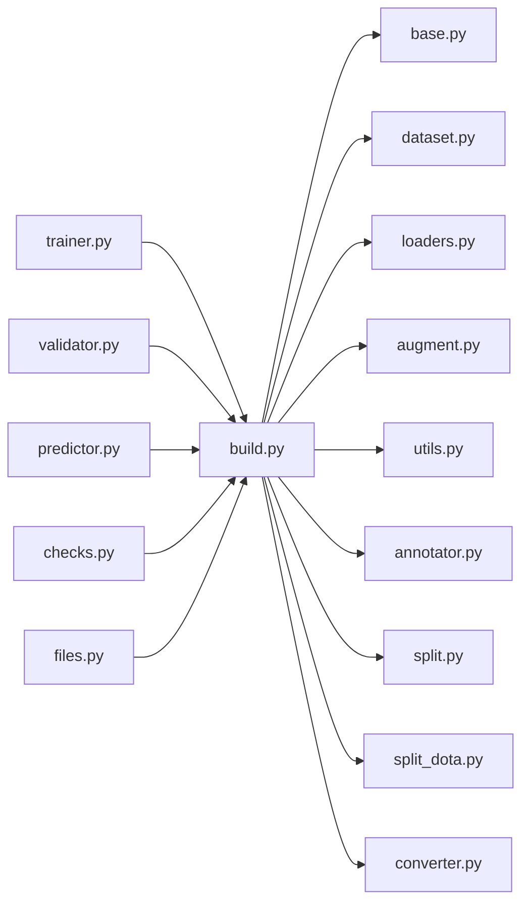

# Data Loading器

<cite>
**Files Referenced in This Document**
- [ultralytics/data/__init__.py](file://ultralytics/data/__init__.py)
- [ultralytics/data/base.py](file://ultralytics/data/base.py)
- [ultralytics/data/build.py](file://ultralytics/data/build.py)
- [ultralytics/data/dataset.py](file://ultralytics/data/dataset.py)
- [ultralytics/data/loaders.py](file://ultralytics/data/loaders.py)
- [ultralytics/data/augment.py](file://ultralytics/data/augment.py)
- [ultralytics/data/utils.py](file://ultralytics/data/utils.py)
- [ultralytics/data/annotator.py](file://ultralytics/data/annotator.py)
- [ultralytics/data/split.py](file://ultralytics/data/split.py)
- [ultralytics/data/split_dota.py](file://ultralytics/data/split_dota.py)
- [ultralytics/data/converter.py](file://ultralytics/data/converter.py)
- [ultralytics/engine/trainer.py](file://ultralytics/engine/trainer.py)
- [ultralytics/engine/validator.py](file://ultralytics/engine/validator.py)
- [ultralytics/engine/predictor.py](file://ultralytics/engine/predictor.py)
- [ultralytics/utils/checks.py](file://ultralytics/utils/checks.py)
- [ultralytics/utils/files.py](file://ultralytics/utils/files.py)
</cite>

## Table of Contents
1. [Introduction](#Introduction)
2. [Project Structure](#Project Structure)
3. [Core Components](#Core Components)
4. [Architecture Overview](#Architecture Overview)
5. [Detailed Component Analysis](#Detailed Component Analysis)
6. [Dependency Analysis](#Dependency Analysis)
7. [Performance Considerations](#Performance Considerations)
8. [Troubleshooting Guide](#Troubleshooting Guide)
9. [Conclusion](#Conclusion)
10. [Appendix](#Appendix)

## Introduction
本技术Documentation聚焦于 YOLO-Master 的Data Loading器系统，系统性阐述 DataLoader 的架构设计、异步and多进程加载、批处理策略、内存管理、数据集缓存and预取、自动识别and加载主流格式（YOLO、COCO、VOC、ImageNet etc.）、自定义Data Loading器的开发接口and最佳实践、数据Validationand质量检查机制，Centered onandtargeting大数据集的性能Optimization技巧and常见问题诊断方案。目标是帮助读者while不深入源码细节的前提下，也能高效配置、扩展and调优数据管线。

## Project Structure
Data Loading相关代码集中while ultralytics/data 包中，并andTraining/Validation/Prediction引擎紧密集成：
- 入口and构建：data/__init__.py、data/build.py
- 数据集抽象andimplementing：data/base.py、data/dataset.py
- 数据源读取：data/loaders.py
- 增强and工具：data/augment.py、data/utils.py、data/annotator.py
- 分割and转换：data/split.py、data/split_dota.py、data/converter.py
- 上层Calls方：engine/trainer.py、engine/validator.py、engine/predictor.py
- 通用校验and文件工具：utils/checks.py、utils/files.py

Figure Source
- [ultralytics/data/build.py](file://ultralytics/data/build.py)
- [ultralytics/data/base.py](file://ultralytics/data/base.py)
- [ultralytics/data/dataset.py](file://ultralytics/data/dataset.py)
- [ultralytics/data/loaders.py](file://ultralytics/data/loaders.py)
- [ultralytics/data/augment.py](file://ultralytics/data/augment.py)
- [ultralytics/data/utils.py](file://ultralytics/data/utils.py)
- [ultralytics/data/annotator.py](file://ultralytics/data/annotator.py)
- [ultralytics/data/split.py](file://ultralytics/data/split.py)
- [ultralytics/data/split_dota.py](file://ultralytics/data/split_dota.py)
- [ultralytics/data/converter.py](file://ultralytics/data/converter.py)
- [ultralytics/engine/trainer.py](file://ultralytics/engine/trainer.py)
- [ultralytics/engine/validator.py](file://ultralytics/engine/validator.py)
- [ultralytics/engine/predictor.py](file://ultralytics/engine/predictor.py)
- [ultralytics/utils/checks.py](file://ultralytics/utils/checks.py)
- [ultralytics/utils/files.py](file://ultralytics/utils/files.py)

Section Source
- [ultralytics/data/__init__.py](file://ultralytics/data/__init__.py)
- [ultralytics/data/build.py](file://ultralytics/data/build.py)
- [ultralytics/data/base.py](file://ultralytics/data/base.py)
- [ultralytics/data/dataset.py](file://ultralytics/data/dataset.py)
- [ultralytics/data/loaders.py](file://ultralytics/data/loaders.py)
- [ultralytics/data/augment.py](file://ultralytics/data/augment.py)
- [ultralytics/data/utils.py](file://ultralytics/data/utils.py)
- [ultralytics/data/annotator.py](file://ultralytics/data/annotator.py)
- [ultralytics/data/split.py](file://ultralytics/data/split.py)
- [ultralytics/data/split_dota.py](file://ultralytics/data/split_dota.py)
- [ultralytics/data/converter.py](file://ultralytics/data/converter.py)
- [ultralytics/engine/trainer.py](file://ultralytics/engine/trainer.py)
- [ultralytics/engine/validator.py](file://ultralytics/engine/validator.py)
- [ultralytics/engine/predictor.py](file://ultralytics/engine/predictor.py)
- [ultralytics/utils/checks.py](file://ultralytics/utils/checks.py)
- [ultralytics/utils/files.py](file://ultralytics/utils/files.py)

## Core Components
- 构建器（Build）
  - 负责根据Tasks类型and数据配置创建合适的 Dataset and DataLoader，统一Encapsulates多进程、缓冲、打乱、裁剪and填充etc.策略。
- 数据集抽象（Base/Dataset）
  - 定义统一的索引访问、元信息获取、标签解析and增强流水线接口；具体数据集implementing继承该抽象Centered on适配不同格式。
- 数据源读取（Loaders）
  - provides图像、视频、摄像头、网络流etc.多种输入源的解码and预处理capabilities，并输出模型所需的张量或中间表示。
- 增强and工具（Augment/Utils/Annotator）
  - Encapsulates常用几何and色彩增强、边界框/掩码/关键点变换一致性保证、路径and标签解析、统计andVisualization辅助。
- 划分and转换（Split/Converter）
  - provides数据集切分（含 DOTA etc.旋转目标场景）and格式互转（such as COCO↔YOLO），便于统一Training流程。
- 引擎集成（Trainer/Validator/Predictor）
  - whileTraining、Validation、Inference阶段按需创建 DataLoader，控制 epoch 内迭代、批调度and进度上报。

Section Source
- [ultralytics/data/build.py](file://ultralytics/data/build.py)
- [ultralytics/data/base.py](file://ultralytics/data/base.py)
- [ultralytics/data/dataset.py](file://ultralytics/data/dataset.py)
- [ultralytics/data/loaders.py](file://ultralytics/data/loaders.py)
- [ultralytics/data/augment.py](file://ultralytics/data/augment.py)
- [ultralytics/data/utils.py](file://ultralytics/data/utils.py)
- [ultralytics/data/annotator.py](file://ultralytics/data/annotator.py)
- [ultralytics/data/split.py](file://ultralytics/data/split.py)
- [ultralytics/data/split_dota.py](file://ultralytics/data/split_dota.py)
- [ultralytics/data/converter.py](file://ultralytics/data/converter.py)
- [ultralytics/engine/trainer.py](file://ultralytics/engine/trainer.py)
- [ultralytics/engine/validator.py](file://ultralytics/engine/validator.py)
- [ultralytics/engine/predictor.py](file://ultralytics/engine/predictor.py)

## Architecture Overview
下图展示了从上层引擎toData Loading各层的Calls关系and职责分工。

Figure Source
- [ultralytics/engine/trainer.py](file://ultralytics/engine/trainer.py)
- [ultralytics/engine/validator.py](file://ultralytics/engine/validator.py)
- [ultralytics/engine/predictor.py](file://ultralytics/engine/predictor.py)
- [ultralytics/data/build.py](file://ultralytics/data/build.py)
- [ultralytics/data/dataset.py](file://ultralytics/data/dataset.py)
- [ultralytics/data/loaders.py](file://ultralytics/data/loaders.py)
- [ultralytics/data/augment.py](file://ultralytics/data/augment.py)
- [ultralytics/data/utils.py](file://ultralytics/data/utils.py)
- [ultralytics/data/annotator.py](file://ultralytics/data/annotator.py)

## Detailed Component Analysis

### 构建器and DataLoader 装配
- 职责
  - 根据Tasks（检测/分割/姿态/分类/Trackingetc.）和数据配置选择合适的数据集implementing。
  - 组装 DataLoader：设置 batch_size、num_workers、prefetch_factor、drop_last、shuffle、pin_memory etc.关键参数。
  - forValidation/测试阶段关闭随机增强and打乱，确保可重复性。
- 关键要点
  - 多进程 worker 数量需Combining CPU 核数、磁盘吞吐and GPU 显存综合权衡。
  - prefetch_factor and pin_memory 对 GPU Training吞吐影响显著。
  - 对于大分辨率或多尺度Training，建议启用动态尺寸批处理and padding 策略Centered on减少无效计算。

Section Source
- [ultralytics/data/build.py](file://ultralytics/data/build.py)
- [ultralytics/engine/trainer.py](file://ultralytics/engine/trainer.py)
- [ultralytics/engine/validator.py](file://ultralytics/engine/validator.py)
- [ultralytics/engine/predictor.py](file://ultralytics/engine/predictor.py)

### 数据集抽象and具体implementing
- 抽象基类
  - 定义 __len__、__getitem__、get_img_info、get_labels etc.标准接口，屏蔽底层差异。
  - 维护样本索引、类别映射、标签归一化and坐标体系转换。
- 具体implementing
  - 针对 YOLO、COCO、VOC、ImageNet etc.格式provides解析逻辑，统一输出内部表示。
  - Supporting多种Tasks标签：边界框、多边形/掩码、关键点、轨迹 ID etc.。
- 索引and缓存
  - Via索引列表避免重复 IO；Optional将高频元信息（such as类别统计、尺寸分布）缓存至本地Centered on提升启动速度。

Figure Source
- [ultralytics/data/base.py](file://ultralytics/data/base.py)
- [ultralytics/data/dataset.py](file://ultralytics/data/dataset.py)
- [ultralytics/data/loaders.py](file://ultralytics/data/loaders.py)
- [ultralytics/data/augment.py](file://ultralytics/data/augment.py)

Section Source
- [ultralytics/data/base.py](file://ultralytics/data/base.py)
- [ultralytics/data/dataset.py](file://ultralytics/data/dataset.py)
- [ultralytics/data/loaders.py](file://ultralytics/data/loaders.py)
- [ultralytics/data/augment.py](file://ultralytics/data/augment.py)

### 数据源读取and解码
- Supporting的输入
  - 单图、批量图片、视频文件、摄像头设备、网络流（HTTP/RTSP）。
- 解码and预处理
  - Uses高效解码库进行 JPEG/PNG/H264 etc.格式解码；必要时进行颜色空间转换、缩放and归一化。
  - 视频按帧采样或按时间戳读取，保持时序一致性（适用于TrackingTasks）。
- 错误恢复
  - 对损坏文件或不可用设备provides降级策略（跳过、重试、告警）。

Section Source
- [ultralytics/data/loaders.py](file://ultralytics/data/loaders.py)
- [ultralytics/utils/files.py](file://ultralytics/utils/files.py)

### Data Augmentationand一致性变换
- 几何增强
  - 随机裁剪、翻转、仿射、马赛克、MixUp/CutMix etc.，同时更新边界框、掩码、关键点坐标。
- 色彩增强
  - 亮度、对比度、饱和度、色调抖动，提升鲁棒性。
- 一致性保障
  - 所有变换对图像and标签同步应用，确保坐标and像素对齐。
- Tasks感知
  - 针对不同Tasks（检测/分割/姿态）采用差异化增强组合，避免破坏语义。

Section Source
- [ultralytics/data/augment.py](file://ultralytics/data/augment.py)
- [ultralytics/data/annotator.py](file://ultralytics/data/annotator.py)

### 标签解析and格式自动识别
- 自动识别
  - 依据Table of Contents结构and配置文件推断数据集格式（YOLO、COCO、VOC、ImageNet etc.）。
- 标签归一化
  - 将不同格式的坐标、类别、可见性etc.统一转换for内部表示，供后续增强and损失计算Uses。
- 转换工具
  - provides COCO↔YOLO etc.格式互转脚本，便于Migrationand复用。

Section Source
- [ultralytics/data/utils.py](file://ultralytics/data/utils.py)
- [ultralytics/data/converter.py](file://ultralytics/data/converter.py)

### 数据集划分and DOTA Supporting
- 常规划分
  - 按比例或分层抽样生成 train/val/test 子集，保证类别分布均衡。
- DOTA 旋转目标
  - provides专用划分and标签处理，Supporting任意方向矩形框and多边形标注。

Section Source
- [ultralytics/data/split.py](file://ultralytics/data/split.py)
- [ultralytics/data/split_dota.py](file://ultralytics/data/split_dota.py)

### 引擎集成and生命周期
- Training
  - 开启 shuffle and增强，按 epoch 迭代，Supporting早停and断点续训。
- Validation/Evaluation
  - 关闭随机增强and打乱，固定顺序Centered on保证Metrics可比性。
- Inference
  - Supporting单图/批量/流式输入，按需调整批大小and预取深度。

Section Source
- [ultralytics/engine/trainer.py](file://ultralytics/engine/trainer.py)
- [ultralytics/engine/validator.py](file://ultralytics/engine/validator.py)
- [ultralytics/engine/predictor.py](file://ultralytics/engine/predictor.py)

## Dependency Analysis
- 耦合and内聚
  - build.py 作for装配中心，低耦合地组合 dataset、loader、augment etc.Modules。
  - dataset and loader/augment 之间Via明确接口交互，便于替换and扩展。
- External Dependencies
  - 文件and路径操作由 utils/files.py provides；环境and参数校验由 utils/checks.py 负责。
- 潜while环路
  - 当前分层清晰，未见直接循环导入风险；新增Modules应遵循“上层依赖下层”的原则。

Figure Source
- [ultralytics/data/build.py](file://ultralytics/data/build.py)
- [ultralytics/data/base.py](file://ultralytics/data/base.py)
- [ultralytics/data/dataset.py](file://ultralytics/data/dataset.py)
- [ultralytics/data/loaders.py](file://ultralytics/data/loaders.py)
- [ultralytics/data/augment.py](file://ultralytics/data/augment.py)
- [ultralytics/data/utils.py](file://ultralytics/data/utils.py)
- [ultralytics/data/annotator.py](file://ultralytics/data/annotator.py)
- [ultralytics/data/split.py](file://ultralytics/data/split.py)
- [ultralytics/data/split_dota.py](file://ultralytics/data/split_dota.py)
- [ultralytics/data/converter.py](file://ultralytics/data/converter.py)
- [ultralytics/engine/trainer.py](file://ultralytics/engine/trainer.py)
- [ultralytics/engine/validator.py](file://ultralytics/engine/validator.py)
- [ultralytics/engine/predictor.py](file://ultralytics/engine/predictor.py)
- [ultralytics/utils/checks.py](file://ultralytics/utils/checks.py)
- [ultralytics/utils/files.py](file://ultralytics/utils/files.py)

## Performance Considerations
- 多进程and预取
  - num_workers：受限于 CPU 核数and磁盘并发读写capabilities；I/O 密集场景可适当提高。
  - prefetch_factor：增大可减少 GPU 空闲etc.待，但会占用更多内存。
  - pin_memory：GPU Training时建议开启，加速主机to设备传输。
- 批处理策略
  - 动态尺寸批处理and padding：减少无效计算，提升吞吐。
  - drop_last：whileTraining阶段丢弃不足一批的样本，稳定统计andGradient更新。
- 缓存and预读
  - 元信息缓存：类别统计、尺寸分布、索引列表etc.可持久化，缩短冷启动时间。
  - 图像缓存：小数据集可while内存缓存图像，避免重复解码；大数据集慎用Centered on免 OOM。
- 增强开销
  - 复杂增强（Mosaic/MixUp）whileTraining初期收益高，后期可逐步降低频率或强度。
  - 将 CPU 增强and GPU Training并行化，避免阻塞主线程。
- 存储and文件系统
  - Uses SSD/NVMe 或分布式文件系统（such as Lustre/GPFS）提升随机读取性能。
  - 合理组织Table of Contents结构，避免单Table of Contents下文件过多导致遍历缓慢。

[This section provides general guidance and does not directly analyze specific files]

## Troubleshooting Guide
- 常见症状
  - Training卡顿/吞吐低：检查 num_workers、prefetch_factor、pin_memory and磁盘 I/O。
  - 内存溢出：减小 batch_size、worker 数或关闭图像缓存；确认 pin_memory 是否必要。
  - 标签错位/形状异常：核对坐标体系and增强一致性；检查类别映射and标签格式。
  - 无法读取视频/网络流：确认解码库安装、网络连通性and设备权限。
- 定位步骤
  - 打印 DataLoader 配置and样本元信息，Validation路径and标签解析正确。
  - Uses最小复现集（such as coco8）Validation环境，再逐步扩大规模。
  - 监控 CPU/GPU/磁盘利用率，定位bottlenecks环节。
- 修复建议
  - 调整 worker and预取参数；启用/禁用 pin_memory 对比效果。
  - 对损坏样本进行过滤或修复；对不一致标签进行清洗。
  - 升级解码库或切换后端（CPU/GPU 解码）Centered on改善稳定性。

Section Source
- [ultralytics/utils/checks.py](file://ultralytics/utils/checks.py)
- [ultralytics/utils/files.py](file://ultralytics/utils/files.py)
- [ultralytics/data/utils.py](file://ultralytics/data/utils.py)
- [ultralytics/data/loaders.py](file://ultralytics/data/loaders.py)

## Conclusion
YOLO-Master 的Data Loading器系统Via清晰的层次划分andModules化设计，implementing了多格式、多Tasks、多输入源的高性能数据管线。借助多进程、预取、缓存and增强流水线，系统while大规模数据集上仍能保持良好吞吐and可Extensibility。遵循本文的配置andOptimization建议，并Combining实际硬件and数据特征进行调参，可获得稳定的端to端TrainingandInference体验。

## Appendix

### 自定义Data Loading器开发接口and最佳实践
- 继承基类
  - 继承 BaseDataset，implementing __getitem__、get_img_info、get_labels etc.接口。
- 标签and坐标
  - 统一坐标体系and归一化规则，确保增强一致性。
- 增强and批处理
  - while __getitem__ 中应用Tasks相关的增强；while collate_fn 中完成变长序列and padding。
- 错误处理
  - 对缺失文件、损坏标注进行容错andLogging，避免中断整个Training。
- 性能建议
  - 优先while worker 中进行 I/O and轻量预处理；将重型计算移至 GPU 或离线预处理。
  - 合理Uses缓存and预取，平衡内存and吞吐。

Section Source
- [ultralytics/data/base.py](file://ultralytics/data/base.py)
- [ultralytics/data/dataset.py](file://ultralytics/data/dataset.py)
- [ultralytics/data/augment.py](file://ultralytics/data/augment.py)
- [ultralytics/data/utils.py](file://ultralytics/data/utils.py)

### 数据Validationand质量检查机制
- 路径and存while性校验
  - 检查图像/视频路径是否存while、可读。
- 标签完整性
  - 校验类别范围、坐标有效性、掩码/关键点维度一致性。
- 统计and分布
  - 统计类别频次、尺寸分布，发现长尾and异常样本。
- 自动化报告
  - 生成数据质量报告，辅助人工复核and清洗。

Section Source
- [ultralytics/utils/checks.py](file://ultralytics/utils/checks.py)
- [ultralytics/data/utils.py](file://ultralytics/data/utils.py)
- [ultralytics/data/annotator.py](file://ultralytics/data/annotator.py)

### 不同场景下的Optimization技巧
- 小规模快速实验
  - 较小 num_workers、关闭复杂增强、启用图像缓存。
- 大规模while线Training
  - 较大 num_workers、适度 prefetch_factor、动态尺寸批处理、SSD 存储。
- 视频/流式Inference
  - 逐帧解码、固定步长采样、GPU 解码后端、限制队列长度。
- Edge Deployment
  - 减少增强、静态尺寸、量化andExportOptimization，降低内存and延迟。

[This section provides general guidance and does not directly analyze specific files]