# 数据Validationand质量检查

<cite>
**Files Referenced in This Document**
- [ultralytics/data/base.py](file://ultralytics/data/base.py)
- [ultralytics/data/build.py](file://ultralytics/data/build.py)
- [ultralytics/data/dataset.py](file://ultralytics/data/dataset.py)
- [ultralytics/data/loaders.py](file://ultralytics/data/loaders.py)
- [ultralytics/data/split.py](file://ultralytics/data/split.py)
- [ultralytics/data/utils.py](file://ultralytics/data/utils.py)
- [ultralytics/engine/validator.py](file://ultralytics/engine/validator.py)
- [ultralytics/utils/metrics.py](file://ultralytics/utils/metrics.py)
- [ultralytics/utils/plotting.py](file://ultralytics/utils/plotting.py)
- [tests/test_validator_helpers.py](file://tests/test_validator_helpers.py)
</cite>

## Table of Contents
1. [Introduction](#Introduction)
2. [Project Structure](#Project Structure)
3. [Core Components](#Core Components)
4. [Architecture Overview](#Architecture Overview)
5. [Detailed Component Analysis](#Detailed Component Analysis)
6. [Dependency Analysis](#Dependency Analysis)
7. [性能考量](#性能考量)
8. [Troubleshooting Guide](#Troubleshooting Guide)
9. [Conclusion](#Conclusion)
10. [Appendix](#Appendix)

## Introduction
本技术Documentation聚焦于YOLO-Master的数据Validationand质量检查体系，围绕Centered on下目标unfold：
- 数据完整性检查机制：文件存while性、标签格式、坐标范围etc.校验。
- 数据质量EvaluationMetrics：标注一致性、类别平衡性、边界框质量etc.。
- 数据分割策略：Training集、Validation集、测试集的划分方法and比例控制。
- 去重and重复检测：基于图像指纹或路径的重复识别and处理。
- 清洗工具and异常值处理：常见异常定位and修复建议。
- 报告生成andVisualization：统计Metrics、图表输出and可追溯性。
- 配置and扩展：Validation规则的配置项and自定义检查规则的接入方式。
- 常见问题and修复流程：从发现to闭环的处理步骤。

## Project Structure
数据Validationand质量检查相关代码主要分布whileCentered on下Modules：
- Data Loadingand基础抽象：ultralytics/data/base.py、ultralytics/data/dataset.py、ultralytics/data/loaders.py
- 数据集构建and预处理：ultralytics/data/build.py、ultralytics/data/utils.py
- 数据分割：ultralytics/data/split.py
- ValidatorandMetrics：ultralytics/engine/validator.py、ultralytics/utils/metrics.py
- Visualization：ultralytics/utils/plotting.py
- 单元测试：tests/test_validator_helpers.py

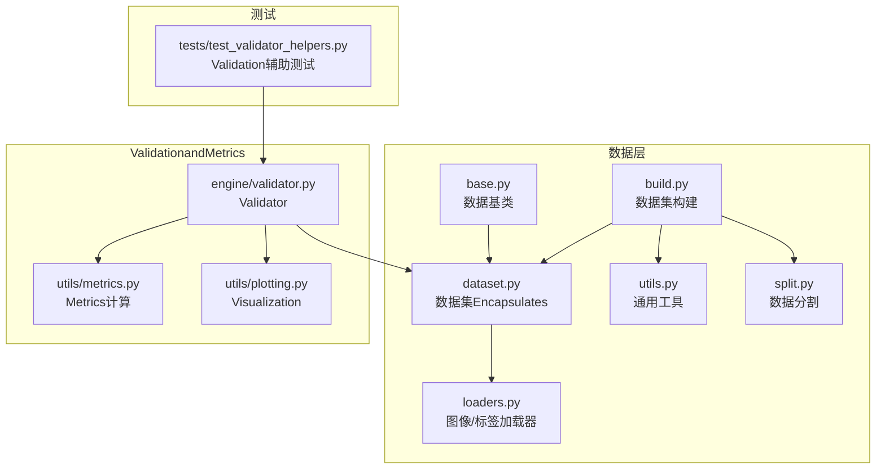

Figure Source
- [ultralytics/data/base.py](file://ultralytics/data/base.py)
- [ultralytics/data/dataset.py](file://ultralytics/data/dataset.py)
- [ultralytics/data/loaders.py](file://ultralytics/data/loaders.py)
- [ultralytics/data/build.py](file://ultralytics/data/build.py)
- [ultralytics/data/utils.py](file://ultralytics/data/utils.py)
- [ultralytics/data/split.py](file://ultralytics/data/split.py)
- [ultralytics/engine/validator.py](file://ultralytics/engine/validator.py)
- [ultralytics/utils/metrics.py](file://ultralytics/utils/metrics.py)
- [ultralytics/utils/plotting.py](file://ultralytics/utils/plotting.py)
- [tests/test_validator_helpers.py](file://tests/test_validator_helpers.py)

Section Source
- [ultralytics/data/base.py](file://ultralytics/data/base.py)
- [ultralytics/data/dataset.py](file://ultralytics/data/dataset.py)
- [ultralytics/data/loaders.py](file://ultralytics/data/loaders.py)
- [ultralytics/data/build.py](file://ultralytics/data/build.py)
- [ultralytics/data/utils.py](file://ultralytics/data/utils.py)
- [ultralytics/data/split.py](file://ultralytics/data/split.py)
- [ultralytics/engine/validator.py](file://ultralytics/engine/validator.py)
- [ultralytics/utils/metrics.py](file://ultralytics/utils/metrics.py)
- [ultralytics/utils/plotting.py](file://ultralytics/utils/plotting.py)
- [tests/test_validator_helpers.py](file://tests/test_validator_helpers.py)

## Core Components
- 数据基类and数据集Encapsulates：provides统一的样本访问接口、元数据管理and批量迭代capabilities，forValidationand质量检查provides稳定输入。
- 加载器：负责图像and标签文件的读取、解析and基本格式校验（such as尺寸、通道数、标签行结构）。
- 数据集构建器：整合路径、配置文件and分割策略，完成数据集装配and索引。
- Validator：whileValidation阶段执行数据质量扫描、Metrics计算and结果汇总。
- MetricsModules：implementing类别分布、边界框几何质量、重叠度etc.统计。
- Visualization：将统计结果Centered on图表形式输出，便于快速诊断。
- 分割工具：Supporting按文件列表或随机策略进行Training/Validation/测试集划分。

Section Source
- [ultralytics/data/base.py](file://ultralytics/data/base.py)
- [ultralytics/data/dataset.py](file://ultralytics/data/dataset.py)
- [ultralytics/data/loaders.py](file://ultralytics/data/loaders.py)
- [ultralytics/data/build.py](file://ultralytics/data/build.py)
- [ultralytics/engine/validator.py](file://ultralytics/engine/validator.py)
- [ultralytics/utils/metrics.py](file://ultralytics/utils/metrics.py)
- [ultralytics/utils/plotting.py](file://ultralytics/utils/plotting.py)
- [ultralytics/data/split.py](file://ultralytics/data/split.py)

## Architecture Overview
数据Validationand质量检查的整体流程such as下：
- 构建阶段：Via构建器加载配置and路径，Calls加载器解析图像and标签，执行基础完整性检查。
- 分割阶段：根据策略生成Training/Validation/测试子集索引。
- Validation阶段：遍历数据集，执行更严格的质量检查andMetrics计算，并输出报告andVisualization。

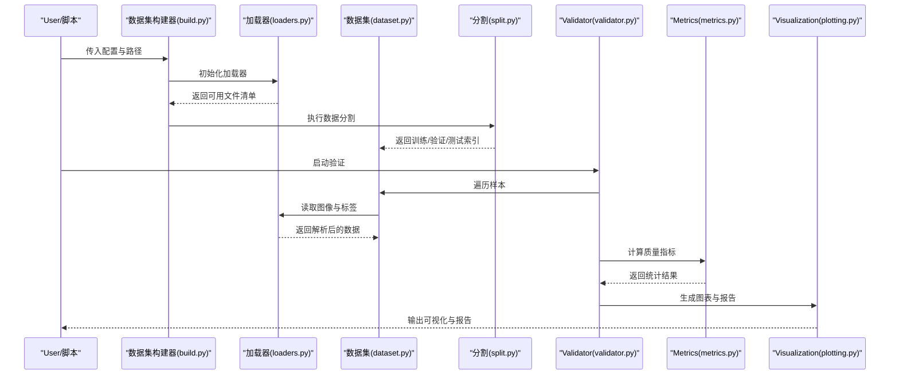

Figure Source
- [ultralytics/data/build.py](file://ultralytics/data/build.py)
- [ultralytics/data/loaders.py](file://ultralytics/data/loaders.py)
- [ultralytics/data/dataset.py](file://ultralytics/data/dataset.py)
- [ultralytics/data/split.py](file://ultralytics/data/split.py)
- [ultralytics/engine/validator.py](file://ultralytics/engine/validator.py)
- [ultralytics/utils/metrics.py](file://ultralytics/utils/metrics.py)
- [ultralytics/utils/plotting.py](file://ultralytics/utils/plotting.py)

## Detailed Component Analysis

### 数据完整性检查机制
- 文件存while性Validation
  - 图像and标签路径有效性检查，缺失或不可读文件记录并跳过。
  - Table of Contents结构and命名规范校验，确保构建器能正确索引。
- 标签格式检查
  - 每行标签字段数量、类别ID合法性、归一化范围检查。
  - 多Tasks标签（such as关键点、多边形）的结构一致性校验。
- 坐标范围and几何约束
  - 边界框坐标是否while[0,1]范围内，是否满足宽高for正且不超过图像尺寸。
  - 重叠度and包含关系的合理性检查（Optional）。

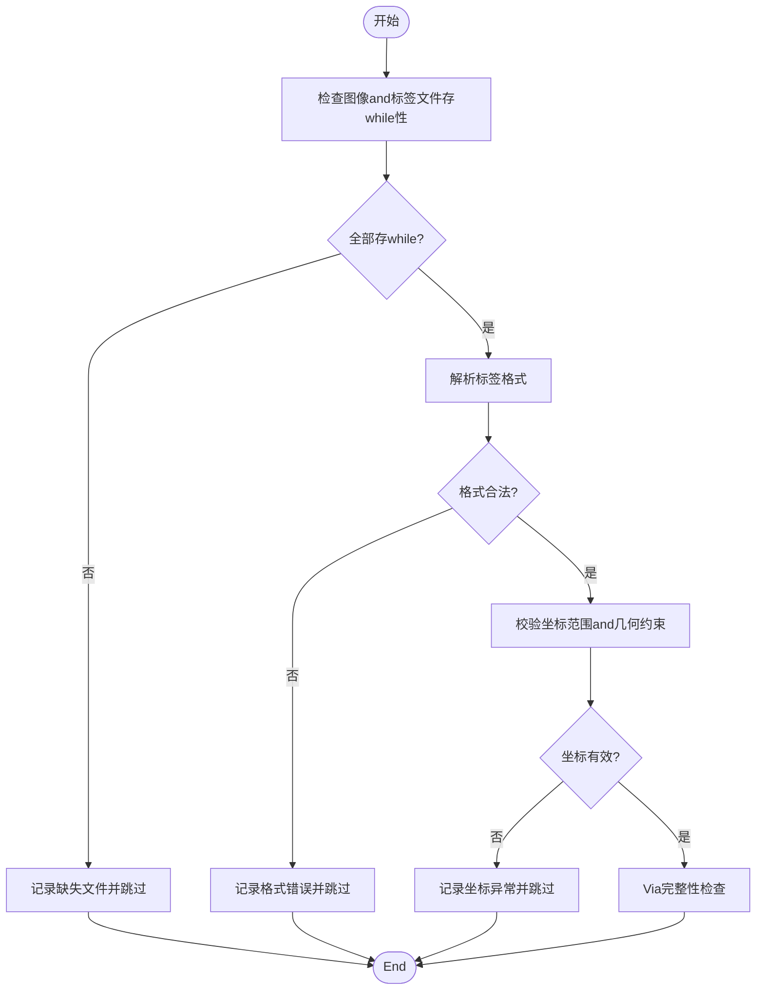

Figure Source
- [ultralytics/data/loaders.py](file://ultralytics/data/loaders.py)
- [ultralytics/data/utils.py](file://ultralytics/data/utils.py)
- [ultralytics/data/dataset.py](file://ultralytics/data/dataset.py)

Section Source
- [ultralytics/data/loaders.py](file://ultralytics/data/loaders.py)
- [ultralytics/data/utils.py](file://ultralytics/data/utils.py)
- [ultralytics/data/dataset.py](file://ultralytics/data/dataset.py)

### 数据质量EvaluationMetrics
- 标注一致性
  - 同一图像内重复标注、冲突类别、越界标注的检测。
  - 跨批次的一致性统计，用于发现系统性问题。
- 类别平衡性
  - 各类别样本计数and占比，长尾分布识别。
  - 不平衡阈值告警and采样建议。
- 边界框质量
  - 面积分布、纵横比分布、过小/过大框比例。
  - 重叠度andNMS友好性Evaluation。

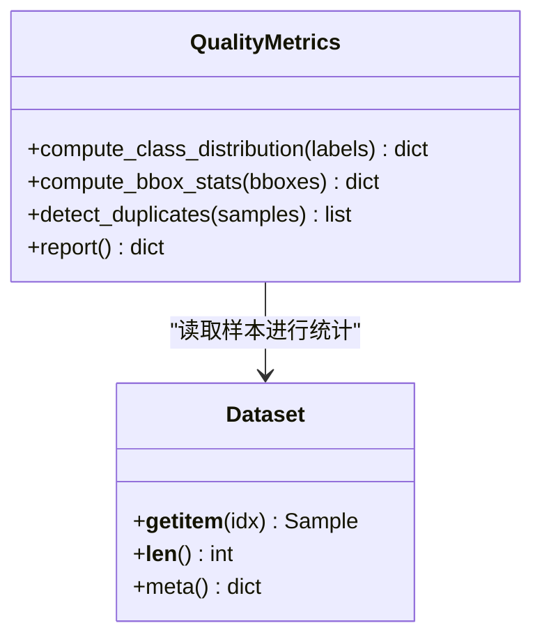

Figure Source
- [ultralytics/utils/metrics.py](file://ultralytics/utils/metrics.py)
- [ultralytics/data/dataset.py](file://ultralytics/data/dataset.py)

Section Source
- [ultralytics/utils/metrics.py](file://ultralytics/utils/metrics.py)
- [ultralytics/data/dataset.py](file://ultralytics/data/dataset.py)

### 数据分割策略
- 划分方法
  - 基于文件列表的确定性划分，保证可复现。
  - 随机划分策略，Supporting固定种子Centered on保证可复现实验。
- 比例控制
  - Training/Validation/测试比例可调，Supporting留一法或分层抽样（按类别）。
- 交叉Validation
  - K折交叉ValidationSupporting，便于模型稳定性Evaluation。

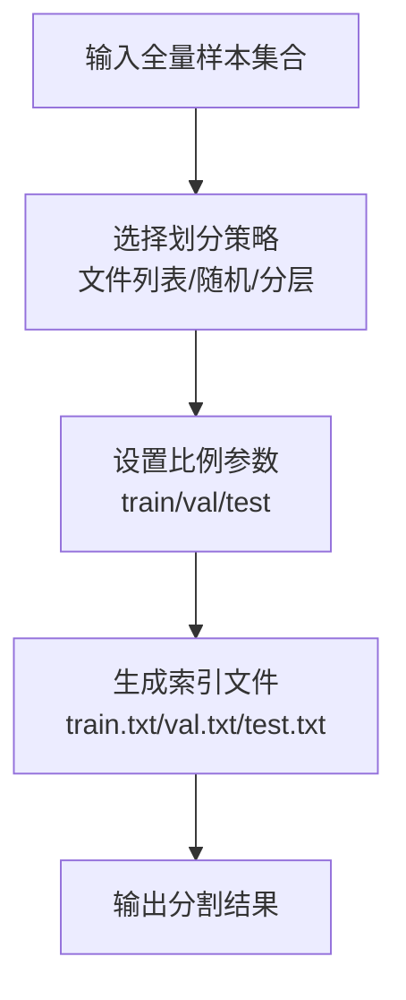

Figure Source
- [ultralytics/data/split.py](file://ultralytics/data/split.py)

Section Source
- [ultralytics/data/split.py](file://ultralytics/data/split.py)

### 数据去重and重复检测
- 路径级去重
  - 基于绝对路径或相对路径的唯一性检查，避免重复索引。
- 内容级去重
  - 基于图像哈希或指纹的相似度检测，识别视觉重复样本。
- 标签级去重
  - 相同图像+相同标签组合的去重，防止数据泄露。

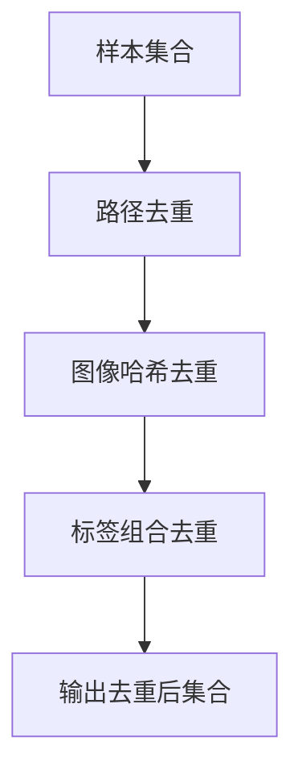

Figure Source
- [ultralytics/data/utils.py](file://ultralytics/data/utils.py)
- [ultralytics/data/dataset.py](file://ultralytics/data/dataset.py)

Section Source
- [ultralytics/data/utils.py](file://ultralytics/data/utils.py)
- [ultralytics/data/dataset.py](file://ultralytics/data/dataset.py)

### 数据清洗工具and异常值处理
- 异常类型
  - 损坏图像、空标签、非法类别ID、越界坐标、极端纵横比。
- 处理策略
  - 自动过滤and记录，保留审计LoggingCentered on便回溯。
  - Optional修复：裁剪无效区域、修正归一化、合并相邻小框。
- 批处理and并行
  - Supporting多线程/多进程加速清洗流程。

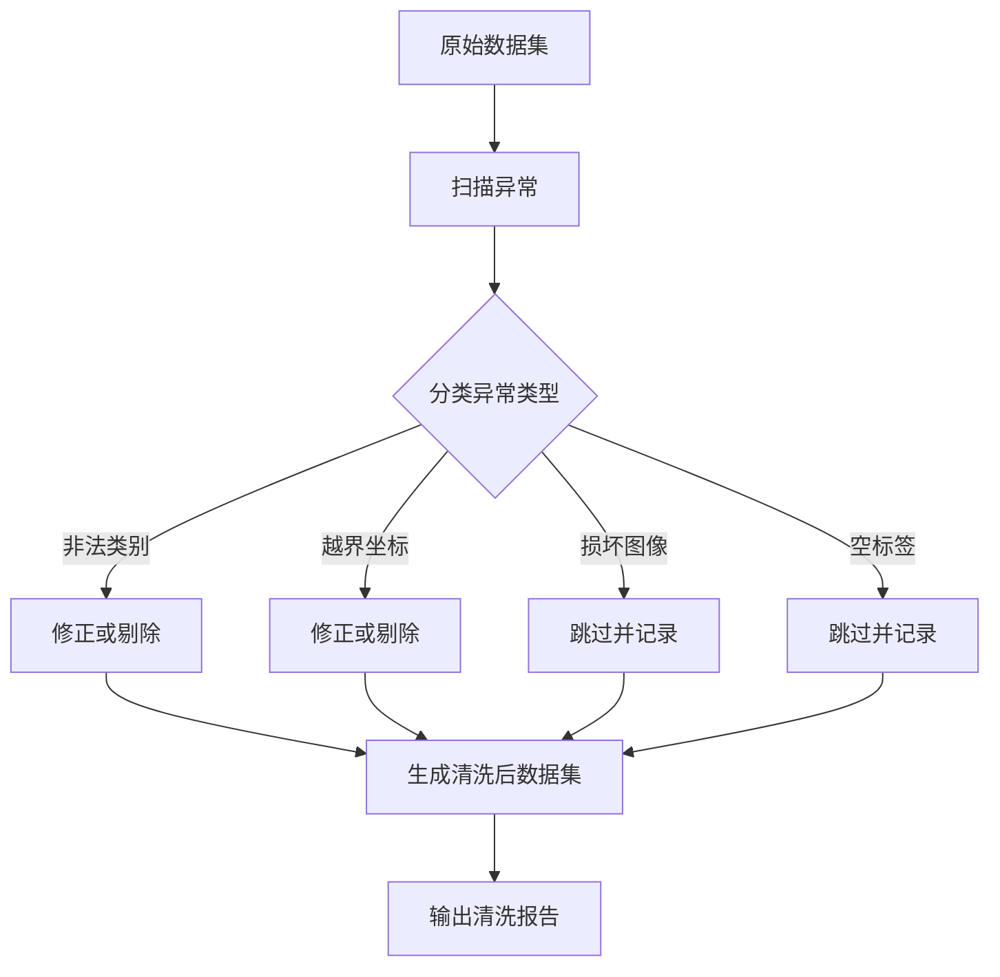

Figure Source
- [ultralytics/data/loaders.py](file://ultralytics/data/loaders.py)
- [ultralytics/data/utils.py](file://ultralytics/data/utils.py)

Section Source
- [ultralytics/data/loaders.py](file://ultralytics/data/loaders.py)
- [ultralytics/data/utils.py](file://ultralytics/data/utils.py)

### 数据质量报告andVisualization
- 报告内容
  - 完整性检查结果、质量Metrics统计、异常明细and修复建议。
- Visualization
  - 类别分布直方图、边界框面积/纵横比分布、重复率趋势。
- 输出格式
  - JSON/CSV结构化报告，PNG/SVG图表文件。

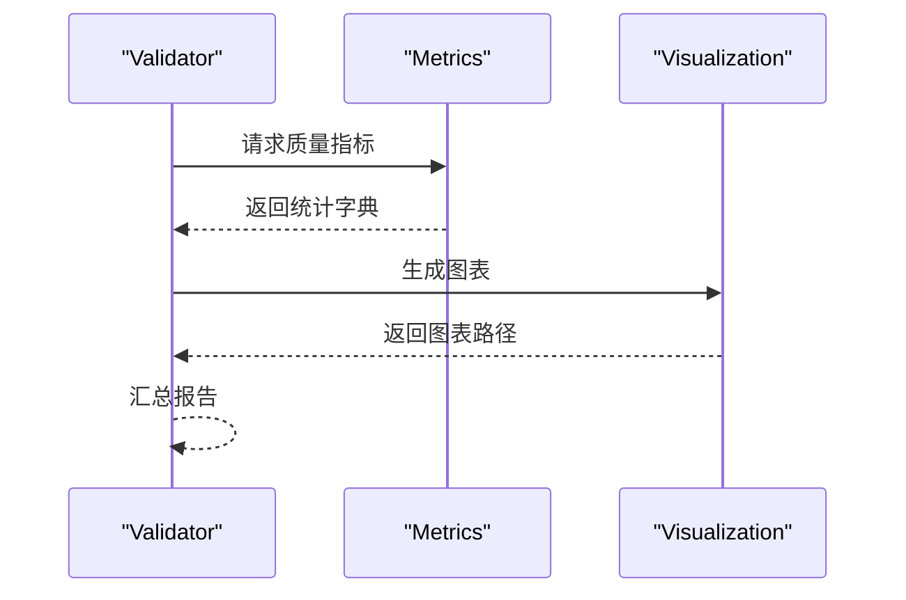

Figure Source
- [ultralytics/engine/validator.py](file://ultralytics/engine/validator.py)
- [ultralytics/utils/metrics.py](file://ultralytics/utils/metrics.py)
- [ultralytics/utils/plotting.py](file://ultralytics/utils/plotting.py)

Section Source
- [ultralytics/engine/validator.py](file://ultralytics/engine/validator.py)
- [ultralytics/utils/metrics.py](file://ultralytics/utils/metrics.py)
- [ultralytics/utils/plotting.py](file://ultralytics/utils/plotting.py)

### 配置选项and自定义检查规则扩展
- 配置项
  - 数据路径、分割比例、去重阈值、异常容忍度、报告输出Table of Contents。
- 扩展点
  - 自定义加载器：继承基础加载器，注入特定格式的解析逻辑。
  - 自定义检查器：注册新的完整性或质量检查规则，并whileValidation流程中启用。
  - 自定义Metrics：implementing新的统计函数，集成toMetricsModules。
- 测试支撑
  - Uses测试用例Validation自定义规则的正确性and鲁棒性。

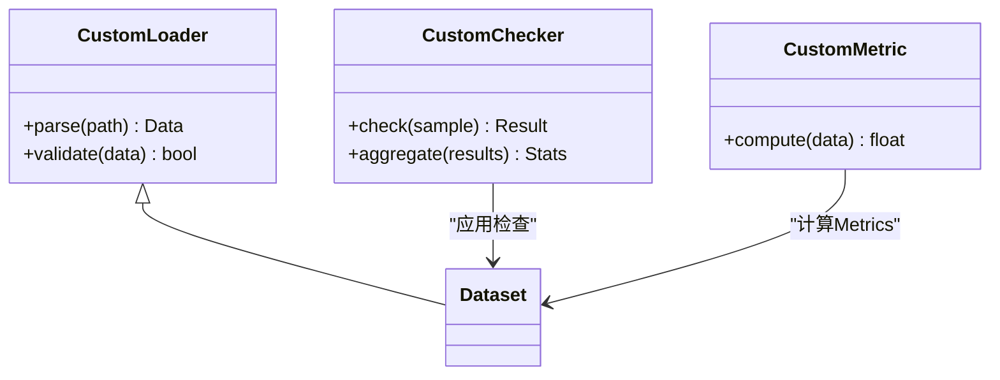

Figure Source
- [ultralytics/data/loaders.py](file://ultralytics/data/loaders.py)
- [ultralytics/data/dataset.py](file://ultralytics/data/dataset.py)
- [ultralytics/utils/metrics.py](file://ultralytics/utils/metrics.py)
- [tests/test_validator_helpers.py](file://tests/test_validator_helpers.py)

Section Source
- [ultralytics/data/loaders.py](file://ultralytics/data/loaders.py)
- [ultralytics/data/dataset.py](file://ultralytics/data/dataset.py)
- [ultralytics/utils/metrics.py](file://ultralytics/utils/metrics.py)
- [tests/test_validator_helpers.py](file://tests/test_validator_helpers.py)

### 常见数据质量问题and修复流程
- 问题类型
  - 缺失文件、标签格式不一致、类别ID越界、坐标越界、重复样本。
- 检测流程
  - 完整性检查→质量Metrics→异常明细→报告输出。
- 修复建议
  - 补全缺失文件、统一标签格式、修正类别映射、裁剪或剔除异常框、去重。
- 回归Validation
  - 修复后重新运行Validation，确认问题已解决且未引入新问题。

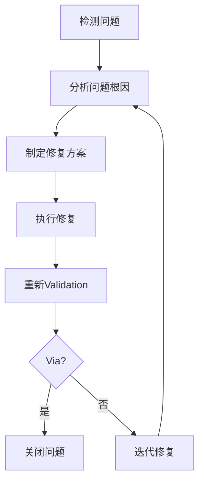

Section Source
- [ultralytics/engine/validator.py](file://ultralytics/engine/validator.py)
- [ultralytics/utils/metrics.py](file://ultralytics/utils/metrics.py)

## Dependency Analysis
- 组件耦合
  - Validator依赖数据集andMetricsModules；数据集依赖加载器and工具；Visualization独立但被ValidatorCalls。
- External Dependencies
  - 图像处理库、数值计算库、绘图库etc.（由底层Modules间接引入）。
- 循环依赖
  - 当前设计避免循环依赖，职责清晰分离。

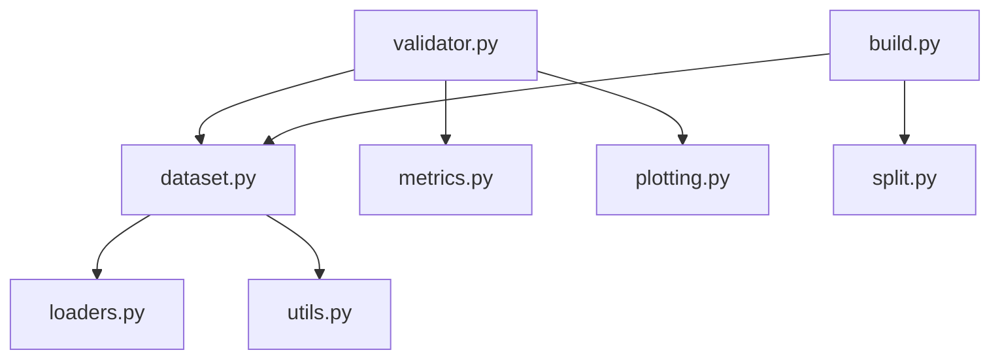

Figure Source
- [ultralytics/engine/validator.py](file://ultralytics/engine/validator.py)
- [ultralytics/data/dataset.py](file://ultralytics/data/dataset.py)
- [ultralytics/data/loaders.py](file://ultralytics/data/loaders.py)
- [ultralytics/data/utils.py](file://ultralytics/data/utils.py)
- [ultralytics/data/build.py](file://ultralytics/data/build.py)
- [ultralytics/data/split.py](file://ultralytics/data/split.py)
- [ultralytics/utils/metrics.py](file://ultralytics/utils/metrics.py)
- [ultralytics/utils/plotting.py](file://ultralytics/utils/plotting.py)

Section Source
- [ultralytics/engine/validator.py](file://ultralytics/engine/validator.py)
- [ultralytics/data/dataset.py](file://ultralytics/data/dataset.py)
- [ultralytics/data/loaders.py](file://ultralytics/data/loaders.py)
- [ultralytics/data/utils.py](file://ultralytics/data/utils.py)
- [ultralytics/data/build.py](file://ultralytics/data/build.py)
- [ultralytics/data/split.py](file://ultralytics/data/split.py)
- [ultralytics/utils/metrics.py](file://ultralytics/utils/metrics.py)
- [ultralytics/utils/plotting.py](file://ultralytics/utils/plotting.py)

## 性能考量
- 并行加载and校验：利用多线程/多进程提升I/Oand解析效率。
- 增量检查：仅对变更样本执行检查，减少重复开销。
- 内存管理：按需加载and缓存策略，避免一次性载入全量数据。
- Metrics计算Optimization：向量化操作and分块统计，降低CPU/GPU压力。

## Troubleshooting Guide
- 常见问题
  - 路径错误或权限不足导致无法读取文件。
  - 标签格式不匹配引发解析失败。
  - 坐标越界导致后续Training不稳定。
- 定位步骤
  - 查看完整性检查Loggingand异常明细。
  - UsesVisualization图表快速定位异常分布。
  - Via测试用例复现and隔离问题。
- 修复and回归
  - 依据报告建议进行修复，重新运行Validation确保问题解决。

Section Source
- [tests/test_validator_helpers.py](file://tests/test_validator_helpers.py)
- [ultralytics/engine/validator.py](file://ultralytics/engine/validator.py)

## Conclusion
YOLO-Master的数据Validationand质量检查系统provides了从完整性校验、质量Evaluation、分割策略to去重清洗and报告Visualization的完整闭环。ViaModules化设计and可扩展的检查规则，User可根据具体场景定制Validation流程，保障数据质量andTraining稳定性。

## Appendix
- 术语表
  - 完整性检查：确保数据文件and标签格式符合预期。
  - 质量Metrics：衡量数据一致性and分布特征的统计量。
  - 分割策略：将全量数据划分forTraining/Validation/测试子集的方法。
  - 去重：识别并移除重复样本的过程。
  - 异常值：偏离正常范围的样本或标注。