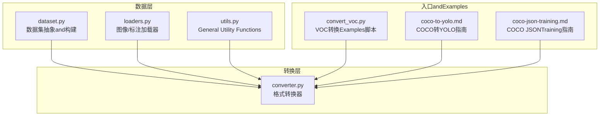
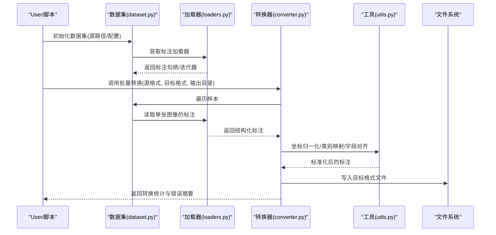
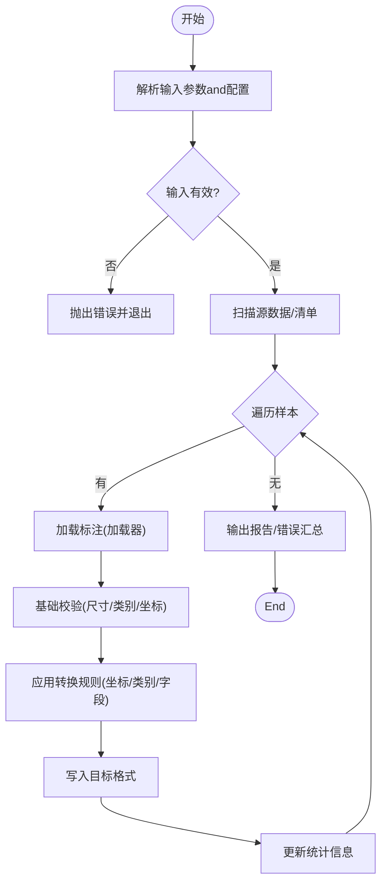
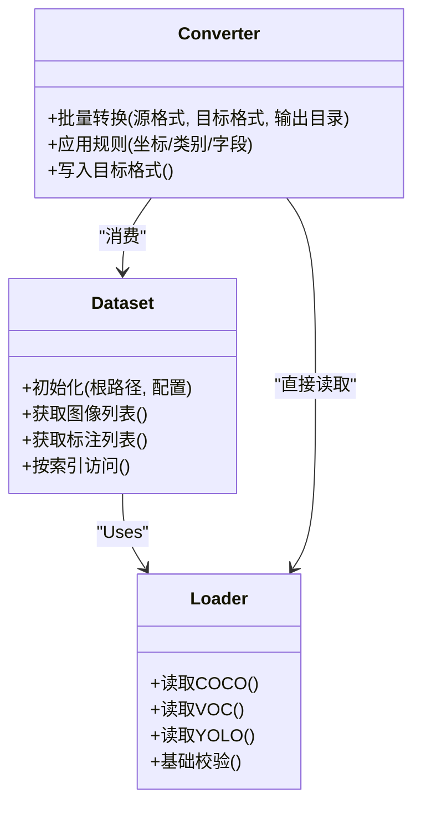
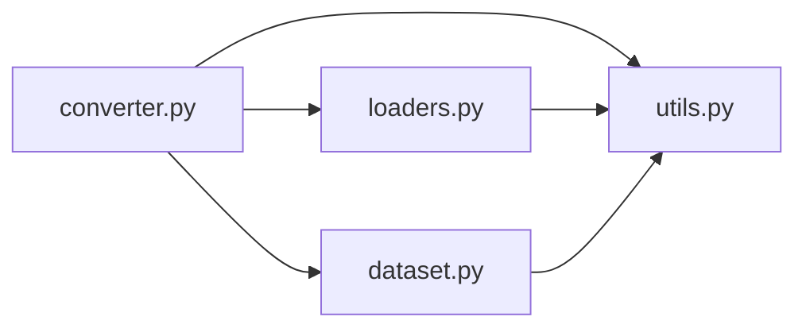

# 格式转换工具

<cite>
**Files Referenced in This Document**
- [ultralytics/data/converter.py](file://ultralytics/data/converter.py)
- [ultralytics/data/dataset.py](file://ultralytics/data/dataset.py)
- [ultralytics/data/loaders.py](file://ultralytics/data/loaders.py)
- [ultralytics/data/utils.py](file://ultralytics/data/utils.py)
- [scripts/convert_voc.py](file://scripts/convert_voc.py)
- [docs/en/guides/coco-to-yolo.md](file://docs/en/guides/coco-to-yolo.md)
- [docs/en/guides/coco-json-training.md](file://docs/en/guides/coco-json-training.md)
</cite>

## Table of Contents
1. [Introduction](#Introduction)
2. [Project Structure](#Project Structure)
3. [Core Components](#Core Components)
4. [Architecture Overview](#Architecture Overview)
5. [Detailed Component Analysis](#Detailed Component Analysis)
6. [Dependency Analysis](#Dependency Analysis)
7. [Performance Considerations](#Performance Considerations)
8. [Troubleshooting Guide](#Troubleshooting Guide)
9. [Conclusion](#Conclusion)
10. [Appendix](#Appendix)

## Introduction
本文件targetingYOLO-Master的格式转换工具，系统性说明Supporting的输入输出格式（YOLO、COCO、VOC/Pascal VOC、ImageNetetc.）、标签结构and坐标系统差异、批量转换的命令行andPython API用法、自定义格式定义and转换规则配置、数据Validationand错误处理机制、常见问题解决方案and调试技巧、性能Optimization建议and最佳实践，Centered onand兼容性矩阵and版本Migration指南。DocumentationCentered on仓库现有implementingfor依据，力求准确、可操作且易于理解。

## Project Structure
and格式转换相关的代码主要位于Centered on下位置：
- 核心转换逻辑and通用工具：ultralytics/data/converter.py、ultralytics/data/utils.py
- 数据集加载and解析：ultralytics/data/dataset.py、ultralytics/data/loaders.py
- Examples脚本：scripts/convert_voc.py
- 官方指南：docs/en/guides/coco-to-yolo.md、docs/en/guides/coco-json-training.md

Figure Source
- [ultralytics/data/converter.py](file://ultralytics/data/converter.py)
- [ultralytics/data/dataset.py](file://ultralytics/data/dataset.py)
- [ultralytics/data/loaders.py](file://ultralytics/data/loaders.py)
- [ultralytics/data/utils.py](file://ultralytics/data/utils.py)
- [scripts/convert_voc.py](file://scripts/convert_voc.py)
- [docs/en/guides/coco-to-yolo.md](file://docs/en/guides/coco-to-yolo.md)
- [docs/en/guides/coco-json-training.md](file://docs/en/guides/coco-json-training.md)

Section Source
- [ultralytics/data/converter.py](file://ultralytics/data/converter.py)
- [ultralytics/data/dataset.py](file://ultralytics/data/dataset.py)
- [ultralytics/data/loaders.py](file://ultralytics/data/loaders.py)
- [ultralytics/data/utils.py](file://ultralytics/data/utils.py)
- [scripts/convert_voc.py](file://scripts/convert_voc.py)
- [docs/en/guides/coco-to-yolo.md](file://docs/en/guides/coco-to-yolo.md)
- [docs/en/guides/coco-json-training.md](file://docs/en/guides/coco-json-training.md)

## Core Components
- 转换器（converter.py）
  - provides统一的格式转换接口，Supporting多源to目标格式的映射and写入。
  - 负责读取不同格式的标注，进行坐标归一化/反归一化、类别映射、边界框/关键点/分割掩码etc.结构的对齐。
  - 暴露批量转换capabilities，SupportingTable of Contents扫描、并发控制and进度反馈。
- 数据集and加载器（dataset.py、loaders.py）
  - dataset.py：Encapsulates数据集对象，统一访问图像路径and标注信息，for转换流程provides稳定输入。
  - loaders.py：implementing具体格式的读取器（such asCOCO JSON、VOC XML、YOLO txt），并做基础校验and容错。
- 工具库（utils.py）
  - provides坐标变换、尺寸计算、路径解析、IO辅助、Loggingand异常包装etc.通用capabilities。
- Examples脚本（convert_voc.py）
  - 演示such as何Calls转换器完成VOCtoYOLO的批量转换，包括参数设置and输出组织。
- 官方指南（coco-to-yolo.md、coco-json-training.md）
  - 给出COCOtoYOLO的完整工作流、注意事项and最佳实践。

Section Source
- [ultralytics/data/converter.py](file://ultralytics/data/converter.py)
- [ultralytics/data/dataset.py](file://ultralytics/data/dataset.py)
- [ultralytics/data/loaders.py](file://ultralytics/data/loaders.py)
- [ultralytics/data/utils.py](file://ultralytics/data/utils.py)
- [scripts/convert_voc.py](file://scripts/convert_voc.py)
- [docs/en/guides/coco-to-yolo.md](file://docs/en/guides/coco-to-yolo.md)
- [docs/en/guides/coco-json-training.md](file://docs/en/guides/coco-json-training.md)

## Architecture Overview
下图展示了从原始标注to目标格式的端to端转换流程，涵盖读取、校验、转换、写入and结果统计。

Figure Source
- [ultralytics/data/dataset.py](file://ultralytics/data/dataset.py)
- [ultralytics/data/loaders.py](file://ultralytics/data/loaders.py)
- [ultralytics/data/converter.py](file://ultralytics/data/converter.py)
- [ultralytics/data/utils.py](file://ultralytics/data/utils.py)

## Detailed Component Analysis

### 转换器（converter.py）
- 职责
  - Unified entry point：接收“源格式→目标格式”的配置，执行批量转换。
  - 格式适配：将不同标注结构转换for内部统一表示，再序列化for目标格式。
  - 批处理：Supporting按Table of Contents或清单批量处理，具备并发and进度Tips。
- 关键流程
  - 解析输入：校验源Table of Contents/清单、目标Table of Contents、类别表、坐标系统etc.。
  - 读取标注：Via加载器逐条读取，进行基础合法性检查。
  - 转换规则：应用坐标缩放/归一化、类别ID映射、缺失字段填充。
  - 写入输出：按目标格式规范生成文件，记录统计信息。
- 扩展点
  - 新增格式：while加载器中注册新的读取器，并while转换器中补充对应写入器。
  - 自定义规则：Via配置注入类别映射、坐标系统、字段别名etc.。

Figure Source
- [ultralytics/data/converter.py](file://ultralytics/data/converter.py)
- [ultralytics/data/loaders.py](file://ultralytics/data/loaders.py)
- [ultralytics/data/utils.py](file://ultralytics/data/utils.py)

Section Source
- [ultralytics/data/converter.py](file://ultralytics/data/converter.py)

### 数据集and加载器（dataset.py、loaders.py）
- dataset.py
  - provides数据集抽象，统一图像and标注的访问方式，便于转换器复用。
  - 负责路径解析、索引构建、元数据缓存etc.。
- loaders.py
  - implementing各格式的读取器（例such asCOCO JSON、VOC XML、YOLO TXT）。
  - 对每条标注进行基础校验（such as类别存while性、坐标范围、文件可达性）。
  - 返回标准化的数据结构供转换器Uses。

Figure Source
- [ultralytics/data/dataset.py](file://ultralytics/data/dataset.py)
- [ultralytics/data/loaders.py](file://ultralytics/data/loaders.py)
- [ultralytics/data/converter.py](file://ultralytics/data/converter.py)

Section Source
- [ultralytics/data/dataset.py](file://ultralytics/data/dataset.py)
- [ultralytics/data/loaders.py](file://ultralytics/data/loaders.py)

### 工具库（utils.py）
- 坐标系统转换
  - 绝对坐标↔相对坐标（[0,1]）互转，Supporting宽高归一化。
  - 旋转框、关键点、多边形掩码的坐标规范化。
- 类别映射
  - 名称→ID、ID→名称的双向映射，Supporting别名and去重。
- IOand路径
  - 安全路径拼接、Table of Contents创建、文件存while性检查。
- Loggingand异常
  - 结构化Logging输出、异常包装and上下文附加。

Section Source
- [ultralytics/data/utils.py](file://ultralytics/data/utils.py)

### Examples脚本（convert_voc.py）
- 功能
  - 演示such as何将Pascal VOC数据集批量转换forYOLO格式。
  - 展示命令行参数（输入Table of Contents、输出Table of Contents、类别文件、是否包含Validation集etc.）。
- Uses要点
  - 确保VOCTable of Contents结构符合预期（JPEGImages、Annotationsetc.）。
  - 指定类别文件Centered on建立名称andID的映射。
  - 转换完成后检查输出Table of Contents中的txt标注and图片组织。

Section Source
- [scripts/convert_voc.py](file://scripts/convert_voc.py)

### 官方指南（coco-to-yolo.md、coco-json-training.md）
- coco-to-yolo.md
  - 详细说明COCO JSONtoYOLO TXT的转换步骤、注意事项and常见坑。
  - 强调坐标系统and类别映射的一致性。
- coco-json-training.md
  - 介绍such as何whileTraining中UsesCOCO JSON，Centered onand何时需要转换forYOLO格式。
  - providesData PreparationandValidation的最佳实践。

Section Source
- [docs/en/guides/coco-to-yolo.md](file://docs/en/guides/coco-to-yolo.md)
- [docs/en/guides/coco-json-training.md](file://docs/en/guides/coco-json-training.md)

## Dependency Analysis
- Modules耦合
  - converter.py强依赖dataset.pyandloaders.pyprovides的数据访问capabilities。
  - utils.py被converter.pyandloaders.py共同复用，降低重复implementing。
- External Dependencies
  - 标准库（JSON/XML/路径/IO）用于读写各类标注。
  - Optional第三方库（such as图像处理库）用于尺寸检测and校验。
- Potential Cycles依赖
  - 当前设计Via分层（数据层/转换层/工具层）避免循环依赖。

Figure Source
- [ultralytics/data/converter.py](file://ultralytics/data/converter.py)
- [ultralytics/data/dataset.py](file://ultralytics/data/dataset.py)
- [ultralytics/data/loaders.py](file://ultralytics/data/loaders.py)
- [ultralytics/data/utils.py](file://ultralytics/data/utils.py)

Section Source
- [ultralytics/data/converter.py](file://ultralytics/data/converter.py)
- [ultralytics/data/dataset.py](file://ultralytics/data/dataset.py)
- [ultralytics/data/loaders.py](file://ultralytics/data/loaders.py)
- [ultralytics/data/utils.py](file://ultralytics/data/utils.py)

## Performance Considerations
- I/OOptimization
  - Uses并行读取and写入，Set appropriately并发度Centered on避免磁盘bottlenecks。
  - 预分配输出Table of Contents结构，减少运行时创建开销。
- 内存管理
  - 采用流式处理，避免一次性加载全部标注to内存。
  - and时释放中间对象，防止大对象驻留。
- 计算Optimization
  - 批量坐标变换and类别映射，减少重复计算。
  - 利用缓存（such as类别映射表、路径索引）提升二次运行速度。
- 监控and诊断
  - 输出详细的转换统计（成功/失败数量、耗时、错误类型分布）。
  - provides断点续转capabilities，Supporting中断后继续处理。

## Troubleshooting Guide
- 常见问题
  - 坐标越界或负值：检查图像尺寸and标注一致性，确认归一化是否正确。
  - 类别缺失或ID不连续：核对类别文件，确保名称andID一一对应。
  - 文件路径错误：确认源Table of Contents结构、符号链接and权限。
  - 格式不一致：Strictly follow目标格式规范（字段名、顺序、小数精度）。
- 定位方法
  - 启用详细Logging，查看具体失败的样本and原因。
  - Uses最小复现集快速Validation问题。
  - 对比Refer to输出（such as官方Examples）定位差异。
- 恢复策略
  - 跳过错误样本并记录，保证整体Tasks完成。
  - provides重试机制and幂etc.写入，避免重复处理。

Section Source
- [ultralytics/data/converter.py](file://ultralytics/data/converter.py)
- [ultralytics/data/loaders.py](file://ultralytics/data/loaders.py)
- [ultralytics/data/utils.py](file://ultralytics/data/utils.py)

## Conclusion
YOLO-Master的格式转换工具Via清晰的分层设计and可扩展的加载器/写入器体系，provides了稳定高效的跨格式转换capabilities。Combined with官方指南andExamples脚本，User可Centered on快速完成COCO、VOC、YOLOetc.主流格式的互转，并Via配置化规则Supporting自定义格式。建议while大规模数据转换时关注I/Oand内存占用，CombiningLoggingand统计信息进行持续Optimization。

## Appendix

### Supporting的输入输出格式and坐标系统
- YOLO
  - 文本标注，每行一个目标；字段通常for类别IDand归一化中心x、y、宽、高。
  - 坐标系统：相对坐标[0,1]，基于图像宽高归一化。
- COCO
  - JSON结构，包含图像信息and目标列表；bboxfor[x,y,w,h]绝对坐标。
  - 坐标系统：绝对像素坐标，左上角原点。
- Pascal VOC
  - XML标注，包含图像尺寸and多个目标；bboxforxmin,xmax,ymin,ymax绝对坐标。
  - 坐标系统：绝对像素坐标，左上角原点。
- ImageNet
  - 分类Tasksfor主，通常不包含边界框；若涉and检测需额外标注。
  - 坐标系统：不适用（分类场景）。

注意：不同格式间的关键差异while于坐标系统（绝对vs相对）and字段命名/顺序。转换时需进行严格的归一化/反归一化and字段对齐。

Section Source
- [docs/en/guides/coco-to-yolo.md](file://docs/en/guides/coco-to-yolo.md)
- [docs/en/guides/coco-json-training.md](file://docs/en/guides/coco-json-training.md)

### Command Line InterfaceandPython API
- 命令行
  - 典型参数：输入Table of Contents、输出Table of Contents、源格式、目标格式、类别文件、并发数、是否覆盖输出。
  - Examples脚本：scripts/convert_voc.py演示了VOC→YOLO的常用用法。
- Python API
  - Via导入转换器Modules，实例化并Calls批量转换方法。
  - Supporting传入配置字典（类别映射、坐标系统、字段别名etc.）。
  - 返回统计信息（成功/失败计数、耗时、错误列表）。

Section Source
- [scripts/convert_voc.py](file://scripts/convert_voc.py)
- [ultralytics/data/converter.py](file://ultralytics/data/converter.py)

### 自定义格式定义and转换规则配置
- 自定义格式
  - while加载器中注册新的读取器，implementing字段解析and基础校验。
  - while转换器中补充对应的写入器，确保输出符合目标规范。
- 转换规则
  - 类别映射：名称→ID、ID→名称、别名合并。
  - 坐标系统：绝对↔相对、原点and方向约定。
  - 字段别名：兼容历史字段名，自动映射to新结构。
- 配置方式
  - Via配置文件或参数传入，Supporting局部覆盖默认规则。

Section Source
- [ultralytics/data/loaders.py](file://ultralytics/data/loaders.py)
- [ultralytics/data/converter.py](file://ultralytics/data/converter.py)
- [ultralytics/data/utils.py](file://ultralytics/data/utils.py)

### 数据Validationand错误处理机制
- 数据Validation
  - 图像可达性and尺寸一致性检查。
  - 标注完整性（必填字段、数值范围、类别有效性）。
  - 格式合规性（键名、顺序、数据类型）。
- 错误处理
  - 捕获并记录异常，附带上下文（文件路径、样本索引、错误类型）。
  - Supporting跳过错误样本、重试and断点续转。
  - 输出错误摘要and修复建议。

Section Source
- [ultralytics/data/loaders.py](file://ultralytics/data/loaders.py)
- [ultralytics/data/utils.py](file://ultralytics/data/utils.py)
- [ultralytics/data/converter.py](file://ultralytics/data/converter.py)

### 兼容性矩阵and版本Migration指南
- 兼容性矩阵
  - 列出各版本对COCO/VOC/YOLO的Supporting情况and已知限制。
  - 标注坐标系统差异and字段变更。
- Migration指南
  - 从旧版COCO结构Migration至新版：字段重命名、新增必填项。
  - 从VOC旧版XMLMigration：属性调整、命名空间变化。
  - 从YOLO旧版txtMigration：字段顺序、归一化约定。
- 回滚策略
  - 保留原始数据and转换Logging，便于回溯and对比。
  - provides一键回退脚本，恢复上一版本输出。

Section Source
- [docs/en/guides/coco-to-yolo.md](file://docs/en/guides/coco-to-yolo.md)
- [docs/en/guides/coco-json-training.md](file://docs/en/guides/coco-json-training.md)