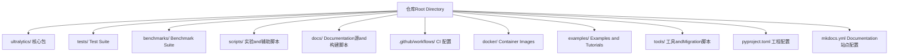
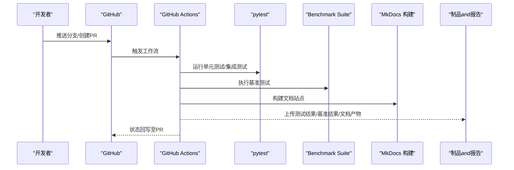
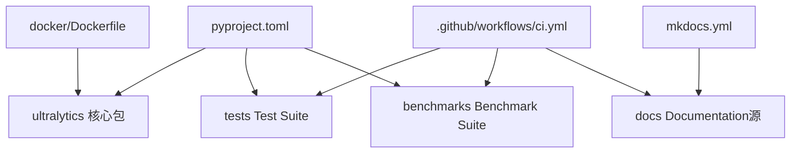

# Developer Guide

<cite>
**Files Referenced in This Document**
- [CONTRIBUTING.md](file://CONTRIBUTING.md)
- [README.md](file://README.md)
- [pyproject.toml](file://pyproject.toml)
- [mkdocs.yml](file://mkdocs.yml)
- [docs/build_docs.py](file://docs/build_docs.py)
- [tests/conftest.py](file://tests/conftest.py)
- [benchmarks/run.py](file://benchmarks/run.py)
- [.github/workflows/ci.yml](file://.github/workflows/ci.yml)
- [docker/Dockerfile](file://docker/Dockerfile)
</cite>

## Table of Contents
1. [Introduction](#Introduction)
2. [Project Structure](#Project Structure)
3. [Core Components](#Core Components)
4. [Architecture Overview](#Architecture Overview)
5. [Detailed Component Analysis](#Detailed Component Analysis)
6. [Dependency Analysis](#Dependency Analysis)
7. [Performance Considerations](#Performance Considerations)
8. [Troubleshooting Guide](#Troubleshooting Guide)
9. [Conclusion](#Conclusion)
10. [Appendix](#Appendix)

## Introduction
本指南targeting希望for YOLO-Master 贡献代码、维护测试andDocumentation、参and CI/CD 流水线Centered onand进行新特性开发的开发者。内容涵盖：
- Git 工作流、代码审查and提交流程
- Table of Contents结构and代码组织原则
- 测试体系（单元、集成、端to端）的构建方法
- CI/CD 流水线配置and自动化执行
- Documentation系统的维护and更新流程
- 新特性开发全流程（需求、设计、implementing、测试）
- 性能基准and回归测试方法
- 版本发布and变更管理
- 代码风格规范and静态检查工具配置
- 调试and故障诊断高级技巧
- 社区参andand沟通渠道

## Project Structure
仓库采用按功能域and层次Mixture的组织方式，核心 Python 包位于 ultralytics/，测试集中于 tests/，基准and脚本while benchmarks/ and scripts/，DocumentationUses MkDocs while docs/ 下维护，CI 配置while .github/workflows/，Container Images定义while docker/。

Section Source
- [README.md](file://README.md)
- [pyproject.toml](file://pyproject.toml)
- [mkdocs.yml](file://mkdocs.yml)

## Core Components
- 工程and依赖管理：Via pyproject.toml 声明依赖、可执行入口and打包元数据，统一安装and运行环境。
- Documentation系统：基于 MkDocs，配置文件 mkdocs.yml and构建脚本 docs/build_docs.py 共同drivers are installedDocumentation生成。
- 测试框架：pytest 作for测试运行器，tests/conftest.py provides全局夹具and共享配置。
- 基准测试：benchmarks/run.py providesBenchmark Suite入口，用于性能Evaluationand回归对比。
- CI/CD：.github/workflows/ci.yml 定义持续集成Tasks，包括测试、基准andDocumentation构建etc.步骤。
- 容器化：docker/Dockerfile provides一致的运行环境and复现基础。

Section Source
- [pyproject.toml](file://pyproject.toml)
- [mkdocs.yml](file://mkdocs.yml)
- [docs/build_docs.py](file://docs/build_docs.py)
- [tests/conftest.py](file://tests/conftest.py)
- [benchmarks/run.py](file://benchmarks/run.py)
- [.github/workflows/ci.yml](file://.github/workflows/ci.yml)
- [docker/Dockerfile](file://docker/Dockerfile)

## Architecture Overview
下图展示了从本地开发to持续集成的关键路径：开发者提交 PR → GitHub Actions 触发 CI → 拉取依赖并运行测试and基准 → 构建Documentation → 产出报告and制品。

Figure Source
- [.github/workflows/ci.yml](file://.github/workflows/ci.yml)
- [tests/conftest.py](file://tests/conftest.py)
- [benchmarks/run.py](file://benchmarks/run.py)
- [mkdocs.yml](file://mkdocs.yml)
- [docs/build_docs.py](file://docs/build_docs.py)

## Detailed Component Analysis

### 代码贡献流程and规范
- 分支策略
  - 主分支保护：禁止直接推送至受保护分支，所有变更Via Pull Request 合并。
  - 功能分支命名：建议Centered on feat/fix/chore/docs 前缀区分变更类型，便于追踪and发布说明生成。
- 提交流程
  - 小步提交：每次提交聚焦单一职责，提交信息清晰描述动机and影响范围。
  - 关联问题：while提交信息and PR 描述中引用相关 Issue 编号，确保可追溯性。
- 代码审查
  - 至少一名维护者审阅Via后合并。
  - 关注点：API 契约稳定性、向后兼容性、性能影响、测试覆盖andDocumentation同步。
- 提交后Validation
  - 自动触发 CI，包含测试、基准andDocumentation构建；全部Via后进入合并队列。

Section Source
- [CONTRIBUTING.md](file://CONTRIBUTING.md)

### Table of Contents结构and代码组织原则
- 分层andModules化
  - 核心capabilities集中while ultralytics/ 下，按Modules划分（such as engine、models、nn、utils）。
  - 测试用例and业务逻辑一一对应，便于定位and回归。
- 配置and资源
  - 模型and数据集配置集中管理，避免硬编码。
  - Documentation素材and宏定义置于 docs/ 下，保持and源码同步。
- 可观测性and工具
  - Logging、事件andExportcapabilities矩阵etc.工具独立成Modules，降低耦合度。

Section Source
- [pyproject.toml](file://pyproject.toml)
- [mkdocs.yml](file://mkdocs.yml)

### Testing Framework
- 测试分类
  - 单元测试：针对函数and类的最小粒度行forValidation。
  - 集成测试：跨Modules协作场景Validation，such asTraining/Validation/Export链路。
  - 端to端测试：模拟真实User工作流，覆盖 CLI and典型用例。
- 运行and组织
  - Uses pytest 作for统一运行器，conftest.py provides全局夹具and共享配置。
  - 测试数据and缓存由专用脚本管理，保证可重复性。
- 编写建议
  - 每个新增或修改的功能需配套相应测试。
  - 对数值敏感逻辑增加稳定性and边界条件断言。
  - 对异步或多进程路径补充控制流and错误传播测试。

Section Source
- [tests/conftest.py](file://tests/conftest.py)

### CI/CD 流水线配置and自动化执行
- 触发条件
  - 推送至分支或创建/更新 PR 时自动触发。
- 主要阶段
  - Environment Preparation：Installing Dependencies、缓存常用包and数据集。
  - 测试执行：并行运行单测and集成测试，收集覆盖率and失败详情。
  - 基准执行：运行Benchmark Suite，输出Metrics并and基线对比。
  - Documentation构建：校验链接and生成站点，必要时归档产物。
- 结果上报
  - 将测试结果、基准报告and构建产物上传至制品存储，供后续发布and审计。

Section Source
- [.github/workflows/ci.yml](file://.github/workflows/ci.yml)

### Documentation System Maintenanceand更新流程
- 站点配置
  - Uses mkdocs.yml 定义站点导航、主题and插件。
- 构建脚本
  - docs/build_docs.py Encapsulates构建命令and参数，Supporting增量构建and错误Tips。
- 更新规范
  - 新增功能需同步更新对应Documentation页andRefer to手册。
  - 变更涉and API 或配置项时，更新宏and表格，确保一致性。
- 本地预览
  - Via构建脚本启动本地服务，快速Validation渲染效果。

Section Source
- [mkdocs.yml](file://mkdocs.yml)
- [docs/build_docs.py](file://docs/build_docs.py)

### 新特性开发完整指南
- 需求分析
  - 明确目标、约束and验收标准，记录于 Issue 或设计Documentation。
- 设计Documentation
  - 输出接口契约、数据流图and风险清单，评审Via后进入implementing。
- implementingand自测
  - 遵循现有Modules边界and约定，添加必要Loggingand可观测性。
  - 编写单测and集成用例，覆盖正常and异常路径。
- 基准and回归
  - 对性能敏感特性补充基准用例，建立基线并while CI 中定期回归。
- DocumentationandExamples
  - 更新UserDocumentation、Refer to手册andExamples脚本，确保可复现。
- 提交and审查
  - 拆分提交、完善提交信息，发起 PR 并响应审查意见。

[本节for通用方法论，不直接分析具体文件]

### 性能基准测试and回归测试
- Benchmark Suite
  - benchmarks/run.py providesUnified entry point，Supporting多Tasksand多配置的批量执行。
- Metricsand报告
  - 输出吞吐、延迟and资源占用，生成结构化报告Centered on便对比。
- 回归策略
  - while CI 中固定数据集and随机种子，确保可比性。
  - 设定阈值告警，超阈则阻断合并或要求额外审批。

Section Source
- [benchmarks/run.py](file://benchmarks/run.py)

### 版本发布and变更管理
- 版本号策略
  - 遵循语义化版本，重大变更升级主版本，兼容改进升级次版本，修复缺陷修订版本。
- 变更清单
  - 依据提交信息and PR 描述自动生成变更Logging，标注破坏性变更and弃用提醒。
- 发布流程
  - 打标签、构建制品、发布Documentation站点and模型权重，通知社区并归档报告。

[本节for通用方法论，不直接分析具体文件]

### 代码风格规范and静态检查工具
- 风格规范
  - 遵循 PEP 8 and项目内约定，保持一致的命名、导入顺序and注释风格。
- 静态检查
  - Uses ruff 进行快速检查and格式化，Combining pre-commit 钩子while提交前自动修复。
- 类型and契约
  - 鼓励Uses类型注解and契约式编程，提升可读性and可维护性。

Section Source
- [pyproject.toml](file://pyproject.toml)

### 调试and故障诊断高级技巧
- Loggingand事件
  - 利用Built-inLoggingand事件回调定位Training/Inference链路中的bottlenecksand异常。
- 分布式and设备
  - 针对 DDP and多设备场景，检查通信and归约路径，捕获 NaN/Inf and内存泄漏。
- Visualizationand回放
  - 借助ExportandVisualization工具回放中间结果，辅助定位偏差来源。
- 容器化复现
  - Uses docker/Dockerfile provides的镜像and环境，确保问题可复现。

Section Source
- [docker/Dockerfile](file://docker/Dockerfile)

### 社区参andand沟通渠道
- 讨论and问题
  - Uses Issues 提出 Bug and功能请求，附上最小可复现Examplesand运行环境信息。
- 贡献指引
  - 阅读 CONTRIBUTING.md 了解分支、提交and审查规范。
- 行for准则
  - 遵守社区行for准则，尊重多元背景and贡献方式。

Section Source
- [CONTRIBUTING.md](file://CONTRIBUTING.md)

## Dependency Analysis
下图展示工程顶层依赖关系and外部集成点：Python 包管理andDocumentation构建、测试and基准、CI and容器化。

Figure Source
- [pyproject.toml](file://pyproject.toml)
- [mkdocs.yml](file://mkdocs.yml)
- [.github/workflows/ci.yml](file://.github/workflows/ci.yml)
- [docker/Dockerfile](file://docker/Dockerfile)

Section Source
- [pyproject.toml](file://pyproject.toml)
- [mkdocs.yml](file://mkdocs.yml)
- [.github/workflows/ci.yml](file://.github/workflows/ci.yml)
- [docker/Dockerfile](file://docker/Dockerfile)

## Performance Considerations
- Data Loadingand预处理
  - Uses高效Data Pipelineand缓存，减少 IO bottlenecks。
- 计算and内存
  - Set appropriately批大小and精度，启用Mixture精度and编译Optimization（such as适用）。
- Distributed Training
  - 平衡通信and计算，监控Gradient同步and归约开销。
- 基准and回归
  - 固定随机种子and硬件环境，定期回归检测性能退化。

[This section provides general guidance and does not directly analyze specific files]

## Troubleshooting Guide
- 常见问题定位
  - 确认依赖版本and环境一致，优先while容器环境中复现。
  - 查看 CI Loggingand测试报告，定位失败用例and堆栈。
- 性能问题
  - UsesBenchmark Suite对比历史结果，识别退化点。
  - CombiningLoggingand事件回调，定位热点路径and异常分支。
- Documentationand构建
  - Uses本地构建脚本Validation链接and模板，逐步缩小问题范围。

Section Source
- [tests/conftest.py](file://tests/conftest.py)
- [benchmarks/run.py](file://benchmarks/run.py)
- [docs/build_docs.py](file://docs/build_docs.py)

## Conclusion
本指南provides了从贡献流程、代码组织、测试and基准、CI/CD、Documentation维护to新特性开发and发布的完整实践路径。遵循本Documentationworkflowand规范，有助于提升协作效率and代码质量，保障项目的长期可维护性and生态健康。

[This section is summary content and does not directly analyze specific files]

## Appendix
- Quick Start
  - Installing Dependenciesand初始化环境，Refer to README and pyproject.toml。
  - 运行测试and基准，Validation本地环境正确性。
- 常用命令
  - 构建Documentation：Uses docs/build_docs.py 启动本地预览。
  - 运行测试：Via pytest 指定用例或标记过滤。
  - 执行基准：Calls benchmarks/run.py 选择Tasksand配置。

Section Source
- [README.md](file://README.md)
- [pyproject.toml](file://pyproject.toml)
- [docs/build_docs.py](file://docs/build_docs.py)
- [benchmarks/run.py](file://benchmarks/run.py)