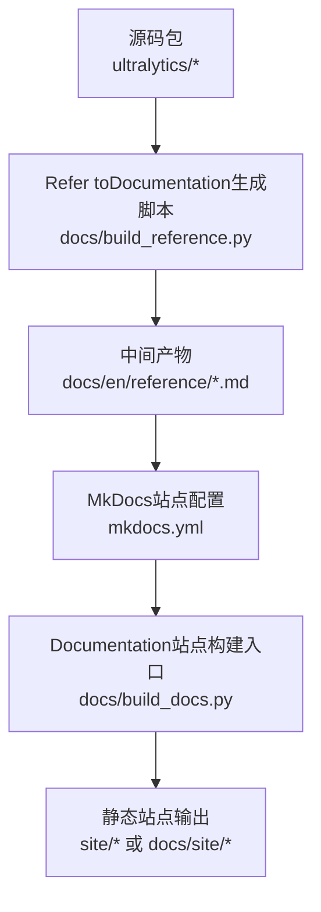
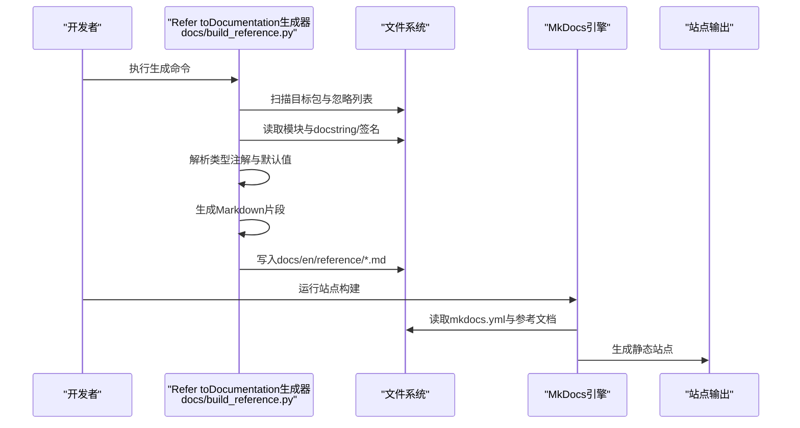
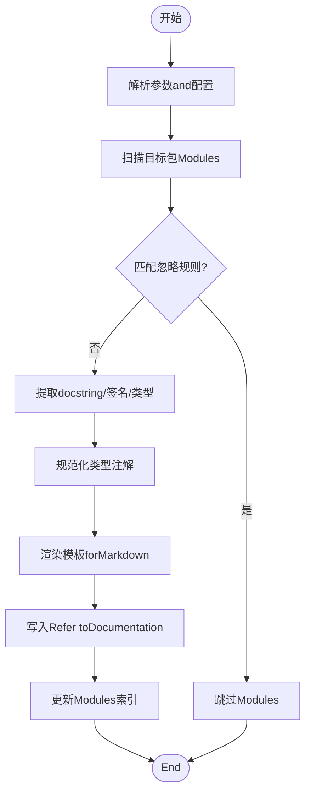
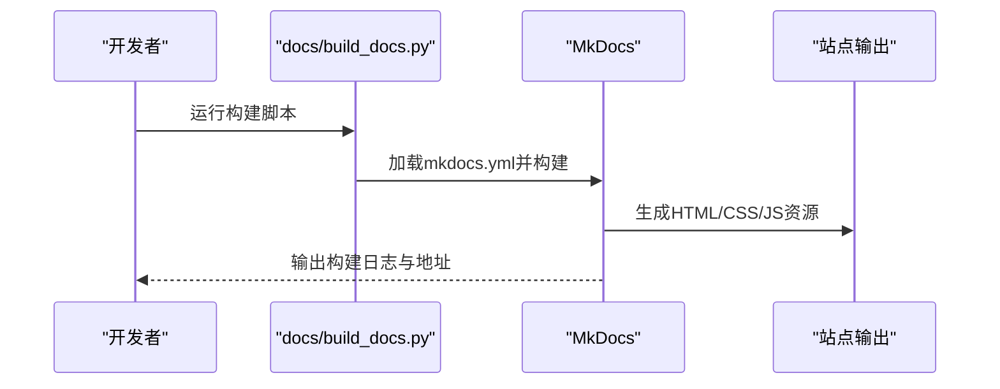
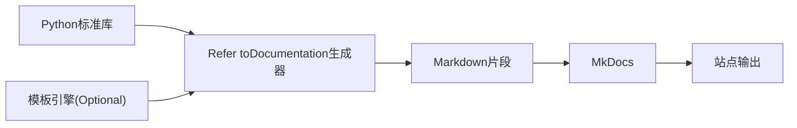

# API Reference生成

<cite>
**Files Referenced in This Document**
- [build_reference.py](file://docs/build_reference.py)
- [build_docs.py](file://docs/build_docs.py)
- [mkdocs.yml](file://mkdocs.yml)
- [__init__.md](file://docs/en/reference/__init__.md)
- [index.md](file://docs/en/reference/index.md)
</cite>

## Table of Contents
1. [Introduction](#Introduction)
2. [Project Structure](#Project Structure)
3. [Core Components](#Core Components)
4. [Architecture Overview](#Architecture Overview)
5. [Detailed Component Analysis](#Detailed Component Analysis)
6. [Dependency Analysis](#Dependency Analysis)
7. [Performance Considerations](#Performance Considerations)
8. [Troubleshooting Guide](#Troubleshooting Guide)
9. [Conclusion](#Conclusion)
10. [Appendix](#Appendix)

## Introduction
本指南targeting希望forYOLO-Master项目构建和维护“API Reference自动生成系统”的开发者and维护者。目标是Via自动化扫描PythonModules、提取docstringand类型注解，并基于模板生成MarkdownRefer toDocumentation，最终集成toMkDocs站点中。Documentation将覆盖：
- build_reference.py脚本的工作原理and配置项
- PythonModules扫描、docstring提取andMarkdown生成流程
- 模板系统and格式化规则
- for新Modules添加APIDocumentationSupporting（注册and标记）
- 复杂类型注解and函数签名的处理策略
- Documentation链接自动生成的交互关系
- 测试andValidation方法
- 更新触发器and增量构建配置
- 私有APIand内部接口的Documentation控制

## Project Structure
andAPI Reference生成相关的核心位置such as下：
- docs/build_reference.py：Refer toDocumentation生成主脚本
- docs/build_docs.py：Documentation站点的整体构建入口（通常用于本地预览/发布）
- mkdocs.yml：MkDocs站点配置（导航、主题、插件etc.）
- docs/en/reference/*：已生成的Refer toDocumentation输出Table of Contents（含索引and子Modules页面）

Figure Source
- [build_reference.py](file://docs/build_reference.py)
- [build_docs.py](file://docs/build_docs.py)
- [mkdocs.yml](file://mkdocs.yml)

Section Source
- [build_reference.py](file://docs/build_reference.py)
- [build_docs.py](file://docs/build_docs.py)
- [mkdocs.yml](file://mkdocs.yml)

## Core Components
- Modules扫描器：递归发现目标package的可导入Modules，过滤忽略列表，解析Modules元信息（名称、路径、版本etc.）。
- Docstringand签名提取器：Uses标准库反射capabilities读取函数/类/属性的docstringand签名，规范化参数、返回类型and默认值。
- 模板渲染器：根据预定义模板将结构化数据渲染forMarkdown片段，统一标题层级、表格样式and交叉引用。
- 链接生成器：whileModules间建立相对链接，确保跨文件跳转稳定。
- 增量构建器：对比源文件时间戳and已生成Documentation，仅重建变更部分。
- MkDocs集成：将生成的Markdown纳入站点导航and搜索索引。

Section Source
- [build_reference.py](file://docs/build_reference.py)
- [build_docs.py](file://docs/build_docs.py)
- [mkdocs.yml](file://mkdocs.yml)

## Architecture Overview
下图展示了从源码to最终站点的端to端流程，包括增量构建and链接生成。

Figure Source
- [build_reference.py](file://docs/build_reference.py)
- [build_docs.py](file://docs/build_docs.py)
- [mkdocs.yml](file://mkdocs.yml)

## Detailed Component Analysis

### Refer toDocumentation生成脚本（docs/build_reference.py）
该脚本是API Reference自动化的核心，负责：
- 解析命令行参数and配置文件（such as目标包、输出Table of Contents、忽略模式、是否包含私有成员etc.）
- 扫描PythonModules树，收集可Export符号（函数、类、属性）
- 提取docstringand签名，规范化类型Tipsand默认值
- 按模板渲染Markdown，并生成Modules索引页
- 维护增量构建缓存（Optional），避免重复工作

关键流程（概念性流程图）：

Section Source
- [build_reference.py](file://docs/build_reference.py)

### MkDocs集成and站点构建（docs/build_docs.py and mkdocs.yml）
- mkdocs.yml：定义站点标题、主题、导航树、插件（such as搜索、代码高亮）、Centered onandRefer toDocumentationTable of Contents映射。
- build_docs.py：Encapsulates本地预览and发布流程，CallsMkDocs CLI或Python API进行构建；也可whileCI中作for入口。

建议的站点构建序列：

Figure Source
- [build_docs.py](file://docs/build_docs.py)
- [mkdocs.yml](file://mkdocs.yml)

Section Source
- [build_docs.py](file://docs/build_docs.py)
- [mkdocs.yml](file://mkdocs.yml)

### 模板系统and格式化规则
- 模板分层：Modules级模板、类模板、函数模板、属性模板，分别控制标题、段落、表格andExamples块。
- 格式化规则：
  - 标题层级：ModulesH1、类H2、函数H3、属性H4
  - 参数表：名称、类型、默认值、说明
  - 返回类型and异常：单独小节
  - 交叉引用：Centered on相对路径链接至其他Modules页面
- 变量注入：由生成器providesModules名、版本、作者、变更记录etc.上下文。

Section Source
- [build_reference.py](file://docs/build_reference.py)

### for新Modules添加APIDocumentationSupporting
步骤概览：
- Modules注册：while生成器的“目标包”列表中声明新Modules路径，或while包的__init__.py中显式Export公共接口。
- Documentation标记：for函数/类/属性编写结构化docstring（遵循Google/NumPy/Sphinx风格之一），标注参数、返回值and异常。
- 类型注解：for函数签名添加类型Tips，便于生成器正确解析and渲染。
- 忽略控制：对内部implementing或临时接口，可while忽略列表中排除或Via标记隐藏。
- 索引更新：重新运行生成脚本，确认新增页面出现whileRefer to索引中。

Section Source
- [build_reference.py](file://docs/build_reference.py)

### 复杂类型注解and函数签名处理
- Union/Optional/泛型：解析for可读文本，必要时保留原始形式并while备注中解释。
- Callable/Protocol：显示Calls约定and约束，必要时附加Examples链接。
- 默认值and可变默认值：区分不可变默认值and可变默认值，给出安全Tips。
- 重载and装饰器：合并签名信息，保留装饰器语义说明。

Section Source
- [build_reference.py](file://docs/build_reference.py)

### Documentation链接的自动生成交互关系
- Modules内链接：同一Modules内的类/函数互相引用，采用锚点链接。
- 跨Modules链接：Via相对路径指向docs/en/reference下的对应Markdown文件。
- 外部链接：第三方库或平台DocumentationCentered on绝对URL呈现，并while新窗口打开。
- 失效检测：构建阶段检查链接有效性，失败时告警。

Section Source
- [build_reference.py](file://docs/build_reference.py)

### 测试andValidation方法
- 单元测试：
  - Modules扫描覆盖率：Validation忽略规则and可见性过滤
  - docstring解析：断言关键字段存while且格式正确
  - 类型注解渲染：断言复杂类型的文本化结果符合预期
- 集成测试：
  - 端to端生成：运行完整生成流程，校验输出文件数量and命名
  - 站点构建：CallsMkDocs构建，检查无错误and链接有效
- 回归测试：
  - 对比历史快照，确保新增/修改未破坏既有Documentation结构

Section Source
- [build_reference.py](file://docs/build_reference.py)
- [build_docs.py](file://docs/build_docs.py)

### Documentation更新触发器and增量构建
- 触发器：
  - 文件变更：监听目标package*.py文件的修改时间
  - 提交钩子：whilegit commit或push后触发增量构建
  - CI流水线：whilePR/MR中自动构建并比较差异
- 增量构建：
  - 缓存键：Modules路径+docstring哈希+签名哈希
  - 失效策略：任一依赖变化即重建相关页面
  - 并行构建：按Modules粒度并行渲染，提升吞吐

Section Source
- [build_reference.py](file://docs/build_reference.py)

### 私有APIand内部接口的Documentation控制
- 可见性开关：Via配置项控制是否包含Centered on单下划线开头的成员。
- 选择性暴露：whileModules__all__中显式列出需Documentation化的公共接口。
- 标记语法：whiledocstring中Uses特定标签（such as@private、@internal）进行细粒度控制。
- 审计清单：生成“内部接口清单”供维护者定期审查。

Section Source
- [build_reference.py](file://docs/build_reference.py)

## Dependency Analysis
- Runtime Dependencies：
  - Python标准库：inspect、ast、importlib、pathlib、re、jsonetc.
  - 模板引擎：Jinja2或其他轻量模板库（若Uses）
  - MkDocs：站点构建and导航
- 开发依赖：
  - pytest：单元and集成测试
  - black/ruff：代码andDocumentation一致性检查（Optional）

Figure Source
- [build_reference.py](file://docs/build_reference.py)
- [mkdocs.yml](file://mkdocs.yml)

Section Source
- [build_reference.py](file://docs/build_reference.py)
- [mkdocs.yml](file://mkdocs.yml)

## Performance Considerations
- Modules扫描Optimization：
  - 惰性导入：仅while需要时导入Modules，避免全量初始化
  - 并行处理：多进程/多线程渲染不同Modules
- I/OOptimization：
  - 批量写入：减少磁盘I/O次数
  - 增量缓存：避免重复解析相同Modules
- 内存管理：
  - 流式渲染：大Modules分块渲染，降低峰值内存
- 构建加速：
  - 增量构建：仅重建变更Modules
  - 缓存命中：基于内容哈希判断是否需要重建

[This section provides general guidance and does not directly analyze specific files]

## Troubleshooting Guide
常见问题and定位要点：
- Modules无法导入：
  - 检查PYTHONPATHand包路径配置
  - 确认Modules未被忽略规则误伤
- docstring缺失或格式不一致：
  - 统一docstring风格，补充必要字段
  - while生成器中添加容错逻辑，记录警告而非中断
- 类型注解解析失败：
  - 简化复杂类型或Uses别名
  - while模板中增加降级展示策略
- 链接失效：
  - 核对相对路径and文件名大小写
  - 启用链接检查并修复
- 增量构建未生效：
  - 检查缓存键计算逻辑
  - 清理缓存后重试

Section Source
- [build_reference.py](file://docs/build_reference.py)
- [build_docs.py](file://docs/build_docs.py)

## Conclusion
ViaModules化设计and增量构建，YOLO-Master的API Reference生成系统能够高效、稳定地维护高质量的技术Documentation。建议while团队中推广统一的docstringand类型注解规范，CombiningCI流水线implementing持续交付，确保Documentationand代码同步演进。

[This section is summary content and does not directly analyze specific files]

## Appendix

### 快速上手清单
- Installing Dependencies：确保Python环境andMkDocs可用
- 配置目标包：while生成器中声明要扫描的包路径
- 编写docstring：for公共接口补充结构化说明
- 运行生成：执行Refer toDocumentation生成脚本
- 构建站点：运行docs/build_docs.py生成站点
- Validation链接：检查站内导航and交叉引用

Section Source
- [build_reference.py](file://docs/build_reference.py)
- [build_docs.py](file://docs/build_docs.py)
- [mkdocs.yml](file://mkdocs.yml)

### Refer toDocumentationTable of ContentsExamples
- docs/en/reference/__init__.md：Refer toDocumentation首页索引
- docs/en/reference/index.md：Modules分类and导航

Section Source
- [__init__.md](file://docs/en/reference/__init__.md)
- [index.md](file://docs/en/reference/index.md)