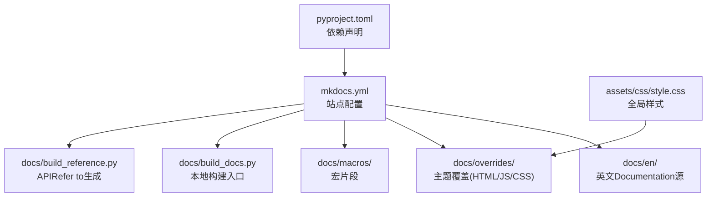
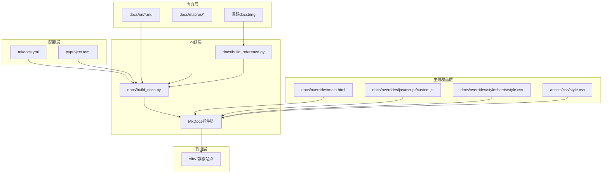
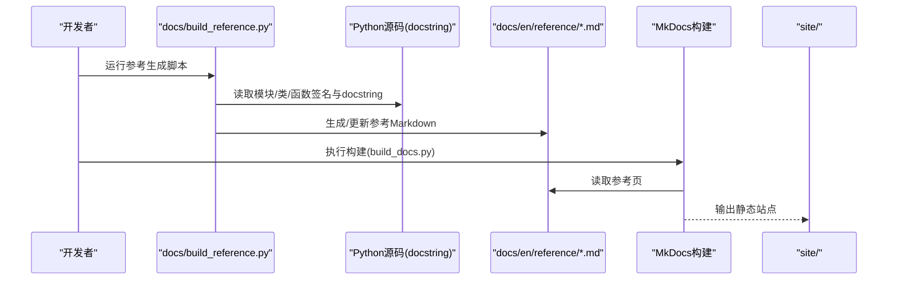
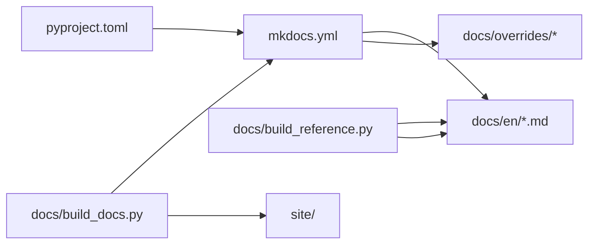

# Documentation System Maintenance

<cite>
**Files Referenced in This Document**
- [mkdocs.yml](file://mkdocs.yml)
- [docs/build_docs.py](file://docs/build_docs.py)
- [docs/build_reference.py](file://docs/build_reference.py)
- [docs/index.html](file://docs/index.html)
- [docs/overrides/main.html](file://docs/overrides/main.html)
- [docs/overrides/javascript/custom.js](file://docs/overrides/javascript/custom.js)
- [docs/overrides/stylesheets/style.css](file://docs/overrides/stylesheets/style.css)
- [assets/css/style.css](file://assets/css/style.css)
- [docs/en/index.md](file://docs/en/index.md)
- [docs/en/reference/index.md](file://docs/en/reference/index.md)
- [docs/en/reference/__init__.md](file://docs/en/reference/__init__.md)
- [docs/mkdocs_github_authors.yaml](file://docs/mkdocs_github_authors.yaml)
- [pyproject.toml](file://pyproject.toml)
</cite>

## Table of Contents
1. [Introduction](#Introduction)
2. [Project Structure](#Project Structure)
3. [Core Components](#Core Components)
4. [Architecture Overview](#Architecture Overview)
5. [Detailed Component Analysis](#Detailed Component Analysis)
6. [Dependency Analysis](#Dependency Analysis)
7. [性能and可维护性建议](#性能and可维护性建议)
8. [Troubleshooting Guide](#Troubleshooting Guide)
9. [Conclusion](#Conclusion)
10. [Appendix](#Appendix)

## Introduction
本指南targetingYOLO-Master项目的Documentation System Maintenance者，聚焦于基于MkDocs的Documentation站点构建、主题定制、APIRefer to自动生成、多语言维护、自动化构建and部署、搜索and导航Optimization、内容编写最佳实践、版本管理andMigration策略，Centered onand新增/更新页面流程。目标是帮助读者快速上手并高效维护高质量的技术Documentation站点。

## Project Structure
Documentation系统围绕Centered on下关键Table of Contentsand文件组织：
- docs：Documentation源（Markdown）、构建脚本、主题覆盖、宏and资源
- assets/css：全局样式
- mkdocs.yml：MkDocs主配置
- pyproject.toml：Python工程and依赖声明（含Documentation相关依赖）
- docs/en：英文DocumentationRoot Directory（多语言扩展时可按需复制for其他语言Table of Contents）

Figure Source
- [mkdocs.yml](file://mkdocs.yml)
- [docs/build_docs.py](file://docs/build_docs.py)
- [docs/build_reference.py](file://docs/build_reference.py)
- [docs/overrides/main.html](file://docs/overrides/main.html)
- [docs/overrides/javascript/custom.js](file://docs/overrides/javascript/custom.js)
- [docs/overrides/stylesheets/style.css](file://docs/overrides/stylesheets/style.css)
- [assets/css/style.css](file://assets/css/style.css)
- [pyproject.toml](file://pyproject.toml)

Section Source
- [mkdocs.yml](file://mkdocs.yml)
- [docs/build_docs.py](file://docs/build_docs.py)
- [docs/build_reference.py](file://docs/build_reference.py)
- [docs/overrides/main.html](file://docs/overrides/main.html)
- [docs/overrides/javascript/custom.js](file://docs/overrides/javascript/custom.js)
- [docs/overrides/stylesheets/style.css](file://docs/overrides/stylesheets/style.css)
- [assets/css/style.css](file://assets/css/style.css)
- [pyproject.toml](file://pyproject.toml)

## Core Components
- MkDocs站点配置：定义站点元信息、主题、插件、导航、多语言etc.。
- 主题覆盖：ViaoverridesTable of Contents注入自定义HTML模板、JavaScriptandCSS，implementing品牌化and交互增强。
- 构建脚本：build_docs.py负责常规构建；build_reference.py负责从源码docstring生成APIRefer to。
- 宏and片段：macrosTable of Contents存放可复用的表格/参数说明片段，供各页面引用。
- 多语言：Centered ondocs/enfor基准，按语言子Table of Contents组织，Combined withMkDocs多语言插件或仓库级方案进行同步。
- 依赖管理：whilepyproject.toml中声明Documentation相关依赖，确保环境一致性。

Section Source
- [mkdocs.yml](file://mkdocs.yml)
- [docs/build_docs.py](file://docs/build_docs.py)
- [docs/build_reference.py](file://docs/build_reference.py)
- [docs/overrides/main.html](file://docs/overrides/main.html)
- [docs/overrides/javascript/custom.js](file://docs/overrides/javascript/custom.js)
- [docs/overrides/stylesheets/style.css](file://docs/overrides/stylesheets/style.css)
- [assets/css/style.css](file://assets/css/style.css)
- [pyproject.toml](file://pyproject.toml)

## Architecture Overview
下图展示了Documentation站点的整体构建and渲染流程，包括配置加载、主题覆盖、插件处理、Refer to生成and最终输出。

Figure Source
- [mkdocs.yml](file://mkdocs.yml)
- [docs/build_docs.py](file://docs/build_docs.py)
- [docs/build_reference.py](file://docs/build_reference.py)
- [docs/overrides/main.html](file://docs/overrides/main.html)
- [docs/overrides/javascript/custom.js](file://docs/overrides/javascript/custom.js)
- [docs/overrides/stylesheets/style.css](file://docs/overrides/stylesheets/style.css)
- [assets/css/style.css](file://assets/css/style.css)
- [pyproject.toml](file://pyproject.toml)

## Detailed Component Analysis

### MkDocs站点配置（mkdocs.yml）
- 作用：定义站点标题、描述、主题、插件、导航树、多语言、仓库链接、搜索andSEOetc.。
- 关键点：
  - 主题and插件：启用必要的插件（such as搜索、多语言、宏、GitHub作者etc.）。
  - 导航：集中管理页面顺序and分组，便于跨语言保持一致结构。
  - 多语言：配置默认语言and备选语言，统一路由前缀。
  - 仓库and作者：关联代码仓库and贡献者映射，提升协作体验。
  - 站点URLand路径：设置正确的base URLand相对路径，避免资源加载失败。

Section Source
- [mkdocs.yml](file://mkdocs.yml)

### 主题覆盖（overrides）
- main.html：覆盖默认布局，注入站点头部/尾部、统计脚本、自定义菜单etc.。
- custom.js：while页面加载后执行，增强搜索、导航、交互行for。
- style.css：覆盖主题样式，统一品牌色、字体、间距etc.。
- assets/css/style.css：作for全局样式补充，被主题覆盖引入。

Section Source
- [docs/overrides/main.html](file://docs/overrides/main.html)
- [docs/overrides/javascript/custom.js](file://docs/overrides/javascript/custom.js)
- [docs/overrides/stylesheets/style.css](file://docs/overrides/stylesheets/style.css)
- [assets/css/style.css](file://assets/css/style.css)

### 构建脚本（docs/build_docs.py）
- 作用：Encapsulates本地构建命令，统一环境变量、清理输出、并行构建etc.。
- 典型流程：
  - 解析命令行参数（such as是否包含Refer to生成、是否开启调试Logging）。
  - CallsMkDocs CLI或Python API执行构建。
  - 输出站点to指定Table of Contents，便于预览and部署。

Section Source
- [docs/build_docs.py](file://docs/build_docs.py)

### APIRefer to自动生成（docs/build_reference.py）
- 目标：从Python源码中提取docstring，生成结构化APIRefer to页，保持and代码同步。
- 流程概览：
  - 扫描目标Modulesand类/函数。
  - 提取签名、参数、返回值、Examplesand备注。
  - 将结果写入Markdown模板，插入todocs/en/reference下。
  - 由MkDocs统一渲染to站点。

Figure Source
- [docs/build_reference.py](file://docs/build_reference.py)
- [docs/en/reference/index.md](file://docs/en/reference/index.md)
- [docs/en/reference/__init__.md](file://docs/en/reference/__init__.md)
- [docs/build_docs.py](file://docs/build_docs.py)

Section Source
- [docs/build_reference.py](file://docs/build_reference.py)
- [docs/en/reference/index.md](file://docs/en/reference/index.md)
- [docs/en/reference/__init__.md](file://docs/en/reference/__init__.md)
- [docs/build_docs.py](file://docs/build_docs.py)

### 多语言Documentation维护
- Table of Contents结构：Centered ondocs/enfor基准，新增语言时创建对应Table of Contents（such asdocs/zh），并whilemkdocs.yml中注册。
- 翻译流程：
  - 复制英文页面to新语言Table of Contents，逐页翻译并保持路径一致。
  - Uses统一的导航结构，确保跨语言跳转稳定。
  - 对动态生成的Refer to页，考虑按语言拆分或仅维护英文Refer to。
- 同步机制：
  - ViaCITasks对比语言Table of Contents差异，Tips缺失翻译。
  - Uses宏and片段减少重复内容，降低同步成本。

Section Source
- [mkdocs.yml](file://mkdocs.yml)
- [docs/en/index.md](file://docs/en/index.md)

### 构建and部署自动化
- 本地构建：Viadocs/build_docs.py一键构建，Supporting增量and清理选项。
- CI/CD：whileGitHub Actions或其他流水线中Installing Dependencies、执行Refer to生成、构建站点、发布至托管平台。
- 缓存策略：缓存Python包andMkDocs中间产物，加速构建。
- 版本发布：Combining标签触发构建，生成带版本号的站点分支或路径。

Section Source
- [docs/build_docs.py](file://docs/build_docs.py)
- [pyproject.toml](file://pyproject.toml)

### 搜索and导航Optimization
- 搜索：启用Built-in搜索引擎，必要时添加自定义索引逻辑或第三方插件。
- 导航：whilemkdocs.yml中集中管理导航树，保证层级清晰、命名一致。
- SEO：完善站点元数据、站点地图androbots.txt，提升可发现性。
- User体验：Viacustom.jsimplementing锚点高亮、回to顶部、面包屑etc.增强功能。

Section Source
- [mkdocs.yml](file://mkdocs.yml)
- [docs/overrides/javascript/custom.js](file://docs/overrides/javascript/custom.js)

### 内容编写最佳实践and模板
- 规范：
  - Uses一致的标题层级and术语表。
  - 每个页面包含简短摘要、前置条件、步骤and常见问题。
  - 图片and代码块provides替代文本and注释。
- 模板：
  - 新建页面时Refer to现有模板（such asdocs/en/index.md），保持结构and风格一致。
  - Usesmacros中的表格and参数片段，减少重复劳动。
- 质量检查：
  - 本地构建Validation链接and图片路径。
  - Useslint工具检查Markdown格式and拼写。

Section Source
- [docs/en/index.md](file://docs/en/index.md)
- [docs/macros](file://docs/macros)

### 版本管理andMigration策略
- 版本标记：while仓库中Uses语义化版本标签，CI根据标签构建对应版本的Documentation站点。
- Migration策略：
  - 大版本升级前先EvaluationMkDocsand插件兼容性。
  - 逐步替换已弃用配置项，保留向后兼容的过渡期。
  - 记录变更Logging，指导User从旧版DocumentationMigrationto新版。

Section Source
- [mkdocs.yml](file://mkdocs.yml)
- [pyproject.toml](file://pyproject.toml)

### such as何添加新页面and更新现有内容
- 新增页面：
  - whiledocs/en下创建Markdown文件，遵循现有Table of Contents约定。
  - whilemkdocs.yml的导航中添加条目，确保排序合理。
  - 若涉andAPIRefer to，先运行Refer to生成脚本再构建站点。
- 更新内容：
  - 直接编辑现有Markdown，注意保持链接and图片路径有效。
  - Uses宏and片段替换重复内容，提高可维护性。
  - 本地构建Validation无误后提交PR。

Section Source
- [mkdocs.yml](file://mkdocs.yml)
- [docs/en/index.md](file://docs/en/index.md)
- [docs/build_reference.py](file://docs/build_reference.py)

## Dependency Analysis
- 工程依赖：pyproject.toml声明了构建and渲染所需的Python包（such asMkDocs、主题、插件、Refer to生成工具etc.）。
- Runtime Dependencies：构建阶段需要Node/浏览器无关的渲染capabilities；主题覆盖不依赖外部运行时。
- 耦合and内聚：
  - mkdocs.ymlanddocs/en强耦合（导航and内容路径）。
  - build_docs.pyandbuild_reference.py松耦合，可Via参数控制是否生成Refer to。
  - 主题覆盖andMkDocs主题解耦，便于替换主题而不影响内容。

Figure Source
- [pyproject.toml](file://pyproject.toml)
- [mkdocs.yml](file://mkdocs.yml)
- [docs/build_docs.py](file://docs/build_docs.py)
- [docs/build_reference.py](file://docs/build_reference.py)

Section Source
- [pyproject.toml](file://pyproject.toml)
- [mkdocs.yml](file://mkdocs.yml)
- [docs/build_docs.py](file://docs/build_docs.py)
- [docs/build_reference.py](file://docs/build_reference.py)

## 性能and可维护性建议
- 构建性能：
  - 启用增量构建and缓存，避免全量重建。
  - 限制Refer to生成范围，按需只更新变更Modules。
- 主题性能：
  - 精简自定义CSS/JS，避免阻塞渲染。
  - Uses异步加载非关键脚本。
- 可维护性：
  - 将通用片段放入macros，减少重复。
  - whilemkdocs.yml中集中管理导航，避免分散配置。
  - for重要页面添加“最后更新时间”and贡献者信息。

[本节for通用建议，无需特定文件来源]

## Troubleshooting Guide
- 构建失败：
  - 检查mkdocs.yml语法and路径是否正确。
  - 确认依赖安装完整，版本兼容。
  - 查看构建Logging定位具体错误。
- Refer to生成异常：
  - 确认目标Modules可导入且docstring完整。
  - 检查生成脚本的输出Table of Contents权限。
- 主题覆盖失效：
  - 确认overridesTable of Contents结构and文件名符合主题要求。
  - 检查CSS/JS路径and资源加载状态。
- 多语言问题：
  - 核对mkdocs.yml中语言注册and导航条目。
  - 确保各语言Table of Contents路径一致。

Section Source
- [mkdocs.yml](file://mkdocs.yml)
- [docs/build_docs.py](file://docs/build_docs.py)
- [docs/build_reference.py](file://docs/build_reference.py)
- [docs/overrides/main.html](file://docs/overrides/main.html)
- [docs/overrides/javascript/custom.js](file://docs/overrides/javascript/custom.js)
- [docs/overrides/stylesheets/style.css](file://docs/overrides/stylesheets/style.css)

## Conclusion
Via合理的MkDocs配置、主题覆盖、Refer to自动生成and多语言维护策略，YOLO-Master的Documentation系统可implementing高效构建、良好体验and长期可维护性。建议持续Optimization导航and搜索、完善模板and最佳实践，并将构建and部署纳入CI/CD，确保Documentationand代码同步演进。

[本节for总结性内容，无需特定文件来源]

## Appendix
- 常用命令：
  - 本地构建：运行docs/build_docs.py
  - 生成APIRefer to：运行docs/build_reference.py
  - 预览站点：启动本地服务器（依据MkDocs配置）
- Refer to文件：
  - 站点首页：docs/en/index.md
  - Refer to首页：docs/en/reference/index.md
  - Refer to初始化：docs/en/reference/__init__.md
  - GitHub作者映射：docs/mkdocs_github_authors.yaml

Section Source
- [docs/en/index.md](file://docs/en/index.md)
- [docs/en/reference/index.md](file://docs/en/reference/index.md)
- [docs/en/reference/__init__.md](file://docs/en/reference/__init__.md)
- [docs/mkdocs_github_authors.yaml](file://docs/mkdocs_github_authors.yaml)