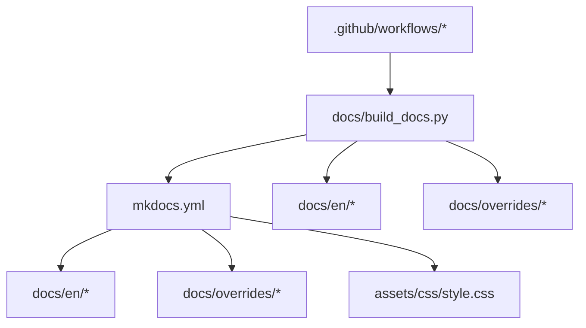
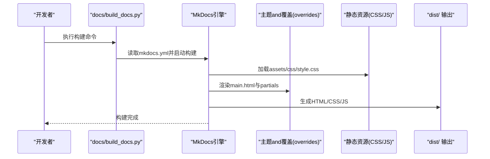
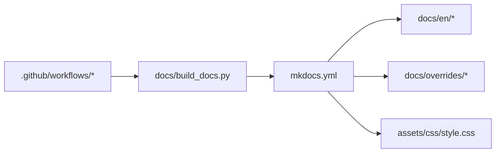

# MkDocs配置and构建

<cite>
**Files Referenced in This Document**
- [mkdocs.yml](file://mkdocs.yml)
- [build_docs.py](file://docs/build_docs.py)
- [index.html](file://docs/index.html)
- [overrides/main.html](file://docs/overrides/main.html)
- [assets/css/style.css](file://assets/css/style.css)
- [overrides/javascript/custom.js](file://docs/overrides/javascript/custom.js)
- [overrides/partials/nav-item.html](file://docs/overrides/partials/nav-item.html)
- [overrides/stylesheets/custom.css](file://docs/overrides/stylesheets/custom.css)
- [en/index.md](file://docs/en/index.md)
- [en/quickstart.md](file://docs/en/quickstart.md)
- [en/datasets/index.md](file://docs/en/datasets/index.md)
- [en/guides/index.md](file://docs/en/guides/index.md)
- [en/help/index.md](file://docs/en/help/index.md)
- [en/hub/index.md](file://docs/en/hub/index.md)
- [en/inference/index.md](file://docs/en/inference/index.md)
- [en/integrations/index.md](file://docs/en/integrations/index.md)
- [en/models/index.md](file://docs/en/models/index.md)
- [en/modes/index.md](file://docs/en/modes/index.md)
- [en/platform/index.md](file://docs/en/platform/index.md)
- [en/reference/index.md](file://docs/en/reference/index.md)
- [en/solutions/index.md](file://docs/en/solutions/index.md)
- [en/tasks/index.md](file://docs/en/tasks/index.md)
- [en/usage/index.md](file://docs/en/usage/index.md)
- [en/yolov5/index.md](file://docs/en/yolov5/index.md)
</cite>

## Table of Contents
1. [Introduction](#Introduction)
2. [Project Structure](#Project Structure)
3. [Core Components](#Core Components)
4. [Architecture Overview](#Architecture Overview)
5. [Detailed Component Analysis](#Detailed Component Analysis)
6. [Dependency Analysis](#Dependency Analysis)
7. [Performance Considerations](#Performance Considerations)
8. [Troubleshooting Guide](#Troubleshooting Guide)
9. [Conclusion](#Conclusion)
10. [Appendix](#Appendix)

## Introduction
本指南targetingYOLO-Master项目的Documentation工程，聚焦于基于MkDocs的站点配置、主题and插件定制、构建流程自动化、搜索Optimization、多语言组织、版本发布and缓存策略。DocumentationCentered on仓库中实际存while的配置文件and脚本for依据，帮助读者快速搭建、定制并高效维护项目Documentation站点。

## Project Structure
andDocumentation构建直接相关的顶层and子Table of Contentssuch as下：
- mkdocs.yml：MkDocs站点主配置（站点元数据、导航、主题、插件etc.）
- docs/：Documentation源内容and自定义资源
  - en/：英文Documentation内容（按功能域分Table of Contents）
  - overrides/：主题覆盖（模板、样式、脚本）
  - assets/css/style.css：全局样式覆盖入口
  - build_docs.py：Documentation构建脚本（Encapsulates构建命令、参数and环境）
  - index.html：Optional的首页重定向或占位页
- .github/workflows/：CI工作流（用于自动构建and发布）

Figure Source
- [mkdocs.yml](file://mkdocs.yml)
- [build_docs.py](file://docs/build_docs.py)
- [assets/css/style.css](file://assets/css/style.css)
- [overrides/main.html](file://docs/overrides/main.html)

Section Source
- [mkdocs.yml](file://mkdocs.yml)
- [build_docs.py](file://docs/build_docs.py)
- [index.html](file://docs/index.html)

## Core Components
- 站点配置（mkdocs.yml）
  - 站点元数据：站点名称、描述、版权、仓库地址etc.
  - 导航结构：Vianav定义多级菜单and页面映射
  - 主题配置：选择主题and主题相关选项
  - 插件设置：启用search、i18n、宏生成etc.插件and其参数
- 构建脚本（docs/build_docs.py）
  - Encapsulatesmkdocs build/run命令
  - Supporting传入额外参数（such as--strict、--config-fileetc.）
  - provides本地预览and生产构建的Unified entry point
- 主题覆盖（docs/overrides/*）
  - main.html：站点根模板覆盖
  - partials/*：局部模板覆盖（such as导航项）
  - stylesheets/* and assets/css/*：CSS覆盖
  - javascript/*：JS扩展（such as埋点、交互增强）
- 多语言内容（docs/en/*）
  - 按功能域划分：datasets、guides、help、hub、inference、integrations、models、modes、platform、reference、solutions、tasks、usage、yolov5etc.
  - 各域包含index.md作for该域的入口页

Section Source
- [mkdocs.yml](file://mkdocs.yml)
- [build_docs.py](file://docs/build_docs.py)
- [overrides/main.html](file://docs/overrides/main.html)
- [assets/css/style.css](file://assets/css/style.css)
- [overrides/javascript/custom.js](file://docs/overrides/javascript/custom.js)
- [overrides/partials/nav-item.html](file://docs/overrides/partials/nav-item.html)
- [overrides/stylesheets/custom.css](file://docs/overrides/stylesheets/custom.css)
- [en/index.md](file://docs/en/index.md)
- [en/datasets/index.md](file://docs/en/datasets/index.md)
- [en/guides/index.md](file://docs/en/guides/index.md)
- [en/help/index.md](file://docs/en/help/index.md)
- [en/hub/index.md](file://docs/en/hub/index.md)
- [en/inference/index.md](file://docs/en/inference/index.md)
- [en/integrations/index.md](file://docs/en/integrations/index.md)
- [en/models/index.md](file://docs/en/models/index.md)
- [en/modes/index.md](file://docs/en/modes/index.md)
- [en/platform/index.md](file://docs/en/platform/index.md)
- [en/reference/index.md](file://docs/en/reference/index.md)
- [en/solutions/index.md](file://docs/en/solutions/index.md)
- [en/tasks/index.md](file://docs/en/tasks/index.md)
- [en/usage/index.md](file://docs/en/usage/index.md)
- [en/yolov5/index.md](file://docs/en/yolov5/index.md)

## Architecture Overview
下图展示了从源码to静态站点的整体构建链路，包括配置加载、内容解析、主题渲染and输出产物。

Figure Source
- [mkdocs.yml](file://mkdocs.yml)
- [build_docs.py](file://docs/build_docs.py)
- [overrides/main.html](file://docs/overrides/main.html)
- [assets/css/style.css](file://assets/css/style.css)

## Detailed Component Analysis

### 站点配置（mkdocs.yml）
- 站点元数据
  - 站点名称、描述、版权信息、仓库URLetc.字段用于生成站点头部、侧边栏and页脚信息
- 导航结构（nav）
  - Via键值对and列表组合定义多级菜单；每个条目指向docs下的Markdown文件或外部链接
  - 建议for每个功能域providesindex.md作for聚合入口，便于导航andSEO
- 主题配置
  - 指定主题名称and主题级选项（such aslogo、favicon、配色、字体etc.）
  - 可Viatheme.custom_dir指向自定义覆盖Table of Contents
- 插件设置
  - search：启用站内全文检索
  - i18n：多语言Supporting（需Combined withcontent_baseand翻译文件组织）
  - 其他插件：such as宏替换、代码高亮增强etc.按需启用
- 资源and覆盖
  - extra_css/extra_javascript：引入自定义样式and脚本
  - theme.custom_dir：指向docs/overrides，implementing模板and样式覆盖
- 站点行for
  - strict模式：while构建时开启严格检查，提前发现错误
  - dev_server：本地开发服务器端口and热重载配置
  - repo_url/repo_name：用于“编辑此页”and仓库跳转

Section Source
- [mkdocs.yml](file://mkdocs.yml)

### 构建脚本（docs/build_docs.py）
- 功能概述
  - Encapsulatesmkdocs命令行，统一本地开发andCI构建入口
  - Supporting传递额外参数（such as--strict、--config-file、--site-diretc.）
  - 可区分本地预览（serve）and生产构建（build）两种模式
- Uses方式
  - 本地预览：运行脚本进入开发服务器，修改内容后自动刷新
  - 生产构建：生成静态站点至distTable of Contents，供部署平台托管
- 环境变量and参数
  - 可Via环境变量控制Logging级别、是否启用缓存、目标站点Table of Contentsetc.
  - 建议whileCI中固定PythonandMkDocs版本，确保构建一致性

Section Source
- [build_docs.py](file://docs/build_docs.py)

### 主题覆盖and样式定制
- 模板覆盖
  - main.html：覆盖站点根模板，可注入全局变量、统计脚本、自定义头部/尾部
  - partials/nav-item.html：覆盖导航项渲染逻辑，implementing特殊链接或图标
- 样式覆盖
  - assets/css/style.css：作for全局样式入口，被mkdocs.yml引用
  - overrides/stylesheets/custom.css：主题内样式覆盖，优先级高于默认样式
- JavaScript扩展
  - docs/overrides/javascript/custom.js：注入前端交互、埋点、动态行for
- 最佳实践
  - 将通用样式放入assets/css/style.css，主题特定样式放入overrides/stylesheets
  - JS脚本尽量异步加载，避免阻塞首屏渲染
  - Uses命名空间或前缀避免and主题默认样式冲突

Section Source
- [overrides/main.html](file://docs/overrides/main.html)
- [overrides/partials/nav-item.html](file://docs/overrides/partials/nav-item.html)
- [assets/css/style.css](file://assets/css/style.css)
- [overrides/stylesheets/custom.css](file://docs/overrides/stylesheets/custom.css)
- [overrides/javascript/custom.js](file://docs/overrides/javascript/custom.js)

### Documentation搜索配置andOptimization
- 启用search插件
  - whilemkdocs.yml中启用search，并确保内容足够丰富Centered on提升召回率
- 索引Optimization
  - 合理拆分大Documentation，避免单页过大导致索引缓慢
  - Uses标题层级and关键词提升搜索相关性
- User体验
  - whilemain.html中可注入搜索框Tips语、快捷键说明
  - Combininganalytics记录热门搜索词，持续Optimization内容结构

Section Source
- [mkdocs.yml](file://mkdocs.yml)
- [overrides/main.html](file://docs/overrides/main.html)

### 多语言Supportingand翻译文件组织
- 内容组织
  - 当前仓库采用docs/en/作for英文内容Root Directory，可按功能域进一步细分
  - 每个域providesindex.md作for聚合入口，便于导航andSEO
- 多语言机制
  - Usesi18n插件时，需配置content_baseand翻译文件路径
  - 建议for每种语言建立独立Table of Contents（such asdocs/en、docs/zh），并Via导航切换
- 翻译协作
  - 制定翻译规范（术语表、风格指南）
  - whileCI中增加翻译完整性校验（缺失文件检测）

Section Source
- [en/index.md](file://docs/en/index.md)
- [en/datasets/index.md](file://docs/en/datasets/index.md)
- [en/guides/index.md](file://docs/en/guides/index.md)
- [en/help/index.md](file://docs/en/help/index.md)
- [en/hub/index.md](file://docs/en/hub/index.md)
- [en/inference/index.md](file://docs/en/inference/index.md)
- [en/integrations/index.md](file://docs/en/integrations/index.md)
- [en/models/index.md](file://docs/en/models/index.md)
- [en/modes/index.md](file://docs/en/modes/index.md)
- [en/platform/index.md](file://docs/en/platform/index.md)
- [en/reference/index.md](file://docs/en/reference/index.md)
- [en/solutions/index.md](file://docs/en/solutions/index.md)
- [en/tasks/index.md](file://docs/en/tasks/index.md)
- [en/usage/index.md](file://docs/en/usage/index.md)
- [en/yolov5/index.md](file://docs/en/yolov5/index.md)

### 版本控制and发布流程自动化
- CI工作流
  - while.github/workflows中定义构建and发布Tasks，触发条件可forpush/tag
  - Installing Dependencies、执行docs/build_docs.py进行构建，产出distTable of Contents
- 发布目标
  - GitHub Pages：将dist推送togh-pages分支或UsesActions部署
  - 对象存储：上传至S3/OSS并清理旧版本
- 版本标记
  - Uses语义化标签（vX.Y.Z）drivers are installed构建and发布
  - while站点中展示版本号and变更Logging链接

Section Source
- [build_docs.py](file://docs/build_docs.py)

### 构建性能Optimizationand缓存策略
- 构建缓存
  - whileCI中缓存Python包andMkDocs依赖，减少重复安装时间
  - 缓存docs/_build或distTable of Contents增量更新
- 并行and增量
  - 启用MkDocs增量构建，仅重建变更页面
  - 大型站点可考虑分页或分Modules构建
- 资源Optimization
  - 压缩CSS/JS，延迟加载非关键脚本
  - 图片Uses现代格式andCDN加速

Section Source
- [build_docs.py](file://docs/build_docs.py)

## Dependency Analysis
- 配置and内容
  - mkdocs.ymldrivers are installeddocs/en/*内容的解析and渲染
- 主题and资源
  - overrides/*andassets/css/*被主题加载，影响最终HTML输出
- 构建脚本andCI
  - docs/build_docs.pyEncapsulates构建命令，.github/workflowsCalls脚本完成自动化

Figure Source
- [mkdocs.yml](file://mkdocs.yml)
- [build_docs.py](file://docs/build_docs.py)
- [overrides/main.html](file://docs/overrides/main.html)
- [assets/css/style.css](file://assets/css/style.css)

Section Source
- [mkdocs.yml](file://mkdocs.yml)
- [build_docs.py](file://docs/build_docs.py)

## Performance Considerations
- 构建阶段
  - Uses--strict模式尽早发现问题，避免后期返工
  - whileCI中缓存依赖and中间产物，缩短流水线时长
- 运行时
  - 减少不必要的JS执行，Prefer静态资源
  - 合理Usessearch插件，避免超大索引文件
- 部署
  - 启用HTTP缓存头andCDN，提升User访问速度
  - 定期清理历史版本，降低存储成本

[This section provides general guidance and does not directly analyze specific files]

## Troubleshooting Guide
- 构建失败
  - 检查mkdocs.yml语法and路径是否正确
  - 确认PythonandMkDocs版本兼容
  - 查看构建Logging中的错误堆栈定位问题
- 主题覆盖无效
  - 确认overridesTable of Contents结构and文件名符合主题要求
  - 检查CSS/JS路径and加载顺序
- 搜索无结果
  - 确认search插件已启用且内容未被忽略
  - 检查页面标题and正文关键词是否充分
- 多语言未生效
  - 核对i18n插件配置and翻译文件路径
  - Validation导航切换逻辑andcontent_base设置

Section Source
- [mkdocs.yml](file://mkdocs.yml)
- [build_docs.py](file://docs/build_docs.py)
- [overrides/main.html](file://docs/overrides/main.html)

## Conclusion
Via合理的mkdocs.yml配置、完善的主题覆盖and插件体系、统一的构建脚本andCI自动化，YOLO-MasterDocumentation可implementing高质量、可扩展、易维护的站点工程。建议持续Optimization搜索体验、多语言协作and构建性能，Centered on提升团队效率andUser满意度。

[This section is summary content and does not directly analyze specific files]

## Appendix
- 常用命令
  - 本地预览：Viadocs/build_docs.py启动开发服务器
  - 生产构建：Viadocs/build_docs.py生成dist静态站点
- Refer to入口
  - 英文主页：docs/en/index.md
  - Quick Start：docs/en/quickstart.md
  - 各功能域入口：docs/en/*/index.md

Section Source
- [en/index.md](file://docs/en/index.md)
- [en/quickstart.md](file://docs/en/quickstart.md)