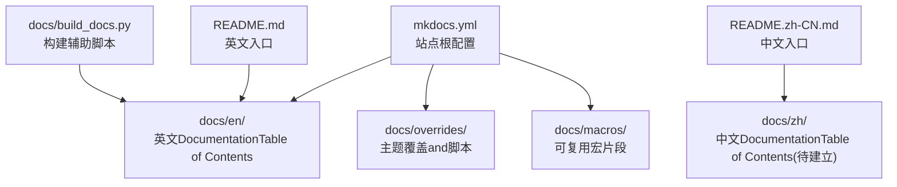
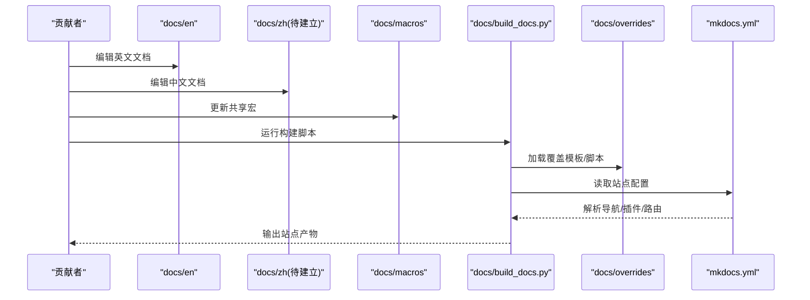
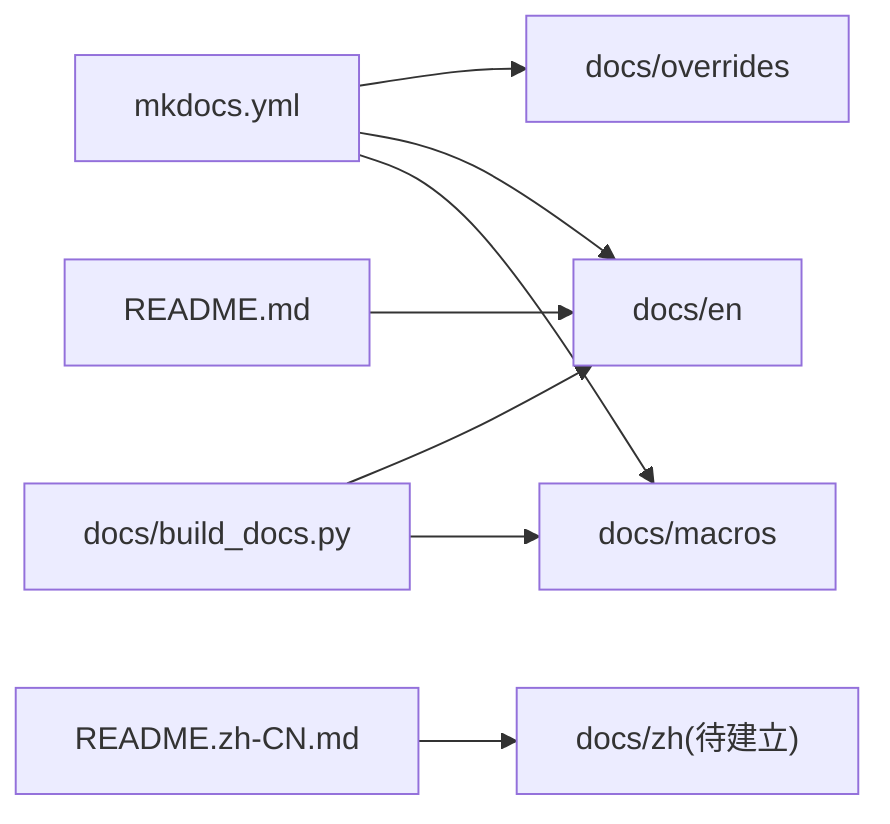

# 多语言DocumentationSupporting

<cite>
**Files Referenced in This Document**
- [mkdocs.yml](file://mkdocs.yml)
- [docs/en/index.md](file://docs/en/index.md)
- [docs/README.md](file://docs/README.md)
- [docs/build_docs.py](file://docs/build_docs.py)
- [docs/mkdocs_github_authors.yaml](file://docs/mkdocs_github_authors.yaml)
- [README.md](file://README.md)
- [README.zh-CN.md](file://README.zh-CN.md)
- [CONTRIBUTING.md](file://CONTRIBUTING.md)
</cite>

## Table of Contents
1. [Introduction](#Introduction)
2. [Project Structure](#Project Structure)
3. [Core Components](#Core Components)
4. [Architecture Overview](#Architecture Overview)
5. [Detailed Component Analysis](#Detailed Component Analysis)
6. [Dependency Analysis](#Dependency Analysis)
7. [Performance Considerations](#Performance Considerations)
8. [Troubleshooting Guide](#Troubleshooting Guide)
9. [Conclusion](#Conclusion)
10. [Appendix](#Appendix)

## Introduction
本指南targetingYOLO-Master项目的多语言Documentation维护，聚焦英文and中文Documentation的组织结构、同步机制、翻译工作流、质量检查、版本一致性策略、术语统一and本地化适配、作者信息国际化配置、新增语言workflow、翻译质量Evaluationand回滚机制，Centered onand代码Examples的多语言适配and平台差异处理。目标是让不同背景的贡献者都能高效参andDocumentation的本地化and维护。

## Project Structure
仓库采用“按主题+按语言”的Documentation组织方式：
- docs/en：英文Documentation主Table of Contents，包含数据集、指南、Refer to、集成、模型、模式、平台、Usesetc.子Table of Contents。
- docs/overrides：构建and展示相关的覆盖模板（样式、脚本、页面模板）。
- docs/macros：可复用的宏片段，用于while不同语言中复用表格and参数说明。
- docs/governance、docs/plans：治理and规划类Documentation（当前Centered on英文for主）。
- mkdocs.yml：站点根配置，定义站点元数据、导航、插件、主题、多语言路由etc.。
- docs/build_docs.py：Documentation构建辅助脚本，负责生成Refer toDocumentation、聚合内容etc.。
- README.md / README.zh-CN.md：仓库级中英文快速入门入口。

Figure Source
- [mkdocs.yml](file://mkdocs.yml)
- [docs/en/index.md](file://docs/en/index.md)
- [docs/build_docs.py](file://docs/build_docs.py)

Section Source
- [mkdocs.yml](file://mkdocs.yml)
- [docs/en/index.md](file://docs/en/index.md)
- [docs/README.md](file://docs/README.md)
- [docs/build_docs.py](file://docs/build_docs.py)

## Core Components
- 站点根配置（mkdocs.yml）
  - 定义站点标题、描述、仓库地址、导航树、主题and插件、多语言路由规则、GitHub作者映射etc.。
  - Via导航and插件协同implementing多语言站点结构and访问路径控制。
- 英文Documentation集（docs/en）
  - 按功能域分Table of Contents组织，便于独立更新and定位。
- 构建辅助脚本（docs/build_docs.py）
  - provides自动化capabilities，such as生成APIRefer to、聚合宏、预处理素材etc.，减少重复劳动。
- 主题覆盖（docs/overrides）
  - 自定义样式、脚本and页面模板，支撑多语言切换、搜索、导航etc.体验Optimization。
- 仓库级入口（README.md / README.zh-CN.md）
  - 作forUser第一触点，引导至对应语言Documentation站点的首页或Quick Start页。

Section Source
- [mkdocs.yml](file://mkdocs.yml)
- [docs/en/index.md](file://docs/en/index.md)
- [docs/build_docs.py](file://docs/build_docs.py)
- [README.md](file://README.md)
- [README.zh-CN.md](file://README.zh-CN.md)

## Architecture Overview
下图展示了多语言Documentation从源码to站点的整体流程：开发者while各自语言Table of Contents下编辑Markdown，借助构建脚本and主题覆盖进行渲染，最终由站点根配置drivers are installed生成多语言站点。

Figure Source
- [mkdocs.yml](file://mkdocs.yml)
- [docs/build_docs.py](file://docs/build_docs.py)
- [docs/en/index.md](file://docs/en/index.md)

## Detailed Component Analysis

### 站点根配置（mkdocs.yml）
- 职责
  - 定义站点元数据、导航结构、主题and插件、多语言路由、GitHub作者映射etc.。
  - 协调多语言页面的URL路径and跳转逻辑。
- 关键要点
  - 导航需for每种语言预留一致的层级结构，便于跨语言对照。
  - 插件and主题应Supporting多语言切换andSEO友好（such assitemap、alternate链接）。
  - GitHub作者映射文件用于显示贡献者信息，避免硬编码。

Section Source
- [mkdocs.yml](file://mkdocs.yml)

### 英文Documentation集（docs/en）
- 职责
  - 承载英文侧所有UserDocumentation，包括数据集、指南、Refer to、集成、模型、模式、平台、Usesetc.。
- 关键要点
  - 保持Table of Contents结构and中文一致，便于后续镜像and同步。
  - Uses相对链接and宏引用，降低跨文件维护成本。

Section Source
- [docs/en/index.md](file://docs/en/index.md)

### 构建辅助脚本（docs/build_docs.py）
- 职责
  - 自动化生成Refer toDocumentation、聚合宏、预处理素材，提升构建效率and一致性。
- 关键要点
  - 将易变内容（such as参数表、capabilities矩阵）从静态Markdown中抽离，集中管理。
  - while多语言场景下，确保生成的产物能被各语言站点正确引用。

Section Source
- [docs/build_docs.py](file://docs/build_docs.py)

### 主题覆盖（docs/overrides）
- 职责
  - 定制样式、脚本and页面模板，增强多语言切换、导航、搜索etc.体验。
- 关键要点
  - 多语言切换按钮、语言选择器、默认语言设置需while覆盖模板中明确。
  - 注意and第三方插件的兼容性，避免冲突。

Section Source
- [docs/overrides/main.html](file://docs/overrides/main.html)

### 仓库级入口（README.md / README.zh-CN.md）
- 职责
  - 作forUser第一触点，分别指向英文and中文的Quick StartandDocumentation入口。
- 关键要点
  - 保持两版入口的一致性，and时同步变更。
  - 链接to对应语言的站点首页或Quick Start页。

Section Source
- [README.md](file://README.md)
- [README.zh-CN.md](file://README.zh-CN.md)

### 作者信息国际化（mkdocs_github_authors.yaml）
- 职责
  - 集中管理GitHub作者映射，避免whileDocumentation中硬编码作者名，Supporting国际化显示。
- 关键要点
  - 新增贡献者时，优先更新此映射文件。
  - and站点配置联动，确保作者信息while各语言站点一致显示。

Section Source
- [docs/mkdocs_github_authors.yaml](file://docs/mkdocs_github_authors.yaml)

## Dependency Analysis
- Modules耦合
  - mkdocs.yml drivers are installed整个站点构建，依赖主题覆盖and插件生态。
  - build_docs.py 产出供各语言站点引用的中间产物。
  - docs/en and未来 docs/zh 应保持结构对称，降低同步复杂度。
- External Dependencies
  - MkDocs生态（主题、插件）、GitHub作者映射、CI流水线（Optional）。

Figure Source
- [mkdocs.yml](file://mkdocs.yml)
- [docs/build_docs.py](file://docs/build_docs.py)
- [docs/en/index.md](file://docs/en/index.md)

Section Source
- [mkdocs.yml](file://mkdocs.yml)
- [docs/build_docs.py](file://docs/build_docs.py)
- [docs/en/index.md](file://docs/en/index.md)

## Performance Considerations
- 构建性能
  - 将动态内容抽取to脚本生成，减少大段Markdown体积。
  - 合理Uses宏and片段，避免重复渲染开销。
- 站点性能
  - 启用缓存and增量构建，缩短迭代时间。
  - 图片and资源按需压缩and懒加载。

[本节for通用建议，不直接分析具体文件]

## Troubleshooting Guide
- 常见问题
  - 多语言路由异常：检查mkdocs.yml中的导航and路由配置是否完整。
  - 作者信息显示错误：核对mkdocs_github_authors.yaml映射是否正确。
  - 构建失败：确认build_docs.py依赖and输入路径是否存while。
- 回滚策略
  - 基于Git提交记录回滚to上一个稳定版本的Documentation分支。
  - 对已发布的站点产物保留历史快照，必要时恢复旧版本。

Section Source
- [mkdocs.yml](file://mkdocs.yml)
- [docs/mkdocs_github_authors.yaml](file://docs/mkdocs_github_authors.yaml)
- [docs/build_docs.py](file://docs/build_docs.py)

## Conclusion
Via清晰的Table of Contents结构、统一的站点配置、自动化的构建脚本and主题覆盖，YOLO-Master的多语言Documentation体系具备良好的可Extensibilityand可维护性。遵循本指南workflowand规范，可有效保障英文and中文Documentation的一致性and高质量交付。

[This section is summary content and does not directly analyze specific files]

## Appendix

### 翻译工作流程andTasks分配
- 角色分工
  - 原文负责人：维护英文源Documentation，保证准确性and时效性。
  - 翻译负责人：负责中文翻译and本地化适配。
  - 审校负责人：进行术语一致性、可读性and技术准确性审查。
  - 发布负责人：合并PR、触发构建and发布。
- Tasks流转
  - 创建翻译Tasks → 分配译者 → 完成初译 → 同行审校 → 合并and发布。
- 工具建议
  - Uses协作平台（such asGitHub Issues/Pull Requests）TrackingTasksand评审。
  - 利用术语表and风格指南约束翻译质量。

[本节for流程性内容，不直接分析具体文件]

### 质量检查and验收标准
- 术语一致性：对照术语表，确保关键概念翻译统一。
- 可读性：语句通顺、段落清晰、Examples可执行。
- 完整性：and英文源Documentation章节一一对应，无遗漏。
- 链接有效性：内部and外部链接可用。
- 自动化检查（Optional）：lint、链接校验、拼写检查。

[本节for通用建议，不直接分析具体文件]

### 版本同步策略
- 同步原则
  - Centered on英文for权威源，中文while变更后尽快跟进。
  - 重大更新时，双语同步发布；小修小补可异步更新。
- 同步方法
  - Uses结构化Table of Contentsand命名约定，便于对比andMigration。
  - Via脚本或CITips缺失章节and差异。
- 冲突解决
  - Centered on英文for准，Combining业务上下文协商调整。
  - 记录决策and原因，形成知识库条目。

[本节for通用建议，不直接分析具体文件]

### 技术术语统一and本地化适配
- 术语管理
  - 维护术语表（中英对照），定期评审and更新。
  - whileDocumentation中引入术语注释and链接，提高一致性。
- 本地化适配
  - 单位、日期、数字格式按目标语言习惯调整。
  - Examples命令and路径尽量保持平台无关或provides多平台说明。

[本节for通用建议，不直接分析具体文件]

### 作者信息的国际化配置and管理
- 配置位置
  - Uses集中式作者映射文件，避免whileDocumentation中硬编码。
- 管理机制
  - 新增贡献者时，先更新映射文件，再whileDocumentation中引用。
  - 定期清理无效或重复条目。

Section Source
- [docs/mkdocs_github_authors.yaml](file://docs/mkdocs_github_authors.yaml)

### 新语言添加的完整流程and配置要求
- 步骤
  - while站点根配置中添加新语言路由and导航项。
  - 新建语言Table of Contents（such asdocs/fr），复制并初始化基础结构。
  - 更新主题覆盖Centered onSupporting语言选择器and默认语言。
  - while仓库级入口添加新语言Quick Start链接。
  - Validation构建and站点展示。
- 配置要求
  - 导航层级and现有语言保持一致。
  - 插件and主题对新语言的Supporting需提前Validation。
  - 作者映射andSEO元数据需包含新语言。

Section Source
- [mkdocs.yml](file://mkdocs.yml)
- [docs/overrides/main.html](file://docs/overrides/main.html)
- [README.md](file://README.md)
- [README.zh-CN.md](file://README.zh-CN.md)

### 翻译质量Evaluationand回滚机制
- EvaluationMetrics
  - 术语一致性、可读性、完整性、链接可用性、Examples可执行性。
- Evaluation流程
  - 同行评审 + 抽样抽检 + 自动化检查。
- 回滚机制
  - 基于Git标签或分支回滚to上一稳定版本。
  - 站点产物保留历史快照，必要时恢复旧版本。

[本节for通用建议，不直接分析具体文件]

### 代码Examples的多语言适配and平台差异
- 适配策略
  - Examples代码尽量保持平台无关，或while同一文件中provides多平台说明。
  - Uses环境变量或配置文件区分平台差异。
- Documentation呈现
  - whileExamples前后增加平台注意事项and前置条件。
  - provides常见错误的排查指引。

[本节for通用建议，不直接分析具体文件]