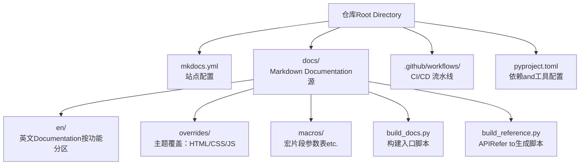
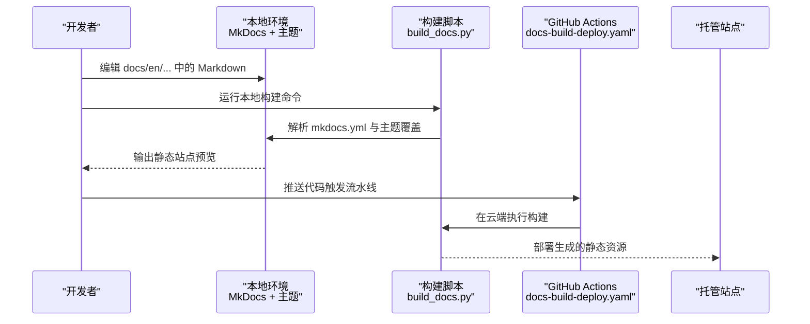
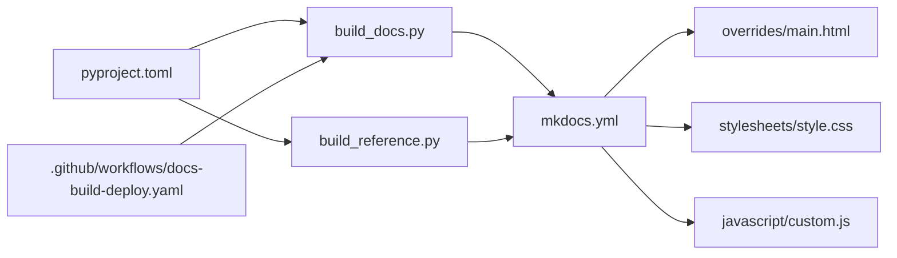

# Documentation编写工作流

<cite>
**Files Referenced in This Document**
- [mkdocs.yml](file://mkdocs.yml)
- [docs/README.md](file://docs/README.md)
- [docs/build_docs.py](file://docs/build_docs.py)
- [docs/build_reference.py](file://docs/build_reference.py)
- [docs/index.html](file://docs/index.html)
- [docs/overrides/main.html](file://docs/overrides/main.html)
- [docs/overrides/stylesheets/style.css](file://docs/overrides/stylesheets/style.css)
- [docs/overrides/javascript/custom.js](file://docs/overrides/javascript/custom.js)
- [docs/en/help/contributing.md](file://docs/en/help/contributing.md)
- [CONTRIBUTING.md](file://CONTRIBUTING.md)
- [.github/workflows/docs-build-deploy.yaml](file://.github/workflows/docs-build-deploy.yaml)
- [pyproject.toml](file://pyproject.toml)
</cite>

## Table of Contents
1. [Introduction](#Introduction)
2. [Project Structure](#Project Structure)
3. [Core Components](#Core Components)
4. [Architecture Overview](#Architecture Overview)
5. [Detailed Component Analysis](#Detailed Component Analysis)
6. [Dependency Analysis](#Dependency Analysis)
7. [性能and构建Optimization](#性能and构建Optimization)
8. [Troubleshooting Guide](#Troubleshooting Guide)
9. [Conclusion](#Conclusion)
10. [Appendix](#Appendix)

## Introduction
本指南targetingYOLO-Master项目的Documentation贡献者，provides从本地开发、内容规范、模板UsestoCI/CD构建and部署的完整工作流说明。目标是帮助作者高效产出高质量、可维护且搜索引擎友好的Documentation。

## Project Structure
本项目采用 MkDocs Material 作forDocumentation站点生成器，源码位于 docs Table of Contents，主题覆盖while docs/overrides，构建脚本位于 docs Root Directory，GitHub Actions 负责自动化构建and部署。

Figure Source
- [mkdocs.yml:1-200](file://mkdocs.yml#L1-L200)
- [docs/build_docs.py:1-200](file://docs/build_docs.py#L1-L200)
- [docs/build_reference.py:1-200](file://docs/build_reference.py#L1-L200)
- [docs/overrides/main.html:1-200](file://docs/overrides/main.html#L1-L200)
- [docs/overrides/stylesheets/style.css:1-200](file://docs/overrides/stylesheets/style.css#L1-L200)
- [docs/overrides/javascript/custom.js:1-200](file://docs/overrides/javascript/custom.js#L1-L200)
- [pyproject.toml:1-200](file://pyproject.toml#L1-L200)

Section Source
- [mkdocs.yml:1-200](file://mkdocs.yml#L1-L200)
- [docs/README.md:1-200](file://docs/README.md#L1-L200)

## Core Components
- 站点配置and导航：Via mkdocs.yml 定义站点元信息、主题、插件、导航树andSEO设置。
- Documentation源码：Centered on Markdown 组织，按 en/ 下的功能域划分，便于多语言扩展and维护。
- 主题覆盖：Via overrides 注入自定义 HTML 片段、样式and脚本，增强交互and展示。
- 构建脚本：build_docs.py 用于本地一键构建；build_reference.py 用于自动生成 API Refer to页。
- CI/CD：GitHub Actions 流水线执行构建and部署Tasks。
- 依赖管理：pyproject.toml 声明构建期依赖andOptional工具。

Section Source
- [mkdocs.yml:1-200](file://mkdocs.yml#L1-L200)
- [docs/build_docs.py:1-200](file://docs/build_docs.py#L1-L200)
- [docs/build_reference.py:1-200](file://docs/build_reference.py#L1-L200)
- [pyproject.toml:1-200](file://pyproject.toml#L1-L200)

## Architecture Overview
下图展示了Documentation站点的端to端流程：开发者while本地编辑 Markdown，运行构建脚本生成静态站点；提交后由 GitHub Actions 自动构建并部署至托管平台。

Figure Source
- [mkdocs.yml:1-200](file://mkdocs.yml#L1-L200)
- [docs/build_docs.py:1-200](file://docs/build_docs.py#L1-L200)
- [.github/workflows/docs-build-deploy.yaml:1-200](file://.github/workflows/docs-build-deploy.yaml#L1-L200)

## Detailed Component Analysis

### 站点配置and导航（mkdocs.yml）
- 站点元信息and主题：定义站点名称、描述、主题and插件。
- 导航结构：按Modules组织页面，确保读者快速定位。
- SEO 配置：站点标题、描述、关键词、Open Graph and Twitter Card etc.。
- 自定义覆盖：引入 overrides 中的 main.html、样式and脚本。
- 构建选项：是否启用增量构建、缓存、链接检查etc.。

Section Source
- [mkdocs.yml:1-200](file://mkdocs.yml#L1-L200)

### Documentation源码组织（docs/en）
- 推荐Table of Contents结构：
  - guides：实践指南and教程
  - reference：API Refer to
  - datasets/models/tasks：领域数据and模型说明
  - help：贡献、行for准则、常见问题
- 命名规范：小写连字符分隔，语义清晰，避免过长路径。
- 跨页引用：Uses相对路径或别名，保持链接稳定。

Section Source
- [docs/README.md:1-200](file://docs/README.md#L1-L200)

### 主题覆盖（docs/overrides）
- main.html：注入站点头部/尾部、侧边栏定制、统计脚本etc.。
- stylesheets/style.css：全局样式微调，such as字体、间距、表格样式。
- javascript/custom.js：客户端交互逻辑，such as搜索增强、外链处理。

Section Source
- [docs/overrides/main.html:1-200](file://docs/overrides/main.html#L1-L200)
- [docs/overrides/stylesheets/style.css:1-200](file://docs/overrides/stylesheets/style.css#L1-L200)
- [docs/overrides/javascript/custom.js:1-200](file://docs/overrides/javascript/custom.js#L1-L200)

### 构建脚本（docs/build_docs.py / docs/build_reference.py）
- build_docs.py：Encapsulates本地构建命令，Supporting清理、增量构建、错误Tips。
- build_reference.py：基于代码库生成 API Refer to页，统一参数表andExamples索引。

Section Source
- [docs/build_docs.py:1-200](file://docs/build_docs.py#L1-L200)
- [docs/build_reference.py:1-200](file://docs/build_reference.py#L1-L200)

### 贡献流程and协作规范
- 分支策略：建议Centered on功能/修复for维度创建分支，合并回主分支前完成审查。
- 提交规范：简洁清晰的提交信息，必要时附带问题编号and变更摘要。
- 代码审查：关注可读性、一致性、链接有效性、图片and多媒体质量。
- 行for准则and安全：遵循社区公约and安全披露流程。

Section Source
- [docs/en/help/contributing.md:1-200](file://docs/en/help/contributing.md#L1-L200)
- [CONTRIBUTING.md:1-200](file://CONTRIBUTING.md#L1-L200)

### CI/CD 流水线（.github/workflows/docs-build-deploy.yaml）
- 触发条件：push/PR 事件。
- 构建步骤：Installing Dependencies、执行构建脚本、生成站点。
- 部署步骤：将静态资源发布至目标平台。
- 失败处理：保留Logging、通知贡献者。

Section Source
- [.github/workflows/docs-build-deploy.yaml:1-200](file://.github/workflows/docs-build-deploy.yaml#L1-L200)

### 依赖and工具（pyproject.toml）
- 构建依赖：MkDocs、Material 主题、必要插件。
- Optional工具：语法检查、链接校验、SEO 辅助脚本。
- 版本锁定：确保团队andCI环境一致。

Section Source
- [pyproject.toml:1-200](file://pyproject.toml#L1-L200)

## Dependency Analysis

Figure Source
- [mkdocs.yml:1-200](file://mkdocs.yml#L1-L200)
- [docs/build_docs.py:1-200](file://docs/build_docs.py#L1-L200)
- [docs/build_reference.py:1-200](file://docs/build_reference.py#L1-L200)
- [docs/overrides/main.html:1-200](file://docs/overrides/main.html#L1-L200)
- [docs/overrides/stylesheets/style.css:1-200](file://docs/overrides/stylesheets/style.css#L1-L200)
- [docs/overrides/javascript/custom.js:1-200](file://docs/overrides/javascript/custom.js#L1-L200)
- [pyproject.toml:1-200](file://pyproject.toml#L1-L200)
- [.github/workflows/docs-build-deploy.yaml:1-200](file://.github/workflows/docs-build-deploy.yaml#L1-L200)

## 性能and构建Optimization
- 增量构建：利用 MkDocs 增量capabilities减少重复编译时间。
- 资源压缩：启用主题and插件的资源压缩选项。
- 图片Optimization：Uses合适格式and尺寸，避免过大图片拖慢加载。
- 缓存策略：合理配置浏览器缓存andCDN缓存头。
- 构建并行：whileCI中并行Installing Dependenciesand构建步骤。

[This section provides general guidance and does not directly analyze specific files]

## Troubleshooting Guide
- 构建失败：检查 mkdocs.yml 语法、主题覆盖路径、依赖版本。
- 链接失效：启用链接检查插件，修正相对路径and别名。
- 样式异常：确认 CSS 未被覆盖冲突，清理浏览器缓存。
- 脚本错误：查看浏览器控制台and构建Logging，定位 JS 报错。
- 权限问题：CI 部署凭据and目标平台访问控制。

Section Source
- [mkdocs.yml:1-200](file://mkdocs.yml#L1-L200)
- [docs/overrides/main.html:1-200](file://docs/overrides/main.html#L1-L200)
- [docs/overrides/stylesheets/style.css:1-200](file://docs/overrides/stylesheets/style.css#L1-L200)
- [docs/overrides/javascript/custom.js:1-200](file://docs/overrides/javascript/custom.js#L1-L200)

## Conclusion
through a unified配置、规范的源码组织、完善的主题覆盖and自动化流水线，YOLO-Master Documentation体系具备高可维护性and可Extensibility。遵循本工作流，贡献者可高效产出高质量Documentation，并确保站点稳定发布and良好体验。

[This section is summary content and does not directly analyze specific files]

## Appendix

### 最佳实践清单
- 内容结构：先概述后细节，分节明确，层级不超过四级。
- 写作风格：简洁准确，术语一致，避免歧义。
- 格式规范：Uses标准 Markdown，图片and代码块标注来源and许可证。
- 模板Uses：优先复用 macros andRefer to页模板，保证一致性。
- SEO Optimization：完善标题、描述、关键词and结构化数据。
- 多媒体嵌入：图片Uses WebP/AVIF，视频provides多码率and字幕。
- 质量检查：本地运行构建and链接检查，CI 自动Validation。
- 贡献流程：分支隔离、提交清晰、审查完备。

[This section provides general guidance and does not directly analyze specific files]