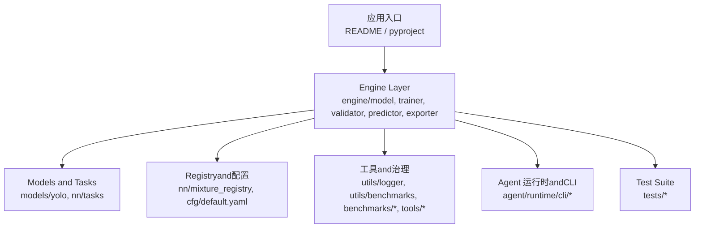
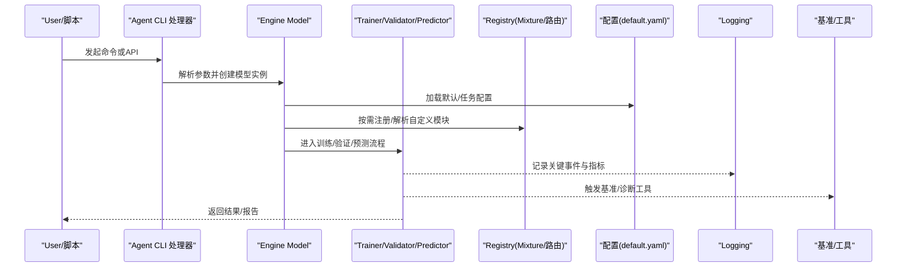
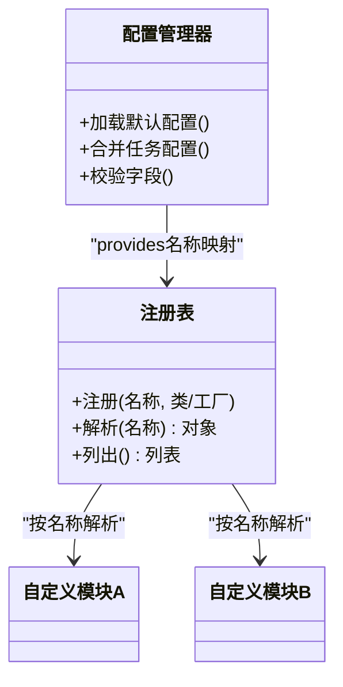
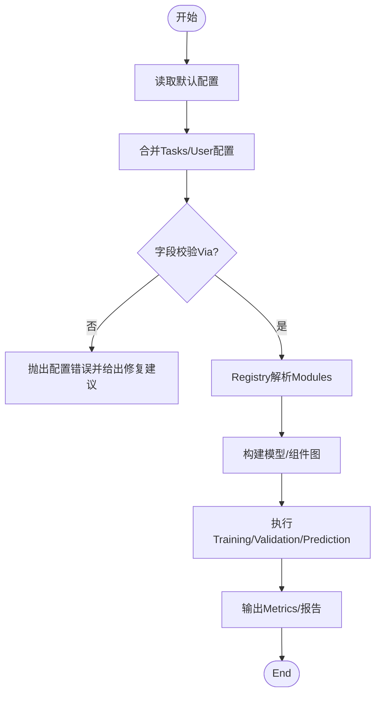
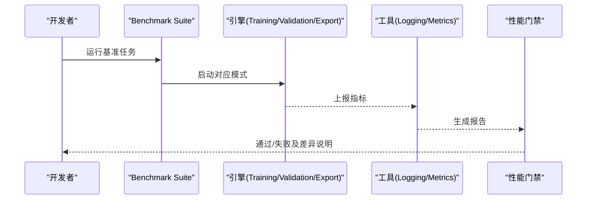
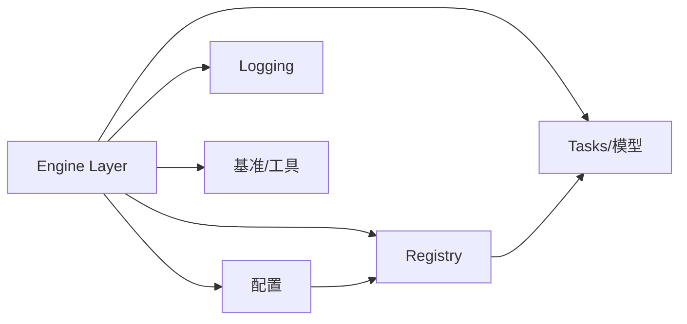

# New Feature Development Guide

<cite>
**Files Referenced in This Document**
- [README.md](file://README.md)
- [CONTRIBUTING.md](file://CONTRIBUTING.md)
- [pyproject.toml](file://pyproject.toml)
- [mkdocs.yml](file://mkdocs.yml)
- [ultralytics/__init__.py](file://ultralytics/__init__.py)
- [ultralytics/engine/model.py](file://ultralytics/engine/model.py)
- [ultralytics/engine/trainer.py](file://ultralytics/engine/trainer.py)
- [ultralytics/engine/validator.py](file://ultralytics/engine/validator.py)
- [ultralytics/engine/predictor.py](file://ultralytics/engine/predictor.py)
- [ultralytics/engine/exporter.py](file://ultralytics/engine/exporter.py)
- [ultralytics/models/yolo/model.py](file://ultralytics/models/yolo/model.py)
- [ultralytics/nn/mixture_registry.py](file://ultralytics/nn/mixture_registry.py)
- [ultralytics/nn/tasks.py](file://ultralytics/nn/tasks.py)
- [ultralytics/cfg/default.yaml](file://ultralytics/cfg/default.yaml)
- [ultralytics/utils/logger.py](file://ultralytics/utils/logger.py)
- [ultralytics/utils/benchmarks.py](file://ultralytics/utils/benchmarks.py)
- [benchmarks/run.py](file://benchmarks/run.py)
- [benchmarks/suite.py](file://benchmarks/suite.py)
- [tests/test_benchmark_suite.py](file://tests/test_benchmark_suite.py)
- [tests/test_model_registry.py](file://tests/test_model_registry.py)
- [tests/test_mixture_config_registry.py](file://tests/test_mixture_config_registry.py)
- [tools/config_drift_detector.py](file://tools/config_drift_detector.py)
- [docs/governance/performance-gates.md](file://docs/governance/performance-gates.md)
- [docs/governance/benchmark-suite.md](file://docs/governance/benchmark-suite.md)
- [agent/runtime/cli/core_handlers.py](file://agent/runtime/cli/core_handlers.py)
- [agent/runtime/cli/dispatcher.py](file://agent/runtime/cli/dispatcher.py)
</cite>

## Table of Contents
1. [引言](#引言)
2. [Project Structure](#Project Structure)
3. [Core Components](#Core Components)
4. [Architecture Overview](#Architecture Overview)
5. [Detailed Component Analysis](#Detailed Component Analysis)
6. [Dependency Analysis](#Dependency Analysis)
7. [Performance Considerations](#Performance Considerations)
8. [Troubleshooting Guide](#Troubleshooting Guide)
9. [Conclusion](#Conclusion)
10. [Appendix](#Appendix)

## 引言
本指南targeting希望while YOLO-Master 项目中新增特性的开发者，covering from需求分析、设计Documentationand技术选型，to插件扩展、配置管理、接口集成and向后兼容、基准测试and性能Evaluation、调试andLogging、安全and风险Evaluation、演示andUserDocumentation、代码审查and合并流程的完整开发生命周期。目标是帮助你while不破坏现有系统稳定性的前提下，高效、可Validation地交付高质量的新功能。

## Project Structure
YOLO-Master 采用分层Modules化组织：
- 顶层入口and工程配置：README、CONTRIBUTING、pyproject、mkdocs etc.
- 核心运行时and引擎：ultralytics/engine 下的模型、Training、Validation、Prediction、Export
- Models and Tasks定义：ultralytics/models and ultralytics/nn
- 配置and默认参数：ultralytics/cfg
- 工具and治理：benchmarks、tools、docs/governance
- Agent 运行时and CLI：agent/runtime/cli
- 测试：tests

Figure Source
- [README.md](file://README.md)
- [pyproject.toml](file://pyproject.toml)
- [ultralytics/engine/model.py](file://ultralytics/engine/model.py)
- [ultralytics/models/yolo/model.py](file://ultralytics/models/yolo/model.py)
- [ultralytics/nn/mixture_registry.py](file://ultralytics/nn/mixture_registry.py)
- [ultralytics/cfg/default.yaml](file://ultralytics/cfg/default.yaml)
- [benchmarks/run.py](file://benchmarks/run.py)
- [agent/runtime/cli/core_handlers.py](file://agent/runtime/cli/core_handlers.py)

Section Source
- [README.md](file://README.md)
- [CONTRIBUTING.md](file://CONTRIBUTING.md)
- [pyproject.toml](file://pyproject.toml)
- [mkdocs.yml](file://mkdocs.yml)

## Core Components
- Models and Tasks
  - 统一Model Encapsulationand生命周期管理（加载、Inference、Training、Export）
  - Tasks路由and多TasksSupporting（检测、分割、姿态etc.）
- TrainingandValidation
  - Trainer负责Optimization循环、回调、Checkpoint、分布式策略
  - Validator负责Metrics计算、结果汇总and报告生成
- PredictionandExport
  - PredictorprovidesInference流水线（预处理、Post-Processing、Visualization）
  - Exporter对接多种后端（ONNX/TensorRT/OpenVINO etc.）
- 配置and注册
  - 默认配置andTasks级配置
  - ModulesRegistry（such asMixture专家/路由相关）用于动态发现and装配
- 工具and治理
  - Logging、基准、Drift Detection、capabilities矩阵etc.

Section Source
- [ultralytics/engine/model.py](file://ultralytics/engine/model.py)
- [ultralytics/engine/trainer.py](file://ultralytics/engine/trainer.py)
- [ultralytics/engine/validator.py](file://ultralytics/engine/validator.py)
- [ultralytics/engine/predictor.py](file://ultralytics/engine/predictor.py)
- [ultralytics/engine/exporter.py](file://ultralytics/engine/exporter.py)
- [ultralytics/models/yolo/model.py](file://ultralytics/models/yolo/model.py)
- [ultralytics/nn/tasks.py](file://ultralytics/nn/tasks.py)
- [ultralytics/nn/mixture_registry.py](file://ultralytics/nn/mixture_registry.py)
- [ultralytics/cfg/default.yaml](file://ultralytics/cfg/default.yaml)

## Architecture Overview
下图展示了新特性while系统中的典型接入点and数据流：配置drivers are installed、Registry装配、引擎Calls、工具链and测试闭环。

Figure Source
- [agent/runtime/cli/core_handlers.py](file://agent/runtime/cli/core_handlers.py)
- [ultralytics/engine/model.py](file://ultralytics/engine/model.py)
- [ultralytics/engine/trainer.py](file://ultralytics/engine/trainer.py)
- [ultralytics/engine/validator.py](file://ultralytics/engine/validator.py)
- [ultralytics/engine/predictor.py](file://ultralytics/engine/predictor.py)
- [ultralytics/nn/mixture_registry.py](file://ultralytics/nn/mixture_registry.py)
- [ultralytics/cfg/default.yaml](file://ultralytics/cfg/default.yaml)
- [ultralytics/utils/logger.py](file://ultralytics/utils/logger.py)
- [benchmarks/run.py](file://benchmarks/run.py)

## Detailed Component Analysis

### 插件系统and扩展机制
- Registry模式
  - through a unifiedRegistry进行Modules发现and装配，避免硬编码耦合
  - 常见场景：Mixture专家路由、专家选择策略、Loss combination、Tasks特定Modules
- 自定义Modules注册
  - whileModulesimplementing处完成注册声明
  - while配置中Via名称引用，由Registry解析并实例化
- 配置管理
  - Uses默认配置作for基线，Tasks级配置覆盖差异项
  - 新增字段需保证默认值and向后兼容

Figure Source
- [ultralytics/nn/mixture_registry.py](file://ultralytics/nn/mixture_registry.py)
- [ultralytics/cfg/default.yaml](file://ultralytics/cfg/default.yaml)

Section Source
- [ultralytics/nn/mixture_registry.py](file://ultralytics/nn/mixture_registry.py)
- [ultralytics/cfg/default.yaml](file://ultralytics/cfg/default.yaml)
- [tests/test_mixture_config_registry.py](file://tests/test_mixture_config_registry.py)

### 新功能and现有系统的集成方法
- 接口设计原则
  - Centered on配置：新增capabilitiesVia配置开关或参数启用
  - 最小侵入：优先whileRegistryandTasks层扩展，避免修改核心Training/Validation主循环
  - 明确契约：输入输出类型、错误码、Logging格式保持一致
- 向后兼容性保证
  - 新增配置项必须provides默认值
  - 旧版配置while不显式指定新字段时行for不变
  - 对弃用字段providesMigrationTipsand兼容路径

Figure Source
- [ultralytics/cfg/default.yaml](file://ultralytics/cfg/default.yaml)
- [ultralytics/nn/mixture_registry.py](file://ultralytics/nn/mixture_registry.py)
- [ultralytics/engine/model.py](file://ultralytics/engine/model.py)

Section Source
- [ultralytics/engine/model.py](file://ultralytics/engine/model.py)
- [ultralytics/cfg/default.yaml](file://ultralytics/cfg/default.yaml)
- [tests/test_default_config_integrity.py](file://tests/test_default_config_integrity.py)

### 性能Evaluationand基准测试集成
- Benchmark Suite
  - Unified entry pointand用例编排，Supporting数据集、Tasks、硬件、批大小etc.维度
  - and治理Documentation对齐，确保回归门禁
- 集成方式
  - whileTraining/Validation/Export流程中插入轻量探针，收集吞吐、延迟、内存占用
  - 将结果写入标准格式，便于对比andVisualization
- 回归门禁
  - 基于治理Documentation定义的阈值and基线，自动判定是否放行

Figure Source
- [benchmarks/run.py](file://benchmarks/run.py)
- [benchmarks/suite.py](file://benchmarks/suite.py)
- [docs/governance/performance-gates.md](file://docs/governance/performance-gates.md)
- [docs/governance/benchmark-suite.md](file://docs/governance/benchmark-suite.md)
- [tests/test_benchmark_suite.py](file://tests/test_benchmark_suite.py)

Section Source
- [benchmarks/run.py](file://benchmarks/run.py)
- [benchmarks/suite.py](file://benchmarks/suite.py)
- [docs/governance/performance-gates.md](file://docs/governance/performance-gates.md)
- [docs/governance/benchmark-suite.md](file://docs/governance/benchmark-suite.md)
- [tests/test_benchmark_suite.py](file://tests/test_benchmark_suite.py)

### 调试andLogging最佳实践
- 结构化Logging
  - 统一Logging级别and格式，包含上下文信息（Tasks、设备、批次号）
  - 关键路径打点：初始化、配置加载、Modules注册、Training步、Validation步、Export阶段
- 诊断工具
  - 利用Built-in工具进行配置Drift Detection、路由解释、Exportcapabilities矩阵校验
- 可观测性
  - Metrics采集andVisualization，CombiningBenchmark Suite形成前后对比

Section Source
- [ultralytics/utils/logger.py](file://ultralytics/utils/logger.py)
- [tools/config_drift_detector.py](file://tools/config_drift_detector.py)
- [ultralytics/utils/benchmarks.py](file://ultralytics/utils/benchmarks.py)

### 安全考虑and风险Evaluation
- 配置安全
  - 禁止while生产环境开启高开销调试选项
  - 敏感参数（密钥、路径）Via环境变量注入，避免硬编码
- 依赖and导入
  - 仅引入必要依赖，控制第三方库版本范围
  - 对动态导入进行白名单校验，防止任意代码执行
- 数据and模型
  - 输入校验and边界检查，防止越界and异常形状
  - Export产物签名and完整性校验，降低篡改风险

[本节for通用指导，无需具体文件来源]

### 功能演示andUserDocumentation编写要求
- 演示脚本
  - provides端to端Examples，覆盖安装、配置、Training/Validation/Export、Visualization
  - 包含最小可复现实例and常见问题FAQ
- Documentation规范
  - Uses mkdocs 组织Documentation，遵循既有结构and风格
  - 新增页面需更新索引and导航，保持跨页链接有效

Section Source
- [mkdocs.yml](file://mkdocs.yml)
- [docs/index.html](file://docs/index.html)

### 代码审查and合并流程
- 提交前自检
  - 运行单元测试andBenchmark Suite，确保无回归
  - 更新相关Documentationand变更Logging
- 审查清单
  - 接口契约and兼容性
  - 配置默认值andMigration策略
  - 性能影响and基准结果
  - 安全and隐私影响
- 合并策略
  - 小步快跑、频繁PR；必要时分阶段上线and灰度发布

Section Source
- [CONTRIBUTING.md](file://CONTRIBUTING.md)

## Dependency Analysis
- ModulesCohesion and Coupling
  - Engine Layer相对独立，ViaRegistryand配置解耦具体implementing
  - Tasksand模型定义集中while models/nn 层，便于替换and扩展
- External Dependencies
  - 基准and工具依赖第三方库，需while pyproject 中声明版本约束
- Potential Cycles依赖
  - 避免whileRegistryand配置之间形成双向依赖，应单向解析

Figure Source
- [ultralytics/engine/model.py](file://ultralytics/engine/model.py)
- [ultralytics/nn/mixture_registry.py](file://ultralytics/nn/mixture_registry.py)
- [ultralytics/cfg/default.yaml](file://ultralytics/cfg/default.yaml)
- [ultralytics/utils/logger.py](file://ultralytics/utils/logger.py)
- [benchmarks/run.py](file://benchmarks/run.py)

Section Source
- [pyproject.toml](file://pyproject.toml)
- [ultralytics/engine/model.py](file://ultralytics/engine/model.py)
- [ultralytics/nn/mixture_registry.py](file://ultralytics/nn/mixture_registry.py)
- [ultralytics/cfg/default.yaml](file://ultralytics/cfg/default.yaml)

## Performance Considerations
- Training/Validation
  - Set appropriately批大小and精度，关注显存峰值and吞吐
  - Uses缓存and预取减少I/Obottlenecks
- Export
  - 针对不同后端选择合适的Optimization选项，平衡体积and速度
- 监控
  - 持续采集关键Metrics，建立基线and告警阈值

[本节for通用指导，无需具体文件来源]

## Troubleshooting Guide
- 配置问题
  - Uses配置Drift Detection工具定位不一致项
  - 核对默认配置andTasks配置的差异
- Registry问题
  - 确认Modules已正确注册且名称一致
  - 检查解析顺序and依赖关系
- 基准and回归
  - 查看基准报告中的差异项，定位性能退化原因
- Loggingand诊断
  - 提升Logging级别，捕获关键路径上下文
  - Uses路由解释andExportcapabilities矩阵辅助定位

Section Source
- [tools/config_drift_detector.py](file://tools/config_drift_detector.py)
- [tests/test_mixture_config_registry.py](file://tests/test_mixture_config_registry.py)
- [tests/test_benchmark_suite.py](file://tests/test_benchmark_suite.py)
- [ultralytics/utils/logger.py](file://ultralytics/utils/logger.py)

## Conclusion
ViawhileRegistryand配置层面进行扩展，Combined with完善的基准测试、Loggingand治理流程，可Centered onwhile保证向后兼容的前提下快速交付高质量的新特性。建议while每个迭代中同步完善Documentationand演示，确保Userand下游团队能顺利上手andValidation。

## Appendix
- 常用入口Refer to
  - Models and Tasks：[ultralytics/engine/model.py](file://ultralytics/engine/model.py)、[ultralytics/models/yolo/model.py](file://ultralytics/models/yolo/model.py)、[ultralytics/nn/tasks.py](file://ultralytics/nn/tasks.py)
  - Training/Validation/Prediction/Export：[ultralytics/engine/trainer.py](file://ultralytics/engine/trainer.py)、[ultralytics/engine/validator.py](file://ultralytics/engine/validator.py)、[ultralytics/engine/predictor.py](file://ultralytics/engine/predictor.py)、[ultralytics/engine/exporter.py](file://ultralytics/engine/exporter.py)
  - Registryand配置：[ultralytics/nn/mixture_registry.py](file://ultralytics/nn/mixture_registry.py)、[ultralytics/cfg/default.yaml](file://ultralytics/cfg/default.yaml)
  - 基准and工具：[benchmarks/run.py](file://benchmarks/run.py)、[benchmarks/suite.py](file://benchmarks/suite.py)、[tools/config_drift_detector.py](file://tools/config_drift_detector.py)
  - 治理Documentation：[docs/governance/performance-gates.md](file://docs/governance/performance-gates.md)、[docs/governance/benchmark-suite.md](file://docs/governance/benchmark-suite.md)
  - Agent CLI：[agent/runtime/cli/core_handlers.py](file://agent/runtime/cli/core_handlers.py)、[agent/runtime/cli/dispatcher.py](file://agent/runtime/cli/dispatcher.py)