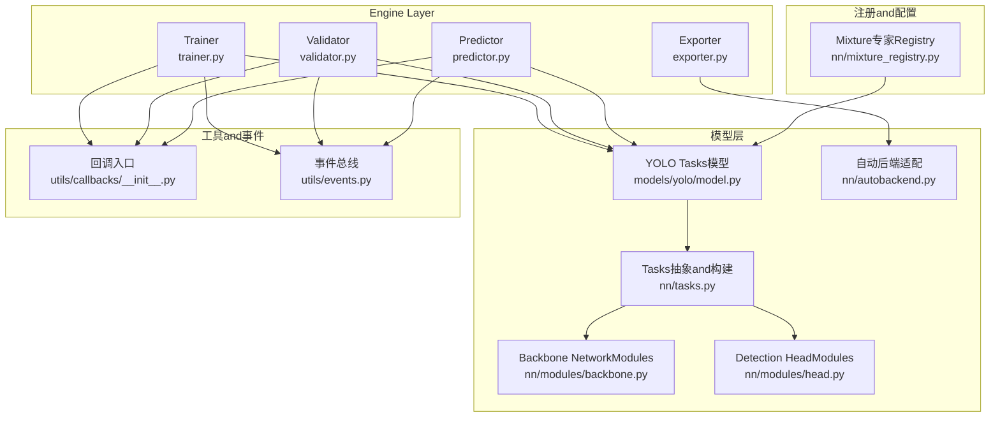
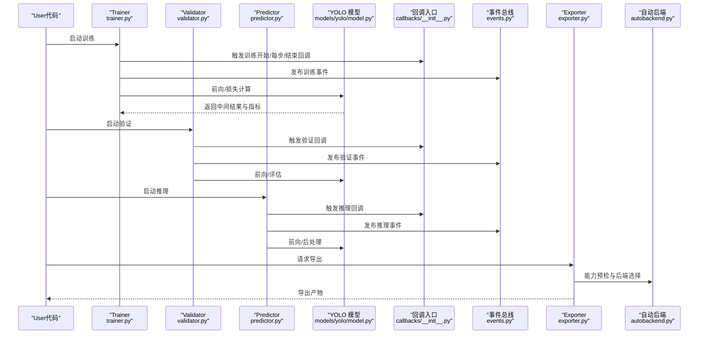
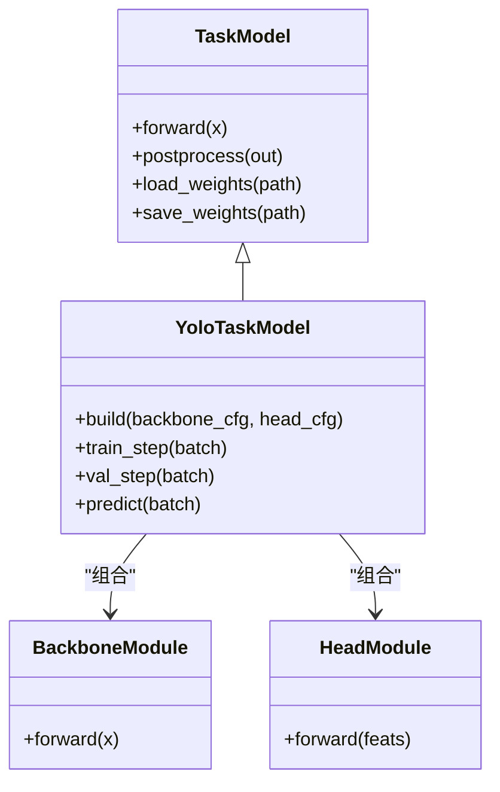
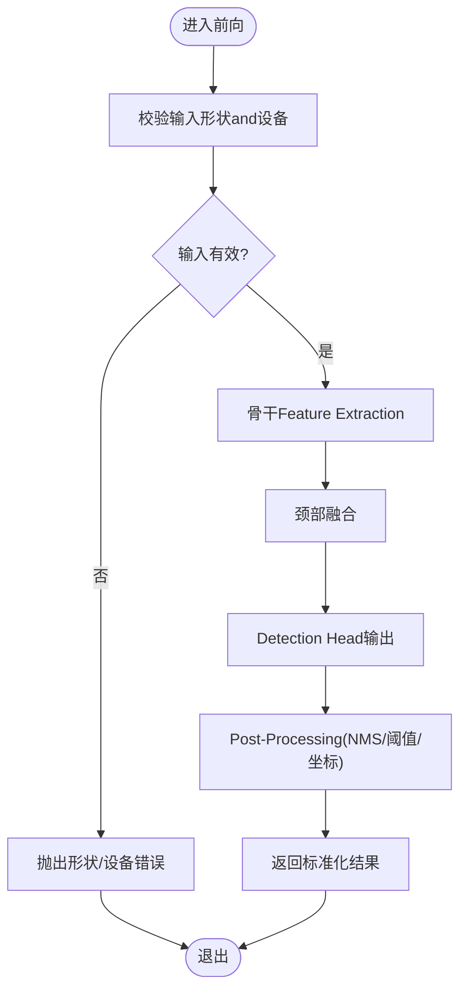
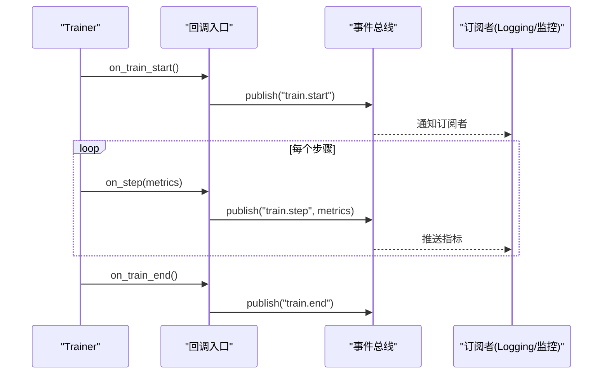
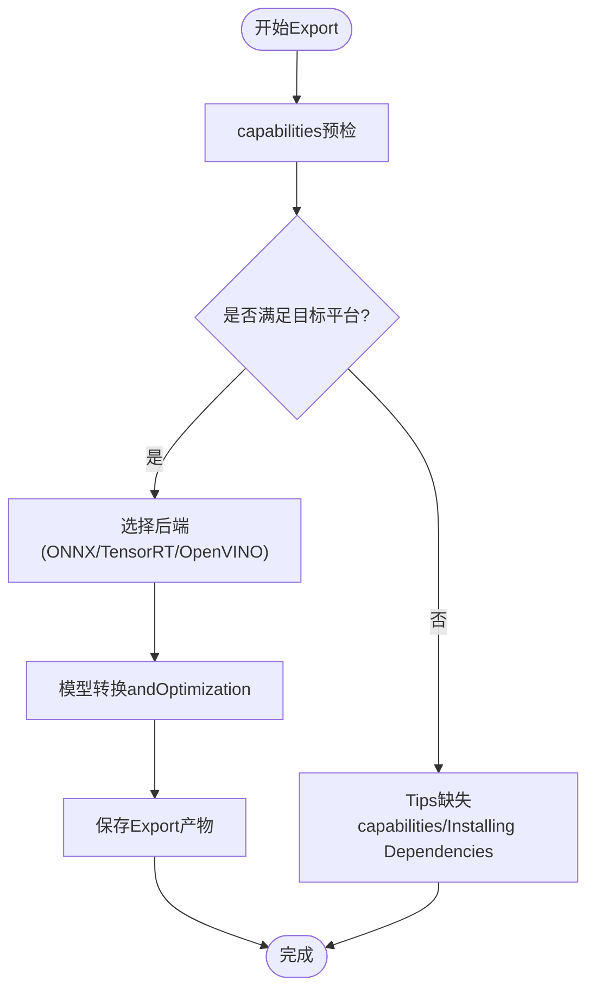
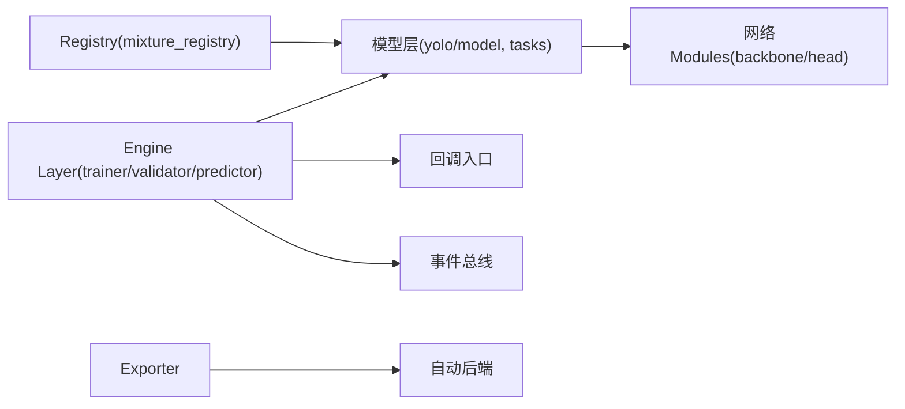

# Plugin System Development

<cite>
**Files Referenced in This Document**
- [ultralytics/engine/trainer.py](file://ultralytics/engine/trainer.py)
- [ultralytics/engine/validator.py](file://ultralytics/engine/validator.py)
- [ultralytics/engine/predictor.py](file://ultralytics/engine/predictor.py)
- [ultralytics/utils/callbacks/__init__.py](file://ultralytics/utils/callbacks/__init__.py)
- [ultralytics/utils/events.py](file://ultralytics/utils/events.py)
- [ultralytics/models/yolo/model.py](file://ultralytics/models/yolo/model.py)
- [ultralytics/nn/mixture_registry.py](file://ultralytics/nn/mixture_registry.py)
- [ultralytics/nn/tasks.py](file://ultralytics/nn/tasks.py)
- [ultralytics/nn/modules/backbone.py](file://ultralytics/nn/modules/backbone.py)
- [ultralytics/nn/modules/head.py](file://ultralytics/nn/modules/head.py)
- [ultralytics/nn/autobackend.py](file://ultralytics/nn/autobackend.py)
- [ultralytics/engine/exporter.py](file://ultralytics/engine/exporter.py)
- [tests/test_model_registry.py](file://tests/test_model_registry.py)
- [tests/test_mixture_config_registry.py](file://tests/test_mixture_config_registry.py)
- [tests/test_export_preflight.py](file://tests/test_export_preflight.py)
</cite>

## Table of Contents
1. [Introduction](#Introduction)
2. [Project Structure](#Project Structure)
3. [Core Components](#Core Components)
4. [Architecture Overview](#Architecture Overview)
5. [Detailed Component Analysis](#Detailed Component Analysis)
6. [Dependency Analysis](#Dependency Analysis)
7. [性能考量](#性能考量)
8. [Troubleshooting Guide](#Troubleshooting Guide)
9. [Conclusion](#Conclusion)
10. [Appendix](#Appendix)

## Introduction
本指南targeting希望while YOLO-Master 中扩展and定制capabilities的开发者，围绕“插件化”capabilitiesprovides系统化说明。内容覆盖：
- Modules注册机制（模型、Mixture专家配置etc.）
- 生命周期管理（Training/Validation/Inference/Export阶段钩子）
- 依赖注入（Via配置and运行时上下文装配）
- 自定义模型implementing（继承结构、参数配置、权重管理）
- 网络Modules规范（层定义、前向传播、Post-Processing）
- Callback Systemand事件机制（Training监控、Result Processing）
- 插件测试and调试（单元and集成测试）
- 打包and分发最佳实践

## Project Structure
YOLO-Master 的插件化capabilities主要分布whileCentered on下层次：
- Engine Layer：Trainer、Validator、Predictor负责编排生命周期并触发回调
- 模型层：Tasks模型and网络Modulesprovides可插拔的前向andPost-Processing
- 注册中心：模型andMixture专家配置的集中注册and解析
- 工具层：事件总线andExport预检etc.通用capabilities
- 测试层：针对Registry、Exportcapabilitiesetc.的回归and契约测试

Figure Source
- [ultralytics/engine/trainer.py](file://ultralytics/engine/trainer.py)
- [ultralytics/engine/validator.py](file://ultralytics/engine/validator.py)
- [ultralytics/engine/predictor.py](file://ultralytics/engine/predictor.py)
- [ultralytics/engine/exporter.py](file://ultralytics/engine/exporter.py)
- [ultralytics/models/yolo/model.py](file://ultralytics/models/yolo/model.py)
- [ultralytics/nn/tasks.py](file://ultralytics/nn/tasks.py)
- [ultralytics/nn/modules/backbone.py](file://ultralytics/nn/modules/backbone.py)
- [ultralytics/nn/modules/head.py](file://ultralytics/nn/modules/head.py)
- [ultralytics/nn/autobackend.py](file://ultralytics/nn/autobackend.py)
- [ultralytics/nn/mixture_registry.py](file://ultralytics/nn/mixture_registry.py)
- [ultralytics/utils/callbacks/__init__.py](file://ultralytics/utils/callbacks/__init__.py)
- [ultralytics/utils/events.py](file://ultralytics/utils/events.py)

Section Source
- [ultralytics/engine/trainer.py](file://ultralytics/engine/trainer.py)
- [ultralytics/engine/validator.py](file://ultralytics/engine/validator.py)
- [ultralytics/engine/predictor.py](file://ultralytics/engine/predictor.py)
- [ultralytics/engine/exporter.py](file://ultralytics/engine/exporter.py)
- [ultralytics/models/yolo/model.py](file://ultralytics/models/yolo/model.py)
- [ultralytics/nn/tasks.py](file://ultralytics/nn/tasks.py)
- [ultralytics/nn/modules/backbone.py](file://ultralytics/nn/modules/backbone.py)
- [ultralytics/nn/modules/head.py](file://ultralytics/nn/modules/head.py)
- [ultralytics/nn/autobackend.py](file://ultralytics/nn/autobackend.py)
- [ultralytics/nn/mixture_registry.py](file://ultralytics/nn/mixture_registry.py)
- [ultralytics/utils/callbacks/__init__.py](file://ultralytics/utils/callbacks/__init__.py)
- [ultralytics/utils/events.py](file://ultralytics/utils/events.py)

## Core Components
- 模型注册中心
  - 作用：统一注册and解析模型类或Mixture专家配置，避免硬编码分支
  - 关键点：键名一致性、版本兼容、默认回退策略
- Tasks模型and网络Modules
  - 作用：Encapsulates骨干、颈部andDetection Head的组合，provides标准前向接口andPost-Processing
  - 关键点：输入输出张量约定、形状广播、设备无关性
- 引擎生命周期and回调
  - 作用：whileTraining/Validation/Inference/Export的关键阶段触发回调，Supporting监控andResult Processing
  - 关键点：事件顺序、异常隔离、幂etc.性
- 事件总线
  - 作用：解耦组件间通信，订阅/发布事件，便于扩展
  - 关键点：事件命名空间、优先级、异步安全
- Export预检and自动后端
  - 作用：whileExport前校验capabilities矩阵，选择最优后端执行
  - 关键点：capabilities清单、降级路径、错误诊断

Section Source
- [ultralytics/nn/mixture_registry.py](file://ultralytics/nn/mixture_registry.py)
- [ultralytics/models/yolo/model.py](file://ultralytics/models/yolo/model.py)
- [ultralytics/nn/tasks.py](file://ultralytics/nn/tasks.py)
- [ultralytics/utils/callbacks/__init__.py](file://ultralytics/utils/callbacks/__init__.py)
- [ultralytics/utils/events.py](file://ultralytics/utils/events.py)
- [ultralytics/engine/exporter.py](file://ultralytics/engine/exporter.py)
- [ultralytics/nn/autobackend.py](file://ultralytics/nn/autobackend.py)

## Architecture Overview
下图展示了从UserCallsto模型执行and回调触发的端to端流程，Centered onandExport阶段的预检and后端选择。

Figure Source
- [ultralytics/engine/trainer.py](file://ultralytics/engine/trainer.py)
- [ultralytics/engine/validator.py](file://ultralytics/engine/validator.py)
- [ultralytics/engine/predictor.py](file://ultralytics/engine/predictor.py)
- [ultralytics/models/yolo/model.py](file://ultralytics/models/yolo/model.py)
- [ultralytics/utils/callbacks/__init__.py](file://ultralytics/utils/callbacks/__init__.py)
- [ultralytics/utils/events.py](file://ultralytics/utils/events.py)
- [ultralytics/engine/exporter.py](file://ultralytics/engine/exporter.py)
- [ultralytics/nn/autobackend.py](file://ultralytics/nn/autobackend.py)

## Detailed Component Analysis

### Modules注册机制（模型andMixture专家）
- 设计要点
  - Uses集中式Registry维护“名称→类/配置”映射，避免 if/else 分支扩散
  - provides默认回退and版本兼容性检查，确保升级平滑
  - Supporting动态发现and热更新（按需加载）
- 典型流程
  - 初始化时扫描Registry
  - 根据配置键解析目标implementing
  - 实例化并注入依赖（such as设备、精度、Optimizer配置）
- 建议
  - for每个插件provides唯一且稳定的键名
  - whileRegistry中记录元数据（作者、版本、依赖）
  - 对不兼容变更进行弃用警告andMigration指引

Section Source
- [ultralytics/nn/mixture_registry.py](file://ultralytics/nn/mixture_registry.py)
- [tests/test_mixture_config_registry.py](file://tests/test_mixture_config_registry.py)

### 生命周期管理and依赖注入
- 生命周期阶段
  - Training：准备数据、迭代、保存Checkpoint、Loggingand回调
  - Validation：周期性Evaluation、Metrics汇总、早停判断
  - Inference：批处理、NMS/Post-Processing、Visualization
  - Export：capabilities预检、格式转换、后端选择
- 依赖注入方式
  - Via构造函数或配置对象注入（设备、精度、IO、Logging、回调）
  - Uses工厂方法创建具体implementing，便于替换and测试
- 最佳实践
  - 将副作用最小化，保持函数式风格
  - 明确边界条件and异常类型
  - 保证幂etc.性and可重入性

Section Source
- [ultralytics/engine/trainer.py](file://ultralytics/engine/trainer.py)
- [ultralytics/engine/validator.py](file://ultralytics/engine/validator.py)
- [ultralytics/engine/predictor.py](file://ultralytics/engine/predictor.py)
- [ultralytics/engine/exporter.py](file://ultralytics/engine/exporter.py)

### 自定义模型implementing（继承结构and参数配置）
- 继承结构
  - 基于Tasks模型基类扩展，复用通用前向/Post-Processing逻辑
  - ViaModules化组合（骨干、颈部、Detection Head）拼装复杂网络
- 参数配置
  - Uses YAML/字典drivers are installed的配置，区分超参and结构参数
  - provides默认值and校验规则，避免非法配置导致崩溃
- 权重管理
  - Supporting部分加载、冻结/解冻策略、权重指纹校验
  - Export时保留必要元信息Centered on便复现实验

Figure Source
- [ultralytics/models/yolo/model.py](file://ultralytics/models/yolo/model.py)
- [ultralytics/nn/tasks.py](file://ultralytics/nn/tasks.py)
- [ultralytics/nn/modules/backbone.py](file://ultralytics/nn/modules/backbone.py)
- [ultralytics/nn/modules/head.py](file://ultralytics/nn/modules/head.py)

Section Source
- [ultralytics/models/yolo/model.py](file://ultralytics/models/yolo/model.py)
- [ultralytics/nn/tasks.py](file://ultralytics/nn/tasks.py)
- [ultralytics/nn/modules/backbone.py](file://ultralytics/nn/modules/backbone.py)
- [ultralytics/nn/modules/head.py](file://ultralytics/nn/modules/head.py)
- [tests/test_model_registry.py](file://tests/test_model_registry.py)

### 网络Modules开发规范（层定义、前向andPost-Processing）
- 层定义
  - 遵循 PyTorch Module 规范，显式声明子Modulesand参数
  - provides shape 推导and广播语义说明
- 前向传播
  - 输入输出形状稳定，避免隐式维度变化
  - 尽量Uses向量化操作，减少 Python 循环
- Post-Processing逻辑
  - NMS、阈值过滤、坐标变换etc.应独立成函数
  - Supporting批量and多尺度输入，保持内存友好

Figure Source
- [ultralytics/nn/tasks.py](file://ultralytics/nn/tasks.py)
- [ultralytics/nn/modules/backbone.py](file://ultralytics/nn/modules/backbone.py)
- [ultralytics/nn/modules/head.py](file://ultralytics/nn/modules/head.py)

Section Source
- [ultralytics/nn/tasks.py](file://ultralytics/nn/tasks.py)
- [ultralytics/nn/modules/backbone.py](file://ultralytics/nn/modules/backbone.py)
- [ultralytics/nn/modules/head.py](file://ultralytics/nn/modules/head.py)

### Callback Systemand事件机制（Training监控andResult Processing）
- Callback System
  - whileTraining/Validation/Inference的关键节点插入自定义逻辑（such asLogging、断点、Visualization）
  - Supporting按阶段、按Metrics阈值触发
- 事件机制
  - Via事件总线发布/订阅，解耦业务逻辑
  - 事件包含上下文（时间戳、批次索引、Metrics快照）
- Uses建议
  - 回调函数应保持轻量，避免阻塞主流程
  - 对异常进行捕获and上报，不影响主流程稳定性

Figure Source
- [ultralytics/utils/callbacks/__init__.py](file://ultralytics/utils/callbacks/__init__.py)
- [ultralytics/utils/events.py](file://ultralytics/utils/events.py)
- [ultralytics/engine/trainer.py](file://ultralytics/engine/trainer.py)

Section Source
- [ultralytics/utils/callbacks/__init__.py](file://ultralytics/utils/callbacks/__init__.py)
- [ultralytics/utils/events.py](file://ultralytics/utils/events.py)
- [ultralytics/engine/trainer.py](file://ultralytics/engine/trainer.py)

### Exportand自动后端选择
- Export预检
  - whileExport前检查模型capabilities、算子Supportingand目标平台约束
  - 失败时给出明确的修复建议
- 自动后端
  - 根据环境特性选择最优执行后端（such as ONNX/TensorRT/OpenVINO）
  - provides降级路径and回退策略

Figure Source
- [ultralytics/engine/exporter.py](file://ultralytics/engine/exporter.py)
- [ultralytics/nn/autobackend.py](file://ultralytics/nn/autobackend.py)
- [tests/test_export_preflight.py](file://tests/test_export_preflight.py)

Section Source
- [ultralytics/engine/exporter.py](file://ultralytics/engine/exporter.py)
- [ultralytics/nn/autobackend.py](file://ultralytics/nn/autobackend.py)
- [tests/test_export_preflight.py](file://tests/test_export_preflight.py)

## Dependency Analysis
- 耦合and内聚
  - Engine Layerand模型层Via标准接口交互，降低耦合度
  - Registry集中管理依赖，提高内聚性
- External Dependencies
  - Export阶段依赖第三方后端库（ONNXRuntime、TensorRT etc.）
  - 事件and回调依赖Loggingand监控基础设施
- Potential Cycles依赖
  - 避免模型直接引用引擎；Via回调and事件解耦
- 接口契约
  - 前向/Post-Processing的输入输出形状and数据类型需严格一致
  - Registry键名and配置字段需保持稳定

Figure Source
- [ultralytics/engine/trainer.py](file://ultralytics/engine/trainer.py)
- [ultralytics/engine/validator.py](file://ultralytics/engine/validator.py)
- [ultralytics/engine/predictor.py](file://ultralytics/engine/predictor.py)
- [ultralytics/models/yolo/model.py](file://ultralytics/models/yolo/model.py)
- [ultralytics/nn/tasks.py](file://ultralytics/nn/tasks.py)
- [ultralytics/nn/modules/backbone.py](file://ultralytics/nn/modules/backbone.py)
- [ultralytics/nn/modules/head.py](file://ultralytics/nn/modules/head.py)
- [ultralytics/utils/callbacks/__init__.py](file://ultralytics/utils/callbacks/__init__.py)
- [ultralytics/utils/events.py](file://ultralytics/utils/events.py)
- [ultralytics/engine/exporter.py](file://ultralytics/engine/exporter.py)
- [ultralytics/nn/autobackend.py](file://ultralytics/nn/autobackend.py)
- [ultralytics/nn/mixture_registry.py](file://ultralytics/nn/mixture_registry.py)

Section Source
- [ultralytics/engine/trainer.py](file://ultralytics/engine/trainer.py)
- [ultralytics/engine/validator.py](file://ultralytics/engine/validator.py)
- [ultralytics/engine/predictor.py](file://ultralytics/engine/predictor.py)
- [ultralytics/models/yolo/model.py](file://ultralytics/models/yolo/model.py)
- [ultralytics/nn/tasks.py](file://ultralytics/nn/tasks.py)
- [ultralytics/nn/modules/backbone.py](file://ultralytics/nn/modules/backbone.py)
- [ultralytics/nn/modules/head.py](file://ultralytics/nn/modules/head.py)
- [ultralytics/utils/callbacks/__init__.py](file://ultralytics/utils/callbacks/__init__.py)
- [ultralytics/utils/events.py](file://ultralytics/utils/events.py)
- [ultralytics/engine/exporter.py](file://ultralytics/engine/exporter.py)
- [ultralytics/nn/autobackend.py](file://ultralytics/nn/autobackend.py)
- [ultralytics/nn/mixture_registry.py](file://ultralytics/nn/mixture_registry.py)

## 性能考量
- 前向Optimization
  - Uses向量化and原地操作，减少临时张量分配
  - Set appropriately批大小and内存池，避免频繁 GPU/CPU 同步
- ExportOptimization
  - 启用图级Optimizationand算子融合
  - 针对目标硬件选择合适后端and精度（FP16/INT8）
- 回调and事件
  - 避免while回调中进行重型 I/O 或阻塞操作
  - 采用异步写入and缓冲策略

[本节for通用指导，无需特定文件来源]

## Troubleshooting Guide
- 常见错误定位
  - Registry键名不一致：检查配置文件andRegistry映射
  - Export Failure：查看capabilities预检报告and缺失依赖Tips
  - 回调异常：确认回调函数签名and异常隔离
- 调试技巧
  - while关键阶段打印形状and设备信息
  - Uses最小可复现Examplesand单元测试快速定位问题
  - Combining事件Logging追踪Calls链

Section Source
- [tests/test_export_preflight.py](file://tests/test_export_preflight.py)
- [tests/test_model_registry.py](file://tests/test_model_registry.py)
- [tests/test_mixture_config_registry.py](file://tests/test_mixture_config_registry.py)

## Conclusion
through a unified注册中心、清晰的Modules边界、完善的回调and事件机制，YOLO-Master provides了强大的插件化capabilities。开发者可Centered onCentered on较低成本扩展模型、网络ModulesandTraining/Inference流程，同时借助Export预检and自动后端选择提升部署效率。建议while扩展过程中遵循本文规范，完善测试andDocumentation，确保可维护性and可移植性。

[本节for总结性内容，无需特定文件来源]

## Appendix
- 插件开发清单
  - 定义唯一键名and元数据
  - implementing标准接口and前Post-Processing
  - 编写单元and集成测试
  - provides配置模板andUses说明
- 推荐测试用例
  - Registry解析and回退
  - Exportcapabilities预检and后端选择
  - 回调触发顺序and异常隔离
  - 模型权重加载/保存and指纹校验

[本节for补充信息，无需特定文件来源]