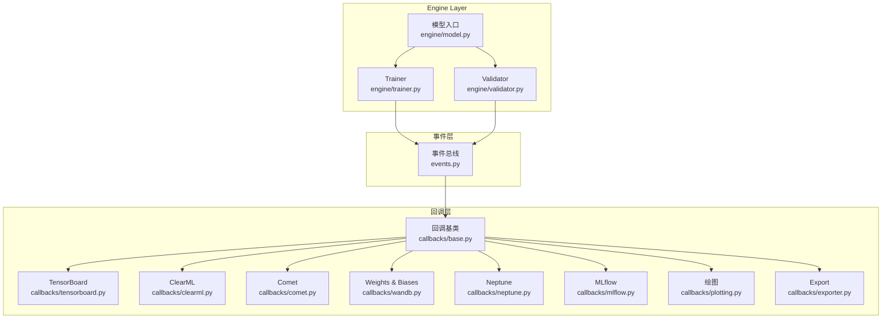
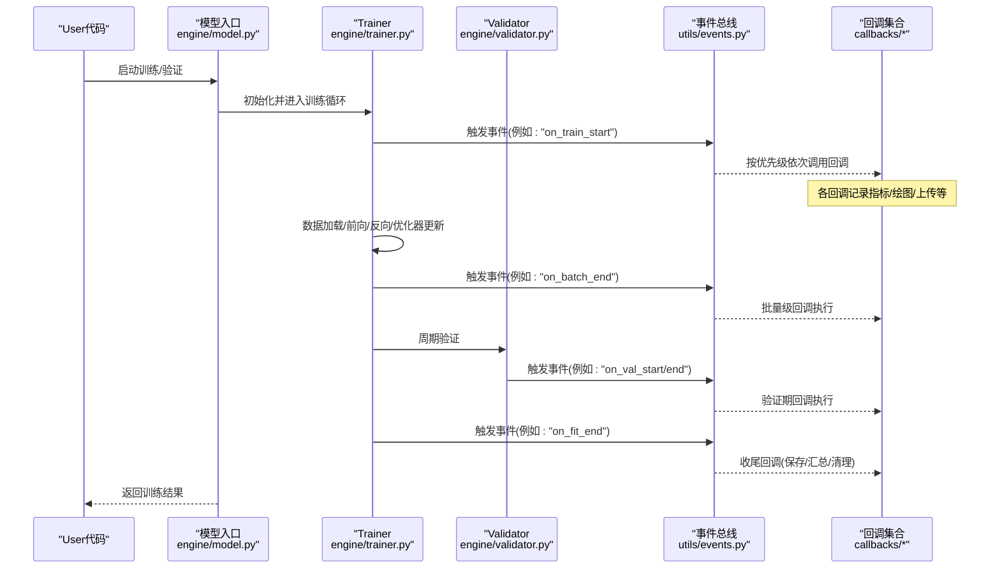
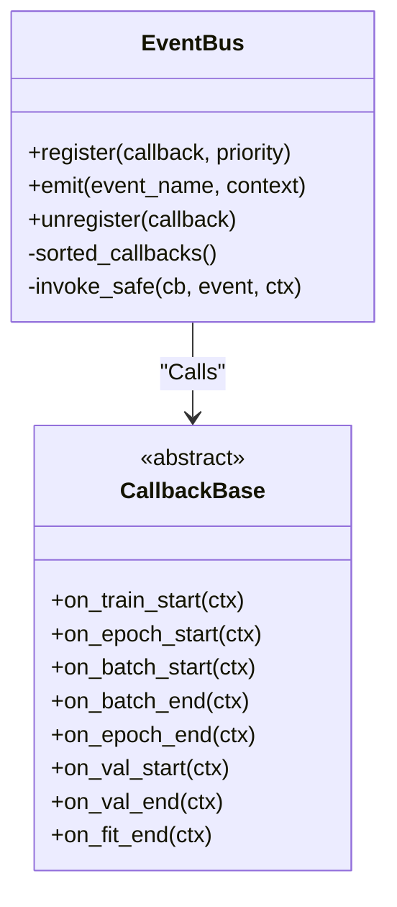
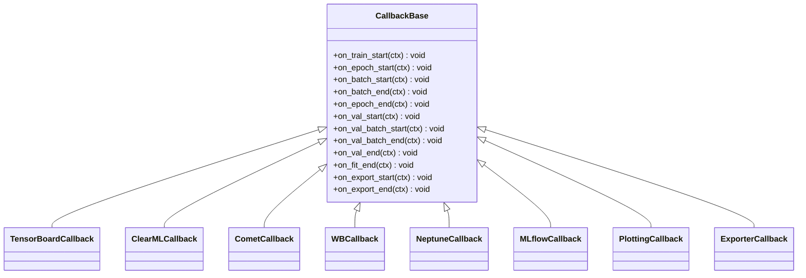
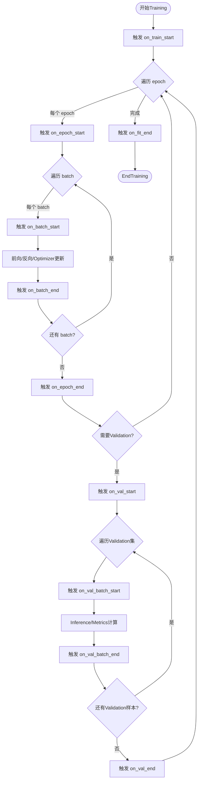
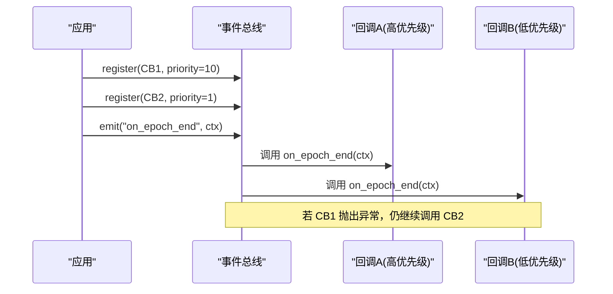
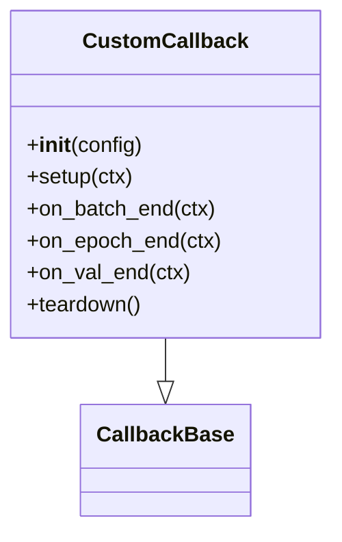
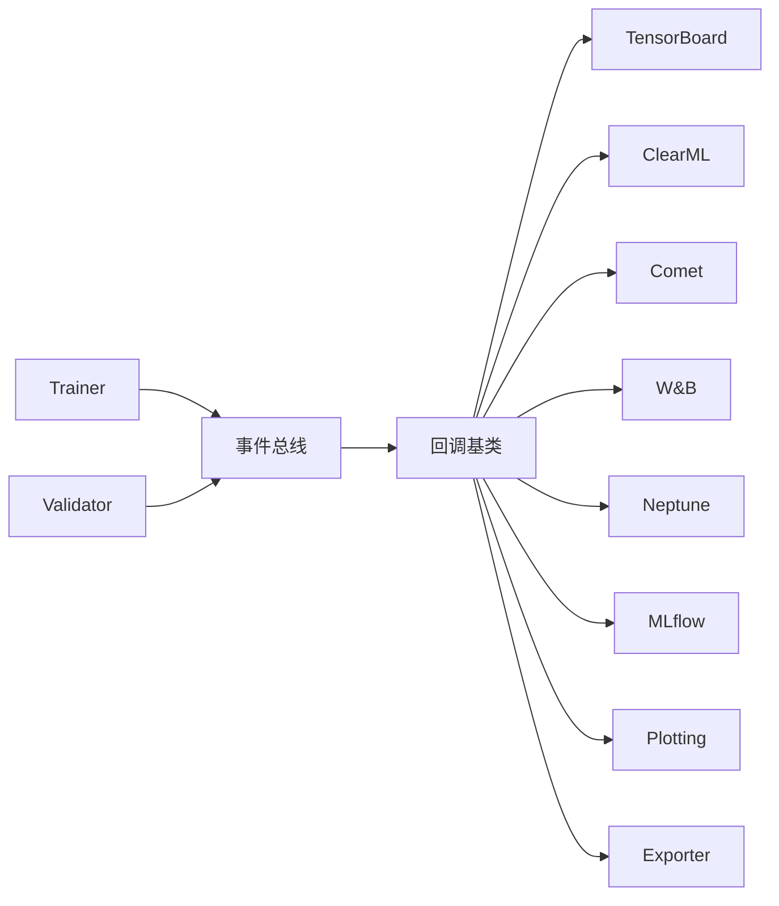

# Callback System开发

<cite>
**Files Referenced in This Document**
- [ultralytics/utils/callbacks/__init__.py](file://ultralytics/utils/callbacks/__init__.py)
- [ultralytics/utils/callbacks/base.py](file://ultralytics/utils/callbacks/base.py)
- [ultralytics/utils/callbacks/tensorboard.py](file://ultralytics/utils/callbacks/tensorboard.py)
- [ultralytics/utils/callbacks/clearml.py](file://ultralytics/utils/callbacks/clearml.py)
- [ultralytics/utils/callbacks/comet.py](file://ultralytics/utils/callbacks/comet.py)
- [ultralytics/utils/callbacks/wandb.py](file://ultralytics/utils/callbacks/wandb.py)
- [ultralytics/utils/callbacks/neptune.py](file://ultralytics/utils/callbacks/neptune.py)
- [ultralytics/utils/callbacks/mlflow.py](file://ultralytics/utils/callbacks/mlflow.py)
- [ultralytics/utils/callbacks/plotting.py](file://ultralytics/utils/callbacks/plotting.py)
- [ultralytics/utils/callbacks/exporter.py](file://ultralytics/utils/callbacks/exporter.py)
- [ultralytics/utils/events.py](file://ultralytics/utils/events.py)
- [ultralytics/engine/trainer.py](file://ultralytics/engine/trainer.py)
- [ultralytics/engine/validator.py](file://ultralytics/engine/validator.py)
- [ultralytics/engine/model.py](file://ultralytics/engine/model.py)
</cite>

## Table of Contents
1. [Introduction](#Introduction)
2. [Project Structure](#Project Structure)
3. [Core Components](#Core Components)
4. [Architecture Overview](#Architecture Overview)
5. [Detailed Component Analysis](#Detailed Component Analysis)
6. [Dependency Analysis](#Dependency Analysis)
7. [Performance Considerations](#Performance Considerations)
8. [Troubleshooting Guide](#Troubleshooting Guide)
9. [Conclusion](#Conclusion)
10. [Appendix](#Appendix)

## Introduction
本指南targeting希望while YOLO-Master 项目中扩展and定制Training/Validation流程的开发者，聚焦于“Callback System”的设计原理、implementing方式and最佳实践。Documentation围绕事件drivers are installed架构and观察者模式unfold，详细说明：
- 回调接口定义and生命周期钩子
- 注册and管理机制（含优先级控制）
- 关键Training阶段的事件点（Data Loading、模型更新、Validation、Loggingetc.）
- 自定义回调的开发范式andExamples路径
- 错误处理策略and异步处理Optimization建议

## Project Structure
YOLO-Master 的Callback System位于 utils/callbacks 包中，采用“统一事件总线 + 多implementing插件”的结构：
- 事件总线：负责事件的发布/订阅、顺序调度and异常隔离
- 回调基类：provides统一的回调接口and默认行for
- Built-in回调：TensorBoard、ClearML、Comet、W&B、Neptune、MLflow、绘图、Exportetc.
- 引擎集成：trainer/validator while关键阶段触发事件；model 作for高层入口编排Training/Validation流程

Figure Source
- [ultralytics/utils/events.py](file://ultralytics/utils/events.py)
- [ultralytics/utils/callbacks/base.py](file://ultralytics/utils/callbacks/base.py)
- [ultralytics/utils/callbacks/tensorboard.py](file://ultralytics/utils/callbacks/tensorboard.py)
- [ultralytics/utils/callbacks/clearml.py](file://ultralytics/utils/callbacks/clearml.py)
- [ultralytics/utils/callbacks/comet.py](file://ultralytics/utils/callbacks/comet.py)
- [ultralytics/utils/callbacks/wandb.py](file://ultralytics/utils/callbacks/wandb.py)
- [ultralytics/utils/callbacks/neptune.py](file://ultralytics/utils/callbacks/neptune.py)
- [ultralytics/utils/callbacks/mlflow.py](file://ultralytics/utils/callbacks/mlflow.py)
- [ultralytics/utils/callbacks/plotting.py](file://ultralytics/utils/callbacks/plotting.py)
- [ultralytics/utils/callbacks/exporter.py](file://ultralytics/utils/callbacks/exporter.py)
- [ultralytics/engine/trainer.py](file://ultralytics/engine/trainer.py)
- [ultralytics/engine/validator.py](file://ultralytics/engine/validator.py)
- [ultralytics/engine/model.py](file://ultralytics/engine/model.py)

Section Source
- [ultralytics/utils/callbacks/__init__.py](file://ultralytics/utils/callbacks/__init__.py)
- [ultralytics/utils/events.py](file://ultralytics/utils/events.py)
- [ultralytics/utils/callbacks/base.py](file://ultralytics/utils/callbacks/base.py)
- [ultralytics/engine/trainer.py](file://ultralytics/engine/trainer.py)
- [ultralytics/engine/validator.py](file://ultralytics/engine/validator.py)
- [ultralytics/engine/model.py](file://ultralytics/engine/model.py)

## Core Components
- 事件总线（Event Bus）
  - 职责：维护订阅者列表、按优先级排序执行、捕获并隔离回调异常、Supporting同步/异步Calls约定
  - 关键点：事件命名空间、Parameter Passing契约、错误边界、可插拔调度策略
- 回调基类（Callback Base）
  - 职责：定义标准方法签名（such as on_train_start/on_epoch_end/on_val_end etc.）、provides默认空implementing、暴露上下文对象（配置、Metrics、模型句柄etc.）
  - 关键点：方法命名规范、参数语义、返回值约定（通常返回 None 或布尔Centered on指示是否中断）
- Built-in回调implementing
  - 实验追踪：TensorBoard、ClearML、Comet、W&B、Neptune、MLflow
  - Visualization：Training曲线绘制、结果图输出
  - Export：Model Export前后钩子
- 引擎集成点
  - trainer：数据迭代、Gradient更新、每步/每轮/End事件
  - validator：Validation集遍历、Metrics聚合、保存最佳权重
  - model：高层Training/Validation流程编排，注入回调上下文

Section Source
- [ultralytics/utils/events.py](file://ultralytics/utils/events.py)
- [ultralytics/utils/callbacks/base.py](file://ultralytics/utils/callbacks/base.py)
- [ultralytics/utils/callbacks/tensorboard.py](file://ultralytics/utils/callbacks/tensorboard.py)
- [ultralytics/utils/callbacks/clearml.py](file://ultralytics/utils/callbacks/clearml.py)
- [ultralytics/utils/callbacks/comet.py](file://ultralytics/utils/callbacks/comet.py)
- [ultralytics/utils/callbacks/wandb.py](file://ultralytics/utils/callbacks/wandb.py)
- [ultralytics/utils/callbacks/neptune.py](file://ultralytics/utils/callbacks/neptune.py)
- [ultralytics/utils/callbacks/mlflow.py](file://ultralytics/utils/callbacks/mlflow.py)
- [ultralytics/utils/callbacks/plotting.py](file://ultralytics/utils/callbacks/plotting.py)
- [ultralytics/utils/callbacks/exporter.py](file://ultralytics/utils/callbacks/exporter.py)
- [ultralytics/engine/trainer.py](file://ultralytics/engine/trainer.py)
- [ultralytics/engine/validator.py](file://ultralytics/engine/validator.py)
- [ultralytics/engine/model.py](file://ultralytics/engine/model.py)

## Architecture Overview
下图展示了从高层模型入口to事件总线再to具体回调implementing的完整Calls链。

Figure Source
- [ultralytics/engine/model.py](file://ultralytics/engine/model.py)
- [ultralytics/engine/trainer.py](file://ultralytics/engine/trainer.py)
- [ultralytics/engine/validator.py](file://ultralytics/engine/validator.py)
- [ultralytics/utils/events.py](file://ultralytics/utils/events.py)
- [ultralytics/utils/callbacks/base.py](file://ultralytics/utils/callbacks/base.py)

## Detailed Component Analysis

### 事件总线（Event Bus）
- 设计要点
  - 订阅管理：Supporting动态注册/注销回调实例
  - 优先级控制：Via优先级字段或装饰器标记，确保关键回调先执行
  - 异常隔离：单个回调异常不影响其他回调执行
  - 参数契约：统一事件名and上下文对象，便于跨Modules复用
- 典型事件命名（Examples）
  - Training：on_train_start、on_epoch_start、on_batch_start、on_batch_end、on_epoch_end、on_fit_end
  - Validation：on_val_start、on_val_batch_start、on_val_batch_end、on_val_end
  - 通用：on_pretrain_routine_start、on_pretrain_routine_end、on_export_start、on_export_end

Figure Source
- [ultralytics/utils/events.py](file://ultralytics/utils/events.py)
- [ultralytics/utils/callbacks/base.py](file://ultralytics/utils/callbacks/base.py)

Section Source
- [ultralytics/utils/events.py](file://ultralytics/utils/events.py)
- [ultralytics/utils/callbacks/base.py](file://ultralytics/utils/callbacks/base.py)

### 回调基类and接口契约
- 接口设计
  - 方法命名遵循 on_<phase>_<event> 风格
  - 参数包含上下文对象（配置、Metrics字典、模型句柄、时间戳etc.）
  - 返回值约定：None 表示继续；特定布尔值可用于中断流程（由事件总线/引擎解释）
- 默认implementing
  - 基类provides空implementing，避免子类必须覆盖所有方法
  - Optional钩子：__init__/setup/teardown 用于资源准备and释放

Figure Source
- [ultralytics/utils/callbacks/base.py](file://ultralytics/utils/callbacks/base.py)
- [ultralytics/utils/callbacks/tensorboard.py](file://ultralytics/utils/callbacks/tensorboard.py)
- [ultralytics/utils/callbacks/clearml.py](file://ultralytics/utils/callbacks/clearml.py)
- [ultralytics/utils/callbacks/comet.py](file://ultralytics/utils/callbacks/comet.py)
- [ultralytics/utils/callbacks/wandb.py](file://ultralytics/utils/callbacks/wandb.py)
- [ultralytics/utils/callbacks/neptune.py](file://ultralytics/utils/callbacks/neptune.py)
- [ultralytics/utils/callbacks/mlflow.py](file://ultralytics/utils/callbacks/mlflow.py)
- [ultralytics/utils/callbacks/plotting.py](file://ultralytics/utils/callbacks/plotting.py)
- [ultralytics/utils/callbacks/exporter.py](file://ultralytics/utils/callbacks/exporter.py)

Section Source
- [ultralytics/utils/callbacks/base.py](file://ultralytics/utils/callbacks/base.py)
- [ultralytics/utils/callbacks/tensorboard.py](file://ultralytics/utils/callbacks/tensorboard.py)
- [ultralytics/utils/callbacks/clearml.py](file://ultralytics/utils/callbacks/clearml.py)
- [ultralytics/utils/callbacks/comet.py](file://ultralytics/utils/callbacks/comet.py)
- [ultralytics/utils/callbacks/wandb.py](file://ultralytics/utils/callbacks/wandb.py)
- [ultralytics/utils/callbacks/neptune.py](file://ultralytics/utils/callbacks/neptune.py)
- [ultralytics/utils/callbacks/mlflow.py](file://ultralytics/utils/callbacks/mlflow.py)
- [ultralytics/utils/callbacks/plotting.py](file://ultralytics/utils/callbacks/plotting.py)
- [ultralytics/utils/callbacks/exporter.py](file://ultralytics/utils/callbacks/exporter.py)

### Training流程中的关键事件点
- Data Loading阶段
  - 事件：on_train_start、on_epoch_start、on_batch_start
  - 用途：初始化统计、预热缓存、记录数据集元信息
- 模型更新阶段
  - 事件：on_batch_end、on_epoch_end
  - 用途：记录损失/Gradient范数/Learning Rate、早停判断、Checkpoint保存
- Validation阶段
  - 事件：on_val_start、on_val_batch_start、on_val_batch_end、on_val_end
  - 用途：计算 mAP/精度、生成混淆矩阵、保存最佳权重
- LoggingandExport
  - 事件：on_fit_end、on_export_start、on_export_end
  - 用途：汇总Metrics、上传实验、ExportModel Format

Figure Source
- [ultralytics/engine/trainer.py](file://ultralytics/engine/trainer.py)
- [ultralytics/engine/validator.py](file://ultralytics/engine/validator.py)
- [ultralytics/utils/events.py](file://ultralytics/utils/events.py)

Section Source
- [ultralytics/engine/trainer.py](file://ultralytics/engine/trainer.py)
- [ultralytics/engine/validator.py](file://ultralytics/engine/validator.py)
- [ultralytics/utils/events.py](file://ultralytics/utils/events.py)

### 回调注册and管理机制
- 注册方式
  - Via事件总线provides的 register 接口，传入回调实例and优先级
  - Supporting装饰器式注册（若implementingprovides），简化常用场景
- 优先级控制
  - 高优先级回调优先执行，适合“必须成功”的关键逻辑（such asMetrics收集）
  - 低优先级回调适合“尽力而for”的辅助逻辑（such as远程上传）
- 错误处理
  - 事件总线对每个回调进行 try/except 包裹，单个失败不阻断整体流程
  - 建议回调内部记录详细错误上下文，便于诊断

Figure Source
- [ultralytics/utils/events.py](file://ultralytics/utils/events.py)
- [ultralytics/utils/callbacks/base.py](file://ultralytics/utils/callbacks/base.py)

Section Source
- [ultralytics/utils/events.py](file://ultralytics/utils/events.py)
- [ultralytics/utils/callbacks/base.py](file://ultralytics/utils/callbacks/base.py)

### Built-in回调概览
- TensorBoard：记录标量、图像、直方图etc.
- ClearML/Comet/W&B/Neptune/MLflow：实验Tracking、超参andMetrics上传
- Plotting：本地绘制Training曲线and结果图
- Exporter：Export前后钩子，适配不同后端

Section Source
- [ultralytics/utils/callbacks/tensorboard.py](file://ultralytics/utils/callbacks/tensorboard.py)
- [ultralytics/utils/callbacks/clearml.py](file://ultralytics/utils/callbacks/clearml.py)
- [ultralytics/utils/callbacks/comet.py](file://ultralytics/utils/callbacks/comet.py)
- [ultralytics/utils/callbacks/wandb.py](file://ultralytics/utils/callbacks/wandb.py)
- [ultralytics/utils/callbacks/neptune.py](file://ultralytics/utils/callbacks/neptune.py)
- [ultralytics/utils/callbacks/mlflow.py](file://ultralytics/utils/callbacks/mlflow.py)
- [ultralytics/utils/callbacks/plotting.py](file://ultralytics/utils/callbacks/plotting.py)
- [ultralytics/utils/callbacks/exporter.py](file://ultralytics/utils/callbacks/exporter.py)

### 自定义回调开发指南
- 步骤
  1) 继承回调基类，按需覆盖所需钩子方法
  2) while __init__/setup 中准备资源（文件句柄、网络客户端etc.）
  3) while对应事件钩子中读取上下文，写入Metrics或执行副作用
  4) while teardown/finally 中释放资源
- Parameter Passingand返回值
  - Via上下文对象访问配置、Metrics、模型句柄etc.
  - 返回值遵循约定：None 继续；特定布尔值用于中断（由引擎解释）
- 常见用例
  - 监控Metrics收集：while on_batch_end/on_epoch_end 聚合Metrics
  - 实验记录：将超参andMetrics写入外部系统
  - 结果分析：while on_val_end 计算衍生Metrics并持久化

Figure Source
- [ultralytics/utils/callbacks/base.py](file://ultralytics/utils/callbacks/base.py)

Section Source
- [ultralytics/utils/callbacks/base.py](file://ultralytics/utils/callbacks/base.py)

### 异步处理and并发安全
- 异步回调
  - 若回调implementingfor协程，事件总线应Supporting await Calls
  - 注意避免阻塞 I/O 影响Training主循环
- 并发安全
  - 共享状态需加锁或Uses线程安全数据结构
  - 对外部服务（such as远程存储）Uses连接池and重试策略

Section Source
- [ultralytics/utils/events.py](file://ultralytics/utils/events.py)
- [ultralytics/utils/callbacks/base.py](file://ultralytics/utils/callbacks/base.py)

## Dependency Analysis
- 耦合and内聚
  - 事件总线and回调基类解耦良好，新增回调无需修改引擎
  - Built-in回调仅依赖基类and第三方 SDK，保持单一职责
- External Dependencies
  - 实验追踪库（TensorBoard、W&B、Neptune、MLflow、Comet、ClearML）
  - 绘图库（matplotlib etc.）
- Potential Cycles依赖
  - 回调不应反向依赖引擎内部implementing细节，避免循环引用

Figure Source
- [ultralytics/utils/events.py](file://ultralytics/utils/events.py)
- [ultralytics/utils/callbacks/base.py](file://ultralytics/utils/callbacks/base.py)
- [ultralytics/utils/callbacks/tensorboard.py](file://ultralytics/utils/callbacks/tensorboard.py)
- [ultralytics/utils/callbacks/clearml.py](file://ultralytics/utils/callbacks/clearml.py)
- [ultralytics/utils/callbacks/comet.py](file://ultralytics/utils/callbacks/comet.py)
- [ultralytics/utils/callbacks/wandb.py](file://ultralytics/utils/callbacks/wandb.py)
- [ultralytics/utils/callbacks/neptune.py](file://ultralytics/utils/callbacks/neptune.py)
- [ultralytics/utils/callbacks/mlflow.py](file://ultralytics/utils/callbacks/mlflow.py)
- [ultralytics/utils/callbacks/plotting.py](file://ultralytics/utils/callbacks/plotting.py)
- [ultralytics/utils/callbacks/exporter.py](file://ultralytics/utils/callbacks/exporter.py)
- [ultralytics/engine/trainer.py](file://ultralytics/engine/trainer.py)
- [ultralytics/engine/validator.py](file://ultralytics/engine/validator.py)

Section Source
- [ultralytics/utils/events.py](file://ultralytics/utils/events.py)
- [ultralytics/utils/callbacks/base.py](file://ultralytics/utils/callbacks/base.py)
- [ultralytics/engine/trainer.py](file://ultralytics/engine/trainer.py)
- [ultralytics/engine/validator.py](file://ultralytics/engine/validator.py)

## Performance Considerations
- 减少 I/O 频率
  - 合并写入：批量累积Metrics后一次性落盘或上传
  - 采样记录：仅while关键步/轮记录高频Metrics
- 异步and批处理
  - Uses队列缓冲上传Tasks，避免阻塞Training
  - Set appropriately超时and重试，防止网络抖动导致Training卡顿
- 内存and计算开销
  - 避免while回调中进行重型计算，必要时延迟to on_epoch_end
  - and时释放临时张量and文件句柄

[本节for通用指导，不涉and具体文件分析]

## Troubleshooting Guide
- 常见问题
  - 回调未触发：检查事件名是否正确、注册是否成功、优先级是否过高导致提前中断
  - Metrics缺失：确认上下文对象字段名称and取值时机
  - 异常中断：查看事件总线异常隔离Logging，定位具体回调
- 调试技巧
  - while回调 __init__/setup 打印配置摘要
  - while关键事件处输出轻量Logging（避免频繁 IO）
  - Uses最小复现脚本隔离问题

Section Source
- [ultralytics/utils/events.py](file://ultralytics/utils/events.py)
- [ultralytics/utils/callbacks/base.py](file://ultralytics/utils/callbacks/base.py)

## Conclusion
YOLO-Master 的Callback System基于事件drivers are installedand观察者模式，provides了清晰的生命周期钩子、灵活的注册管理and良好的错误隔离。Via继承基类andimplementing必要钩子，User可Centered on轻松扩展Metrics采集、实验记录and结果分析etc.功能。Combining异步and批处理策略，可while保证Training性能implementing丰富的观测capabilities。

[本节for总结性内容，不涉and具体文件分析]

## Appendix
- 快速上手清单
  - 选择目标事件（such as on_epoch_end）
  - 继承基类并implementing钩子
  - 注册回调并设置合适优先级
  - while on_fit_end 汇总and清理
- Refer toimplementing路径
  - 实验追踪：见各平台回调文件
  - 绘图andExport：见 plotting/exporter 回调

[本节for补充说明，不涉and具体文件分析]