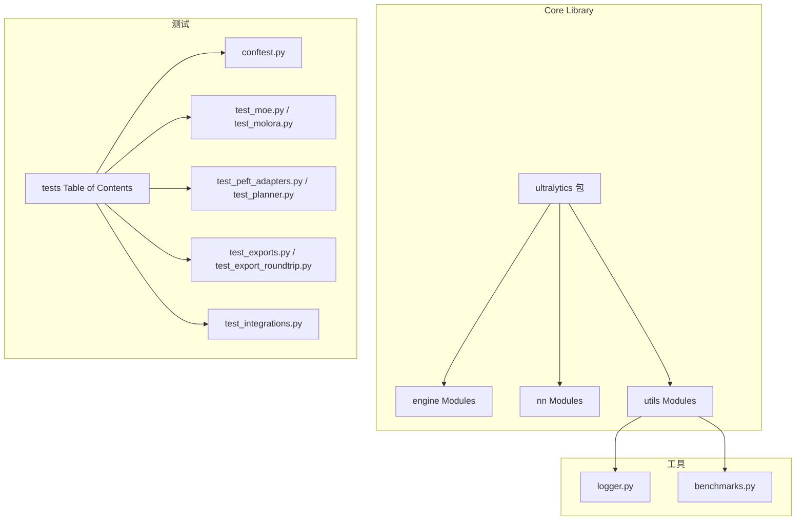
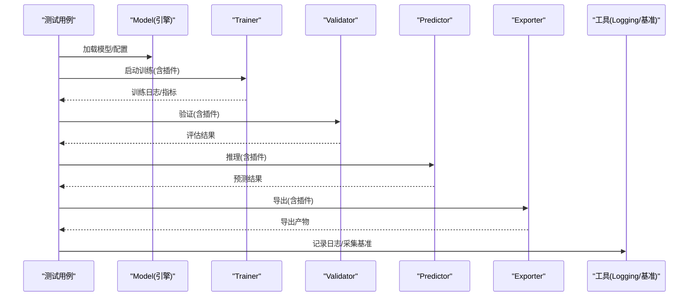
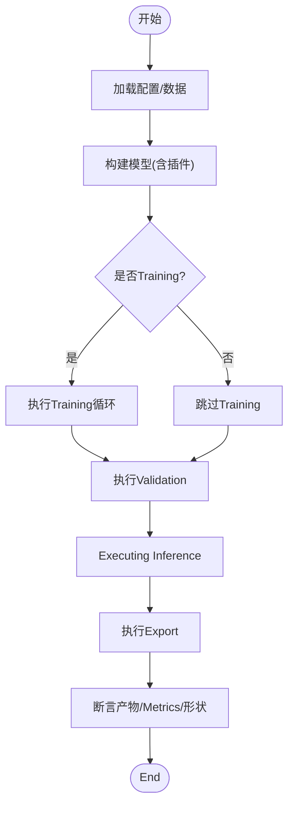
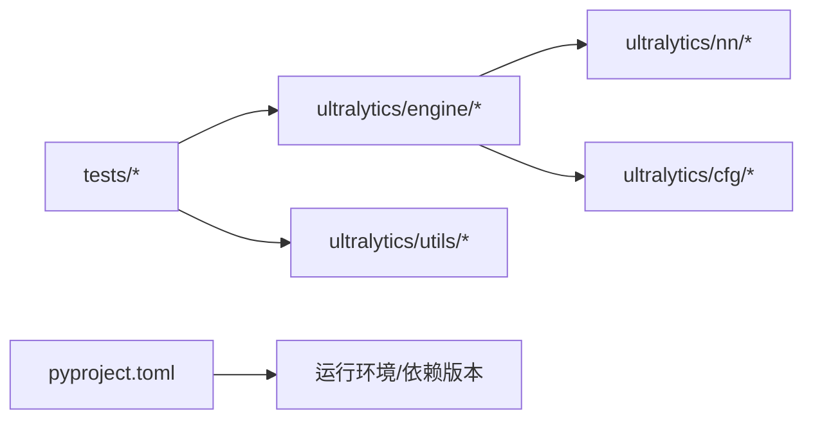

# 插件测试and调试

<cite>
**Files Referenced in This Document**
- [tests/conftest.py](file://tests/conftest.py)
- [tests/test_cli.py](file://tests/test_cli.py)
- [tests/test_engine.py](file://tests/test_engine.py)
- [tests/test_python.py](file://tests/test_python.py)
- [tests/test_moe.py](file://tests/test_moe.py)
- [tests/test_molora.py](file://tests/test_molora.py)
- [tests/test_peft_adapters.py](file://tests/test_peft_adapters.py)
- [tests/test_planner.py](file://tests/test_planner.py)
- [tests/test_mot.py](file://tests/test_mot.py)
- [tests/test_solutions.py](file://tests/test_solutions.py)
- [tests/test_export_roundtrip.py](file://tests/test_export_roundtrip.py)
- [tests/test_exports.py](file://tests/test_exports.py)
- [tests/test_integrations.py](file://tests/test_integrations.py)
- [tests/cache_test_assets.py](file://tests/cache_test_assets.py)
- [ultralytics/utils/logger.py](file://ultralytics/utils/logger.py)
- [ultralytics/utils/benchmarks.py](file://ultralytics/utils/benchmarks.py)
- [ultralytics/engine/model.py](file://ultralytics/engine/model.py)
- [ultralytics/engine/trainer.py](file://ultralytics/engine/trainer.py)
- [ultralytics/engine/validator.py](file://ultralytics/engine/validator.py)
- [ultralytics/engine/predictor.py](file://ultralytics/engine/predictor.py)
- [ultralytics/engine/exporter.py](file://ultralytics/engine/exporter.py)
- [pyproject.toml](file://pyproject.toml)
</cite>

## Table of Contents
1. [Introduction](#Introduction)
2. [Project Structure](#Project Structure)
3. [Core Components](#Core Components)
4. [Architecture Overview](#Architecture Overview)
5. [Detailed Component Analysis](#Detailed Component Analysis)
6. [Dependency Analysis](#Dependency Analysis)
7. [Performance Considerations](#Performance Considerations)
8. [Troubleshooting Guide](#Troubleshooting Guide)
9. [Conclusion](#Conclusion)
10. [Appendix](#Appendix)

## Introduction
本指南targetingYOLO-Master项目的插件（模型扩展、网络Modules、回调函数etc.）测试and调试，provides从单元测试to集成测试、端to端Validation、调试技巧、兼容性测试Centered onand持续集成的完整实践方法。DocumentationCentered on仓库现有测试and工具for依据，帮助读者快速建立稳定可靠的插件质量保障体系。

## Project Structure
仓库采用“功能域+测试覆盖”的组织方式：
- 核心代码位于 ultralytics package，包含引擎、模型、网络Modules、Export、工具and回调etc.。
- 测试集中于 tests Table of Contents，按capabilities域划分（such as MoE、LoRA/PEFT、MOT、Export、集成etc.）。
- 配置and脚本whileRoot Directoryand scripts 中，便于复现实验and基准。

Figure Source
- [tests/conftest.py](file://tests/conftest.py)
- [tests/test_moe.py](file://tests/test_moe.py)
- [tests/test_molora.py](file://tests/test_molora.py)
- [tests/test_peft_adapters.py](file://tests/test_peft_adapters.py)
- [tests/test_planner.py](file://tests/test_planner.py)
- [tests/test_exports.py](file://tests/test_exports.py)
- [tests/test_export_roundtrip.py](file://tests/test_export_roundtrip.py)
- [tests/test_integrations.py](file://tests/test_integrations.py)
- [ultralytics/utils/logger.py](file://ultralytics/utils/logger.py)
- [ultralytics/utils/benchmarks.py](file://ultralytics/utils/benchmarks.py)

Section Source
- [tests/conftest.py](file://tests/conftest.py)
- [tests/test_moe.py](file://tests/test_moe.py)
- [tests/test_molora.py](file://tests/test_molora.py)
- [tests/test_peft_adapters.py](file://tests/test_peft_adapters.py)
- [tests/test_planner.py](file://tests/test_planner.py)
- [tests/test_exports.py](file://tests/test_exports.py)
- [tests/test_export_roundtrip.py](file://tests/test_export_roundtrip.py)
- [tests/test_integrations.py](file://tests/test_integrations.py)
- [ultralytics/utils/logger.py](file://ultralytics/utils/logger.py)
- [ultralytics/utils/benchmarks.py](file://ultralytics/utils/benchmarks.py)

## Core Components
- 测试框架and夹具
  - Uses pytest 作for统一测试框架；conftest.py 集中管理共享夹具and全局配置，确保跨用例一致的环境andData Preparation。
  - 建议将数据集缓存、Device Selection、随机种子、Logging级别etc.放入夹具，减少重复代码并提升可维护性。
- 关键被测对象
  - 模型andTraining/Inference/Validation/Export流程：Via engine 层接口进行端to端串联。
  - 插件化Modules：MoE/MoA、LoRA/PEFT、MOT、Planner、Solutions etc.，分别由对应测试文件覆盖。
- 断言策略
  - 数值稳定性：对损失、Metrics、输出张量形状and范围进行断言。
  - 契约一致性：对Export产物、Registry、路由行for、回调钩子触发顺序进行断言。
  - 鲁棒性：异常路径、边界输入、空批、不同精度and设备切换的健壮性断言。

Section Source
- [tests/conftest.py](file://tests/conftest.py)
- [tests/test_engine.py](file://tests/test_engine.py)
- [tests/test_python.py](file://tests/test_python.py)
- [tests/test_moe.py](file://tests/test_moe.py)
- [tests/test_molora.py](file://tests/test_molora.py)
- [tests/test_peft_adapters.py](file://tests/test_peft_adapters.py)
- [tests/test_planner.py](file://tests/test_planner.py)
- [tests/test_mot.py](file://tests/test_mot.py)
- [tests/test_solutions.py](file://tests/test_solutions.py)
- [tests/test_export_roundtrip.py](file://tests/test_export_roundtrip.py)
- [tests/test_exports.py](file://tests/test_exports.py)
- [tests/test_integrations.py](file://tests/test_integrations.py)

## Architecture Overview
下图展示插件whileTraining/Inference/Export链路中的位置and交互关系，Centered onand测试such as何覆盖这些路径。

Figure Source
- [ultralytics/engine/model.py](file://ultralytics/engine/model.py)
- [ultralytics/engine/trainer.py](file://ultralytics/engine/trainer.py)
- [ultralytics/engine/validator.py](file://ultralytics/engine/validator.py)
- [ultralytics/engine/predictor.py](file://ultralytics/engine/predictor.py)
- [ultralytics/engine/exporter.py](file://ultralytics/engine/exporter.py)
- [ultralytics/utils/logger.py](file://ultralytics/utils/logger.py)
- [ultralytics/utils/benchmarks.py](file://ultralytics/utils/benchmarks.py)

## Detailed Component Analysis

### 单元测试编写指南
- 测试框架选择
  - Uses pytest 组织用例，Combining conftest.py provides共享夹具（such as小样本数据、固定随机种子、CPU/GPU选择）。
- 测试用例设计
  - 最小可复现：构造极小输入and简化配置，保证快速执行。
  - 分层覆盖：单元级（单Modules）、集成级（多Modules协作）、端to端（CLI/Python API）。
- 断言策略
  - 形状and类型：输入输出维度、数据类型、设备一致性。
  - 数值范围：损失非负、概率归一、IoU阈值区间。
  - 契约and副作用：Registry条目存while、回调被Calls次数and顺序、Export产物完整性。

Section Source
- [tests/conftest.py](file://tests/conftest.py)
- [tests/test_engine.py](file://tests/test_engine.py)
- [tests/test_python.py](file://tests/test_python.py)

### 集成测试and端to端流程
- 端to端流程
  - Training：加载数据→构建模型→Training循环→Metrics收敛性检查。
  - Inference：加载权重→前向传播→Post-Processing→Visualization或保存结果。
  - Export：Exporting to多种后端格式→校验图结构and算子Supporting→反序列化运行。
- 模拟环境搭建
  - Uses本地小数据集and轻量模型，避免External DependenciesandNetwork requests。
  - Via夹具隔离资源（临时Table of Contents、进程间通信、分布式初始化）。

Section Source
- [tests/test_moe.py](file://tests/test_moe.py)
- [tests/test_molora.py](file://tests/test_molora.py)
- [tests/test_peft_adapters.py](file://tests/test_peft_adapters.py)
- [tests/test_planner.py](file://tests/test_planner.py)
- [tests/test_mot.py](file://tests/test_mot.py)
- [tests/test_solutions.py](file://tests/test_solutions.py)
- [tests/test_export_roundtrip.py](file://tests/test_export_roundtrip.py)
- [tests/test_exports.py](file://tests/test_exports.py)

### 插件调试工具and技巧
- Logging
  - Uses统一Logging工具输出结构化信息，便于定位问题and回溯。
- 性能分析
  - Uses基准工具采集耗时、吞吐、内存占用，对比基线and变更差异。
- 内存泄漏检测
  - while长时Training/Inference场景下监控显存/内存增长趋势，CombiningGradient累积and清理逻辑Validation。

Section Source
- [ultralytics/utils/logger.py](file://ultralytics/utils/logger.py)
- [ultralytics/utils/benchmarks.py](file://ultralytics/utils/benchmarks.py)

### 插件兼容性测试
- 版本兼容
  - 针对上游依赖（PyTorch、ONNX、后端运行时）进行最小/最大版本矩阵测试。
- 依赖冲突检测
  - Via pyproject.toml 声明约束，CI 中并行安装不同组合，捕获导入错误and运行时异常。
- 回归门禁
  - 对关键MetricsandExport产物设置阈值，失败则阻断合并。

Section Source
- [pyproject.toml](file://pyproject.toml)
- [tests/test_integrations.py](file://tests/test_integrations.py)

### 完整测试用例开发Examples（路径指引）
- 模型插件（MoE/MoA）
  - Refer to：[tests/test_moe.py](file://tests/test_moe.py)、[tests/test_molora.py](file://tests/test_molora.py)
  - 关注点：路由分发、专家激活稀疏性、损失组成、Export兼容性。
- 网络Modules（Planner/路由Explainer）
  - Refer to：[tests/test_planner.py](file://tests/test_planner.py)
  - 关注点：调度策略、边界条件、数值稳定性。
- 回调函数
  - Refer to：[tests/test_engine.py](file://tests/test_engine.py)、[tests/test_python.py](file://tests/test_python.py)
  - 关注点：钩子触发时机、Parameter Passing、副作用清理。
- Exportand往返
  - Refer to：[tests/test_exports.py](file://tests/test_exports.py)、[tests/test_export_roundtrip.py](file://tests/test_export_roundtrip.py)
  - 关注点：图结构一致性、算子Supporting、反序列化运行正确性。
- 目标Tracking（MOT）
  - Refer to：[tests/test_mot.py](file://tests/test_mot.py)
  - 关注点：轨迹连续性、ID切换率、时序一致性。
- 解决方案（Solutions）
  - Refer to：[tests/test_solutions.py](file://tests/test_solutions.py)
  - 关注点：Visualization输出、模板渲染、IO路径。

Section Source
- [tests/test_moe.py](file://tests/test_moe.py)
- [tests/test_molora.py](file://tests/test_molora.py)
- [tests/test_planner.py](file://tests/test_planner.py)
- [tests/test_engine.py](file://tests/test_engine.py)
- [tests/test_python.py](file://tests/test_python.py)
- [tests/test_exports.py](file://tests/test_exports.py)
- [tests/test_export_roundtrip.py](file://tests/test_export_roundtrip.py)
- [tests/test_mot.py](file://tests/test_mot.py)
- [tests/test_solutions.py](file://tests/test_solutions.py)

## Dependency Analysis
- 内部依赖
  - 测试用例主要依赖 ultralytics.engine.* and ultralytics.utils.*，并Via conftest.py 注入共享资源。
- External Dependencies
  - Via pyproject.toml 声明 Python and第三方库版本约束，确保while不同环境中可重现。
- 潜while耦合
  - Exportand后端运行时强耦合，需ViaExport前后校验and往返测试降低风险。

Figure Source
- [pyproject.toml](file://pyproject.toml)
- [tests/test_integrations.py](file://tests/test_integrations.py)

Section Source
- [pyproject.toml](file://pyproject.toml)
- [tests/test_integrations.py](file://tests/test_integrations.py)

## Performance Considerations
- 基准采集
  - Uses基准工具while相同硬件and数据规模下对比变更前后吞吐and延迟。
- Training稳定性
  - 监控损失曲线andGradient范数，设置早停and回滚策略。
- 内存Optimization
  - 启用Mixture精度、GradientCheckpoint、and时释放中间变量，避免显存泄漏。

## Troubleshooting Guide
- 常见问题定位
  - 导入错误：检查依赖版本and平台差异（Windows/CUDA/ROCm）。
  - Export Failure：核对算子Supportingand后端限制，查看Export预检Logging。
  - Metrics不达标：确认数据预处理、标签格式andEvaluation协议一致性。
- 调试技巧
  - 开启详细Logging，缩小复现场景至最小用例。
  - Uses基准工具定位热点路径，逐步替换forMock或简化implementingValidation假设。
- 资源and缓存
  - Uses缓存脚本准备测试资产，避免网络抖动影响稳定性。

Section Source
- [tests/cache_test_assets.py](file://tests/cache_test_assets.py)
- [ultralytics/utils/logger.py](file://ultralytics/utils/logger.py)
- [ultralytics/utils/benchmarks.py](file://ultralytics/utils/benchmarks.py)

## Conclusion
through a unified测试框架、清晰的断言策略、完善的端to端流程and调试工具链，YOLO-Master的插件质量可Centered on得to系统化保障。建议whileCI中固化关键用例and性能门禁，持续回归Centered on确保版本演进过程中的稳定性and兼容性。

## Appendix
- 快速上手
  - Installing Dependencies：依据 pyproject.toml 创建虚拟环境并安装。
  - 运行测试：Uses pytest 指定用例或标记，Combining conftest.py provides的夹具。
  - 生成报告：CombiningLoggingand基准输出，形成可追溯的质量报告。