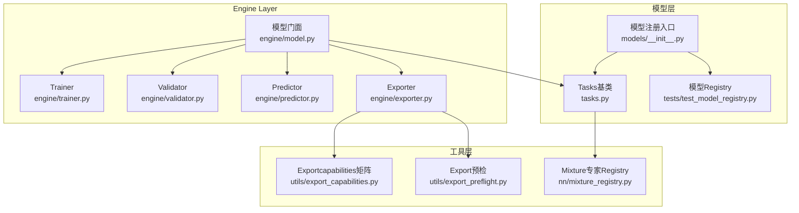
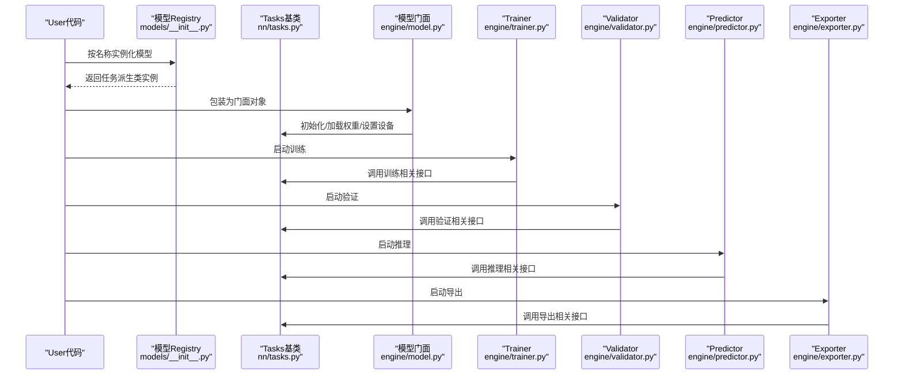
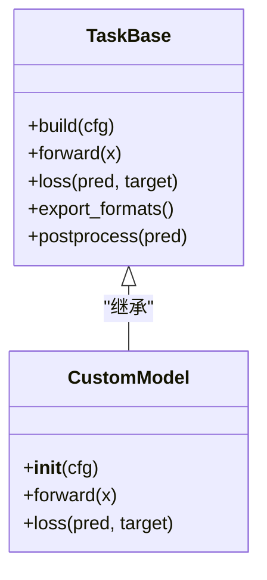
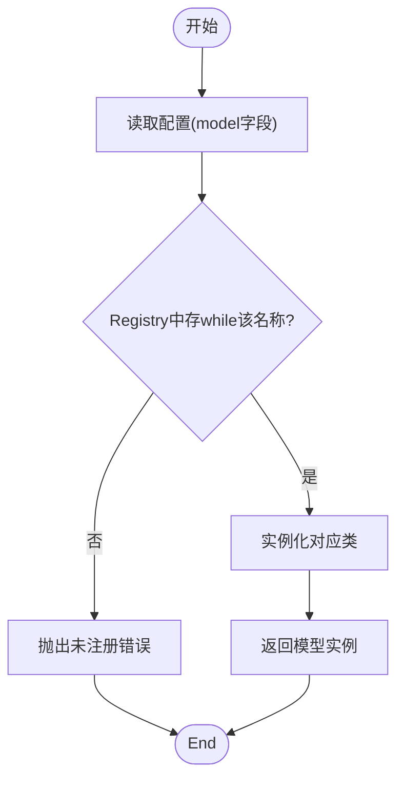
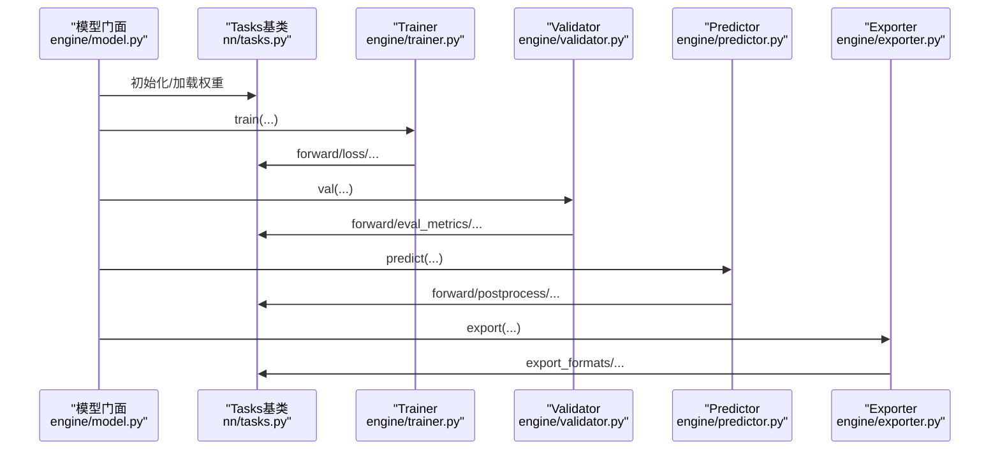
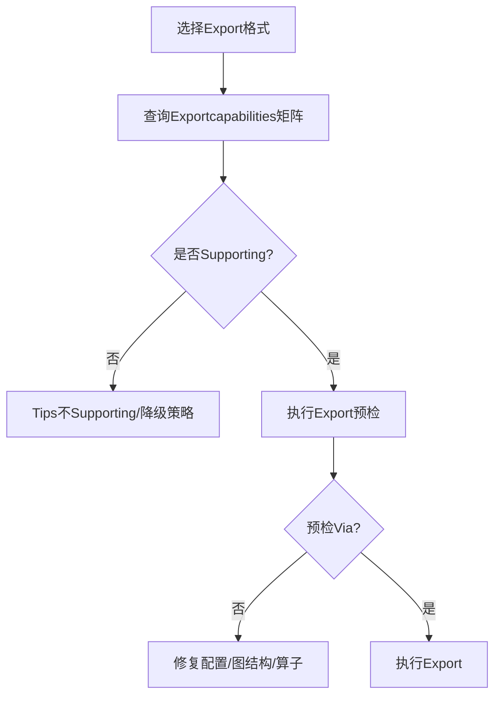
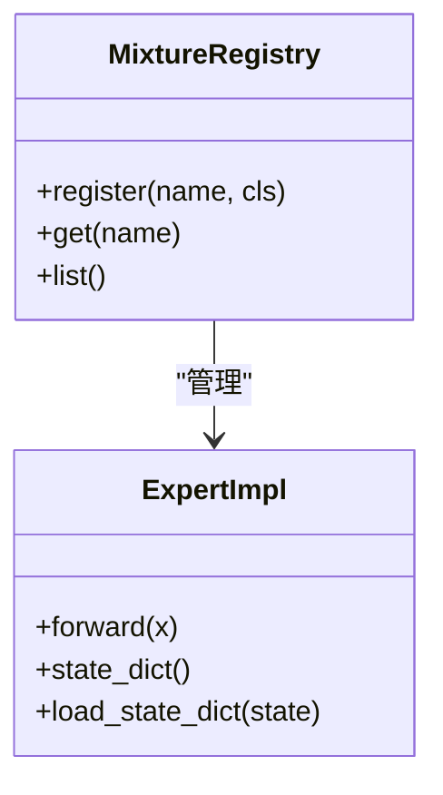
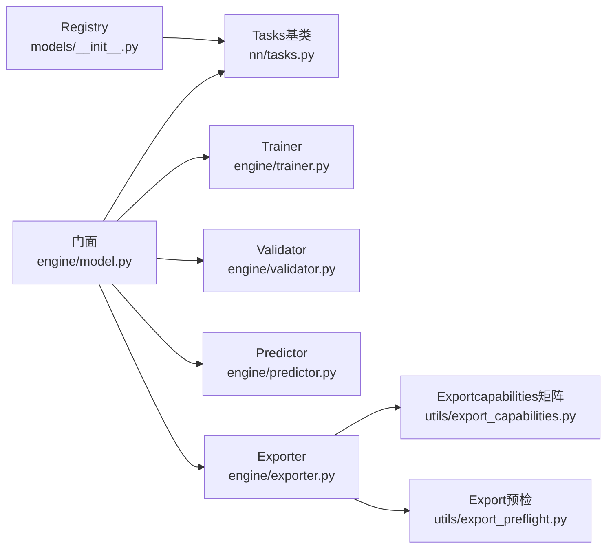

# 模型插件开发

<cite>
**Files Referenced in This Document**
- [ultralytics/models/__init__.py](file://ultralytics/models/__init__.py)
- [ultralytics/nn/tasks.py](file://ultralytics/nn/tasks.py)
- [ultralytics/engine/model.py](file://ultralytics/engine/model.py)
- [ultralytics/engine/trainer.py](file://ultralytics/engine/trainer.py)
- [ultralytics/engine/validator.py](file://ultralytics/engine/validator.py)
- [ultralytics/engine/predictor.py](file://ultralytics/engine/predictor.py)
- [ultralytics/engine/exporter.py](file://ultralytics/engine/exporter.py)
- [ultralytics/utils/export_capabilities.py](file://ultralytics/utils/export_capabilities.py)
- [ultralytics/utils/export_preflight.py](file://ultralytics/utils/export_preflight.py)
- [ultralytics/nn/mixture_registry.py](file://ultralytics/nn/mixture_registry.py)
- [tests/test_model_registry.py](file://tests/test_model_registry.py)
- [tests/test_mixture_config_registry.py](file://tests/test_mixture_config_registry.py)
- [tests/test_export_capability_matrix.py](file://tests/test_export_capability_matrix.py)
</cite>

## Table of Contents
1. [Introduction](#Introduction)
2. [Project Structure](#Project Structure)
3. [Core Components](#Core Components)
4. [Architecture Overview](#Architecture Overview)
5. [Detailed Component Analysis](#Detailed Component Analysis)
6. [Dependency Analysis](#Dependency Analysis)
7. [Performance Considerations](#Performance Considerations)
8. [Troubleshooting Guide](#Troubleshooting Guide)
9. [Conclusion](#Conclusion)
10. [Appendix](#Appendix)

## Introduction
本指南targeting希望while YOLO-Master 中implementing“自定义模型插件”的开发者，系统阐述Centered on下主题：
- 自定义模型的继承结构and参数配置、权重管理
- 模型注册机制and工厂模式、动态加载流程
- 模型生命周期（初始化、Training、Inference、Export）的处理逻辑
- 模型Adapter设计模式（接口定义andimplementing规范）
- 从分类to检测的完整Examples路径
- 性能Optimizationand内存管理最佳实践

## Project Structure
YOLO-Master 将“模型定义、Tasks抽象、运行时引擎、工具capabilities”分层组织。and模型插件开发直接相关的核心位置such as下：
- 模型注册入口andTasks映射：ultralytics/models/__init__.py
- Tasks基类and通用构建器：ultralytics/nn/tasks.py
- 模型运行时门面：ultralytics/engine/model.py
- Training/Validation/Prediction/Export引擎：ultralytics/engine/{trainer,validator,predictor,exporter}.py
- Exportcapabilities矩阵and预检：ultralytics/utils/export_capabilities.py, ultralytics/utils/export_preflight.py
- Mixture专家Registry（扩展点）：ultralytics/nn/mixture_registry.py
- 相关测试用例：tests/test_model_registry.py, tests/test_mixture_config_registry.py, tests/test_export_capability_matrix.py

Figure Source
- [ultralytics/models/__init__.py](file://ultralytics/models/__init__.py)
- [ultralytics/nn/tasks.py](file://ultralytics/nn/tasks.py)
- [ultralytics/engine/model.py](file://ultralytics/engine/model.py)
- [ultralytics/engine/trainer.py](file://ultralytics/engine/trainer.py)
- [ultralytics/engine/validator.py](file://ultralytics/engine/validator.py)
- [ultralytics/engine/predictor.py](file://ultralytics/engine/predictor.py)
- [ultralytics/engine/exporter.py](file://ultralytics/engine/exporter.py)
- [ultralytics/utils/export_capabilities.py](file://ultralytics/utils/export_capabilities.py)
- [ultralytics/utils/export_preflight.py](file://ultralytics/utils/export_preflight.py)
- [ultralytics/nn/mixture_registry.py](file://ultralytics/nn/mixture_registry.py)
- [tests/test_model_registry.py](file://tests/test_model_registry.py)

Section Source
- [ultralytics/models/__init__.py](file://ultralytics/models/__init__.py)
- [ultralytics/nn/tasks.py](file://ultralytics/nn/tasks.py)
- [ultralytics/engine/model.py](file://ultralytics/engine/model.py)

## Core Components
- Tasks基类and构建器：provides统一的模型构建、前向签名、输出解析、损失计算etc.通用capabilities，是自定义模型必须遵循的契约。
- 模型注册入口：维护“名称→类”的映射，SupportingVia字符串名动态实例化模型。
- 模型门面：Encapsulates设备放置、权重加载、Training/Validation/Prediction/Export的Unified entry point。
- Training/Validation/Prediction/Export引擎：分别负责不同生命周期的编排and回调。
- Exportcapabilitiesand预检：描述模型对目标后端的Supporting情况，并whileExport前进行一致性检查。
- Mixture专家Registry：for MoE/MoA etc.扩展provides可插拔的专家路由and组合注册点。

Section Source
- [ultralytics/nn/tasks.py](file://ultralytics/nn/tasks.py)
- [ultralytics/models/__init__.py](file://ultralytics/models/__init__.py)
- [ultralytics/engine/model.py](file://ultralytics/engine/model.py)
- [ultralytics/engine/trainer.py](file://ultralytics/engine/trainer.py)
- [ultralytics/engine/validator.py](file://ultralytics/engine/validator.py)
- [ultralytics/engine/predictor.py](file://ultralytics/engine/predictor.py)
- [ultralytics/engine/exporter.py](file://ultralytics/engine/exporter.py)
- [ultralytics/utils/export_capabilities.py](file://ultralytics/utils/export_capabilities.py)
- [ultralytics/utils/export_preflight.py](file://ultralytics/utils/export_preflight.py)
- [ultralytics/nn/mixture_registry.py](file://ultralytics/nn/mixture_registry.py)

## Architecture Overview
下图展示了自定义模型while系统中的装配and运行路径：UserViaRegistryCentered on字符串名创建模型，由门面统一管理生命周期，Training/Validation/Prediction/Export各自CallsTasks的相应方法。

Figure Source
- [ultralytics/models/__init__.py](file://ultralytics/models/__init__.py)
- [ultralytics/nn/tasks.py](file://ultralytics/nn/tasks.py)
- [ultralytics/engine/model.py](file://ultralytics/engine/model.py)
- [ultralytics/engine/trainer.py](file://ultralytics/engine/trainer.py)
- [ultralytics/engine/validator.py](file://ultralytics/engine/validator.py)
- [ultralytics/engine/predictor.py](file://ultralytics/engine/predictor.py)
- [ultralytics/engine/exporter.py](file://ultralytics/engine/exporter.py)

## Detailed Component Analysis

### Tasks基类and自定义模型继承结构
- 继承关系：自定义模型应继承自Tasks基类，复用通用的构建、前向、损失、Post-Processingetc.capabilities。
- 关键职责：
  - 构建阶段：根据配置生成网络结构，注册子Modules，完成参数初始化。
  - 前向阶段：定义输入张量形状、通道数、类别数etc.契约；输出需遵循Tasks约定（such as分类概率、检测框+掩码etc.）。
  - 损失阶段：若参andTraining，需provides或组合Loss Function。
  - Export阶段：声明Supporting的Export格式and约束。
- 复杂度and扩展点：
  - 时间复杂度主要由Backbone Networkand头决定；可ViaModules化替换（such as替换 backbone/head）implementing差异化。
  - 扩展点包括：新增子Modules、重写特定钩子、接入Mixture专家Registry。

Figure Source
- [ultralytics/nn/tasks.py](file://ultralytics/nn/tasks.py)

Section Source
- [ultralytics/nn/tasks.py](file://ultralytics/nn/tasks.py)

### 模型注册机制and工厂模式
- Registry维护“名称→类”的映射，允许Via字符串名动态实例化模型。
- 典型流程：
  - while注册入口中登记新模型名称and其类引用。
  - Uses统一 API 按名称获取并实例化模型。
  - 单元测试覆盖注册/反注册、重复注册冲突、缺失键异常etc.边界条件。
- 动态加载：
  - Combining配置文件中的 model 字段，可while运行时自动选择具体模型类。

Figure Source
- [ultralytics/models/__init__.py](file://ultralytics/models/__init__.py)
- [tests/test_model_registry.py](file://tests/test_model_registry.py)

Section Source
- [ultralytics/models/__init__.py](file://ultralytics/models/__init__.py)
- [tests/test_model_registry.py](file://tests/test_model_registry.py)

### 模型门面and生命周期管理
- 门面职责：
  - 设备放置：CPU/GPU/CUDA devices的自动选择and切换。
  - 权重管理：加载Pre-trained Weights、校验参数维度、兼容旧版本权重。
  - 生命周期编排：初始化→Training→Validation→Prediction→Export。
- Training阶段：
  - 由Trainerdrivers are installed，CallsTasks的损失and前向，管理Optimizer、调度器、EMA、Loggingand回调。
- Validation阶段：
  - 由Validatordrivers are installed，执行Metrics计算and结果汇总。
- Prediction阶段：
  - 由Predictordrivers are installed，执行批处理、NMS、Visualizationetc.Post-Processing。
- Export阶段：
  - 由Exporterdrivers are installed，CallsExportcapabilities矩阵and预检，生成目标格式。

Figure Source
- [ultralytics/engine/model.py](file://ultralytics/engine/model.py)
- [ultralytics/nn/tasks.py](file://ultralytics/nn/tasks.py)
- [ultralytics/engine/trainer.py](file://ultralytics/engine/trainer.py)
- [ultralytics/engine/validator.py](file://ultralytics/engine/validator.py)
- [ultralytics/engine/predictor.py](file://ultralytics/engine/predictor.py)
- [ultralytics/engine/exporter.py](file://ultralytics/engine/exporter.py)

Section Source
- [ultralytics/engine/model.py](file://ultralytics/engine/model.py)
- [ultralytics/engine/trainer.py](file://ultralytics/engine/trainer.py)
- [ultralytics/engine/validator.py](file://ultralytics/engine/validator.py)
- [ultralytics/engine/predictor.py](file://ultralytics/engine/predictor.py)
- [ultralytics/engine/exporter.py](file://ultralytics/engine/exporter.py)

### Exportcapabilitiesand预检
- Exportcapabilities矩阵：集中描述各模型对 ONNX/TensorRT/OpenVINO etc.后端的Supporting状态and约束。
- Export预检：whileExport前进行参数/图结构/算子兼容性检查，避免运行时失败。
- 建议：
  - for新模型补充Exportcapabilities条目。
  - while自定义Export路径时，确保and预检规则一致。

Figure Source
- [ultralytics/utils/export_capabilities.py](file://ultralytics/utils/export_capabilities.py)
- [ultralytics/utils/export_preflight.py](file://ultralytics/utils/export_preflight.py)
- [tests/test_export_capability_matrix.py](file://tests/test_export_capability_matrix.py)

Section Source
- [ultralytics/utils/export_capabilities.py](file://ultralytics/utils/export_capabilities.py)
- [ultralytics/utils/export_preflight.py](file://ultralytics/utils/export_preflight.py)
- [tests/test_export_capability_matrix.py](file://tests/test_export_capability_matrix.py)

### Mixture专家Registry（MoE/MoA 扩展点）
- 作用：for专家路由、专家组合、动态调度etc.provides可插拔注册点。
- Uses方式：
  - whileRegistry中登记新的专家/路由implementing。
  - whileTasks或门面中按需启用。
- 测试覆盖：
  - 注册/查找/冲突处理etc.行for的正确性。

Figure Source
- [ultralytics/nn/mixture_registry.py](file://ultralytics/nn/mixture_registry.py)
- [tests/test_mixture_config_registry.py](file://tests/test_mixture_config_registry.py)

Section Source
- [ultralytics/nn/mixture_registry.py](file://ultralytics/nn/mixture_registry.py)
- [tests/test_mixture_config_registry.py](file://tests/test_mixture_config_registry.py)

### 自定义模型开发Examples（从分类to检测）
- 简单分类模型：
  - 继承Tasks基类，implementing前向andOptional的损失。
  - while注册入口登记名称。
  - Via门面进行Training/Validation/Prediction/Export。
- 复杂检测模型：
  - whileTasks基类基础上，implementingDetection Head、Post-Processing（NMS）、多尺度Training、Data Augmentation适配。
  - 完善Exportcapabilitiesand预检项。
  - such as需引入 MoE/MoA，ViaMixture专家Registry注册专家and路由。

（本节for概念性指导，不直接分析具体文件）

## Dependency Analysis
- 耦合关系：
  - 模型门面强依赖Tasks基类and各引擎（Training/Validation/Prediction/Export）。
  - Exporter依赖Exportcapabilities矩阵and预检Modules。
  - RegistryandTasks基类解耦良好，便于扩展。
- External Dependencies：
  - PyTorch 张量andModules体系。
  - 第三方Export Backends（ONNX/TensorRT/OpenVINO etc.）由Exporterandcapabilities矩阵协调。

Figure Source
- [ultralytics/models/__init__.py](file://ultralytics/models/__init__.py)
- [ultralytics/nn/tasks.py](file://ultralytics/nn/tasks.py)
- [ultralytics/engine/model.py](file://ultralytics/engine/model.py)
- [ultralytics/engine/trainer.py](file://ultralytics/engine/trainer.py)
- [ultralytics/engine/validator.py](file://ultralytics/engine/validator.py)
- [ultralytics/engine/predictor.py](file://ultralytics/engine/predictor.py)
- [ultralytics/engine/exporter.py](file://ultralytics/engine/exporter.py)
- [ultralytics/utils/export_capabilities.py](file://ultralytics/utils/export_capabilities.py)
- [ultralytics/utils/export_preflight.py](file://ultralytics/utils/export_preflight.py)

Section Source
- [ultralytics/models/__init__.py](file://ultralytics/models/__init__.py)
- [ultralytics/nn/tasks.py](file://ultralytics/nn/tasks.py)
- [ultralytics/engine/model.py](file://ultralytics/engine/model.py)
- [ultralytics/engine/exporter.py](file://ultralytics/engine/exporter.py)

## Performance Considerations
- 计算and内存
  - Set appropriately batch size and图像尺寸，避免显存峰值过高。
  - UsesGradient累积andMixture精度TrainingCentered on降低显存占用。
  - 对大模型采用分块/稀疏激活（such as MoE）减少计算量。
- ExportOptimization
  - 优先选择目标平台最优后端（such as TensorRT/OpenVINO）。
  - 利用Exportcapabilities矩阵and预检提前发现算子不兼容问题。
- I/O and缓存
  - 开启数据预取and缓存，减少磁盘 IO bottlenecks。
  - Inference侧Uses批处理and固定输入尺寸提升吞吐。
- 监控and诊断
  - 记录Training曲线and资源Uses，定位热点Modules。
  - 针对Export Failure场景，依据预检报告逐项修复。

（This section provides general guidance and does not directly analyze specific files）

## Troubleshooting Guide
- 模型未注册或名称冲突
  - 现象：按名称实例化失败或返回非预期类。
  - 排查：确认注册入口是否正确登记；检查重复注册and命名空间冲突。
- 权重加载失败
  - 现象：维度不匹配、键名不一致、类型不符。
  - 排查：核对Tasks基类的参数命名and维度约定；必要时进行权重Migration脚本。
- Export Failure
  - 现象：指定后端不Supporting或预检报错。
  - 排查：查看Exportcapabilities矩阵；根据预检报告调整图结构/算子/输入形状。
- Training不稳定
  - 现象：Loss 发散、NaN、Gradient爆炸。
  - 排查：降低Learning Rate、启用Gradient裁剪、检查数据标签and损失implementing。

Section Source
- [tests/test_model_registry.py](file://tests/test_model_registry.py)
- [tests/test_export_capability_matrix.py](file://tests/test_export_capability_matrix.py)

## Conclusion
ViawhileTasks基类之上implementing自定义模型，并while注册入口登记名称，即可无缝融入 YOLO-Master 的Training/Validation/Prediction/Export全链路。Combined withExportcapabilities矩阵and预检，可快速Validation目标部署平台的兼容性。对于更复杂的场景（such as MoE/MoA），可利用Mixture专家Registry进行扩展。遵循本文的生命周期and最佳实践，能够高效、稳定地交付高质量的自定义模型插件。

## Appendix
- 术语
  - Tasks基类：provides统一的前向/损失/Export契约的基类。
  - 模型门面：Encapsulates设备、权重and生命周期的Unified entry point。
  - Exportcapabilities矩阵：描述模型对各后端的Supporting情况。
  - Export预检：Export前的兼容性检查。
  - Mixture专家Registry：用于注册and管理专家/路由的可插拔组件。