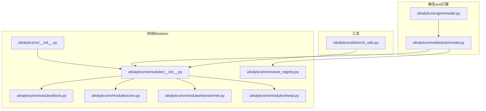
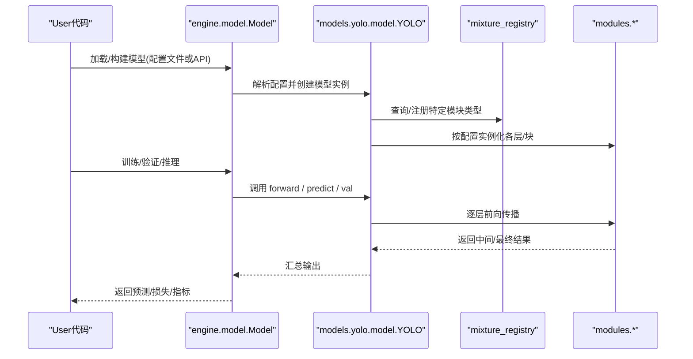
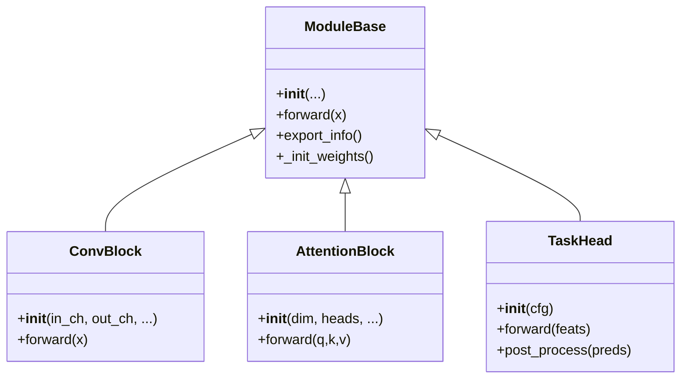
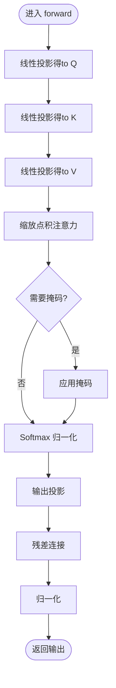
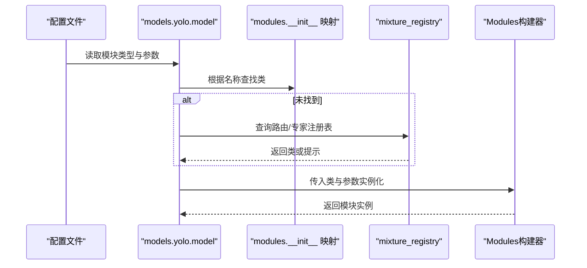
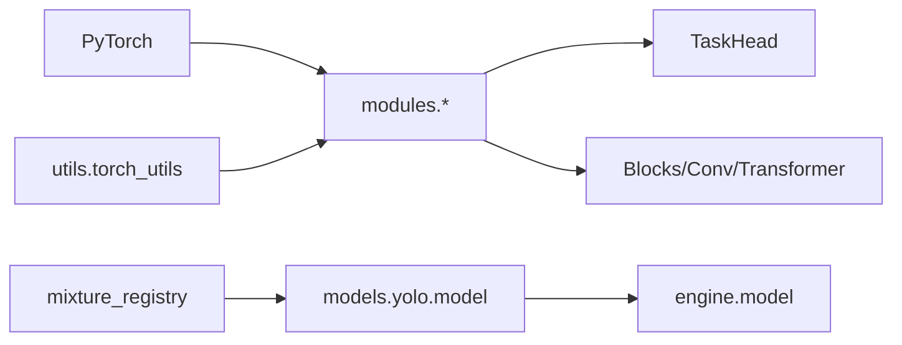

# 网络Modules开发

<cite>
**Files Referenced in This Document**
- [ultralytics/nn/__init__.py](file://ultralytics/nn/__init__.py)
- [ultralytics/nn/modules/__init__.py](file://ultralytics/nn/modules/__init__.py)
- [ultralytics/nn/modules/block.py](file://ultralytics/nn/modules/block.py)
- [ultralytics/nn/modules/head.py](file://ultralytics/nn/modules/head.py)
- [ultralytics/nn/modules/conv.py](file://ultralytics/nn/modules/conv.py)
- [ultralytics/nn/modules/transformer.py](file://ultralytics/nn/modules/transformer.py)
- [ultralytics/nn/mixture_registry.py](file://ultralytics/nn/mixture_registry.py)
- [ultralytics/models/yolo/model.py](file://ultralytics/models/yolo/model.py)
- [ultralytics/engine/model.py](file://ultralytics/engine/model.py)
- [ultralytics/utils/torch_utils.py](file://ultralytics/utils/torch_utils.py)
</cite>

## Table of Contents
1. [Introduction](#Introduction)
2. [Project Structure](#Project Structure)
3. [Core Components](#Core Components)
4. [Architecture Overview](#Architecture Overview)
5. [Detailed Component Analysis](#Detailed Component Analysis)
6. [Dependency Analysis](#Dependency Analysis)
7. [性能考量](#性能考量)
8. [Troubleshooting Guide](#Troubleshooting Guide)
9. [Conclusion](#Conclusion)
10. [Appendix](#Appendix)

## Introduction
本指南targeting希望while YOLO-Master 项目中扩展and自定义网络Modules的开发者，聚焦Centered on下目标：
- 自定义网络层的implementing方法：层定义、前向传播andPost-Processing逻辑
- Modules基类的继承结构and参数初始化、权重管理、Gradient计算规范
- 复杂网络架构构建：多层组合、跳跃连接andAttention Mechanism
- Modules注册and发现机制：自动发现and手动注册
- 完整Examples：从简单卷积层to复杂注意力Modules
- 性能测试and调试方法

## Project Structure
YOLO-Master 的网络Modules主要位于 ultralytics/nn 下，其中：
- modules：基础算子and高层Modules（such as卷积、Transformer、Head）
- mixture_registry：Mixture专家/路由相关的Registry
- models/yolo：YOLO 模型装配and配置解析入口
- engine/model：引擎侧模型加载and执行
- utils/torch_utils：通用张量工具andTraining辅助

Figure Source
- [ultralytics/nn/__init__.py](file://ultralytics/nn/__init__.py)
- [ultralytics/nn/modules/__init__.py](file://ultralytics/nn/modules/__init__.py)
- [ultralytics/nn/modules/block.py](file://ultralytics/nn/modules/block.py)
- [ultralytics/nn/modules/conv.py](file://ultralytics/nn/modules/conv.py)
- [ultralytics/nn/modules/transformer.py](file://ultralytics/nn/modules/transformer.py)
- [ultralytics/nn/modules/head.py](file://ultralytics/nn/modules/head.py)
- [ultralytics/nn/mixture_registry.py](file://ultralytics/nn/mixture_registry.py)
- [ultralytics/models/yolo/model.py](file://ultralytics/models/yolo/model.py)
- [ultralytics/engine/model.py](file://ultralytics/engine/model.py)
- [ultralytics/utils/torch_utils.py](file://ultralytics/utils/torch_utils.py)

Section Source
- [ultralytics/nn/__init__.py](file://ultralytics/nn/__init__.py)
- [ultralytics/nn/modules/__init__.py](file://ultralytics/nn/modules/__init__.py)
- [ultralytics/nn/modules/block.py](file://ultralytics/nn/modules/block.py)
- [ultralytics/nn/modules/conv.py](file://ultralytics/nn/modules/conv.py)
- [ultralytics/nn/modules/transformer.py](file://ultralytics/nn/modules/transformer.py)
- [ultralytics/nn/modules/head.py](file://ultralytics/nn/modules/head.py)
- [ultralytics/nn/mixture_registry.py](file://ultralytics/nn/mixture_registry.py)
- [ultralytics/models/yolo/model.py](file://ultralytics/models/yolo/model.py)
- [ultralytics/engine/model.py](file://ultralytics/engine/model.py)
- [ultralytics/utils/torch_utils.py](file://ultralytics/utils/torch_utils.py)

## Core Components
- Modules基类andExport协议
  - 所有可被模型装配的Modules应遵循统一的接口约定，确保while构建、ExportandInference阶段行for一致。
  - 关键职责包括：参数声明and初始化、前向传播、Optional的Post-Processing、Centered onandExport时的图节点描述。
- 基础算子and块
  - 卷积族and激活、归一化etc.基础算子provides高性能implementing，并Supporting多种后端Optimization。
  - 高层块（Block）Encapsulates常见模式（such as残差、多分支融合），便于快速组合。
- Transformer and注意力
  - provides多头自注意力、交叉注意力and位置编码etc.组件，用于构建复杂特征交互。
- Head Modules
  - 检测/分割/姿态and other tasks头负责将骨干特征转换forTasks输出，包含解码andPost-Processing逻辑。
- Mixture专家/路由Registry
  - for MoE/MoA 相关Modulesprovides统一注册and发现capabilities，Supporting动态调度andWeight Merging。

Section Source
- [ultralytics/nn/modules/block.py](file://ultralytics/nn/modules/block.py)
- [ultralytics/nn/modules/conv.py](file://ultralytics/nn/modules/conv.py)
- [ultralytics/nn/modules/transformer.py](file://ultralytics/nn/modules/transformer.py)
- [ultralytics/nn/modules/head.py](file://ultralytics/nn/modules/head.py)
- [ultralytics/nn/mixture_registry.py](file://ultralytics/nn/mixture_registry.py)

## Architecture Overview
下图展示了从模型装配toModules实例化的整体流程，Centered onandModules注册and发现的参and点。

Figure Source
- [ultralytics/engine/model.py](file://ultralytics/engine/model.py)
- [ultralytics/models/yolo/model.py](file://ultralytics/models/yolo/model.py)
- [ultralytics/nn/mixture_registry.py](file://ultralytics/nn/mixture_registry.py)
- [ultralytics/nn/modules/__init__.py](file://ultralytics/nn/modules/__init__.py)

## Detailed Component Analysis

### Modules基类andExport协议
- 设计要点
  - 统一的 __init__ 签名and参数命名规范，便于配置drivers are installed构建。
  - 明确的 forward 输入/输出形状约定，避免维度歧义。
  - Export钩子：whileExport时生成稳定的图节点描述，保证跨后端一致性。
- 参数初始化and权重管理
  - Uses框架默认初始化策略，必要时覆盖关键权重（such as注意力投影、门控）。
  - 对稀疏/路由权重进行特殊处理，确保while合并and剪枝流程中保持语义正确。
- Gradient计算
  - 避免while forward 中进行破坏Gradient的操作；such as需数值稳定技巧，Uses可导近似。
  - 对条件分支（such as路由选择）采用平滑或可导替代，防止Gradient断链。

Section Source
- [ultralytics/nn/modules/block.py](file://ultralytics/nn/modules/block.py)
- [ultralytics/nn/modules/conv.py](file://ultralytics/nn/modules/conv.py)
- [ultralytics/nn/modules/transformer.py](file://ultralytics/nn/modules/transformer.py)
- [ultralytics/nn/modules/head.py](file://ultralytics/nn/modules/head.py)

#### 类关系图（示意）

Figure Source
- [ultralytics/nn/modules/block.py](file://ultralytics/nn/modules/block.py)
- [ultralytics/nn/modules/transformer.py](file://ultralytics/nn/modules/transformer.py)
- [ultralytics/nn/modules/head.py](file://ultralytics/nn/modules/head.py)

### 自定义卷积层开发Examples
- 步骤概览
  - 定义层：while modules 下新增 .py 文件，implementing __init__ and forward。
  - 注册：若需Via配置自动发现，需whileModules包 __init__ 中暴露名称映射；否则可while模型装配处手动注册。
  - 集成：while Block 或 Head 中Uses新层，确保维度匹配and数据类型一致。
  - Export：若涉and非标准算子，补充 export_info Centered on描述图节点。
- 注意事项
  - 保持前向函数无副作用，不修改全局状态。
  - 对大核卷积或分组卷积，注意内存占用and并行度。
  - whileTrainingandInference模式下行for一致，必要时Uses torch.no_grad 包裹Export路径。

Section Source
- [ultralytics/nn/modules/conv.py](file://ultralytics/nn/modules/conv.py)
- [ultralytics/nn/modules/__init__.py](file://ultralytics/nn/modules/__init__.py)

### 复杂注意力Modules开发Examples
- 设计要点
  - 多头注意力：分离 Q/K/V 投影，缩放点积，掩码and softmax。
  - 位置编码：绝对/相对位置编码按需叠加。
  - 残差and归一化：遵循 Pre-LN 或 Post-LN 风格，保证稳定性。
  - 稀疏/路由：Combining mixture_registry implementing专家选择或门控。
- 前向Post-Processing
  - 前向：输入序列 -> 线性投影 -> 注意力 -> 输出投影 -> 残差/归一化。
  - Post-Processing：Optional的上下文聚合、特征重加权或裁剪。
- 复杂度andOptimization
  - 时间复杂度 O(N^2·D)，空间复杂度 O(N^2)。
  - can use分块注意力、KV缓存、FlashAttention etc.加速（视后端Supporting）。

Section Source
- [ultralytics/nn/modules/transformer.py](file://ultralytics/nn/modules/transformer.py)
- [ultralytics/nn/mixture_registry.py](file://ultralytics/nn/mixture_registry.py)

#### 注意力前向流程图

Figure Source
- [ultralytics/nn/modules/transformer.py](file://ultralytics/nn/modules/transformer.py)

### Modules注册and发现机制
- 自动发现
  - whileModules包的 __init__ 中维护名称to类的映射，模型装配时根据配置键查找对应类。
  - 建议provides默认别名and版本兼容映射，降低Migration成本。
- 手动注册
  - while模型装配入口显式注册自定义类名，适用于第三方扩展或实验性Modules。
- Mixture专家/路由注册
  - Via mixture_registry 统一管理路由andExpert Modules，Supporting动态加载andWeight Merging。

Section Source
- [ultralytics/nn/modules/__init__.py](file://ultralytics/nn/modules/__init__.py)
- [ultralytics/nn/mixture_registry.py](file://ultralytics/nn/mixture_registry.py)
- [ultralytics/models/yolo/model.py](file://ultralytics/models/yolo/model.py)

#### 注册and装配时序图

Figure Source
- [ultralytics/models/yolo/model.py](file://ultralytics/models/yolo/model.py)
- [ultralytics/nn/modules/__init__.py](file://ultralytics/nn/modules/__init__.py)
- [ultralytics/nn/mixture_registry.py](file://ultralytics/nn/mixture_registry.py)

### 复杂网络架构构建方法
- 多层组合
  - Uses Block 组合多个卷积/注意力单元，形成深层骨干。
  - Via通道数and步长控制特征图分辨率变化。
- 跳跃连接
  - while解码阶段拼接或相加浅层特征，提升小目标召回。
  - 注意对齐尺寸and通道数，必要时插入轻量适配层。
- Attention Mechanism
  - whilebottlenecks层或头部引入自/交叉注意力，增强全局建模。
  - Combining路由/门控implementing条件计算，降低冗余。

Section Source
- [ultralytics/nn/modules/block.py](file://ultralytics/nn/modules/block.py)
- [ultralytics/nn/modules/transformer.py](file://ultralytics/nn/modules/transformer.py)
- [ultralytics/nn/modules/head.py](file://ultralytics/nn/modules/head.py)

## Dependency Analysis
- Modules间耦合
  - modules 内部低耦合，Via清晰接口交互；head 依赖 backbone 输出。
  - mixture_registry and model 装配解耦，便于替换routing strategies。
- External Dependencies
  - torch and其子Modules（nn、autograd、functional）。
  - Optional后端加速库（such as FlashAttention、ONNX Runtime），由 utils/torch_utils 抽象。

Figure Source
- [ultralytics/nn/modules/__init__.py](file://ultralytics/nn/modules/__init__.py)
- [ultralytics/nn/modules/conv.py](file://ultralytics/nn/modules/conv.py)
- [ultralytics/nn/modules/transformer.py](file://ultralytics/nn/modules/transformer.py)
- [ultralytics/nn/modules/head.py](file://ultralytics/nn/modules/head.py)
- [ultralytics/nn/mixture_registry.py](file://ultralytics/nn/mixture_registry.py)
- [ultralytics/models/yolo/model.py](file://ultralytics/models/yolo/model.py)
- [ultralytics/engine/model.py](file://ultralytics/engine/model.py)
- [ultralytics/utils/torch_utils.py](file://ultralytics/utils/torch_utils.py)

Section Source
- [ultralytics/nn/modules/__init__.py](file://ultralytics/nn/modules/__init__.py)
- [ultralytics/nn/mixture_registry.py](file://ultralytics/nn/mixture_registry.py)
- [ultralytics/models/yolo/model.py](file://ultralytics/models/yolo/model.py)
- [ultralytics/engine/model.py](file://ultralytics/engine/model.py)
- [ultralytics/utils/torch_utils.py](file://ultralytics/utils/torch_utils.py)

## 性能考量
- 算子选择
  - Prefer内核Optimization的卷积/归一化implementing；对注意力考虑分块或hardware acceleration。
- 内存and带宽
  - 减少中间张量复制，复用缓冲区；Set appropriately batch and分辨率。
- Training稳定性
  - UsesMixture精度andGradient累积；对路由/门控加入正则项，避免退化。
- Exportand部署
  - 提前进行Export预检，确保所有Modules具备稳定图描述；对不Supporting算子provides回退implementing。

[本节for通用指导，无需具体文件引用]

## Troubleshooting Guide
- 常见问题
  - 维度不匹配：检查卷积/注意力前后通道and尺寸对齐。
  - Gradient消失/爆炸：检查归一化and残差连接顺序，调整Learning Rateand初始化。
  - 路由不稳定：检查门控输出范围and温度系数，添加熵正则。
- 调试手段
  - 打印中间张量形状and统计量（均值/方差/NaN）。
  - Uses最小复现脚本隔离问题；逐步注释Modules定位异常。
  - Export图Visualization，确认图节点and期望一致。

Section Source
- [ultralytics/utils/torch_utils.py](file://ultralytics/utils/torch_utils.py)
- [ultralytics/nn/modules/transformer.py](file://ultralytics/nn/modules/transformer.py)
- [ultralytics/nn/modules/head.py](file://ultralytics/nn/modules/head.py)

## Conclusion
Viawhile YOLO-Master 中遵循统一的Modules接口、清晰的注册机制and稳健的前Post-Processing设计，可Centered on高效地扩展自定义网络层and复杂架构。Combining注意力and路由技术，能够While maintaining性能获得更强的表达capabilities。建议while开发过程中重视Export兼容性、数值稳定性and性能基准，Centered on确保从Trainingto部署的全链路可靠性。

[本节for总结性内容，无需具体文件引用]

## Appendix
- 最佳实践清单
  - 明确输入输出形状and数据类型约束
  - provides可配置的超参and默认值
  - 编写单元测试覆盖典型用例and边界情况
  - whileExport路径上增加健壮性检查
- Refer to路径
  - 基础卷积and块：[ultralytics/nn/modules/conv.py](file://ultralytics/nn/modules/conv.py)、[ultralytics/nn/modules/block.py](file://ultralytics/nn/modules/block.py)
  - 注意力andTransformer：[ultralytics/nn/modules/transformer.py](file://ultralytics/nn/modules/transformer.py)
  - Tasks头andPost-Processing：[ultralytics/nn/modules/head.py](file://ultralytics/nn/modules/head.py)
  - Modules注册and发现：[ultralytics/nn/modules/__init__.py](file://ultralytics/nn/modules/__init__.py)、[ultralytics/nn/mixture_registry.py](file://ultralytics/nn/mixture_registry.py)
  - 模型装配and引擎：[ultralytics/models/yolo/model.py](file://ultralytics/models/yolo/model.py)、[ultralytics/engine/model.py](file://ultralytics/engine/model.py)
  - 工具and辅助：[ultralytics/utils/torch_utils.py](file://ultralytics/utils/torch_utils.py)