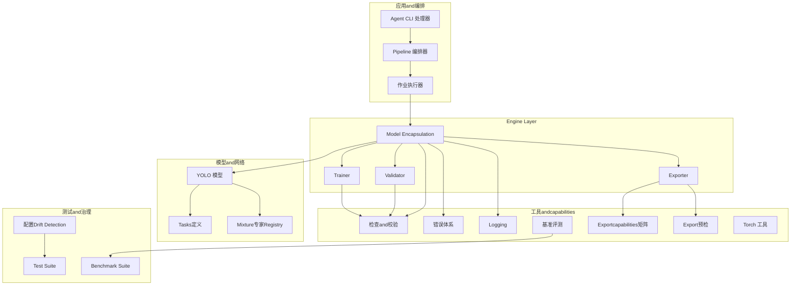
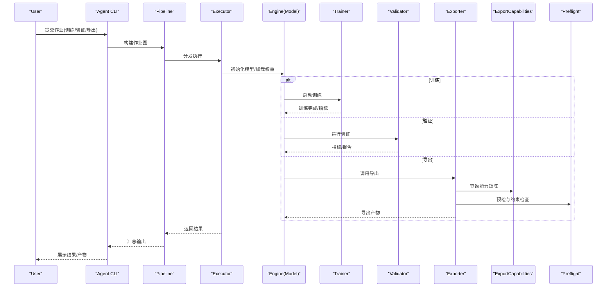
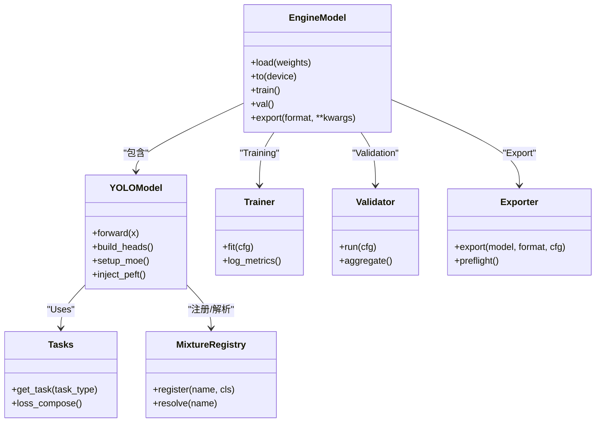
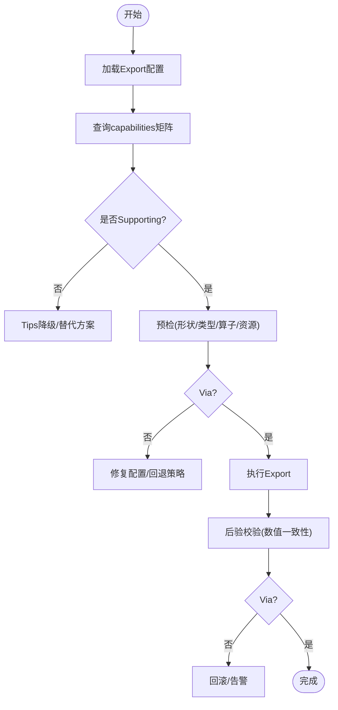
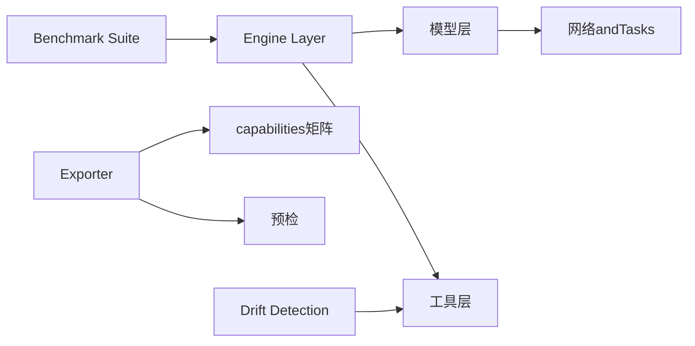

# 功能设计and规划

<cite>
**Files Referenced in This Document**
- [README.md](file://README.md)
- [pyproject.toml](file://pyproject.toml)
- [ultralytics/cfg/default.yaml](file://ultralytics/cfg/default.yaml)
- [ultralytics/cfg/__init__.py](file://ultralytics/cfg/__init__.py)
- [ultralytics/engine/model.py](file://ultralytics/engine/model.py)
- [ultralytics/engine/trainer.py](file://ultralytics/engine/trainer.py)
- [ultralytics/engine/validator.py](file://ultralytics/engine/validator.py)
- [ultralytics/engine/exporter.py](file://ultralytics/engine/exporter.py)
- [ultralytics/utils/checks.py](file://ultralytics/utils/checks.py)
- [ultralytics/utils/errors.py](file://ultralytics/utils/errors.py)
- [ultralytics/utils/logger.py](file://ultralytics/utils/logger.py)
- [ultralytics/utils/benchmarks.py](file://ultralytics/utils/benchmarks.py)
- [ultralytics/utils/export_capabilities.py](file://ultralytics/utils/export_capabilities.py)
- [ultralytics/utils/export_preflight.py](file://ultralytics/utils/export_preflight.py)
- [ultralytics/utils/export_validation.py](file://ultralytics/utils/export_validation.py)
- [ultralytics/utils/torch_utils.py](file://ultralytics/utils/torch_utils.py)
- [ultralytics/models/yolo/model.py](file://ultralytics/models/yolo/model.py)
- [ultralytics/nn/mixture_registry.py](file://ultralytics/nn/mixture_registry.py)
- [ultralytics/nn/tasks.py](file://ultralytics/nn/tasks.py)
- [tests/test_config_drift_detector.py](file://tests/test_config_drift_detector.py)
- [tests/test_export_preflight.py](file://tests/test_export_preflight.py)
- [tests/test_default_config_integrity.py](file://tests/test_default_config_integrity.py)
- [tests/test_master_model_configs.py](file://tests/test_master_model_configs.py)
- [tests/test_mixture_config_resolution.py](file://tests/test_mixture_config_resolution.py)
- [tests/test_mixture_config_registry.py](file://tests/test_mixture_config_registry.py)
- [tests/test_model_adapter_facade.py](file://tests/test_model_adapter_facade.py)
- [tests/test_model_registry.py](file://tests/test_model_registry.py)
- [tests/test_peft_adapters.py](file://tests/test_peft_adapters.py)
- [tests/test_molora.py](file://tests/test_molora.py)
- [tests/test_molora_merge_semantics.py](file://tests/test_molora_merge_semantics.py)
- [tests/test_moe_dynamic_scheduler.py](file://tests/test_moe_dynamic_scheduler.py)
- [tests/test_moe_router_boundaries.py](file://tests/test_moe_router_boundaries.py)
- [tests/test_planner.py](file://tests/test_planner.py)
- [tests/test_planner_integration.py](file://tests/test_planner_integration.py)
- [tests/test_mot_scene_aware_router.py](file://tests/test_mot_scene_aware_router.py)
- [tests/test_routing_interpreter.py](file://tests/test_routing_interpreter.py)
- [tools/config_drift_detector.py](file://tools/config_drift_detector.py)
- [tools/routing_interpreter.py](file://tools/routing_interpreter.py)
- [benchmarks/suite.py](file://benchmarks/suite.py)
- [benchmarks/run.py](file://benchmarks/run.py)
- [benchmarks/suites.yaml](file://benchmarks/suites.yaml)
- [agent/runtime/cli/core_handlers.py](file://agent/runtime/cli/core_handlers.py)
- [agent/runtime/cli/pipeline.py](file://agent/runtime/cli/pipeline.py)
- [agent/runtime/cli/executor.py](file://agent/runtime/cli/executor.py)
- [agent/runtime/cli/job_handlers.py](file://agent/runtime/cli/job_handlers.py)
- [agent/runtime/cli/launcher_handlers.py](file://agent/runtime/cli/launcher_handlers.py)
- [agent/runtime/cli/model_handlers.py](file://agent/runtime/cli/model_handlers.py)
- [agent/runtime/cli/multimodal_handlers.py](file://agent/runtime/cli/multimodal_handlers.py)
- [agent/runtime/cli/lora_tools.py](file://agent/runtime/cli/lora_tools.py)
- [agent/runtime/cli/moe_tools.py](file://agent/runtime/cli/moe_tools.py)
- [agent/runtime/cli/validate.py](file://agent/runtime/cli/validate.py)
- [agent/runtime/cli/system_handlers.py](file://agent/runtime/cli/system_handlers.py)
- [agent/runtime/cli/device.py](file://agent/runtime/cli/device.py)
- [agent/runtime/cli/normalize.py](file://agent/runtime/cli/normalize.py)
- [agent/runtime/cli/progress.py](file://agent/runtime/cli/progress.py)
- [agent/runtime/cli/dispatcher.py](file://agent/runtime/cli/dispatcher.py)
- [agent/runtime/cli/async_jobs.py](file://agent/runtime/cli/async_jobs.py)
- [agent/runtime/cli/peft_compare.py](file://agent/runtime/cli/peft_compare.py)
- [agent/runtime/cli/snapshot.py](file://agent/runtime/cli/snapshot.py)
- [agent/runtime/cli/stability.py](file://agent/runtime/cli/stability.py)
- [agent/runtime/cli/regenerate_open_world_report.py](file://agent/runtime/cli/regenerate_open_world_report.py)
- [agent/runtime/cli/compare_open_world_profiles.py](file://agent/runtime/cli/compare_open_world_profiles.py)
- [agent/runtime/cli/sahi_compare.py](file://agent/runtime/cli/sahi_compare.py)
- [agent/runtime/cli/dataset.py](file://agent/runtime/cli/dataset.py)
- [agent/runtime/cli/contract.py](file://agent/runtime/cli/contract.py)
</cite>

## Table of Contents
1. [引言](#引言)
2. [Project Structure](#Project Structure)
3. [Core Components](#Core Components)
4. [Architecture Overview](#Architecture Overview)
5. [Detailed Component Analysis](#Detailed Component Analysis)
6. [Dependency Analysis](#Dependency Analysis)
7. [性能考量](#性能考量)
8. [Troubleshooting Guide](#Troubleshooting Guide)
9. [Conclusion](#Conclusion)
10. [Appendix](#Appendix)

## 引言
本指南targetingYOLO-Master项目的功能设计and规划，聚焦于such as何编写高质量的技术设计Documentation：从需求分析、架构设计to接口定义；从技术方案选择标准（性能Evaluation、兼容性、Extensibility）to配置系统的设计模式andValidation机制；并给出新功能and现有系统的集成策略（向后兼容and版本管理）、设计评审检查清单and最佳实践，Centered onand风险Evaluationand缓解措施制定方法。DocumentationCentered on仓库现有implementingfor依据，确保建议可落地、可度量、可演进。

## Project Structure
项目采用分层andModules化组织方式：
- Engine Layer：模型加载、Training、Validation、Exportetc.核心流程
- 模型and网络：Tasks建模、Mixture专家路由、PEFTAdapteretc.
- 工具andcapabilities：基准评测、Exportcapabilities矩阵、预检and校验、Loggingand错误处理
- 测试and治理：回归and特性测试、配置Drift Detection、capabilities矩阵and基线
- Agent运行时：CLI编排、作业调度、设备and系统交互、MultimodalandLoRA/MoE工具
- DocumentationandExamples：User手册、Refer toAPI、Examples脚本and部署方案

Figure Source
- [ultralytics/engine/model.py](file://ultralytics/engine/model.py)
- [ultralytics/engine/trainer.py](file://ultralytics/engine/trainer.py)
- [ultralytics/engine/validator.py](file://ultralytics/engine/validator.py)
- [ultralytics/engine/exporter.py](file://ultralytics/engine/exporter.py)
- [ultralytics/models/yolo/model.py](file://ultralytics/models/yolo/model.py)
- [ultralytics/nn/tasks.py](file://ultralytics/nn/tasks.py)
- [ultralytics/nn/mixture_registry.py](file://ultralytics/nn/mixture_registry.py)
- [ultralytics/utils/checks.py](file://ultralytics/utils/checks.py)
- [ultralytics/utils/errors.py](file://ultralytics/utils/errors.py)
- [ultralytics/utils/logger.py](file://ultralytics/utils/logger.py)
- [ultralytics/utils/benchmarks.py](file://ultralytics/utils/benchmarks.py)
- [ultralytics/utils/export_capabilities.py](file://ultralytics/utils/export_capabilities.py)
- [ultralytics/utils/export_preflight.py](file://ultralytics/utils/export_preflight.py)
- [benchmarks/suite.py](file://benchmarks/suite.py)
- [tools/config_drift_detector.py](file://tools/config_drift_detector.py)

Section Source
- [README.md](file://README.md)
- [pyproject.toml](file://pyproject.toml)

## Core Components
- Model Encapsulationand生命周期：负责模型实例化、权重加载、设备放置、Inference/Training/Validation/Export入口的统一抽象
- Trainer：Data Loading、Optimizer、损失、回调、Distributed Training、EMA、早停etc.Training流程编排
- Validator：Metrics计算、结果聚合、报告生成、跨平台一致性校验
- Exporter：格式转换、capabilities矩阵匹配、预检and后验校验、目标后端适配
- Tasksand网络：Tasks类型抽象、骨干/颈部/头部组合、MoE路由and专家管理、PEFTAdapter injection
- 工具and治理：配置解析and校验、错误分类and上报、Logging分级、基准评测、Exportcapabilities矩阵、配置Drift Detection

Section Source
- [ultralytics/engine/model.py](file://ultralytics/engine/model.py)
- [ultralytics/engine/trainer.py](file://ultralytics/engine/trainer.py)
- [ultralytics/engine/validator.py](file://ultralytics/engine/validator.py)
- [ultralytics/engine/exporter.py](file://ultralytics/engine/exporter.py)
- [ultralytics/models/yolo/model.py](file://ultralytics/models/yolo/model.py)
- [ultralytics/nn/tasks.py](file://ultralytics/nn/tasks.py)
- [ultralytics/nn/mixture_registry.py](file://ultralytics/nn/mixture_registry.py)
- [ultralytics/utils/checks.py](file://ultralytics/utils/checks.py)
- [ultralytics/utils/errors.py](file://ultralytics/utils/errors.py)
- [ultralytics/utils/logger.py](file://ultralytics/utils/logger.py)
- [ultralytics/utils/benchmarks.py](file://ultralytics/utils/benchmarks.py)
- [ultralytics/utils/export_capabilities.py](file://ultralytics/utils/export_capabilities.py)
- [ultralytics/utils/export_preflight.py](file://ultralytics/utils/export_preflight.py)

## Architecture Overview
整体架构遵循“编排-引擎-模型-工具”的分层解耦原则：
- 编排层（Agent CLI/Pipeline/Executor）将User意图转化for可执行的作业流，协调设备、数据集、模型andTraining/Validation/ExportTasks
- Engine Layerprovides稳定的API边界，屏蔽底层差异，统一生命周期管理
- 模型层ViaTasks抽象andRegistry机制Supporting可扩展的模型变体（含MoE、PEFT、Mixtureetc.）
- 工具层provides配置、校验、Logging、基准、Exportcapabilities矩阵and预检etc.横切capabilities

Figure Source
- [agent/runtime/cli/core_handlers.py](file://agent/runtime/cli/core_handlers.py)
- [agent/runtime/cli/pipeline.py](file://agent/runtime/cli/pipeline.py)
- [agent/runtime/cli/executor.py](file://agent/runtime/cli/executor.py)
- [ultralytics/engine/model.py](file://ultralytics/engine/model.py)
- [ultralytics/engine/trainer.py](file://ultralytics/engine/trainer.py)
- [ultralytics/engine/validator.py](file://ultralytics/engine/validator.py)
- [ultralytics/engine/exporter.py](file://ultralytics/engine/exporter.py)
- [ultralytics/utils/export_capabilities.py](file://ultralytics/utils/export_capabilities.py)
- [ultralytics/utils/export_preflight.py](file://ultralytics/utils/export_preflight.py)

## Detailed Component Analysis

### 配置系统andYAML设计模式
- 配置文件位置and默认值：默认配置位于配置包中，作for各Modules的基线参数集
- 解析and合并：Supporting从YAML加载、命令行覆盖、环境变量注入，形成最终配置对象
- 校验机制：基于schemaand自定义校验器进行字段类型、取值范围、互斥/依赖关系检查
- Drift Detection：对比当前配置and基线/历史版本，识别潜while不兼容变更
- 最佳实践：
  - 显式声明必填项andOptional项，provides默认值and注释
  - Uses命名空间隔离不同子系统配置
  - 对关键路径（such asExport目标、设备、精度）增加强校验and告警
  - for每个重大变更维护Migration说明and兼容性矩阵

Section Source
- [ultralytics/cfg/default.yaml](file://ultralytics/cfg/default.yaml)
- [ultralytics/cfg/__init__.py](file://ultralytics/cfg/__init__.py)
- [tests/test_default_config_integrity.py](file://tests/test_default_config_integrity.py)
- [tests/test_config_drift_detector.py](file://tests/test_config_drift_detector.py)
- [tools/config_drift_detector.py](file://tools/config_drift_detector.py)

### Models and Tasks抽象
- Model Encapsulation：统一加载、设备放置、前向接口、状态保存/恢复
- Tasks定义：按Tasks类型（检测、分割、姿态etc.）组织头/尾andLoss Function
- Registry机制：ViaRegistry动态发现and实例化模型变体，Supporting插件式扩展
- MoEand路由：while模型层引入路由and专家管理，Supporting动态调度and稀疏激活
- PEFTAdapter：whileTraining/Inference阶段按需注入轻量级Adapter，SupportingLoRAetc.策略

Figure Source
- [ultralytics/engine/model.py](file://ultralytics/engine/model.py)
- [ultralytics/models/yolo/model.py](file://ultralytics/models/yolo/model.py)
- [ultralytics/nn/tasks.py](file://ultralytics/nn/tasks.py)
- [ultralytics/nn/mixture_registry.py](file://ultralytics/nn/mixture_registry.py)
- [ultralytics/engine/trainer.py](file://ultralytics/engine/trainer.py)
- [ultralytics/engine/validator.py](file://ultralytics/engine/validator.py)
- [ultralytics/engine/exporter.py](file://ultralytics/engine/exporter.py)

Section Source
- [ultralytics/engine/model.py](file://ultralytics/engine/model.py)
- [ultralytics/models/yolo/model.py](file://ultralytics/models/yolo/model.py)
- [ultralytics/nn/tasks.py](file://ultralytics/nn/tasks.py)
- [ultralytics/nn/mixture_registry.py](file://ultralytics/nn/mixture_registry.py)
- [tests/test_model_registry.py](file://tests/test_model_registry.py)
- [tests/test_master_model_configs.py](file://tests/test_master_model_configs.py)
- [tests/test_model_adapter_facade.py](file://tests/test_model_adapter_facade.py)

### Exportcapabilitiesand预检
- capabilities矩阵：描述各后端/格式的Supporting情况and限制，用于自动决策andTips
- 预检流程：whileExport前检查输入形状、数据类型、算子Supporting、内存and磁盘约束
- 后验校验：Export产物and原始模型的数值一致性校验，保障无损或可控误差
- 最佳实践：
  - 将capabilities矩阵and预检规则纳入CI，防止退化
  - 针对边缘设备设置严格约束and降级策略
  - 记录Export元数据（版本、环境、随机种子）便于复现

Figure Source
- [ultralytics/utils/export_capabilities.py](file://ultralytics/utils/export_capabilities.py)
- [ultralytics/utils/export_preflight.py](file://ultralytics/utils/export_preflight.py)
- [ultralytics/utils/export_validation.py](file://ultralytics/utils/export_validation.py)
- [tests/test_export_preflight.py](file://tests/test_export_preflight.py)

Section Source
- [ultralytics/utils/export_capabilities.py](file://ultralytics/utils/export_capabilities.py)
- [ultralytics/utils/export_preflight.py](file://ultralytics/utils/export_preflight.py)
- [ultralytics/utils/export_validation.py](file://ultralytics/utils/export_validation.py)
- [tests/test_export_preflight.py](file://tests/test_export_preflight.py)

### 基准评测and性能Evaluation
- Benchmark Suite：定义场景、数据集、Metrics、硬件要求and阈值
- 运行器：批量执行、并行控制、结果聚合andVisualization
- 性能门控：whileCI中设定门槛，阻止性能退化
- 最佳实践：
  - 固定随机种子and环境，保证可复现
  - 区分端to端延迟and吞吐，分别Evaluation
  - 针对关键路径（I/O、编译、缓存）做专项基准

Section Source
- [benchmarks/suite.py](file://benchmarks/suite.py)
- [benchmarks/run.py](file://benchmarks/run.py)
- [benchmarks/suites.yaml](file://benchmarks/suites.yaml)
- [ultralytics/utils/benchmarks.py](file://ultralytics/utils/benchmarks.py)

### 配置Drift Detectionand版本管理
- Drift Detection：对比当前配置and基线/历史版本，识别新增/删除/变更字段
- 影响面分析：关联变更字段and下游capabilities（Export、Training、Inference）
- 版本管理：语义化版本、兼容性矩阵、Migration脚本and弃用策略
- 最佳实践：
  - 所有公开配置变更需附带Migration说明
  - 对破坏性变更provides过渡期and自动Migration工具
  - whilePR中强制运行Drift Detectionand回归测试

Section Source
- [tools/config_drift_detector.py](file://tools/config_drift_detector.py)
- [tests/test_config_drift_detector.py](file://tests/test_config_drift_detector.py)
- [tests/test_default_config_integrity.py](file://tests/test_default_config_integrity.py)

### 路由Explainerand诊断
- 路由Explainer：解析MoE路由行for、专家利用率、负载分布
- 诊断工具：定位热点专家、Load Balancing问题、异常激活
- 最佳实践：
  - whileTrainingandInference阶段持续采集路由Metrics
  - Combining业务场景调整routing strategiesand专家容量
  - 将诊断结果纳入发布前的质量门禁

Section Source
- [tools/routing_interpreter.py](file://tools/routing_interpreter.py)
- [tests/test_routing_interpreter.py](file://tests/test_routing_interpreter.py)

### PEFTandMixture（MoE/MoA）集成
- PEFTAdapter：While maintaining主干冻结的前提下注入低秩更新，Supporting多种策略and扫描
- MixtureRegistry：统一管理Mixture专家/注意力变体，Supporting动态选择and切换
- 合并语义：明确Weight Merging顺序、稀疏性and精度影响
- 最佳实践：
  - for每种PEFT策略provides最小可复现实例and基准
  - 对MoE路由边界and动态调度进行充分测试
  - whileExport时考虑稀疏结构and后端Supporting

Section Source
- [tests/test_peft_adapters.py](file://tests/test_peft_adapters.py)
- [tests/test_molora.py](file://tests/test_molora.py)
- [tests/test_molora_merge_semantics.py](file://tests/test_molora_merge_semantics.py)
- [tests/test_moe_dynamic_scheduler.py](file://tests/test_moe_dynamic_scheduler.py)
- [tests/test_moe_router_boundaries.py](file://tests/test_moe_router_boundaries.py)
- [tests/test_mixture_config_resolution.py](file://tests/test_mixture_config_resolution.py)
- [tests/test_mixture_config_registry.py](file://tests/test_mixture_config_registry.py)

### Multi-Object Tracking（MoT）场景感知路由
- 场景感知路由：根据场景特征动态调整Tracking策略and路由
- Evaluationand对比：while不同数据集上Validation稳定性and精度
- 最佳实践：
  - 建立场景分类and路由映射表
  - 对长尾场景进行专项Optimizationand监控

Section Source
- [tests/test_mot_scene_aware_router.py](file://tests/test_mot_scene_aware_router.py)

### Planner（计划器）and集成
- Planner：whileTraining/Export/部署链路中自动生成最优计划（such as算子融合、量化、稀疏化）
- 集成点：and模型、Exporter、Benchmark Suite紧密协作
- 最佳实践：
  - for每个计划provides可解释性and可回退策略
  - whileCI中Validation计划正确性and性能收益

Section Source
- [tests/test_planner.py](file://tests/test_planner.py)
- [tests/test_planner_integration.py](file://tests/test_planner_integration.py)

### Agent运行时and作业编排
- CLI处理器：解析命令、参数归一化、权限andDevice Selection
- Pipeline：构建作业图、依赖解析、失败重试and断点续跑
- Executor：并发控制、资源隔离、进度andLogging上报
- 领域工具：LoRA、MoE、Multimodal、系统信息、快照、稳定性检查etc.
- 最佳实践：
  - 作业契约化：输入输出规范、错误码and重试策略
  - 幂etc.and可观测性：每次运行产出可审计的工件andLogging

Section Source
- [agent/runtime/cli/core_handlers.py](file://agent/runtime/cli/core_handlers.py)
- [agent/runtime/cli/pipeline.py](file://agent/runtime/cli/pipeline.py)
- [agent/runtime/cli/executor.py](file://agent/runtime/cli/executor.py)
- [agent/runtime/cli/job_handlers.py](file://agent/runtime/cli/job_handlers.py)
- [agent/runtime/cli/launcher_handlers.py](file://agent/runtime/cli/launcher_handlers.py)
- [agent/runtime/cli/model_handlers.py](file://agent/runtime/cli/model_handlers.py)
- [agent/runtime/cli/multimodal_handlers.py](file://agent/runtime/cli/multimodal_handlers.py)
- [agent/runtime/cli/lora_tools.py](file://agent/runtime/cli/lora_tools.py)
- [agent/runtime/cli/moe_tools.py](file://agent/runtime/cli/moe_tools.py)
- [agent/runtime/cli/validate.py](file://agent/runtime/cli/validate.py)
- [agent/runtime/cli/system_handlers.py](file://agent/runtime/cli/system_handlers.py)
- [agent/runtime/cli/device.py](file://agent/runtime/cli/device.py)
- [agent/runtime/cli/normalize.py](file://agent/runtime/cli/normalize.py)
- [agent/runtime/cli/progress.py](file://agent/runtime/cli/progress.py)
- [agent/runtime/cli/dispatcher.py](file://agent/runtime/cli/dispatcher.py)
- [agent/runtime/cli/async_jobs.py](file://agent/runtime/cli/async_jobs.py)
- [agent/runtime/cli/peft_compare.py](file://agent/runtime/cli/peft_compare.py)
- [agent/runtime/cli/snapshot.py](file://agent/runtime/cli/snapshot.py)
- [agent/runtime/cli/stability.py](file://agent/runtime/cli/stability.py)
- [agent/runtime/cli/regenerate_open_world_report.py](file://agent/runtime/cli/regenerate_open_world_report.py)
- [agent/runtime/cli/compare_open_world_profiles.py](file://agent/runtime/cli/compare_open_world_profiles.py)
- [agent/runtime/cli/sahi_compare.py](file://agent/runtime/cli/sahi_compare.py)
- [agent/runtime/cli/dataset.py](file://agent/runtime/cli/dataset.py)
- [agent/runtime/cli/contract.py](file://agent/runtime/cli/contract.py)

## Dependency Analysis
- Cohesion and Coupling：
  - Engine Layer对模型层松耦合，ViaTasksandRegistry扩展
  - Exporter依赖capabilities矩阵and预检，避免硬编码后端逻辑
  - 工具层被各层复用，提升一致性and可维护性
- External Dependencies：
  - PyTorch生态、第三方Export Backends、基准andVisualization工具
- 循环依赖：
  - ViaRegistryand接口抽象避免直接循环引用
- 接口契约：
  - 明确的输入输出类型、错误码andLogging约定

Figure Source
- [ultralytics/engine/model.py](file://ultralytics/engine/model.py)
- [ultralytics/engine/exporter.py](file://ultralytics/engine/exporter.py)
- [ultralytics/utils/export_capabilities.py](file://ultralytics/utils/export_capabilities.py)
- [ultralytics/utils/export_preflight.py](file://ultralytics/utils/export_preflight.py)
- [benchmarks/suite.py](file://benchmarks/suite.py)
- [tools/config_drift_detector.py](file://tools/config_drift_detector.py)

Section Source
- [ultralytics/engine/model.py](file://ultralytics/engine/model.py)
- [ultralytics/engine/exporter.py](file://ultralytics/engine/exporter.py)
- [ultralytics/utils/export_capabilities.py](file://ultralytics/utils/export_capabilities.py)
- [ultralytics/utils/export_preflight.py](file://ultralytics/utils/export_preflight.py)
- [benchmarks/suite.py](file://benchmarks/suite.py)
- [tools/config_drift_detector.py](file://tools/config_drift_detector.py)

## 性能考量
- Evaluation维度：端to端延迟、吞吐、内存占用、I/Obottlenecks、编译and缓存命中
- 实验设计：固定数据规模and批次、多轮取均值、置信区间
- Optimization策略：算子融合、量化、稀疏化、批大小自适应、异步I/O
- 门控and回归：whileCI中设定阈值，超阈阻断合并并触发复盘

[本节for通用指导，无需特定文件来源]

## Troubleshooting Guide
- 错误分类and上报：
  - 配置错误：字段缺失/类型不符/互斥冲突
  - 运行时错误：设备不可用、内存不足、算子不Supporting
  - Export错误：capabilities矩阵不匹配、预检失败、后验不一致
- Loggingand诊断：
  - 分级Logging、结构化事件、关键路径埋点
  - 路由Explainerand基准报告辅助定位
- 常见症状and对策：
  - Export Failure：检查capabilities矩阵and预检Logging，回退至兼容配置
  - Training不稳定：检查Learning Rate、Gradient裁剪、AMPandMixture精度
  - 路由失衡：查看专家利用率and负载分布，调整routing strategies

Section Source
- [ultralytics/utils/errors.py](file://ultralytics/utils/errors.py)
- [ultralytics/utils/logger.py](file://ultralytics/utils/logger.py)
- [tools/routing_interpreter.py](file://tools/routing_interpreter.py)
- [tests/test_routing_interpreter.py](file://tests/test_routing_interpreter.py)

## Conclusion
本指南基于仓库现有implementing，给出了YOLO-Master的功能设计and规划要点：分层架构、配置and校验、Exportcapabilitiesand预检、基准评测、配置Drift Detection、路由andPEFT集成、Agent编排and作业契约。建议while后续迭代中持续完善capabilities矩阵and预检规则、强化回归and性能门控、沉淀Migrationand兼容性Documentation，并Via设计评审and风险Evaluation保障质量and演进效率。

## Appendix

### 技术设计Documentation编写模板（targeting团队）
- 背景and目标：问题陈述、业务价值、成功标准
- 需求分析：功能and非功能需求、约束and假设
- 架构设计：分层andModules划分、关键流程图and时序图
- 接口定义：输入输出、错误码、Loggingand可观测性
- 技术方案选择：备选方案对比、EvaluationMetricsand取舍理由
- 配置and版本：配置结构、校验规则、Migrationand兼容性
- 集成策略：向后兼容、灰度发布、回滚预案
- 风险and缓解：风险清单、概率and影响、缓解措施and责任人
- 测试and验收：用例设计、基准and门控、验收标准
- 运维and排障：监控Metrics、告警策略、排障手册

### 设计评审检查清单
- 需求对齐：是否满足业务目标and约束？
- 架构合理：分层清晰、职责单一、扩展点明确？
- 接口稳定：契约完整、错误处理完备、可观测性强？
- 配置安全：校验充分、默认值合理、漂移可检测？
- 性能达标：基准Via、门控Via、回归可控？
- 兼容andMigration：向后兼容、Migration脚本可用、Documentation齐全？
- 风险可控：风险已识别、缓解措施有效、应急预案就绪？
- 可维护性：代码可读、测试覆盖、Documentation同步？

### 风险Evaluationand缓解措施制定方法
- 风险识别：技术、依赖、合规、交付、运维
- Evaluation维度：发生概率、影响程度、可检测性
- 缓解策略：规避、转移、减轻、接受
- 监控and预警：Metrics阈值、告警规则、演练and复盘
- 责任and周期：责任人、里程碑、复查频率