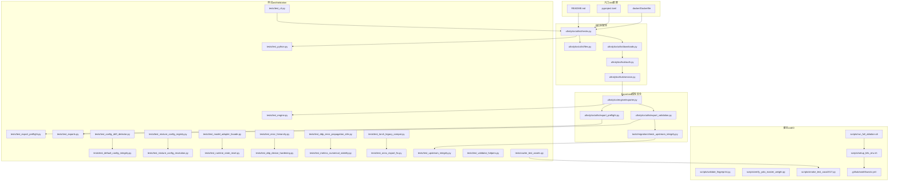
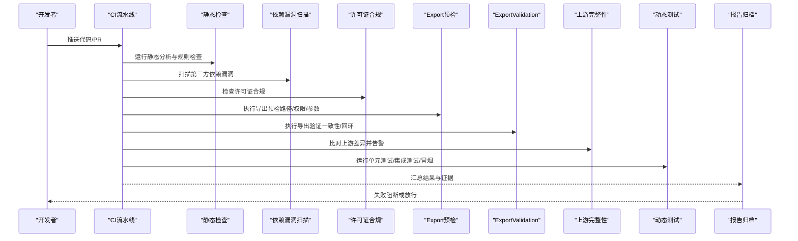
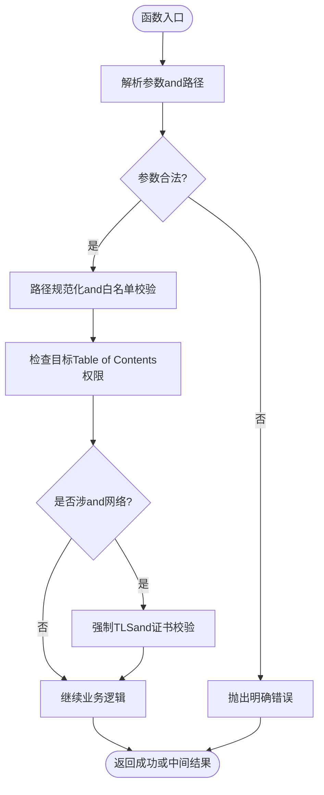
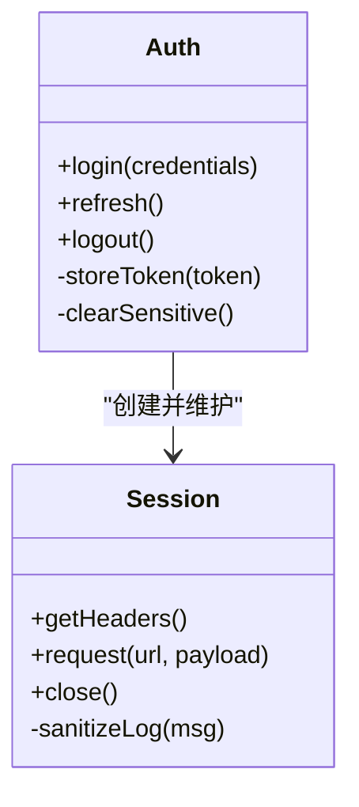
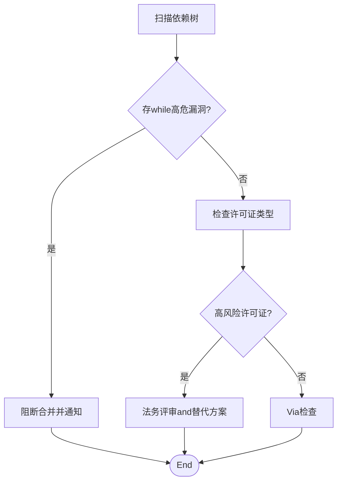
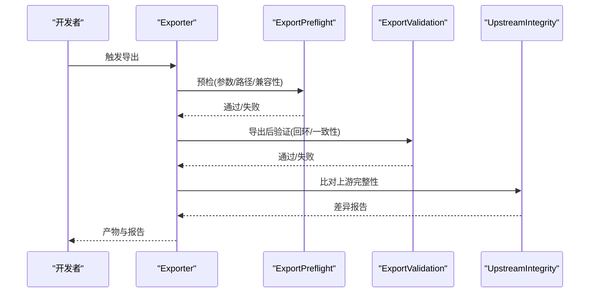
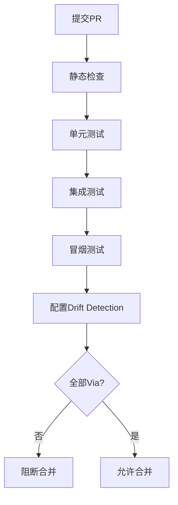
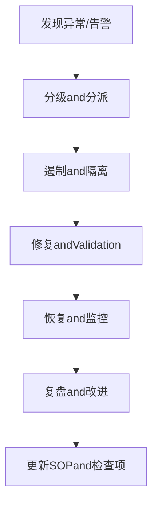
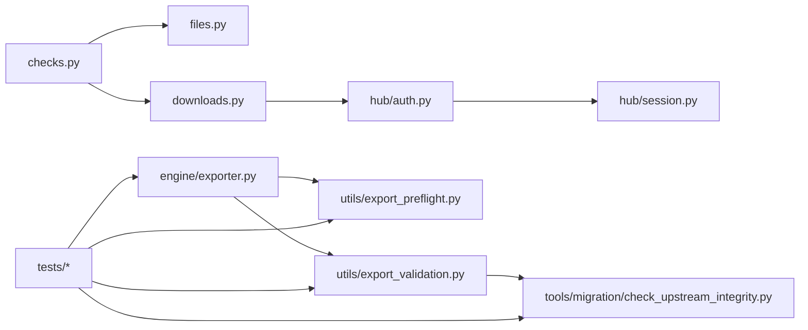

# 安全and合规检查

<cite>
**Files Referenced in This Document**
- [README.md](file://README.md)
- [CONTRIBUTING.md](file://CONTRIBUTING.md)
- [pyproject.toml](file://pyproject.toml)
- [docker/Dockerfile](file://docker/Dockerfile)
- [.github/workflows/ci.yml](file://.github/workflows/ci.yml)
- [ultralytics/utils/checks.py](file://ultralytics/utils/checks.py)
- [ultralytics/utils/files.py](file://ultralytics/utils/files.py)
- [ultralytics/utils/downloads.py](file://ultralytics/utils/downloads.py)
- [ultralytics/hub/auth.py](file://ultralytics/hub/auth.py)
- [ultralytics/hub/session.py](file://ultralytics/hub/session.py)
- [ultralytics/engine/exporter.py](file://ultralytics/engine/exporter.py)
- [ultralytics/utils/export_preflight.py](file://ultralytics/utils/export_preflight.py)
- [ultralytics/utils/export_validation.py](file://ultralytics/utils/export_validation.py)
- [tools/migration/check_upstream_integrity.py](file://tools/migration/check_upstream_integrity.py)
- [tests/test_export_preflight.py](file://tests/test_export_preflight.py)
- [tests/test_exports.py](file://tests/test_exports.py)
- [tests/test_engine.py](file://tests/test_engine.py)
- [tests/test_python.py](file://tests/test_python.py)
- [tests/test_cli.py](file://tests/test_cli.py)
- [tests/test_config_drift_detector.py](file://tests/test_config_drift_detector.py)
- [tests/test_default_config_integrity.py](file://tests/test_default_config_integrity.py)
- [tests/test_mixture_config_registry.py](file://tests/test_mixture_config_registry.py)
- [tests/test_mixture_config_resolution.py](file://tests/test_mixture_config_resolution.py)
- [tests/test_model_adapter_facade.py](file://tests/test_model_adapter_facade.py)
- [tests/test_runtime_state_reset.py](file://tests/test_runtime_state_reset.py)
- [tests/test_error_hierarchy.py](file://tests/test_error_hierarchy.py)
- [tests/test_ddp_device_hardening.py](file://tests/test_ddp_device_hardening.py)
- [tests/test_ddp_error_propagation_e2e.py](file://tests/test_ddp_error_propagation_e2e.py)
- [tests/test_metrics_numerical_stability.py](file://tests/test_metrics_numerical_stability.py)
- [tests/test_torch_legacy_compat.py](file://tests/test_torch_legacy_compat.py)
- [tests/test_onnx_export_fix.py](file://tests/test_onnx_export_fix.py)
- [tests/test_upstream_integrity.py](file://tests/test_upstream_integrity.py)
- [tests/test_validator_helpers.py](file://tests/test_validator_helpers.py)
- [tests/cache_test_assets.py](file://tests/cache_test_assets.py)
- [scripts/validate_fingerprint.py](file://scripts/validate_fingerprint.py)
- [scripts/verify_yolo_master_weight.py](file://scripts/verify_yolo_master_weight.py)
- [scripts/smoke_test_coco2017.py](file://scripts/smoke_test_coco2017.py)
- [scripts/run_full_ablation.sh](file://scripts/run_full_ablation.sh)
- [scripts/setup_k8s_env.sh](file://scripts/setup_k8s_env.sh)
- [docs/help/security.md](file://docs/help/security.md)
- [docs/help/privacy.md](file://docs/help/privacy.md)
</cite>

## Table of Contents
1. [Introduction](#Introduction)
2. [Project Structure](#Project Structure)
3. [Core Components](#Core Components)
4. [Architecture Overview](#Architecture Overview)
5. [Detailed Component Analysis](#Detailed Component Analysis)
6. [Dependency Analysis](#Dependency Analysis)
7. [Performance Considerations](#Performance Considerations)
8. [Troubleshooting Guide](#Troubleshooting Guide)
9. [Conclusion](#Conclusion)
10. [Appendix](#Appendix)

## Introduction
本指南targetingYOLO-Master新特性的安全and合规检查，覆盖代码安全审查标准、第三方依赖Evaluation、数据安全保护、模型安全、自动化合规流程and安全事件响应。DocumentationCentered on仓库现有implementingfor依据，Combining测试and工具链，给出可落地的检查清单and流程图示，帮助开发者while新增特性时同步完成安全and合规Validation。

## Project Structure
从安全视角看，本项目将输入校验、下载andExport预检、认证and会话管理、上游完整性校验etc.capabilities分散whileutils、hub、engine、toolsandtests中，并ViaCI脚本andExamples脚本串联forEnd-to-end pipeline。下图展示and安全相关的关键Modulesand交互关系。

Figure Source
- [README.md](file://README.md)
- [pyproject.toml](file://pyproject.toml)
- [docker/Dockerfile](file://docker/Dockerfile)
- [ultralytics/utils/checks.py](file://ultralytics/utils/checks.py)
- [ultralytics/utils/files.py](file://ultralytics/utils/files.py)
- [ultralytics/utils/downloads.py](file://ultralytics/utils/downloads.py)
- [ultralytics/hub/auth.py](file://ultralytics/hub/auth.py)
- [ultralytics/hub/session.py](file://ultralytics/hub/session.py)
- [ultralytics/engine/exporter.py](file://ultralytics/engine/exporter.py)
- [ultralytics/utils/export_preflight.py](file://ultralytics/utils/export_preflight.py)
- [ultralytics/utils/export_validation.py](file://ultralytics/utils/export_validation.py)
- [tools/migration/check_upstream_integrity.py](file://tools/migration/check_upstream_integrity.py)
- [tests/test_export_preflight.py](file://tests/test_export_preflight.py)
- [tests/test_exports.py](file://tests/test_exports.py)
- [tests/test_engine.py](file://tests/test_engine.py)
- [tests/test_python.py](file://tests/test_python.py)
- [tests/test_cli.py](file://tests/test_cli.py)
- [tests/test_config_drift_detector.py](file://tests/test_config_drift_detector.py)
- [tests/test_default_config_integrity.py](file://tests/test_default_config_integrity.py)
- [tests/test_mixture_configregistry.py](file://tests/test_mixture_config_registry.py)
- [tests/test_mixture_config_resolution.py](file://tests/test_mixture_config_resolution.py)
- [tests/test_model_adapter_facade.py](file://tests/test_model_adapter_facade.py)
- [tests/test_runtime_state_reset.py](file://tests/test_runtime_state_reset.py)
- [tests/test_error_hierarchy.py](file://tests/test_error_hierarchy.py)
- [tests/test_ddp_device_hardening.py](file://tests/test_ddp_device_hardening.py)
- [tests/test_ddp_error_propagation_e2e.py](file://tests/test_ddp_error_propagation_e2e.py)
- [tests/test_metrics_numerical_stability.py](file://tests/test_metrics_numerical_stability.py)
- [tests/test_torch_legacy_compat.py](file://tests/test_torch_legacy_compat.py)
- [tests/test_onnx_export_fix.py](file://tests/test_onnx_export_fix.py)
- [tests/test_upstream_integrity.py](file://tests/test_upstream_integrity.py)
- [tests/test_validator_helpers.py](file://tests/test_validator_helpers.py)
- [tests/cache_test_assets.py](file://tests/cache_test_assets.py)
- [scripts/validate_fingerprint.py](file://scripts/validate_fingerprint.py)
- [scripts/verify_yolo_master_weight.py](file://scripts/verify_yolo_master_weight.py)
- [scripts/smoke_test_coco2017.py](file://scripts/smoke_test_coco2017.py)
- [scripts/run_full_ablation.sh](file://scripts/run_full_ablation.sh)
- [scripts/setup_k8s_env.sh](file://scripts/setup_k8s_env.sh)
- [.github/workflows/ci.yml](file://.github/workflows/ci.yml)

Section Source
- [README.md](file://README.md)
- [pyproject.toml](file://pyproject.toml)
- [docker/Dockerfile](file://docker/Dockerfile)

## Core Components
- 输入and环境校验：集中式检查逻辑用于参数、路径、设备and版本一致性校验，是后续所有功能的安全前置条件。
- 文件and下载安全：对本地路径and远程资源进行合法性and完整性校验，避免任意路径访问and不可信下载。
- 认证and会话：统一处理平台鉴权and会话生命周期，确保敏感凭据最小暴露面。
- Exportand模型安全：Export前预检andExport后Validation，保障模型产物一致性and可追溯性。
- 上游完整性：对比上游变更，防止供应链污染and漂移。
- 测试and回归：围绕上述capabilities的单测and集成用例，形成自动化安全门禁。

Section Source
- [ultralytics/utils/checks.py](file://ultralytics/utils/checks.py)
- [ultralytics/utils/files.py](file://ultralytics/utils/files.py)
- [ultralytics/utils/downloads.py](file://ultralytics/utils/downloads.py)
- [ultralytics/hub/auth.py](file://ultralytics/hub/auth.py)
- [ultralytics/hub/session.py](file://ultralytics/hub/session.py)
- [ultralytics/engine/exporter.py](file://ultralytics/engine/exporter.py)
- [ultralytics/utils/export_preflight.py](file://ultralytics/utils/export_preflight.py)
- [ultralytics/utils/export_validation.py](file://ultralytics/utils/export_validation.py)
- [tools/migration/check_upstream_integrity.py](file://tools/migration/check_upstream_integrity.py)

## Architecture Overview
下图展示了“新特性提交”to“发布前”的端to端安全and合规流水线，涵盖静态检查、依赖扫描、许可证合规、Export预检、模型完整性校验and动态测试。

Figure Source
- [.github/workflows/ci.yml](file://.github/workflows/ci.yml)
- [ultralytics/utils/export_preflight.py](file://ultralytics/utils/export_preflight.py)
- [ultralytics/utils/export_validation.py](file://ultralytics/utils/export_validation.py)
- [tools/migration/check_upstream_integrity.py](file://tools/migration/check_upstream_integrity.py)
- [tests/test_export_preflight.py](file://tests/test_export_preflight.py)
- [tests/test_exports.py](file://tests/test_exports.py)
- [tests/test_upstream_integrity.py](file://tests/test_upstream_integrity.py)
- [tests/test_engine.py](file://tests/test_engine.py)
- [tests/test_python.py](file://tests/test_python.py)
- [tests/test_cli.py](file://tests/test_cli.py)

## Detailed Component Analysis

### 输入Validationand权限控制
- 输入Validation要点
  - 参数类型and取值范围校验，拒绝非法值and越界索引。
  - 路径规范化and白名单校验，禁止相对路径逃逸and符号链接滥用。
  - 设备and后端一致性检查，避免不兼容组合导致未定义行for。
- 权限控制要点
  - 仅授予必要文件系统读写权限，限制写入Table of Contents。
  - Network requestsUses受控代理and证书校验，禁用不安全协议。
  - 凭据Via会话层注入，不whileLoggingand错误信息中泄露。

Figure Source
- [ultralytics/utils/checks.py](file://ultralytics/utils/checks.py)
- [ultralytics/utils/files.py](file://ultralytics/utils/files.py)
- [ultralytics/utils/downloads.py](file://ultralytics/utils/downloads.py)

Section Source
- [ultralytics/utils/checks.py](file://ultralytics/utils/checks.py)
- [ultralytics/utils/files.py](file://ultralytics/utils/files.py)
- [ultralytics/utils/downloads.py](file://ultralytics/utils/downloads.py)

### 敏感信息保护and认证会话
- 认证and会话
  - 统一鉴权入口，避免散落的密钥硬编码。
  - 会话令牌最小化缓存and自动过期清理。
  - 错误消息脱敏，禁止打印完整URL或Token片段。
- 数据加密and隐私
  - 传输层强制HTTPS；存储层按需启用加密。
  - LoggingandMetrics采集默认关闭User标识andPII字段。

Figure Source
- [ultralytics/hub/auth.py](file://ultralytics/hub/auth.py)
- [ultralytics/hub/session.py](file://ultralytics/hub/session.py)

Section Source
- [ultralytics/hub/auth.py](file://ultralytics/hub/auth.py)
- [ultralytics/hub/session.py](file://ultralytics/hub/session.py)

### 第三方依赖安全Evaluation
- 漏洞扫描
  - whileCI中引入依赖漏洞扫描，阻断高危漏洞合并。
  - 锁定依赖版本，定期更新并回归Validation。
- 许可证合规
  - 生成依赖清单and许可证矩阵，识别强Copyleft风险。
  - 对不合规包建立豁免流程and替代方案。

Section Source
- [pyproject.toml](file://pyproject.toml)
- [.github/workflows/ci.yml](file://.github/workflows/ci.yml)

### 数据安全保护措施
- 数据加密
  - 传输：强制HTTPSand证书校验，禁用明文协议。
  - 存储：模型权重and数据集按策略加密，密钥由外部KMS管理。
- 访问控制
  - 基于角色的最小权限原则，区分Training、InferenceandExport角色。
  - 临时凭证and短期令牌，减少长期凭据暴露面。
- 隐私保护
  - Logging脱敏and采样上报，默认关闭敏感字段。
  - 数据去标识化处理，SupportingOptional匿名化管道。

Section Source
- [ultralytics/utils/downloads.py](file://ultralytics/utils/downloads.py)
- [ultralytics/hub/session.py](file://ultralytics/hub/session.py)

### 模型安全考虑
- 对抗攻击防护
  - Export前后增加鲁棒性Checkpoint，记录扰动边界and阈值。
  - Inference阶段加入输入裁剪and异常检测，降低恶意样本影响。
- 模型完整性Validation
  - Export预检：校验输入图、算子Supportingand输出形状约束。
  - ExportValidation：回环Inference对比，误差阈值判定。
  - 指纹校验：对关键权重and配置文件计算指纹，防止篡改。

Figure Source
- [ultralytics/engine/exporter.py](file://ultralytics/engine/exporter.py)
- [ultralytics/utils/export_preflight.py](file://ultralytics/utils/export_preflight.py)
- [ultralytics/utils/export_validation.py](file://ultralytics/utils/export_validation.py)
- [tools/migration/check_upstream_integrity.py](file://tools/migration/check_upstream_integrity.py)

Section Source
- [ultralytics/engine/exporter.py](file://ultralytics/engine/exporter.py)
- [ultralytics/utils/export_preflight.py](file://ultralytics/utils/export_preflight.py)
- [ultralytics/utils/export_validation.py](file://ultralytics/utils/export_validation.py)
- [tools/migration/check_upstream_integrity.py](file://tools/migration/check_upstream_integrity.py)

### 合规性检查的自动化流程
- 静态代码分析
  - whileCI中集成静态检查and规则集，拦截常见安全问题。
- 动态安全测试
  - 单元and集成测试覆盖Export、下载、认证and错误传播路径。
  - 冒烟测试Validation关键路径可用性。
- 配置Drift Detection
  - 默认配置完整性andRegistry一致性检查，防止漂移引入风险。

Figure Source
- [.github/workflows/ci.yml](file://.github/workflows/ci.yml)
- [tests/test_export_preflight.py](file://tests/test_export_preflight.py)
- [tests/test_exports.py](file://tests/test_exports.py)
- [tests/test_engine.py](file://tests/test_engine.py)
- [tests/test_python.py](file://tests/test_python.py)
- [tests/test_cli.py](file://tests/test_cli.py)
- [tests/test_config_drift_detector.py](file://tests/test_config_drift_detector.py)
- [tests/test_default_config_integrity.py](file://tests/test_default_config_integrity.py)
- [tests/test_mixture_config_registry.py](file://tests/test_mixture_config_registry.py)
- [tests/test_mixture_config_resolution.py](file://tests/test_mixture_config_resolution.py)

Section Source
- [.github/workflows/ci.yml](file://.github/workflows/ci.yml)
- [tests/test_export_preflight.py](file://tests/test_export_preflight.py)
- [tests/test_exports.py](file://tests/test_exports.py)
- [tests/test_engine.py](file://tests/test_engine.py)
- [tests/test_python.py](file://tests/test_python.py)
- [tests/test_cli.py](file://tests/test_cli.py)
- [tests/test_config_drift_detector.py](file://tests/test_config_drift_detector.py)
- [tests/test_default_config_integrity.py](file://tests/test_default_config_integrity.py)
- [tests/test_mixture_config_registry.py](file://tests/test_mixture_config_registry.py)
- [tests/test_mixture_config_resolution.py](file://tests/test_mixture_config_resolution.py)

### 安全事件响应and处理流程
- 发现and分级
  - 依据影响范围and可利用性进行分级，确定响应优先级。
- 遏制and修复
  - 快速回滚或热修复，隔离受影响服务and凭据。
- 取证and复盘
  - 收集Logging、制品and变更记录，定位根因并完善防护。
- 通告and改进
  - 对内对外发布通告，更新SOPand自动化检查项。

[此图for概念流程，无需Figure Source]

## Dependency Analysis
- 组件耦合and内聚
  - checks/files/downloads构成输入andIO安全基座，被exporterandhub复用。
  - export_preflightandexport_validation围绕Export链路形成闭环。
  - upstream integrity独立于业务，provides供应链安全保障。
- 直接/间接依赖
  - hub.auth/session依赖网络and凭据管理，被上层Calls方透明Uses。
  - tests广泛覆盖各Modules，形成回归护栏。
- External Dependenciesand集成点
  - 平台Hub接口、远程模型and数据集源、Container Images构建。
- 接口契约andimplementing细节
  - Export预检/Validation接口需稳定，保证下游工具链可预期。

Figure Source
- [ultralytics/utils/checks.py](file://ultralytics/utils/checks.py)
- [ultralytics/utils/files.py](file://ultralytics/utils/files.py)
- [ultralytics/utils/downloads.py](file://ultralytics/utils/downloads.py)
- [ultralytics/hub/auth.py](file://ultralytics/hub/auth.py)
- [ultralytics/hub/session.py](file://ultralytics/hub/session.py)
- [ultralytics/engine/exporter.py](file://ultralytics/engine/exporter.py)
- [ultralytics/utils/export_preflight.py](file://ultralytics/utils/export_preflight.py)
- [ultralytics/utils/export_validation.py](file://ultralytics/utils/export_validation.py)
- [tools/migration/check_upstream_integrity.py](file://tools/migration/check_upstream_integrity.py)
- [tests/test_export_preflight.py](file://tests/test_export_preflight.py)
- [tests/test_exports.py](file://tests/test_exports.py)
- [tests/test_upstream_integrity.py](file://tests/test_upstream_integrity.py)

Section Source
- [ultralytics/utils/checks.py](file://ultralytics/utils/checks.py)
- [ultralytics/utils/files.py](file://ultralytics/utils/files.py)
- [ultralytics/utils/downloads.py](file://ultralytics/utils/downloads.py)
- [ultralytics/hub/auth.py](file://ultralytics/hub/auth.py)
- [ultralytics/hub/session.py](file://ultralytics/hub/session.py)
- [ultralytics/engine/exporter.py](file://ultralytics/engine/exporter.py)
- [ultralytics/utils/export_preflight.py](file://ultralytics/utils/export_preflight.py)
- [ultralytics/utils/export_validation.py](file://ultralytics/utils/export_validation.py)
- [tools/migration/check_upstream_integrity.py](file://tools/migration/check_upstream_integrity.py)
- [tests/test_export_preflight.py](file://tests/test_export_preflight.py)
- [tests/test_exports.py](file://tests/test_exports.py)
- [tests/test_upstream_integrity.py](file://tests/test_upstream_integrity.py)

## Performance Considerations
- Export预检andValidation应增量执行，避免全量重算。
- 并发下载and校验需限速and重试退避，防止拥塞。
- LoggingandMetrics采集默认低开销模式，生产环境按需开启。

[本节for通用指导，无需Section Source]

## Troubleshooting Guide
- 常见问题定位
  - Export Failure：优先查看预检andValidationLogging，确认路径、权限and兼容性。
  - 下载异常：检查网络可达、证书and代理设置。
  - 认证失败：核对会话状态and凭据有效期。
  - 上游差异：根据完整性报告定位变更点并Evaluation风险。
- 调试建议
  - 开启详细Logging但确保脱敏。
  - Uses最小复现用例and固定种子，便于回归。
  - 利用冒烟脚本快速Validation关键路径。

Section Source
- [tests/test_export_preflight.py](file://tests/test_export_preflight.py)
- [tests/test_exports.py](file://tests/test_exports.py)
- [tests/test_engine.py](file://tests/test_engine.py)
- [tests/test_python.py](file://tests/test_python.py)
- [tests/test_cli.py](file://tests/test_cli.py)
- [tests/test_error_hierarchy.py](file://tests/test_error_hierarchy.py)
- [tests/test_runtime_state_reset.py](file://tests/test_runtime_state_reset.py)
- [tests/test_ddp_device_hardening.py](file://tests/test_ddp_device_hardening.py)
- [tests/test_ddp_error_propagation_e2e.py](file://tests/test_ddp_error_propagation_e2e.py)
- [tests/test_metrics_numerical_stability.py](file://tests/test_metrics_numerical_stability.py)
- [tests/test_torch_legacy_compat.py](file://tests/test_torch_legacy_compat.py)
- [tests/test_onnx_export_fix.py](file://tests/test_onnx_export_fix.py)
- [tests/test_upstream_integrity.py](file://tests/test_upstream_integrity.py)
- [tests/test_validator_helpers.py](file://tests/test_validator_helpers.py)
- [tests/cache_test_assets.py](file://tests/cache_test_assets.py)
- [scripts/validate_fingerprint.py](file://scripts/validate_fingerprint.py)
- [scripts/verify_yolo_master_weight.py](file://scripts/verify_yolo_master_weight.py)
- [scripts/smoke_test_coco2017.py](file://scripts/smoke_test_coco2017.py)

## Conclusion
Via将输入校验、凭据管理、Export预检/Validationand上游完整性纳入统一的自动化流水线，YOLO-Master可while新增特性时有效降低安全风险and合规隐患。建议while每次重大改动中补充对应测试and检查项，持续完善安全基线。

[本节for总结，无需Section Source]

## Appendix
- Refer toDocumentation
  - 安全and隐私政策说明
- 实践清单
  - 新增特性必须包含：输入校验用例、Export预检/Validation用例、依赖and许可证检查、错误路径andLogging脱敏Validation。

Section Source
- [docs/help/security.md](file://docs/help/security.md)
- [docs/help/privacy.md](file://docs/help/privacy.md)