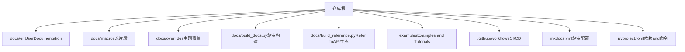
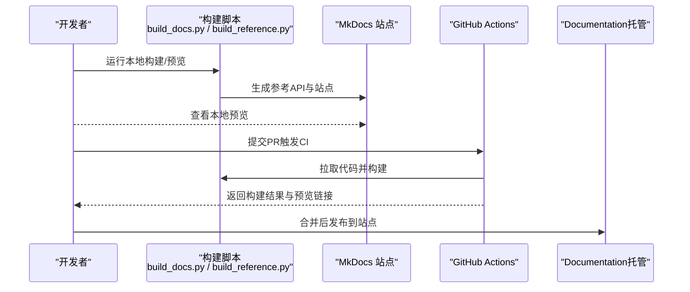
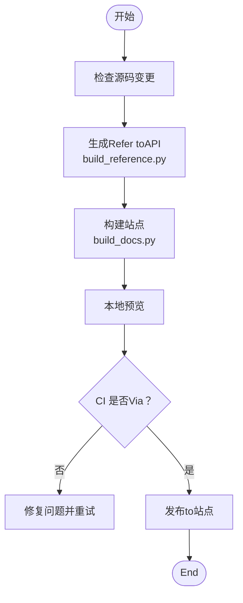
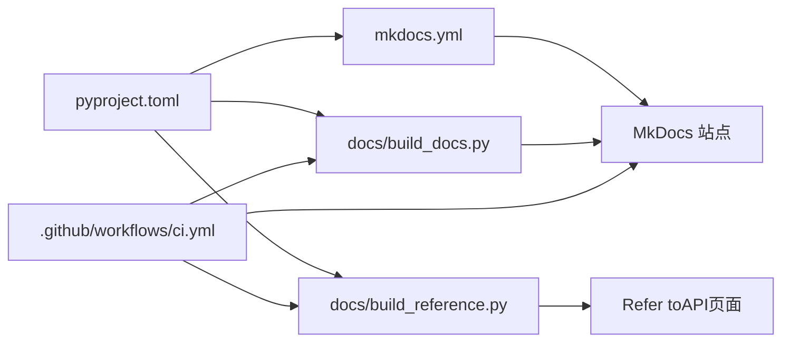

# Documentation编写and发布

<cite>
**Files Referenced in This Document**
- [mkdocs.yml](file://mkdocs.yml)
- [docs/build_docs.py](file://docs/build_docs.py)
- [docs/build_reference.py](file://docs/build_reference.py)
- [docs/README.md](file://docs/README.md)
- [CONTRIBUTING.md](file://CONTRIBUTING.md)
- [pyproject.toml](file://pyproject.toml)
- [.github/workflows/ci.yml](file://.github/workflows/ci.yml)
- [examples/README.md](file://examples/README.md)
- [examples/tutorial.ipynb](file://examples/tutorial.ipynb)
- [examples/hub.ipynb](file://examples/hub.ipynb)
- [examples/object_counting.ipynb](file://examples/object_counting.ipynb)
- [examples/object_tracking.ipynb](file://examples/object_tracking.ipynb)
- [examples/heatmaps.ipynb](file://examples/heatmaps.ipynb)
- [docs/en/index.md](file://docs/en/index.md)
- [docs/en/quickstart.md](file://docs/en/quickstart.md)
- [docs/en/help/contributing.md](file://docs/en/help/contributing.md)
- [docs/en/guides/yolo-common-issues.md](file://docs/en/guides/yolo-common-issues.md)
- [docs/en/reference/__init__.md](file://docs/en/reference/__init__.md)
- [docs/en/modes/index.md](file://docs/en/modes/index.md)
- [docs/en/models/index.md](file://docs/en/models/index.md)
- [docs/en/integrations/index.md](file://docs/en/integrations/index.md)
- [docs/en/platform/index.md](file://docs/en/platform/index.md)
- [docs/en/datasets/index.md](file://docs/en/datasets/index.md)
- [docs/en/solutions/index.md](file://docs/en/solutions/index.md)
- [docs/en/tasks/index.md](file://docs/en/tasks/index.md)
- [docs/en/usage/index.md](file://docs/en/usage/index.md)
- [docs/en/inference/index.md](file://docs/en/inference/index.md)
- [docs/en/hub/index.md](file://docs/en/hub/index.md)
- [docs/en/platform/api/index.md](file://docs/en/platform/api/index.md)
- [docs/en/reference/engine/index.md](file://docs/en/reference/engine/index.md)
- [docs/en/reference/models/index.md](file://docs/en/reference/models/index.md)
- [docs/en/reference/utils/index.md](file://docs/en/reference/utils/index.md)
- [docs/en/reference/data/index.md](file://docs/en/reference/data/index.md)
- [docs/en/reference/nn/index.md](file://docs/en/reference/nn/index.md)
- [docs/en/reference/optim/index.md](file://docs/en/reference/optim/index.md)
- [docs/en/reference/solutions/index.md](file://docs/en/reference/solutions/index.md)
- [docs/en/reference/trackers/index.md](file://docs/en/reference/trackers/index.md)
- [docs/en/reference/cfg/index.md](file://docs/en/reference/cfg/index.md)
- [docs/en/reference/hub/index.md](file://docs/en/reference/hub/index.md)
</cite>

## Table of Contents
1. [Introduction](#Introduction)
2. [Project Structure](#Project Structure)
3. [Core Components](#Core Components)
4. [Architecture Overview](#Architecture Overview)
5. [Detailed Component Analysis](#Detailed Component Analysis)
6. [Dependency Analysis](#Dependency Analysis)
7. [Performance Considerations](#Performance Considerations)
8. [故障排除指南](#故障排除指南)
9. [Conclusion](#Conclusion)
10. [Appendix](#Appendix)

## Introduction
本指南targetingYOLO-Master项目的贡献者and维护者，系统化说明UserDocumentation、开发者Documentation、Examples代码的编写and维护规范，Centered onand版本发布流程and自动化Documentation工具链。目标是确保Documentation质量一致、可追溯、可构建、可部署，并建立社区反馈收集and处理机制，提升整体可用性and协作效率。

## Project Structure
本项目采用多语言Documentation组织方式：英文Documentation位于 docs/en，根级 README provides中文入口；Refer toDocumentation由脚本从源码自动抽取生成；Examples代码集中于 examples；Documentation站点Via MkDocs 构建and部署；CI 工作流负责构建and预览。

Figure Source
- [mkdocs.yml](file://mkdocs.yml)
- [docs/build_docs.py](file://docs/build_docs.py)
- [docs/build_reference.py](file://docs/build_reference.py)
- [examples/README.md](file://examples/README.md)
- [pyproject.toml](file://pyproject.toml)

Section Source
- [docs/README.md](file://docs/README.md)
- [mkdocs.yml](file://mkdocs.yml)
- [pyproject.toml](file://pyproject.toml)

## Core Components
- Documentation站点and导航
  - 站点入口and导航定义while mkdocs.yml，包含首页、Quick Start、模式、模型、集成、平台、数据集、解决方案、Tasks、用法、Inference、Hub etc.Modules索引。
  - Refer to API Documentation由 docs/build_reference.py 自动生成，按 engine、models、utils、data、nn、optim、solutions、trackers、cfg、hub etc.子包组织。
- 构建andRefer to生成
  - docs/build_docs.py 负责站点构建and本地预览；docs/build_reference.py 负责从源码提取 docstring 生成Refer to页面。
- Examples and Tutorials
  - examples 下provides可运行的 Python and Notebook Examples，包括 tutorial.ipynb、object_counting.ipynb、object_tracking.ipynb、heatmaps.ipynb、hub.ipynb etc.。
- CI and发布
  - .github/workflows/ci.yml 用于Documentation构建and检查；发布流程Combining变更Logging、向后兼容性检查and标记。

Section Source
- [mkdocs.yml](file://mkdocs.yml)
- [docs/build_docs.py](file://docs/build_docs.py)
- [docs/build_reference.py](file://docs/build_reference.py)
- [examples/README.md](file://examples/README.md)
- [examples/tutorial.ipynb](file://examples/tutorial.ipynb)
- [examples/hub.ipynb](file://examples/hub.ipynb)
- [examples/object_counting.ipynb](file://examples/object_counting.ipynb)
- [examples/object_tracking.ipynb](file://examples/object_tracking.ipynb)
- [examples/heatmaps.ipynb](file://examples/heatmaps.ipynb)
- [.github/workflows/ci.yml](file://.github/workflows/ci.yml)

## Architecture Overview
Documentation系统采用“源码drivers are installed + 静态站点”的架构：源码中的 docstring and Markdown 内容共同构成Documentation；构建阶段生成Refer to API 页面并组装for MkDocs 站点；CI 执行构建and预览；发布时更新变更Logging并进行兼容性校验。

Figure Source
- [docs/build_docs.py](file://docs/build_docs.py)
- [docs/build_reference.py](file://docs/build_reference.py)
- [mkdocs.yml](file://mkdocs.yml)
- [.github/workflows/ci.yml](file://.github/workflows/ci.yml)

## Detailed Component Analysis

### UserDocumentation编写规范
- 结构and组织
  - 首页and导航：docs/en/index.md、docs/en/quickstart.md 作for入口and快速上手。
  - 模式andTasks：docs/en/modes/index.md、docs/en/tasks/index.md 描述Training、Validation、Prediction、Tracking、Exportetc.模式。
  - 模型and集成：docs/en/models/index.md、docs/en/integrations/index.md provides模型and第三方集成说明。
  - 平台and数据：docs/en/platform/index.md、docs/en/datasets/index.md 涵盖平台capabilitiesand数据集格式。
  - 解决方案andInference：docs/en/solutions/index.md、docs/en/inference/index.md 展示端to端方案andInference实践。
  - Uses指南：docs/en/usage/index.md 汇总常用用法and最佳实践。
- 写作要求
  - 每个功能点需包含：目标、前置条件、步骤、输出、常见问题。
  - 配图and表格应标注来源and用途，避免冗余。
  - 术语统一，首次出现给出定义或链接。
- API Documentation
  - Refer to页面由 docs/build_reference.py 自动生成，保持函数/类 docstring 完整、参数类型清晰、返回值说明明确。
  - 新增接口需while docs/en/reference 对应子Table of Contents补充索引页（such as engine、models、utils etc.）。
- 教程Examples
  - 教程Centered on Notebook for主，遵循可复现原则：固定随机种子、记录环境、provides最小数据集。
  - Examples需附带 requirements and环境说明，确保一键运行。
- 故障排除指南
  - 常见错误分类：环境、数据、Training、Export、部署。
  - 每个问题provides症状、原因定位、解决步骤and相关Refer to链接。

Section Source
- [docs/en/index.md](file://docs/en/index.md)
- [docs/en/quickstart.md](file://docs/en/quickstart.md)
- [docs/en/modes/index.md](file://docs/en/modes/index.md)
- [docs/en/models/index.md](file://docs/en/models/index.md)
- [docs/en/integrations/index.md](file://docs/en/integrations/index.md)
- [docs/en/platform/index.md](file://docs/en/platform/index.md)
- [docs/en/datasets/index.md](file://docs/en/datasets/index.md)
- [docs/en/solutions/index.md](file://docs/en/solutions/index.md)
- [docs/en/tasks/index.md](file://docs/en/tasks/index.md)
- [docs/en/usage/index.md](file://docs/en/usage/index.md)
- [docs/en/inference/index.md](file://docs/en/inference/index.md)
- [docs/en/hub/index.md](file://docs/en/hub/index.md)
- [docs/en/reference/__init__.md](file://docs/en/reference/__init__.md)
- [docs/en/reference/engine/index.md](file://docs/en/reference/engine/index.md)
- [docs/en/reference/models/index.md](file://docs/en/reference/models/index.md)
- [docs/en/reference/utils/index.md](file://docs/en/reference/utils/index.md)
- [docs/en/reference/data/index.md](file://docs/en/reference/data/index.md)
- [docs/en/reference/nn/index.md](file://docs/en/reference/nn/index.md)
- [docs/en/reference/optim/index.md](file://docs/en/reference/optim/index.md)
- [docs/en/reference/solutions/index.md](file://docs/en/reference/solutions/index.md)
- [docs/en/reference/trackers/index.md](file://docs/en/reference/trackers/index.md)
- [docs/en/reference/cfg/index.md](file://docs/en/reference/cfg/index.md)
- [docs/en/reference/hub/index.md](file://docs/en/reference/hub/index.md)
- [docs/en/guides/yolo-common-issues.md](file://docs/en/guides/yolo-common-issues.md)

### 开发者Documentation要求
- 代码注释
  - 公共接口必须包含完整的 docstring：目的、参数、返回值、异常、Examples路径。
  - 复杂逻辑添加行内注释，解释关键分支and边界条件。
- 架构说明
  - 新增Modules需provides设计Documentation：背景、目标、约束、替代方案、决策依据。
  - 架构图and流程图置于 docs/plans 或 wiki，并while PR 中引用。
- 设计决策记录
  - 变更记录于 docs/governance 或 plans，包含日期、影响范围、回滚策略。
  - 重大变更需进行兼容性Evaluationand回归测试。

Section Source
- [CONTRIBUTING.md](file://CONTRIBUTING.md)
- [docs/en/help/contributing.md](file://docs/en/help/contributing.md)

### Examples代码维护方法
- 可运行Examples
  - 每个ExamplesTable of Contents包含 README 说明目标、环境and运行步骤。
  - Notebook Examples需保证可重复执行，必要时provides缓存或下载脚本。
- 更新流程
  - 修改Examples后，本地ValidationVia再提交 PR；CI 会检查构建and基本运行。
  - Examples依赖变更需同步更新 requirements 或 pyproject 配置。
- Examples索引
  - examples/README.md provides分类and导航，便于查找and学习。

Section Source
- [examples/README.md](file://examples/README.md)
- [examples/tutorial.ipynb](file://examples/tutorial.ipynb)
- [examples/hub.ipynb](file://examples/hub.ipynb)
- [examples/object_counting.ipynb](file://examples/object_counting.ipynb)
- [examples/object_tracking.ipynb](file://examples/object_tracking.ipynb)
- [examples/heatmaps.ipynb](file://examples/heatmaps.ipynb)

### 版本发布流程
- 变更Logging
  - 每次特性或修复需记录变更摘要、影响范围、Migration指引。
  - 变更Logging应and代码提交关联，便于回溯。
- 向后兼容性检查
  - 对公开 API and配置文件进行兼容性矩阵Evaluation，避免破坏性变更。
  - 若存while破坏性变更，providesMigration脚本and升级指南。
- 发布标记
  - Uses语义化版本标签，Combined with CI 构建Documentation站点andExamples产物。
  - 发布前完成全量构建、Examples运行and回归测试。

Section Source
- [CONTRIBUTING.md](file://CONTRIBUTING.md)
- [docs/en/help/contributing.md](file://docs/en/help/contributing.md)

### Documentation自动化工具链
- 构建and预览
  - Uses docs/build_docs.py 进行本地构建and预览，确保站点渲染正确。
  - Uses docs/build_reference.py 生成Refer to API 页面，保持and源码同步。
- 站点配置
  - mkdocs.yml 定义站点元信息、导航、插件and主题覆盖。
- 依赖管理
  - pyproject.toml 声明构建andDocumentation依赖，统一开发环境。
- CI 流水线
  - .github/workflows/ci.yml while PR and合并时触发Documentation构建and检查，provides预览链接。

Figure Source
- [docs/build_docs.py](file://docs/build_docs.py)
- [docs/build_reference.py](file://docs/build_reference.py)
- [mkdocs.yml](file://mkdocs.yml)
- [pyproject.toml](file://pyproject.toml)
- [.github/workflows/ci.yml](file://.github/workflows/ci.yml)

### 社区反馈收集and处理机制
- 收集渠道
  - GitHub Issues、讨论区、Pull Requests 评论。
  - Documentation站点底部反馈表单或链接。
- 分类and优先级
  - 将反馈分for：Documentation错误、功能缺失、体验改进、安全and合规。
  - 根据影响面and频率设定优先级。
- 处理流程
  - 确认问题、复现步骤、提出修复方案、评审and合并、发布说明。
  - 定期回顾未决反馈，形成迭代计划。

Section Source
- [CONTRIBUTING.md](file://CONTRIBUTING.md)
- [docs/en/help/contributing.md](file://docs/en/help/contributing.md)

## Dependency Analysis
Documentation系统and构建依赖关系such as下：

Figure Source
- [pyproject.toml](file://pyproject.toml)
- [mkdocs.yml](file://mkdocs.yml)
- [docs/build_docs.py](file://docs/build_docs.py)
- [docs/build_reference.py](file://docs/build_reference.py)
- [.github/workflows/ci.yml](file://.github/workflows/ci.yml)

Section Source
- [pyproject.toml](file://pyproject.toml)
- [mkdocs.yml](file://mkdocs.yml)
- [docs/build_docs.py](file://docs/build_docs.py)
- [docs/build_reference.py](file://docs/build_reference.py)
- [.github/workflows/ci.yml](file://.github/workflows/ci.yml)

## Performance Considerations
- 构建性能
  - 增量构建：仅重建变更页面，减少etc.待时间。
  - 并行生成：Refer to API and站点构建尽量并行执行。
- 资源占用
  - 控制Examples数据大小，Uses轻量数据集或缓存。
  - 限制 Notebook 执行时间and内存上限，避免 CI 超时。
- 缓存策略
  - 复用虚拟环境and依赖缓存，缩短构建周期。
  - 对大型模型权重and数据集provides预下载and校验。

## 故障排除指南
- 构建失败
  - 检查依赖安装and版本一致性；确认 mkdocs.yml 配置无误。
  - Refer to API 生成失败时，核对 docstring and导入路径。
- 预览异常
  - 清理缓存并重新构建；检查主题覆盖and样式冲突。
- Examples无法运行
  - Validation环境依赖and设备可用性；检查数据路径and权限。
- 常见问题
  - Refer to docs/en/guides/yolo-common-issues.md 获取常见错误and解决方案。

Section Source
- [docs/en/guides/yolo-common-issues.md](file://docs/en/guides/yolo-common-issues.md)

## Conclusion
through a unifiedDocumentation规范、自动化构建and发布流程、严格的兼容性检查and社区反馈机制，YOLO-Master 的Documentation体系能够持续provides高质量、可维护、可扩展usersand开发者体验。建议while新特性引入时同步更新DocumentationandExamples，确保Documentationand代码保持一致。

## Appendix
- Quick Start
  - 本地构建：运行 docs/build_docs.py 启动预览。
  - 生成Refer to：运行 docs/build_reference.py 更新 API 页面。
  - 提交 PR：触发 CI 构建and检查，获得预览链接。
- Refer to索引
  - 模式：docs/en/modes/index.md
  - 模型：docs/en/models/index.md
  - 集成：docs/en/integrations/index.md
  - 平台：docs/en/platform/index.md
  - 数据集：docs/en/datasets/index.md
  - 解决方案：docs/en/solutions/index.md
  - Tasks：docs/en/tasks/index.md
  - 用法：docs/en/usage/index.md
  - Inference：docs/en/inference/index.md
  - Hub：docs/en/hub/index.md
  - Refer to API：docs/en/reference/*