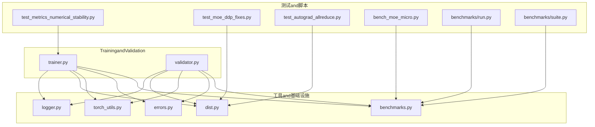
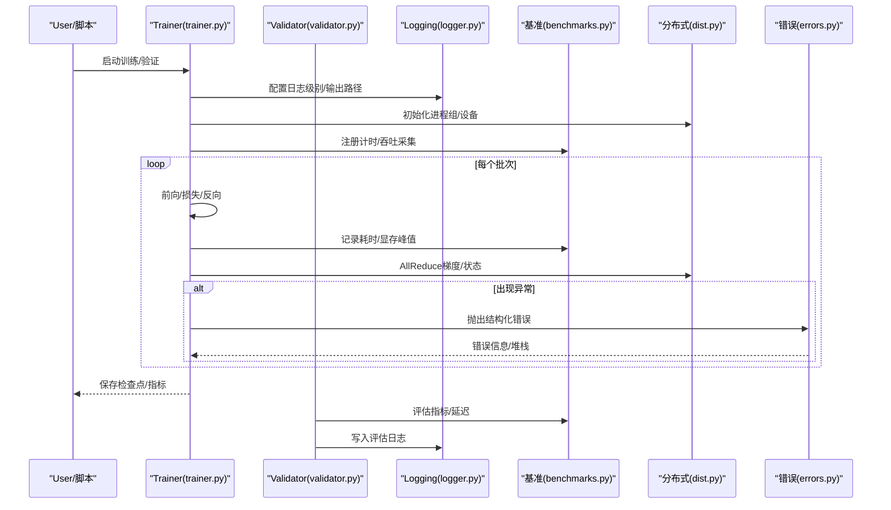
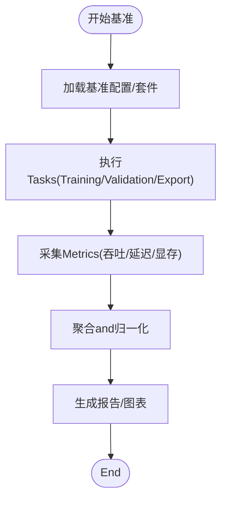
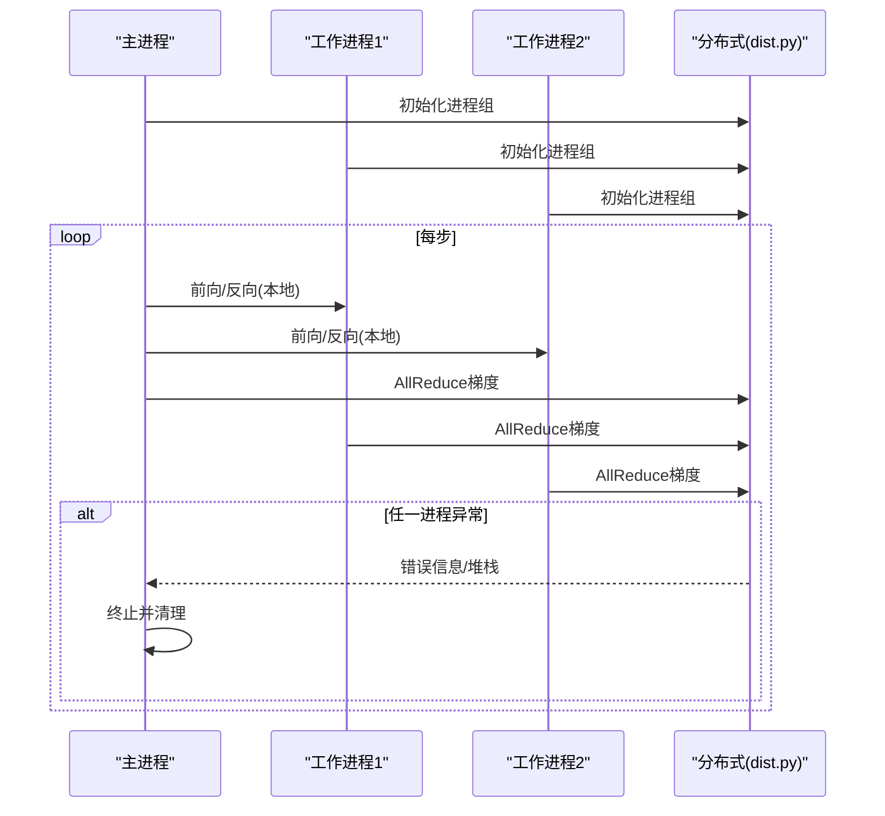
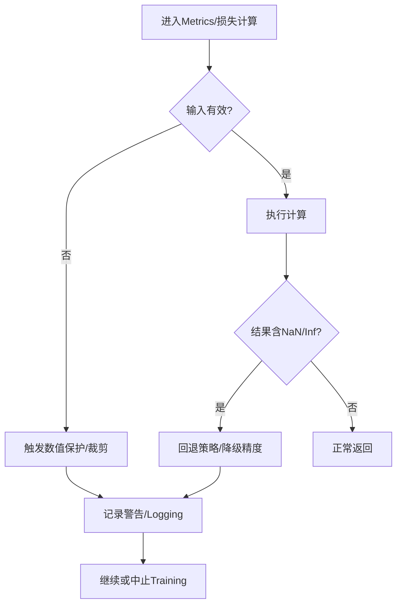
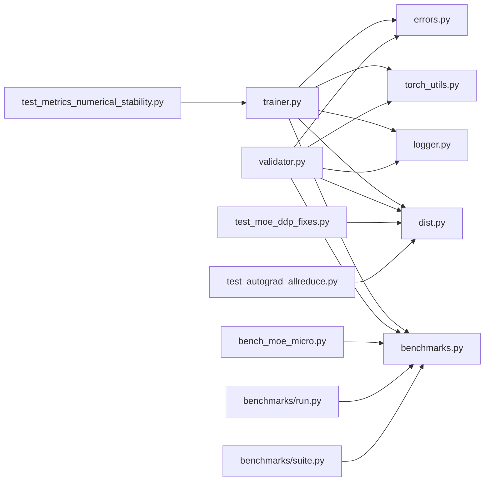

# 调试and性能分析

<cite>
**Files Referenced in This Document**
- [README.md](file://README.md)
- [pyproject.toml](file://pyproject.toml)
- [ultralytics/utils/logger.py](file://ultralytics/utils/logger.py)
- [ultralytics/utils/benchmarks.py](file://ultralytics/utils/benchmarks.py)
- [ultralytics/engine/trainer.py](file://ultralytics/engine/trainer.py)
- [ultralytics/engine/validator.py](file://ultralytics/engine/validator.py)
- [ultralytics/utils/dist.py](file://ultralytics/utils/dist.py)
- [ultralytics/utils/torch_utils.py](file://ultralytics/utils/torch_utils.py)
- [ultralytics/utils/errors.py](file://ultralytics/utils/errors.py)
- [tests/test_metrics_numerical_stability.py](file://tests/test_metrics_numerical_stability.py)
- [tests/test_moe_ddp_fixes.py](file://tests/test_moe_ddp_fixes.py)
- [tests/test_autograd_allreduce.py](file://tests/test_autograd_allreduce.py)
- [scripts/bench_moe_micro.py](file://scripts/bench_moe_micro.py)
- [benchmarks/run.py](file://benchmarks/run.py)
- [benchmarks/suite.py](file://benchmarks/suite.py)
</cite>

## Table of Contents
1. [Introduction](#Introduction)
2. [Project Structure](#Project Structure)
3. [Core Components](#Core Components)
4. [Architecture Overview](#Architecture Overview)
5. [Detailed Component Analysis](#Detailed Component Analysis)
6. [Dependency Analysis](#Dependency Analysis)
7. [性能考量](#性能考量)
8. [Troubleshooting Guide](#Troubleshooting Guide)
9. [Conclusion](#Conclusion)
10. [Appendix](#Appendix)

## Introduction
本指南targetingYOLO-Master新特性的调试and性能分析，覆盖Logging、断点调试、错误追踪、内存andGPU利用率监控、计算bottlenecks识别、数值稳定性问题（such asNaN/Inf）、Gradient消失检测、内存泄漏定位、Distributed Training（多进程通信and同步）的排障方法，Centered onand性能Optimization最佳实践and性能报告生成and分析流程。DocumentationCentered on仓库现有implementingfor依据，provides可操作的步骤andVisualization流程图，帮助读者快速定位问题并提升Training/Inference效率。

## Project Structure
围绕调试and性能分析，本项目whileCentered on下位置provides了关键capabilities：
- Loggingand事件：统一Logging工具andTraining/Validation回调集成
- 基准and评测：Built-inBenchmark Suiteand微基准脚本
- 分布式：DDP通信、AllReduce、设备and进程管理
- 数值稳定and错误处理：异常层次、数值稳定性测试
- Examplesand脚本：MoE微基准、端to端基准运行入口

Figure Source
- [ultralytics/engine/trainer.py](file://ultralytics/engine/trainer.py)
- [ultralytics/engine/validator.py](file://ultralytics/engine/validator.py)
- [ultralytics/utils/logger.py](file://ultralytics/utils/logger.py)
- [ultralytics/utils/benchmarks.py](file://ultralytics/utils/benchmarks.py)
- [ultralytics/utils/dist.py](file://ultralytics/utils/dist.py)
- [ultralytics/utils/torch_utils.py](file://ultralytics/utils/torch_utils.py)
- [ultralytics/utils/errors.py](file://ultralytics/utils/errors.py)
- [tests/test_metrics_numerical_stability.py](file://tests/test_metrics_numerical_stability.py)
- [tests/test_moe_ddp_fixes.py](file://tests/test_moe_ddp_fixes.py)
- [tests/test_autograd_allreduce.py](file://tests/test_autograd_allreduce.py)
- [scripts/bench_moe_micro.py](file://scripts/bench_moe_micro.py)
- [benchmarks/run.py](file://benchmarks/run.py)
- [benchmarks/suite.py](file://benchmarks/suite.py)

Section Source
- [README.md](file://README.md)
- [pyproject.toml](file://pyproject.toml)

## Core Components
- Logging系统：集中式Logging输出，Supporting分级、格式化andTraining/Validation阶段的事件上报，便于断点前后上下文复现and结果回溯。
- 基准and评测：统一的基准运行器and套件定义，Supporting吞吐/延迟统计、Metrics汇总and报告生成。
- 分布式通信：Encapsulates进程组初始化、AllReduce、广播etc.集合通信原语，providesTraining/Validation中的跨进程同步and错误传播。
- 数值稳定性and错误处理：异常层次化、数值检查and诊断辅助，Combined with单元测试覆盖常见不稳定场景。
- 微基准and端to端基准：针对MoEetc.Modules的微基准and完整基准流水线，用于定位热点and回归。

Section Source
- [ultralytics/utils/logger.py](file://ultralytics/utils/logger.py)
- [ultralytics/utils/benchmarks.py](file://ultralytics/utils/benchmarks.py)
- [ultralytics/utils/dist.py](file://ultralytics/utils/dist.py)
- [ultralytics/utils/torch_utils.py](file://ultralytics/utils/torch_utils.py)
- [ultralytics/utils/errors.py](file://ultralytics/utils/errors.py)
- [tests/test_metrics_numerical_stability.py](file://tests/test_metrics_numerical_stability.py)
- [tests/test_moe_ddp_fixes.py](file://tests/test_moe_ddp_fixes.py)
- [tests/test_autograd_allreduce.py](file://tests/test_autograd_allreduce.py)
- [scripts/bench_moe_micro.py](file://scripts/bench_moe_micro.py)
- [benchmarks/run.py](file://benchmarks/run.py)
- [benchmarks/suite.py](file://benchmarks/suite.py)

## Architecture Overview
下图展示Training/Validation主流程and调试/性能工具的集成点：Training循环CallsLoggingand基准接口；分布式层负责进程间通信；错误处理贯穿全链路；数值稳定性测试and微基准作for质量门禁。

Figure Source
- [ultralytics/engine/trainer.py](file://ultralytics/engine/trainer.py)
- [ultralytics/engine/validator.py](file://ultralytics/engine/validator.py)
- [ultralytics/utils/logger.py](file://ultralytics/utils/logger.py)
- [ultralytics/utils/benchmarks.py](file://ultralytics/utils/benchmarks.py)
- [ultralytics/utils/dist.py](file://ultralytics/utils/dist.py)
- [ultralytics/utils/errors.py](file://ultralytics/utils/errors.py)

## Detailed Component Analysis

### Logging系统and断点调试
- Loggingetc.级and输出：Via统一Logging接口设置级别、目标（控制台/文件），whileTraining/Validation的关键节点输出上下文信息，便于断点前后对比。
- 断点调试建议：
  - whileTraining循环的前向/损失/反向处插入断点，CombiningLogging查看输入张量形状、dtypeand范围。
  - Uses分布式时，确保仅while主进程打印关键信息，避免刷屏干扰。
  - 将随机种子、超参、Data Loading参数一并写入Logging，提高复现性。
- 事件上报：将关键Metrics（loss、Learning Rate、显存占用）Centered on结构化格式记录，便于后续聚合andVisualization。

Section Source
- [ultralytics/utils/logger.py](file://ultralytics/utils/logger.py)
- [ultralytics/engine/trainer.py](file://ultralytics/engine/trainer.py)
- [ultralytics/engine/validator.py](file://ultralytics/engine/validator.py)

### 基准and性能分析工具
- Benchmark Suite：Via基准运行器and套件定义，统一执行Training/Validation/Exportand other tasks，收集吞吐、延迟、资源占用etc.Metrics。
- 微基准：针对特定Modules（such asMoE路由、专家选择）进行细粒度计时and内存采样，定位热点。
- Metricsand报告：基准框架Supporting汇总andExport，便于横向对比不同配置或模型变体。

Figure Source
- [benchmarks/run.py](file://benchmarks/run.py)
- [benchmarks/suite.py](file://benchmarks/suite.py)
- [ultralytics/utils/benchmarks.py](file://ultralytics/utils/benchmarks.py)
- [scripts/bench_moe_micro.py](file://scripts/bench_moe_micro.py)

Section Source
- [benchmarks/run.py](file://benchmarks/run.py)
- [benchmarks/suite.py](file://benchmarks/suite.py)
- [ultralytics/utils/benchmarks.py](file://ultralytics/utils/benchmarks.py)
- [scripts/bench_moe_micro.py](file://scripts/bench_moe_micro.py)

### Distributed Training调试（多进程通信and同步）
- 进程组and设备：分布式初始化后，各进程绑定to指定设备，确保数据并行一致性andLoad Balancing。
- AllReduceand同步：Gradientand中间状态的集合通信需保证顺序and一致性，异常应向上层传播Centered on便根因定位。
- 常见问题：
  - 进程死锁：检查所有collectiveCalls是否成对且路径一致。
  - Gradient不一致：核对AllReduce参and集and步数对齐。
  - 错误传播：利用错误层次and结构化异常，快速定位失败进程and原因。

Figure Source
- [ultralytics/utils/dist.py](file://ultralytics/utils/dist.py)
- [tests/test_moe_ddp_fixes.py](file://tests/test_moe_ddp_fixes.py)
- [tests/test_autograd_allreduce.py](file://tests/test_autograd_allreduce.py)

Section Source
- [ultralytics/utils/dist.py](file://ultralytics/utils/dist.py)
- [tests/test_moe_ddp_fixes.py](file://tests/test_moe_ddp_fixes.py)
- [tests/test_autograd_allreduce.py](file://tests/test_autograd_allreduce.py)

### 数值稳定性and错误追踪
- 数值稳定性：whileMetrics计算andLoss combination中引入数值保护（such as防除零、裁剪、类型转换），并Via单元测试覆盖边界条件。
- 错误追踪：采用结构化异常层次，包含错误码、上下文信息and堆栈，便于自动化分析and告警。
- 典型问题：
  - NaN/Inf：检查激活值范围、Learning Rate过大、数值溢出。
  - Gradient消失/爆炸：监控Gradient范数and分布，调整网络初始化and正则。

Figure Source
- [tests/test_metrics_numerical_stability.py](file://tests/test_metrics_numerical_stability.py)
- [ultralytics/utils/errors.py](file://ultralytics/utils/errors.py)
- [ultralytics/utils/torch_utils.py](file://ultralytics/utils/torch_utils.py)

Section Source
- [tests/test_metrics_numerical_stability.py](file://tests/test_metrics_numerical_stability.py)
- [ultralytics/utils/errors.py](file://ultralytics/utils/errors.py)
- [ultralytics/utils/torch_utils.py](file://ultralytics/utils/torch_utils.py)

### 内存Uses监控andGPU利用率
- 内存监控：whileTraining/Validation关键节点采样显存峰值and分配情况，Combining基准框架输出趋势图。
- GPU利用率：ViaBenchmark Suite统计吞吐and时延，识别CPU/GPU/IObottlenecks。
- 操作建议：
  - 减少不必要的张量拷贝and中间变量保留。
  - Set appropriately批大小andData Loading线程，平衡吞吐and显存。
  - 对热点算子UsesMixture精度或后端Optimization（such as适用）。

Section Source
- [ultralytics/utils/benchmarks.py](file://ultralytics/utils/benchmarks.py)
- [benchmarks/run.py](file://benchmarks/run.py)
- [scripts/bench_moe_micro.py](file://scripts/bench_moe_micro.py)

### 计算bottlenecks识别andOptimization
- 热点定位：Uses微基准对候选Modules（such as路由、专家、NMS）进行逐段计时，比较不同implementingand参数。
- 工程Optimization：
  - 数据管线：预取、缓存、异步I/O。
  - 模型侧：算子融合、稀疏化、量化（按部署需求）。
  - 分布式：Gradient压缩、重叠通信and计算。
- 算法Optimization：
  - 动态调度（such asMoE专家选择阈值）。
  - 损失加权and早停策略，避免无效迭代。

Section Source
- [scripts/bench_moe_micro.py](file://scripts/bench_moe_micro.py)
- [benchmarks/suite.py](file://benchmarks/suite.py)
- [ultralytics/utils/benchmarks.py](file://ultralytics/utils/benchmarks.py)

## Dependency Analysis
- Training/ValidationModules依赖Logging、基准、分布式and错误处理工具。
- Benchmark Suite依赖运行器and工具函数，provides统一度量口径。
- 分布式ModulesforTraining/Validationprovides进程组and集合通信capabilities。
- 数值稳定性and错误处理贯穿全链路，保障健壮性。

Figure Source
- [ultralytics/engine/trainer.py](file://ultralytics/engine/trainer.py)
- [ultralytics/engine/validator.py](file://ultralytics/engine/validator.py)
- [ultralytics/utils/logger.py](file://ultralytics/utils/logger.py)
- [ultralytics/utils/benchmarks.py](file://ultralytics/utils/benchmarks.py)
- [ultralytics/utils/dist.py](file://ultralytics/utils/dist.py)
- [ultralytics/utils/torch_utils.py](file://ultralytics/utils/torch_utils.py)
- [ultralytics/utils/errors.py](file://ultralytics/utils/errors.py)
- [tests/test_metrics_numerical_stability.py](file://tests/test_metrics_numerical_stability.py)
- [tests/test_moe_ddp_fixes.py](file://tests/test_moe_ddp_fixes.py)
- [tests/test_autograd_allreduce.py](file://tests/test_autograd_allreduce.py)
- [scripts/bench_moe_micro.py](file://scripts/bench_moe_micro.py)
- [benchmarks/run.py](file://benchmarks/run.py)
- [benchmarks/suite.py](file://benchmarks/suite.py)

## 性能考量
- 批大小andData Loading：增大批大小提升吞吐但增加显存；Data Loading线程and缓存策略影响整体时延。
- Mixture精度and算子Optimization：while可用环境下启用Mixture精度，Prefer高效后端implementing。
- 分布式通信：尽量重叠通信and计算，减少同步点；校验AllReduce参and集一致性。
- 监控and回归：将基准Metrics纳入CI，防止性能退化。

[This section provides general guidance and does not directly analyze specific files]

## Troubleshooting Guide
- 数值稳定性问题
  - 现象：lossforNaN/Inf、Metrics异常。
  - 排查：检查输入范围、Learning Rate、数值保护逻辑；Refer to数值稳定性测试用例思路。
- Gradient消失/爆炸
  - 现象：Training停滞或发散。
  - 排查：监控Gradient范数and分布，调整初始化、正则andOptimizer参数。
- 内存泄漏
  - 现象：显存持续增长。
  - 排查：定位未释放的中间张量and缓存；Uses微基准隔离可疑Modules。
- 分布式同步问题
  - 现象：进程卡住或结果不一致。
  - 排查：核对collectiveCalls路径and次数；检查错误传播andLogging。

Section Source
- [tests/test_metrics_numerical_stability.py](file://tests/test_metrics_numerical_stability.py)
- [tests/test_moe_ddp_fixes.py](file://tests/test_moe_ddp_fixes.py)
- [tests/test_autograd_allreduce.py](file://tests/test_autograd_allreduce.py)
- [ultralytics/utils/errors.py](file://ultralytics/utils/errors.py)
- [ultralytics/utils/torch_utils.py](file://ultralytics/utils/torch_utils.py)

## Conclusion
through a unifiedLogging、基准and分布式工具链，YOLO-Masterfor新特性调试and性能分析provides了坚实基础。建议while日常开发中：
- Centered onBenchmark Suitefor度量基线，持续监控吞吐/延迟and资源占用。
- while关键路径加入结构化Loggingand数值保护，提升可观测性and鲁棒性。
- 针对分布式场景完善错误传播and同步校验，降低定位成本。
- 将性能回归纳入自动化流程，确保版本演进的质量。

[This section is summary content and does not directly analyze specific files]

## Appendix
- 常用命令and入口
  - 基准运行：Refer to基准运行器and套件定义。
  - 微基准：针对特定Modules的快速计时and采样。
- Refer toDocumentationand说明
  - 项目概览andUses说明：参见项目Root Directory说明文件and配置文件。

Section Source
- [benchmarks/run.py](file://benchmarks/run.py)
- [benchmarks/suite.py](file://benchmarks/suite.py)
- [scripts/bench_moe_micro.py](file://scripts/bench_moe_micro.py)
- [README.md](file://README.md)
- [pyproject.toml](file://pyproject.toml)