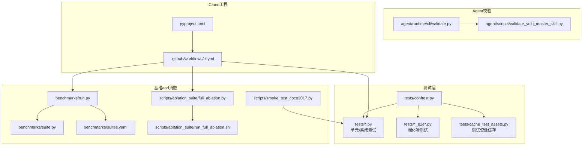
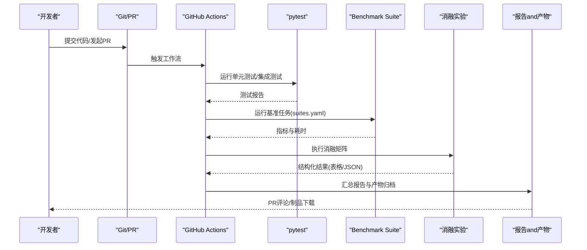
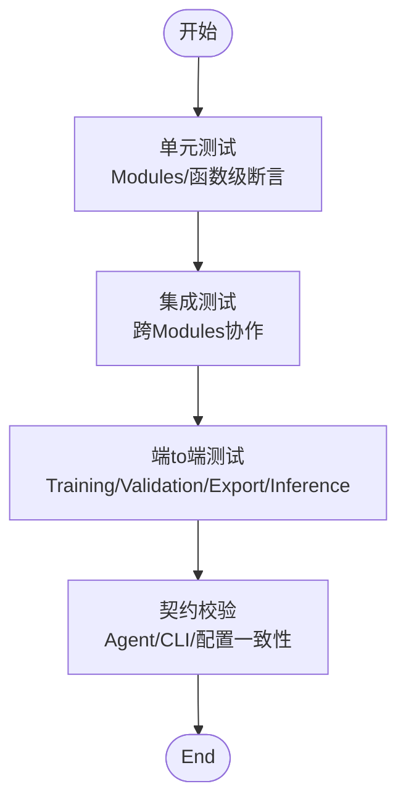
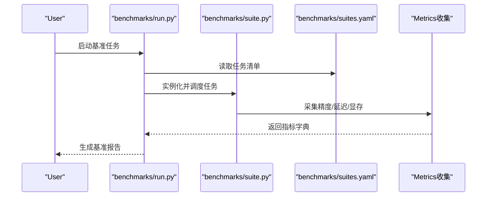
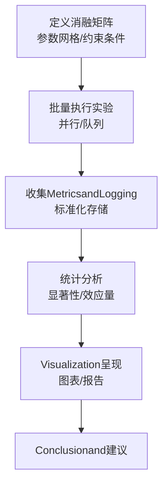
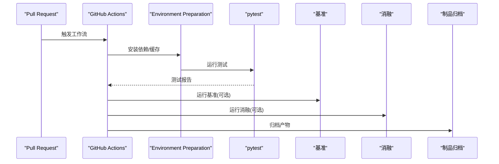
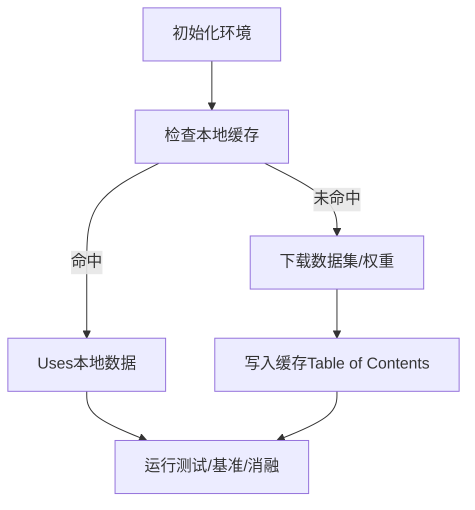
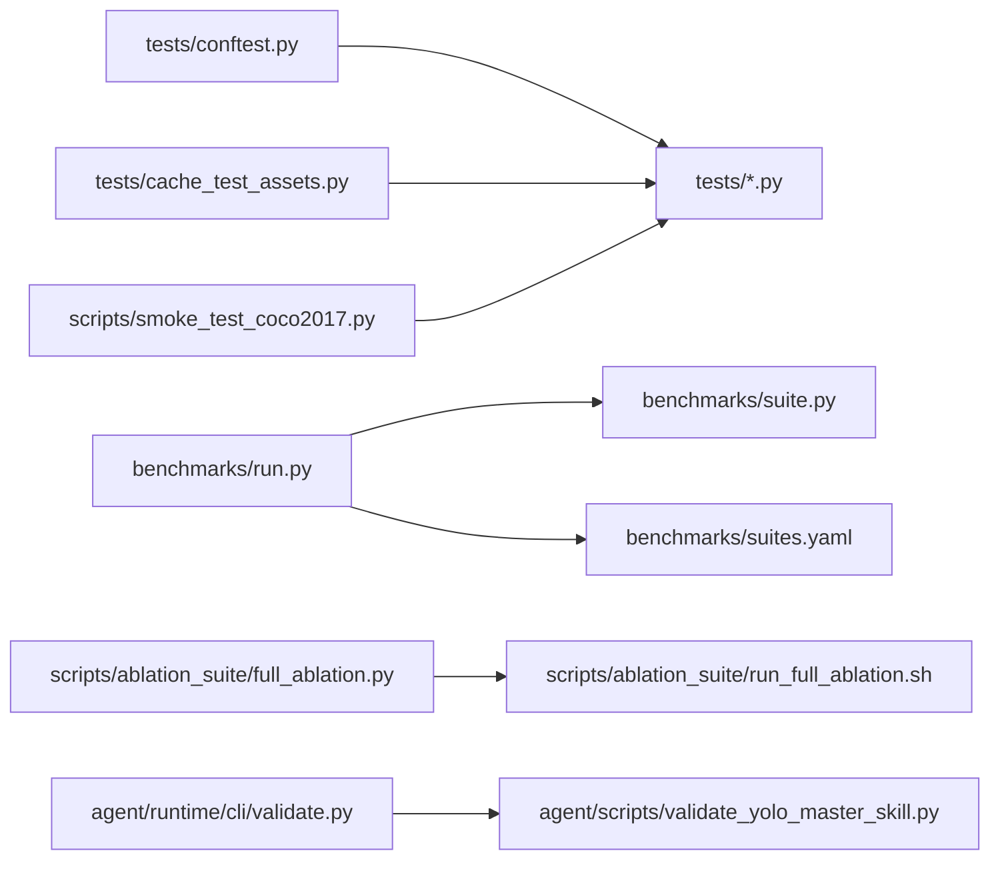

# 集成测试andValidation

<cite>
**Files Referenced in This Document**
- [tests/conftest.py](file://tests/conftest.py)
- [tests/test_benchmark_suite.py](file://tests/test_benchmark_suite.py)
- [tests/test_cli.py](file://tests/test_cli.py)
- [tests/test_engine.py](file://tests/test_engine.py)
- [tests/test_moe.py](file://tests/test_moe.py)
- [tests/test_molora.py](file://tests/test_molora.py)
- [tests/test_mot.py](file://tests/test_mot.py)
- [tests/test_peft_adapters.py](file://tests/test_peft_adapters.py)
- [tests/test_planner_integration.py](file://tests/test_planner_integration.py)
- [tests/test_exports.py](file://tests/test_exports.py)
- [tests/test_integrations.py](file://tests/test_integrations.py)
- [tests/cache_test_assets.py](file://tests/cache_test_assets.py)
- [benchmarks/run.py](file://benchmarks/run.py)
- [benchmarks/suite.py](file://benchmarks/suite.py)
- [benchmarks/suites.yaml](file://benchmarks/suites.yaml)
- [scripts/ablation_suite/full_ablation.py](file://scripts/ablation_suite/full_ablation.py)
- [scripts/ablation_suite/run_full_ablation.sh](file://scripts/ablation_suite/run_full_ablation.sh)
- [scripts/smoke_test_coco2017.py](file://scripts/smoke_test_coco2017.py)
- [agent/runtime/cli/validate.py](file://agent/runtime/cli/validate.py)
- [agent/scripts/validate_yolo_master_skill.py](file://agent/scripts/validate_yolo_master_skill.py)
- [.github/workflows/ci.yml](file://.github/workflows/ci.yml)
- [pyproject.toml](file://pyproject.toml)
</cite>

## Table of Contents
1. [Introduction](#Introduction)
2. [Project Structure](#Project Structure)
3. [Core Components](#Core Components)
4. [Architecture Overview](#Architecture Overview)
5. [Detailed Component Analysis](#Detailed Component Analysis)
6. [Dependency Analysis](#Dependency Analysis)
7. [性能考量](#性能考量)
8. [Troubleshooting Guide](#Troubleshooting Guide)
9. [Conclusion](#Conclusion)
10. [Appendix](#Appendix)

## Introduction
本指南targetingYOLO-Master新特性的集成测试andValidation，覆盖Centered on下目标：
- 制定分层测试策略（单元测试、集成测试、端to端测试）
- 构建基准测试体系（Metrics定义、对比实验设计）
- 实施消融实验流程（变量控制、结果分析）
- 自动化回归测试andCI/CD流水线集成
- 测试数据管理（数据集准备and版本控制）
- 测试结果分析and工具Uses

## Project Structure
仓库已具备完善的测试and基准基础设施。关键位置such as下：
- 测试用例：tests/
- Benchmark Suite：benchmarks/
- 消融实验脚本：scripts/ablation_suite/
- 快速冒烟脚本：scripts/smoke_test_coco2017.py
- Agent侧校验入口：agent/runtime/cli/validate.py、agent/scripts/validate_yolo_master_skill.py
- CI配置：.github/workflows/ci.yml
- 包and依赖：pyproject.toml

Figure Source
- [tests/conftest.py](file://tests/conftest.py)
- [tests/cache_test_assets.py](file://tests/cache_test_assets.py)
- [benchmarks/run.py](file://benchmarks/run.py)
- [benchmarks/suite.py](file://benchmarks/suite.py)
- [benchmarks/suites.yaml](file://benchmarks/suites.yaml)
- [scripts/ablation_suite/full_ablation.py](file://scripts/ablation_suite/full_ablation.py)
- [scripts/ablation_suite/run_full_ablation.sh](file://scripts/ablation_suite/run_full_ablation.sh)
- [scripts/smoke_test_coco2017.py](file://scripts/smoke_test_coco2017.py)
- [agent/runtime/cli/validate.py](file://agent/runtime/cli/validate.py)
- [agent/scripts/validate_yolo_master_skill.py](file://agent/scripts/validate_yolo_master_skill.py)
- [.github/workflows/ci.yml](file://.github/workflows/ci.yml)
- [pyproject.toml](file://pyproject.toml)

Section Source
- [tests/conftest.py](file://tests/conftest.py)
- [tests/cache_test_assets.py](file://tests/cache_test_assets.py)
- [benchmarks/run.py](file://benchmarks/run.py)
- [benchmarks/suite.py](file://benchmarks/suite.py)
- [benchmarks/suites.yaml](file://benchmarks/suites.yaml)
- [scripts/ablation_suite/full_ablation.py](file://scripts/ablation_suite/full_ablation.py)
- [scripts/ablation_suite/run_full_ablation.sh](file://scripts/ablation_suite/run_full_ablation.sh)
- [scripts/smoke_test_coco2017.py](file://scripts/smoke_test_coco2017.py)
- [agent/runtime/cli/validate.py](file://agent/runtime/cli/validate.py)
- [agent/scripts/validate_yolo_master_skill.py](file://agent/scripts/validate_yolo_master_skill.py)
- [.github/workflows/ci.yml](file://.github/workflows/ci.yml)
- [pyproject.toml](file://pyproject.toml)

## Core Components
- 测试框架and夹具
  - conftest.pyprovides全局夹具、Device Selection、Loggingand临时Table of Contents管理，统一测试环境。
  - cache_test_assets.pyfor downloading/缓存小样本数据集and权重，加速本地andCI执行。
- 基准Test Suite
  - benchmarks/run.pyandsuite.py定义基准运行器andTasks编排；suites.yaml声明数据集、模型andMetrics组合。
- 消融实验
  - scripts/ablation_suite/full_ablation.pyandrun_full_ablation.sh组织多场景、多变量的消融矩阵，输出结构化报告。
- 冒烟and端to端
  - scripts/smoke_test_coco2017.py用于快速ValidationTraining/Validation/Export链路。
  - tests/*_e2e*.py覆盖跨Modules的完整工作流。
- Agent侧校验
  - agent/runtime/cli/validate.pyandagent/scripts/validate_yolo_master_skill.pyprovides技能级契约校验and一致性检查。
- CI/CD
  - .github/workflows/ci.yml串联pytest、基准and消融Tasks，implementing自动化回归。

Section Source
- [tests/conftest.py](file://tests/conftest.py)
- [tests/cache_test_assets.py](file://tests/cache_test_assets.py)
- [benchmarks/run.py](file://benchmarks/run.py)
- [benchmarks/suite.py](file://benchmarks/suite.py)
- [benchmarks/suites.yaml](file://benchmarks/suites.yaml)
- [scripts/ablation_suite/full_ablation.py](file://scripts/ablation_suite/full_ablation.py)
- [scripts/ablation_suite/run_full_ablation.sh](file://scripts/ablation_suite/run_full_ablation.sh)
- [scripts/smoke_test_coco2017.py](file://scripts/smoke_test_coco2017.py)
- [agent/runtime/cli/validate.py](file://agent/runtime/cli/validate.py)
- [agent/scripts/validate_yolo_master_skill.py](file://agent/scripts/validate_yolo_master_skill.py)

## Architecture Overview
下图展示从代码变更to测试、基准、消融and报告的End-to-end pipeline。

Figure Source
- [.github/workflows/ci.yml](file://.github/workflows/ci.yml)
- [benchmarks/run.py](file://benchmarks/run.py)
- [benchmarks/suite.py](file://benchmarks/suite.py)
- [benchmarks/suites.yaml](file://benchmarks/suites.yaml)
- [scripts/ablation_suite/full_ablation.py](file://scripts/ablation_suite/full_ablation.py)

## Detailed Component Analysis

### 测试策略and分层设计
- 单元测试
  - 聚焦函数/类级别行for，such asExport、引擎、Mixture/MoE路由、PEFTAdapteretc.。
  - Refer to用例：
    - [tests/test_engine.py](file://tests/test_engine.py)
    - [tests/test_moe.py](file://tests/test_moe.py)
    - [tests/test_molora.py](file://tests/test_molora.py)
    - [tests/test_peft_adapters.py](file://tests/test_peft_adapters.py)
    - [tests/test_exports.py](file://tests/test_exports.py)
- 集成测试
  - 覆盖跨Modules交互，such asMoA/MoT、Planner集成、Export前后一致性etc.。
  - Refer to用例：
    - [tests/test_moa.py](file://tests/test_moa.py)
    - [tests/test_mot.py](file://tests/test_mot.py)
    - [tests/test_planner_integration.py](file://tests/test_planner_integration.py)
    - [tests/test_integrations.py](file://tests/test_integrations.py)
- 端to端测试
  - Centered on真实或迷你数据集drivers are installed完整Training/Validation/Export/Inference链路。
  - Refer to用例：
    - [tests/test_lovo_e2e.py](file://tests/test_lovo_e2e.py)
    - [scripts/smoke_test_coco2017.py](file://scripts/smoke_test_coco2017.py)
- 契约and校验
  - ViaAgent侧校验脚本保障技能契约and配置一致性。
  - Refer to入口：
    - [agent/runtime/cli/validate.py](file://agent/runtime/cli/validate.py)
    - [agent/scripts/validate_yolo_master_skill.py](file://agent/scripts/validate_yolo_master_skill.py)

Section Source
- [tests/test_engine.py](file://tests/test_engine.py)
- [tests/test_moe.py](file://tests/test_moe.py)
- [tests/test_molora.py](file://tests/test_molora.py)
- [tests/test_peft_adapters.py](file://tests/test_peft_adapters.py)
- [tests/test_exports.py](file://tests/test_exports.py)
- [tests/test_moa.py](file://tests/test_moa.py)
- [tests/test_mot.py](file://tests/test_mot.py)
- [tests/test_planner_integration.py](file://tests/test_planner_integration.py)
- [tests/test_integrations.py](file://tests/test_integrations.py)
- [tests/test_lovo_e2e.py](file://tests/test_lovo_e2e.py)
- [scripts/smoke_test_coco2017.py](file://scripts/smoke_test_coco2017.py)
- [agent/runtime/cli/validate.py](file://agent/runtime/cli/validate.py)
- [agent/scripts/validate_yolo_master_skill.py](file://agent/scripts/validate_yolo_master_skill.py)

### 基准测试构建方法
- Metrics定义
  - 精度Metrics：mAP、mAP50、mAP75、每类别APetc.
  - 效率Metrics：吞吐(QPS)、延迟(P50/P95)、显存占用、CPU/GPU利用率
  - 稳定性Metrics：多次运行的方差、收敛曲线波动
- 对比实验设计
  - 基线模型 vs 新特性分支
  - 不同数据集规模and分布（COCO、VisDrone、自定义小集）
  - 不同硬件后端（CUDA、OpenVINO、ONNXRuntimeetc.）
- 运行方式
  - Viabenchmarks/run.py加载suites.yaml中的Tasks集合，批量执行并汇总Metrics。
  - Refer to：
    - [benchmarks/run.py](file://benchmarks/run.py)
    - [benchmarks/suite.py](file://benchmarks/suite.py)
    - [benchmarks/suites.yaml](file://benchmarks/suites.yaml)

Figure Source
- [benchmarks/run.py](file://benchmarks/run.py)
- [benchmarks/suite.py](file://benchmarks/suite.py)
- [benchmarks/suites.yaml](file://benchmarks/suites.yaml)

Section Source
- [benchmarks/run.py](file://benchmarks/run.py)
- [benchmarks/suite.py](file://benchmarks/suite.py)
- [benchmarks/suites.yaml](file://benchmarks/suites.yaml)

### 消融实验实施流程
- 变量控制
  - 维度Examples：routing strategies、专家数量、LoRA秩、Mixture损失权重、多尺度输入、采样策略etc.
  - Viafull_ablation.py定义参数网格，Combiningrun_full_ablation.sh批量执行
- 结果分析
  - 输出结构化结果（CSV/JSON），便于后续Visualizationand统计检验
  - 建议关注主效应and交互效应，绘制热力图/折线图辅助决策
- Refer toimplementing
  - [scripts/ablation_suite/full_ablation.py](file://scripts/ablation_suite/full_ablation.py)
  - [scripts/ablation_suite/run_full_ablation.sh](file://scripts/ablation_suite/run_full_ablation.sh)

Section Source
- [scripts/ablation_suite/full_ablation.py](file://scripts/ablation_suite/full_ablation.py)
- [scripts/ablation_suite/run_full_ablation.sh](file://scripts/ablation_suite/run_full_ablation.sh)

### 回归测试自动化andCI/CD集成
- 触发条件
  - 推送/PR事件触发工作流，按阶段执行冒烟、测试、基准and消融
- 阶段划分
  - Installing Dependenciesand缓存
  - 运行pytest（含标记过滤）
  - 运行Benchmark Suite（Optional）
  - 运行消融实验（Optional）
  - 上传产物and报告
- Refer to配置
  - [.github/workflows/ci.yml](file://.github/workflows/ci.yml)
  - [pyproject.toml](file://pyproject.toml)

Figure Source
- [.github/workflows/ci.yml](file://.github/workflows/ci.yml)
- [pyproject.toml](file://pyproject.toml)

Section Source
- [.github/workflows/ci.yml](file://.github/workflows/ci.yml)
- [pyproject.toml](file://pyproject.toml)

### 测试数据管理and版本控制
- Data Preparation
  - Usescache_test_assets.pywhile首次运行时自动下载/缓存小样本数据集and权重，避免重复Network requests
  - 对大型数据集Recommended to use外部存储（对象存储/HF Hub）并Via符号链接或数据卷挂载
- 版本控制
  - 将配置文件、基准Tasks清单、消融矩阵纳入版本控制
  - 对不可变的数据快照Uses哈希或标签记录，确保可复现
- Refer toimplementing
  - [tests/cache_test_assets.py](file://tests/cache_test_assets.py)

Figure Source
- [tests/cache_test_assets.py](file://tests/cache_test_assets.py)

Section Source
- [tests/cache_test_assets.py](file://tests/cache_test_assets.py)

### 测试结果分析and工具Uses
- 终端查看
  - pytest --collect-only / --tb=short / -v etc.常用选项
  - Refer to：[tests/test_cli.py](file://tests/test_cli.py)
- 基准报告
  - Benchmark Suite输出结构化Metrics，便于横向对比
  - Refer to：[benchmarks/run.py](file://benchmarks/run.py)
- 消融报告
  - 全量消融脚本输出汇总结果，Supporting后续Visualization
  - Refer to：[scripts/ablation_suite/full_ablation.py](file://scripts/ablation_suite/full_ablation.py)
- Agent校验
  - Viavalidate入口进行契约一致性检查
  - Refer to：[agent/runtime/cli/validate.py](file://agent/runtime/cli/validate.py), [agent/scripts/validate_yolo_master_skill.py](file://agent/scripts/validate_yolo_master_skill.py)

Section Source
- [tests/test_cli.py](file://tests/test_cli.py)
- [benchmarks/run.py](file://benchmarks/run.py)
- [scripts/ablation_suite/full_ablation.py](file://scripts/ablation_suite/full_ablation.py)
- [agent/runtime/cli/validate.py](file://agent/runtime/cli/validate.py)
- [agent/scripts/validate_yolo_master_skill.py](file://agent/scripts/validate_yolo_master_skill.py)

## Dependency Analysis
- 测试and基准耦合点
  - conftestfor所有测试provides共享夹具；benchmark suite由run.pydrivers are installed，读取suites.yaml
  - 消融脚本独立于测试，但复用相同的数据and模型接口
- External Dependencies
  - 数据集and权重Via缓存机制获取；CI中需配置必要的凭据and缓存键
- Potential Cycles依赖
  - 测试and基准均依赖核心引擎and模型Registry，应避免while测试中引入生产路径的全量初始化

Figure Source
- [tests/conftest.py](file://tests/conftest.py)
- [tests/cache_test_assets.py](file://tests/cache_test_assets.py)
- [benchmarks/run.py](file://benchmarks/run.py)
- [benchmarks/suite.py](file://benchmarks/suite.py)
- [benchmarks/suites.yaml](file://benchmarks/suites.yaml)
- [scripts/ablation_suite/full_ablation.py](file://scripts/ablation_suite/full_ablation.py)
- [scripts/ablation_suite/run_full_ablation.sh](file://scripts/ablation_suite/run_full_ablation.sh)
- [scripts/smoke_test_coco2017.py](file://scripts/smoke_test_coco2017.py)
- [agent/runtime/cli/validate.py](file://agent/runtime/cli/validate.py)
- [agent/scripts/validate_yolo_master_skill.py](file://agent/scripts/validate_yolo_master_skill.py)

Section Source
- [tests/conftest.py](file://tests/conftest.py)
- [tests/cache_test_assets.py](file://tests/cache_test_assets.py)
- [benchmarks/run.py](file://benchmarks/run.py)
- [benchmarks/suite.py](file://benchmarks/suite.py)
- [benchmarks/suites.yaml](file://benchmarks/suites.yaml)
- [scripts/ablation_suite/full_ablation.py](file://scripts/ablation_suite/full_ablation.py)
- [scripts/ablation_suite/run_full_ablation.sh](file://scripts/ablation_suite/run_full_ablation.sh)
- [scripts/smoke_test_coco2017.py](file://scripts/smoke_test_coco2017.py)
- [agent/runtime/cli/validate.py](file://agent/runtime/cli/validate.py)
- [agent/scripts/validate_yolo_master_skill.py](file://agent/scripts/validate_yolo_master_skill.py)

## 性能考量
- 基准执行
  - 预热阶段：避免冷启动偏差
  - 稳定期测量：取P50/P95延迟and吞吐均值/方差
  - 资源监控：显存峰值、GPU利用率、I/Oetc.待
- 并行and批大小
  - 根据硬件capabilities调整batch sizeandworkers，避免OOM
- 结果可比性
  - 固定随机种子、数据顺序and预处理管线
  - 同一硬件/drivers are installed/库版本下对比

## Troubleshooting Guide
- 常见失败定位
  - 测试超时：检查数据下载and缓存、GPU内存不足
  - 基准不一致：确认随机种子、数据版本and后端版本一致
  - 消融结果异常：核对参数网格and约束条件
- 实用命令
  - pytest -x -v --tb=long
  - 仅运行特定标记：pytest -m "smoke"
  - 基准单Tasks调试：benchmarks/run.py --task <name>
- Refer to入口
  - [tests/test_cli.py](file://tests/test_cli.py)
  - [benchmarks/run.py](file://benchmarks/run.py)
  - [scripts/ablation_suite/full_ablation.py](file://scripts/ablation_suite/full_ablation.py)

Section Source
- [tests/test_cli.py](file://tests/test_cli.py)
- [benchmarks/run.py](file://benchmarks/run.py)
- [scripts/ablation_suite/full_ablation.py](file://scripts/ablation_suite/full_ablation.py)

## Conclusion
Via分层测试、Benchmark Suiteand消融实验的协同，Combined withCI/CD自动化and数据缓存机制，YOLO-Master的新特性可while质量、性能and可复现性方面得to系统化保障。建议while每次重大改动后执行冒烟+基准+关键消融的组合，确保回归风险可控。

## Appendix
- 快速上手
  - 本地运行测试：pytest
  - 运行基准：benchmarks/run.py
  - 运行消融：scripts/ablation_suite/run_full_ablation.sh
  - 冒烟Validation：scripts/smoke_test_coco2017.py
- Refer to文件
  - [tests/conftest.py](file://tests/conftest.py)
  - [tests/cache_test_assets.py](file://tests/cache_test_assets.py)
  - [benchmarks/run.py](file://benchmarks/run.py)
  - [benchmarks/suite.py](file://benchmarks/suite.py)
  - [benchmarks/suites.yaml](file://benchmarks/suites.yaml)
  - [scripts/ablation_suite/full_ablation.py](file://scripts/ablation_suite/full_ablation.py)
  - [scripts/ablation_suite/run_full_ablation.sh](file://scripts/ablation_suite/run_full_ablation.sh)
  - [scripts/smoke_test_coco2017.py](file://scripts/smoke_test_coco2017.py)
  - [agent/runtime/cli/validate.py](file://agent/runtime/cli/validate.py)
  - [agent/scripts/validate_yolo_master_skill.py](file://agent/scripts/validate_yolo_master_skill.py)
  - [.github/workflows/ci.yml](file://.github/workflows/ci.yml)
  - [pyproject.toml](file://pyproject.toml)