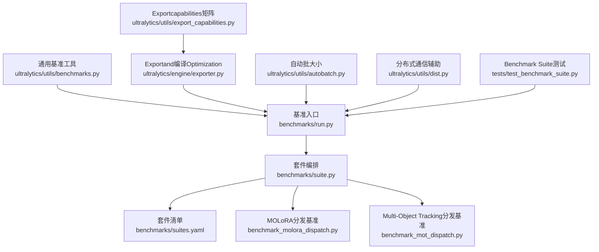
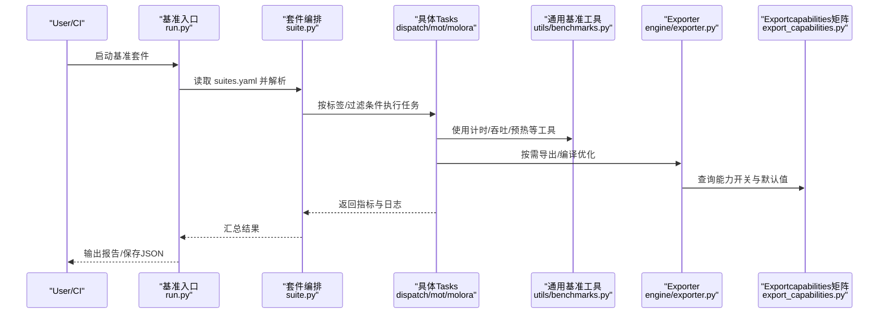
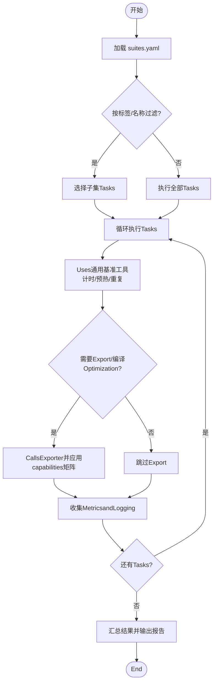
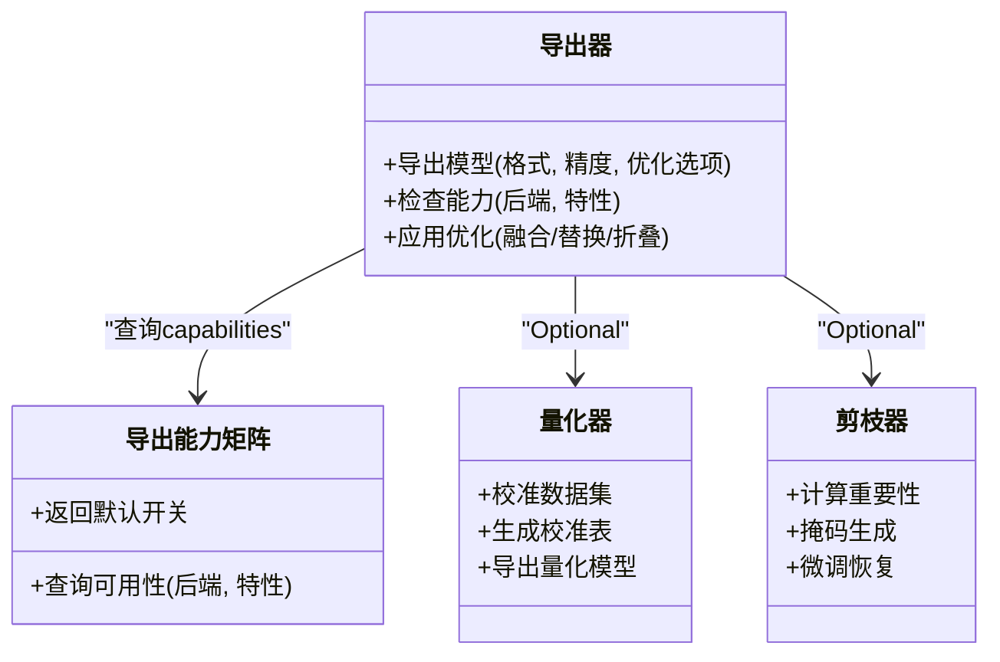
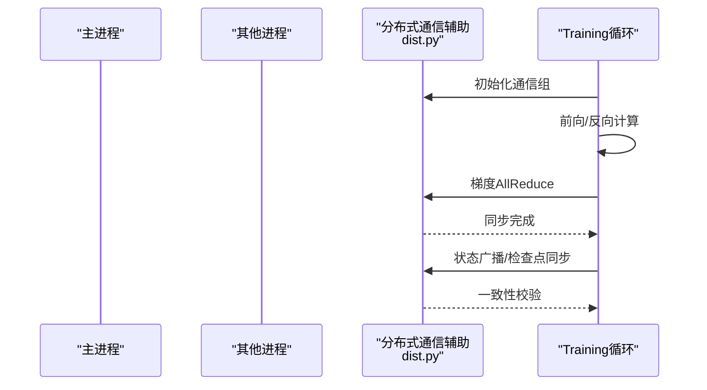
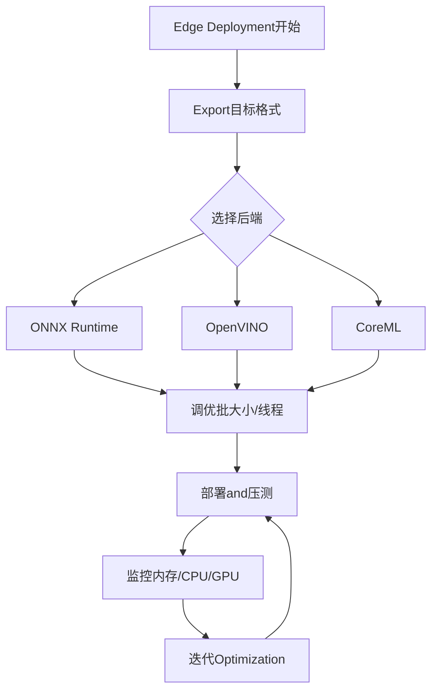
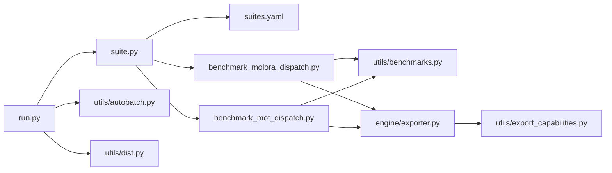

# 性能Optimizationand基准测试

<cite>
**Files Referenced in This Document**
- [benchmarks/run.py](file://benchmarks/run.py)
- [benchmarks/suite.py](file://benchmarks/suite.py)
- [benchmarks/suites.yaml](file://benchmarks/suites.yaml)
- [benchmarks/benchmark_molora_dispatch.py](file://benchmarks/benchmark_molora_dispatch.py)
- [benchmarks/benchmark_mot_dispatch.py](file://benchmarks/benchmark_mot_dispatch.py)
- [ultralytics/utils/benchmarks.py](file://ultralytics/utils/benchmarks.py)
- [ultralytics/engine/exporter.py](file://ultralytics/engine/exporter.py)
- [ultralytics/utils/export_capabilities.py](file://ultralytics/utils/export_capabilities.py)
- [ultralytics/utils/autobatch.py](file://ultralytics/utils/autobatch.py)
- [ultralytics/utils/dist.py](file://ultralytics/utils/dist.py)
- [tests/test_benchmark_suite.py](file://tests/test_benchmark_suite.py)
- [examples/YOLO-Master-Cross-Platform-Edge-Deployment/README.md](file://examples/YOLO-Master-Cross-Platform-Edge-Deployment/README.md)
- [examples/YOLO-Master-Edge-Deployment/edge_utils.py](file://examples/YOLO-Master-Edge-Deployment/edge_utils.py)
- [examples/YOLO-Master-Edge-Deployment/export_edge_models.py](file://examples/YOLO-Master-Edge-Deployment/export_edge_models.py)
- [examples/YOLOv8-ONNXRuntime-Python/main.py](file://examples/YOLOv8-ONNXRuntime-Python/main.py)
- [examples/YOLOv8-OpenVINO-CPP-Inference/main.cc](file://examples/YOLOv8-OpenVINO-CPP-Inference/main.cc)
- [scripts/bench_moe_micro.py](file://scripts/bench_moe_micro.py)
- [scripts/bench_moe_mps.py](file://scripts/bench_moe_mps.py)
- [docs/governance/performance-gates.md](file://docs/governance/performance-gates.md)
- [docs/governance/benchmark-suite.md](file://docs/governance/benchmark-suite.md)
</cite>

## Table of Contents
1. [Introduction](#Introduction)
2. [Project Structure](#Project Structure)
3. [Core Components](#Core Components)
4. [Architecture Overview](#Architecture Overview)
5. [Detailed Component Analysis](#Detailed Component Analysis)
6. [Dependency Analysis](#Dependency Analysis)
7. [性能考量](#性能考量)
8. [Troubleshooting Guide](#Troubleshooting Guide)
9. [Conclusion](#Conclusion)
10. [Appendix](#Appendix)

## Introduction
本指南targetingYOLO-Master项目的性能Optimizationand基准测试，覆盖Centered on下主题：
- Built-in基准Test Suite的Usesand扩展方法
- 性能分析工具（内存、CPU、GPU）的集成and实践
- 模型Optimization技术（量化、剪枝、编译Optimization）
- Distributed Training的性能调优（通信andLoad Balancing）
- Edge Device Deployment的性能Optimization策略
- 性能回归检测的自动化流程
- 性能报告生成and分析技巧
- bottlenecks定位andOptimizationValidation方法

## Project Structure
本项目while多个位置providesand性能相关的代码andDocumentation：
- benchmarks：基准Test Suite入口、套件定义and调度
- ultralytics/utils/benchmarks.py：通用基准工具
- ultralytics/engine/exporter.py：Exportand编译Optimization相关capabilities
- ultralytics/utils/export_capabilities.py：Exportcapabilities矩阵and开关
- ultralytics/utils/autobatch.py：自动批大小选择
- ultralytics/utils/dist.py：分布式通信辅助
- tests/test_benchmark_suite.py：Benchmark Suite测试
- examples：跨平台andEdge DeploymentExamples（含Inference脚本）
- scripts：MoE微基准andMPS基准etc.专用脚本
- docs/governance：性能门禁andBenchmark Suite治理Documentation

Figure Source
- [benchmarks/run.py](file://benchmarks/run.py)
- [benchmarks/suite.py](file://benchmarks/suite.py)
- [benchmarks/suites.yaml](file://benchmarks/suites.yaml)
- [benchmarks/benchmark_molora_dispatch.py](file://benchmarks/benchmark_molora_dispatch.py)
- [benchmarks/benchmark_mot_dispatch.py](file://benchmarks/benchmark_mot_dispatch.py)
- [ultralytics/utils/benchmarks.py](file://ultralytics/utils/benchmarks.py)
- [ultralytics/engine/exporter.py](file://ultralytics/engine/exporter.py)
- [ultralytics/utils/export_capabilities.py](file://ultralytics/utils/export_capabilities.py)
- [ultralytics/utils/autobatch.py](file://ultralytics/utils/autobatch.py)
- [ultralytics/utils/dist.py](file://ultralytics/utils/dist.py)
- [tests/test_benchmark_suite.py](file://tests/test_benchmark_suite.py)

Section Source
- [benchmarks/run.py](file://benchmarks/run.py)
- [benchmarks/suite.py](file://benchmarks/suite.py)
- [benchmarks/suites.yaml](file://benchmarks/suites.yaml)
- [benchmarks/benchmark_molora_dispatch.py](file://benchmarks/benchmark_molora_dispatch.py)
- [benchmarks/benchmark_mot_dispatch.py](file://benchmarks/benchmark_mot_dispatch.py)
- [ultralytics/utils/benchmarks.py](file://ultralytics/utils/benchmarks.py)
- [ultralytics/engine/exporter.py](file://ultralytics/engine/exporter.py)
- [ultralytics/utils/export_capabilities.py](file://ultralytics/utils/export_capabilities.py)
- [ultralytics/utils/autobatch.py](file://ultralytics/utils/autobatch.py)
- [ultralytics/utils/dist.py](file://ultralytics/utils/dist.py)
- [tests/test_benchmark_suite.py](file://tests/test_benchmark_suite.py)

## Core Components
- 基准入口and套件编排
  - ViaUnified entry point加载并执行套件清单中的Tasks，Supporting按标签筛选、并行度控制and结果汇总。
  - 套件清单Centered onYAML定义，便于版本化andCI复用。
- 通用基准工具
  - provides计时、吞吐统计、预热、重复次数、随机种子固定etc.基础capabilities。
- Exportand编译Optimization
  - Exporter负责将模型转换for多种后端格式，并启用相应编译Optimization选项。
  - Exportcapabilities矩阵用于控制不同后端/精度的可用性and默认行for。
- 自动批大小
  - 根据硬件资源and显存上限动态选择最优批大小，提升吞吐。
- 分布式通信辅助
  - provides进程间通信、同步and错误传播etc.辅助函数，支撑DDP/多卡TrainingandInference。
- Benchmark Suite测试
  - 对基准入口and套件进行端to端冒烟测试，确保稳定性。

Section Source
- [benchmarks/run.py](file://benchmarks/run.py)
- [benchmarks/suite.py](file://benchmarks/suite.py)
- [benchmarks/suites.yaml](file://benchmarks/suites.yaml)
- [ultralytics/utils/benchmarks.py](file://ultralytics/utils/benchmarks.py)
- [ultralytics/engine/exporter.py](file://ultralytics/engine/exporter.py)
- [ultralytics/utils/export_capabilities.py](file://ultralytics/utils/export_capabilities.py)
- [ultralytics/utils/autobatch.py](file://ultralytics/utils/autobatch.py)
- [ultralytics/utils/dist.py](file://ultralytics/utils/dist.py)
- [tests/test_benchmark_suite.py](file://tests/test_benchmark_suite.py)

## Architecture Overview
下图展示了基准测试从入口to具体Tasks的Calls链，Centered onandExportandcapabilities矩阵的协作关系。

Figure Source
- [benchmarks/run.py](file://benchmarks/run.py)
- [benchmarks/suite.py](file://benchmarks/suite.py)
- [benchmarks/benchmark_molora_dispatch.py](file://benchmarks/benchmark_molora_dispatch.py)
- [benchmarks/benchmark_mot_dispatch.py](file://benchmarks/benchmark_mot_dispatch.py)
- [ultralytics/utils/benchmarks.py](file://ultralytics/utils/benchmarks.py)
- [ultralytics/engine/exporter.py](file://ultralytics/engine/exporter.py)
- [ultralytics/utils/export_capabilities.py](file://ultralytics/utils/export_capabilities.py)

## Detailed Component Analysis

### 基准Test SuiteUses方法
- 运行Built-in套件
  - Via基准入口加载套件清单，可按标签或名称筛选Tasks，设置并发度and重复次数，最终汇总for结构化结果。
- 自定义基准测试
  - 新增Tasks时，Refer to现有分发基准的implementing模式，注册to套件编排中，并while套件清单中添加条目。
  - Uses通用基准工具Encapsulates计时、预热、重复执行andMetrics聚合逻辑，保证可复现性。
- 关键配置项
  - 套件清单包含Tasks名、描述、标签、参数、是否启用etc.信息，便于CIand本地灵活组合。

Figure Source
- [benchmarks/run.py](file://benchmarks/run.py)
- [benchmarks/suite.py](file://benchmarks/suite.py)
- [benchmarks/suites.yaml](file://benchmarks/suites.yaml)
- [ultralytics/utils/benchmarks.py](file://ultralytics/utils/benchmarks.py)
- [ultralytics/engine/exporter.py](file://ultralytics/engine/exporter.py)
- [ultralytics/utils/export_capabilities.py](file://ultralytics/utils/export_capabilities.py)

Section Source
- [benchmarks/run.py](file://benchmarks/run.py)
- [benchmarks/suite.py](file://benchmarks/suite.py)
- [benchmarks/suites.yaml](file://benchmarks/suites.yaml)
- [ultralytics/utils/benchmarks.py](file://ultralytics/utils/benchmarks.py)
- [ultralytics/engine/exporter.py](file://ultralytics/engine/exporter.py)
- [ultralytics/utils/export_capabilities.py](file://ultralytics/utils/export_capabilities.py)

### 性能分析工具Uses
- 内存Uses分析
  - Combining框架provides的内存监控接口andPython内存分析工具，记录峰值and趋势，识别泄漏点。
- CPU性能分析
  - Uses系统级and语言级剖析器，定位热点函数and锁竞争，关注数据预处理andI/O路径。
- GPU利用率监控
  - 利用drivers are installedand运行时API采集GPU占用、显存、功耗and温度，Evaluation算子效率and队列阻塞。

实践建议
- while基准Tasks中开启“预热”阶段，避免冷启动偏差。
- 固定随机种子and输入分布，确保对比公平。
- 对关键路径添加细粒度计时点，便于定位bottlenecks。

Section Source
- [ultralytics/utils/benchmarks.py](file://ultralytics/utils/benchmarks.py)
- [benchmarks/benchmark_molora_dispatch.py](file://benchmarks/benchmark_molora_dispatch.py)
- [benchmarks/benchmark_mot_dispatch.py](file://benchmarks/benchmark_mot_dispatch.py)

### 模型Optimization技术
- 量化
  - 针对目标后端（such asTensorRT/OpenVINO/ONNX Runtime）选择合适的精度（FP16/INT8），并进行校准andValidation。
- 剪枝
  - 基于稀疏性或重要性度量移除冗余权重，Combined with重Training恢复精度。
- 编译Optimization
  - ViaExporter启用图融合、算子替换、常量折叠etc.Optimization；依据capabilities矩阵选择可用Optimization。

Figure Source
- [ultralytics/engine/exporter.py](file://ultralytics/engine/exporter.py)
- [ultralytics/utils/export_capabilities.py](file://ultralytics/utils/export_capabilities.py)

Section Source
- [ultralytics/engine/exporter.py](file://ultralytics/engine/exporter.py)
- [ultralytics/utils/export_capabilities.py](file://ultralytics/utils/export_capabilities.py)

### Distributed Training性能调优
- 通信Optimization
  - Set appropriatelyGradient同步策略、通信后端and带宽限制，减少AllReduce开销。
- Load Balancing
  - 调整数据分片and批大小，避免长尾样本导致的不均衡。
- 监控and诊断
  - 采集各进程耗时、通信延迟and队列长度，定位热点节点。

Figure Source
- [ultralytics/utils/dist.py](file://ultralytics/utils/dist.py)

Section Source
- [ultralytics/utils/dist.py](file://ultralytics/utils/dist.py)

### Edge Device DeploymentOptimization
- ExportandInference
  - Uses跨平台Examples工程，针对不同后端（ONNX Runtime、OpenVINO、CoreMLetc.）进行ExportandInference。
- 批大小and线程数
  - Combining自动批大小and设备约束，选择合适批大小and并行度。
- 内存and缓存
  - 预分配张量、复用缓冲区，降低GCand拷贝开销。

Figure Source
- [examples/YOLO-Master-Cross-Platform-Edge-Deployment/README.md](file://examples/YOLO-Master-Cross-Platform-Edge-Deployment/README.md)
- [examples/YOLO-Master-Edge-Deployment/edge_utils.py](file://examples/YOLO-Master-Edge-Deployment/edge_utils.py)
- [examples/YOLO-Master-Edge-Deployment/export_edge_models.py](file://examples/YOLO-Master-Edge-Deployment/export_edge_models.py)
- [examples/YOLOv8-ONNXRuntime-Python/main.py](file://examples/YOLOv8-ONNXRuntime-Python/main.py)
- [examples/YOLOv8-OpenVINO-CPP-Inference/main.cc](file://examples/YOLOv8-OpenVINO-CPP-Inference/main.cc)
- [ultralytics/utils/autobatch.py](file://ultralytics/utils/autobatch.py)

Section Source
- [examples/YOLO-Master-Cross-Platform-Edge-Deployment/README.md](file://examples/YOLO-Master-Cross-Platform-Edge-Deployment/README.md)
- [examples/YOLO-Master-Edge-Deployment/edge_utils.py](file://examples/YOLO-Master-Edge-Deployment/edge_utils.py)
- [examples/YOLO-Master-Edge-Deployment/export_edge_models.py](file://examples/YOLO-Master-Edge-Deployment/export_edge_models.py)
- [examples/YOLOv8-ONNXRuntime-Python/main.py](file://examples/YOLOv8-ONNXRuntime-Python/main.py)
- [examples/YOLOv8-OpenVINO-CPP-Inference/main.cc](file://examples/YOLOv8-OpenVINO-CPP-Inference/main.cc)
- [ultralytics/utils/autobatch.py](file://ultralytics/utils/autobatch.py)

### 性能回归检测自动化
- 门禁and阈值
  - whileCI中运行Benchmark Suite，对比基线Metrics，超过阈值则失败。
- 报告and归档
  - 将每次运行的结果持久化forJSON/Markdown，便于趋势分析and审计。
- 版本化and可追溯
  - 关联提交哈希、环境信息and套件清单，确保可重现。

Section Source
- [docs/governance/performance-gates.md](file://docs/governance/performance-gates.md)
- [docs/governance/benchmark-suite.md](file://docs/governance/benchmark-suite.md)
- [tests/test_benchmark_suite.py](file://tests/test_benchmark_suite.py)

### 性能报告生成and分析技巧
- Metrics维度
  - 延迟（P50/P95/P99）、吞吐（FPS）、显存峰值、CPU占用、能耗。
- Visualizationand对比
  - 生成表格and折线图，对比不同Optimization前后Metrics变化。
- 根因分析
  - Combining剖析结果andLogging，定位热点算子、I/Obottlenecksand通信etc.待。

Section Source
- [benchmarks/run.py](file://benchmarks/run.py)
- [benchmarks/suite.py](file://benchmarks/suite.py)
- [ultralytics/utils/benchmarks.py](file://ultralytics/utils/benchmarks.py)

### bottlenecks定位andOptimizationValidation
- 定位步骤
  - 先粗后细：先确认整体吞吐下降，再聚焦单Modules/单算子。
  - 分层剖析：数据预处理、模型Inference、Post-Processing、I/O分别测量。
- Validation方法
  - 最小化复现实例，固定输入and随机种子，对比Optimization前后Metrics。
  - UsesA/B测试and灰度发布，逐步扩大影响范围。

Section Source
- [benchmarks/benchmark_molora_dispatch.py](file://benchmarks/benchmark_molora_dispatch.py)
- [benchmarks/benchmark_mot_dispatch.py](file://benchmarks/benchmark_mot_dispatch.py)
- [scripts/bench_moe_micro.py](file://scripts/bench_moe_micro.py)
- [scripts/bench_moe_mps.py](file://scripts/bench_moe_mps.py)

## Dependency Analysis
- 组件耦合
  - 基准入口依赖套件编排and清单；套件编排依赖具体Tasksimplementing；Tasks依赖通用基准工具andExporter。
- External Dependencies
  - Exporter依赖目标后端库；分布式通信依赖PyTorch分布式后端。
- 潜while风险
  - capabilities矩阵变更可能影响Export行for；分布式通信配置不当会导致性能退化。

Figure Source
- [benchmarks/run.py](file://benchmarks/run.py)
- [benchmarks/suite.py](file://benchmarks/suite.py)
- [benchmarks/suites.yaml](file://benchmarks/suites.yaml)
- [benchmarks/benchmark_molora_dispatch.py](file://benchmarks/benchmark_molora_dispatch.py)
- [benchmarks/benchmark_mot_dispatch.py](file://benchmarks/benchmark_mot_dispatch.py)
- [ultralytics/utils/benchmarks.py](file://ultralytics/utils/benchmarks.py)
- [ultralytics/engine/exporter.py](file://ultralytics/engine/exporter.py)
- [ultralytics/utils/export_capabilities.py](file://ultralytics/utils/export_capabilities.py)
- [ultralytics/utils/autobatch.py](file://ultralytics/utils/autobatch.py)
- [ultralytics/utils/dist.py](file://ultralytics/utils/dist.py)

Section Source
- [benchmarks/run.py](file://benchmarks/run.py)
- [benchmarks/suite.py](file://benchmarks/suite.py)
- [benchmarks/suites.yaml](file://benchmarks/suites.yaml)
- [benchmarks/benchmark_molora_dispatch.py](file://benchmarks/benchmark_molora_dispatch.py)
- [benchmarks/benchmark_mot_dispatch.py](file://benchmarks/benchmark_mot_dispatch.py)
- [ultralytics/utils/benchmarks.py](file://ultralytics/utils/benchmarks.py)
- [ultralytics/engine/exporter.py](file://ultralytics/engine/exporter.py)
- [ultralytics/utils/export_capabilities.py](file://ultralytics/utils/export_capabilities.py)
- [ultralytics/utils/autobatch.py](file://ultralytics/utils/autobatch.py)
- [ultralytics/utils/dist.py](file://ultralytics/utils/dist.py)

## 性能考量
- 预热and稳定期
  - 首次导入and冷启动开销较大，应while基准中加入足够预热轮次。
- 批大小and并行度
  - 自动批大小能提升吞吐，但需Combining显存and延迟目标权衡。
- Data Pipeline
  - 预处理andI/O常成forbottlenecks，Recommended to use异步加载and内存映射。
- 随机性and可复现
  - 固定随机种子and输入分布，确保对比公平。
- 资源隔离
  - while多租户环境中隔离CPU/GPU资源，避免相互干扰。

[This section provides general guidance and does not directly analyze specific files]

## Troubleshooting Guide
- 常见问题
  - Export Failure：检查后端依赖andcapabilities矩阵开关。
  - 基准不稳定：增加预热and重复次数，固定随机种子。
  - 分布式异常：核对通信组初始化and错误传播路径。
- 调试手段
  - Uses通用基准工具的细粒度计时点，定位慢路径。
  - 借助系统剖析器andGPU监控工具，观察资源占用。
- 回归检测
  - whileCI中运行Benchmark Suite，对比基线阈值，失败时快速回滚。

Section Source
- [tests/test_benchmark_suite.py](file://tests/test_benchmark_suite.py)
- [ultralytics/utils/benchmarks.py](file://ultralytics/utils/benchmarks.py)
- [ultralytics/utils/dist.py](file://ultralytics/utils/dist.py)
- [docs/governance/performance-gates.md](file://docs/governance/performance-gates.md)

## Conclusion
through a unifiedBenchmark Suite、完善的Exportandcapabilities矩阵、自动批大小and分布式通信辅助，YOLO-Masterprovides了从开发to部署的全链路性能Optimizationcapabilities。建议whileCI中常态化运行Benchmark Suite，建立性能门禁and报告体系，持续追踪Optimization效果并and时发现回归问题。

[This section is summary content and does not directly analyze specific files]

## Appendix
- 常用命令and参数
  - 运行Benchmark Suite：Via入口指定套件清单and过滤条件。
  - Export模型：选择目标后端and精度，启用所需Optimization。
  - Distributed Training：配置进程数and通信后端，监控同步开销。
- Refer toExamples
  - Edge Deployment：Refer to跨平台Examples工程的ExportandInference脚本。
  - MoE微基准：Uses专用脚本Evaluation路由and专家负载。

Section Source
- [benchmarks/run.py](file://benchmarks/run.py)
- [benchmarks/suite.py](file://benchmarks/suite.py)
- [benchmarks/suites.yaml](file://benchmarks/suites.yaml)
- [examples/YOLO-Master-Cross-Platform-Edge-Deployment/README.md](file://examples/YOLO-Master-Cross-Platform-Edge-Deployment/README.md)
- [scripts/bench_moe_micro.py](file://scripts/bench_moe_micro.py)
- [scripts/bench_moe_mps.py](file://scripts/bench_moe_mps.py)