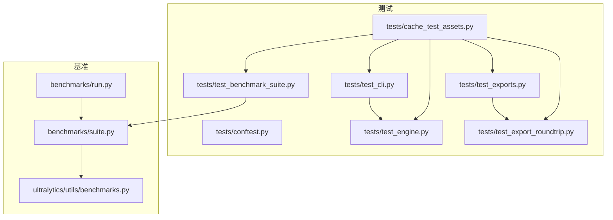
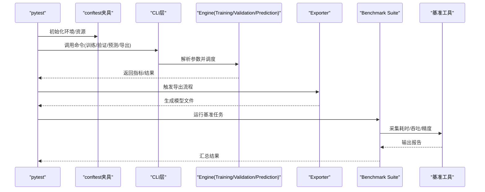
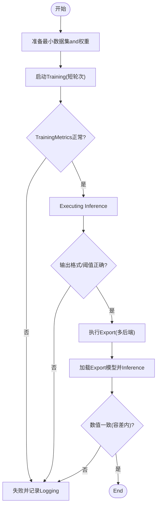
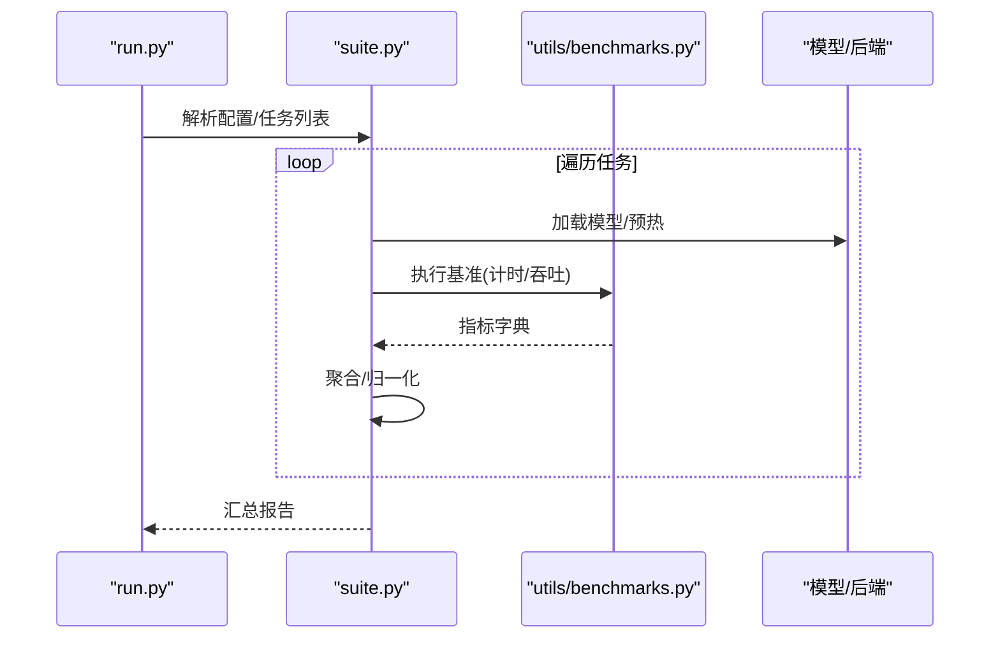
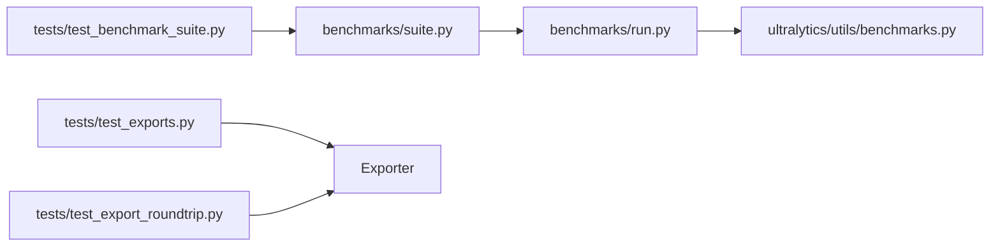

# Testing Framework

<cite>
**Files Referenced in This Document**
- [tests/conftest.py](file://tests/conftest.py)
- [tests/test_cli.py](file://tests/test_cli.py)
- [tests/test_engine.py](file://tests/test_engine.py)
- [tests/test_exports.py](file://tests/test_exports.py)
- [tests/test_export_roundtrip.py](file://tests/test_export_roundtrip.py)
- [tests/test_benchmark_suite.py](file://tests/test_benchmark_suite.py)
- [tests/cache_test_assets.py](file://tests/cache_test_assets.py)
- [benchmarks/suite.py](file://benchmarks/suite.py)
- [benchmarks/run.py](file://benchmarks/run.py)
- [ultralytics/utils/benchmarks.py](file://ultralytics/utils/benchmarks.py)
- [pyproject.toml](file://pyproject.toml)
</cite>

## Table of Contents
1. [Introduction](#Introduction)
2. [Project Structure](#Project Structure)
3. [Core Components](#Core Components)
4. [Architecture Overview](#Architecture Overview)
5. [Detailed Component Analysis](#Detailed Component Analysis)
6. [Dependency Analysis](#Dependency Analysis)
7. [性能考量](#性能考量)
8. [Troubleshooting Guide](#Troubleshooting Guide)
9. [Conclusion](#Conclusion)
10. [Appendix](#Appendix)

## Introduction
本文件targetingYOLO-Master项目的测试体系建设，覆盖单元测试、集成测试、端to端流程（Training/Inference/Export）、性能基准、回归测试、测试数据and模拟对象管理、覆盖率统计and质量门禁、分布式and并行执行Optimization、自定义测试工具编写Centered onand调试失败方法。DocumentationCentered on仓库现有测试and基准代码for依据，provides可落地的实践建议andVisualization说明，帮助团队while持续集成中稳定保障模型capabilitiesand工程健壮性。

## Project Structure
仓库的测试and基准相关组织such as下：
- tests：pytest用例集合，包含CLI、引擎、Export、Benchmark Suiteetc.；conftest.pyprovides全局配置and夹具；cache_test_assets.py用于缓存测试资源。
- benchmarks：Benchmark Suite定义and运行入口，suite.py定义Tasks集，run.pyforUnified entry point。
- ultralytics/utils/benchmarks.py：通用基准工具函数。
- pyproject.toml：项目依赖andOptional测试依赖声明。

Figure Source
- [tests/conftest.py](file://tests/conftest.py)
- [tests/test_cli.py](file://tests/test_cli.py)
- [tests/test_engine.py](file://tests/test_engine.py)
- [tests/test_exports.py](file://tests/test_exports.py)
- [tests/test_export_roundtrip.py](file://tests/test_export_roundtrip.py)
- [tests/test_benchmark_suite.py](file://tests/test_benchmark_suite.py)
- [tests/cache_test_assets.py](file://tests/cache_test_assets.py)
- [benchmarks/suite.py](file://benchmarks/suite.py)
- [benchmarks/run.py](file://benchmarks/run.py)
- [ultralytics/utils/benchmarks.py](file://ultralytics/utils/benchmarks.py)

Section Source
- [tests/conftest.py](file://tests/conftest.py)
- [tests/test_cli.py](file://tests/test_cli.py)
- [tests/test_engine.py](file://tests/test_engine.py)
- [tests/test_exports.py](file://tests/test_exports.py)
- [tests/test_export_roundtrip.py](file://tests/test_export_roundtrip.py)
- [tests/test_benchmark_suite.py](file://tests/test_benchmark_suite.py)
- [tests/cache_test_assets.py](file://tests/cache_test_assets.py)
- [benchmarks/suite.py](file://benchmarks/suite.py)
- [benchmarks/run.py](file://benchmarks/run.py)
- [ultralytics/utils/benchmarks.py](file://ultralytics/utils/benchmarks.py)

## Core Components
- pytest配置and夹具：Viaconftest集中管理Device Selection、临时Table of Contents、数据集路径、随机种子、Logging级别etc.，确保用例可重复and环境隔离。
- CLIand引擎测试：ValidationCommand Line Interface参数解析、错误传播、Training/Validation/Prediction/Exportetc.主流程的基本可用性。
- Exportand往返一致性：覆盖多后端Exportand加载后的数值一致性检查，保证Export链路正确。
- Benchmark Suite：基于suite.py定义Tasks矩阵，run.py作forUnified entry point，Combiningutils/benchmarks进行Metrics采集and结果汇总。
- 测试资产缓存：cache_test_assets.py负责下载/缓存小样本数据and权重，加速本地andCI执行。

Section Source
- [tests/conftest.py](file://tests/conftest.py)
- [tests/test_cli.py](file://tests/test_cli.py)
- [tests/test_engine.py](file://tests/test_engine.py)
- [tests/test_exports.py](file://tests/test_exports.py)
- [tests/test_export_roundtrip.py](file://tests/test_export_roundtrip.py)
- [tests/test_benchmark_suite.py](file://tests/test_benchmark_suite.py)
- [tests/cache_test_assets.py](file://tests/cache_test_assets.py)
- [benchmarks/suite.py](file://benchmarks/suite.py)
- [benchmarks/run.py](file://benchmarks/run.py)
- [ultralytics/utils/benchmarks.py](file://ultralytics/utils/benchmarks.py)

## Architecture Overview
下图展示从用例to引擎、Exportand基准的Calls关系，体现端to端闭环：CLI触发引擎，引擎drivers are installedTraining/Validation/Prediction/Export；Export产物进入往返校验或基准Evaluation。

Figure Source
- [tests/test_cli.py](file://tests/test_cli.py)
- [tests/test_engine.py](file://tests/test_engine.py)
- [tests/test_exports.py](file://tests/test_exports.py)
- [tests/test_export_roundtrip.py](file://tests/test_export_roundtrip.py)
- [tests/test_benchmark_suite.py](file://tests/test_benchmark_suite.py)
- [benchmarks/suite.py](file://benchmarks/suite.py)
- [benchmarks/run.py](file://benchmarks/run.py)
- [ultralytics/utils/benchmarks.py](file://ultralytics/utils/benchmarks.py)

## Detailed Component Analysis

### 单元测试：pytest框架Usesand最佳实践
- 命名and组织
  - 文件名Centered ontest_前缀，Modules按功能域划分（such asengine、exports、benchmark_suite）。
  - 每个用例聚焦单一职责，避免跨Modules耦合。
- 断言策略
  - 对数值型Metrics采用近似比较（容忍浮点误差），对布尔/枚举采用精确匹配。
  - 对异常路径Uses异常类型and消息片段断言，确保错误语义稳定。
- 夹具and共享状态
  - whileconftest中定义设备、临时Table of Contents、数据集路径、随机种子etc.夹具，减少重复设置。
  - Usessession级或module级夹具缓存昂贵资源（such as小权重、小数据集）。
- 参数化and组合
  - Uses参数化覆盖不同模型/Tasks/后端组合，控制用例规模and时长。
- 可重复性and隔离
  - 固定随机种子、禁用外部网络访问（必要时显式允许）、清理临时文件。

Section Source
- [tests/conftest.py](file://tests/conftest.py)
- [tests/test_cli.py](file://tests/test_cli.py)
- [tests/test_engine.py](file://tests/test_engine.py)

### 集成测试：Training/Inference/Export的端to端设计
- Training端to端
  - Uses最小数据集and极短轮次，Validation损失收敛方向、Logging输出、权重保存。
  - 校验关键回调and中间Metrics是否按预期写入。
- Inference端to端
  - 输入图像/视频流，断言输出格式、类别映射、Confidence Threshold过滤、NMS行for。
- Export端to端
  - 覆盖常用后端（such asONNX/TensorRT/OpenVINOetc.，视可用后端而定），断言Export成功and文件大小范围。
- 往返一致性
  - 将Export模型重新加载，对比原始andExport后Inference结果的数值差异，设定合理容差。

Figure Source
- [tests/test_engine.py](file://tests/test_engine.py)
- [tests/test_exports.py](file://tests/test_exports.py)
- [tests/test_export_roundtrip.py](file://tests/test_export_roundtrip.py)

Section Source
- [tests/test_engine.py](file://tests/test_engine.py)
- [tests/test_exports.py](file://tests/test_exports.py)
- [tests/test_export_roundtrip.py](file://tests/test_export_roundtrip.py)

### 性能基准测试：套件设计and结果分析
- 套件设计
  - suite.py定义Tasks矩阵（模型×Tasks×后端×数据规模），run.py作forUnified entry point解析参数并分发。
  - Usesutils/benchmarks中的工具函数进行计时、吞吐计算and结果聚合。
- Metricsand报告
  - 延迟、吞吐、内存占用、精度变化；输出结构化报告便于趋势追踪。
- 基线and回归
  - 将历史结果作for基线，新结果and之对比，超阈则告警。

Figure Source
- [benchmarks/run.py](file://benchmarks/run.py)
- [benchmarks/suite.py](file://benchmarks/suite.py)
- [ultralytics/utils/benchmarks.py](file://ultralytics/utils/benchmarks.py)

Section Source
- [benchmarks/suite.py](file://benchmarks/suite.py)
- [benchmarks/run.py](file://benchmarks/run.py)
- [ultralytics/utils/benchmarks.py](file://ultralytics/utils/benchmarks.py)

### 回归测试：防止破坏既有功能
- 快速冒烟
  - 针对核心路径（CLI、引擎、Export）的最小用例集，每次提交必跑。
- 数值回归
  - 对关键MetricsandExport模型输出建立阈值门控，超出阈值即阻断合并。
- 配置Drift Detection
  - 对默认配置变更进行影响面Evaluation，必要时触发更全面的回归套件。

Section Source
- [tests/test_cli.py](file://tests/test_cli.py)
- [tests/test_engine.py](file://tests/test_engine.py)
- [tests/test_exports.py](file://tests/test_exports.py)

### 测试数据管理and模拟对象
- 数据缓存
  - cache_test_assets.py负责下载/缓存小样本数据and权重，避免重复Network requests。
- 数据契约
  - 约定数据集最小结构and标签格式，确保各用例可复用同一份数据。
- 模拟and桩
  - 对External Dependencies（such as网络、硬件特性）Usesmock/patch，保证离线可测and稳定性。

Section Source
- [tests/cache_test_assets.py](file://tests/cache_test_assets.py)

### 覆盖率统计and质量门禁
- 覆盖率收集
  - Usespytest-cov收集覆盖率，按Modules/行粒度输出HTML/XML报告。
- 质量门禁
  - whileCI中设置最低覆盖率阈值and关键路径覆盖率要求，未达标则失败。
- 依赖声明
  - pyproject.toml中声明Optional测试依赖，便于按需安装。

Section Source
- [pyproject.toml](file://pyproject.toml)

### 分布式测试and并行执行Optimization
- 并行执行
  - Usespytest-xdistwhile多进程下并行运行用例，缩短整体时间。
- Distributed Training/Inference
  - 针对DDP/MOEetc.场景，providessmokeandvalidation用例，确保通信and同步逻辑正确。
- 资源隔离
  - forGPU密集型用例分配独立工作进程，避免资源争用导致不稳定。

Section Source
- [tests/test_benchmark_suite.py](file://tests/test_benchmark_suite.py)

### 自定义测试工具and调试技巧
- 自定义工具
  - whilescripts或tools下provides辅助脚本，such as批量ExportValidation、路由诊断、Metrics对比etc.。
- 调试失败
  - 启用详细Logging、打印中间张量形状and数值分布、保存失败样例and中间产物Centered on便复现。
- 断点and单步
  - while关键路径插入断点，Combined withIDE逐步定位问题根因。

Section Source
- [tests/test_cli.py](file://tests/test_cli.py)
- [tests/test_engine.py](file://tests/test_engine.py)

## Dependency Analysis
- 测试and基准之间的依赖
  - test_benchmark_suite依赖benchmarks/suiteandrun，后者再依赖utils/benchmarks。
  - exportandroundtrip测试依赖Exporterand加载器，形成闭环。
- External Dependencies
  - pytest生态（pytest、pytest-xdist、pytest-covetc.）andOptional后端库。

Figure Source
- [tests/test_benchmark_suite.py](file://tests/test_benchmark_suite.py)
- [benchmarks/suite.py](file://benchmarks/suite.py)
- [benchmarks/run.py](file://benchmarks/run.py)
- [ultralytics/utils/benchmarks.py](file://ultralytics/utils/benchmarks.py)
- [tests/test_exports.py](file://tests/test_exports.py)
- [tests/test_export_roundtrip.py](file://tests/test_export_roundtrip.py)

Section Source
- [tests/test_benchmark_suite.py](file://tests/test_benchmark_suite.py)
- [benchmarks/suite.py](file://benchmarks/suite.py)
- [benchmarks/run.py](file://benchmarks/run.py)
- [ultralytics/utils/benchmarks.py](file://ultralytics/utils/benchmarks.py)
- [tests/test_exports.py](file://tests/test_exports.py)
- [tests/test_export_roundtrip.py](file://tests/test_export_roundtrip.py)

## 性能考量
- 用例分层
  - 快速路径（秒级）用于频繁提交；慢速路径（Minutes/小时级）用于定时Tasks。
- 资源复用
  - 会话级夹具缓存模型and数据，减少IOand加载开销。
- 并行and隔离
  - Uses-xdist并行，同时forGPU用例隔离进程，避免相互干扰。
- 结果持久化
  - 基准结果and覆盖率报告持久化，便于趋势分析and回溯。

[This section provides general guidance and does not directly analyze specific files]

## Troubleshooting Guide
- 常见问题
  - 资源缺失：确认cache_test_assets已执行且路径正确。
  - 权限/路径：检查临时Table of Contents读写权限and磁盘空间。
  - 设备不可用：当无GPU时跳过或降级toCPU路径。
- 定位步骤
  - 缩小范围：仅运行失败用例and其依赖夹具。
  - 增强Logging：提高Logging级别，捕获关键中间状态。
  - 复现实例：保存失败时的输入and中间产物，构造最小复现。
- 修复Validation
  - 先跑快速冒烟，再扩展至完整套件；必要时增加针对性回归用例。

Section Source
- [tests/cache_test_assets.py](file://tests/cache_test_assets.py)
- [tests/test_cli.py](file://tests/test_cli.py)
- [tests/test_engine.py](file://tests/test_engine.py)

## Conclusion
Via分层化的测试体系（单元/集成/端to端/基准/回归）、完善的夹具and资源管理、严格的覆盖率and质量门禁，Centered onand并行and分布式Optimization，YOLO-Master能够While maintaining高迭代效率，稳定保障模型capabilitiesand工程健壮性。建议持续完善基准基线、强化数值回归门控，并将更多关键路径纳入自动化流水线。

## Appendix
- 常用命令
  - 运行全部用例：pytest
  - 并行执行：pytest -n auto
  - 覆盖率报告：pytest --cov=ultralytics --cov-report=html
  - 指定标记：pytest -m "fast" / "-m "slow""
- Refer to文件
  - 测试配置and夹具：tests/conftest.py
  - CLIand引擎用例：tests/test_cli.py, tests/test_engine.py
  - Exportand往返：tests/test_exports.py, tests/test_export_roundtrip.py
  - Benchmark Suite：benchmarks/suite.py, benchmarks/run.py, ultralytics/utils/benchmarks.py
  - 测试资源缓存：tests/cache_test_assets.py
  - 依赖andOptional包：pyproject.toml