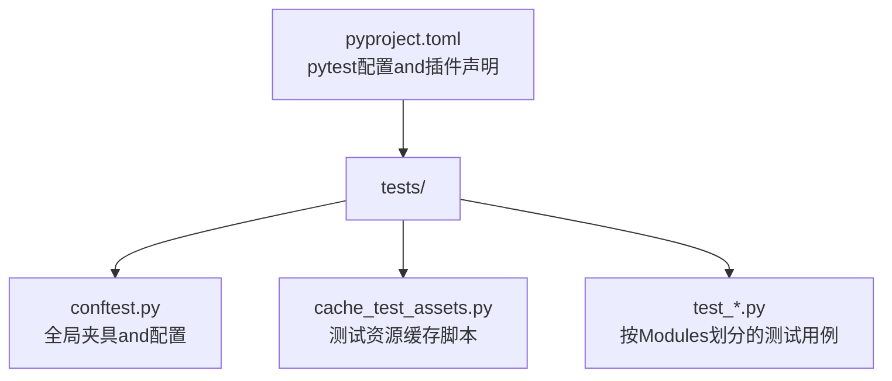
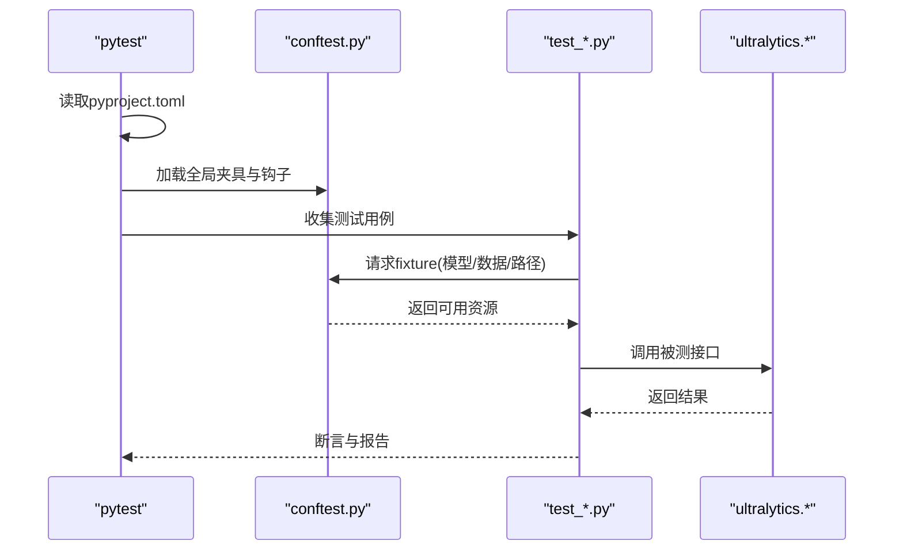
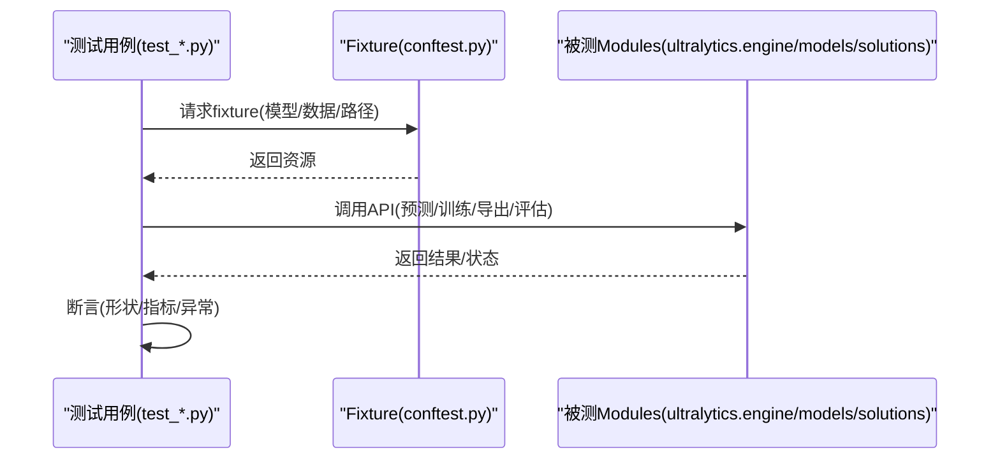
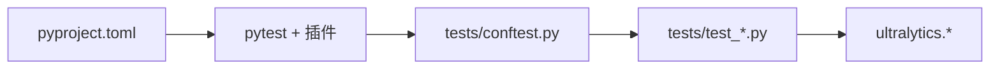

# 单元测试框架

<cite>
**Files Referenced in This Document**
- [tests/conftest.py](file://tests/conftest.py)
- [tests/cache_test_assets.py](file://tests/cache_test_assets.py)
- [pyproject.toml](file://pyproject.toml)
- [tests/test_cli.py](file://tests/test_cli.py)
- [tests/test_engine.py](file://tests/test_engine.py)
- [tests/test_exports.py](file://tests/test_exports.py)
- [tests/test_moe.py](file://tests/test_moe.py)
- [tests/test_molora.py](file://tests/test_molora.py)
- [tests/test_mot.py](file://tests/test_mot.py)
- [tests/test_solutions.py](file://tests/test_solutions.py)
</cite>

## Table of Contents
1. [Introduction](#Introduction)
2. [Project Structure](#Project Structure)
3. [Core Components](#Core Components)
4. [Architecture Overview](#Architecture Overview)
5. [Detailed Component Analysis](#Detailed Component Analysis)
6. [Dependency Analysis](#Dependency Analysis)
7. [Performance Considerations](#Performance Considerations)
8. [Troubleshooting Guide](#Troubleshooting Guide)
9. [Conclusion](#Conclusion)
10. [Appendix](#Appendix)

## Introduction
本文件targetingYOLO-Master项目的单元测试体系，聚焦pytest框架的配置andUses、测试组织and命名约定、conftest夹具的编写and复用、断言库最佳实践、模拟对象（Mock）策略（含PyTorch模型andData Loading器）、异步测试方法、测试数据管理and缓存、Centered onand覆盖率统计and报告生成。Documentation旨while帮助开发者快速上手并高质量地维护Test Suite。

## Project Structure
测试代码集中于testsTable of Contents，采用“按功能/Modules划分”的组织方式：每个被测Modules或特性对应一个或多个test_*.py文件；共享的夹具、钩子and全局配置放whileconftest.py中；测试资源and缓存脚本位于testsTable of Contents下。

Figure Source
- [tests/conftest.py](file://tests/conftest.py)
- [tests/cache_test_assets.py](file://tests/cache_test_assets.py)
- [pyproject.toml](file://pyproject.toml)

Section Source
- [tests/conftest.py](file://tests/conftest.py)
- [tests/cache_test_assets.py](file://tests/cache_test_assets.py)
- [pyproject.toml](file://pyproject.toml)

## Core Components
- pytest配置and插件
  - Viapyproject.toml集中管理pytest行for、标记、插件and参数。
- conftest夹具and生命周期
  - whiletests/conftest.py中定义可复用的fixture，Supporting不同作用域（function/sessionetc.），并Via依赖注入for测试provides环境、模型、数据集路径etc.。
- 测试资源and缓存
  - tests/cache_test_assets.py用于准备和缓存小体积测试数据集、权重或中间产物，避免重复下载andIO开销。
- Modules化测试用例
  - Centered ontest_*.py命名，按功能域拆分，便于并行执行and定位问题。

Section Source
- [pyproject.toml](file://pyproject.toml)
- [tests/conftest.py](file://tests/conftest.py)
- [tests/cache_test_assets.py](file://tests/cache_test_assets.py)

## Architecture Overview
下图展示测试运行时的关键交互：pytest启动后加载pyproject.toml配置，发现tests下的测试文件，按需解析conftest中的fixture，并while测试执行期间Calls被测试Modules（such asengine、models、solutionsetc.）。

Figure Source
- [pyproject.toml](file://pyproject.toml)
- [tests/conftest.py](file://tests/conftest.py)
- [tests/test_engine.py](file://tests/test_engine.py)
- [tests/test_moe.py](file://tests/test_moe.py)
- [tests/test_molora.py](file://tests/test_molora.py)
- [tests/test_mot.py](file://tests/test_mot.py)
- [tests/test_solutions.py](file://tests/test_solutions.py)

## Detailed Component Analysis

### pytest配置and插件（pyproject.toml）
- 建议将pytest相关配置集中whilepyproject.toml中，包括：
  - 插件启用（such aspytest-cov、pytest-xdistetc.）
  - 默认命令行参数（such as-v、--tb=short、--strict-markers）
  - 自定义标记（markers）and忽略规则
  - 覆盖范围and输出路径
- Advantages：Unified entry point、版本可控、CI友好。

Section Source
- [pyproject.toml](file://pyproject.toml)

### 测试夹具and复用机制（conftest.py）
- 作用域管理
  - function：每个测试函数独立实例化，适合隔离性要求高的场景。
  - class/module/session：跨用例共享，适合昂贵资源（such as模型加载、数据集构建）。
- 依赖注入
  - fixture之间可Centered on互相依赖，形成清晰的资源装配链。
  - Combiningautouse=True可implementing自动初始化/清理逻辑。
- 推荐模式
  - 将“路径类”、“配置类”、“轻量模型/数据构造”拆分for多个细粒度fixture，组合Uses。
  - 对需要GPU/分布式环境的fixture进行条件跳过或降级处理。

Section Source
- [tests/conftest.py](file://tests/conftest.py)

### 测试数据and缓存策略（cache_test_assets.py）
- 目标
  - 预置小体积数据集/权重/中间产物，减少网络IOand磁盘占用。
- 策略
  - 首次运行时生成并缓存to固定Table of Contents；后续直接复用。
  - provides校验and重建开关，保证一致性。
- 集成
  - whileconftest中Viafixture引用缓存路径，供测试直接Uses。

Section Source
- [tests/cache_test_assets.py](file://tests/cache_test_assets.py)

### 断言库and最佳实践
- 标准断言
  - PreferpytestBuilt-in断言（such asassert x == y），Centered on获得更友好的失败信息。
- 自定义断言
  - whileconftest或utils中Encapsulates领域专用断言（such as张量形状、数值容差、Metrics阈值），提升可读性and复用性。
- 常见技巧
  - Usespytest.approx进行浮点近似比较。
  - 对异常路径Usespytest.raises上下文管理器。
  - 对多分支逻辑Uses参数化（@pytest.mark.parametrize）drivers are installed。

Section Source
- [tests/conftest.py](file://tests/conftest.py)

### 模拟对象（Mock）策略
- PyTorch模型模拟
  - Usesunittest.mock.patch替换forward/Training循环etc.关键方法，Validation控制流and错误传播。
  - 对大型模型仅mock必要接口，避免真实Inference带来的开销。
- Data Loading器模拟
  - 用生成器或简单迭代器替代真实DataLoader，确保稳定且快速的批数据产出。
- External Dependencies
  - 对Network requests、文件系统、Logging写入etc.进行mock，保证离线可测and确定性。

Section Source
- [tests/conftest.py](file://tests/conftest.py)

### 异步测试（async/await）
- 若被测接口for协程，测试函数需声明forasync def，并Usespytest-asyncio运行。
- whileconftest中注册必要的异步fixture，确保事件循环正确创建and销毁。
- 注意：避免while异步测试中进行阻塞IO操作。

Section Source
- [tests/conftest.py](file://tests/conftest.py)

### 典型测试流程时序（Centered on引擎/Export/Tasksfor例）

Figure Source
- [tests/test_engine.py](file://tests/test_engine.py)
- [tests/test_exports.py](file://tests/test_exports.py)
- [tests/test_moe.py](file://tests/test_moe.py)
- [tests/test_molora.py](file://tests/test_molora.py)
- [tests/test_mot.py](file://tests/test_mot.py)
- [tests/test_solutions.py](file://tests/test_solutions.py)

## Dependency Analysis
- 测试and源码耦合
  - 测试主要依赖ultralytics包内的engine、models、solutionsetc.Modules；Viafixture注入最小必要依赖，降低耦合度。
- 插件and工具
  - pytest-cov用于覆盖率统计；pytest-xdist用于并行执行；pytest-asyncio用于异步测试。
- 潜while风险
  - 大模型或大数据集fixture应避免while短耗时用例中加载；必要时Usessession级fixture+缓存。

Figure Source
- [pyproject.toml](file://pyproject.toml)
- [tests/conftest.py](file://tests/conftest.py)
- [tests/test_cli.py](file://tests/test_cli.py)
- [tests/test_engine.py](file://tests/test_engine.py)
- [tests/test_exports.py](file://tests/test_exports.py)
- [tests/test_moe.py](file://tests/test_moe.py)
- [tests/test_molora.py](file://tests/test_molora.py)
- [tests/test_mot.py](file://tests/test_mot.py)
- [tests/test_solutions.py](file://tests/test_solutions.py)

Section Source
- [pyproject.toml](file://pyproject.toml)
- [tests/conftest.py](file://tests/conftest.py)
- [tests/test_cli.py](file://tests/test_cli.py)
- [tests/test_engine.py](file://tests/test_engine.py)
- [tests/test_exports.py](file://tests/test_exports.py)
- [tests/test_moe.py](file://tests/test_moe.py)
- [tests/test_molora.py](file://tests/test_molora.py)
- [tests/test_mot.py](file://tests/test_mot.py)
- [tests/test_solutions.py](file://tests/test_solutions.py)

## Performance Considerations
- 并行执行
  - Usespytest-xdist分片执行，缩短整体时长；注意避免共享可变状态。
- 资源复用
  - 将昂贵fixture设formodule或session作用域，Combined with缓存脚本减少IO。
- 选择性执行
  - Usespytest标记（such as@slow、@gpu）筛选用例，加速本地开发反馈。
- 内存and显存
  - and时释放模型and中间张量；避免while长生命周期fixture中持有大对象。

[This section provides general guidance and does not directly analyze specific files]

## Troubleshooting Guide
- 常见问题
  - 测试不稳定：检查随机种子、并发冲突、共享状态。
  - 资源缺失：确认缓存脚本是否成功生成，路径是否正确。
  - 环境差异：whilefixture中做设备/后端可用性检测并跳过不适配用例。
- 定位技巧
  - Uses-vvand--tb=long获取详细堆栈。
  - 针对单个文件/函数执行，缩小范围。
  - 打印fixture解析顺序（pytest --fixtures）辅助调试。

Section Source
- [tests/conftest.py](file://tests/conftest.py)

## Conclusion
through a unifiedpytest配置、清晰的conftest夹具分层、稳定的测试数据缓存、合理的Mock策略and异步测试Supporting，YOLO-Master的测试体系能够While maintaining高覆盖率兼顾执行效率and可维护性。建议while持续集成中开启并行and覆盖率报告，并对慢用例进行分级and隔离。

[This section is summary content and does not directly analyze specific files]

## Appendix

### Quick Command Reference
- 运行全部测试：pytest
- 并行执行：pytest -n auto
- 指定标记：pytest -m "not slow"
- 覆盖率：pytest --cov=ultralytics --cov-report=term-missing
- 单文件/函数：pytest tests/test_engine.py::test_xxx -vv

[This section provides general guidance and does not directly analyze specific files]