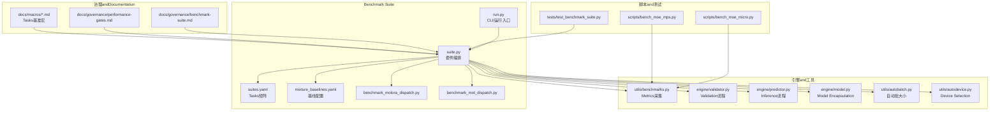
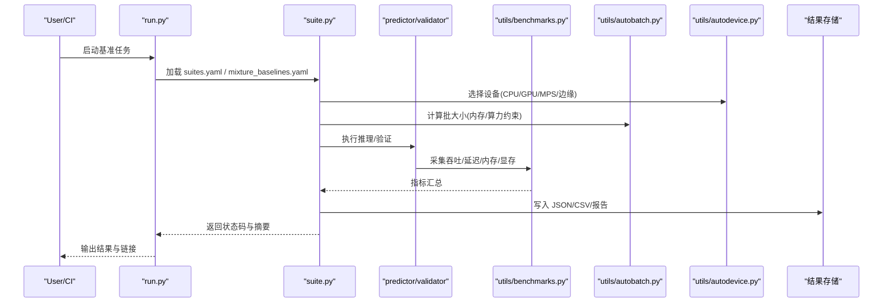
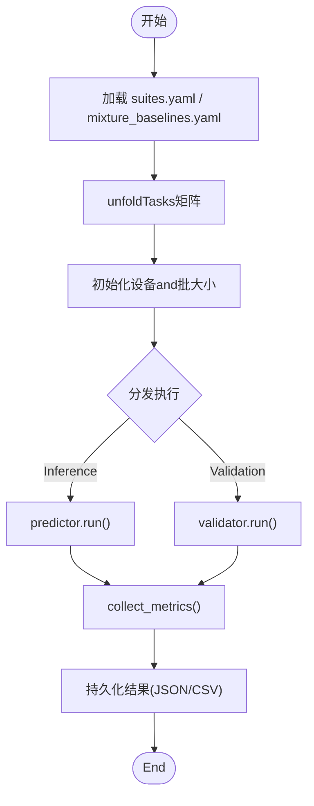
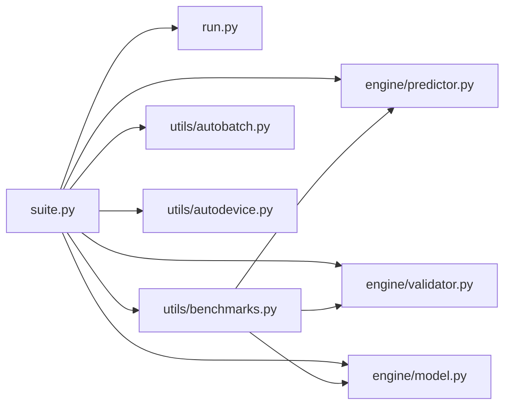

# 基准Test Suite

<cite>
**Files Referenced in This Document**
- [benchmarks/suite.py](file://benchmarks/suite.py)
- [benchmarks/run.py](file://benchmarks/run.py)
- [benchmarks/suites.yaml](file://benchmarks/suites.yaml)
- [benchmarks/mixture_baselines.yaml](file://benchmarks/mixture_baselines.yaml)
- [benchmarks/benchmark_molora_dispatch.py](file://benchmarks/benchmark_molora_dispatch.py)
- [benchmarks/benchmark_mot_dispatch.py](file://benchmarks/benchmark_mot_dispatch.py)
- [tests/test_benchmark_suite.py](file://tests/test_benchmark_suite.py)
- [ultralytics/utils/benchmarks.py](file://ultralytics/utils/benchmarks.py)
- [ultralytics/engine/validator.py](file://ultralytics/engine/validator.py)
- [ultralytics/engine/predictor.py](file://ultralytics/engine/predictor.py)
- [ultralytics/engine/model.py](file://ultralytics/engine/model.py)
- [ultralytics/utils/autobatch.py](file://ultralytics/utils/autobatch.py)
- [ultralytics/utils/autodevice.py](file://ultralytics/utils/autodevice.py)
- [scripts/bench_moe_micro.py](file://scripts/bench_moe_micro.py)
- [scripts/bench_moe_mps.py](file://scripts/bench_moe_mps.py)
- [docs/governance/benchmark-suite.md](file://docs/governance/benchmark-suite.md)
- [docs/governance/performance-gates.md](file://docs/governance/performance-gates.md)
- [docs/macros/yolo-det-perf.md](file://docs/macros/yolo-det-perf.md)
- [docs/macros/yolo-seg-perf.md](file://docs/macros/yolo-seg-perf.md)
- [docs/macros/yolo-pose-perf.md](file://docs/macros/yolo-obb-perf.md)
- [docs/macros/yolo-cls-perf.md](file://docs/macros/yolo-cls-perf.md)
- [docs/macros/yolo-semantic-perf.md](file://docs/macros/yolo-semantic-perf.md)
- [docs/macros/yolo-semantic-ade20k-perf.md](file://docs/macros/yolo-semantic-ade20k-perf.md)
</cite>

## Table of Contents
1. [Introduction](#Introduction)
2. [Project Structure](#Project Structure)
3. [Core Components](#Core Components)
4. [Architecture Overview](#Architecture Overview)
5. [Detailed Component Analysis](#Detailed Component Analysis)
6. [Dependency Analysis](#Dependency Analysis)
7. [性能考量](#性能考量)
8. [Troubleshooting Guide](#Troubleshooting Guide)
9. [Conclusion](#Conclusion)
10. [Appendix](#Appendix)

## Introduction
本文件for YOLO-Master 项目的基准Test Suiteprovides系统化Documentation，覆盖整体架构、用例组织and执行引擎、Metrics采集and计算方法、多硬件平台配置、结果分析andVisualization、CI/CD 集成策略Centered onand自定义基准用例开发指南。目标读者包括算法Engineers、系统Engineersand质量保障人员，旨while帮助团队while不同Tasks（检测、分割、姿态、分类、Semantic Segmentationetc.）和不同后端（CPU/GPU/边缘设备）上稳定、可复现地Evaluation模型性能。

## Project Structure
基准测试相关代码主要分布whileCentered on下位置：
- benchmarks：Benchmark Suite入口、调度器、Tasks定义and基线数据
- ultralytics/utils/benchmarks.py：通用基准工具（吞吐/延迟/内存etc.）
- ultralytics/engine/*：InferenceandValidation引擎（Predictor、Validator、Model Encapsulation）
- scripts/*：targeting特定场景的基准脚本（such as MoE 微基准、MPS 基准）
- tests/test_benchmark_suite.py：Benchmark Suite回归and冒烟测试
- docs/governance/*：基准治理规范and性能门禁
- docs/macros/*：各Tasks的基准宏模板（用于报告生成）

Figure Source
- [benchmarks/suite.py](file://benchmarks/suite.py)
- [benchmarks/run.py](file://benchmarks/run.py)
- [benchmarks/suites.yaml](file://benchmarks/suites.yaml)
- [benchmarks/mixture_baselines.yaml](file://benchmarks/mixture_baselines.yaml)
- [benchmarks/benchmark_molora_dispatch.py](file://benchmarks/benchmark_molora_dispatch.py)
- [benchmarks/benchmark_mot_dispatch.py](file://benchmarks/benchmark_mot_dispatch.py)
- [ultralytics/utils/benchmarks.py](file://ultralytics/utils/benchmarks.py)
- [ultralytics/engine/validator.py](file://ultralytics/engine/validator.py)
- [ultralytics/engine/predictor.py](file://ultralytics/engine/predictor.py)
- [ultralytics/engine/model.py](file://ultralytics/engine/model.py)
- [ultralytics/utils/autobatch.py](file://ultralytics/utils/autobatch.py)
- [ultralytics/utils/autodevice.py](file://ultralytics/utils/autodevice.py)
- [scripts/bench_moe_micro.py](file://scripts/bench_moe_micro.py)
- [scripts/bench_moe_mps.py](file://scripts/bench_moe_mps.py)
- [tests/test_benchmark_suite.py](file://tests/test_benchmark_suite.py)
- [docs/governance/benchmark-suite.md](file://docs/governance/benchmark-suite.md)
- [docs/governance/performance-gates.md](file://docs/governance/performance-gates.md)
- [docs/macros/yolo-det-perf.md](file://docs/macros/yolo-det-perf.md)
- [docs/macros/yolo-seg-perf.md](file://docs/macros/yolo-seg-perf.md)
- [docs/macros/yolo-pose-perf.md](file://docs/macros/yolo-pose-perf.md)
- [docs/macros/yolo-obb-perf.md](file://docs/macros/yolo-obb-perf.md)
- [docs/macros/yolo-cls-perf.md](file://docs/macros/yolo-cls-perf.md)
- [docs/macros/yolo-semantic-perf.md](file://docs/macros/yolo-semantic-perf.md)
- [docs/macros/yolo-semantic-ade20k-perf.md](file://docs/macros/yolo-semantic-ade20k-perf.md)

Section Source
- [benchmarks/suite.py](file://benchmarks/suite.py)
- [benchmarks/run.py](file://benchmarks/run.py)
- [benchmarks/suites.yaml](file://benchmarks/suites.yaml)
- [benchmarks/mixture_baselines.yaml](file://benchmarks/mixture_baselines.yaml)
- [benchmarks/benchmark_molora_dispatch.py](file://benchmarks/benchmark_molora_dispatch.py)
- [benchmarks/benchmark_mot_dispatch.py](file://benchmarks/benchmark_mot_dispatch.py)
- [ultralytics/utils/benchmarks.py](file://ultralytics/utils/benchmarks.py)
- [ultralytics/engine/validator.py](file://ultralytics/engine/validator.py)
- [ultralytics/engine/predictor.py](file://ultralytics/engine/predictor.py)
- [ultralytics/engine/model.py](file://ultralytics/engine/model.py)
- [ultralytics/utils/autobatch.py](file://ultralytics/utils/autobatch.py)
- [ultralytics/utils/autodevice.py](file://ultralytics/utils/autodevice.py)
- [scripts/bench_moe_micro.py](file://scripts/bench_moe_micro.py)
- [scripts/bench_moe_mps.py](file://scripts/bench_moe_mps.py)
- [tests/test_benchmark_suite.py](file://tests/test_benchmark_suite.py)
- [docs/governance/benchmark-suite.md](file://docs/governance/benchmark-suite.md)
- [docs/governance/performance-gates.md](file://docs/governance/performance-gates.md)
- [docs/macros/yolo-det-perf.md](file://docs/macros/yolo-det-perf.md)
- [docs/macros/yolo-seg-perf.md](file://docs/macros/yolo-seg-perf.md)
- [docs/macros/yolo-pose-perf.md](file://docs/macros/yolo-pose-perf.md)
- [docs/macros/yolo-obb-perf.md](file://docs/macros/yolo-obb-perf.md)
- [docs/macros/yolo-cls-perf.md](file://docs/macros/yolo-cls-perf.md)
- [docs/macros/yolo-semantic-perf.md](file://docs/macros/yolo-semantic-perf.md)
- [docs/macros/yolo-semantic-ade20k-perf.md](file://docs/macros/yolo-semantic-ade20k-perf.md)

## Core Components
- 套件编排器（suite.py）：负责加载 suites.yaml and mixture_baselines.yaml，解析Tasks矩阵（模型×数据集×Tasks×设备），并drivers are installed执行引擎。
- 运行入口（run.py）：provides CLI 或 API Calls方式，Supporting按标签/Tasks筛选、并发控制、输出路径andLogging级别设置。
- Metrics采集（utils/benchmarks.py）：统一Encapsulates吞吐、延迟（P50/P95/P99）、内存峰值、显存占用、I/O 耗时etc.Metrics的采集and聚合。
- Validation/Inference引擎（engine/validator.py, engine/predictor.py, engine/model.py）：分别承担Validation集评测andBatch Inference流程；model.py 作for对外Encapsulates，屏蔽后端差异。
- 自动批大小andDevice Selection（utils/autobatch.py, utils/autodevice.py）：根据硬件capabilitiesand内存约束动态调整批大小and设备，提升稳定性and可比性。
- 专项基准脚本（scripts/bench_moe_micro.py, scripts/bench_moe_mps.py）：针对 MoE 路由、专家负载and MPS 后端的微基准，便于快速定位bottlenecks。
- 治理and门禁（docs/governance/benchmark-suite.md, docs/governance/performance-gates.md）：定义基准规范、Via阈值and回归告警策略。
- Tasks基准宏（docs/macros/*.md）：for不同Tasksprovides统一的报告模板andMetrics口径，确保跨版本对比一致性。

Section Source
- [benchmarks/suite.py](file://benchmarks/suite.py)
- [benchmarks/run.py](file://benchmarks/run.py)
- [ultralytics/utils/benchmarks.py](file://ultralytics/utils/benchmarks.py)
- [ultralytics/engine/validator.py](file://ultralytics/engine/validator.py)
- [ultralytics/engine/predictor.py](file://ultralytics/engine/predictor.py)
- [ultralytics/engine/model.py](file://ultralytics/engine/model.py)
- [ultralytics/utils/autobatch.py](file://ultralytics/utils/autobatch.py)
- [ultralytics/utils/autodevice.py](file://ultralytics/utils/autodevice.py)
- [scripts/bench_moe_micro.py](file://scripts/bench_moe_micro.py)
- [scripts/bench_moe_mps.py](file://scripts/bench_moe_mps.py)
- [docs/governance/benchmark-suite.md](file://docs/governance/benchmark-suite.md)
- [docs/governance/performance-gates.md](file://docs/governance/performance-gates.md)
- [docs/macros/yolo-det-perf.md](file://docs/macros/yolo-det-perf.md)
- [docs/macros/yolo-seg-perf.md](file://docs/macros/yolo-seg-perf.md)
- [docs/macros/yolo-pose-perf.md](file://docs/macros/yolo-pose-perf.md)
- [docs/macros/yolo-obb-perf.md](file://docs/macros/yolo-obb-perf.md)
- [docs/macros/yolo-cls-perf.md](file://docs/macros/yolo-cls-perf.md)
- [docs/macros/yolo-semantic-perf.md](file://docs/macros/yolo-semantic-perf.md)
- [docs/macros/yolo-semantic-ade20k-perf.md](file://docs/macros/yolo-semantic-ade20k-perf.md)

## Architecture Overview
基准Test Suite采用“配置drivers are installed + 引擎抽象”的分层架构：
- 配置层：suites.yaml 描述Tasks矩阵（模型、数据集、Tasks类型、设备、批大小、预热轮次etc.），mixture_baselines.yaml provides基线对照。
- 编排层：suite.py 解析配置，构建执行计划，管理并发and资源隔离。
- 执行层：Via predictor/validator 对模型进行Inference/Validation，benchmarks.py 采集Metrics，autobatch/autodevice 保证环境一致性and稳定性。
- 产出层：结构化结果（JSON/CSV）andVisualization报告（HTML/Markdown），供 CI/CD and人工审阅。

Figure Source
- [benchmarks/run.py](file://benchmarks/run.py)
- [benchmarks/suite.py](file://benchmarks/suite.py)
- [ultralytics/utils/benchmarks.py](file://ultralytics/utils/benchmarks.py)
- [ultralytics/engine/predictor.py](file://ultralytics/engine/predictor.py)
- [ultralytics/engine/validator.py](file://ultralytics/engine/validator.py)
- [ultralytics/utils/autobatch.py](file://ultralytics/utils/autobatch.py)
- [ultralytics/utils/autodevice.py](file://ultralytics/utils/autodevice.py)

## Detailed Component Analysis

### 套件编排器（suite.py）
- 职责：读取 suites.yaml and mixture_baselines.yaml，unfoldTasks矩阵，生成执行计划；管理并发度、重试and失败隔离；汇总Metrics并持久化。
- 关键流程：
  - 解析配置项（模型权重、数据集路径、Tasks类型、设备、批大小、预热次数、采样数量）。
  - 初始化设备and批大小策略。
  - 分发to predictor/validator 执行。
  - 收集 metrics 并落盘。
- 扩展点：新增Tasks类型时，while suites.yaml 中声明即可；such as需新Metrics，扩展 benchmarks.py 并while suite.py 中注册。

Figure Source
- [benchmarks/suite.py](file://benchmarks/suite.py)
- [benchmarks/suites.yaml](file://benchmarks/suites.yaml)
- [benchmarks/mixture_baselines.yaml](file://benchmarks/mixture_baselines.yaml)
- [ultralytics/engine/predictor.py](file://ultralytics/engine/predictor.py)
- [ultralytics/engine/validator.py](file://ultralytics/engine/validator.py)
- [ultralytics/utils/benchmarks.py](file://ultralytics/utils/benchmarks.py)

Section Source
- [benchmarks/suite.py](file://benchmarks/suite.py)
- [benchmarks/suites.yaml](file://benchmarks/suites.yaml)
- [benchmarks/mixture_baselines.yaml](file://benchmarks/mixture_baselines.yaml)

### 运行入口（run.py）
- 职责：暴露Command Line Interface，Supporting按标签/Tasks过滤、并发线程数、输出Table of Contents、Logging级别、是否仅Exportetc.参数。
- Typical Usage：指定 suites 标签、设备、批大小、并发度、结果保存路径。
- 错误处理：捕获异常并记录上下文（模型、数据集、设备、批大小），便于复现问题。

Section Source
- [benchmarks/run.py](file://benchmarks/run.py)

### Metrics采集（utils/benchmarks.py）
- 吞吐（FPS）：单位时间内处理的样本数，通常基于有效Inference时间窗口统计。
- 延迟（ms）：单样本端to端延迟，常用 P50/P95/P99 分位数衡量尾部延迟。
- 内存Uses：进程 RSS 峰值、增量分配；GPU 显存峰值and平均占用。
- I/O 耗时：图像解码、预处理、NMS etc.阶段耗时分解。
- 聚合方法：按Tasks/模型/设备维度分组，计算均值/方差/分位数，并输出结构化结果。

Section Source
- [ultralytics/utils/benchmarks.py](file://ultralytics/utils/benchmarks.py)

### ValidationandInference引擎（validator.py, predictor.py, model.py）
- validator.py：targetingValidation集的精度+性能联合评测，Supporting多尺度、滑动窗口、TTA etc.选项。
- predictor.py：targetingBatch Inference的高吞吐路径，侧重吞吐and延迟Optimization。
- model.py：统一Encapsulates模型加载、设备Migration、Export格式兼容，屏蔽底层差异。

Section Source
- [ultralytics/engine/validator.py](file://ultralytics/engine/validator.py)
- [ultralytics/engine/predictor.py](file://ultralytics/engine/predictor.py)
- [ultralytics/engine/model.py](file://ultralytics/engine/model.py)

### 自动批大小andDevice Selection（autobatch.py, autodevice.py）
- autobatch.py：依据可用显存/内存、输入分辨率、模型规模估算最大稳定批大小，避免 OOM。
- autodevice.py：自动选择 CPU/GPU/MPS/NPU devices，并设置必要的运行时标志。

Section Source
- [ultralytics/utils/autobatch.py](file://ultralytics/utils/autobatch.py)
- [ultralytics/utils/autodevice.py](file://ultralytics/utils/autodevice.py)

### 专项基准脚本（scripts/bench_moe_micro.py, scripts/bench_moe_mps.py）
- bench_moe_micro.py：针对 MoE 路由and专家调度的微基准，测量路由开销、专家激活分布、Load Balancingetc.。
- bench_moe_mps.py：while Apple MPS 后端下的性能探针，关注内存拷贝and内核融合效果。

Section Source
- [scripts/bench_moe_micro.py](file://scripts/bench_moe_micro.py)
- [scripts/bench_moe_mps.py](file://scripts/bench_moe_mps.py)

### 基准治理and门禁（docs/governance/benchmark-suite.md, docs/governance/performance-gates.md）
- benchmark-suite.md：定义基准Tasks范围、数据版本、随机种子、预热策略、结果归档规范。
- performance-gates.md：定义性能门禁阈值（相对基线的退化容忍度）、回归告警and阻断规则。

Section Source
- [docs/governance/benchmark-suite.md](file://docs/governance/benchmark-suite.md)
- [docs/governance/performance-gates.md](file://docs/governance/performance-gates.md)

### Tasks基准宏（docs/macros/*.md）
- yolo-det-perf.md、yolo-seg-perf.md、yolo-pose-perf.md、yolo-obb-perf.md、yolo-cls-perf.md、yolo-semantic-perf.md、yolo-semantic-ade20k-perf.md：for不同Tasksprovides一致的Metrics口径and报告模板，便于横向对比and趋势追踪。

Section Source
- [docs/macros/yolo-det-perf.md](file://docs/macros/yolo-det-perf.md)
- [docs/macros/yolo-seg-perf.md](file://docs/macros/yolo-seg-perf.md)
- [docs/macros/yolo-pose-perf.md](file://docs/macros/yolo-pose-perf.md)
- [docs/macros/yolo-obb-perf.md](file://docs/macros/yolo-obb-perf.md)
- [docs/macros/yolo-cls-perf.md](file://docs/macros/yolo-cls-perf.md)
- [docs/macros/yolo-semantic-perf.md](file://docs/macros/yolo-semantic-perf.md)
- [docs/macros/yolo-semantic-ade20k-perf.md](file://docs/macros/yolo-semantic-ade20k-perf.md)

## Dependency Analysis
- 低耦合高内聚：suite.py 仅依赖配置and执行引擎，不直接implementingMetrics采集；Metrics采集集中while benchmarks.py，便于复用and替换。
- External Dependencies：torch/torchvision、OpenCV、Pillow、pyyaml、pandas、matplotlib/seaborn（Optional）etc.。
- Potential Cycles依赖：应避免 suite.py 反向导入 benchmarks.py 的具体implementing细节，保持单向依赖。

Figure Source
- [benchmarks/suite.py](file://benchmarks/suite.py)
- [benchmarks/run.py](file://benchmarks/run.py)
- [ultralytics/utils/benchmarks.py](file://ultralytics/utils/benchmarks.py)
- [ultralytics/engine/predictor.py](file://ultralytics/engine/predictor.py)
- [ultralytics/engine/validator.py](file://ultralytics/engine/validator.py)
- [ultralytics/engine/model.py](file://ultralytics/engine/model.py)
- [ultralytics/utils/autobatch.py](file://ultralytics/utils/autobatch.py)
- [ultralytics/utils/autodevice.py](file://ultralytics/utils/autodevice.py)

Section Source
- [benchmarks/suite.py](file://benchmarks/suite.py)
- [benchmarks/run.py](file://benchmarks/run.py)
- [ultralytics/utils/benchmarks.py](file://ultralytics/utils/benchmarks.py)
- [ultralytics/engine/predictor.py](file://ultralytics/engine/predictor.py)
- [ultralytics/engine/validator.py](file://ultralytics/engine/validator.py)
- [ultralytics/engine/model.py](file://ultralytics/engine/model.py)
- [ultralytics/utils/autobatch.py](file://ultralytics/utils/autobatch.py)
- [ultralytics/utils/autodevice.py](file://ultralytics/utils/autodevice.py)

## 性能考量
- 预热and冷启动：建议至少 1~3 轮预热Centered on消除 JIT/缓存/内存分配抖动的影响。
- 批大小敏感性：小批偏向延迟，大批偏向吞吐；应同时报告 P50/P95/P99 and FPS。
- 数据路径：Uses SSD、关闭不必要的磁盘写放大；必要时启用内存映射或预取。
- GPU 内存碎片：定期重启进程或Uses独立子进程隔离，避免长时运行的碎片累积。
- 随机性and复现：固定随机种子、禁用非确定性算子或锁定其开关，确保跨机器可复现。
- 监控开销：Metrics采集应尽量轻量，避免引入显著额外开销影响真实性能。

[本节for通用指导，无需具体文件引用]

## Troubleshooting Guide
- 常见错误
  - OOM：降低输入分辨率或批大小，检查 autodevice 选择的设备是否正确。
  - Metrics异常波动：增加预热轮次，减少并发干扰，确认 I/O 未成forbottlenecks。
  - 设备不可用：检查 CUDA/MPS/NPU drivers are installedand运行时版本，确认权限and环境变量。
- 诊断步骤
  - Uses最小数据集and最小模型快速复现。
  - 开启详细Logging，定位耗时热点（I/O、预处理、Inference、Post-Processing）。
  - 对比基线结果，判断是否for回归或环境问题。
- Refer to测试
  - tests/test_benchmark_suite.py providesBenchmark Suite的冒烟and回归用例，可用于本地快速Validation。

Section Source
- [tests/test_benchmark_suite.py](file://tests/test_benchmark_suite.py)

## Conclusion
YOLO-Master 基准Test SuiteVia配置drivers are installedand引擎抽象，implementing了跨Tasks、跨设备的标准化性能Evaluation。借助统一的Metrics采集and治理规范，团队可while持续集成环境中稳定地Tracking性能趋势、拦截回归并指导Optimization方向。建议while生产环境中Combining门禁策略and自动化报告，形成闭环的质量保障体系。

[本节for总结性内容，无需具体文件引用]

## Appendix

### 多硬件平台基准配置要点
- CPU
  - 推荐：大内存、SSD、多线程并行；关闭不必要的后台Tasks。
  - 注意：GIL 限制下，Set appropriately并发and批大小。
- GPU（CUDA）
  - 推荐：固定批大小、预热、禁用频繁的设备切换；监控显存峰值。
  - 注意：多卡环境下需考虑通信开销andLoad Balancing。
- 边缘设备（Jetson/RKNN/OpenVINO/TFLite etc.）
  - 推荐：Uses对应后端ExportandInference路径；关注内存带宽and热节流。
  - 注意：校准数据and量化参数需and部署一致。

[本节for通用指导，无需具体文件引用]

### 结果分析andVisualization
- Metrics口径：统一Uses benchmarks.py 定义的吞吐/延迟/内存Metrics。
- 图表类型
  - 趋势图：按提交/日期绘制 FPS、P95 延迟、显存峰值变化。
  - 对比图：不同模型/Tasks/设备间的柱状或箱线图。
- 报告模板：Uses docs/macros/*.md 中的模板生成 Markdown/HTML 报告。

Section Source
- [ultralytics/utils/benchmarks.py](file://ultralytics/utils/benchmarks.py)
- [docs/macros/yolo-det-perf.md](file://docs/macros/yolo-det-perf.md)
- [docs/macros/yolo-seg-perf.md](file://docs/macros/yolo-seg-perf.md)
- [docs/macros/yolo-pose-perf.md](file://docs/macros/yolo-pose-perf.md)
- [docs/macros/yolo-obb-perf.md](file://docs/macros/yolo-obb-perf.md)
- [docs/macros/yolo-cls-perf.md](file://docs/macros/yolo-cls-perf.md)
- [docs/macros/yolo-semantic-perf.md](file://docs/macros/yolo-semantic-perf.md)
- [docs/macros/yolo-semantic-ade20k-perf.md](file://docs/macros/yolo-semantic-ade20k-perf.md)

### CI/CD 集成建议
- 触发策略：PR 合并前、每日定时、发布候选版。
- 环境固化：Container Images包含所有依赖anddrivers are installed；固定数据集版本。
- 门禁规则：基于 performance-gates.md 的阈值判定，失败则阻断合并。
- 结果归档：将 JSON/CSV/报告上传至对象存储或仓库附件，保留历史版本。

Section Source
- [docs/governance/performance-gates.md](file://docs/governance/performance-gates.md)

### 自定义基准用例开发指南
- 新增Tasks
  - while suites.yaml 中添加Tasks条目（模型、数据集、Tasks类型、设备、批大小、预热etc.）。
  - 若涉and新Metrics，扩展 benchmarks.py 并while suite.py 中注册。
- 新增模型/算法
  - 确保模型可Via engine/model.py 加载andInference。
  - while suites.yaml 中声明权重路径and必要参数。
- 回归测试
  - while tests/test_benchmark_suite.py 中添加最小用例，确保新改动不会破坏既有基准。

Section Source
- [benchmarks/suites.yaml](file://benchmarks/suites.yaml)
- [benchmarks/suite.py](file://benchmarks/suite.py)
- [ultralytics/utils/benchmarks.py](file://ultralytics/utils/benchmarks.py)
- [ultralytics/engine/model.py](file://ultralytics/engine/model.py)
- [tests/test_benchmark_suite.py](file://tests/test_benchmark_suite.py)

### 基准数据存储and管理策略
- 存储格式：JSON（元数据andMetrics）、CSV（表格化分析）、Markdown/HTML（报告）。
- 命名规范：按“Tasks_模型_设备_时间戳”组织，便于检索and对比。
- 版本控制：数据集and权重哈希纳入文件名或元数据，确保可追溯。
- 清理策略：保留最近 N 个版本and关键里程碑快照，其余归档至冷存储。

[本节for通用指导，无需具体文件引用]