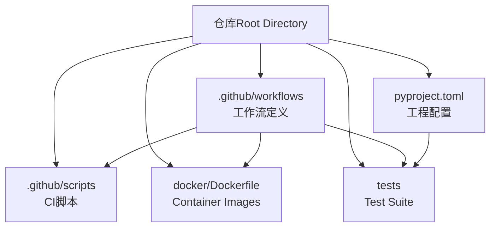
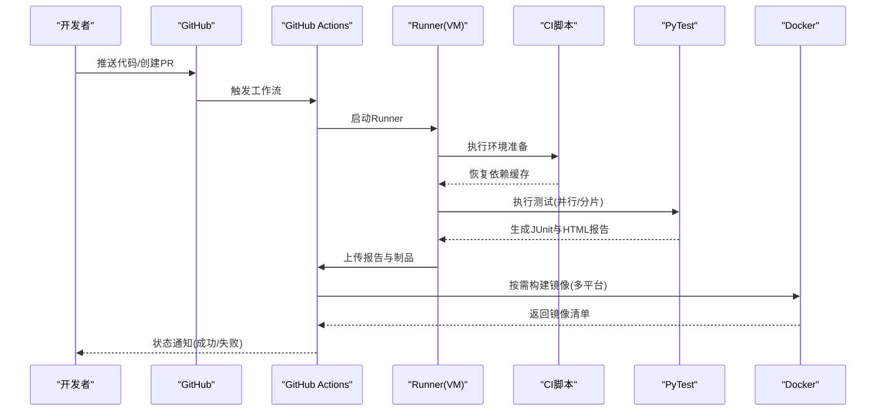
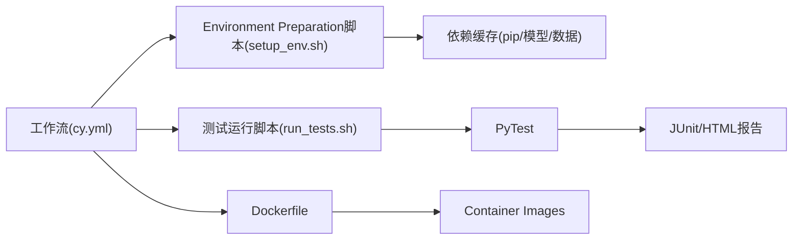

# 测试自动化andCI/CD

<cite>
**Files Referenced in This Document**
- [pyproject.toml](file://pyproject.toml)
- [docker/Dockerfile](file://docker/Dockerfile)
- [.github/workflows/ci.yml](file://.github/workflows/ci.yml)
- [.github/workflows/docker-publish.yml](file://.github/workflows/docker-publish.yml)
- [.github/scripts/setup_env.sh](file://.github/scripts/setup_env.sh)
- [.github/scripts/run_tests.sh](file://.github/scripts/run_tests.sh)
- [tests/conftest.py](file://tests/conftest.py)
- [tests/cache_test_assets.py](file://tests/cache_test_assets.py)
</cite>

## Table of Contents
1. [Introduction](#Introduction)
2. [Project Structure](#Project Structure)
3. [Core Components](#Core Components)
4. [Architecture Overview](#Architecture Overview)
5. [Detailed Component Analysis](#Detailed Component Analysis)
6. [Dependency Analysis](#Dependency Analysis)
7. [Performance Considerations](#Performance Considerations)
8. [Troubleshooting Guide](#Troubleshooting Guide)
9. [Conclusion](#Conclusion)
10. [Appendix](#Appendix)

## Introduction
本文件targetingYOLO-Master项目的测试自动化andCI/CD集成，目标是：
- 说明GitHub Actions工作流的配置and自定义方式，包括测试矩阵并行执行and环境矩阵设置
- 解释测试Tasks的编排and依赖管理（顺序控制、资源分配）
- Documentation化测试报告的自动生成and发布（HTML报告andJUnit格式输出）
- 集成代码质量检查（静态分析、格式检查、类型检查）
- 容器化测试环境的构建and管理（含多平台Supporting）
- provides缓存and加速策略（依赖缓存、测试数据预加载）
- 建立失败告警通知and故障排查流程

## Project Structure
仓库中and测试自动化和CI/CD相关的关键位置such as下：
- .github/workflows：GitHub Actions工作流定义
- .github/scripts：CI脚本（Environment Preparation、测试运行etc.）
- docker/Dockerfile：Container Images构建定义
- tests：PyTestTest Suiteand公共夹具
- pyproject.toml：Python工程元数据andOptional工具配置入口

Figure Source
- [.github/workflows/ci.yml](file://.github/workflows/ci.yml)
- [.github/workflows/docker-publish.yml](file://.github/workflows/docker-publish.yml)
- [.github/scripts/setup_env.sh](file://.github/scripts/setup_env.sh)
- [.github/scripts/run_tests.sh](file://.github/scripts/run_tests.sh)
- [docker/Dockerfile](file://docker/Dockerfile)
- [tests/conftest.py](file://tests/conftest.py)
- [pyproject.toml](file://pyproject.toml)

Section Source
- [.github/workflows/ci.yml](file://.github/workflows/ci.yml)
- [.github/workflows/docker-publish.yml](file://.github/workflows/docker-publish.yml)
- [.github/scripts/setup_env.sh](file://.github/scripts/setup_env.sh)
- [.github/scripts/run_tests.sh](file://.github/scripts/run_tests.sh)
- [docker/Dockerfile](file://docker/Dockerfile)
- [tests/conftest.py](file://tests/conftest.py)
- [pyproject.toml](file://pyproject.toml)

## Core Components
- GitHub Actions工作流
  - CI主流程：触发条件、环境矩阵、Tasks编排、缓存、测试执行、报告上传、制品归档
  - Docker发布流程：镜像构建、多平台构建、推送至Registry
- CI脚本
  - Environment Preparation脚本：安装系统依赖、Python版本切换、依赖缓存恢复/保存
  - 测试运行脚本：Callspytest并生成JUnitandHTML报告
- Container Images
  - Dockerfile：基础镜像、CUDA/drivers are installed、Python环境、依赖安装、时区and语言环境
- Test Suite
  - conftest.py：全局夹具、设备探测、数据集路径、Loggingand报告输出
  - cache_test_assets.py：测试数据下载and缓存逻辑

Section Source
- [.github/workflows/ci.yml](file://.github/workflows/ci.yml)
- [.github/workflows/docker-publish.yml](file://.github/workflows/docker-publish.yml)
- [.github/scripts/setup_env.sh](file://.github/scripts/setup_env.sh)
- [.github/scripts/run_tests.sh](file://.github/scripts/run_tests.sh)
- [docker/Dockerfile](file://docker/Dockerfile)
- [tests/conftest.py](file://tests/conftest.py)
- [tests/cache_test_assets.py](file://tests/cache_test_assets.py)

## Architecture Overview
下图展示了从代码提交to测试执行、报告产出and制品发布的端to端流程。

Figure Source
- [.github/workflows/ci.yml](file://.github/workflows/ci.yml)
- [.github/workflows/docker-publish.yml](file://.github/workflows/docker-publish.yml)
- [.github/scripts/setup_env.sh](file://.github/scripts/setup_env.sh)
- [.github/scripts/run_tests.sh](file://.github/scripts/run_tests.sh)
- [docker/Dockerfile](file://docker/Dockerfile)

## Detailed Component Analysis

### GitHub Actions工作流：CI主流程
- 触发条件
  - 默认分支推送、Pull Request事件、手动触发
- 环境矩阵
  - Python版本矩阵
  - OS矩阵（Linux/macOS/Windows）
  - GPU可用性标记（用于跳过或降级GPU相关用例）
- Tasks编排
  - 步骤顺序：检出代码→设置Python→恢复缓存→Installing Dependencies→运行测试→生成报告→上传制品
  - 并行策略：按矩阵维度并发；测试阶段可按分片或标签分组并行
- 缓存
  - pip包缓存、模型权重/数据集缓存、构建产物缓存
- 测试执行
  - Via脚本Callspytest，指定插件and参数Centered on输出JUnitandHTML报告
- 报告and制品
  - 将JUnit XMLandHTML报告作for工件上传，便于whileActions页面查看and归档
- 失败处理
  - Usescontinue-on-error控制非关键Tasks失败不阻断整体流程
  - 可Combining通知渠道进行告警（见“Troubleshooting Guide”）

Section Source
- [.github/workflows/ci.yml](file://.github/workflows/ci.yml)

### GitHub Actions工作流：Docker发布流程
- 触发条件
  - 推送tag或手动触发
- 构建策略
  - 启用多平台构建（such aslinux/amd64、linux/arm64）
  - UsesBuildxandQEMUimplementing跨平台构建
- 镜像标签
  - 基于Git tagand短SHA生成镜像标签
- 推送and清单
  - 登录Registry→构建并推送镜像→生成并推送多平台清单
- 安全and凭据
  - UsesGitHub Secrets注入凭据

Section Source
- [.github/workflows/docker-publish.yml](file://.github/workflows/docker-publish.yml)

### CI脚本：Environment Preparationand测试运行
- Environment Preparation脚本
  - 安装系统依赖（such as图形库、编译工具链）
  - 切换Python版本（Uses官方工具）
  - 恢复/保存pip缓存and第三方包缓存
  - 初始化测试数据缓存（若存while）
- 测试运行脚本
  - Callspytest，指定：
    - JUnit输出路径
    - HTML报告输出路径
    - 并行选项（such as进程数或分片）
    - 过滤标签（such as仅CPU、仅GPU、快速回归）
  - 根据环境变量调整行for（such as是否跳过网络下载、是否启用GPU）

Section Source
- [.github/scripts/setup_env.sh](file://.github/scripts/setup_env.sh)
- [.github/scripts/run_tests.sh](file://.github/scripts/run_tests.sh)

### Container Images：Dockerfile
- 基础镜像
  - 选择包含CUDA运行时and必要drivers are installed的基础镜像（such as需GPU测试）
- 系统依赖
  - 安装必要的系统库（such as图像解码、音频、字体etc.）
- Python环境
  - 安装指定版本的Pythonandpip
- 应用依赖
  - 复制依赖清单并安装（Prefer缓存层）
- 运行环境
  - 设置时区、语言环境、User权限
  - 暴露端口（such as需要UI或服务）

Section Source
- [docker/Dockerfile](file://docker/Dockerfile)

### Test Suite：PyTest夹具and数据缓存
- conftest.py
  - 全局夹具：设备探测（CPU/GPU）、数据集路径解析、临时Table of Contents清理
  - 报告钩子：统一Logging输出、失败截图/轨迹保存（Optional）
- cache_test_assets.py
  - 检测本地缓存是否存while，不存while则下载并写入缓存Table of Contents
  - Supporting断点续传and校验（Optional）

Section Source
- [tests/conftest.py](file://tests/conftest.py)
- [tests/cache_test_assets.py](file://tests/cache_test_assets.py)

### 工程配置：pyproject.toml
- 作用
  - 声明项目元数据、依赖、Optional工具配置入口（such asruff、mypy、pytestetc.）
- andCI的关系
  - 工作流中可Via该文件定位依赖安装命令and工具配置项
  - 便于统一维护依赖版本and工具参数

Section Source
- [pyproject.toml](file://pyproject.toml)

## Dependency Analysis
下图展示工作流、脚本、镜像andTest Suite之间的依赖关系。

Figure Source
- [.github/workflows/ci.yml](file://.github/workflows/ci.yml)
- [.github/scripts/setup_env.sh](file://.github/scripts/setup_env.sh)
- [.github/scripts/run_tests.sh](file://.github/scripts/run_tests.sh)
- [docker/Dockerfile](file://docker/Dockerfile)

Section Source
- [.github/workflows/ci.yml](file://.github/workflows/ci.yml)
- [.github/scripts/setup_env.sh](file://.github/scripts/setup_env.sh)
- [.github/scripts/run_tests.sh](file://.github/scripts/run_tests.sh)
- [docker/Dockerfile](file://docker/Dockerfile)

## Performance Considerations
- 并行and分片
  - Uses矩阵维度并行执行不同环境andTasks
  - 对大型测试集采用分片或标签分组，缩短单次运行时间
- 缓存策略
  - pip包缓存：按Operating SystemandPython版本键名隔离
  - 模型and数据集缓存：按哈希或版本号持久化，避免重复下载
  - 构建缓存：Docker层缓存and中间产物缓存
- 资源分配
  - forGPU密集型Tasks分配更大实例规格
  - 限制并发度Centered on避免Runner资源争用
- 增量执行
  - 仅运行受影响Modules的测试（基于变更范围）
  - Uses预热and懒加载减少冷启动开销

[本节for通用指导，无需源码引用]

## Troubleshooting Guide
- 常见失败场景
  - 依赖安装失败：检查网络、镜像源、缓存键冲突
  - 测试超时：增加实例规格、降低并发、拆分测试集
  - GPU不可用：确认drivers are installedandCUDA版本匹配，必要时降级forCPU模式
  - 报告缺失：确认pytest参数and输出路径正确，检查权限
- 定位方法
  - 查看ActionsLoggingand工件（JUnit/HTML报告）
  - while本地复现：Uses相同Docker镜像and缓存策略
  - 最小化用例：Via标签筛选快速定位问题
- 告警and通知
  - 可while工作流中添加通知步骤（such as邮件、IM），while失败时发送告警
  - 建议将关键Metrics（Via率、耗时、失败用例）纳入仪表盘

Section Source
- [.github/workflows/ci.yml](file://.github/workflows/ci.yml)
- [.github/scripts/run_tests.sh](file://.github/scripts/run_tests.sh)

## Conclusion
Via标准化的工作流、脚本and容器化方案，YOLO-Masterimplementing了跨平台、可扩展且高效的测试自动化体系。借助缓存and并行策略，显著缩短了反馈周期；ViaJUnitandHTML报告，提升了可观测性and可追溯性。后续可进一步引入变更影响分析、智能分片and更细粒度的失败告警，持续提升交付质量and效率。

[本节for总结性内容，无需源码引用]

## Appendix
- 术语
  - 矩阵：工作流中按多个维度组合生成的并发Tasks集合
  - 工件：工作流产出的可下载文件（such as报告、镜像）
  - 缓存：跨运行持久化的数据（依赖、模型、数据集）
- 最佳实践
  - 保持缓存键稳定且区分环境
  - 将耗时操作前置并缓存结果
  - Uses标签组织测试，便于选择性执行
  - for关键Tasks设置超时and重试策略

[本节for补充信息，无需源码引用]