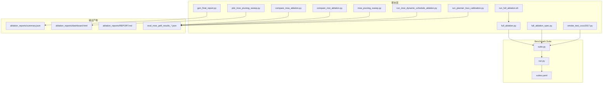
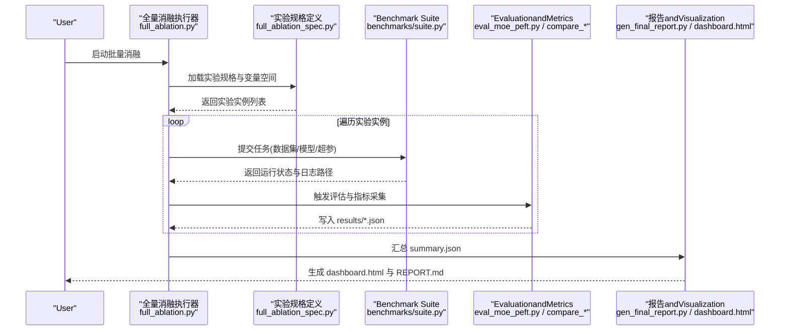
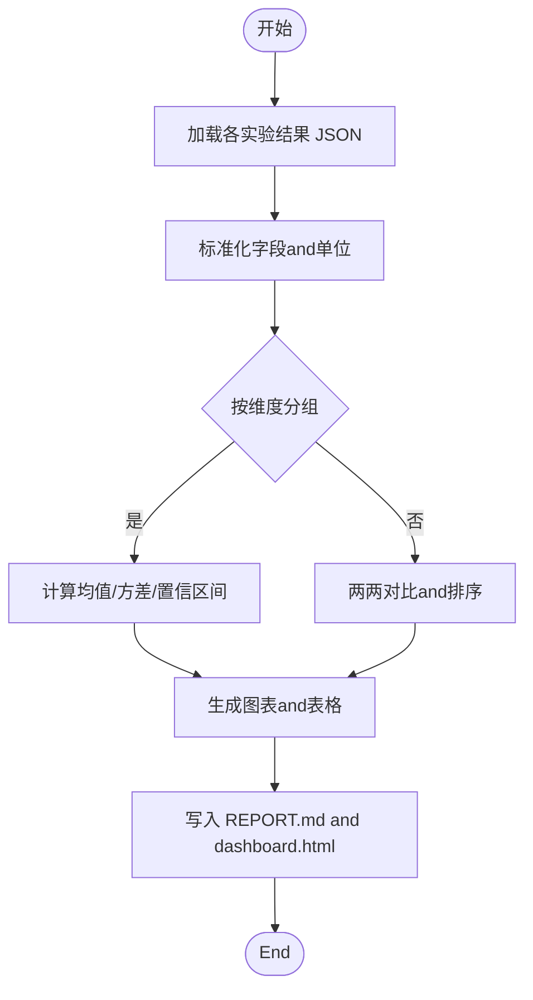
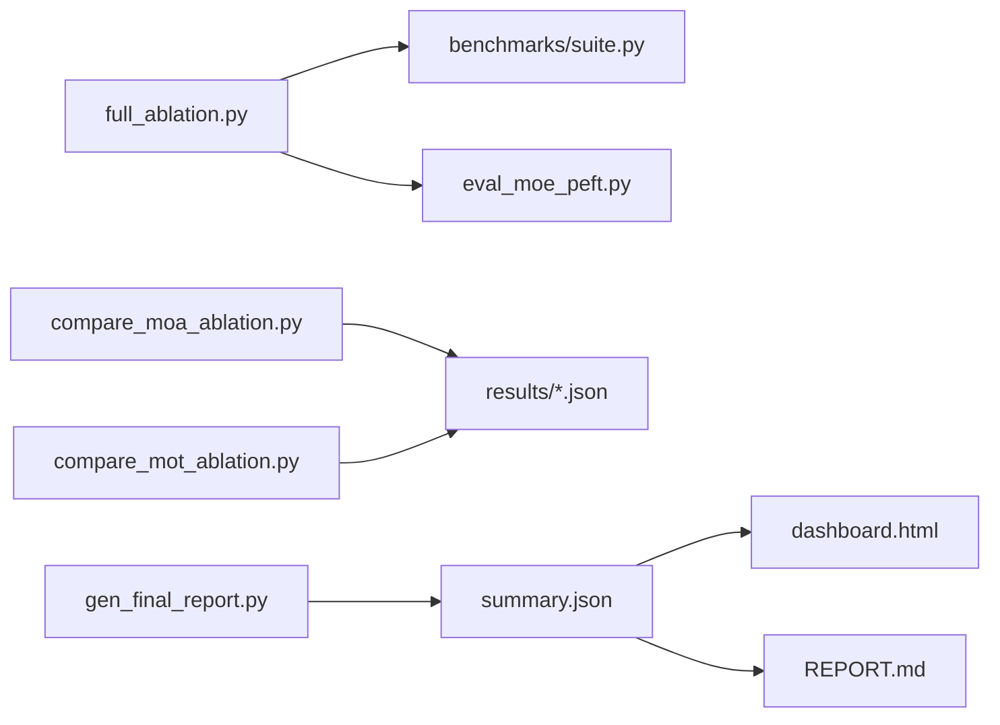

# 消融实验框架

<cite>
**Files Referenced in This Document**
- [scripts/ablation_suite/full_ablation.py](file://scripts/ablation_suite/full_ablation.py)
- [scripts/ablation_suite/full_ablation_spec.py](file://scripts/ablation_suite/full_ablation_spec.py)
- [scripts/ablation_suite/run_full_ablation.sh](file://scripts/ablation_suite/run_full_ablation.sh)
- [scripts/ablation_suite/ABLATION_INVENTORY.md](file://scripts/ablation_suite/ABLATION_INVENTORY.md)
- [scripts/ablation_reports/summary.json](file://scripts/ablation_reports/summary.json)
- [scripts/ablation_reports/dashboard.html](file://scripts/ablation_reports/dashboard.html)
- [scripts/ablation_reports/REPORT.md](file://scripts/ablation_reports/REPORT.md)
- [scripts/gen_final_report.py](file://scripts/gen_final_report.py)
- [scripts/compare_moa_ablation.py](file://scripts/compare_moa_ablation.py)
- [scripts/compare_mot_ablation.py](file://scripts/compare_mot_ablation.py)
- [scripts/eval_moe_peft.py](file://scripts/eval_moe_peft.py)
- [scripts/eval_moe_peft_results_combined.json](file://scripts/eval_moe_peft_results_combined.json)
- [scripts/eval_moe_peft_results_calib.json](file://scripts/eval_moe_peft_results_calib.json)
- [scripts/eval_moe_peft_results_freq.json](file://scripts/eval_moe_peft_results_freq.json)
- [scripts/moe_pruning_sweep.py](file://scripts/moe_pruning_sweep.py)
- [scripts/plot_moe_pruning_sweep.py](file://scripts/plot_moe_pruning_sweep.py)
- [scripts/run_fewshot_bg.sh](file://scripts/run_fewshot_bg.sh)
- [scripts/run_moe_dynamic_schedule_ablation.py](file://scripts/run_moe_dynamic_schedule_ablation.py)
- [scripts/run_planner_lovo_calibration.py](file://scripts/run_planner_lovo_calibration.py)
- [scripts/smoke_test_coco2017.py](file://scripts/smoke_test_coco2017.py)
- [tests/test_benchmark_suite.py](file://tests/test_benchmark_suite.py)
- [benchmarks/suite.py](file://benchmarks/suite.py)
- [benchmarks/run.py](file://benchmarks/run.py)
- [benchmarks/suites.yaml](file://benchmarks/suites.yaml)
</cite>

## Table of Contents
1. [Introduction](#Introduction)
2. [Project Structure](#Project Structure)
3. [Core Components](#Core Components)
4. [Architecture Overview](#Architecture Overview)
5. [Detailed Component Analysis](#Detailed Component Analysis)
6. [Dependency Analysis](#Dependency Analysis)
7. [性能and并行策略](#性能and并行策略)
8. [Troubleshooting Guide](#Troubleshooting Guide)
9. [Conclusion](#Conclusion)
10. [Appendix](#Appendix)

## Introduction
本文件for YOLO-Master 项目的“消融实验框架”provides系统化Documentation，覆盖设计原则and方法论、变量控制and实验组设计、自动化执行and参数化配置、结果收集and分析、Visualizationand报告生成、版本管理and复现机制、自定义扩展指南Centered onand资源Optimizationand并行执行策略。目标是帮助ResearchersCentered on可重复、可对比、可追踪的方式开展大规模消融实验，并高效产出高质量的分析报告。

## Project Structure
本项目while scripts and benchmarks Table of Contents下provides了完整的消融实验基础设施：
- 脚本层（scripts）：负责实验编排、批量执行、Metrics计算、结果汇总andVisualization。
- Benchmark Suite（benchmarks）：provides统一的Tasks定义、运行入口and套件管理。
- 测试层（tests）：对关键流程进行冒烟and回归Validation，保障框架稳定性。

Figure Source
- [scripts/ablation_suite/full_ablation.py](file://scripts/ablation_suite/full_ablation.py)
- [scripts/ablation_suite/full_ablation_spec.py](file://scripts/ablation_suite/full_ablation_spec.py)
- [scripts/ablation_suite/run_full_ablation.sh](file://scripts/ablation_suite/run_full_ablation.sh)
- [scripts/gen_final_report.py](file://scripts/gen_final_report.py)
- [scripts/compare_moa_ablation.py](file://scripts/compare_moa_ablation.py)
- [scripts/compare_mot_ablation.py](file://scripts/compare_mot_ablation.py)
- [scripts/moe_pruning_sweep.py](file://scripts/moe_pruning_sweep.py)
- [scripts/plot_moe_pruning_sweep.py](file://scripts/plot_moe_pruning_sweep.py)
- [scripts/run_moe_dynamic_schedule_ablation.py](file://scripts/run_moe_dynamic_schedule_ablation.py)
- [scripts/run_planner_lovo_calibration.py](file://scripts/run_planner_lovo_calibration.py)
- [scripts/smoke_test_coco2017.py](file://scripts/smoke_test_coco2017.py)
- [benchmarks/suite.py](file://benchmarks/suite.py)
- [benchmarks/run.py](file://benchmarks/run.py)
- [benchmarks/suites.yaml](file://benchmarks/suites.yaml)
- [scripts/ablation_reports/summary.json](file://scripts/ablation_reports/summary.json)
- [scripts/ablation_reports/dashboard.html](file://scripts/ablation_reports/dashboard.html)
- [scripts/ablation_reports/REPORT.md](file://scripts/ablation_reports/REPORT.md)
- [scripts/eval_moe_peft_results_combined.json](file://scripts/eval_moe_peft_results_combined.json)
- [scripts/eval_moe_peft_results_calib.json](file://scripts/eval_moe_peft_results_calib.json)
- [scripts/eval_moe_peft_results_freq.json](file://scripts/eval_moe_peft_results_freq.json)

Section Source
- [scripts/ablation_suite/full_ablation.py](file://scripts/ablation_suite/full_ablation.py)
- [scripts/ablation_suite/full_ablation_spec.py](file://scripts/ablation_suite/full_ablation_spec.py)
- [scripts/ablation_suite/run_full_ablation.sh](file://scripts/ablation_suite/run_full_ablation.sh)
- [benchmarks/suite.py](file://benchmarks/suite.py)
- [benchmarks/run.py](file://benchmarks/run.py)
- [benchmarks/suites.yaml](file://benchmarks/suites.yaml)

## Core Components
- 实验编排器：负责解析Tasks清单、组合变量空间、生成实验实例并调度执行。
- 参数化配置：Via YAML/JSON 或 Python 对象描述数据集、模型、TrainingandEvaluation超参，Supporting模板and继承。
- Metricsand结果：统一采集Training/ValidationMetrics、Export结构化 JSON，便于后续分析and对比。
- Visualizationand报告：基于汇总数据生成仪表盘 HTML and Markdown 报告，自动归档。
- 版本and复现：保存完整配置快照、环境信息and随机种子，确保可复现实验。
- 并行and资源：Supporting多进程/分布式执行、GPU/CPU 资源隔离and队列管理。

Section Source
- [scripts/ablation_suite/full_ablation.py](file://scripts/ablation_suite/full_ablation.py)
- [scripts/ablation_suite/full_ablation_spec.py](file://scripts/ablation_suite/full_ablation_spec.py)
- [scripts/ablation_reports/summary.json](file://scripts/ablation_reports/summary.json)
- [scripts/ablation_reports/dashboard.html](file://scripts/ablation_reports/dashboard.html)
- [scripts/ablation_reports/REPORT.md](file://scripts/ablation_reports/REPORT.md)

## Architecture Overview
下图展示了从“实验定义”to“结果归档”的端to端流程，涵盖参数化、执行、度量、Visualizationand报告生成。

Figure Source
- [scripts/ablation_suite/full_ablation.py](file://scripts/ablation_suite/full_ablation.py)
- [scripts/ablation_suite/full_ablation_spec.py](file://scripts/ablation_suite/full_ablation_spec.py)
- [benchmarks/suite.py](file://benchmarks/suite.py)
- [scripts/eval_moe_peft.py](file://scripts/eval_moe_peft.py)
- [scripts/compare_moa_ablation.py](file://scripts/compare_moa_ablation.py)
- [scripts/compare_mot_ablation.py](file://scripts/compare_mot_ablation.py)
- [scripts/gen_final_report.py](file://scripts/gen_final_report.py)
- [scripts/ablation_reports/dashboard.html](file://scripts/ablation_reports/dashboard.html)
- [scripts/ablation_reports/REPORT.md](file://scripts/ablation_reports/REPORT.md)

## Detailed Component Analysis

### 全量消融执行器（full_ablation.py）
- 职责：读取实验规格，unfold变量空间，按批次调度Tasks，聚合结果并触发报告生成。
- 关键点：
  - 变量控制：将离散/连续超参组合for笛卡尔积，避免无效组合。
  - 批处理：按 GPU/CPU 资源限制并发度，失败重试and断点续跑。
  - 结果落盘：每个实验独立Table of Contents，包含配置快照、LoggingandMetrics JSON。
  - 集成基准：Via benchmarks 套件Unified entry point执行Training/Validation。

Section Source
- [scripts/ablation_suite/full_ablation.py](file://scripts/ablation_suite/full_ablation.py)
- [benchmarks/suite.py](file://benchmarks/suite.py)
- [benchmarks/run.py](file://benchmarks/run.py)

### 实验规格定义（full_ablation_spec.py）
- 职责：声明式定义消融维度（such asrouting strategies、专家数量、LoRA rank、校准方法etc.），并provides默认基线and变体。
- 关键点：
  - 模板化：Supporting基础配置 + 差异覆盖，减少冗余。
  - 约束校验：whileunfold前检查参数合法性and兼容性。
  - 场景化：provides Few-shot、动态调度、MoE 路由etc.典型场景。

Section Source
- [scripts/ablation_suite/full_ablation_spec.py](file://scripts/ablation_suite/full_ablation_spec.py)
- [scripts/ablation_suite/ABLATION_INVENTORY.md](file://scripts/ablation_suite/ABLATION_INVENTORY.md)

### 批量执行脚本（run_full_ablation.sh）
- 职责：Encapsulates环境变量、资源配额、Loggingand错误码处理，便于 CI/CD and集群调度。
- 关键点：
  - 参数透传：将 shell 参数映射for Python 配置项。
  - 资源隔离：设置 CUDA_VISIBLE_DEVICES、OMP_NUM_THREADS etc.。
  - 幂etc.性：Supporting断点续跑and增量更新。

Section Source
- [scripts/ablation_suite/run_full_ablation.sh](file://scripts/ablation_suite/run_full_ablation.sh)

### 结果收集and分析工具
- Metrics采集：统一写入 eval_moe_peft_results_*.json，包含 mAP、精度、召回、耗时etc.。
- 对比分析：compare_moa_ablation.py and compare_mot_ablation.py provides多维度对比and显著性检验。
- 汇总统计：gen_final_report.py 聚合 summary.json，生成表格andConclusion摘要。

Figure Source
- [scripts/eval_moe_peft_results_combined.json](file://scripts/eval_moe_peft_results_combined.json)
- [scripts/eval_moe_peft_results_calib.json](file://scripts/eval_moe_peft_results_calib.json)
- [scripts/eval_moe_peft_results_freq.json](file://scripts/eval_moe_peft_results_freq.json)
- [scripts/compare_moa_ablation.py](file://scripts/compare_moa_ablation.py)
- [scripts/compare_mot_ablation.py](file://scripts/compare_mot_ablation.py)
- [scripts/gen_final_report.py](file://scripts/gen_final_report.py)
- [scripts/ablation_reports/summary.json](file://scripts/ablation_reports/summary.json)
- [scripts/ablation_reports/dashboard.html](file://scripts/ablation_reports/dashboard.html)
- [scripts/ablation_reports/REPORT.md](file://scripts/ablation_reports/REPORT.md)

Section Source
- [scripts/eval_moe_peft.py](file://scripts/eval_moe_peft.py)
- [scripts/compare_moa_ablation.py](file://scripts/compare_moa_ablation.py)
- [scripts/compare_mot_ablation.py](file://scripts/compare_mot_ablation.py)
- [scripts/gen_final_report.py](file://scripts/gen_final_report.py)
- [scripts/ablation_reports/summary.json](file://scripts/ablation_reports/summary.json)

### Visualizationand报告自动生成
- 仪表盘：dashboard.html 展示关键Metrics趋势、热力图and对比柱状图。
- 报告：REPORT.md 自动生成摘要、显著性Conclusionand改进建议。
- 图表脚本：plot_moe_pruning_sweep.py 针对特定消融维度绘制曲线。

Section Source
- [scripts/ablation_reports/dashboard.html](file://scripts/ablation_reports/dashboard.html)
- [scripts/ablation_reports/REPORT.md](file://scripts/ablation_reports/REPORT.md)
- [scripts/plot_moe_pruning_sweep.py](file://scripts/plot_moe_pruning_sweep.py)

### 实验版本管理and结果追踪
- 配置快照：每次实验保存完整配置and环境信息，确保可复现。
- 结果索引：summary.json 作for全局索引，记录实验 ID、路径、关键Metricsand时间戳。
- 审计and回溯：Combining git commit 哈希and配置文件版本，implementing端to端溯源。

Section Source
- [scripts/ablation_reports/summary.json](file://scripts/ablation_reports/summary.json)
- [scripts/ablation_reports/REPORT.md](file://scripts/ablation_reports/REPORT.md)

### 自定义消融实验开发指南
- 新增实验类型：
  - while full_ablation_spec.py 中扩展维度and默认值。
  - while compare_* 脚本中添加对应对比逻辑andVisualization。
  - while run_full_ablation.sh 中补充必要的环境变量and资源限制。
- Uses配置模板：
  - 基于现有 YAML/JSON 模板，采用差异覆盖方式快速构造新实验。
  - 利用约束校验避免非法组合。
- ExamplesRefer to：
  - MoE 剪枝扫描：moe_pruning_sweep.py
  - 动态调度消融：run_moe_dynamic_schedule_ablation.py
  - LoVo 校准：run_planner_lovo_calibration.py
  - Few-shot 背景Tasks：run_fewshot_bg.sh

Section Source
- [scripts/ablation_suite/full_ablation_spec.py](file://scripts/ablation_suite/full_ablation_spec.py)
- [scripts/moe_pruning_sweep.py](file://scripts/moe_pruning_sweep.py)
- [scripts/plot_moe_pruning_sweep.py](file://scripts/plot_moe_pruning_sweep.py)
- [scripts/run_moe_dynamic_schedule_ablation.py](file://scripts/run_moe_dynamic_schedule_ablation.py)
- [scripts/run_planner_lovo_calibration.py](file://scripts/run_planner_lovo_calibration.py)
- [scripts/run_fewshot_bg.sh](file://scripts/run_fewshot_bg.sh)

## Dependency Analysis
- 执行器andBenchmark Suite：full_ablation.py 依赖 benchmarks/suite.py provides的统一Tasks接口。
- Evaluationand对比：eval_moe_peft.py and compare_* 脚本依赖统一的Metrics格式and结果Table of Contents约定。
- 报告andVisualization：gen_final_report.py and dashboard.html 依赖 summary.json 的结构契约。

Figure Source
- [scripts/ablation_suite/full_ablation.py](file://scripts/ablation_suite/full_ablation.py)
- [benchmarks/suite.py](file://benchmarks/suite.py)
- [scripts/eval_moe_peft.py](file://scripts/eval_moe_peft.py)
- [scripts/compare_moa_ablation.py](file://scripts/compare_moa_ablation.py)
- [scripts/compare_mot_ablation.py](file://scripts/compare_mot_ablation.py)
- [scripts/gen_final_report.py](file://scripts/gen_final_report.py)
- [scripts/ablation_reports/summary.json](file://scripts/ablation_reports/summary.json)
- [scripts/ablation_reports/dashboard.html](file://scripts/ablation_reports/dashboard.html)
- [scripts/ablation_reports/REPORT.md](file://scripts/ablation_reports/REPORT.md)

Section Source
- [scripts/ablation_suite/full_ablation.py](file://scripts/ablation_suite/full_ablation.py)
- [benchmarks/suite.py](file://benchmarks/suite.py)
- [scripts/eval_moe_peft.py](file://scripts/eval_moe_peft.py)
- [scripts/compare_moa_ablation.py](file://scripts/compare_moa_ablation.py)
- [scripts/compare_mot_ablation.py](file://scripts/compare_mot_ablation.py)
- [scripts/gen_final_report.py](file://scripts/gen_final_report.py)
- [scripts/ablation_reports/summary.json](file://scripts/ablation_reports/summary.json)

## 性能and并行策略
- 并发控制：依据可用 GPU/CPU 数量设置最大并发Tasks数，避免资源争用。
- Tasks队列：失败Tasks进入重试队列，Supporting指数退避and上限控制。
- 资源隔离：Via环境变量限定线程and显存，防止 OOM and抖动。
- 增量执行：仅重跑失败的实验，缩短整体时长。
- 基准Validation：Uses smoke_test_coco2017.py and tests/test_benchmark_suite.py 进行快速回归Validation。

Section Source
- [scripts/ablation_suite/run_full_ablation.sh](file://scripts/ablation_suite/run_full_ablation.sh)
- [scripts/smoke_test_coco2017.py](file://scripts/smoke_test_coco2017.py)
- [tests/test_benchmark_suite.py](file://tests/test_benchmark_suite.py)

## Troubleshooting Guide
- 常见问题：
  - 配置不合法：whileunfold阶段报错，检查 full_ablation_spec.py 中的约束and默认值。
  - 资源不足：调整并发度and显存限制，查看Logging定位 OOM。
  - Metrics缺失：确认 eval 脚本输出路径and命名规范，核对 summary.json 结构。
  - 报告异常：检查 dashboard.html and REPORT.md 生成链路是否完整。
- 诊断步骤：
  - Uses最小数据集（COCO8/2017）进行冒烟测试。
  - 逐步缩小变量空间，定位问题维度。
  - 查看单实验Loggingand中间结果，比对预期Metrics范围。

Section Source
- [scripts/ablation_suite/full_ablation_spec.py](file://scripts/ablation_suite/full_ablation_spec.py)
- [scripts/ablation_suite/run_full_ablation.sh](file://scripts/ablation_suite/run_full_ablation.sh)
- [scripts/ablation_reports/summary.json](file://scripts/ablation_reports/summary.json)
- [scripts/ablation_reports/dashboard.html](file://scripts/ablation_reports/dashboard.html)
- [scripts/ablation_reports/REPORT.md](file://scripts/ablation_reports/REPORT.md)

## Conclusion
本消融实验框架Via参数化配置、统一基准接口、集中式结果管理and自动化报告生成，implementing了高可扩展、可复现、可对比的实验流水线。Combined with并行and资源隔离策略，可while有限算力下高效完成大规模消融研究。建议团队遵循本Documentation的开发指南and最佳实践，持续完善实验规格andVisualizationcapabilities，提升科研效率and成果质量。

## Appendix
- 常用命令：
  - 启动全量消融：Refer to run_full_ablation.sh 的参数and环境变量说明。
  - 生成最终报告：Calls gen_final_report.py 并指定 summary.json 路径。
  - 运行Benchmark Suite：Via benchmarks/run.py and suites.yaml 定义Tasks集。
- Refer to文件：
  - 实验清单and说明：ABLATION_INVENTORY.md
  - 结果样例：eval_moe_peft_results_*.json
  - Visualizationand报告：dashboard.html、REPORT.md

Section Source
- [scripts/ablation_suite/run_full_ablation.sh](file://scripts/ablation_suite/run_full_ablation.sh)
- [scripts/gen_final_report.py](file://scripts/gen_final_report.py)
- [benchmarks/run.py](file://benchmarks/run.py)
- [benchmarks/suites.yaml](file://benchmarks/suites.yaml)
- [scripts/ablation_suite/ABLATION_INVENTORY.md](file://scripts/ablation_suite/ABLATION_INVENTORY.md)
- [scripts/eval_moe_peft_results_combined.json](file://scripts/eval_moe_peft_results_combined.json)
- [scripts/eval_moe_peft_results_calib.json](file://scripts/eval_moe_peft_results_calib.json)
- [scripts/eval_moe_peft_results_freq.json](file://scripts/eval_moe_peft_results_freq.json)
- [scripts/ablation_reports/dashboard.html](file://scripts/ablation_reports/dashboard.html)
- [scripts/ablation_reports/REPORT.md](file://scripts/ablation_reports/REPORT.md)