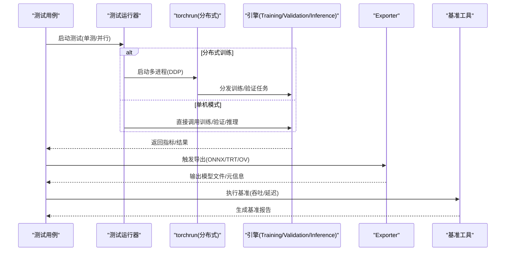
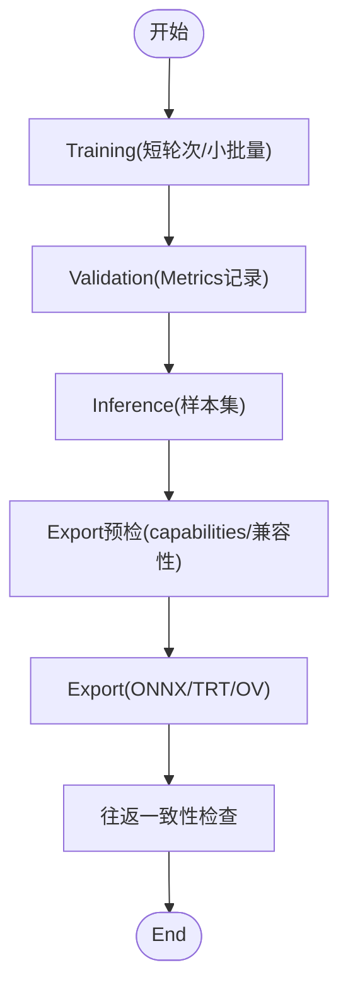
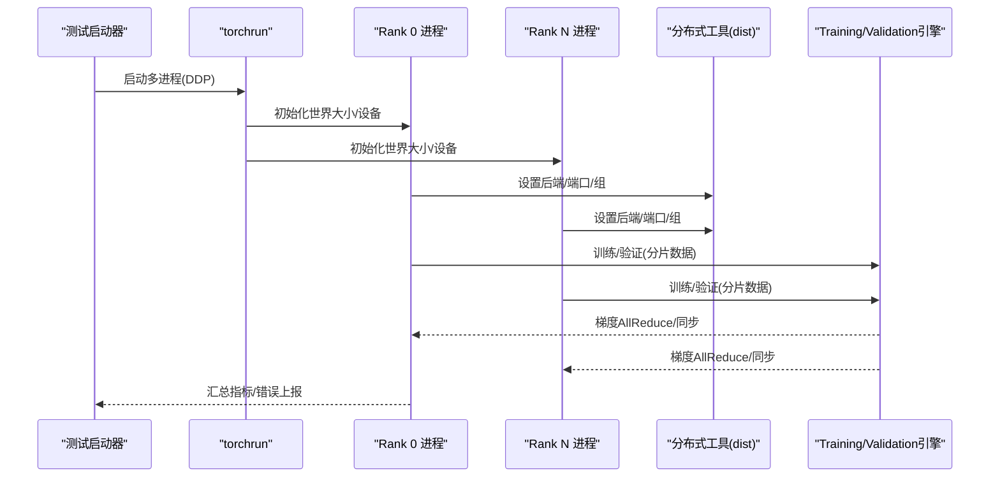
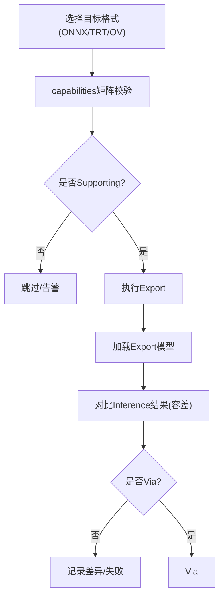
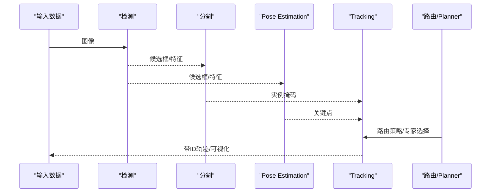
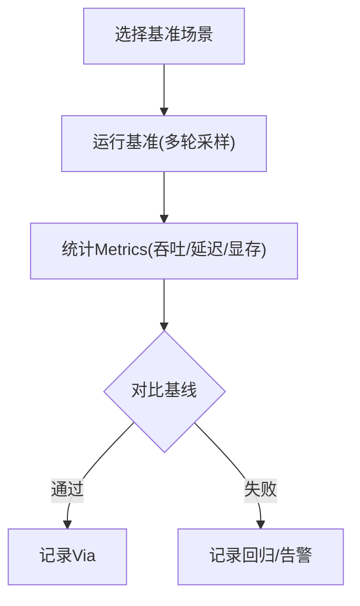
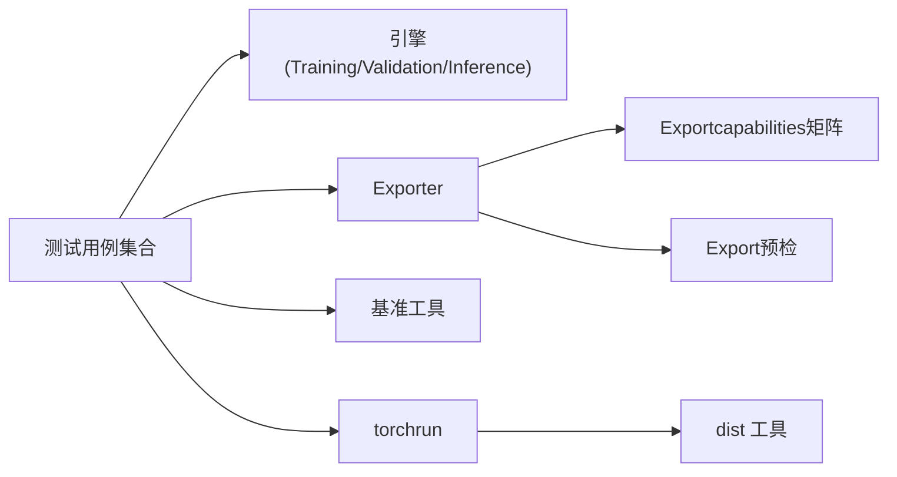

# 集成测试体系

<cite>
**Files Referenced in This Document**
- [tests/conftest.py](file://tests/conftest.py)
- [tests/test_cli.py](file://tests/test_cli.py)
- [tests/test_engine.py](file://tests/test_engine.py)
- [tests/test_python.py](file://tests/test_python.py)
- [tests/test_integrations.py](file://tests/test_integrations.py)
- [tests/test_exports.py](file://tests/test_exports.py)
- [tests/test_export_roundtrip.py](file://tests/test_export_roundtrip.py)
- [tests/test_export_preflight.py](file://tests/test_export_preflight.py)
- [tests/test_export_capability_matrix.py](file://tests/test_export_capability_matrix.py)
- [tests/test_benchmark_suite.py](file://tests/test_benchmark_suite.py)
- [tests/ddp_moa_mot_smoke.py](file://tests/ddp_moa_mot_smoke.py)
- [tests/ddp_moe_smoke.py](file://tests/ddp_moe_smoke.py)
- [tests/ddp_moe_validation_smoke.py](file://tests/ddp_moe_validation_smoke.py)
- [tests/test_ddp_device_hardening.py](file://tests/test_ddp_device_hardening.py)
- [tests/test_ddp_error_propagation_e2e.py](file://tests/test_ddp_error传播_e2e.py)
- [tests/test_ddp_lifecycle_ema_nan.py](file://tests/test_ddp_lifecycle_ema_nan.py)
- [tests/test_ddp_root_cause_reporting.py](file://tests/test_ddp_root_cause_reporting.py)
- [tests/lora_e2e_smoke.py](file://tests/lora_e2e_smoke.py)
- [tests/lora_rankless_smoke.py](file://tests/lora_rankless_smoke.py)
- [tests/test_lovo_e2e.py](file://tests/test_lovo_e2e.py)
- [tests/test_mot.py](file://tests/test_mot.py)
- [tests/test_moa.py](file://tests/test_moa.py)
- [tests/test_moe.py](file://tests/test_moe.py)
- [tests/test_planner_integration.py](file://tests/test_planner_integration.py)
- [tests/test_solutions.py](file://tests/test_solutions.py)
- [ultralytics/engine/exporter.py](file://ultralytics/engine/exporter.py)
- [ultralytics/utils/export_capabilities.py](file://ultralytics/utils/export_capabilities.py)
- [ultralytics/utils/export_preflight.py](file://ultralytics/utils/export_preflight.py)
- [ultralytics/utils/benchmarks.py](file://ultralytics/utils/benchmarks.py)
- [ultralytics/utils/dist.py](file://ultralytics/utils/dist.py)
- [ultralytics/utils/torchrun.py](file://ultralytics/utils/torchrun.py)
- [benchmarks/suite.py](file://benchmarks/suite.py)
- [benchmarks/run.py](file://benchmarks/run.py)
</cite>

## Table of Contents
1. [Introduction](#Introduction)
2. [Project Structure](#Project Structure)
3. [Core Components](#Core Components)
4. [Architecture Overview](#Architecture Overview)
5. [Detailed Component Analysis](#Detailed Component Analysis)
6. [Dependency Analysis](#Dependency Analysis)
7. [性能考量](#性能考量)
8. [Troubleshooting Guide](#Troubleshooting Guide)
9. [Conclusion](#Conclusion)
10. [Appendix](#Appendix)

## Introduction
本文件targetingYOLO-Master项目的集成测试体系，聚焦端to端流程（Training、Validation、Inference、Export）、Distributed Training（DDPand多GPU）、Model Export（ONNX/TensorRT/OpenVINO）andMultimodalcapabilities（检测/分割/Pose Estimation组合）的集成测试设计andimplementing。同时覆盖性能回归测试、环境隔离and资源管理最佳实践，Centered onand失败调试andLogging分析方法。

## Project Structure
仓库采用“功能域+测试用例”的组织方式：
- 核心引擎and工具位于 ultralytics package，包含Export、基准、分布式etc.关键Modules。
- 测试用例集中于 tests Table of Contents，按主题划分（such as DDP、Export、MoE/MoA、LoRA、MOT、Planner etc.）。
- Benchmark Suitewhile benchmarks Table of Contents，providesUnified entry pointand套件编排。

```mermaid
graph TB
subgraph "测试层"
T_Conf["conftest.py"]
T_CLI["test_cli.py"]
T_Engine["test_engine.py"]
T_Python["test_python.py"]
T_Integ["test_integrations.py"]
T_Export["test_exports.py"]
T_RT["test_export_roundtrip.py"]
T_Pref["test_export_preflight.py"]
T_Cap["test_export_capability_matrix.py"]
T_Bench["test_benchmark_suite.py"]
T_DDP_MoA["ddp_moa_mot_smoke.py"]
T_DDP_MoE["ddp_moe_smoke.py"]
T_DDP_Val["ddp_moe_validation_smoke.py"]
T_LoRA_E2E["lora_e2e_smoke.py"]
T_LoRA_RL["lora_rankless_smoke.py"]
T_LOVO["test_lovo_e2e.py"]
T_MOT["test_mot.py"]
T_MOA["test_moa.py"]
T_MOE["test_moe.py"]
T_Planner["test_planner_integration.py"]
T_Sol["test_solutions.py"]
end
subgraph "运行期and工具"
U_Exp["engine/exporter.py"]
U_Cap["utils/export_capabilities.py"]
U_Pref["utils/export_preflight.py"]
U_Bench["utils/benchmarks.py"]
U_Dist["utils/dist.py"]
U_TorchRun["utils/torchrun.py"]
end
subgraph "Benchmark Suite"
B_Suite["benchmarks/suite.py"]
B_Run["benchmarks/run.py"]
end
T_Conf --> T_CLI
T_Conf --> T_Engine
T_Conf --> T_Python
T_Conf --> T_Integ
T_Conf --> T_Export
T_Conf --> T_RT
T_Conf --> T_Pref
T_Conf --> T_Cap
T_Conf --> T_Bench
T_Conf --> T_DDP_MoA
T_Conf --> T_DDP_MoE
T_Conf --> T_DDP_Val
T_Conf --> T_LoRA_E2E
T_Conf --> T_LoRA_RL
T_Conf --> T_LOVO
T_Conf --> T_MOT
T_Conf --> T_MOA
T_Conf --> T_MOE
T_Conf --> T_Planner
T_Conf --> T_Sol
T_Export --> U_Exp
T_RT --> U_Exp
T_Pref --> U_Pref
T_Cap --> U_Cap
T_Bench --> U_Bench
T_DDP_MoA --> U_Dist
T_DDP_MoE --> U_Dist
T_DDP_Val --> U_Dist
T_DDP_MoA --> U_TorchRun
T_DDP_MoE --> U_TorchRun
T_DDP_Val --> U_TorchRun
B_Suite --> U_Bench
B_Run --> B_Suite
```

Figure Source
- [tests/conftest.py](file://tests/conftest.py)
- [tests/test_cli.py](file://tests/test_cli.py)
- [tests/test_engine.py](file://tests/test_engine.py)
- [tests/test_python.py](file://tests/test_python.py)
- [tests/test_integrations.py](file://tests/test_integrations.py)
- [tests/test_exports.py](file://tests/test_exports.py)
- [tests/test_export_roundtrip.py](file://tests/test_export_roundtrip.py)
- [tests/test_export_preflight.py](file://tests/test_export_preflight.py)
- [tests/test_export_capability_matrix.py](file://tests/test_export_capability_matrix.py)
- [tests/test_benchmark_suite.py](file://tests/test_benchmark_suite.py)
- [tests/ddp_moa_mot_smoke.py](file://tests/ddp_moa_mot_smoke.py)
- [tests/ddp_moe_smoke.py](file://tests/ddp_moe_smoke.py)
- [tests/ddp_moe_validation_smoke.py](file://tests/ddp_moe_validation_smoke.py)
- [ultralytics/engine/exporter.py](file://ultralytics/engine/exporter.py)
- [ultralytics/utils/export_capabilities.py](file://ultralytics/utils/export_capabilities.py)
- [ultralytics/utils/export_preflight.py](file://ultralytics/utils/export_preflight.py)
- [ultralytics/utils/benchmarks.py](file://ultralytics/utils/benchmarks.py)
- [ultralytics/utils/dist.py](file://ultralytics/utils/dist.py)
- [ultralytics/utils/torchrun.py](file://ultralytics/utils/torchrun.py)
- [benchmarks/suite.py](file://benchmarks/suite.py)
- [benchmarks/run.py](file://benchmarks/run.py)

Section Source
- [tests/conftest.py](file://tests/conftest.py)
- [tests/test_cli.py](file://tests/test_cli.py)
- [tests/test_engine.py](file://tests/test_engine.py)
- [tests/test_python.py](file://tests/test_python.py)
- [tests/test_integrations.py](file://tests/test_integrations.py)
- [tests/test_exports.py](file://tests/test_exports.py)
- [tests/test_export_roundtrip.py](file://tests/test_export_roundtrip.py)
- [tests/test_export_preflight.py](file://tests/test_export_preflight.py)
- [tests/test_export_capability_matrix.py](file://tests/test_export_capability_matrix.py)
- [tests/test_benchmark_suite.py](file://tests/test_benchmark_suite.py)
- [tests/ddp_moa_mot_smoke.py](file://tests/ddp_moa_mot_smoke.py)
- [tests/ddp_moe_smoke.py](file://tests/ddp_moe_smoke.py)
- [tests/ddp_moe_validation_smoke.py](file://tests/ddp_moe_validation_smoke.py)
- [ultralytics/engine/exporter.py](file://ultralytics/engine/exporter.py)
- [ultralytics/utils/export_capabilities.py](file://ultralytics/utils/export_capabilities.py)
- [ultralytics/utils/export_preflight.py](file://ultralytics/utils/export_preflight.py)
- [ultralytics/utils/benchmarks.py](file://ultralytics/utils/benchmarks.py)
- [ultralytics/utils/dist.py](file://ultralytics/utils/dist.py)
- [ultralytics/utils/torchrun.py](file://ultralytics/utils/torchrun.py)
- [benchmarks/suite.py](file://benchmarks/suite.py)
- [benchmarks/run.py](file://benchmarks/run.py)

## Core Components
- 端to端Training/Validation/Inference/Export流水线
  - Via CLI and Python API drivers are installed，覆盖Data Loading、模型构建、Training循环、Metrics计算、结果保存andExport。
  - Refer to路径：[tests/test_cli.py](file://tests/test_cli.py)、[tests/test_engine.py](file://tests/test_engine.py)、[tests/test_python.py](file://tests/test_python.py)。
- Distributed Training（DDP）
  - Uses torchrun 启动多进程，校验设备分配、错误传播、EMA/NAN 处理and根因报告。
  - Refer to路径：[tests/ddp_moe_smoke.py](file://tests/ddp_moe_smoke.py)、[tests/ddp_moa_mot_smoke.py](file://tests/ddp_moa_mot_smoke.py)、[tests/ddp_moe_validation_smoke.py](file://tests/ddp_moe_validation_smoke.py)、[tests/test_ddp_device_hardening.py](file://tests/test_ddp_device_hardening.py)、[tests/test_ddp_error_propagation_e2e.py](file://tests/test_ddp_error传播_e2e.py)、[tests/test_ddp_lifecycle_ema_nan.py](file://tests/test_ddp_lifecycle_ema_nan.py)、[tests/test_ddp_root_cause_reporting.py](file://tests/test_ddp_root_cause_reporting.py)、[ultralytics/utils/torchrun.py](file://ultralytics/utils/torchrun.py)、[ultralytics/utils/dist.py](file://ultralytics/utils/dist.py)。
- Model Exportand格式Validation
  - ONNX/TensorRT/OpenVINO etc.格式的Export预检、capabilities矩阵校验、往返一致性检查。
  - Refer to路径：[tests/test_exports.py](file://tests/test_exports.py)、[tests/test_export_roundtrip.py](file://tests/test_export_roundtrip.py)、[tests/test_export_preflight.py](file://tests/test_export_preflight.py)、[tests/test_export_capability_matrix.py](file://tests/test_export_capability_matrix.py)、[ultralytics/engine/exporter.py](file://ultralytics/engine/exporter.py)、[ultralytics/utils/export_capabilities.py](file://ultralytics/utils/export_capabilities.py)、[ultralytics/utils/export_preflight.py](file://ultralytics/utils/export_preflight.py)。
- MultimodalandTasks组合
  - 检测、分割、Pose Estimation的组合场景andTracking链路Validation。
  - Refer to路径：[tests/test_mot.py](file://tests/test_mot.py)、[tests/test_moa.py](file://tests/test_moa.py)、[tests/test_moe.py](file://tests/test_moe.py)、[tests/test_planner_integration.py](file://tests/test_planner_integration.py)、[tests/test_solutions.py](file://tests/test_solutions.py)。
- 性能回归测试
  - 基于Benchmark Suiteand运行时基准工具，进行吞吐/延迟对比and阈值判定。
  - Refer to路径：[tests/test_benchmark_suite.py](file://tests/test_benchmark_suite.py)、[ultralytics/utils/benchmarks.py](file://ultralytics/utils/benchmarks.py)、[benchmarks/suite.py](file://benchmarks/suite.py)、[benchmarks/run.py](file://benchmarks/run.py)。

Section Source
- [tests/test_cli.py](file://tests/test_cli.py)
- [tests/test_engine.py](file://tests/test_engine.py)
- [tests/test_python.py](file://tests/test_python.py)
- [tests/ddp_moe_smoke.py](file://tests/ddp_moe_smoke.py)
- [tests/ddp_moa_mot_smoke.py](file://tests/ddp_moa_mot_smoke.py)
- [tests/ddp_moe_validation_smoke.py](file://tests/ddp_moe_validation_smoke.py)
- [tests/test_ddp_device_hardening.py](file://tests/test_ddp_device_hardening.py)
- [tests/test_ddp_error_propagation_e2e.py](file://tests/test_ddp_error传播_e2e.py)
- [tests/test_ddp_lifecycle_ema_nan.py](file://tests/test_ddp_lifecycle_ema_nan.py)
- [tests/test_ddp_root_cause_reporting.py](file://tests/test_ddp_root_cause_reporting.py)
- [tests/test_exports.py](file://tests/test_exports.py)
- [tests/test_export_roundtrip.py](file://tests/test_export_roundtrip.py)
- [tests/test_export_preflight.py](file://tests/test_export_preflight.py)
- [tests/test_export_capability_matrix.py](file://tests/test_export_capability_matrix.py)
- [tests/test_mot.py](file://tests/test_mot.py)
- [tests/test_moa.py](file://tests/test_moa.py)
- [tests/test_moe.py](file://tests/test_moe.py)
- [tests/test_planner_integration.py](file://tests/test_planner_integration.py)
- [tests/test_solutions.py](file://tests/test_solutions.py)
- [tests/test_benchmark_suite.py](file://tests/test_benchmark_suite.py)
- [ultralytics/engine/exporter.py](file://ultralytics/engine/exporter.py)
- [ultralytics/utils/export_capabilities.py](file://ultralytics/utils/export_capabilities.py)
- [ultralytics/utils/export_preflight.py](file://ultralytics/utils/export_preflight.py)
- [ultralytics/utils/benchmarks.py](file://ultralytics/utils/benchmarks.py)
- [ultralytics/utils/torchrun.py](file://ultralytics/utils/torchrun.py)
- [ultralytics/utils/dist.py](file://ultralytics/utils/dist.py)
- [benchmarks/suite.py](file://benchmarks/suite.py)
- [benchmarks/run.py](file://benchmarks/run.py)

## Architecture Overview
下图展示从测试入口to运行期组件的Calls关系，涵盖Training/Validation/Inference/Exportand分布式执行路径。

Figure Source
- [tests/conftest.py](file://tests/conftest.py)
- [tests/test_cli.py](file://tests/test_cli.py)
- [tests/test_engine.py](file://tests/test_engine.py)
- [tests/test_python.py](file://tests/test_python.py)
- [tests/test_exports.py](file://tests/test_exports.py)
- [tests/test_benchmark_suite.py](file://tests/test_benchmark_suite.py)
- [ultralytics/utils/torchrun.py](file://ultralytics/utils/torchrun.py)
- [ultralytics/engine/exporter.py](file://ultralytics/engine/exporter.py)
- [ultralytics/utils/benchmarks.py](file://ultralytics/utils/benchmarks.py)

## Detailed Component Analysis

### 端to端Training/Validation/Inference/Export流程
- 设计要点
  - Centered on最小数据集和短轮次快速Validation主流程连通性。
  - Training后自动触发Validation，再对产出权重进行InferenceandExport。
  - Export前进行capabilitiesand预检校验，Export后进行往返一致性检查。
- 关键断言
  - Training收敛性：损失下降、Metrics达to最低阈值。
  - Inference正确性：输出张量形状、类别数、置信度范围。
  - Export完整性：目标格式存while、元信息一致、可被对应后端加载。
  - 往返一致性：Export前后Inference结果差异while容差范围内。
- Refer to路径
  - [tests/test_cli.py](file://tests/test_cli.py)
  - [tests/test_engine.py](file://tests/test_engine.py)
  - [tests/test_python.py](file://tests/test_python.py)
  - [tests/test_exports.py](file://tests/test_exports.py)
  - [tests/test_export_roundtrip.py](file://tests/test_export_roundtrip.py)
  - [tests/test_export_preflight.py](file://tests/test_export_preflight.py)
  - [tests/test_export_capability_matrix.py](file://tests/test_export_capability_matrix.py)
  - [ultralytics/engine/exporter.py](file://ultralytics/engine/exporter.py)
  - [ultralytics/utils/export_capabilities.py](file://ultralytics/utils/export_capabilities.py)
  - [ultralytics/utils/export_preflight.py](file://ultralytics/utils/export_preflight.py)

Figure Source
- [tests/test_cli.py](file://tests/test_cli.py)
- [tests/test_engine.py](file://tests/test_engine.py)
- [tests/test_python.py](file://tests/test_python.py)
- [tests/test_exports.py](file://tests/test_exports.py)
- [tests/test_export_roundtrip.py](file://tests/test_export_roundtrip.py)
- [tests/test_export_preflight.py](file://tests/test_export_preflight.py)
- [tests/test_export_capability_matrix.py](file://tests/test_export_capability_matrix.py)
- [ultralytics/engine/exporter.py](file://ultralytics/engine/exporter.py)
- [ultralytics/utils/export_capabilities.py](file://ultralytics/utils/export_capabilities.py)
- [ultralytics/utils/export_preflight.py](file://ultralytics/utils/export_preflight.py)

Section Source
- [tests/test_cli.py](file://tests/test_cli.py)
- [tests/test_engine.py](file://tests/test_engine.py)
- [tests/test_python.py](file://tests/test_python.py)
- [tests/test_exports.py](file://tests/test_exports.py)
- [tests/test_export_roundtrip.py](file://tests/test_export_roundtrip.py)
- [tests/test_export_preflight.py](file://tests/test_export_preflight.py)
- [tests/test_export_capability_matrix.py](file://tests/test_export_capability_matrix.py)
- [ultralytics/engine/exporter.py](file://ultralytics/engine/exporter.py)
- [ultralytics/utils/export_capabilities.py](file://ultralytics/utils/export_capabilities.py)
- [ultralytics/utils/export_preflight.py](file://ultralytics/utils/export_preflight.py)

### Distributed Training集成测试（DDPand多GPU）
- 设计要点
  - Uses torchrun 启动多进程，模拟真实多卡环境。
  - 覆盖 MoE/MoA/MOT etc.复杂模型的 DDP 路径，包括Validation阶段通信。
  - 强化设备绑定、错误传播、EMA/NAN 稳定性and根因定位。
- 关键断言
  - 进程数量and GPU 映射正确。
  - Gradient同步and聚合正常，无死锁或通信异常。
  - EMA 更新稳定，NaN 不扩散；错误能准确上报至根进程。
- Refer to路径
  - [tests/ddp_moe_smoke.py](file://tests/ddp_moe_smoke.py)
  - [tests/ddp_moa_mot_smoke.py](file://tests/ddp_moa_mot_smoke.py)
  - [tests/ddp_moe_validation_smoke.py](file://tests/ddp_moe_validation_smoke.py)
  - [tests/test_ddp_device_hardening.py](file://tests/test_ddp_device_hardening.py)
  - [tests/test_ddp_error_propagation_e2e.py](file://tests/test_ddp_error传播_e2e.py)
  - [tests/test_ddp_lifecycle_ema_nan.py](file://tests/test_ddp_lifecycle_ema_nan.py)
  - [tests/test_ddp_root_cause_reporting.py](file://tests/test_ddp_root_cause_reporting.py)
  - [ultralytics/utils/torchrun.py](file://ultralytics/utils/torchrun.py)
  - [ultralytics/utils/dist.py](file://ultralytics/utils/dist.py)

Figure Source
- [tests/ddp_moe_smoke.py](file://tests/ddp_moe_smoke.py)
- [tests/ddp_moa_mot_smoke.py](file://tests/ddp_moa_mot_smoke.py)
- [tests/ddp_moe_validation_smoke.py](file://tests/ddp_moe_validation_smoke.py)
- [tests/test_ddp_device_hardening.py](file://tests/test_ddp_device_hardening.py)
- [tests/test_ddp_error_propagation_e2e.py](file://tests/test_ddp_error传播_e2e.py)
- [tests/test_ddp_lifecycle_ema_nan.py](file://tests/test_ddp_lifecycle_ema_nan.py)
- [tests/test_ddp_root_cause_reporting.py](file://tests/test_ddp_root_cause_reporting.py)
- [ultralytics/utils/torchrun.py](file://ultralytics/utils/torchrun.py)
- [ultralytics/utils/dist.py](file://ultralytics/utils/dist.py)

Section Source
- [tests/ddp_moe_smoke.py](file://tests/ddp_moe_smoke.py)
- [tests/ddp_moa_mot_smoke.py](file://tests/ddp_moa_mot_smoke.py)
- [tests/ddp_moe_validation_smoke.py](file://tests/ddp_moe_validation_smoke.py)
- [tests/test_ddp_device_hardening.py](file://tests/test_ddp_device_hardening.py)
- [tests/test_ddp_error_propagation_e2e.py](file://tests/test_ddp_error传播_e2e.py)
- [tests/test_ddp_lifecycle_ema_nan.py](file://tests/test_ddp_lifecycle_ema_nan.py)
- [tests/test_ddp_root_cause_reporting.py](file://tests/test_ddp_root_cause_reporting.py)
- [ultralytics/utils/torchrun.py](file://ultralytics/utils/torchrun.py)
- [ultralytics/utils/dist.py](file://ultralytics/utils/dist.py)

### Model Export集成测试（ONNX/TensorRT/OpenVINO）
- 设计要点
  - Export前进行capabilities矩阵and预检，确保平台/版本/算子Supporting。
  - Export后执行往返一致性检查，比较原始andExport模型Inference结果。
  - 针对 TensorRT/OpenVINO etc.后端，Validation加载and基本Inference通路。
- 关键断言
  - Export产物存while且元信息完整。
  - Inference结果误差while容差范围内。
  - 目标后端可成功加载并执行一次前向。
- Refer to路径
  - [tests/test_exports.py](file://tests/test_exports.py)
  - [tests/test_export_roundtrip.py](file://tests/test_export_roundtrip.py)
  - [tests/test_export_preflight.py](file://tests/test_export_preflight.py)
  - [tests/test_export_capability_matrix.py](file://tests/test_export_capability_matrix.py)
  - [ultralytics/engine/exporter.py](file://ultralytics/engine/exporter.py)
  - [ultralytics/utils/export_capabilities.py](file://ultralytics/utils/export_capabilities.py)
  - [ultralytics/utils/export_preflight.py](file://ultralytics/utils/export_preflight.py)

Figure Source
- [tests/test_exports.py](file://tests/test_exports.py)
- [tests/test_export_roundtrip.py](file://tests/test_export_roundtrip.py)
- [tests/test_export_preflight.py](file://tests/test_export_preflight.py)
- [tests/test_export_capability_matrix.py](file://tests/test_export_capability_matrix.py)
- [ultralytics/engine/exporter.py](file://ultralytics/engine/exporter.py)
- [ultralytics/utils/export_capabilities.py](file://ultralytics/utils/export_capabilities.py)
- [ultralytics/utils/export_preflight.py](file://ultralytics/utils/export_preflight.py)

Section Source
- [tests/test_exports.py](file://tests/test_exports.py)
- [tests/test_export_roundtrip.py](file://tests/test_export_roundtrip.py)
- [tests/test_export_preflight.py](file://tests/test_export_preflight.py)
- [tests/test_export_capability_matrix.py](file://tests/test_export_capability_matrix.py)
- [ultralytics/engine/exporter.py](file://ultralytics/engine/exporter.py)
- [ultralytics/utils/export_capabilities.py](file://ultralytics/utils/export_capabilities.py)
- [ultralytics/utils/export_preflight.py](file://ultralytics/utils/export_preflight.py)

### Multimodal功能集成测试（检测/分割/Pose Estimation组合）
- 设计要点
  - while同一数据流上串联检测、分割、Pose EstimationandTracking，Validation跨Tasks数据契约and接口一致性。
  - Combining Planner and MoA/MoE 路由，Validation多专家/多Adapter协同工作。
- 关键断言
  - 各Tasks输出字段and形状符合契约。
  - TrackingID稳定、轨迹连续。
  - routing strategiesand专家选择逻辑while端to端中生效。
- Refer to路径
  - [tests/test_mot.py](file://tests/test_mot.py)
  - [tests/test_moa.py](file://tests/test_moa.py)
  - [tests/test_moe.py](file://tests/test_moe.py)
  - [tests/test_planner_integration.py](file://tests/test_planner_integration.py)
  - [tests/test_solutions.py](file://tests/test_solutions.py)

Figure Source
- [tests/test_mot.py](file://tests/test_mot.py)
- [tests/test_moa.py](file://tests/test_moa.py)
- [tests/test_moe.py](file://tests/test_moe.py)
- [tests/test_planner_integration.py](file://tests/test_planner_integration.py)
- [tests/test_solutions.py](file://tests/test_solutions.py)

Section Source
- [tests/test_mot.py](file://tests/test_mot.py)
- [tests/test_moa.py](file://tests/test_moa.py)
- [tests/test_moe.py](file://tests/test_moe.py)
- [tests/test_planner_integration.py](file://tests/test_planner_integration.py)
- [tests/test_solutions.py](file://tests/test_solutions.py)

### 性能回归测试
- 设计要点
  - UsesBenchmark Suiteand运行时基准工具，采集吞吐/延迟/显存占用etc.Metrics。
  - and基线结果对比，超过阈值即标记for回归。
- 关键断言
  - 吞吐不低于基线的下限阈值。
  - 延迟不超过上限阈值。
  - 显存峰值未显著上升。
- Refer to路径
  - [tests/test_benchmark_suite.py](file://tests/test_benchmark_suite.py)
  - [ultralytics/utils/benchmarks.py](file://ultralytics/utils/benchmarks.py)
  - [benchmarks/suite.py](file://benchmarks/suite.py)
  - [benchmarks/run.py](file://benchmarks/run.py)

Figure Source
- [tests/test_benchmark_suite.py](file://tests/test_benchmark_suite.py)
- [ultralytics/utils/benchmarks.py](file://ultralytics/utils/benchmarks.py)
- [benchmarks/suite.py](file://benchmarks/suite.py)
- [benchmarks/run.py](file://benchmarks/run.py)

Section Source
- [tests/test_benchmark_suite.py](file://tests/test_benchmark_suite.py)
- [ultralytics/utils/benchmarks.py](file://ultralytics/utils/benchmarks.py)
- [benchmarks/suite.py](file://benchmarks/suite.py)
- [benchmarks/run.py](file://benchmarks/run.py)

### LoRA/PEFT 端to端集成测试
- 设计要点
  - 覆盖全秩and rankless 两种配置，Validation微调后的Training/Validation/Inference/Export链路。
- 关键断言
  - 参数冻结/注入正确，Training步数and收敛曲线合理。
  - Export后Inference结果and微调前相比有预期变化。
- Refer to路径
  - [tests/lora_e2e_smoke.py](file://tests/lora_e2e_smoke.py)
  - [tests/lora_rankless_smoke.py](file://tests/lora_rankless_smoke.py)

Section Source
- [tests/lora_e2e_smoke.py](file://tests/lora_e2e_smoke.py)
- [tests/lora_rankless_smoke.py](file://tests/lora_rankless_smoke.py)

### LOVO 端to端集成测试
- 设计要点
  - 针对 LOVO 数据集/Tasks的端to端TrainingandEvaluation，Validation数据契约andMetrics计算。
- Refer to路径
  - [tests/test_lovo_e2e.py](file://tests/test_lovo_e2e.py)

Section Source
- [tests/test_lovo_e2e.py](file://tests/test_lovo_e2e.py)

## Dependency Analysis
- 组件耦合
  - 测试用例对引擎andExportModules存while强依赖，需保证接口稳定。
  - 分布式测试依赖 torchrun and dist 工具，需关注进程生命周期and通信健壮性。
- External Dependencies
  - ONNXRuntime、TensorRT、OpenVINO etc.后端按需安装，Exportcapabilities由capabilities矩阵and预检控制。
- 潜while环依赖
  - 测试层仅Calls运行期组件，避免反向依赖；保持单向依赖关系。

Figure Source
- [tests/conftest.py](file://tests/conftest.py)
- [tests/test_cli.py](file://tests/test_cli.py)
- [tests/test_engine.py](file://tests/test_engine.py)
- [tests/test_python.py](file://tests/test_python.py)
- [tests/test_exports.py](file://tests/test_exports.py)
- [tests/test_benchmark_suite.py](file://tests/test_benchmark_suite.py)
- [ultralytics/engine/exporter.py](file://ultralytics/engine/exporter.py)
- [ultralytics/utils/export_capabilities.py](file://ultralytics/utils/export_capabilities.py)
- [ultralytics/utils/export_preflight.py](file://ultralytics/utils/export_preflight.py)
- [ultralytics/utils/benchmarks.py](file://ultralytics/utils/benchmarks.py)
- [ultralytics/utils/torchrun.py](file://ultralytics/utils/torchrun.py)
- [ultralytics/utils/dist.py](file://ultralytics/utils/dist.py)

Section Source
- [tests/conftest.py](file://tests/conftest.py)
- [tests/test_cli.py](file://tests/test_cli.py)
- [tests/test_engine.py](file://tests/test_engine.py)
- [tests/test_python.py](file://tests/test_python.py)
- [tests/test_exports.py](file://tests/test_exports.py)
- [tests/test_benchmark_suite.py](file://tests/test_benchmark_suite.py)
- [ultralytics/engine/exporter.py](file://ultralytics/engine/exporter.py)
- [ultralytics/utils/export_capabilities.py](file://ultralytics/utils/export_capabilities.py)
- [ultralytics/utils/export_preflight.py](file://ultralytics/utils/export_preflight.py)
- [ultralytics/utils/benchmarks.py](file://ultralytics/utils/benchmarks.py)
- [ultralytics/utils/torchrun.py](file://ultralytics/utils/torchrun.py)
- [ultralytics/utils/dist.py](file://ultralytics/utils/dist.py)

## 性能考量
- 基准采样策略
  - 预热后多次采样取稳健统计值，避免冷启动偏差。
- 资源隔离
  - Uses独立虚拟环境and容器，固定依赖版本，减少环境噪声。
- 并发and并行
  - Set appropriately测试并行度，避免 GPU/CPU 资源争用导致抖动。
- 阈值设定
  - 依据历史基线and业务容忍度设定上下限，定期回顾and调整。

## Troubleshooting Guide
- 常见问题定位
  - 分布式通信失败：检查端口占用、防火墙、NCCL 后端配置。
  - Export Failure：核对capabilities矩阵and预检结果，确认后端库版本兼容。
  - 性能回归：查看基准Logging，定位热点算子或内存峰值。
- Loggingand诊断
  - 开启详细Logging级别，收集Training/Validation/Export/基准全流程Logging。
  - 对分布式场景，汇总各进程Logging并按 Rank 区分。
  - Uses根因报告工具辅助定位错误源头。
- Refer to路径
  - [tests/test_ddp_error_propagation_e2e.py](file://tests/test_ddp_error传播_e2e.py)
  - [tests/test_ddp_root_cause_reporting.py](file://tests/test_ddp_root_cause_reporting.py)
  - [tests/test_export_preflight.py](file://tests/test_export_preflight.py)
  - [tests/test_benchmark_suite.py](file://tests/test_benchmark_suite.py)

Section Source
- [tests/test_ddp_error_propagation_e2e.py](file://tests/test_ddp_error传播_e2e.py)
- [tests/test_ddp_root_cause_reporting.py](file://tests/test_ddp_root_cause_reporting.py)
- [tests/test_export_preflight.py](file://tests/test_export_preflight.py)
- [tests/test_benchmark_suite.py](file://tests/test_benchmark_suite.py)

## Conclusion
本集成测试体系围绕End-to-end pipeline、Distributed Training、Model ExportandMultimodal组合unfold，辅Centered on性能回归and环境治理，形成闭环质量保障。建议持续完善capabilities矩阵and预检规则，扩展更多Tasks组合and平台适配，提升自动化覆盖率and稳定性。

## Appendix
- 术语
  - DDP：分布式数据并行
  - MoE：Mixture专家
  - MoA：Mixture注意力
  - MOT：Multi-Object Tracking
  - LoRA：低秩自适应
  - PEFT：Parameter-Efficient Fine-Tuning
- 最佳实践
  - 将小样本and短轮次作for默认冒烟用例，长耗时用例按需启用。
  - Export测试按平台分组执行，避免不必要的后端依赖。
  - 基准测试固定随机种子and硬件约束，确保可比性。