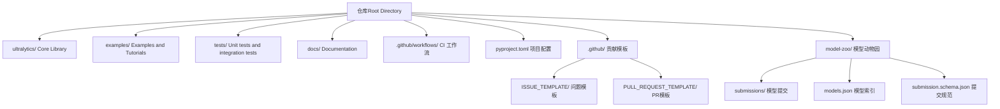
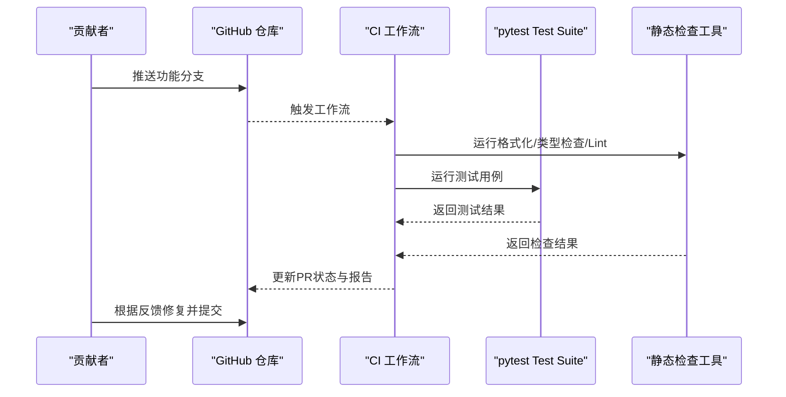
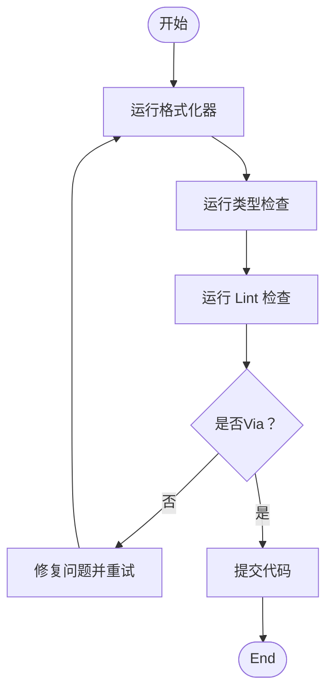
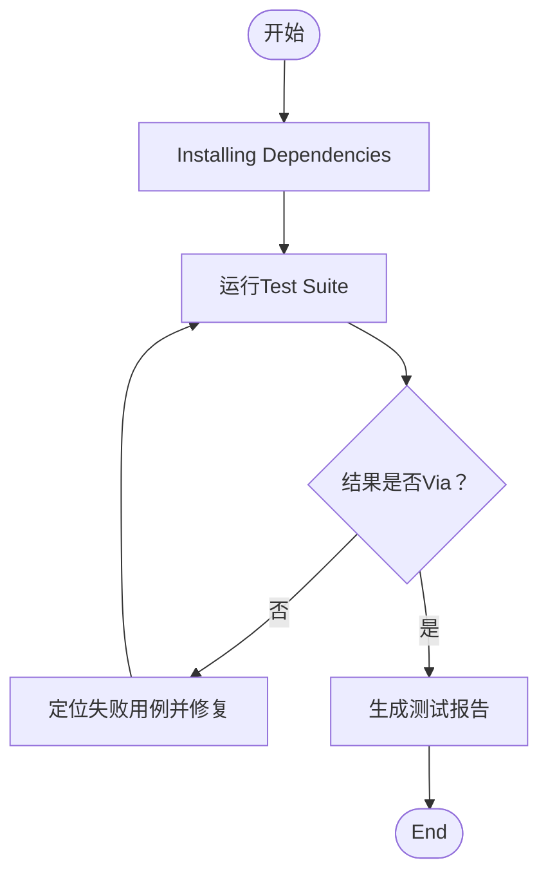
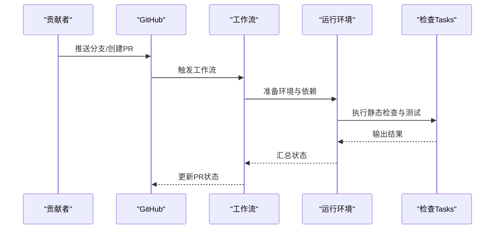
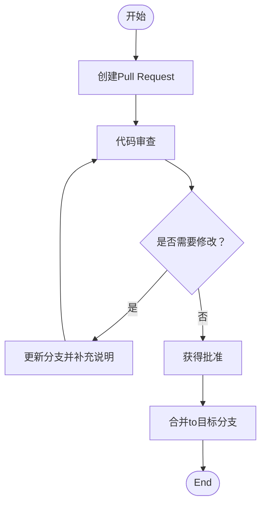
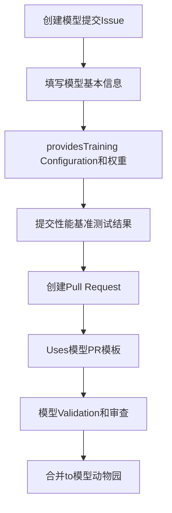
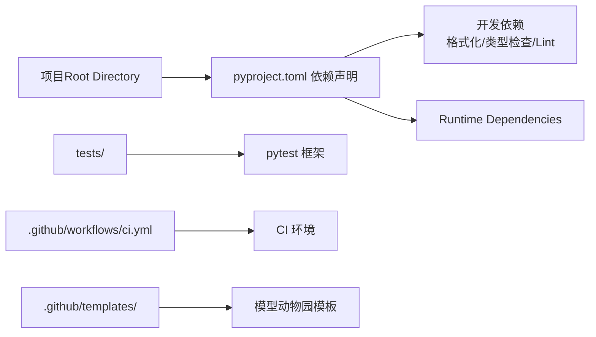

# 代码Contributing Guide

<cite>
**Files Referenced in This Document**
- [CONTRIBUTING.md](file://CONTRIBUTING.md)
- [.github/workflows/ci.yml](file://.github/workflows/ci.yml)
- [pyproject.toml](file://pyproject.toml)
- [tests/conftest.py](file://tests/conftest.py)
- [docs/en/help/contributing.md](file://docs/en/help/contributing.md)
- [docs/en/help/code-of-conduct.md](file://docs/en/help/code-of-conduct.md)
- [.github/ISSUE_TEMPLATE/model-zoo-submission.md](file://.github/ISSUE_TEMPLATE/model-zoo-submission.md)
- [.github/PULL_REQUEST_TEMPLATE/model-zoo-pr-template.md](file://.github/PULL_REQUEST_TEMPLATE/model-zoo-pr-template.md)
- [model-zoo/submissions/example.yaml](file://model-zoo/submissions/example.yaml)
- [model-zoo/models.json](file://model-zoo/models.json)
- [model-zoo/submission.schema.json](file://model-zoo/submission.schema.json)
</cite>

## 更新摘要
**变更内容**
- 新增模型动物园贡献模板和工作流章节
- 添加标准化的模型提交流程说明
- 扩展Pull Request模板Uses指南
- 完善模型提交格式要求和Validation流程

## Table of Contents
1. [Introduction](#Introduction)
2. [Project Structure](#Project Structure)
3. [Core Components](#Core Components)
4. [Architecture Overview](#Architecture Overview)
5. [Detailed Component Analysis](#Detailed Component Analysis)
6. [Dependency Analysis](#Dependency Analysis)
7. [Performance Considerations](#Performance Considerations)
8. [Troubleshooting Guide](#Troubleshooting Guide)
9. [Conclusion](#Conclusion)
10. [Appendix](#Appendix)

## Introduction
本指南targeting希望for YOLO-Master 项目贡献代码的开发者，provides从环境搭建、分支and提交规范、静态检查and测试，to Pull Request 流程and代码审查清单的完整说明。目标是让贡献者Centered on一致的方式协作，确保代码质量and可维护性。

## Project Structure
The repository adopts a modular organization：
- The core library is located in ultralytics/ 下，包含模型、引擎、数据、工具etc.Modules
- Examples and Tutorialswhile examples/
- 自动化测试while tests/
- Documentationwhile docs/
- 持续集成配置while .github/workflows/
- 项目级配置（含开发工具）while pyproject.toml
- 模型动物园模板和配置文件while .github/ 和 model-zoo/ Table of Contents下

## Core Components
- 贡献入口and规范
  - 贡献流程、行for准则and帮助Documentation位于 docs/en/help/ and CONTRIBUTING.md
- 持续集成
  - GitHub Actions 工作流定义while .github/workflows/ 中，用于触发构建and测试
- 开发and质量工具
  - 格式化、类型检查、Lint etc.工具的配置集中while pyproject.toml
- 测试框架
  - pytest 配置and夹具while tests/conftest.py
- 模型动物园贡献模板
  - 标准化的模型提交流程Via ISSUE_TEMPLATE 和 PULL_REQUEST_TEMPLATE provides
  - 模型提交格式规范由 submission.schema.json 定义

**Section Source**
- [CONTRIBUTING.md](file://CONTRIBUTING.md)
- [docs/en/help/contributing.md](file://docs/en/help/contributing.md)
- [docs/en/help/code-of-conduct.md](file://docs/en/help/code-of-conduct.md)
- [.github/workflows/ci.yml](file://.github/workflows/ci.yml)
- [pyproject.toml](file://pyproject.toml)
- [tests/conftest.py](file://tests/conftest.py)
- [.github/ISSUE_TEMPLATE/model-zoo-submission.md](file://.github/ISSUE_TEMPLATE/model-zoo-submission.md)
- [.github/PULL_REQUEST_TEMPLATE/model-zoo-pr-template.md](file://.github/PULL_REQUEST_TEMPLATE/model-zoo-pr-template.md)
- [model-zoo/submission.schema.json](file://model-zoo/submission.schema.json)

## Architecture Overview
下图展示了贡献者while本地完成改动后，Via Git 推送并发起 PR，由 CI 自动执行静态检查and测试的整体流程。

**Figure Source**
- [.github/workflows/ci.yml](file://.github/workflows/ci.yml)
- [pyproject.toml](file://pyproject.toml)
- [tests/conftest.py](file://tests/conftest.py)

## Detailed Component Analysis

### 分支管理and提交规范
- 分支策略
  - 主分支保护：避免直接向受保护分支直接推送
  - 功能分支命名：建议Centered on"特性/问题"语义化命名，便于追踪
  - 发布分支：按版本或里程碑创建，合并前需Via全部检查
- 提交信息格式
  - Uses清晰的主题行，必要时附带详细描述
  - 将变更and相关Tasks或问题关联
- 常见场景
  - 新功能：基于最新主分支创建功能分支
  - Bug 修复：从受影响分支拉取修复分支
  - Documentation改进：独立分支，聚焦Documentation变更

**Section Source**
- [CONTRIBUTING.md](file://CONTRIBUTING.md)
- [docs/en/help/contributing.md](file://docs/en/help/contributing.md)

### 代码风格and静态检查
- 统一格式化
  - Uses项目配置的 Python 格式化器，保证风格一致
- 类型检查
  - 启用类型检查Centered on提升健壮性and可读性
- Linting
  - 遵循统一的规则集，提前发现潜while问题
- 本地预检
  - 建议while提交前本地运行格式化、类型检查and Lint，减少 CI 失败

**Figure Source**
- [pyproject.toml](file://pyproject.toml)

**Section Source**
- [pyproject.toml](file://pyproject.toml)

### 测试andValidation
- 测试框架
  - Uses pytest 组织and运行测试
- 基础测试
  - 快速Validation核心路径and关键用例
- 扩展测试
  - 针对新增功能编写单测and集成测试，覆盖边界条件and错误路径
- 测试配置
  - 夹具and全局设置while tests/conftest.py 中管理

**Figure Source**
- [tests/conftest.py](file://tests/conftest.py)

**Section Source**
- [tests/conftest.py](file://tests/conftest.py)

### 持续集成and工作流
- 触发条件
  - 推送至功能分支或发起 PR 时自动触发
- 执行步骤
  - Installing Dependencies
  - 运行静态检查
  - 运行Test Suite
  - 上传必要产物and报告
- 失败处理
  - 根据Logging定位问题，修复后重新推送触发再次检查

**Figure Source**
- [.github/workflows/ci.yml](file://.github/workflows/ci.yml)

**Section Source**
- [.github/workflows/ci.yml](file://.github/workflows/ci.yml)

### Pull Request 流程and代码审查
- 发起 PR
  - 选择目标分支，填写变更说明and影响范围
  - 附上相关截图或Logging（such as适用）
- 审查要点
  - 正确性：逻辑and边界条件
  - 可维护性：结构and注释
  - 兼容性：接口and行for不变性
  - 性能：无显著退化
  - 测试：覆盖新增and修改路径
- 合并策略
  - Via所有检查后进行合并
  - 保持历史整洁，必要时进行变基整理

**Section Source**
- [CONTRIBUTING.md](file://CONTRIBUTING.md)
- [docs/en/help/contributing.md](file://docs/en/help/contributing.md)

### 模型动物园贡献流程

**新增** 项目现已provides标准化的模型动物园贡献模板和工作流，简化社区成员的模型提交流程。

#### 模型提交模板
项目provides了专门的 Issue 模板用于模型提交申请：
- 模板位置：`.github/ISSUE_TEMPLATE/model-zoo-submission.md`
- 用途：标准化模型基本信息、Training Configuration、性能Metricsetc.元数据收集
- 要求：完整填写所有必填字段，确保模型信息准确性

#### 模型提交流程

#### 模型提交格式规范
- 配置文件：遵循 `submission.schema.json` 定义的JSON Schema
- 权重文件：Supporting标准YOLO格式模型权重
- Documentation要求：包含完整的Training数据集、超参数和Evaluation结果
- Validation流程：自动化的格式检查和完整性Validation

#### Pull Request 模板
针对模型提交的专用PR模板：
- 模板位置：`.github/PULL_REQUEST_TEMPLATE/model-zoo-pr-template.md`
- 内容要求：详细说明模型特性、Training环境、性能对比
- 审查清单：确保模型质量和Documentation完整性

**Section Source**
- [.github/ISSUE_TEMPLATE/model-zoo-submission.md](file://.github/ISSUE_TEMPLATE/model-zoo-submission.md)
- [.github/PULL_REQUEST_TEMPLATE/model-zoo-pr-template.md](file://.github/PULL_REQUEST_TEMPLATE/model-zoo-pr-template.md)
- [model-zoo/submission.schema.json](file://model-zoo/submission.schema.json)
- [model-zoo/submissions/example.yaml](file://model-zoo/submissions/example.yaml)
- [model-zoo/models.json](file://model-zoo/models.json)

### 社区行for准则and沟通渠道
- 行for准则
  - 尊重、包容and建设性沟通
  - 遵守社区规范，营造友好协作氛围
- 沟通渠道
  - Uses Issue and PR 讨论技术细节
  - whileDocumentationand评论中保持清晰and准确
- 模型贡献沟通
  - Via专用的模型提交模板进行沟通
  - 遵循标准化的模型描述格式

**Section Source**
- [docs/en/help/code-of-conduct.md](file://docs/en/help/code-of-conduct.md)

## Dependency Analysis
- 开发依赖
  - 格式化、类型检查、Lint and测试工具while项目配置中声明
- Runtime Dependencies
  - Core LibraryandExamples所需的第三方包
- 版本锁定
  - Recommended to use虚拟环境或容器，确保一致性

**Figure Source**
- [pyproject.toml](file://pyproject.toml)
- [.github/workflows/ci.yml](file://.github/workflows/ci.yml)

**Section Source**
- [pyproject.toml](file://pyproject.toml)

## Performance Considerations
- while引入新算法或Optimization时，provides基准对比and回归测试
- 避免不必要的对象创建and拷贝，关注内存and计算热点
- 对大规模Data processing路径增加增量Validationand采样测试
- 模型提交时需provides性能基准测试结果，确保质量可控

## Troubleshooting Guide
- 本地失败
  - 逐步运行格式化、类型检查and Lint，定位问题
  - 缩小测试范围，复现最小用例
- CI 失败
  - 查看工作流Logging，确认失败阶段
  - while本地复现相同环境并调试
- 模型提交问题
  - 检查提交格式是否符合 schema 规范
  - Validation模型权重文件的完整性和可加载性
  - 确认性能测试结果的有效性和可比性
- 常见问题
  - 依赖冲突：清理缓存并Uses隔离环境
  - 平台差异：while目标平台或容器中Validation

**Section Source**
- [.github/workflows/ci.yml](file://.github/workflows/ci.yml)
- [pyproject.toml](file://pyproject.toml)

## Conclusion
遵循本指南的分支and提交规范、代码风格and静态检查要求、测试and CI 流程，Centered onand代码审查清单，有助于提升协作效率and代码质量。新增的模型动物园贡献模板进一步简化了社区贡献流程，使模型分享更加标准化和规范化。遇to问题时，优先while本地复现并逐步定位，再Combining CI Logging进行修复。

## Appendix
- 常用命令
  - Installing Dependencies：Refer to项目配置for dependency declarations
  - 运行格式化and检查：Uses项目配置的工具链
  - 运行测试：Uses测试框架执行套件
- Refer toDocumentation
  - Contributing Guideand行for准则See docs/en/help/ and CONTRIBUTING.md
- 模型贡献资源
  - 模型提交模板：`.github/ISSUE_TEMPLATE/model-zoo-submission.md`
  - 模型PR模板：`.github/PULL_REQUEST_TEMPLATE/model-zoo-pr-template.md`
  - 提交格式规范：`model-zoo/submission.schema.json`
  - Examples提交：`model-zoo/submissions/example.yaml`

**Section Source**
- [CONTRIBUTING.md](file://CONTRIBUTING.md)
- [docs/en/help/contributing.md](file://docs/en/help/contributing.md)
- [docs/en/help/code-of-conduct.md](file://docs/en/help/code-of-conduct.md)
- [pyproject.toml](file://pyproject.toml)
- [.github/ISSUE_TEMPLATE/model-zoo-submission.md](file://.github/ISSUE_TEMPLATE/model-zoo-submission.md)
- [.github/PULL_REQUEST_TEMPLATE/model-zoo-pr-template.md](file://.github/PULL_REQUEST_TEMPLATE/model-zoo-pr-template.md)
- [model-zoo/submission.schema.json](file://model-zoo/submission.schema.json)
- [model-zoo/submissions/example.yaml](file://model-zoo/submissions/example.yaml)