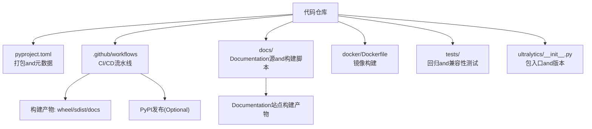
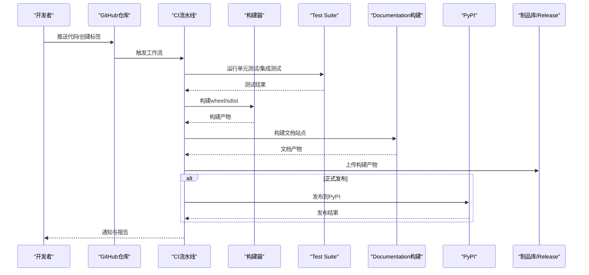
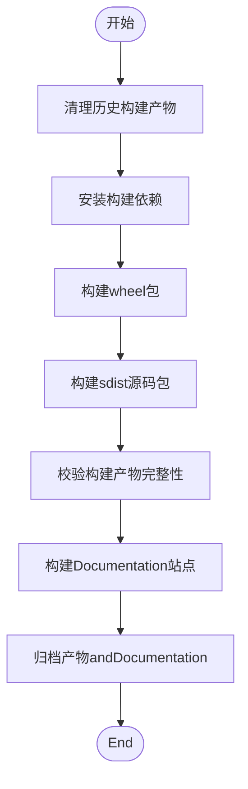
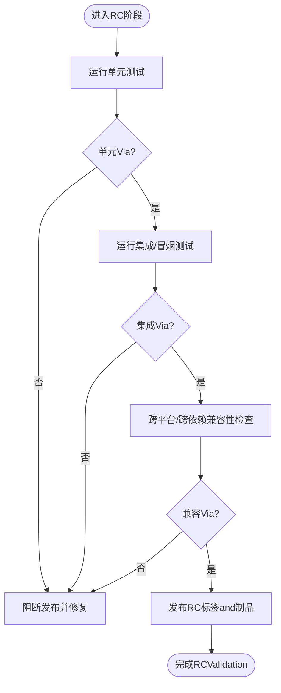
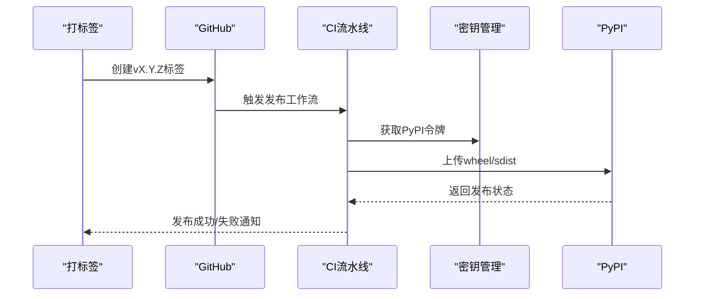
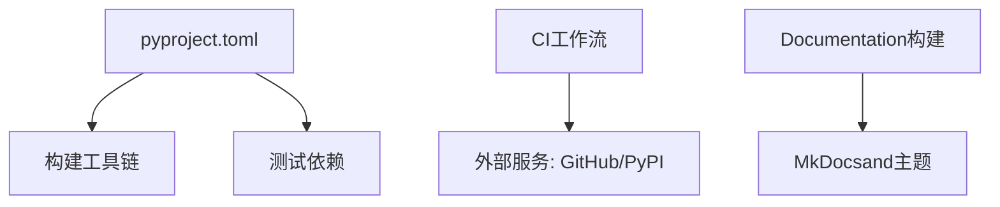

# 版本发布管理

<cite>
**Files Referenced in This Document**
- [pyproject.toml](file://pyproject.toml)
- [.github/workflows/publish.yml](file://.github/workflows/publish.yml)
- [.github/workflows/ci.yml](file://.github/workflows/ci.yml)
- [mkdocs.yml](file://mkdocs.yml)
- [docs/build_docs.py](file://docs/build_docs.py)
- [docker/Dockerfile](file://docker/Dockerfile)
- [tests/conftest.py](file://tests/conftest.py)
- [ultralytics/__init__.py](file://ultralytics/__init__.py)
</cite>

## Table of Contents
1. [Introduction](#Introduction)
2. [Project Structure](#Project Structure)
3. [Core Components](#Core Components)
4. [Architecture Overview](#Architecture Overview)
5. [Detailed Component Analysis](#Detailed Component Analysis)
6. [Dependency Analysis](#Dependency Analysis)
7. [Performance Considerations](#Performance Considerations)
8. [Troubleshooting Guide](#Troubleshooting Guide)
9. [Conclusion](#Conclusion)
10. [Appendix](#Appendix)

## Introduction
本指南targetingYOLO-Master项目的维护者and贡献者，provides一套完整的版本发布管理规范and操作手册。内容覆盖语义化版本控制策略、候选版本测试andValidation流程、构建产物打包（wheel、源码包、Documentation）、PyPI自动化发布and权限管理、变更Logging维护and生成、回滚and紧急修复流程、发布后监控and问题响应，Centered onand多仓库同步发布的协调方法。目标是确保每次发布可重复、可追溯、风险可控，并具备快速恢复capabilities。

## Project Structure
and发布相关的工程化要素主要分布whileCentered on下位置：
- 元数据and打包配置：pyproject.toml
- CI/CD流水线：.github/workflows/*.yml
- Documentation构建：mkdocs.yml、docs/build_docs.py
- Container Images：docker/Dockerfile
- 测试框架and用例：tests/*
- 包入口and版本信息：ultralytics/__init__.py

Figure Source
- [pyproject.toml](file://pyproject.toml)
- [.github/workflows/publish.yml](file://.github/workflows/publish.yml)
- [.github/workflows/ci.yml](file://.github/workflows/ci.yml)
- [mkdocs.yml](file://mkdocs.yml)
- [docs/build_docs.py](file://docs/build_docs.py)
- [docker/Dockerfile](file://docker/Dockerfile)
- [tests/conftest.py](file://tests/conftest.py)
- [ultralytics/__init__.py](file://ultralytics/__init__.py)

Section Source
- [pyproject.toml](file://pyproject.toml)
- [.github/workflows/publish.yml](file://.github/workflows/publish.yml)
- [.github/workflows/ci.yml](file://.github/workflows/ci.yml)
- [mkdocs.yml](file://mkdocs.yml)
- [docs/build_docs.py](file://docs/build_docs.py)
- [docker/Dockerfile](file://docker/Dockerfile)
- [tests/conftest.py](file://tests/conftest.py)
- [ultralytics/__init__.py](file://ultralytics/__init__.py)

## Core Components
- 语义化版本控制
  - 主版本(MAJOR)：不兼容的API或行for变更、破坏性重构、重大Model Format变更。
  - 次版本(MINOR)：新增功能、向后兼容的功能增强、新Export Backends或数据集Supporting。
  - 补丁版本(PATCH)：缺陷修复、稳定性提升、小范围Optimization；保持API稳定。
- 发布候选(RC)
  - RC用于回归测试and兼容性检查，Via后再打正式标签。
  - RC版本号后缀Uses“-rc.N”（例such as“1.2.3-rc.1”）。
- 预发布and开发流
  - 开发分支采用特性分支+PR合并策略；发布分支仅接受修复andDocumentation更新。
  - 预发布版本can use“.devN”、“a/b/rc”etc.后缀，避免污染稳定通道。

Section Source
- [pyproject.toml](file://pyproject.toml)
- [ultralytics/__init__.py](file://ultralytics/__init__.py)

## Architecture Overview
下图展示从代码提交to发布产物的端to端流程，包括构建、测试、打包and发布环节。

Figure Source
- [.github/workflows/publish.yml](file://.github/workflows/publish.yml)
- [.github/workflows/ci.yml](file://.github/workflows/ci.yml)
- [docs/build_docs.py](file://docs/build_docs.py)
- [mkdocs.yml](file://mkdocs.yml)

## Detailed Component Analysis

### 版本and元数据管理
- 版本定义位置
  - Python包入口中声明当前版本字符串，供安装器读取and校验。
  - pyproject.toml中集中管理打包元数据、依赖and构建选项。
- 版本一致性要求
  - 所有发布标签必须and包内版本一致。
  - 禁止while稳定分支上直接修改版本，应Via发布分支and标签机制。
- 建议实践
  - Uses工具自动从git标签推导版本，减少人for错误。
  - whileCI中增加版本一致性校验步骤。

Section Source
- [ultralytics/__init__.py](file://ultralytics/__init__.py)
- [pyproject.toml](file://pyproject.toml)

### 构建and打包流程
- 构建目标
  - wheel包：二进制/纯Python分发包，便于pip安装。
  - sdist源码包：包含完整源码and元数据，便于二次构建and审计。
  - Documentation站点：基于MkDocs构建静态站点，作for发布附件。
- 构建环境
  - Recommended to use固定版本的Pythonand构建工具链，确保可重复性。
  - 可ViaDocker镜像固化构建环境。
- 关键步骤
  - 清理旧产物，安装构建依赖。
  - 执行构建命令生成wheelandsdist。
  - 对构建产物进行完整性校验（such as哈希、签名）。
  - 构建Documentation站点并归档for发布附件。

Figure Source
- [pyproject.toml](file://pyproject.toml)
- [docs/build_docs.py](file://docs/build_docs.py)
- [mkdocs.yml](file://mkdocs.yml)
- [docker/Dockerfile](file://docker/Dockerfile)

Section Source
- [pyproject.toml](file://pyproject.toml)
- [docs/build_docs.py](file://docs/build_docs.py)
- [mkdocs.yml](file://mkdocs.yml)
- [docker/Dockerfile](file://docker/Dockerfile)

### 测试andValidation流程（RC阶段）
- 回归测试
  - 运行全量单元测试and关键路径集成测试，确保无回归。
  - 针对Export、Training、Inference、Trackingetc.核心模式执行冒烟测试。
- 兼容性检查
  - while不同Python版本、Operating Systemand硬件平台（CPU/GPU）上Verifying Installationand基础功能。
  - 检查第三方依赖版本约束是否满足下游User常见环境。
- 质量门禁
  - 设置失败阈值and覆盖率门槛，未达标则阻断发布。
  - 记录测试报告andLogging，便于回溯。

Figure Source
- [.github/workflows/ci.yml](file://.github/workflows/ci.yml)
- [tests/conftest.py](file://tests/conftest.py)

Section Source
- [.github/workflows/ci.yml](file://.github/workflows/ci.yml)
- [tests/conftest.py](file://tests/conftest.py)

### PyPI发布and权限管理
- 自动化发布
  - 仅while打正式标签时触发PyPI发布，避免误发。
  - Uses受保护的变量存储PyPI令牌，限制访问范围。
- 权限最小化
  - forCI账户授予只读或受限写入权限，定期轮换令牌。
  - 启用双因素认证andIP白名单（若平台Supporting）。
- 安全校验
  - 发布前对构建产物进行签名and校验和Validation。
  - 记录发布流水线and审计Logging。

Figure Source
- [.github/workflows/publish.yml](file://.github/workflows/publish.yml)

Section Source
- [.github/workflows/publish.yml](file://.github/workflows/publish.yml)

### 变更Logging维护and生成
- 规范
  - 按类型组织条目：新增、修复、变更、废弃、移除、安全、性能、Documentation。
  - 每个条目关联相关Issue或PR编号，便于追踪。
- 生成方式
  - 基于git标签and提交消息自动生成初稿，人工审核完善。
  - 将变更Logging纳入发布附件，并while发布说明中摘要关键变更。
- 版本对齐
  - 变更Logging版本andPyPI版本严格对应，避免歧义。

Section Source
- [pyproject.toml](file://pyproject.toml)

### 回滚and紧急修复流程
- 回滚策略
  - 优先whilePyPI下架问题版本，并引导User安装上一个稳定版本。
  - 若需热修复，遵循补丁版本策略，尽快发布修复版。
- 紧急修复
  - 从最近稳定标签创建hotfix分支，最小化变更并ViaCI。
  - 打补丁标签并发布，同时while变更Loggingand安全公告中说明影响范围。
- 沟通and透明
  - 发布后and时更新READMEand公告，providesMigration指引and已知问题清单。

Section Source
- [pyproject.toml](file://pyproject.toml)

### 发布后监控and问题响应
- 监控Metrics
  - 下载量趋势、安装失败率、崩溃and异常上报。
  - 社区反馈渠道（Issue、讨论区、邮件列表）的响应时效。
- 问题响应
  - 建立分级响应机制（P0-P3），明确SLAand升级路径。
  - 复现and定位：收集环境信息、Loggingand最小复现代码。
- 持续改进
  - 将常见问题沉淀forFAQand最佳实践。
  - 根据反馈调整测试矩阵and兼容性检查项。

Section Source
- [.github/workflows/ci.yml](file://.github/workflows/ci.yml)

### 多仓库同步发布协调
- 同步原则
  - Centered on主仓库的版本号for基准，其他仓库Via引用主仓库标签或制品进行同步。
  - Uses统一的变更Logging模板and发布说明，保证对外一致性。
- 自动化协同
  - while主仓库发布成功后，触发下游仓库的同步工作流。
  - 对依赖关系进行锁定and校验，防止版本漂移。
- 风险控制
  - 先灰度同步部分仓库，观察Metrics后再全量推进。
  - 保留回滚窗口and快速回退方案。

Section Source
- [.github/workflows/publish.yml](file://.github/workflows/publish.yml)
- [.github/workflows/ci.yml](file://.github/workflows/ci.yml)

## Dependency Analysis
- 构建and发布依赖
  - 构建工具链：Python、打包工具、Documentation构建工具。
  - 测试依赖：测试框架、覆盖率工具、模拟数据。
- 外部服务依赖
  - GitHub Actions、PyPI、制品库（Optional）。
- 依赖治理
  - 固定关键依赖版本，定期扫描漏洞and许可证合规。
  - whileCI中缓存依赖，缩短构建时间。

Figure Source
- [pyproject.toml](file://pyproject.toml)
- [.github/workflows/publish.yml](file://.github/workflows/publish.yml)
- [.github/workflows/ci.yml](file://.github/workflows/ci.yml)
- [mkdocs.yml](file://mkdocs.yml)

Section Source
- [pyproject.toml](file://pyproject.toml)
- [.github/workflows/publish.yml](file://.github/workflows/publish.yml)
- [.github/workflows/ci.yml](file://.github/workflows/ci.yml)
- [mkdocs.yml](file://mkdocs.yml)

## Performance Considerations
- 构建Optimization
  - 并行构建and缓存依赖，减少冷启动开销。
  - 按需构建特定平台wheel，降低制品体积。
- 测试Optimization
  - 分层测试：快速冒烟测试先行，全量测试异步执行。
  - Uses分布式测试and并行执行，缩短反馈周期。
- Documentation构建
  - 增量构建and资源压缩，提高站点加载速度。

[本节for通用指导，无需具体文件分析]

## Troubleshooting Guide
- 常见问题
  - 构建失败：检查Python版本、依赖冲突and系统库缺失。
  - 测试失败：确认测试数据可用、环境变量正确、设备drivers are installed正常。
  - 发布失败：核对令牌权限、网络连通性andPyPI限流策略。
- 诊断手段
  - 查看CILoggingand测试报告，定位失败步骤。
  - 本地复现相同环境，逐步缩小问题范围。
- 恢复措施
  - 回退to上一个稳定版本，优先保障可用性。
  - 修复后走快速通道发布补丁版本。

Section Source
- [.github/workflows/ci.yml](file://.github/workflows/ci.yml)
- [tests/conftest.py](file://tests/conftest.py)

## Conclusion
Via严格的语义化版本控制、完善的RCValidation流程、标准化的构建and发布流水线、安全的权限管理and透明的变更Logging，YOLO-Master可implementing高质量、可重复且可追溯的版本发布。Combined with发布后监控and问题响应机制，Centered onand多仓库同步协调策略，能够显著提升交付效率andUser体验。

[本节for总结性内容，无需具体文件分析]

## Appendix
- 术语表
  - 语义化版本：MAJOR.MINOR.PATCH
  - RC：发布候选
  - sdist：源码包
  - wheel：二进制分发包
- Refer to链接
  - 打包and发布官方Documentation
  - MkDocsDocumentation构建指南
  - PyPI安全and权限最佳实践

[本节for补充信息，无需具体文件分析]