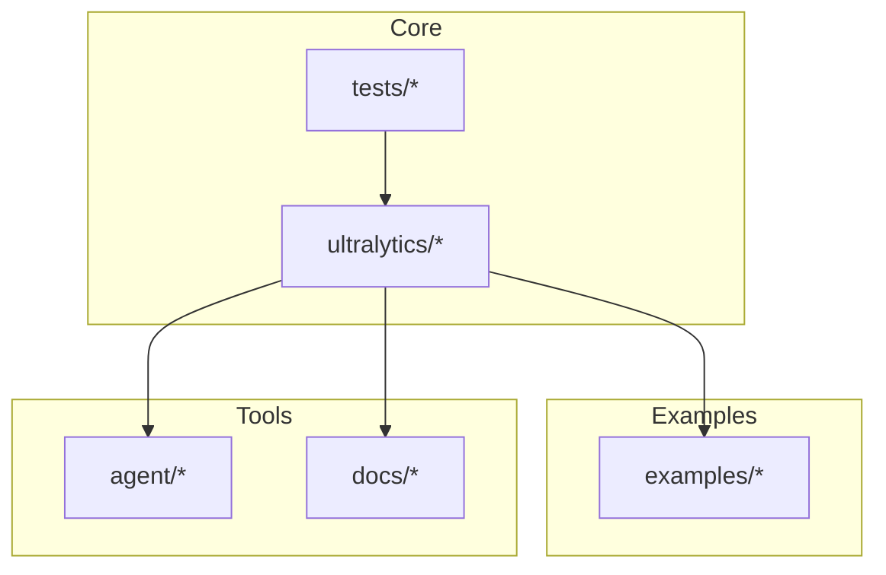
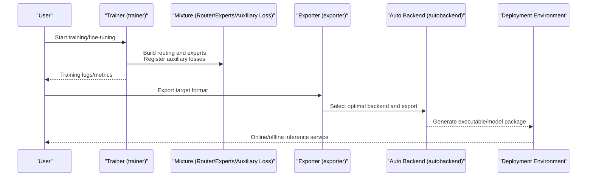
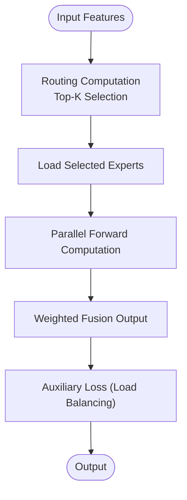
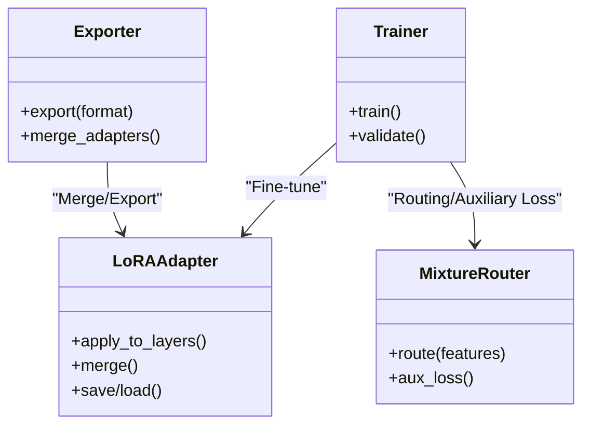
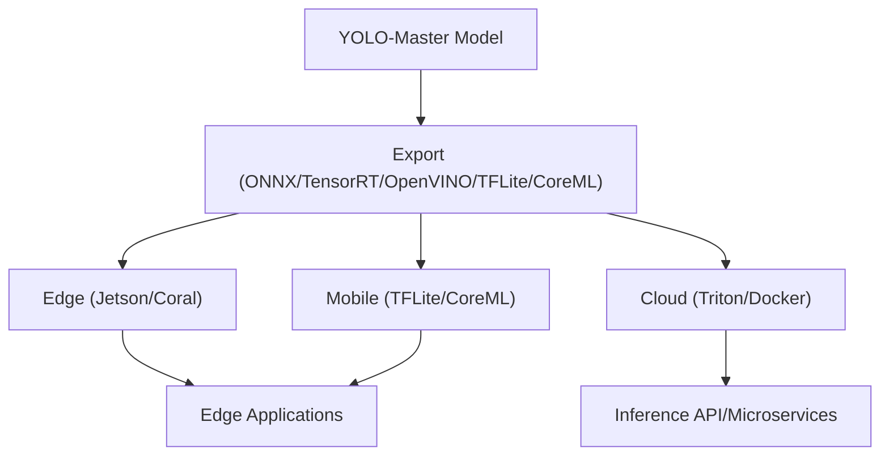
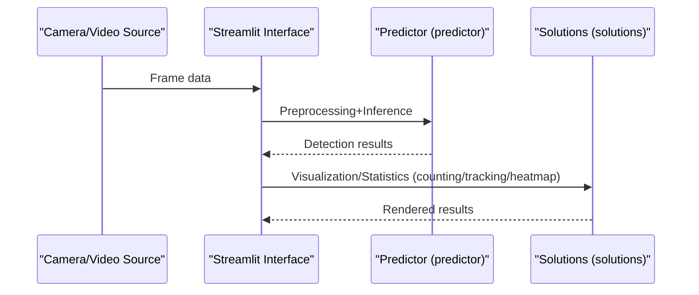
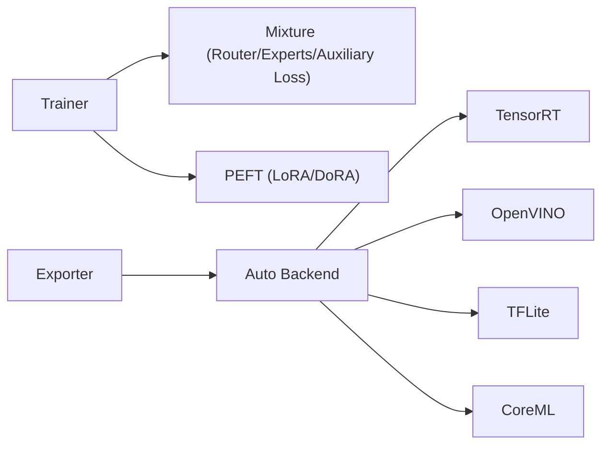

# Advanced Application Examples

<cite>
**Files referenced in this document**
- [README.md](file://README.md)
- [molora_guide.md](file://docs/molora_guide.md)
- [LoRA_Quickstart.md](file://docs/LoRA_Quickstart.md)
- [yolo26-mixture-compatibility.md](file://docs/en/guides/yolo26-mixture-compatibility.md)
- [model-deployment-options.md](file://docs/en/guides/model-deployment-options.md)
- [triton-inference-server.md](file://docs/en/guides/triton-inference-server.md)
- [nvidia-jetson.md](file://docs/en/guides/nvidia-jetson.md)
- [coral-edge-tpu-on-raspberry-pi.md](file://docs/en/guides/coral-edge-tpu-on-raspberry-pi.md)
- [streamlit-live-inference.md](file://docs/en/guides/streamlit-live-inference.md)
- [solutions.py](file://ultralytics/solutions/solutions.py)
- [streamlit_inference.py](file://ultralytics/solutions/streamlit_inference.py)
- [exporter.py](file://ultralytics/engine/exporter.py)
- [trainer.py](file://ultralytics/engine/trainer.py)
- [predictor.py](file://ultralytics/engine/predictor.py)
- [autobackend.py](file://ultralytics/nn/autobackend.py)
- [mixture_loss.py](file://ultralytics/nn/mixture_loss.py)
- [mixture_registry.py](file://ultralytics/nn/mixture_registry.py)
- [lora_tools.py](file://agent/runtime/cli/lora_tools.py)
- [moe_tools.py](file://agent/runtime/cli/moe_tools.py)
- [test_moe.py](file://tests/test_moe.py)
- [test_moa.py](file://tests/test_moa.py)
- [test_molora.py](file://tests/test_molora.py)
- [test_lora_moe_ddp_control_paths.py](file://tests/test_lora_moe_ddp_control_paths.py)
- [run_yolo_master_lora_rank_sweep.py](file://examples/lora_examples/run_yolo_master_lora_rank_sweep.py)
- [basic_finetune.py](file://examples/molora/basic_finetune.py)
- [compare_coco128_fast.py](file://examples/molora/compare_coco128_fast.py)
- [YOLO-Master-Cross-Platform-Edge-Deployment/TECHNICAL_REPORT.md](file://examples/YOLO-Master-Cross-Platform-Edge-Deployment/TECHNICAL_REPORT.md)
- [YOLOv10-Master-MoA/README.md](file://examples/YOLOv10-Master-MoA/README.md)
</cite>

## Table of Contents
1. [Introduction](#introduction)
2. [Project Structure](#project-structure)
3. [Core Components](#core-components)
4. [Architecture Overview](#architecture-overview)
5. [Detailed Component Analysis](#detailed-component-analysis)
6. [Dependency Analysis](#dependency-analysis)
7. [Performance and Deployment Optimization](#performance-and-deployment-optimization)
8. [Troubleshooting Guide](#troubleshooting-guide)
9. [Conclusion](#conclusion)
10. [Appendix](#appendix)

## Introduction
This document is intended for engineers and researchers looking to apply YOLO-Master in industrial-grade scenarios, focusing on the following topics:
- Mixture of Experts (MoE/MoA) configuration, training and routing strategies, load balancing and expert selection
- Parameter-Efficient Fine-Tuning (PEFT), including LoRA and DoRA implementation and applications
- Cross-platform deployment: Complete cases for edge devices, mobile platforms, and cloud services
- Real-time video processing, batch inference services, model optimization, and other practical scenarios
- Custom module development, plugin integration, and secondary development guidance
- Practical experience in performance optimization, memory management, and concurrent processing

## Project Structure
The repository adopts a "functional domain + toolchain" organization:
- ultralytics: Core framework (engine, models, export, solutions, PEFT, Mixture, etc.)
- examples: End-to-end examples (LoRA, MoA, cross-platform deployment, ONNX/TensorRT/OpenVINO, etc.)
- agent: Runtime CLI and tools (LoRA/MoE tools, evaluation scripts, etc.)
- tests: Tests covering critical paths for MoE/MoA/LoRA/MolORA, etc.
- docs: Documentation and guides (deployment, training, MoE compatibility, LoRA quickstart, etc.)

Diagram source
- [README.md:1-200](file://README.md#L1-L200)

Section source
- [README.md:1-200](file://README.md#L1-L200)

## Core Components
- Training and validation engine: Responsible for data loading, optimizer, loss computation, distributed training, and evaluation
- Prediction and export: Unified inference interface and multi-backend export (ONNX/TensorRT/OpenVINO/TFLite/CoreML, etc.)
- Mixture (MoE/MoA): Routing and expert networks, auxiliary losses, dynamic scheduling and sparse dispatch
- PEFT (LoRA/DoRA): Low-rank adaptation, weight merging, routing-aware merge, and comparative evaluation
- Solutions and visualization: Streaming inference, counting, heatmaps, tracking, and other industrial-grade capabilities
- Toolchain: LoRA/MoE diagnostics, routing interpreter, benchmark suite, and regression tests

Section source
- [trainer.py:1-200](file://ultralytics/engine/trainer.py#L1-L200)
- [predictor.py:1-200](file://ultralytics/engine/predictor.py#L1-L200)
- [exporter.py:1-200](file://ultralytics/engine/exporter.py#L1-L200)
- [mixture_loss.py:1-200](file://ultralytics/nn/mixture_loss.py#L1-L200)
- [mixture_registry.py:1-200](file://ultralytics/nn/mixture_registry.py#L1-L200)
- [lora_tools.py:1-200](file://agent/runtime/cli/lora_tools.py#L1-L200)
- [moe_tools.py:1-200](file://agent/runtime/cli/moe_tools.py#L1-L200)

## Architecture Overview
The following diagram shows the key paths from configuration to training, export, and deployment.

Diagram source
- [trainer.py:1-200](file://ultralytics/engine/trainer.py#L1-L200)
- [exporter.py:1-200](file://ultralytics/engine/exporter.py#L1-L200)
- [autobackend.py:1-200](file://ultralytics/nn/autobackend.py#L1-L200)
- [mixture_loss.py:1-200](file://ultralytics/nn/mixture_loss.py#L1-L200)
- [mixture_registry.py:1-200](file://ultralytics/nn/mixture_registry.py#L1-L200)

## Detailed Component Analysis

### Mixture of Experts (MoE/MoA)
- Routing strategy and load balancing
  - Gate input features through the routing module, selecting Top-K experts to participate in computation
  - Auxiliary losses balance expert utilization to prevent "expert collapse"
  - Dynamic scheduling supports adjusting the number of activated experts per layer or per stage
- Expert selection and sparse dispatch
  - Achieve sparse activation based on routing weight ranking and threshold filtering
  - Maintain stable sparsity during both training and inference
- Configuration and training essentials
  - Enable mixture-related fields in model configuration, specifying expert count, Top-K, routing type, and auxiliary loss coefficients
  - When combined with LoRA, ensure routing and adapter weights are compatible with export and merge workflows

Diagram source
- [mixture_loss.py:1-200](file://ultralytics/nn/mixture_loss.py#L1-L200)
- [mixture_registry.py:1-200](file://ultralytics/nn/mixture_registry.py#L1-L200)
- [test_moe.py:1-200](file://tests/test_moe.py#L1-L200)
- [test_moa.py:1-200](file://tests/test_moa.py#L1-L200)

Section source
- [yolo26-mixture-compatibility.md:1-200](file://docs/en/guides/yolo26-mixture-compatibility.md#L1-L200)
- [moe_tools.py:1-200](file://agent/runtime/cli/moe_tools.py#L1-L200)
- [test_moe.py:1-200](file://tests/test_moe.py#L1-L200)
- [test_moa.py:1-200](file://tests/test_moa.py#L1-L200)

### Parameter-Efficient Fine-Tuning (PEFT): LoRA and DoRA
- LoRA applications
  - Inject low-rank matrices into specific layers, freeze backbone weights, significantly reducing memory and storage overhead
  - Support rank sweep and task-adaptive selection for quick parameter tuning across different datasets
- DoRA and routing-aware merge
  - In MoE scenarios, consider the impact of routing weights on merging to ensure consistent behavior after export
  - Provide comparative evaluation scripts to quantify performance differences between different PEFT approaches
- Training and export
  - Only adapter weights are updated during training; can merge or retain separate structure as needed during export
  - When combined with Mixture, pay attention to the order and shape consistency between routing and adapters

Diagram source
- [lora_tools.py:1-200](file://agent/runtime/cli/lora_tools.py#L1-L200)
- [run_yolo_master_lora_rank_sweep.py:1-200](file://examples/lora_examples/run_yolo_master_lora_rank_sweep.py#L1-L200)
- [test_lora_moe_ddp_control_paths.py:1-200](file://tests/test_lora_moe_ddp_control_paths.py#L1-L200)

Section source
- [LoRA_Quickstart.md:1-200](file://docs/LoRA_Quickstart.md#L1-L200)
- [molora_guide.md:1-200](file://docs/molora_guide.md#L1-L200)
- [basic_finetune.py:1-200](file://examples/molora/basic_finetune.py#L1-L200)
- [compare_coco128_fast.py:1-200](file://examples/molora/compare_coco128_fast.py#L1-L200)
- [lora_tools.py:1-200](file://agent/runtime/cli/lora_tools.py#L1-L200)
- [test_lora_moe_ddp_control_paths.py:1-200](file://tests/test_lora_moe_ddp_control_paths.py#L1-L200)

### Cross-Platform Deployment Cases
- Edge devices
  - Jetson: Accelerate with TensorRT/DeepStream, complete end-to-end deployment with export and run scripts
  - Coral Edge TPU: Optimize for low-power scenarios, providing conversion and inference examples
- Mobile and desktop
  - CoreML (macOS/iOS), TFLite (Android/iOS), OpenVINO (Intel CPU/NPU)
- Cloud services and containers
  - Triton Inference Server: Batch processing and concurrent inference, unified entry for GPU/CPU multi-backend
  - Docker image packaging, combined with Kubernetes elastic scaling

Diagram source
- [model-deployment-options.md:1-200](file://docs/en/guides/model-deployment-options.md#L1-L200)
- [triton-inference-server.md:1-200](file://docs/en/guides/triton-inference-server.md#L1-L200)
- [nvidia-jetson.md:1-200](file://docs/en/guides/nvidia-jetson.md#L1-L200)
- [coral-edge-tpu-on-raspberry-pi.md:1-200](file://docs/en/guides/coral-edge-tpu-on-raspberry-pi.md#L1-L200)
- [YOLO-Master-Cross-Platform-Edge-Deployment/TECHNICAL_REPORT.md:1-200](file://examples/YOLO-Master-Cross-Platform-Edge-Deployment/TECHNICAL_REPORT.md#L1-L200)

Section source
- [model-deployment-options.md:1-200](file://docs/en/guides/model-deployment-options.md#L1-L200)
- [triton-inference-server.md:1-200](file://docs/en/guides/triton-inference-server.md#L1-L200)
- [nvidia-jetson.md:1-200](file://docs/en/guides/nvidia-jetson.md#L1-L200)
- [coral-edge-tpu-on-raspberry-pi.md:1-200](file://docs/en/guides/coral-edge-tpu-on-raspberry-pi.md#L1-L200)
- [YOLO-Master-Cross-Platform-Edge-Deployment/TECHNICAL_REPORT.md:1-200](file://examples/YOLO-Master-Cross-Platform-Edge-Deployment/TECHNICAL_REPORT.md#L1-L200)

### Real-Time Video Processing and Batch Inference Services
- Real-time video
  - Use Streamlit to visualize the inference pipeline, supporting camera/video stream reading, preprocessing, inference, and result rendering
  - Can combine with SAHI tiled inference to improve small object detection
- Batch inference services
  - Triton-based batch processing and concurrency control, suitable for high-throughput cloud deployment
  - Combine with queue management, monitoring, and alerts to ensure production stability

Diagram source
- [streamlit_live_inference.md:1-200](file://docs/en/guides/streamlit-live-inference.md#L1-L200)
- [streamlit_inference.py:1-200](file://ultralytics/solutions/streamlit_inference.py#L1-L200)
- [solutions.py:1-200](file://ultralytics/solutions/solutions.py#L1-L200)
- [predictor.py:1-200](file://ultralytics/engine/predictor.py#L1-L200)

Section source
- [streamlit_live_inference.md:1-200](file://docs/en/guides/streamlit-live-inference.md#L1-L200)
- [streamlit_inference.py:1-200](file://ultralytics/solutions/streamlit_inference.py#L1-L200)
- [solutions.py:1-200](file://ultralytics/solutions/solutions.py#L1-L200)
- [predictor.py:1-200](file://ultralytics/engine/predictor.py#L1-L200)

### Custom Module Development and Plugin Integration
- Extension points
  - Insert custom modules at model definition points (e.g., attention variants, routing strategies, loss functions)
  - Register new modules through the registry mechanism and reference them in configuration
- Secondary development recommendations
  - Follow existing interface contracts to ensure compatibility with training/export/inference chains
  - Write unit tests and regression cases for new modules, integrating into CI

Section source
- [mixture_registry.py:1-200](file://ultralytics/nn/mixture_registry.py#L1-L200)
- [mixture_loss.py:1-200](file://ultralytics/nn/mixture_loss.py#L1-L200)
- [test_moe.py:1-200](file://tests/test_moe.py#L1-L200)

### MoA Special Notes
- Applicability and experimental reports of Mixture of Attention (MoA) in vision tasks
- Differences from MoE: MoA focuses more on diversity and complementarity of attention heads

Section source
- [YOLOv10-Master-MoA/README.md:1-200](file://examples/YOLOv10-Master-MoA/README.md#L1-L200)

## Dependency Analysis
- Component coupling
  - Trainer depends on Mixture and PEFT modules; Exporter depends on auto backend selection
  - Routing and expert modules are decoupled through the registry for easy replacement and extension
- External dependencies
  - Export backends (TensorRT/OpenVINO/TFLite/CoreML/ONNXRuntime)
  - Deployment services (Triton/Docker/Kubernetes)

Diagram source
- [trainer.py:1-200](file://ultralytics/engine/trainer.py#L1-L200)
- [exporter.py:1-200](file://ultralytics/engine/exporter.py#L1-L200)
- [autobackend.py:1-200](file://ultralytics/nn/autobackend.py#L1-L200)

Section source
- [trainer.py:1-200](file://ultralytics/engine/trainer.py#L1-L200)
- [exporter.py:1-200](file://ultralytics/engine/exporter.py#L1-L200)
- [autobackend.py:1-200](file://ultralytics/nn/autobackend.py#L1-L200)

## Performance and Deployment Optimization
- Model optimization
  - Select appropriate export format and precision (FP16/INT8), combined with TensorRT/OpenVINO operator optimization
  - Use automated backend selection to automatically match the optimal backend based on hardware characteristics
- Memory and concurrency
  - Properly set batch size and thread pool size to avoid OOM
  - Use Triton's batch processing and concurrent queues in the cloud to improve throughput
- Routing and sparsity
  - Adjust Top-K and routing thresholds to balance accuracy and latency
  - Monitor expert usage distribution, introduce rebalancing strategies when necessary

Section source
- [model-deployment-options.md:1-200](file://docs/en/guides/model-deployment-options.md#L1-L200)
- [triton-inference-server.md:1-200](file://docs/en/guides/triton-inference-server.md#L1-L200)
- [autobackend.py:1-200](file://ultralytics/nn/autobackend.py#L1-L200)

## Troubleshooting Guide
- Common issue identification
  - Routing NaN/explosion: Check routing initialization and numerical stability strategies
  - Expert collapse: Adjust auxiliary loss coefficients and load balancing strategies
  - Export failure: Verify backend dependencies and model structure compatibility
- Diagnostic tools
  - Use MoE/LoRA tools for routing and adapter state inspection
  - Refer to test cases to reproduce issue paths, gradually narrowing the scope

Section source
- [moe_tools.py:1-200](file://agent/runtime/cli/moe_tools.py#L1-L200)
- [lora_tools.py:1-200](file://agent/runtime/cli/lora_tools.py#L1-L200)
- [test_moe.py:1-200](file://tests/test_moe.py#L1-L200)
- [test_molora.py:1-200](file://tests/test_molora.py#L1-L200)

## Conclusion
YOLO-Master provides integrated capabilities from training, fine-tuning, export to deployment. Through MoE/MoA routing and sparsity mechanisms, LoRA/DoRA parameter-efficient fine-tuning, and comprehensive cross-platform deployment solutions, high-performance and low-cost production deployment can be achieved across edge, mobile, and cloud scenarios. It is recommended to combine testing and diagnostic tools in engineering, continuously monitor routing and expert usage, and iteratively optimize based on business requirements.

## Appendix
- Quickstart and examples
  - LoRA quickstart and rank sweep examples
  - MolORA basic fine-tuning and comparison scripts
  - Cross-platform deployment technical report and example projects

Section source
- [LoRA_Quickstart.md:1-200](file://docs/LoRA_Quickstart.md#L1-L200)
- [molora_guide.md:1-200](file://docs/molora_guide.md#L1-L200)
- [run_yolo_master_lora_rank_sweep.py:1-200](file://examples/lora_examples/run_yolo_master_lora_rank_sweep.py#L1-L200)
- [basic_finetune.py:1-200](file://examples/molora/basic_finetune.py#L1-L200)
- [compare_coco128_fast.py:1-200](file://examples/molora/compare_coco128_fast.py#L1-L200)
- [YOLO-Master-Cross-Platform-Edge-Deployment/TECHNICAL_REPORT.md:1-200](file://examples/YOLO-Master-Cross-Platform-Edge-Deployment/TECHNICAL_REPORT.md#L1-L200)
